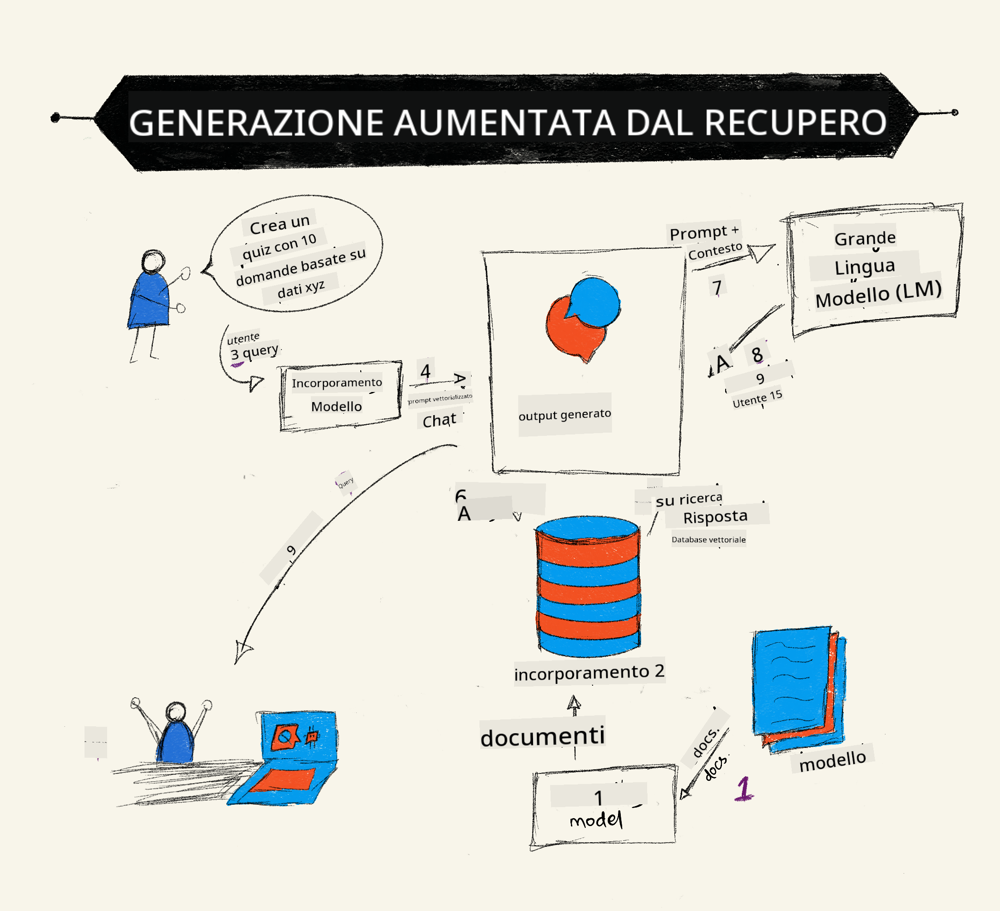

<!--
CO_OP_TRANSLATOR_METADATA:
{
  "original_hash": "b4b0266fbadbba7ded891b6485adc66d",
  "translation_date": "2025-10-17T16:08:22+00:00",
  "source_file": "15-rag-and-vector-databases/README.md",
  "language_code": "it"
}
-->
# Generazione Aumentata dal Recupero (RAG) e Database a Vettori

[](https://youtu.be/4l8zhHUBeyI?si=BmvDmL1fnHtgQYkL)

Nella lezione sulle applicazioni di ricerca, abbiamo brevemente imparato come integrare i tuoi dati nei modelli di linguaggio di grandi dimensioni (LLMs). In questa lezione, approfondiremo i concetti di radicare i tuoi dati nella tua applicazione LLM, i meccanismi del processo e i metodi per archiviare i dati, inclusi sia gli embedding che il testo.

> **Video in arrivo**

## Introduzione

In questa lezione tratteremo i seguenti argomenti:

- Un'introduzione a RAG, cos'è e perché viene utilizzato nell'intelligenza artificiale (AI).

- Comprendere cosa sono i database a vettori e crearne uno per la nostra applicazione.

- Un esempio pratico su come integrare RAG in un'applicazione.

## Obiettivi di apprendimento

Dopo aver completato questa lezione, sarai in grado di:

- Spiegare l'importanza di RAG nel recupero e nella elaborazione dei dati.

- Configurare un'applicazione RAG e radicare i tuoi dati in un LLM.

- Integrare efficacemente RAG e database a vettori nelle applicazioni LLM.

## Il nostro scenario: migliorare i nostri LLM con i nostri dati

Per questa lezione, vogliamo aggiungere le nostre note alla startup educativa, che consente al chatbot di ottenere più informazioni sui diversi argomenti. Utilizzando le note che abbiamo, gli studenti saranno in grado di studiare meglio e comprendere i diversi argomenti, rendendo più facile la revisione per gli esami. Per creare il nostro scenario, utilizzeremo:

- `Azure OpenAI:` il LLM che utilizzeremo per creare il nostro chatbot

- `Lezione per principianti sull'intelligenza artificiale sui Reti Neurali:` questi saranno i dati su cui radicheremo il nostro LLM

- `Azure AI Search` e `Azure Cosmos DB:` database a vettori per archiviare i nostri dati e creare un indice di ricerca

Gli utenti saranno in grado di creare quiz di pratica dalle loro note, flash card di revisione e riassumerle in panoramiche concise. Per iniziare, vediamo cos'è RAG e come funziona:

## Generazione Aumentata dal Recupero (RAG)

Un chatbot alimentato da LLM elabora i prompt degli utenti per generare risposte. È progettato per essere interattivo e coinvolge gli utenti su una vasta gamma di argomenti. Tuttavia, le sue risposte sono limitate al contesto fornito e ai dati di addestramento fondamentali. Ad esempio, il limite di conoscenza di GPT-4 è settembre 2021, il che significa che non ha conoscenze sugli eventi accaduti dopo questo periodo. Inoltre, i dati utilizzati per addestrare i LLM escludono informazioni riservate come note personali o manuali di prodotti aziendali.

### Come funzionano i RAG (Generazione Aumentata dal Recupero)



Supponiamo che tu voglia distribuire un chatbot che crea quiz dalle tue note, avrai bisogno di una connessione al database di conoscenza. È qui che entra in gioco RAG. I RAG operano come segue:

- **Database di conoscenza:** Prima del recupero, questi documenti devono essere ingeriti e pre-processati, generalmente suddividendo documenti grandi in parti più piccole, trasformandoli in embedding di testo e archiviandoli in un database.

- **Query dell'utente:** l'utente pone una domanda.

- **Recupero:** Quando un utente pone una domanda, il modello di embedding recupera informazioni pertinenti dal nostro database di conoscenza per fornire più contesto che verrà incorporato nel prompt.

- **Generazione Aumentata:** il LLM migliora la sua risposta basandosi sui dati recuperati. Ciò consente alla risposta generata di essere basata non solo sui dati pre-addestrati ma anche su informazioni pertinenti dal contesto aggiunto. I dati recuperati vengono utilizzati per arricchire le risposte del LLM. Il LLM quindi restituisce una risposta alla domanda dell'utente.


L'architettura dei RAG viene implementata utilizzando trasformatori costituiti da due parti: un encoder e un decoder. Ad esempio, quando un utente pone una domanda, il testo di input viene 'codificato' in vettori che catturano il significato delle parole e i vettori vengono 'decodificati' nel nostro indice di documenti generando nuovo testo basato sulla query dell'utente. Il LLM utilizza sia un modello encoder-decoder per generare l'output.

Due approcci per implementare RAG secondo il documento proposto: [Generazione Aumentata dal Recupero per compiti NLP (elaborazione del linguaggio naturale) intensivi di conoscenza](https://arxiv.org/pdf/2005.11401.pdf?WT.mc_id=academic-105485-koreyst) sono:

- **_RAG-Sequence_** utilizza i documenti recuperati per prevedere la migliore risposta possibile a una query dell'utente.

- **RAG-Token** utilizza i documenti per generare il prossimo token, quindi li recupera per rispondere alla query dell'utente.

### Perché utilizzare i RAG? 

- **Ricchezza di informazioni:** garantisce che le risposte testuali siano aggiornate e attuali. Migliora quindi le prestazioni su compiti specifici del dominio accedendo al database di conoscenza interno.

- Riduce la fabbricazione utilizzando **dati verificabili** nel database di conoscenza per fornire contesto alle query degli utenti.

- È **economico** poiché è più conveniente rispetto alla personalizzazione di un LLM.

## Creazione di un database di conoscenza

La nostra applicazione si basa sui nostri dati personali, ovvero la lezione sui Reti Neurali del curriculum AI For Beginners.

### Database a Vettori

Un database a vettori, a differenza dei database tradizionali, è un database specializzato progettato per archiviare, gestire e cercare vettori embedded. Archivia rappresentazioni numeriche di documenti. Suddividere i dati in embedding numerici rende più facile per il nostro sistema AI comprendere e elaborare i dati.

Archiviamo i nostri embedding nei database a vettori poiché i LLM hanno un limite al numero di token che accettano come input. Poiché non è possibile passare tutti gli embedding a un LLM, sarà necessario suddividerli in parti e, quando un utente pone una domanda, gli embedding più simili alla domanda verranno restituiti insieme al prompt. La suddivisione riduce anche i costi relativi al numero di token passati attraverso un LLM.

Alcuni database a vettori popolari includono Azure Cosmos DB, Clarifyai, Pinecone, Chromadb, ScaNN, Qdrant e DeepLake. Puoi creare un modello Azure Cosmos DB utilizzando Azure CLI con il seguente comando:

```bash
az login
az group create -n <resource-group-name> -l <location>
az cosmosdb create -n <cosmos-db-name> -r <resource-group-name>
az cosmosdb list-keys -n <cosmos-db-name> -g <resource-group-name>
```

### Dal testo agli embedding

Prima di archiviare i nostri dati, sarà necessario convertirli in embedding vettoriali prima di archiviarli nel database. Se stai lavorando con documenti grandi o testi lunghi, puoi suddividerli in base alle query che ti aspetti. La suddivisione può essere effettuata a livello di frase o di paragrafo. Poiché la suddivisione deriva significati dalle parole circostanti, puoi aggiungere un altro contesto a una parte, ad esempio aggiungendo il titolo del documento o includendo del testo prima o dopo la parte. Puoi suddividere i dati come segue:

```python
def split_text(text, max_length, min_length):
    words = text.split()
    chunks = []
    current_chunk = []

    for word in words:
        current_chunk.append(word)
        if len(' '.join(current_chunk)) < max_length and len(' '.join(current_chunk)) > min_length:
            chunks.append(' '.join(current_chunk))
            current_chunk = []

    # If the last chunk didn't reach the minimum length, add it anyway
    if current_chunk:
        chunks.append(' '.join(current_chunk))

    return chunks
```

Una volta suddivisi, possiamo quindi incorporare il nostro testo utilizzando diversi modelli di embedding. Alcuni modelli che puoi utilizzare includono: word2vec, ada-002 di OpenAI, Azure Computer Vision e molti altri. La scelta del modello da utilizzare dipenderà dalle lingue che stai utilizzando, dal tipo di contenuto codificato (testo/immagini/audio), dalla dimensione dell'input che può codificare e dalla lunghezza dell'output dell'embedding.

Un esempio di testo incorporato utilizzando il modello `text-embedding-ada-002` di OpenAI è:


## Recupero e Ricerca Vettoriale

Quando un utente pone una domanda, il retriever la trasforma in un vettore utilizzando l'encoder di query, quindi cerca nel nostro indice di ricerca documenti i vettori pertinenti nel documento che sono correlati all'input. Una volta fatto, converte sia il vettore di input che i vettori del documento in testo e li passa attraverso il LLM.

### Recupero

Il recupero avviene quando il sistema cerca rapidamente i documenti dall'indice che soddisfano i criteri di ricerca. L'obiettivo del retriever è ottenere documenti che verranno utilizzati per fornire contesto e radicare il LLM sui tuoi dati.

Ci sono diversi modi per eseguire la ricerca all'interno del nostro database, come:

- **Ricerca per parole chiave** - utilizzata per ricerche testuali.

- **Ricerca semantica** - utilizza il significato semantico delle parole.

- **Ricerca vettoriale** - converte i documenti da testo a rappresentazioni vettoriali utilizzando modelli di embedding. Il recupero verrà effettuato interrogando i documenti le cui rappresentazioni vettoriali sono più vicine alla domanda dell'utente.

- **Ibrida** - una combinazione di ricerca per parole chiave e vettoriale.

Una sfida con il recupero si presenta quando non c'è una risposta simile alla query nel database, il sistema restituirà quindi le migliori informazioni che può ottenere, tuttavia, puoi utilizzare tattiche come impostare la distanza massima per la rilevanza o utilizzare la ricerca ibrida che combina sia parole chiave che ricerca vettoriale. In questa lezione utilizzeremo la ricerca ibrida, una combinazione di ricerca vettoriale e per parole chiave. Archivieremo i nostri dati in un dataframe con colonne contenenti le parti e gli embedding.

### Somiglianza Vettoriale

Il retriever cercherà nel database di conoscenza gli embedding che sono vicini tra loro, il vicino più prossimo, poiché sono testi simili. Nel caso in cui un utente ponga una query, questa viene prima incorporata e poi abbinata a embedding simili. La misura comune utilizzata per trovare quanto siano simili diversi vettori è la somiglianza coseno, che si basa sull'angolo tra due vettori.

Possiamo misurare la somiglianza utilizzando altre alternative come la distanza euclidea, che è la linea retta tra i punti finali dei vettori, e il prodotto scalare, che misura la somma dei prodotti degli elementi corrispondenti di due vettori.

### Indice di ricerca

Quando si effettua il recupero, sarà necessario costruire un indice di ricerca per il nostro database di conoscenza prima di eseguire la ricerca. Un indice archivierà i nostri embedding e potrà recuperare rapidamente le parti più simili anche in un database grande. Possiamo creare il nostro indice localmente utilizzando:

```python
from sklearn.neighbors import NearestNeighbors

embeddings = flattened_df['embeddings'].to_list()

# Create the search index
nbrs = NearestNeighbors(n_neighbors=5, algorithm='ball_tree').fit(embeddings)

# To query the index, you can use the kneighbors method
distances, indices = nbrs.kneighbors(embeddings)
```

### Riordinamento

Una volta interrogato il database, potrebbe essere necessario ordinare i risultati dai più pertinenti. Un LLM di riordinamento utilizza il Machine Learning per migliorare la rilevanza dei risultati di ricerca ordinandoli dai più pertinenti. Utilizzando Azure AI Search, il riordinamento viene effettuato automaticamente utilizzando un riordinatore semantico. Un esempio di come funziona il riordinamento utilizzando i vicini più prossimi:

```python
# Find the most similar documents
distances, indices = nbrs.kneighbors([query_vector])

index = []
# Print the most similar documents
for i in range(3):
    index = indices[0][i]
    for index in indices[0]:
        print(flattened_df['chunks'].iloc[index])
        print(flattened_df['path'].iloc[index])
        print(flattened_df['distances'].iloc[index])
    else:
        print(f"Index {index} not found in DataFrame")
```

## Mettere tutto insieme

L'ultimo passaggio è aggiungere il nostro LLM al mix per essere in grado di ottenere risposte radicate sui nostri dati. Possiamo implementarlo come segue:

```python
user_input = "what is a perceptron?"

def chatbot(user_input):
    # Convert the question to a query vector
    query_vector = create_embeddings(user_input)

    # Find the most similar documents
    distances, indices = nbrs.kneighbors([query_vector])

    # add documents to query  to provide context
    history = []
    for index in indices[0]:
        history.append(flattened_df['chunks'].iloc[index])

    # combine the history and the user input
    history.append(user_input)

    # create a message object
    messages=[
        {"role": "system", "content": "You are an AI assistant that helps with AI questions."},
        {"role": "user", "content": history[-1]}
    ]

    # use chat completion to generate a response
    response = openai.chat.completions.create(
        model="gpt-4",
        temperature=0.7,
        max_tokens=800,
        messages=messages
    )

    return response.choices[0].message

chatbot(user_input)
```

## Valutazione della nostra applicazione

### Metriche di valutazione

- Qualità delle risposte fornite, assicurandosi che suonino naturali, fluide e simili a quelle umane.

- Radicamento dei dati: valutare se la risposta proviene dai documenti forniti.

- Rilevanza: valutare se la risposta corrisponde ed è correlata alla domanda posta.

- Fluidità - verificare se la risposta ha senso grammaticalmente.

## Casi d'uso per l'utilizzo di RAG (Generazione Aumentata dal Recupero) e database a vettori

Ci sono molti casi d'uso diversi in cui le chiamate di funzione possono migliorare la tua app, come:

- Domande e risposte: radicare i dati della tua azienda in una chat che può essere utilizzata dai dipendenti per porre domande.

- Sistemi di raccomandazione: dove puoi creare un sistema che abbina i valori più simili, ad esempio film, ristoranti e molti altri.

- Servizi chatbot: puoi archiviare la cronologia delle chat e personalizzare la conversazione in base ai dati dell'utente.

- Ricerca di immagini basata su embedding vettoriali, utile per il riconoscimento delle immagini e il rilevamento delle anomalie.

## Riepilogo

Abbiamo coperto le aree fondamentali di RAG dall'aggiunta dei nostri dati all'applicazione, alla query dell'utente e all'output. Per semplificare la creazione di RAG, puoi utilizzare framework come Semantic Kernel, Langchain o Autogen.

## Compito

Per continuare il tuo apprendimento sulla Generazione Aumentata dal Recupero (RAG) puoi costruire:

- Crea un front-end per l'applicazione utilizzando il framework di tua scelta.

- Utilizza un framework, LangChain o Semantic Kernel, e ricrea la tua applicazione.

Congratulazioni per aver completato la lezione 👏.

## L'apprendimento non si ferma qui, continua il viaggio

Dopo aver completato questa lezione, dai un'occhiata alla nostra [collezione di apprendimento sull'AI generativa](https://aka.ms/genai-collection?WT.mc_id=academic-105485-koreyst) per continuare a migliorare le tue conoscenze sull'AI generativa!

---

**Disclaimer**:  
Questo documento è stato tradotto utilizzando il servizio di traduzione AI [Co-op Translator](https://github.com/Azure/co-op-translator). Sebbene ci impegniamo per garantire l'accuratezza, si prega di notare che le traduzioni automatiche possono contenere errori o imprecisioni. Il documento originale nella sua lingua nativa dovrebbe essere considerato la fonte autorevole. Per informazioni critiche, si raccomanda una traduzione professionale umana. Non siamo responsabili per eventuali incomprensioni o interpretazioni errate derivanti dall'uso di questa traduzione.