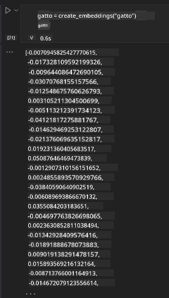

<!--
CO_OP_TRANSLATOR_METADATA:
{
  "original_hash": "e2861bbca91c0567ef32bc77fe054f9e",
  "translation_date": "2025-07-09T16:11:17+00:00",
  "source_file": "15-rag-and-vector-databases/README.md",
  "language_code": "it"
}
-->
# Retrieval Augmented Generation (RAG) e Database Vettoriali

[](https://aka.ms/gen-ai-lesson15-gh?WT.mc_id=academic-105485-koreyst)

Nella lezione sulle applicazioni di ricerca, abbiamo brevemente visto come integrare i propri dati nei Large Language Models (LLM). In questa lezione approfondiremo i concetti di come ancorare i dati nella tua applicazione LLM, i meccanismi del processo e i metodi per memorizzare i dati, inclusi sia gli embeddings che il testo.

> **Video in arrivo**

## Introduzione

In questa lezione tratteremo i seguenti argomenti:

- Un’introduzione a RAG, cos’è e perché viene utilizzato nell’IA (intelligenza artificiale).

- Comprendere cosa sono i database vettoriali e come crearne uno per la nostra applicazione.

- Un esempio pratico su come integrare RAG in un’applicazione.

## Obiettivi di apprendimento

Al termine di questa lezione, sarai in grado di:

- Spiegare l’importanza di RAG nel recupero e nell’elaborazione dei dati.

- Configurare un’applicazione RAG e ancorare i tuoi dati a un LLM.

- Integrare efficacemente RAG e database vettoriali nelle applicazioni LLM.

## Il nostro scenario: migliorare i nostri LLM con i nostri dati

Per questa lezione, vogliamo aggiungere le nostre note alla startup educativa, permettendo al chatbot di ottenere più informazioni sulle diverse materie. Utilizzando le note a nostra disposizione, gli studenti potranno studiare meglio e comprendere i vari argomenti, facilitando la revisione per gli esami. Per creare il nostro scenario, useremo:

- `Azure OpenAI:` il LLM che utilizzeremo per creare il nostro chatbot

- `Lezione AI per principianti sulle Reti Neurali:` questi saranno i dati su cui ancoreremo il nostro LLM

- `Azure AI Search` e `Azure Cosmos DB:` database vettoriale per memorizzare i dati e creare un indice di ricerca

Gli utenti potranno creare quiz di pratica dalle loro note, flashcard per la revisione e riassumerle in panoramiche concise. Per iniziare, vediamo cos’è RAG e come funziona:

## Retrieval Augmented Generation (RAG)

Un chatbot basato su LLM elabora i prompt degli utenti per generare risposte. È progettato per essere interattivo e coinvolgere gli utenti su una vasta gamma di argomenti. Tuttavia, le sue risposte sono limitate al contesto fornito e ai dati di addestramento di base. Ad esempio, la conoscenza di GPT-4 si ferma a settembre 2021, quindi non conosce eventi successivi a quella data. Inoltre, i dati usati per addestrare gli LLM escludono informazioni riservate come note personali o manuali di prodotto aziendali.

### Come funzionano i RAG (Retrieval Augmented Generation)


Supponiamo di voler distribuire un chatbot che crea quiz dalle tue note, avrai bisogno di una connessione alla base di conoscenza. Qui entra in gioco RAG. I RAG operano come segue:

- **Base di conoscenza:** Prima del recupero, questi documenti devono essere acquisiti e preprocessati, solitamente suddividendo documenti grandi in parti più piccole, trasformandoli in embedding testuali e memorizzandoli in un database.

- **Query utente:** l’utente pone una domanda

- **Recupero:** Quando l’utente fa una domanda, il modello di embedding recupera informazioni rilevanti dalla base di conoscenza per fornire un contesto aggiuntivo che sarà incorporato nel prompt.

- **Generazione aumentata:** il LLM migliora la sua risposta basandosi sui dati recuperati. Ciò permette che la risposta generata non si basi solo sui dati pre-addestrati, ma anche sulle informazioni rilevanti del contesto aggiunto. I dati recuperati vengono usati per arricchire le risposte del LLM. Il LLM quindi restituisce una risposta alla domanda dell’utente.


L’architettura dei RAG è implementata usando transformer composti da due parti: un encoder e un decoder. Ad esempio, quando un utente fa una domanda, il testo in input viene “codificato” in vettori che catturano il significato delle parole e i vettori vengono “decodificati” nel nostro indice documentale generando nuovo testo basato sulla query dell’utente. Il LLM utilizza un modello encoder-decoder per generare l’output.

Due approcci per implementare RAG secondo il paper proposto: [Retrieval-Augmented Generation for Knowledge intensive NLP Tasks](https://arxiv.org/pdf/2005.11401.pdf?WT.mc_id=academic-105485-koreyst) sono:

- **_RAG-Sequence_** che usa i documenti recuperati per prevedere la migliore risposta possibile a una query utente

- **RAG-Token** che usa i documenti per generare il token successivo, quindi li recupera per rispondere alla query dell’utente

### Perché usare i RAG?

- **Ricchezza informativa:** garantisce che le risposte testuali siano aggiornate e attuali. Migliora quindi le prestazioni su compiti specifici di dominio accedendo alla base di conoscenza interna.

- Riduce le invenzioni utilizzando **dati verificabili** nella base di conoscenza per fornire contesto alle domande degli utenti.

- È **economico**, risultando più conveniente rispetto al fine-tuning di un LLM.

## Creare una base di conoscenza

La nostra applicazione si basa sui nostri dati personali, cioè la lezione sulle Reti Neurali del curriculum AI For Beginners.

### Database vettoriali

Un database vettoriale, a differenza dei database tradizionali, è un database specializzato progettato per memorizzare, gestire e cercare vettori embedded. Memorizza rappresentazioni numeriche dei documenti. Suddividere i dati in embedding numerici facilita la comprensione e l’elaborazione da parte del nostro sistema AI.

Conserviamo i nostri embedding nei database vettoriali poiché gli LLM hanno un limite sul numero di token che accettano in input. Poiché non è possibile passare l’intero embedding a un LLM, dobbiamo suddividerli in parti e, quando un utente fa una domanda, gli embedding più pertinenti vengono restituiti insieme al prompt. La suddivisione riduce anche i costi legati al numero di token passati a un LLM.

Alcuni database vettoriali popolari includono Azure Cosmos DB, Clarifyai, Pinecone, Chromadb, ScaNN, Qdrant e DeepLake. Puoi creare un modello Azure Cosmos DB usando Azure CLI con il seguente comando:

```bash
az login
az group create -n <resource-group-name> -l <location>
az cosmosdb create -n <cosmos-db-name> -r <resource-group-name>
az cosmosdb list-keys -n <cosmos-db-name> -g <resource-group-name>
```

### Dal testo agli embeddings

Prima di memorizzare i dati, dobbiamo convertirli in vettori embedding. Se lavori con documenti grandi o testi lunghi, puoi suddividerli in base alle query che ti aspetti. La suddivisione può avvenire a livello di frase o di paragrafo. Poiché la suddivisione deriva significati dalle parole circostanti, puoi aggiungere altro contesto a un chunk, ad esempio il titolo del documento o includere del testo prima o dopo il chunk. Puoi suddividere i dati come segue:

```python
def split_text(text, max_length, min_length):
    words = text.split()
    chunks = []
    current_chunk = []

    for word in words:
        current_chunk.append(word)
        if len(' '.join(current_chunk)) < max_length and len(' '.join(current_chunk)) > min_length:
            chunks.append(' '.join(current_chunk))
            current_chunk = []

    # If the last chunk didn't reach the minimum length, add it anyway
    if current_chunk:
        chunks.append(' '.join(current_chunk))

    return chunks
```

Una volta suddivisi, possiamo quindi incorporare il testo usando diversi modelli di embedding. Alcuni modelli che puoi usare includono: word2vec, ada-002 di OpenAI, Azure Computer Vision e molti altri. La scelta del modello dipenderà dalle lingue usate, dal tipo di contenuto codificato (testo/immagini/audio), dalla dimensione dell’input che può codificare e dalla lunghezza dell’output embedding.

Un esempio di testo embedded usando il modello `text-embedding-ada-002` di OpenAI è:


## Recupero e ricerca vettoriale

Quando un utente fa una domanda, il retriever la trasforma in un vettore usando l’encoder della query, quindi cerca nel nostro indice documentale i vettori rilevanti correlati all’input. Una volta fatto, converte sia il vettore di input che i vettori dei documenti in testo e li passa al LLM.

### Recupero

Il recupero avviene quando il sistema cerca rapidamente i documenti nell’indice che soddisfano i criteri di ricerca. L’obiettivo del retriever è ottenere documenti che saranno usati per fornire contesto e ancorare il LLM ai tuoi dati.

Ci sono diversi modi per effettuare la ricerca nel nostro database, come:

- **Ricerca per parola chiave** - usata per ricerche testuali

- **Ricerca semantica** - usa il significato semantico delle parole

- **Ricerca vettoriale** - converte i documenti da testo a rappresentazioni vettoriali usando modelli di embedding. Il recupero avviene interrogando i documenti i cui vettori sono più vicini alla domanda dell’utente.

- **Ibrida** - una combinazione di ricerca per parola chiave e vettoriale.

Una sfida nel recupero si presenta quando non c’è una risposta simile alla query nel database; il sistema restituirà allora le migliori informazioni disponibili. Tuttavia, puoi usare tattiche come impostare la distanza massima per la rilevanza o usare la ricerca ibrida che combina parole chiave e ricerca vettoriale. In questa lezione useremo la ricerca ibrida, una combinazione di ricerca vettoriale e per parola chiave. Memorizzeremo i dati in un dataframe con colonne contenenti sia i chunk che gli embedding.

### Similarità vettoriale

Il retriever cercherà nel database di conoscenza gli embedding che sono vicini tra loro, il vicino più prossimo, poiché sono testi simili. Nel caso in cui un utente faccia una domanda, questa viene prima embedded e poi confrontata con embedding simili. La misura più comune usata per valutare la somiglianza tra vettori è la similarità coseno, basata sull’angolo tra due vettori.

Possiamo misurare la similarità anche con altre alternative come la distanza euclidea, che è la linea retta tra gli endpoint dei vettori, e il prodotto scalare, che misura la somma dei prodotti degli elementi corrispondenti di due vettori.

### Indice di ricerca

Quando si effettua il recupero, dobbiamo costruire un indice di ricerca per la nostra base di conoscenza prima di eseguire la ricerca. Un indice memorizza i nostri embedding e può recuperare rapidamente i chunk più simili anche in un database di grandi dimensioni. Possiamo creare il nostro indice localmente usando:

```python
from sklearn.neighbors import NearestNeighbors

embeddings = flattened_df['embeddings'].to_list()

# Create the search index
nbrs = NearestNeighbors(n_neighbors=5, algorithm='ball_tree').fit(embeddings)

# To query the index, you can use the kneighbors method
distances, indices = nbrs.kneighbors(embeddings)
```

### Riordinamento (Re-ranking)

Una volta interrogato il database, potresti aver bisogno di ordinare i risultati dal più rilevante. Un LLM di riordinamento utilizza il Machine Learning per migliorare la pertinenza dei risultati di ricerca ordinandoli dal più rilevante. Usando Azure AI Search, il riordinamento viene fatto automaticamente tramite un semantic reranker. Un esempio di come funziona il riordinamento usando i vicini più prossimi:

```python
# Find the most similar documents
distances, indices = nbrs.kneighbors([query_vector])

index = []
# Print the most similar documents
for i in range(3):
    index = indices[0][i]
    for index in indices[0]:
        print(flattened_df['chunks'].iloc[index])
        print(flattened_df['path'].iloc[index])
        print(flattened_df['distances'].iloc[index])
    else:
        print(f"Index {index} not found in DataFrame")
```

## Mettere tutto insieme

L’ultimo passo è aggiungere il nostro LLM per poter ottenere risposte ancorate ai nostri dati. Possiamo implementarlo come segue:

```python
user_input = "what is a perceptron?"

def chatbot(user_input):
    # Convert the question to a query vector
    query_vector = create_embeddings(user_input)

    # Find the most similar documents
    distances, indices = nbrs.kneighbors([query_vector])

    # add documents to query  to provide context
    history = []
    for index in indices[0]:
        history.append(flattened_df['chunks'].iloc[index])

    # combine the history and the user input
    history.append(user_input)

    # create a message object
    messages=[
        {"role": "system", "content": "You are an AI assistant that helps with AI questions."},
        {"role": "user", "content": history[-1]}
    ]

    # use chat completion to generate a response
    response = openai.chat.completions.create(
        model="gpt-4",
        temperature=0.7,
        max_tokens=800,
        messages=messages
    )

    return response.choices[0].message

chatbot(user_input)
```

## Valutare la nostra applicazione

### Metriche di valutazione

- Qualità delle risposte fornite, assicurandosi che suonino naturali, fluide e simili a quelle umane

- Ancoraggio dei dati: valutare se la risposta proviene dai documenti forniti

- Rilevanza: valutare se la risposta corrisponde ed è collegata alla domanda posta

- Fluidità - se la risposta ha senso grammaticalmente

## Casi d’uso per RAG (Retrieval Augmented Generation) e database vettoriali

Ci sono molti casi d’uso diversi in cui le chiamate di funzione possono migliorare la tua app, come:

- Domande e risposte: ancorare i dati aziendali a una chat che può essere usata dai dipendenti per fare domande.

- Sistemi di raccomandazione: dove puoi creare un sistema che abbina i valori più simili, ad esempio film, ristoranti e molto altro.

- Servizi chatbot: puoi memorizzare la cronologia delle chat e personalizzare la conversazione in base ai dati dell’utente.

- Ricerca di immagini basata su embedding vettoriali, utile per il riconoscimento di immagini e il rilevamento di anomalie.

## Riepilogo

Abbiamo coperto le aree fondamentali di RAG, dall’aggiunta dei dati all’applicazione, alla query utente e all’output. Per semplificare la creazione di RAG, puoi usare framework come Semantic Kernel, Langchain o Autogen.

## Compito

Per continuare ad approfondire Retrieval Augmented Generation (RAG) puoi costruire:

- Un front-end per l’applicazione usando il framework che preferisci

- Utilizzare un framework, sia LangChain che Semantic Kernel, e ricreare la tua applicazione.

Congratulazioni per aver completato la lezione 👏.

## L’apprendimento non si ferma qui, continua il viaggio

Dopo aver completato questa lezione, dai un’occhiata alla nostra [collezione di apprendimento sull’IA generativa](https://aka.ms/genai-collection?WT.mc_id=academic-105485-koreyst) per continuare a migliorare le tue conoscenze sull’IA generativa!

**Disclaimer**:  
Questo documento è stato tradotto utilizzando il servizio di traduzione automatica [Co-op Translator](https://github.com/Azure/co-op-translator). Pur impegnandoci per garantire accuratezza, si prega di notare che le traduzioni automatiche possono contenere errori o imprecisioni. Il documento originale nella sua lingua nativa deve essere considerato la fonte autorevole. Per informazioni critiche, si raccomanda una traduzione professionale effettuata da un umano. Non ci assumiamo alcuna responsabilità per eventuali malintesi o interpretazioni errate derivanti dall’uso di questa traduzione.