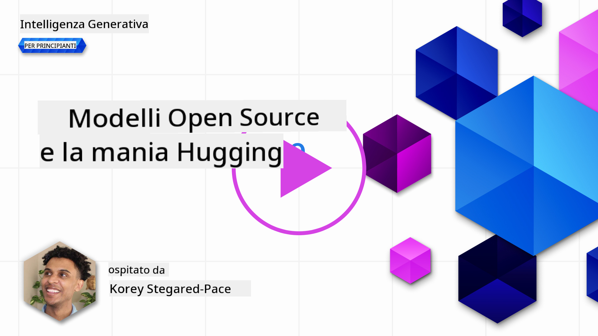
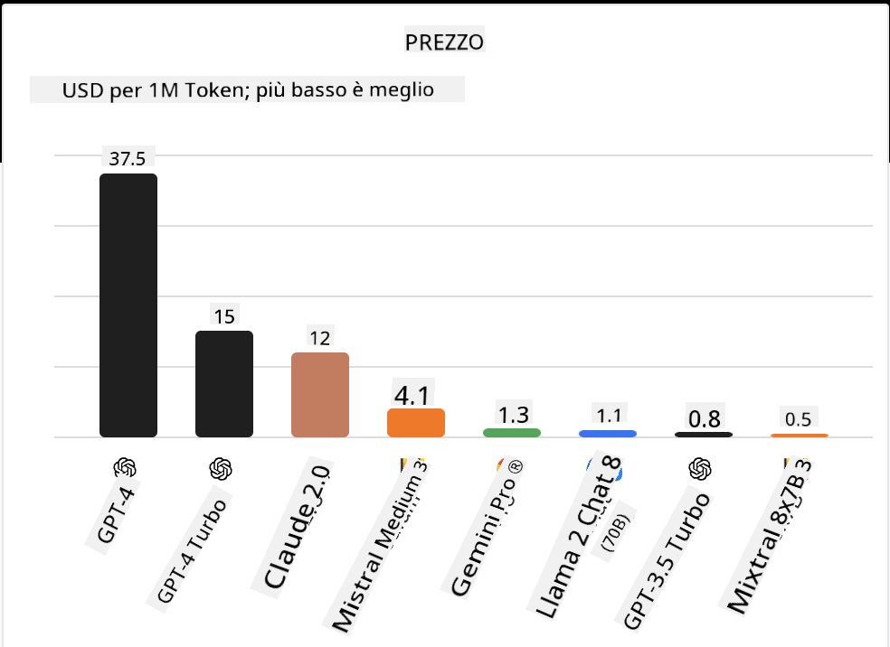
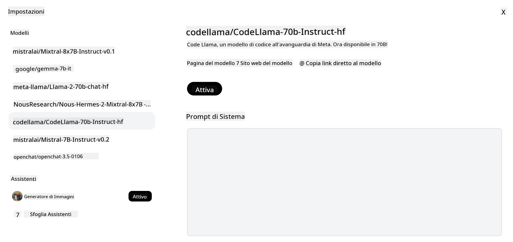

<!--
CO_OP_TRANSLATOR_METADATA:
{
  "original_hash": "0bba96e53ab841d99db731892a51fab8",
  "translation_date": "2025-05-20T06:54:22+00:00",
  "source_file": "16-open-source-models/README.md",
  "language_code": "it"
}
-->

## Introduzione

Il mondo degli LLM open source è entusiasmante e in continua evoluzione. Questa lezione mira a fornire uno sguardo approfondito sui modelli open source. Se cerchi informazioni su come i modelli proprietari si confrontano con quelli open source, vai alla lezione ["Esplorare e confrontare diversi LLM"](../02-exploring-and-comparing-different-llms/README.md?WT.mc_id=academic-105485-koreyst). Questa lezione tratterà anche il tema del fine-tuning, ma una spiegazione più dettagliata può essere trovata nella lezione ["Fine-Tuning degli LLM"](../18-fine-tuning/README.md?WT.mc_id=academic-105485-koreyst).

## Obiettivi di apprendimento

- Acquisire una comprensione dei modelli open source
- Comprendere i vantaggi di lavorare con modelli open source
- Esplorare i modelli open disponibili su Hugging Face e Azure AI Studio

## Cosa sono i Modelli Open Source?

Il software open source ha svolto un ruolo cruciale nella crescita della tecnologia in vari campi. L'Open Source Initiative (OSI) ha definito [10 criteri per il software](https://web.archive.org/web/20241126001143/https://opensource.org/osd?WT.mc_id=academic-105485-koreyst) affinché sia classificato come open source. Il codice sorgente deve essere condiviso apertamente sotto una licenza approvata dall'OSI.

Sebbene lo sviluppo degli LLM presenti elementi simili allo sviluppo del software, il processo non è esattamente lo stesso. Questo ha portato a molte discussioni nella comunità sulla definizione di open source nel contesto degli LLM. Affinché un modello sia allineato alla definizione tradizionale di open source, le seguenti informazioni dovrebbero essere pubblicamente disponibili:

- Dataset utilizzati per addestrare il modello.
- Pesi completi del modello come parte dell'addestramento.
- Codice di valutazione.
- Codice di fine-tuning.
- Pesi completi del modello e metriche di addestramento.

Attualmente ci sono solo pochi modelli che soddisfano questi criteri. Il [modello OLMo creato dall'Allen Institute for Artificial Intelligence (AllenAI)](https://huggingface.co/allenai/OLMo-7B?WT.mc_id=academic-105485-koreyst) è uno che rientra in questa categoria.

Per questa lezione, ci riferiremo ai modelli come "modelli open" in quanto potrebbero non soddisfare i criteri sopra al momento della scrittura.

## Vantaggi dei Modelli Open

**Altamente Personalizzabili** - Poiché i modelli open sono rilasciati con informazioni dettagliate sull'addestramento, ricercatori e sviluppatori possono modificare gli elementi interni del modello. Questo consente la creazione di modelli altamente specializzati che sono ottimizzati per un compito specifico o un'area di studio. Alcuni esempi di ciò sono la generazione di codice, le operazioni matematiche e la biologia.

**Costo** - Il costo per token per l'uso e il dispiegamento di questi modelli è inferiore a quello dei modelli proprietari. Quando si costruiscono applicazioni di AI Generativa, dovrebbe essere fatto un confronto tra prestazioni e prezzo quando si lavora con questi modelli per il proprio caso d'uso.

 Fonte: Artificial Analysis

**Flessibilità** - Lavorare con modelli open consente di essere flessibili in termini di utilizzo di modelli diversi o della loro combinazione. Un esempio di questo è [HuggingChat Assistants](https://huggingface.co/chat?WT.mc_id=academic-105485-koreyst) dove un utente può selezionare il modello utilizzato direttamente nell'interfaccia utente:

## Esplorare Diversi Modelli Open

### Llama 2

[LLama2](https://huggingface.co/meta-llama?WT.mc_id=academic-105485-koreyst), sviluppato da Meta, è un modello open ottimizzato per applicazioni basate su chat. Questo è dovuto al suo metodo di fine-tuning, che includeva una grande quantità di dialoghi e feedback umano. Con questo metodo, il modello produce più risultati allineati alle aspettative umane, fornendo una migliore esperienza utente.

Alcuni esempi di versioni ottimizzate di Llama includono [Japanese Llama](https://huggingface.co/elyza/ELYZA-japanese-Llama-2-7b?WT.mc_id=academic-105485-koreyst), che si specializza in giapponese e [Llama Pro](https://huggingface.co/TencentARC/LLaMA-Pro-8B?WT.mc_id=academic-105485-koreyst), che è una versione migliorata del modello base.

### Mistral

[Mistral](https://huggingface.co/mistralai?WT.mc_id=academic-105485-koreyst) è un modello open con un forte focus su alte prestazioni ed efficienza. Utilizza l'approccio Mixture-of-Experts che combina un gruppo di modelli esperti specializzati in un unico sistema dove, a seconda dell'input, vengono selezionati certi modelli da utilizzare. Questo rende il calcolo più efficace poiché i modelli affrontano solo gli input in cui sono specializzati.

Alcuni esempi di versioni ottimizzate di Mistral includono [BioMistral](https://huggingface.co/BioMistral/BioMistral-7B?text=Mon+nom+est+Thomas+et+mon+principal?WT.mc_id=academic-105485-koreyst), che è focalizzato sul dominio medico e [OpenMath Mistral](https://huggingface.co/nvidia/OpenMath-Mistral-7B-v0.1-hf?WT.mc_id=academic-105485-koreyst), che esegue calcoli matematici.

### Falcon

[Falcon](https://huggingface.co/tiiuae?WT.mc_id=academic-105485-koreyst) è un LLM creato dal Technology Innovation Institute (**TII**). Il Falcon-40B è stato addestrato su 40 miliardi di parametri, dimostrando di avere prestazioni migliori di GPT-3 con un budget di calcolo inferiore. Questo grazie all'uso dell'algoritmo FlashAttention e dell'attenzione multiquery che gli consente di ridurre i requisiti di memoria al momento dell'inferenza. Con questo tempo di inferenza ridotto, il Falcon-40B è adatto per applicazioni di chat.

Alcuni esempi di versioni ottimizzate di Falcon sono [OpenAssistant](https://huggingface.co/OpenAssistant/falcon-40b-sft-top1-560?WT.mc_id=academic-105485-koreyst), un assistente costruito su modelli open e [GPT4ALL](https://huggingface.co/nomic-ai/gpt4all-falcon?WT.mc_id=academic-105485-koreyst), che offre prestazioni superiori rispetto al modello base.

## Come Scegliere

Non esiste una risposta unica per scegliere un modello open. Un buon punto di partenza è utilizzare la funzione di filtro per compiti di Azure AI Studio. Questo ti aiuterà a capire quali tipi di compiti il modello è stato addestrato a svolgere. Hugging Face mantiene anche una classifica degli LLM che mostra i modelli con le migliori prestazioni in base a determinate metriche.

Quando si cerca di confrontare gli LLM tra i diversi tipi, [Artificial Analysis](https://artificialanalysis.ai/?WT.mc_id=academic-105485-koreyst) è un'altra ottima risorsa:

 Fonte: Artificial Analysis

Se si lavora su un caso d'uso specifico, cercare versioni ottimizzate che siano focalizzate sulla stessa area può essere efficace. Sperimentare con più modelli open per vedere come si comportano secondo le aspettative tue e dei tuoi utenti è un'altra buona pratica.

## Prossimi Passi

La parte migliore dei modelli open è che puoi iniziare a lavorarci abbastanza rapidamente. Dai un'occhiata al [Catalogo Modelli di Azure AI Studio](https://ai.azure.com?WT.mc_id=academic-105485-koreyst), che presenta una collezione specifica di Hugging Face con i modelli di cui abbiamo discusso qui.

## L'apprendimento non si ferma qui, continua il viaggio

Dopo aver completato questa lezione, consulta la nostra [collezione di apprendimento sull'AI Generativa](https://aka.ms/genai-collection?WT.mc_id=academic-105485-koreyst) per continuare a migliorare la tua conoscenza dell'AI Generativa!

**Disclaimer**:
Questo documento è stato tradotto utilizzando il servizio di traduzione AI [Co-op Translator](https://github.com/Azure/co-op-translator). Sebbene ci impegniamo per l'accuratezza, si prega di essere consapevoli che le traduzioni automatizzate possono contenere errori o imprecisioni. Il documento originale nella sua lingua madre dovrebbe essere considerato la fonte autorevole. Per informazioni critiche, si raccomanda una traduzione professionale umana. Non siamo responsabili per eventuali incomprensioni o interpretazioni errate derivanti dall'uso di questa traduzione.