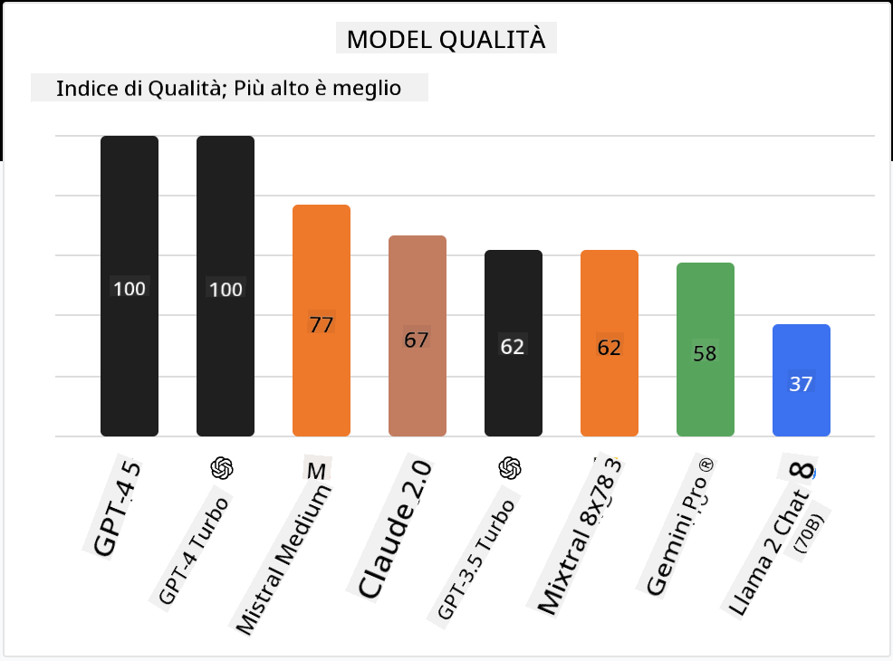

<!--
CO_OP_TRANSLATOR_METADATA:
{
  "original_hash": "0bba96e53ab841d99db731892a51fab8",
  "translation_date": "2025-07-09T17:09:00+00:00",
  "source_file": "16-open-source-models/README.md",
  "language_code": "it"
}
-->

## Introduzione

Il mondo degli LLM open source è entusiasmante e in continua evoluzione. Questa lezione ha l’obiettivo di offrire uno sguardo approfondito sui modelli open source. Se stai cercando informazioni su come i modelli proprietari si confrontano con quelli open source, vai alla lezione ["Exploring and Comparing Different LLMs"](../02-exploring-and-comparing-different-llms/README.md?WT.mc_id=academic-105485-koreyst). Questa lezione tratterà anche il tema del fine-tuning, ma una spiegazione più dettagliata si trova nella lezione ["Fine-Tuning LLMs"](../18-fine-tuning/README.md?WT.mc_id=academic-105485-koreyst).

## Obiettivi di apprendimento

- Comprendere i modelli open source  
- Capire i vantaggi di lavorare con modelli open source  
- Esplorare i modelli open disponibili su Hugging Face e Azure AI Studio  

## Cosa sono i modelli Open Source?

Il software open source ha avuto un ruolo fondamentale nella crescita della tecnologia in diversi ambiti. L’Open Source Initiative (OSI) ha definito [10 criteri per il software](https://web.archive.org/web/20241126001143/https://opensource.org/osd?WT.mc_id=academic-105485-koreyst) affinché possa essere classificato come open source. Il codice sorgente deve essere condiviso apertamente sotto una licenza approvata dall’OSI.

Sebbene lo sviluppo degli LLM presenti elementi simili a quello del software, il processo non è esattamente lo stesso. Questo ha generato molte discussioni nella comunità sulla definizione di open source nel contesto degli LLM. Perché un modello sia allineato alla definizione tradizionale di open source, le seguenti informazioni dovrebbero essere pubblicamente disponibili:

- I dataset usati per addestrare il modello.  
- I pesi completi del modello come parte dell’addestramento.  
- Il codice di valutazione.  
- Il codice per il fine-tuning.  
- I pesi completi del modello e le metriche di addestramento.  

Attualmente ci sono solo pochi modelli che soddisfano questi criteri. Il [modello OLMo creato dall’Allen Institute for Artificial Intelligence (AllenAI)](https://huggingface.co/allenai/OLMo-7B?WT.mc_id=academic-105485-koreyst) è uno di questi.

Per questa lezione, ci riferiremo ai modelli come "modelli open" poiché potrebbero non rispettare tutti i criteri sopra al momento della stesura.

## Vantaggi dei modelli open

**Altamente personalizzabili** – Poiché i modelli open sono rilasciati con informazioni dettagliate sull’addestramento, ricercatori e sviluppatori possono modificare l’interno del modello. Questo permette di creare modelli altamente specializzati, ottimizzati per un compito o un ambito specifico. Alcuni esempi sono la generazione di codice, operazioni matematiche e biologia.

**Costo** – Il costo per token nell’uso e nel deployment di questi modelli è inferiore rispetto ai modelli proprietari. Quando si costruiscono applicazioni di Generative AI, è importante valutare il rapporto tra prestazioni e prezzo per il proprio caso d’uso.

  
Fonte: Artificial Analysis

**Flessibilità** – Lavorare con modelli open permette di essere flessibili nell’uso di modelli diversi o nella loro combinazione. Un esempio è rappresentato dagli [HuggingChat Assistants](https://huggingface.co/chat?WT.mc_id=academic-105485-koreyst), dove l’utente può selezionare il modello da utilizzare direttamente nell’interfaccia:

## Esplorare diversi modelli open

### Llama 2

[LLama2](https://huggingface.co/meta-llama?WT.mc_id=academic-105485-koreyst), sviluppato da Meta, è un modello open ottimizzato per applicazioni basate sulla chat. Questo grazie al suo metodo di fine-tuning, che ha incluso una grande quantità di dialoghi e feedback umano. Con questo approccio, il modello produce risultati più in linea con le aspettative umane, offrendo un’esperienza utente migliore.

Alcuni esempi di versioni fine-tuned di Llama includono [Japanese Llama](https://huggingface.co/elyza/ELYZA-japanese-Llama-2-7b?WT.mc_id=academic-105485-koreyst), specializzato in giapponese, e [Llama Pro](https://huggingface.co/TencentARC/LLaMA-Pro-8B?WT.mc_id=academic-105485-koreyst), una versione potenziata del modello base.

### Mistral

[Mistral](https://huggingface.co/mistralai?WT.mc_id=academic-105485-koreyst) è un modello open con un forte focus su alte prestazioni ed efficienza. Utilizza l’approccio Mixture-of-Experts, che combina un gruppo di modelli esperti specializzati in un unico sistema, dove a seconda dell’input vengono selezionati i modelli da utilizzare. Questo rende il calcolo più efficace, poiché i modelli si occupano solo degli input per cui sono specializzati.

Alcuni esempi di versioni fine-tuned di Mistral includono [BioMistral](https://huggingface.co/BioMistral/BioMistral-7B?text=Mon+nom+est+Thomas+et+mon+principal?WT.mc_id=academic-105485-koreyst), focalizzato sul dominio medico, e [OpenMath Mistral](https://huggingface.co/nvidia/OpenMath-Mistral-7B-v0.1-hf?WT.mc_id=academic-105485-koreyst), che esegue calcoli matematici.

### Falcon

[Falcon](https://huggingface.co/tiiuae?WT.mc_id=academic-105485-koreyst) è un LLM creato dal Technology Innovation Institute (**TII**). Il Falcon-40B è stato addestrato su 40 miliardi di parametri e ha dimostrato di performare meglio di GPT-3 con un budget computazionale inferiore. Questo grazie all’uso dell’algoritmo FlashAttention e della multiquery attention, che riducono i requisiti di memoria durante l’inferenza. Con questo tempo di inferenza ridotto, il Falcon-40B è adatto per applicazioni di chat.

Alcuni esempi di versioni fine-tuned di Falcon sono [OpenAssistant](https://huggingface.co/OpenAssistant/falcon-40b-sft-top1-560?WT.mc_id=academic-105485-koreyst), un assistente costruito su modelli open, e [GPT4ALL](https://huggingface.co/nomic-ai/gpt4all-falcon?WT.mc_id=academic-105485-koreyst), che offre prestazioni superiori rispetto al modello base.

## Come scegliere

Non esiste una risposta univoca per scegliere un modello open. Un buon punto di partenza è utilizzare la funzione di filtro per task di Azure AI Studio. Questo ti aiuterà a capire per quali tipi di compiti il modello è stato addestrato. Hugging Face mantiene anche una classifica LLM Leaderboard che mostra i modelli con le migliori prestazioni basate su determinate metriche.

Per confrontare gli LLM tra i diversi tipi, [Artificial Analysis](https://artificialanalysis.ai/?WT.mc_id=academic-105485-koreyst) è un’altra risorsa molto utile:

  
Fonte: Artificial Analysis

Se lavori su un caso d’uso specifico, cercare versioni fine-tuned focalizzate sullo stesso ambito può essere efficace. Sperimentare con più modelli open per vedere come si comportano rispetto alle tue e agli utenti aspettative è un’altra buona pratica.

## Prossimi passi

La parte migliore dei modelli open è che puoi iniziare a lavorarci abbastanza rapidamente. Dai un’occhiata al [Catalogo Modelli di Azure AI Studio](https://ai.azure.com?WT.mc_id=academic-105485-koreyst), che include una collezione specifica di Hugging Face con i modelli di cui abbiamo parlato qui.

## L’apprendimento non si ferma qui, continua il viaggio

Dopo aver completato questa lezione, esplora la nostra [collezione di apprendimento su Generative AI](https://aka.ms/genai-collection?WT.mc_id=academic-105485-koreyst) per continuare a migliorare le tue conoscenze sulla Generative AI!

**Disclaimer**:  
Questo documento è stato tradotto utilizzando il servizio di traduzione automatica [Co-op Translator](https://github.com/Azure/co-op-translator). Pur impegnandoci per garantire accuratezza, si prega di notare che le traduzioni automatiche possono contenere errori o imprecisioni. Il documento originale nella sua lingua nativa deve essere considerato la fonte autorevole. Per informazioni critiche, si raccomanda una traduzione professionale effettuata da un umano. Non ci assumiamo alcuna responsabilità per eventuali malintesi o interpretazioni errate derivanti dall’uso di questa traduzione.