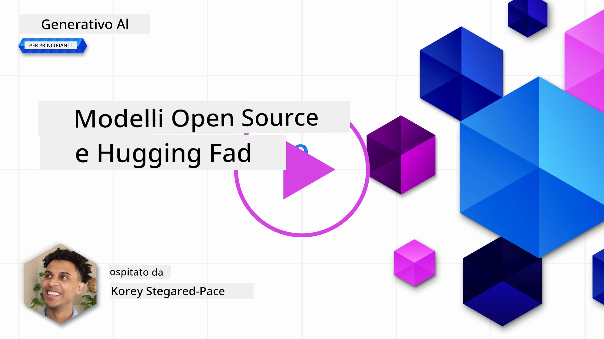
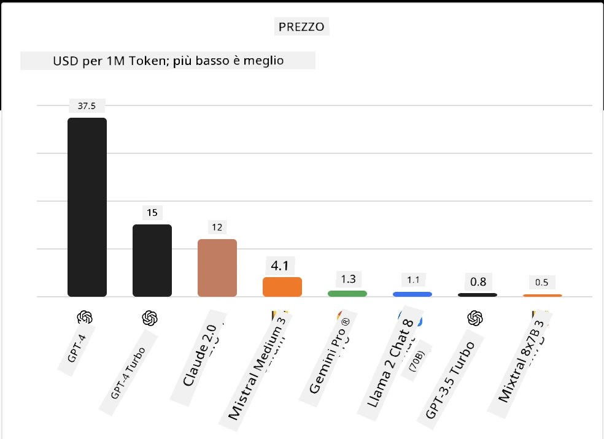
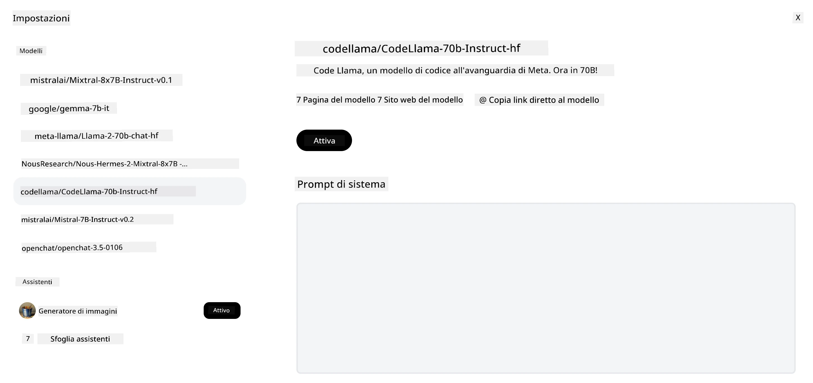
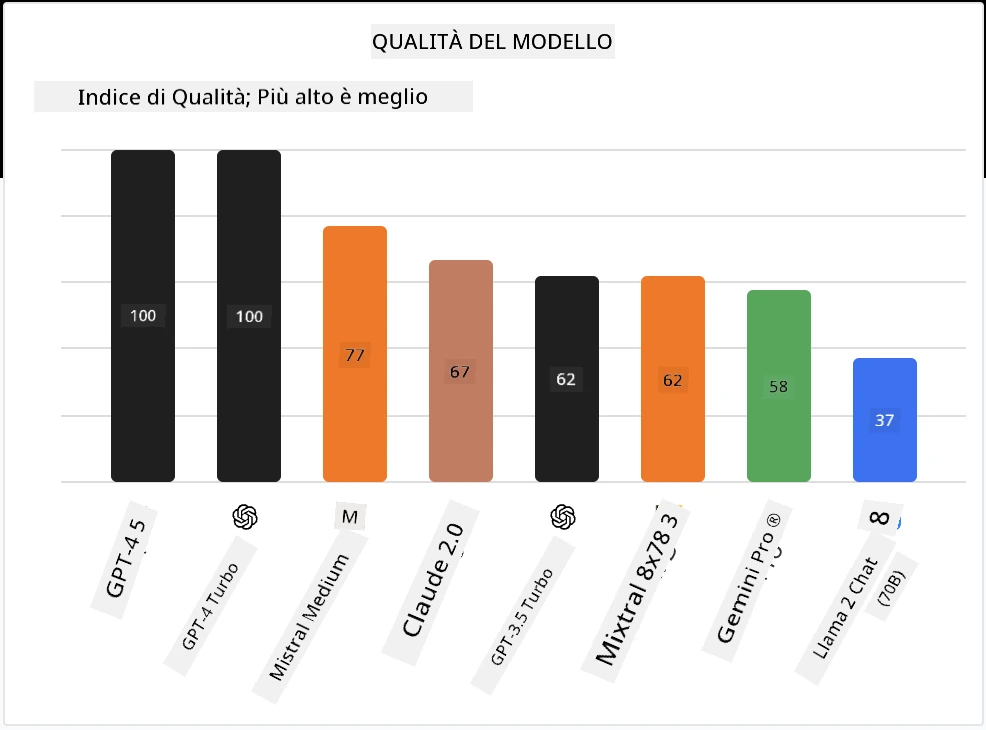

## Introduzione

Il mondo degli LLM open source è entusiasmante e in continua evoluzione. Questa lezione mira a fornire uno sguardo approfondito sui modelli open source. Se stai cercando informazioni su come i modelli proprietari si confrontano con i modelli open source, vai alla [lezione "Esplorare e Confrontare Diversi LLM"](../02-exploring-and-comparing-different-llms/README.md?WT.mc_id=academic-105485-koreyst). Questa lezione tratterà anche il tema del fine-tuning, ma una spiegazione più dettagliata può essere trovata nella [lezione "Fine-Tuning degli LLM"](../18-fine-tuning/README.md?WT.mc_id=academic-105485-koreyst).

## Obiettivi di apprendimento

- Ottenere una comprensione dei modelli open source
- Comprendere i vantaggi del lavoro con modelli open source
- Esplorare i modelli open disponibili su Hugging Face e il catalogo modelli Microsoft Foundry

## Cosa sono i Modelli Open Source?

Il software open source ha giocato un ruolo cruciale nella crescita della tecnologia in vari campi. L'Open Source Initiative (OSI) ha definito [10 criteri per il software](https://web.archive.org/web/20241126001143/https://opensource.org/osd?WT.mc_id=academic-105485-koreyst) per essere classificato come open source. Il codice sorgente deve essere condiviso apertamente sotto una licenza approvata da OSI.

Sebbene lo sviluppo degli LLM presenti elementi simili a quelli dello sviluppo software, il processo non è esattamente lo stesso. Questo ha portato a molte discussioni nella comunità sulla definizione di open source nel contesto degli LLM. Perché un modello sia allineato con la definizione tradizionale di open source, le seguenti informazioni dovrebbero essere disponibili pubblicamente:

- Dataset utilizzati per addestrare il modello.
- Pesi completi del modello come parte dell'addestramento.
- Il codice di valutazione.
- Il codice di fine-tuning.
- Pesi completi del modello e metriche di addestramento.

Attualmente ci sono solo pochi modelli che soddisfano questi criteri. Il [modello OLMo creato dall'Allen Institute for Artificial Intelligence (AllenAI)](https://huggingface.co/allenai/OLMo-7B?WT.mc_id=academic-105485-koreyst) è uno che rientra in questa categoria.

Per questa lezione, in avanti ci riferiremo ai modelli come "modelli open" poiché potrebbero non corrispondere ai criteri sopra indicati al momento della scrittura.

## Benefici dei Modelli Open

**Altamente Personalizzabili** - Poiché i modelli open sono rilasciati con informazioni dettagliate sull'addestramento, i ricercatori e gli sviluppatori possono modificare gli interni del modello. Questo consente la creazione di modelli altamente specializzati e ottimizzati per un compito o un'area di studio specifica. Alcuni esempi sono la generazione di codice, operazioni matematiche e biologia.

**Costo** - Il costo per token per utilizzare e distribuire questi modelli è inferiore a quello dei modelli proprietari. Quando si costruiscono applicazioni di Generative AI, è importante valutare il rapporto tra prestazioni e prezzo quando si lavora con questi modelli per il proprio caso d'uso.

Fonte: Artificial Analysis

**Flessibilità** - Lavorare con modelli open permette di essere flessibili nell'uso di modelli diversi o nella loro combinazione. Un esempio è rappresentato dagli [Assistenti HuggingChat](https://huggingface.co/chat?WT.mc_id=academic-105485-koreyst) dove un utente può selezionare il modello da usare direttamente nell'interfaccia utente:

## Esplorare Diversi Modelli Open

### Llama 2

[LLama2](https://huggingface.co/meta-llama?WT.mc_id=academic-105485-koreyst), sviluppato da Meta, è un modello open ottimizzato per applicazioni basate sulla chat. Questo è dovuto al suo metodo di fine-tuning, che includeva un grande volume di dialoghi e feedback umano. Con questo metodo, il modello produce risultati più allineati alle aspettative umane, offrendo una migliore esperienza utente.

Alcuni esempi di versioni ottimizzate di Llama includono [Japanese Llama](https://huggingface.co/elyza/ELYZA-japanese-Llama-2-7b?WT.mc_id=academic-105485-koreyst), che si specializza nel giapponese, e [Llama Pro](https://huggingface.co/TencentARC/LLaMA-Pro-8B?WT.mc_id=academic-105485-koreyst), che è una versione migliorata del modello base.

### Mistral

[Mistral](https://huggingface.co/mistralai?WT.mc_id=academic-105485-koreyst) è un modello open con un forte focus su alte prestazioni ed efficienza. Usa l'approccio Mixture-of-Experts che combina un gruppo di modelli esperti specializzati in un sistema in cui, a seconda dell'input, vengono selezionati specifici modelli da utilizzare. Ciò rende il calcolo più efficace poiché i modelli affrontano solo gli input in cui sono specializzati.

Alcuni esempi di versioni ottimizzate di Mistral includono [BioMistral](https://huggingface.co/BioMistral/BioMistral-7B?text=Mon+nom+est+Thomas+et+mon+principal?WT.mc_id=academic-105485-koreyst), che si concentra sul dominio medico, e [OpenMath Mistral](https://huggingface.co/nvidia/OpenMath-Mistral-7B-v0.1-hf?WT.mc_id=academic-105485-koreyst), che esegue calcoli matematici.

### Falcon

[Falcon](https://huggingface.co/tiiuae?WT.mc_id=academic-105485-koreyst) è un LLM creato dal Technology Innovation Institute (**TII**). Il Falcon-40B è stato addestrato su 40 miliardi di parametri e ha dimostrato prestazioni migliori rispetto a GPT-3 con un budget computazionale inferiore. Questo è dovuto all'uso dell'algoritmo FlashAttention e all'attenzione multiquery, che permettono di ridurre i requisiti di memoria durante l'inferenza. Con questo tempo inferenziale ridotto, il Falcon-40B è adatto per applicazioni di chat.

Alcuni esempi di versioni ottimizzate di Falcon sono [OpenAssistant](https://huggingface.co/OpenAssistant/falcon-40b-sft-top1-560?WT.mc_id=academic-105485-koreyst), un assistente costruito su modelli open, e [GPT4ALL](https://huggingface.co/nomic-ai/gpt4all-falcon?WT.mc_id=academic-105485-koreyst), che offre prestazioni superiori al modello base.

## Come scegliere

Non c'è una risposta unica per scegliere un modello open. Un buon punto di partenza è utilizzare la funzione filtro per compito del catalogo modelli Microsoft Foundry. Questo ti aiuterà a capire per quali tipi di compiti il modello è stato addestrato. Hugging Face mantiene anche una classifica degli LLM che mostra i modelli con le migliori prestazioni basate su determinate metriche.

Quando vuoi confrontare gli LLM tra i diversi tipi, [Artificial Analysis](https://artificialanalysis.ai/?WT.mc_id=academic-105485-koreyst) è un'altra grande risorsa:

Fonte: Artificial Analysis

Se lavori su un caso d'uso specifico, cercare versioni ottimizzate focalizzate sulla stessa area può essere efficace. Sperimentare con più modelli open per vedere come si comportano in base alle tue e alle aspettative dei tuoi utenti è un'altra buona pratica.

## Passi successivi

La parte migliore dei modelli open è che puoi iniziare a lavorarci abbastanza rapidamente. Dai un'occhiata al [catalogo modelli Microsoft Foundry](https://ai.azure.com?WT.mc_id=academic-105485-koreyst), che presenta una collezione specifica Hugging Face con questi modelli di cui abbiamo parlato qui.

## L'apprendimento non si ferma qui, continua il viaggio

Dopo aver completato questa lezione, dai un'occhiata alla nostra [collezione di apprendimento Generative AI](https://aka.ms/genai-collection?WT.mc_id=academic-105485-koreyst) per continuare a migliorare la tua conoscenza dell'Intelligenza Artificiale Generativa!

---

<!-- CO-OP TRANSLATOR DISCLAIMER START -->
**Disclaimer**:
Questo documento è stato tradotto utilizzando il servizio di traduzione AI [Co-op Translator](https://github.com/Azure/co-op-translator). Sebbene ci impegniamo per garantire la precisione, si prega di notare che le traduzioni automatizzate possono contenere errori o imprecisioni. Il documento originale nella sua lingua nativa deve essere considerato la fonte autorevole. Per informazioni critiche, si raccomanda una traduzione professionale effettuata da un essere umano. Non siamo responsabili per eventuali malintesi o interpretazioni errate derivanti dall’uso di questa traduzione.
<!-- CO-OP TRANSLATOR DISCLAIMER END -->