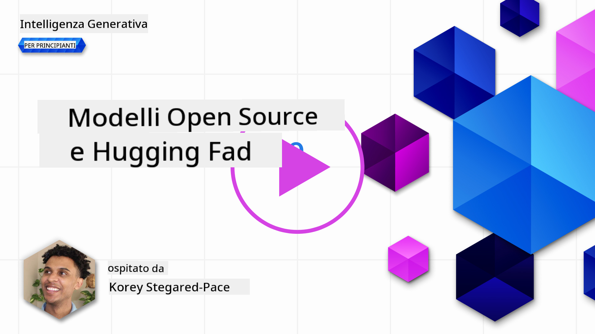
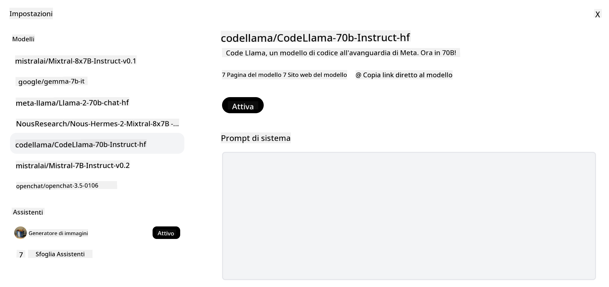

<!--
CO_OP_TRANSLATOR_METADATA:
{
  "original_hash": "a8b2d4bb727c877ebf9edff8623d16b9",
  "translation_date": "2025-09-06T10:16:41+00:00",
  "source_file": "16-open-source-models/README.md",
  "language_code": "it"
}
-->

## Introduzione

Il mondo dei LLM open source è entusiasmante e in continua evoluzione. Questa lezione mira a fornire uno sguardo approfondito sui modelli open source. Se stai cercando informazioni su come i modelli proprietari si confrontano con quelli open source, vai alla lezione ["Esplorare e Confrontare Diversi LLM"](../02-exploring-and-comparing-different-llms/README.md?WT.mc_id=academic-105485-koreyst). Questa lezione tratterà anche il tema del fine-tuning, ma una spiegazione più dettagliata può essere trovata nella lezione ["Fine-Tuning LLMs"](../18-fine-tuning/README.md?WT.mc_id=academic-105485-koreyst).

## Obiettivi di apprendimento

- Acquisire una comprensione dei modelli open source
- Comprendere i vantaggi di lavorare con modelli open source
- Esplorare i modelli open disponibili su Hugging Face e Azure AI Studio

## Cosa sono i Modelli Open Source?

Il software open source ha svolto un ruolo cruciale nella crescita della tecnologia in diversi settori. L'Open Source Initiative (OSI) ha definito [10 criteri per il software](https://web.archive.org/web/20241126001143/https://opensource.org/osd?WT.mc_id=academic-105485-koreyst) per essere classificato come open source. Il codice sorgente deve essere condiviso apertamente sotto una licenza approvata dall'OSI.

Sebbene lo sviluppo dei LLM abbia elementi simili allo sviluppo del software, il processo non è esattamente lo stesso. Questo ha portato a molte discussioni nella comunità sulla definizione di open source nel contesto dei LLM. Perché un modello sia allineato alla definizione tradizionale di open source, le seguenti informazioni dovrebbero essere pubblicamente disponibili:

- Dataset utilizzati per addestrare il modello.
- Pesi completi del modello come parte dell'addestramento.
- Codice di valutazione.
- Codice di fine-tuning.
- Pesi completi del modello e metriche di addestramento.

Attualmente ci sono solo pochi modelli che soddisfano questi criteri. Il [modello OLMo creato dall'Allen Institute for Artificial Intelligence (AllenAI)](https://huggingface.co/allenai/OLMo-7B?WT.mc_id=academic-105485-koreyst) è uno di quelli che rientra in questa categoria.

Per questa lezione, ci riferiremo ai modelli come "modelli open" da qui in avanti, poiché potrebbero non soddisfare i criteri sopra indicati al momento della stesura.

## Vantaggi dei Modelli Open

**Altamente Personalizzabili** - Poiché i modelli open vengono rilasciati con informazioni dettagliate sull'addestramento, ricercatori e sviluppatori possono modificare gli aspetti interni del modello. Questo consente la creazione di modelli altamente specializzati che sono ottimizzati per un compito o un'area di studio specifica. Alcuni esempi includono generazione di codice, operazioni matematiche e biologia.

**Costo** - Il costo per token per l'utilizzo e il deployment di questi modelli è inferiore rispetto ai modelli proprietari. Quando si costruiscono applicazioni di Generative AI, è importante valutare le prestazioni rispetto al prezzo in base al proprio caso d'uso.

  
Fonte: Artificial Analysis

**Flessibilità** - Lavorare con modelli open consente di essere flessibili nell'utilizzo di modelli diversi o nella loro combinazione. Un esempio è il [HuggingChat Assistants](https://huggingface.co/chat?WT.mc_id=academic-105485-koreyst), dove l'utente può selezionare il modello utilizzato direttamente nell'interfaccia utente:

## Esplorare Diversi Modelli Open

### Llama 2

[LLama2](https://huggingface.co/meta-llama?WT.mc_id=academic-105485-koreyst), sviluppato da Meta, è un modello open ottimizzato per applicazioni basate su chat. Questo grazie al suo metodo di fine-tuning, che ha incluso una grande quantità di dialoghi e feedback umano. Con questo metodo, il modello produce risultati più allineati alle aspettative umane, offrendo una migliore esperienza utente.

Alcuni esempi di versioni ottimizzate di Llama includono [Japanese Llama](https://huggingface.co/elyza/ELYZA-japanese-Llama-2-7b?WT.mc_id=academic-105485-koreyst), specializzato in giapponese, e [Llama Pro](https://huggingface.co/TencentARC/LLaMA-Pro-8B?WT.mc_id=academic-105485-koreyst), una versione migliorata del modello base.

### Mistral

[Mistral](https://huggingface.co/mistralai?WT.mc_id=academic-105485-koreyst) è un modello open con un forte focus su alte prestazioni ed efficienza. Utilizza l'approccio Mixture-of-Experts, che combina un gruppo di modelli esperti specializzati in un unico sistema, dove a seconda dell'input vengono selezionati determinati modelli. Questo rende il calcolo più efficace, poiché i modelli affrontano solo gli input per cui sono specializzati.

Alcuni esempi di versioni ottimizzate di Mistral includono [BioMistral](https://huggingface.co/BioMistral/BioMistral-7B?text=Mon+nom+est+Thomas+et+mon+principal?WT.mc_id=academic-105485-koreyst), focalizzato sul settore medico, e [OpenMath Mistral](https://huggingface.co/nvidia/OpenMath-Mistral-7B-v0.1-hf?WT.mc_id=academic-105485-koreyst), che esegue calcoli matematici.

### Falcon

[Falcon](https://huggingface.co/tiiuae?WT.mc_id=academic-105485-koreyst) è un LLM creato dal Technology Innovation Institute (**TII**). Il Falcon-40B è stato addestrato su 40 miliardi di parametri, dimostrando di avere prestazioni migliori rispetto a GPT-3 con un budget computazionale inferiore. Questo grazie all'uso dell'algoritmo FlashAttention e dell'attenzione multiquery, che riducono i requisiti di memoria durante l'inferenza. Con questo tempo di inferenza ridotto, il Falcon-40B è adatto per applicazioni di chat.

Alcuni esempi di versioni ottimizzate di Falcon sono [OpenAssistant](https://huggingface.co/OpenAssistant/falcon-40b-sft-top1-560?WT.mc_id=academic-105485-koreyst), un assistente basato su modelli open, e [GPT4ALL](https://huggingface.co/nomic-ai/gpt4all-falcon?WT.mc_id=academic-105485-koreyst), che offre prestazioni superiori rispetto al modello base.

## Come Scegliere

Non esiste una risposta unica per scegliere un modello open. Un buon punto di partenza è utilizzare la funzione di filtro per compito di Azure AI Studio. Questo ti aiuterà a capire quali tipi di compiti il modello è stato addestrato a svolgere. Hugging Face mantiene anche una LLM Leaderboard che mostra i modelli con le migliori prestazioni basate su determinati parametri.

Quando si confrontano i LLM tra i diversi tipi, [Artificial Analysis](https://artificialanalysis.ai/?WT.mc_id=academic-105485-koreyst) è un'altra ottima risorsa:

  
Fonte: Artificial Analysis

Se stai lavorando su un caso d'uso specifico, cercare versioni ottimizzate focalizzate sulla stessa area può essere efficace. Sperimentare con più modelli open per vedere come si comportano rispetto alle tue aspettative e a quelle degli utenti è un'altra buona pratica.

## Prossimi Passi

La parte migliore dei modelli open è che puoi iniziare a lavorare con loro abbastanza rapidamente. Dai un'occhiata al [Catalogo Modelli di Azure AI Foundry](https://ai.azure.com?WT.mc_id=academic-105485-koreyst), che presenta una collezione specifica di Hugging Face con i modelli discussi qui.

## L'apprendimento non si ferma qui, continua il tuo percorso

Dopo aver completato questa lezione, consulta la nostra [collezione di apprendimento sull'AI generativa](https://aka.ms/genai-collection?WT.mc_id=academic-105485-koreyst) per continuare a migliorare le tue conoscenze sull'AI generativa!

---

**Disclaimer**:  
Questo documento è stato tradotto utilizzando il servizio di traduzione automatica [Co-op Translator](https://github.com/Azure/co-op-translator). Sebbene ci impegniamo per garantire l'accuratezza, si prega di notare che le traduzioni automatiche possono contenere errori o imprecisioni. Il documento originale nella sua lingua nativa dovrebbe essere considerato la fonte autorevole. Per informazioni critiche, si raccomanda una traduzione professionale effettuata da un traduttore umano. Non siamo responsabili per eventuali incomprensioni o interpretazioni errate derivanti dall'uso di questa traduzione.