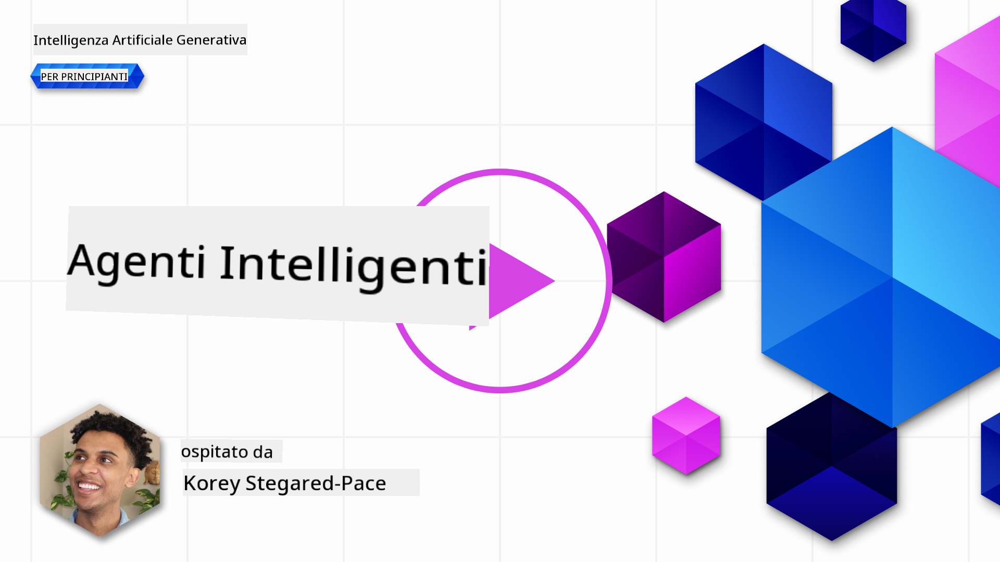
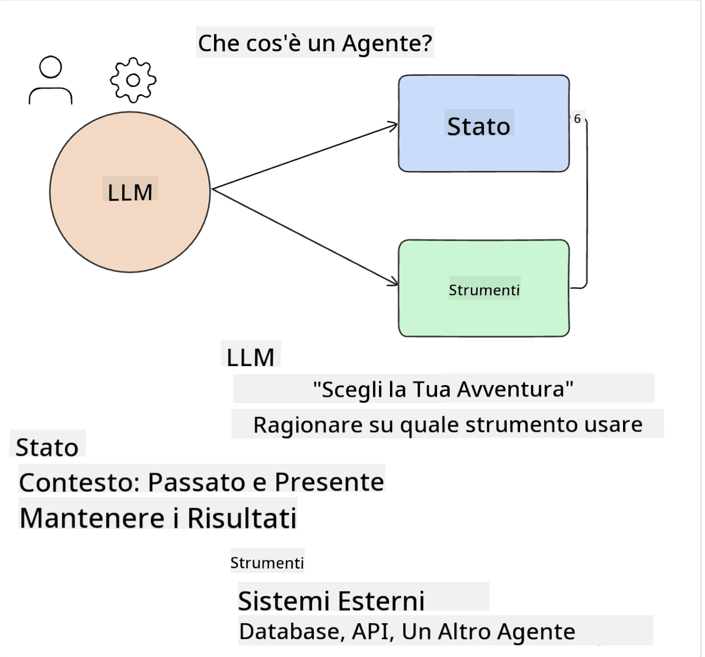
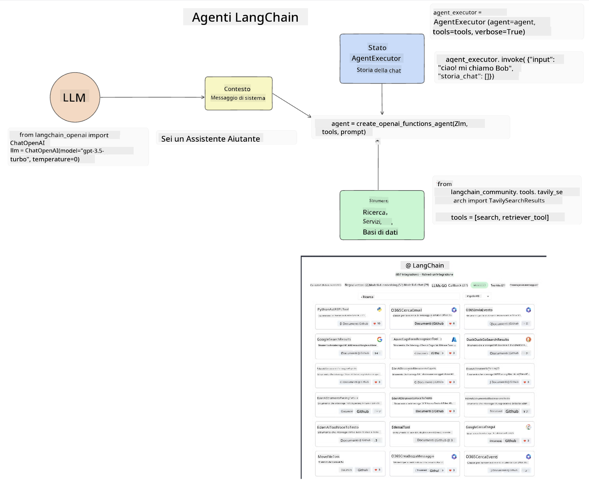
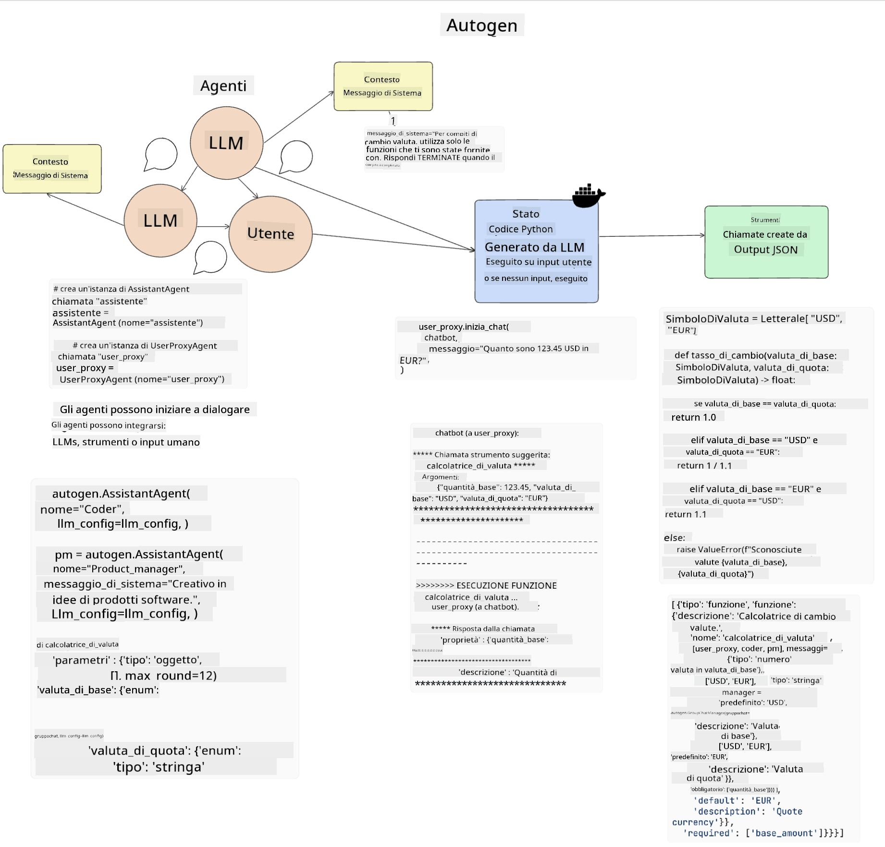
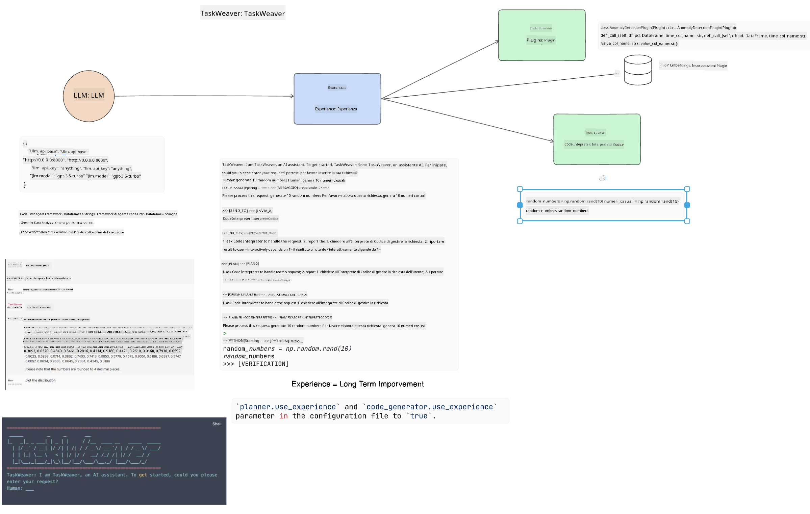
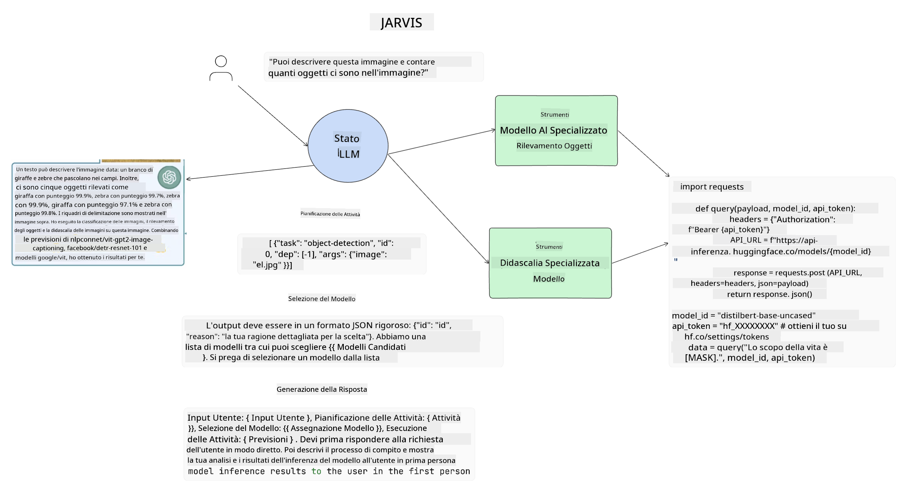

<!--
CO_OP_TRANSLATOR_METADATA:
{
  "original_hash": "11f03c81f190d9cbafd0f977dcbede6c",
  "translation_date": "2025-05-20T07:21:58+00:00",
  "source_file": "17-ai-agents/README.md",
  "language_code": "it"
}
-->
[](https://aka.ms/gen-ai-lesson17-gh?WT.mc_id=academic-105485-koreyst)

## Introduzione

Gli Agenti AI rappresentano uno sviluppo entusiasmante nell'AI Generativa, permettendo ai Modelli di Linguaggio Avanzati (LLM) di evolversi da assistenti ad agenti capaci di prendere azioni. I framework degli Agenti AI permettono agli sviluppatori di creare applicazioni che danno agli LLM accesso a strumenti e gestione dello stato. Questi framework migliorano anche la visibilità, permettendo agli utenti e agli sviluppatori di monitorare le azioni pianificate dagli LLM, migliorando così la gestione dell'esperienza.

La lezione coprirà le seguenti aree:

- Comprendere cosa sia un Agente AI - Che cos'è esattamente un Agente AI?
- Esplorare quattro diversi framework di Agenti AI - Cosa li rende unici?
- Applicare questi Agenti AI a diversi casi d'uso - Quando dovremmo usare gli Agenti AI?

## Obiettivi di apprendimento

Dopo aver seguito questa lezione, sarai in grado di:

- Spiegare cosa sono gli Agenti AI e come possono essere utilizzati.
- Avere una comprensione delle differenze tra alcuni dei framework di Agenti AI più popolari, e come si differenziano.
- Comprendere come funzionano gli Agenti AI per costruire applicazioni con essi.

## Cosa sono gli Agenti AI?

Gli Agenti AI sono un campo molto entusiasmante nel mondo dell'AI Generativa. Con questo entusiasmo arriva a volte una confusione di termini e della loro applicazione. Per mantenere le cose semplici e inclusive della maggior parte degli strumenti che si riferiscono agli Agenti AI, utilizzeremo questa definizione:

Gli Agenti AI permettono ai Modelli di Linguaggio Avanzati (LLM) di eseguire compiti dando loro accesso a uno **stato** e **strumenti**.



Definiamo questi termini:

**Modelli di Linguaggio Avanzati** - Questi sono i modelli menzionati in tutto questo corso come GPT-3.5, GPT-4, Llama-2, ecc.

**Stato** - Si riferisce al contesto in cui l'LLM sta lavorando. L'LLM utilizza il contesto delle sue azioni passate e il contesto attuale, guidando il suo processo decisionale per azioni successive. I framework degli Agenti AI permettono agli sviluppatori di mantenere questo contesto più facilmente.

**Strumenti** - Per completare il compito richiesto dall'utente e pianificato dall'LLM, l'LLM ha bisogno di accesso agli strumenti. Alcuni esempi di strumenti possono essere un database, un'API, un'applicazione esterna o persino un altro LLM!

Queste definizioni ti daranno sperabilmente una buona base per andare avanti mentre esploriamo come vengono implementati. Esploriamo alcuni diversi framework di Agenti AI:

## Agenti LangChain

[Agenti LangChain](https://python.langchain.com/docs/how_to/#agents?WT.mc_id=academic-105485-koreyst) è un'implementazione delle definizioni che abbiamo fornito sopra.

Per gestire lo **stato**, utilizza una funzione integrata chiamata `AgentExecutor`. Questa accetta il `agent` definito e il `tools` disponibili per esso.

`Agent Executor` memorizza anche la cronologia delle chat per fornire il contesto della chat.



LangChain offre un [catalogo di strumenti](https://integrations.langchain.com/tools?WT.mc_id=academic-105485-koreyst) che possono essere importati nella tua applicazione in cui l'LLM può accedere. Questi sono creati dalla comunità e dal team di LangChain.

Puoi quindi definire questi strumenti e passarli a `Agent Executor`.

La visibilità è un altro aspetto importante quando si parla di Agenti AI. È importante per gli sviluppatori di applicazioni capire quale strumento l'LLM sta utilizzando e perché. Per questo, il team di LangChain ha sviluppato LangSmith.

## AutoGen

Il prossimo framework di Agenti AI che discuteremo è [AutoGen](https://microsoft.github.io/autogen/?WT.mc_id=academic-105485-koreyst). Il focus principale di AutoGen sono le conversazioni. Gli agenti sono sia **conversabili** che **personalizzabili**.

**Conversabili -** Gli LLM possono iniziare e continuare una conversazione con un altro LLM per completare un compito. Questo avviene creando `AssistantAgents` e dando loro un messaggio di sistema specifico.

```python

autogen.AssistantAgent( name="Coder", llm_config=llm_config, ) pm = autogen.AssistantAgent( name="Product_manager", system_message="Creative in software product ideas.", llm_config=llm_config, )

```

**Personalizzabili** - Gli agenti possono essere definiti non solo come LLM ma essere un utente o uno strumento. Come sviluppatore, puoi definire un `UserProxyAgent` che è responsabile di interagire con l'utente per il feedback nel completamento di un compito. Questo feedback può continuare l'esecuzione del compito o interromperlo.

```python
user_proxy = UserProxyAgent(name="user_proxy")
```

### Stato e Strumenti

Per cambiare e gestire lo stato, un agente assistente genera codice Python per completare il compito.

Ecco un esempio del processo:



#### LLM Definito con un Messaggio di Sistema

```python
system_message="For weather related tasks, only use the functions you have been provided with. Reply TERMINATE when the task is done."
```

Questo messaggio di sistema indirizza questo specifico LLM a quali funzioni sono rilevanti per il suo compito. Ricorda, con AutoGen puoi avere più AssistantAgents definiti con diversi messaggi di sistema.

#### Chat Iniziata dall'Utente

```python
user_proxy.initiate_chat( chatbot, message="I am planning a trip to NYC next week, can you help me pick out what to wear? ", )

```

Questo messaggio dal user_proxy (Umano) è ciò che avvierà il processo dell'agente per esplorare le possibili funzioni che dovrebbe eseguire.

#### Funzione Eseguita

```bash
chatbot (to user_proxy):

***** Suggested tool Call: get_weather ***** Arguments: {"location":"New York City, NY","time_periond:"7","temperature_unit":"Celsius"} ******************************************************** --------------------------------------------------------------------------------

>>>>>>>> EXECUTING FUNCTION get_weather... user_proxy (to chatbot): ***** Response from calling function "get_weather" ***** 112.22727272727272 EUR ****************************************************************

```

Una volta che la chat iniziale è stata elaborata, l'agente invierà lo strumento suggerito da chiamare. In questo caso, è una funzione chiamata `get_weather`. Depending on your configuration, this function can be automatically executed and read by the Agent or can be executed based on user input.

You can find a list of [AutoGen code samples](https://microsoft.github.io/autogen/docs/Examples/?WT.mc_id=academic-105485-koreyst) to further explore how to get started building.

## Taskweaver

The next agent framework we will explore is [Taskweaver](https://microsoft.github.io/TaskWeaver/?WT.mc_id=academic-105485-koreyst). It is known as a "code-first" agent because instead of working strictly with `strings` , it can work with DataFrames in Python. This becomes extremely useful for data analysis and generation tasks. This can be things like creating graphs and charts or generating random numbers.

### State and Tools

To manage the state of the conversation, TaskWeaver uses the concept of a `Planner`. The `Planner` is a LLM that takes the request from the users and maps out the tasks that need to be completed to fulfill this request.

To complete the tasks the `Planner` is exposed to the collection of tools called `Plugins`. Queste possono essere classi Python o un interprete di codice generale. Questi plugin sono memorizzati come embeddings in modo che l'LLM possa meglio cercare il plugin corretto.



Ecco un esempio di un plugin per gestire il rilevamento delle anomalie:

```python
class AnomalyDetectionPlugin(Plugin): def __call__(self, df: pd.DataFrame, time_col_name: str, value_col_name: str):
```

Il codice viene verificato prima di essere eseguito. Un'altra caratteristica per gestire il contesto in Taskweaver è `experience`. Experience allows for the context of a conversation to be stored over to the long term in a YAML file. This can be configured so that the LLM improves over time on certain tasks given that it is exposed to prior conversations.

## JARVIS

The last agent framework we will explore is [JARVIS](https://github.com/microsoft/JARVIS?tab=readme-ov-file?WT.mc_id=academic-105485-koreyst). What makes JARVIS unique is that it uses an LLM to manage the `state` della conversazione e `tools` sono altri modelli AI. Ciascuno dei modelli AI sono modelli specializzati che eseguono determinati compiti come rilevamento di oggetti, trascrizione o didascalia delle immagini.



L'LLM, essendo un modello di uso generale, riceve la richiesta dall'utente e identifica il compito specifico e qualsiasi argomento/dato necessario per completare il compito.

```python
[{"task": "object-detection", "id": 0, "dep": [-1], "args": {"image": "e1.jpg" }}]
```

L'LLM poi formatta la richiesta in un modo che il modello AI specializzato possa interpretare, come JSON. Una volta che il modello AI ha restituito la sua previsione basata sul compito, l'LLM riceve la risposta.

Se sono necessari più modelli per completare il compito, interpreterà anche la risposta di quei modelli prima di unirli per generare la risposta all'utente.

L'esempio sotto mostra come funzionerebbe quando un utente richiede una descrizione e il conteggio degli oggetti in un'immagine:

## Compito

Per continuare il tuo apprendimento sugli Agenti AI puoi costruire con AutoGen:

- Un'applicazione che simula una riunione aziendale con diversi dipartimenti di una startup educativa.
- Creare messaggi di sistema che guidano gli LLM nella comprensione di diversi personaggi e priorità, e permettono all'utente di proporre una nuova idea di prodotto.
- L'LLM dovrebbe quindi generare domande di follow-up da ciascun dipartimento per perfezionare e migliorare l'idea di proposta e di prodotto.

## L'apprendimento non si ferma qui, continua il viaggio

Dopo aver completato questa lezione, controlla la nostra [collezione di apprendimento AI Generativa](https://aka.ms/genai-collection?WT.mc_id=academic-105485-koreyst) per continuare a migliorare la tua conoscenza dell'AI Generativa!

**Clausola di esclusione della responsabilità**:  
Questo documento è stato tradotto utilizzando il servizio di traduzione automatica [Co-op Translator](https://github.com/Azure/co-op-translator). Sebbene ci impegniamo per l'accuratezza, si prega di notare che le traduzioni automatiche possono contenere errori o imprecisioni. Il documento originale nella sua lingua nativa dovrebbe essere considerato la fonte autorevole. Per informazioni critiche, si raccomanda una traduzione professionale umana. Non siamo responsabili per eventuali fraintendimenti o interpretazioni errate derivanti dall'uso di questa traduzione.