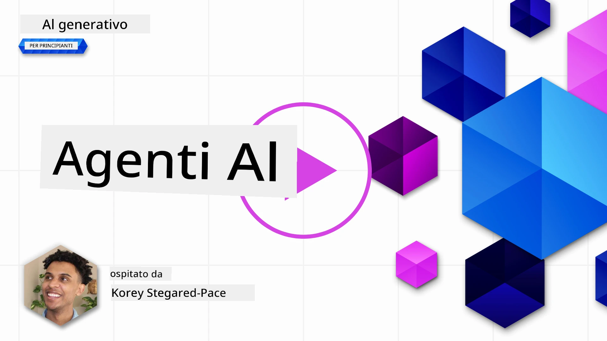
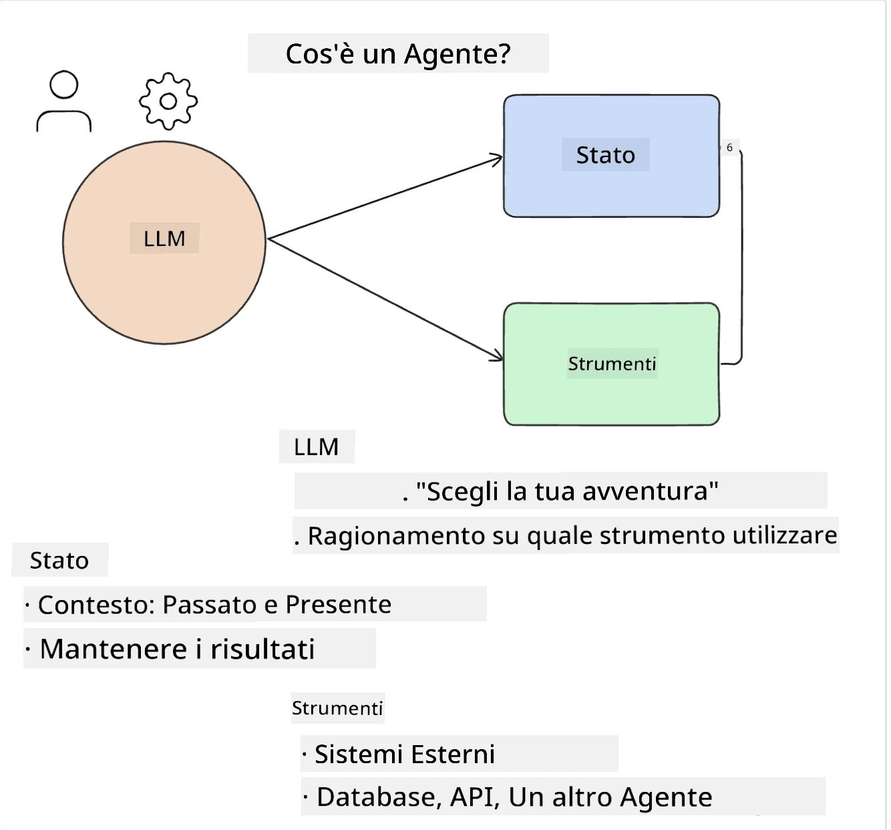
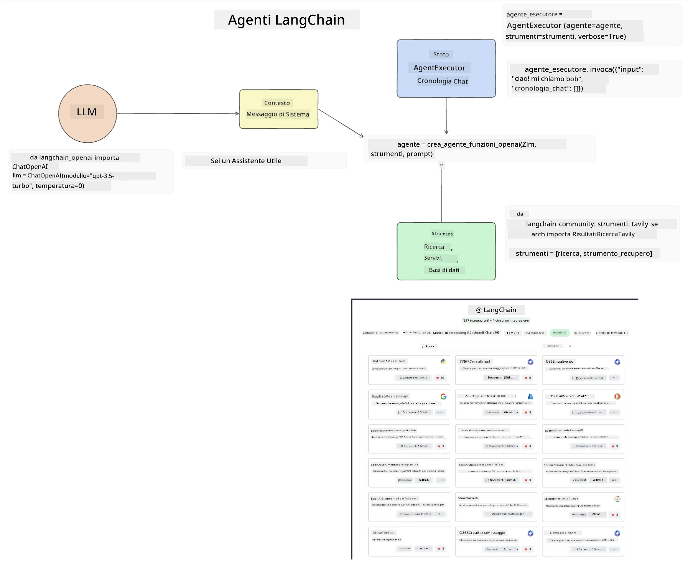
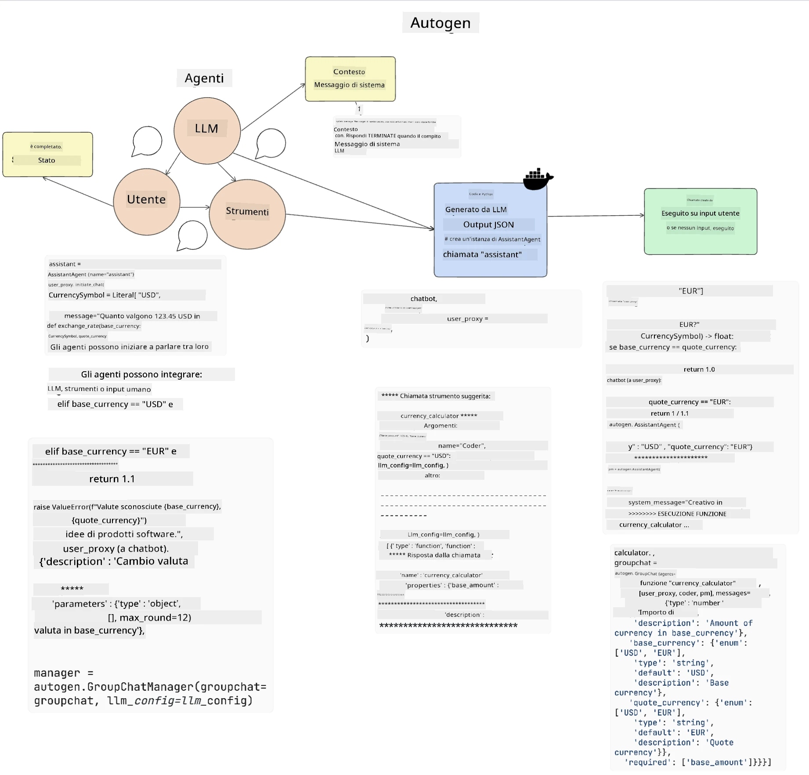
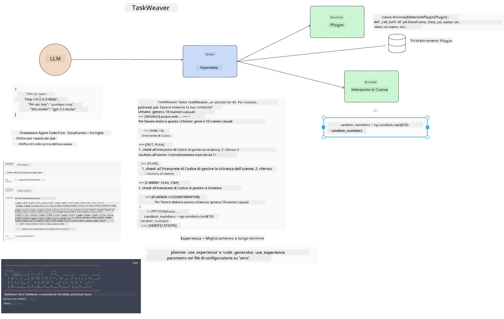
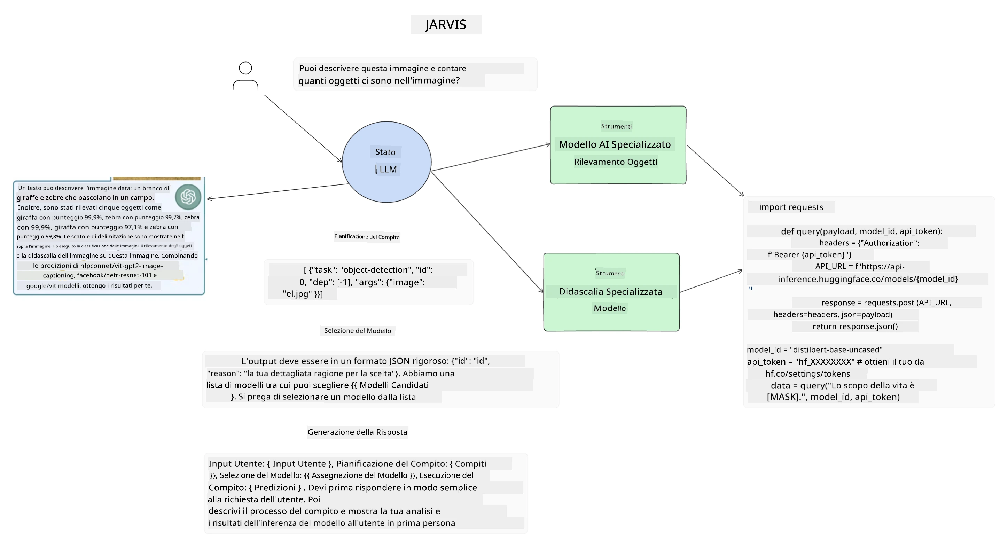

[](https://youtu.be/yAXVW-lUINc?si=bOtW9nL6jc3XJgOM)

## Introduzione

Gli agenti AI rappresentano un entusiasmante sviluppo nell'IA Generativa, permettendo ai Large Language Models (LLM) di evolversi da assistenti ad agenti in grado di intraprendere azioni. I framework per agenti AI consentono agli sviluppatori di creare applicazioni che danno accesso agli LLM a strumenti e gestione dello stato. Questi framework migliorano anche la visibilità, permettendo a utenti e sviluppatori di monitorare le azioni pianificate dagli LLM, migliorando così la gestione dell'esperienza.

La lezione coprirà le seguenti aree:

- Comprendere cosa sia un agente AI - Cos'è esattamente un agente AI?
- Esplorare quattro diversi framework per agenti AI - Cosa li rende unici?
- Applicare questi agenti AI a diversi casi d'uso - Quando dovremmo usare gli agenti AI?

## Obiettivi di apprendimento

Dopo aver seguito questa lezione, sarai in grado di:

- Spiegare cosa sono gli agenti AI e come possono essere usati.
- Avere una comprensione delle differenze tra alcuni dei popolari framework per agenti AI, e come differiscono.
- Capire come funzionano gli agenti AI per costruire applicazioni con essi.

## Cosa sono gli Agenti AI?

Gli agenti AI sono un campo molto entusiasmante nel mondo dell'IA Generativa. Con questo entusiasmo talvolta arriva una confusione di termini e della loro applicazione. Per mantenere le cose semplici e inclusive della maggior parte degli strumenti che si riferiscono agli agenti AI, useremo questa definizione:

Gli agenti AI permettono ai Large Language Models (LLM) di svolgere compiti dando loro accesso a **stato** e **strumenti**.



Definiamo questi termini:

**Large Language Models** - Sono i modelli citati throughout questo corso come GPT-3.5, GPT-4, Llama-2, ecc.

**Stato** - Si riferisce al contesto in cui l'LLM sta operando. L'LLM usa il contesto delle sue azioni passate e il contesto attuale, guidando il suo processo decisionale per azioni successive. I framework per agenti AI permettono agli sviluppatori di mantenere questo contesto più facilmente.

**Strumenti** - Per completare il compito richiesto dall'utente e pianificato dall'LLM, l'LLM ha bisogno di accesso a strumenti. Alcuni esempi di strumenti possono essere un database, un'API, un'applicazione esterna o anche un altro LLM!

Queste definizioni speriamo ti diano una buona base andando avanti mentre vediamo come sono implementati. Esploriamo alcuni diversi framework per agenti AI:

## Agenti LangChain

[LangChain Agents](https://python.langchain.com/docs/how_to/#agents?WT.mc_id=academic-105485-koreyst) è una implementazione delle definizioni che abbiamo fornito sopra.

Per gestire lo **stato**, usa una funzione integrata chiamata `AgentExecutor`. Questa accetta l'`agent` definito e gli `strumenti` disponibili.

L'`Agent Executor` memorizza anche la cronologia della chat per fornire il contesto della conversazione.



LangChain offre un [catalogo di strumenti](https://integrations.langchain.com/tools?WT.mc_id=academic-105485-koreyst) che possono essere importati nella tua applicazione a cui l'LLM può accedere. Questi sono creati dalla community e dal team di LangChain.

Puoi quindi definire questi strumenti e passarli all'`Agent Executor`.

La visibilità è un altro aspetto importante quando si parla di agenti AI. È importante per gli sviluppatori di applicazioni comprendere quale strumento l'LLM sta usando e perché. Per questo, il team di LangChain ha sviluppato LangSmith.

## AutoGen

Il prossimo framework per agenti AI di cui parleremo è [AutoGen](https://microsoft.github.io/autogen/?WT.mc_id=academic-105485-koreyst). Il focus principale di AutoGen è sulle conversazioni. Gli agenti sono sia **conversabili** che **personalizzabili**.

**Conversabile -** Gli LLM possono iniziare e continuare una conversazione con un altro LLM per completare un compito. Questo è fatto creando `AssistantAgents` e dando loro un messaggio di sistema specifico.

```python

autogen.AssistantAgent( name="Coder", llm_config=llm_config, ) pm = autogen.AssistantAgent( name="Product_manager", system_message="Creative in software product ideas.", llm_config=llm_config, )

```

**Personalizzabile** - Gli agenti possono essere definiti non solo come LLM ma anche come utente o strumento. Come sviluppatore, puoi definire un `UserProxyAgent` che è responsabile di interagire con l'utente per il feedback nel completare un compito. Questo feedback può continuare l'esecuzione del compito o fermarla.

```python
user_proxy = UserProxyAgent(name="user_proxy")
```

### Stato e Strumenti

Per cambiare e gestire lo stato, un agente assistente genera codice Python per completare il compito.

Ecco un esempio del processo:



#### LLM definito con un Messaggio di Sistema

```python
system_message="For weather related tasks, only use the functions you have been provided with. Reply TERMINATE when the task is done."
```

Questo messaggio di sistema indirizza questo specifico LLM su quali funzioni sono rilevanti per il suo compito. Ricorda, con AutoGen puoi avere più AssistantAgents definiti con messaggi di sistema diversi.

#### La chat è avviata dall'utente

```python
user_proxy.initiate_chat( chatbot, message="I am planning a trip to NYC next week, can you help me pick out what to wear? ", )

```

Questo messaggio da user_proxy (umano) è ciò che avvierà il processo dell'agente per esplorare le possibili funzioni da eseguire.

#### La funzione viene eseguita

```bash
chatbot (to user_proxy):

***** Suggested tool Call: get_weather ***** Arguments: {"location":"New York City, NY","time_periond:"7","temperature_unit":"Celsius"} ******************************************************** --------------------------------------------------------------------------------

>>>>>>>> EXECUTING FUNCTION get_weather... user_proxy (to chatbot): ***** Response from calling function "get_weather" ***** 112.22727272727272 EUR ****************************************************************

```

Una volta processata la chat iniziale, l'agente invierà il suggerimento dello strumento da chiamare. In questo caso, è una funzione chiamata `get_weather`. A seconda della tua configurazione, questa funzione può essere eseguita automaticamente e letta dall'agente oppure eseguita in base all'input dell'utente.

Puoi trovare una lista di [esempi di codice AutoGen](https://microsoft.github.io/autogen/docs/Examples/?WT.mc_id=academic-105485-koreyst) per esplorare ulteriormente come iniziare a costruire.

## Taskweaver

Il prossimo framework agent che esploreremo è [Taskweaver](https://microsoft.github.io/TaskWeaver/?WT.mc_id=academic-105485-koreyst). È conosciuto come un agente "code-first" perché invece di lavorare strettamente con `stringhe`, può lavorare con DataFrame in Python. Questo diventa estremamente utile per compiti di analisi dati e generazione. Questo può essere, ad esempio, la creazione di grafici e diagrammi o la generazione di numeri casuali.

### Stato e Strumenti

Per gestire lo stato della conversazione, TaskWeaver usa il concetto di `Planner`. Il `Planner` è un LLM che prende la richiesta dagli utenti e mappa i compiti che devono essere completati per soddisfare questa richiesta.

Per completare i compiti, il `Planner` è esposto alla raccolta di strumenti chiamati `Plugins`. Questi possono essere classi Python o un interprete di codice generico. Questi plugin sono memorizzati come embedding così che l'LLM possa cercare meglio il plugin corretto.



Ecco un esempio di un plugin per gestire il rilevamento di anomalie:

```python
class AnomalyDetectionPlugin(Plugin): def __call__(self, df: pd.DataFrame, time_col_name: str, value_col_name: str):
```

Il codice è verificato prima dell'esecuzione. Un'altra caratteristica per gestire il contesto in Taskweaver è `experience`. L'esperienza permette che il contesto di una conversazione venga conservato a lungo termine in un file YAML. Questo può essere configurato affinché l'LLM migliori nel tempo su certi compiti dato che è esposto a conversazioni precedenti.

## JARVIS

L'ultimo framework che esploreremo è [JARVIS](https://github.com/microsoft/JARVIS?tab=readme-ov-file&WT.mc_id=academic-105485-koreyst). Ciò che rende JARVIS unico è che usa un LLM per gestire lo `stato` della conversazione e gli `strumenti` sono altri modelli AI. Ciascuno di questi modelli AI è specializzato per svolgere certi compiti come il rilevamento di oggetti, trascrizione o la descrizione di immagini.



L'LLM, essendo un modello a uso generale, riceve la richiesta dall'utente e identifica il compito specifico e tutti gli argomenti/dati necessari per completare il compito.

```python
[{"task": "object-detection", "id": 0, "dep": [-1], "args": {"image": "e1.jpg" }}]
```

L'LLM quindi formatta la richiesta in un modo che il modello AI specializzato possa interpretare, come JSON. Una volta che il modello AI ha restituito la sua previsione basata sul compito, l'LLM riceve la risposta.

Se sono necessari più modelli per completare il compito, interpreterà anche la risposta di quei modelli prima di unirle per generare la risposta all'utente.

L'esempio qui sotto mostra come funziona quando un utente richiede una descrizione e il conteggio degli oggetti in un'immagine:

## Compito

Per continuare il tuo apprendimento sugli agenti AI puoi costruire con AutoGen:

- Un'applicazione che simula una riunione aziendale con diversi dipartimenti di una startup educativa.
- Crea messaggi di sistema che guidano gli LLM nella comprensione di diverse persone e priorità, e permettono all'utente di proporre una nuova idea di prodotto.
- L'LLM dovrebbe poi generare domande di follow-up da ogni dipartimento per rifinire e migliorare la proposta e l'idea del prodotto.

## L'apprendimento non si ferma qui, continua il viaggio

Dopo aver completato questa lezione, dai un'occhiata alla nostra [collezione di apprendimento di IA Generativa](https://aka.ms/genai-collection?WT.mc_id=academic-105485-koreyst) per continuare a migliorare le tue conoscenze sull'IA Generativa!

---

<!-- CO-OP TRANSLATOR DISCLAIMER START -->
**Dichiarazione di non responsabilità**:  
Questo documento è stato tradotto utilizzando il servizio di traduzione automatica [Co-op Translator](https://github.com/Azure/co-op-translator). Pur impegnandoci per garantire l’accuratezza, si prega di notare che le traduzioni automatizzate possono contenere errori o imprecisioni. Il documento originale nella sua lingua madre deve essere considerato la fonte autorevole. Per informazioni critiche, si raccomanda la traduzione professionale effettuata da un traduttore umano. Non ci assumiamo alcuna responsabilità per eventuali malintesi o interpretazioni errate derivanti dall’uso di questa traduzione.
<!-- CO-OP TRANSLATOR DISCLAIMER END -->