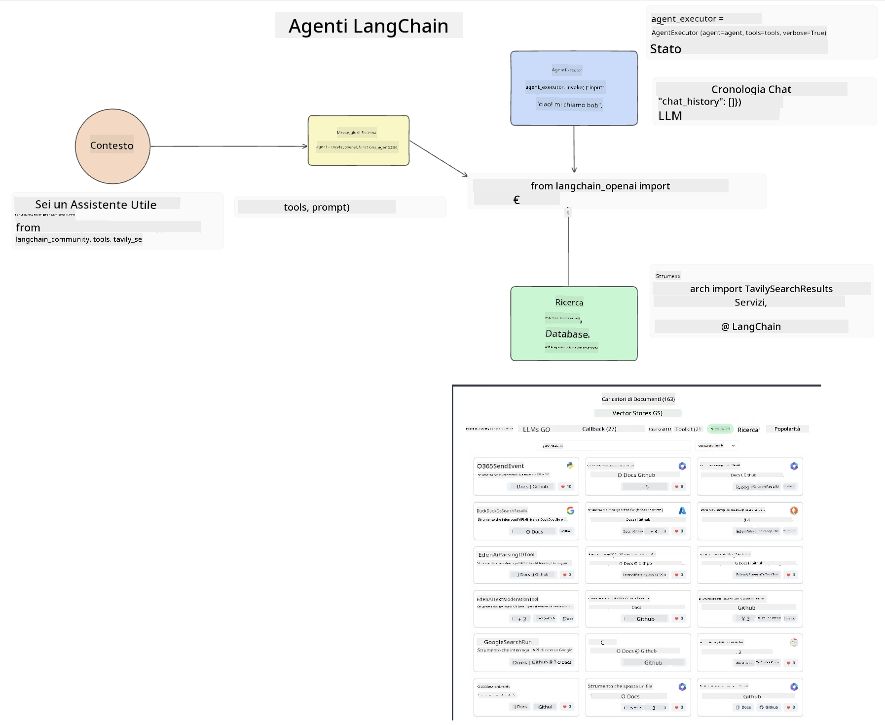
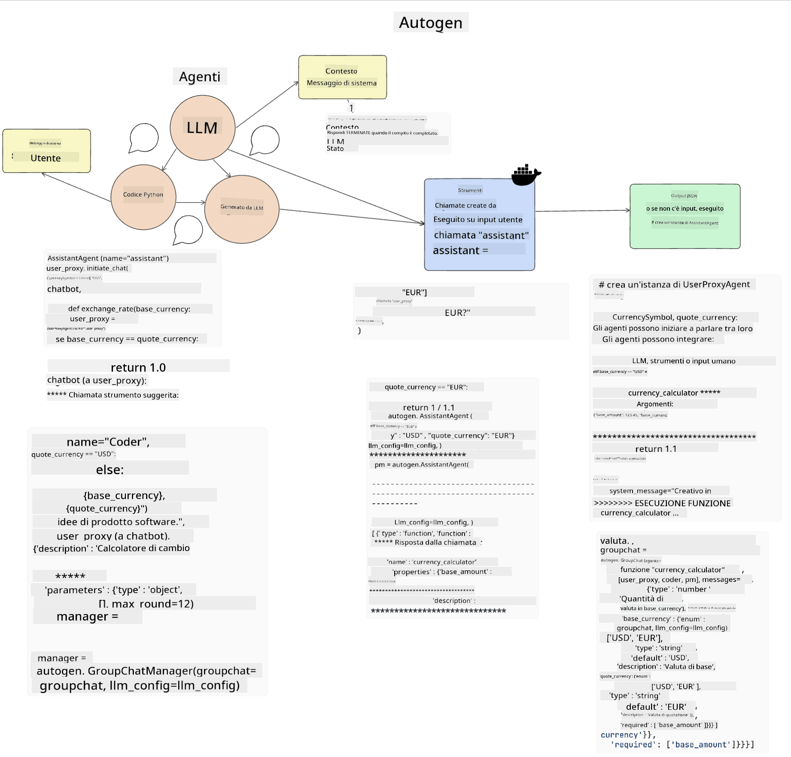

<!--
CO_OP_TRANSLATOR_METADATA:
{
  "original_hash": "11f03c81f190d9cbafd0f977dcbede6c",
  "translation_date": "2025-07-09T17:24:26+00:00",
  "source_file": "17-ai-agents/README.md",
  "language_code": "it"
}
-->
[](https://aka.ms/gen-ai-lesson17-gh?WT.mc_id=academic-105485-koreyst)

## Introduzione

Gli AI Agents rappresentano un’evoluzione entusiasmante nell’ambito della Generative AI, permettendo ai Large Language Models (LLM) di passare da semplici assistenti ad agenti capaci di compiere azioni. I framework per AI Agent consentono agli sviluppatori di creare applicazioni che danno agli LLM accesso a strumenti e gestione dello stato. Questi framework migliorano anche la visibilità, permettendo a utenti e sviluppatori di monitorare le azioni pianificate dagli LLM, migliorando così la gestione dell’esperienza.

La lezione tratterà i seguenti argomenti:

- Comprendere cosa sia un AI Agent - Cos’è esattamente un AI Agent?
- Esplorare quattro diversi AI Agent Framework - Cosa li rende unici?
- Applicare questi AI Agents a diversi casi d’uso - Quando dovremmo usare gli AI Agents?

## Obiettivi di apprendimento

Dopo aver seguito questa lezione, sarai in grado di:

- Spiegare cosa sono gli AI Agents e come possono essere utilizzati.
- Avere una comprensione delle differenze tra alcuni dei più popolari AI Agent Framework e come si distinguono.
- Capire come funzionano gli AI Agents per costruire applicazioni con essi.

## Cosa sono gli AI Agents?

Gli AI Agents rappresentano un campo molto interessante nel mondo della Generative AI. Con questo entusiasmo a volte si crea confusione sui termini e sul loro utilizzo. Per mantenere le cose semplici e includere la maggior parte degli strumenti che si riferiscono agli AI Agents, useremo questa definizione:

Gli AI Agents permettono ai Large Language Models (LLM) di svolgere compiti dando loro accesso a uno **stato** e a degli **strumenti**.


Definiamo questi termini:

**Large Language Models** - Sono i modelli citati in questo corso come GPT-3.5, GPT-4, Llama-2, ecc.

**Stato** - Si riferisce al contesto in cui l’LLM sta lavorando. L’LLM utilizza il contesto delle sue azioni passate e il contesto attuale per guidare le decisioni sulle azioni successive. I framework per AI Agent facilitano agli sviluppatori il mantenimento di questo contesto.

**Strumenti** - Per completare il compito richiesto dall’utente e pianificato dall’LLM, quest’ultimo ha bisogno di accedere a strumenti. Alcuni esempi possono essere un database, un’API, un’applicazione esterna o anche un altro LLM!

Queste definizioni ti daranno una buona base per capire come vengono implementati. Esploriamo alcuni diversi AI Agent framework:

## LangChain Agents

[LangChain Agents](https://python.langchain.com/docs/how_to/#agents?WT.mc_id=academic-105485-koreyst) è un’implementazione delle definizioni che abbiamo fornito sopra.

Per gestire lo **stato**, utilizza una funzione integrata chiamata `AgentExecutor`. Questa accetta l’`agent` definito e gli `tools` disponibili.

L’`AgentExecutor` memorizza anche la cronologia della chat per fornire il contesto della conversazione.



LangChain offre un [catalogo di strumenti](https://integrations.langchain.com/tools?WT.mc_id=academic-105485-koreyst) che possono essere importati nella tua applicazione e a cui l’LLM può accedere. Questi sono creati dalla community e dal team di LangChain.

Puoi quindi definire questi strumenti e passarli all’`AgentExecutor`.

La visibilità è un altro aspetto importante quando si parla di AI Agents. È fondamentale per gli sviluppatori capire quale strumento l’LLM sta usando e perché. Per questo, il team di LangChain ha sviluppato LangSmith.

## AutoGen

Il prossimo framework per AI Agent di cui parleremo è [AutoGen](https://microsoft.github.io/autogen/?WT.mc_id=academic-105485-koreyst). Il focus principale di AutoGen sono le conversazioni. Gli agenti sono sia **conversabili** che **personalizzabili**.

**Conversabili -** Gli LLM possono iniziare e continuare una conversazione con un altro LLM per completare un compito. Questo avviene creando `AssistantAgents` e assegnando loro un messaggio di sistema specifico.

```python

autogen.AssistantAgent( name="Coder", llm_config=llm_config, ) pm = autogen.AssistantAgent( name="Product_manager", system_message="Creative in software product ideas.", llm_config=llm_config, )

```

**Personalizzabili** - Gli agenti possono essere definiti non solo come LLM ma anche come utente o strumento. Come sviluppatore, puoi definire un `UserProxyAgent` che si occupa di interagire con l’utente per ricevere feedback nel completamento di un compito. Questo feedback può continuare l’esecuzione del compito o fermarla.

```python
user_proxy = UserProxyAgent(name="user_proxy")
```

### Stato e Strumenti

Per modificare e gestire lo stato, un Assistant Agent genera codice Python per completare il compito.

Ecco un esempio del processo:



#### LLM definito con un messaggio di sistema

```python
system_message="For weather related tasks, only use the functions you have been provided with. Reply TERMINATE when the task is done."
```

Questo messaggio di sistema indica a questo specifico LLM quali funzioni sono rilevanti per il suo compito. Ricorda, con AutoGen puoi avere più AssistantAgents definiti con messaggi di sistema diversi.

#### La chat è avviata dall’utente

```python
user_proxy.initiate_chat( chatbot, message="I am planning a trip to NYC next week, can you help me pick out what to wear? ", )

```

Questo messaggio da parte del user_proxy (umano) è ciò che avvia il processo dell’Agent per esplorare le possibili funzioni da eseguire.

#### La funzione viene eseguita

```bash
chatbot (to user_proxy):

***** Suggested tool Call: get_weather ***** Arguments: {"location":"New York City, NY","time_periond:"7","temperature_unit":"Celsius"} ******************************************************** --------------------------------------------------------------------------------

>>>>>>>> EXECUTING FUNCTION get_weather... user_proxy (to chatbot): ***** Response from calling function "get_weather" ***** 112.22727272727272 EUR ****************************************************************

```

Una volta elaborata la chat iniziale, l’Agent suggerisce lo strumento da chiamare. In questo caso, è una funzione chiamata `get_weather`. A seconda della configurazione, questa funzione può essere eseguita automaticamente e letta dall’Agent oppure eseguita in base all’input dell’utente.

Puoi trovare una lista di [esempi di codice AutoGen](https://microsoft.github.io/autogen/docs/Examples/?WT.mc_id=academic-105485-koreyst) per esplorare ulteriormente come iniziare a costruire.

## Taskweaver

Il prossimo framework agent che esploreremo è [Taskweaver](https://microsoft.github.io/TaskWeaver/?WT.mc_id=academic-105485-koreyst). È conosciuto come un agente "code-first" perché invece di lavorare strettamente con `stringhe`, può lavorare con DataFrame in Python. Questo è estremamente utile per compiti di analisi e generazione dati, come creare grafici e diagrammi o generare numeri casuali.

### Stato e Strumenti

Per gestire lo stato della conversazione, TaskWeaver utilizza il concetto di `Planner`. Il `Planner` è un LLM che prende la richiesta degli utenti e mappa i compiti da completare per soddisfare la richiesta.

Per completare i compiti, il `Planner` ha accesso a una collezione di strumenti chiamati `Plugins`. Questi possono essere classi Python o un interprete di codice generico. Questi plugin sono memorizzati come embeddings in modo che l’LLM possa cercare meglio il plugin corretto.


Ecco un esempio di plugin per gestire il rilevamento di anomalie:

```python
class AnomalyDetectionPlugin(Plugin): def __call__(self, df: pd.DataFrame, time_col_name: str, value_col_name: str):
```

Il codice viene verificato prima dell’esecuzione. Un’altra funzionalità per gestire il contesto in Taskweaver è l’`experience`. L’esperienza permette di conservare il contesto di una conversazione a lungo termine in un file YAML. Questo può essere configurato in modo che l’LLM migliori nel tempo su certi compiti, dato che viene esposto a conversazioni precedenti.

## JARVIS

L’ultimo framework agent che esploreremo è [JARVIS](https://github.com/microsoft/JARVIS?tab=readme-ov-file?WT.mc_id=academic-105485-koreyst). Ciò che rende JARVIS unico è che utilizza un LLM per gestire lo `stato` della conversazione mentre i `tools` sono altri modelli AI. Ciascuno di questi modelli AI è specializzato in compiti specifici come il rilevamento di oggetti, la trascrizione o la didascalia di immagini.


L’LLM, essendo un modello a uso generale, riceve la richiesta dall’utente e identifica il compito specifico e gli eventuali argomenti/dati necessari per completarlo.

```python
[{"task": "object-detection", "id": 0, "dep": [-1], "args": {"image": "e1.jpg" }}]
```

L’LLM poi formatta la richiesta in modo che il modello AI specializzato possa interpretarla, ad esempio in JSON. Una volta che il modello AI ha restituito la sua previsione basata sul compito, l’LLM riceve la risposta.

Se sono necessari più modelli per completare il compito, l’LLM interpreta anche le risposte di questi modelli prima di combinarle per generare la risposta finale all’utente.

L’esempio qui sotto mostra come funziona quando un utente richiede una descrizione e il conteggio degli oggetti in un’immagine:

## Compito

Per continuare il tuo apprendimento sugli AI Agents puoi costruire con AutoGen:

- Un’applicazione che simula una riunione aziendale con diversi dipartimenti di una startup educativa.
- Crea messaggi di sistema che guidino gli LLM nella comprensione di diverse persone e priorità, e permettano all’utente di presentare una nuova idea di prodotto.
- L’LLM dovrebbe poi generare domande di approfondimento da ciascun dipartimento per affinare e migliorare la presentazione e l’idea di prodotto.

## L’apprendimento non finisce qui, continua il viaggio

Dopo aver completato questa lezione, dai un’occhiata alla nostra [collezione di apprendimento sulla Generative AI](https://aka.ms/genai-collection?WT.mc_id=academic-105485-koreyst) per continuare a migliorare le tue conoscenze sulla Generative AI!

**Disclaimer**:  
Questo documento è stato tradotto utilizzando il servizio di traduzione automatica [Co-op Translator](https://github.com/Azure/co-op-translator). Pur impegnandoci per garantire accuratezza, si prega di notare che le traduzioni automatiche possono contenere errori o imprecisioni. Il documento originale nella sua lingua nativa deve essere considerato la fonte autorevole. Per informazioni critiche, si raccomanda una traduzione professionale effettuata da un umano. Non ci assumiamo alcuna responsabilità per eventuali malintesi o interpretazioni errate derivanti dall’uso di questa traduzione.