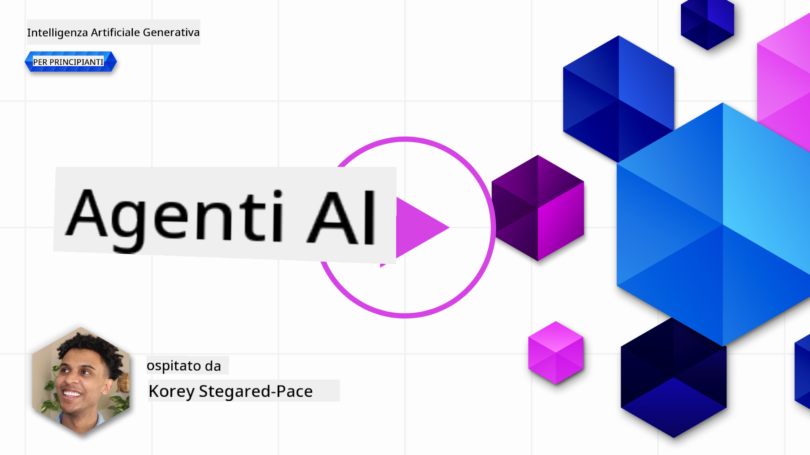

<!--
CO_OP_TRANSLATOR_METADATA:
{
  "original_hash": "8e8d1f6a63da606af7176a87ff8e92b6",
  "translation_date": "2025-10-17T16:13:28+00:00",
  "source_file": "17-ai-agents/README.md",
  "language_code": "it"
}
-->
[](https://youtu.be/yAXVW-lUINc?si=bOtW9nL6jc3XJgOM)

## Introduzione

Gli Agenti AI rappresentano uno sviluppo entusiasmante nell'ambito dell'AI Generativa, permettendo ai Modelli Linguistici di Grandi Dimensioni (LLM) di evolversi da semplici assistenti ad agenti capaci di intraprendere azioni. I framework per Agenti AI consentono agli sviluppatori di creare applicazioni che danno agli LLM accesso a strumenti e gestione dello stato. Questi framework migliorano anche la visibilità, permettendo agli utenti e agli sviluppatori di monitorare le azioni pianificate dagli LLM, migliorando così la gestione dell'esperienza.

La lezione coprirà i seguenti argomenti:

- Comprendere cosa sia un Agente AI - Cosa è esattamente un Agente AI?
- Esplorare quattro diversi framework per Agenti AI - Cosa li rende unici?
- Applicare questi Agenti AI a diversi casi d'uso - Quando dovremmo usare gli Agenti AI?

## Obiettivi di apprendimento

Dopo aver seguito questa lezione, sarai in grado di:

- Spiegare cosa sono gli Agenti AI e come possono essere utilizzati.
- Avere una comprensione delle differenze tra alcuni dei framework per Agenti AI più popolari e di come si differenziano.
- Comprendere come funzionano gli Agenti AI per costruire applicazioni con essi.

## Cosa sono gli Agenti AI?

Gli Agenti AI sono un campo molto entusiasmante nel mondo dell'AI Generativa. Con questo entusiasmo arriva talvolta una confusione sui termini e sulla loro applicazione. Per mantenere le cose semplici e inclusive rispetto alla maggior parte degli strumenti che si riferiscono agli Agenti AI, utilizzeremo questa definizione:

Gli Agenti AI permettono ai Modelli Linguistici di Grandi Dimensioni (LLM) di svolgere compiti dando loro accesso a uno **stato** e a **strumenti**.


Definiamo questi termini:

**Modelli Linguistici di Grandi Dimensioni** - Questi sono i modelli citati in tutto il corso, come GPT-3.5, GPT-4, Llama-2, ecc.

**Stato** - Si riferisce al contesto in cui l'LLM sta lavorando. L'LLM utilizza il contesto delle sue azioni passate e il contesto attuale, guidando il processo decisionale per le azioni successive. I framework per Agenti AI permettono agli sviluppatori di mantenere questo contesto più facilmente.

**Strumenti** - Per completare il compito richiesto dall'utente e pianificato dall'LLM, l'LLM ha bisogno di accesso a strumenti. Alcuni esempi di strumenti possono essere un database, un'API, un'applicazione esterna o persino un altro LLM!

Queste definizioni dovrebbero fornire una buona base per proseguire mentre esploriamo come vengono implementati. Esaminiamo alcuni framework per Agenti AI:

## LangChain Agents

[LangChain Agents](https://python.langchain.com/docs/how_to/#agents?WT.mc_id=academic-105485-koreyst) è un'implementazione delle definizioni che abbiamo fornito sopra.

Per gestire lo **stato**, utilizza una funzione integrata chiamata `AgentExecutor`. Questa accetta l'`agent` definito e gli `tools` disponibili.

L'`Agent Executor` memorizza anche la cronologia della chat per fornire il contesto della conversazione.


LangChain offre un [catalogo di strumenti](https://integrations.langchain.com/tools?WT.mc_id=academic-105485-koreyst) che possono essere importati nella tua applicazione, permettendo all'LLM di accedervi. Questi strumenti sono creati dalla comunità e dal team di LangChain.

Puoi quindi definire questi strumenti e passarli all'`Agent Executor`.

La visibilità è un altro aspetto importante quando si parla di Agenti AI. È fondamentale per gli sviluppatori di applicazioni comprendere quale strumento l'LLM sta utilizzando e perché. Per questo, il team di LangChain ha sviluppato LangSmith.

## AutoGen

Il prossimo framework per Agenti AI che discuteremo è [AutoGen](https://microsoft.github.io/autogen/?WT.mc_id=academic-105485-koreyst). Il focus principale di AutoGen sono le conversazioni. Gli agenti sono sia **conversabili** che **personalizzabili**.

**Conversabili -** Gli LLM possono iniziare e continuare una conversazione con un altro LLM per completare un compito. Questo avviene creando `AssistantAgents` e fornendo loro un messaggio di sistema specifico.

```python

autogen.AssistantAgent( name="Coder", llm_config=llm_config, ) pm = autogen.AssistantAgent( name="Product_manager", system_message="Creative in software product ideas.", llm_config=llm_config, )

```

**Personalizzabili** - Gli agenti possono essere definiti non solo come LLM ma anche come utenti o strumenti. Come sviluppatore, puoi definire un `UserProxyAgent` responsabile dell'interazione con l'utente per ottenere feedback nel completamento di un compito. Questo feedback può continuare l'esecuzione del compito o interromperlo.

```python
user_proxy = UserProxyAgent(name="user_proxy")
```

### Stato e Strumenti

Per modificare e gestire lo stato, un Assistant Agent genera codice Python per completare il compito.

Ecco un esempio del processo:


#### LLM Definito con un Messaggio di Sistema

```python
system_message="For weather related tasks, only use the functions you have been provided with. Reply TERMINATE when the task is done."
```

Questo messaggio di sistema indirizza questo specifico LLM verso le funzioni rilevanti per il suo compito. Ricorda, con AutoGen puoi avere più AssistantAgents definiti con messaggi di sistema diversi.

#### La Chat è Iniziata dall'Utente

```python
user_proxy.initiate_chat( chatbot, message="I am planning a trip to NYC next week, can you help me pick out what to wear? ", )

```

Questo messaggio dal user_proxy (Human) è ciò che avvia il processo dell'Agente per esplorare le funzioni che dovrebbe eseguire.

#### La Funzione è Eseguita

```bash
chatbot (to user_proxy):

***** Suggested tool Call: get_weather ***** Arguments: {"location":"New York City, NY","time_periond:"7","temperature_unit":"Celsius"} ******************************************************** --------------------------------------------------------------------------------

>>>>>>>> EXECUTING FUNCTION get_weather... user_proxy (to chatbot): ***** Response from calling function "get_weather" ***** 112.22727272727272 EUR ****************************************************************

```

Una volta elaborata la chat iniziale, l'Agente suggerirà lo strumento da chiamare. In questo caso, è una funzione chiamata `get_weather`. A seconda della configurazione, questa funzione può essere eseguita automaticamente e letta dall'Agente oppure eseguita in base all'input dell'utente.

Puoi trovare un elenco di [esempi di codice AutoGen](https://microsoft.github.io/autogen/docs/Examples/?WT.mc_id=academic-105485-koreyst) per esplorare ulteriormente come iniziare a costruire.

## Taskweaver

Il prossimo framework per agenti che esploreremo è [Taskweaver](https://microsoft.github.io/TaskWeaver/?WT.mc_id=academic-105485-koreyst). È noto come un agente "code-first" perché, invece di lavorare esclusivamente con `stringhe`, può lavorare con DataFrame in Python. Questo risulta estremamente utile per analisi e generazione di dati, come la creazione di grafici e diagrammi o la generazione di numeri casuali.

### Stato e Strumenti

Per gestire lo stato della conversazione, TaskWeaver utilizza il concetto di `Planner`. Il `Planner` è un LLM che riceve la richiesta dagli utenti e pianifica i compiti necessari per soddisfare questa richiesta.

Per completare i compiti, il `Planner` ha accesso a una raccolta di strumenti chiamati `Plugins`. Questi possono essere classi Python o un interprete di codice generale. Questi plugin sono memorizzati come embeddings per permettere all'LLM di cercare meglio il plugin corretto.


Ecco un esempio di un plugin per gestire il rilevamento di anomalie:

```python
class AnomalyDetectionPlugin(Plugin): def __call__(self, df: pd.DataFrame, time_col_name: str, value_col_name: str):
```

Il codice viene verificato prima di essere eseguito. Un'altra funzionalità per gestire il contesto in Taskweaver è `experience`. L'esperienza permette di memorizzare il contesto di una conversazione a lungo termine in un file YAML. Questo può essere configurato in modo che l'LLM migliori nel tempo su determinati compiti, dato che è esposto a conversazioni precedenti.

## JARVIS

L'ultimo framework per agenti che esploreremo è [JARVIS](https://github.com/microsoft/JARVIS?tab=readme-ov-file?WT.mc_id=academic-105485-koreyst). Ciò che rende JARVIS unico è che utilizza un LLM per gestire lo `stato` della conversazione e gli `strumenti` sono altri modelli AI. Ciascuno dei modelli AI è specializzato in compiti specifici, come il rilevamento di oggetti, la trascrizione o la descrizione di immagini.


L'LLM, essendo un modello generico, riceve la richiesta dall'utente e identifica il compito specifico e qualsiasi argomento/dato necessario per completare il compito.

```python
[{"task": "object-detection", "id": 0, "dep": [-1], "args": {"image": "e1.jpg" }}]
```

L'LLM quindi formatta la richiesta in un modo che il modello AI specializzato possa interpretare, come JSON. Una volta che il modello AI ha restituito la sua previsione basata sul compito, l'LLM riceve la risposta.

Se sono necessari più modelli per completare il compito, l'LLM interpreterà anche le risposte di quei modelli prima di unirle per generare la risposta per l'utente.

L'esempio seguente mostra come funzionerebbe quando un utente richiede una descrizione e un conteggio degli oggetti in un'immagine:

## Compito

Per continuare il tuo apprendimento sugli Agenti AI, puoi costruire con AutoGen:

- Un'applicazione che simula una riunione aziendale con diversi dipartimenti di una startup educativa.
- Creare messaggi di sistema che guidino gli LLM nella comprensione di diverse personalità e priorità, permettendo all'utente di presentare un'idea di prodotto.
- L'LLM dovrebbe quindi generare domande di follow-up da ciascun dipartimento per perfezionare e migliorare l'idea del prodotto.

## L'apprendimento non si ferma qui, continua il viaggio

Dopo aver completato questa lezione, dai un'occhiata alla nostra [collezione di apprendimento sull'AI Generativa](https://aka.ms/genai-collection?WT.mc_id=academic-105485-koreyst) per continuare a migliorare le tue conoscenze sull'AI Generativa!

---

**Disclaimer**:  
Questo documento è stato tradotto utilizzando il servizio di traduzione AI [Co-op Translator](https://github.com/Azure/co-op-translator). Sebbene ci impegniamo per garantire l'accuratezza, si prega di notare che le traduzioni automatiche possono contenere errori o imprecisioni. Il documento originale nella sua lingua nativa dovrebbe essere considerato la fonte autorevole. Per informazioni critiche, si raccomanda una traduzione professionale umana. Non siamo responsabili per eventuali incomprensioni o interpretazioni errate derivanti dall'uso di questa traduzione.