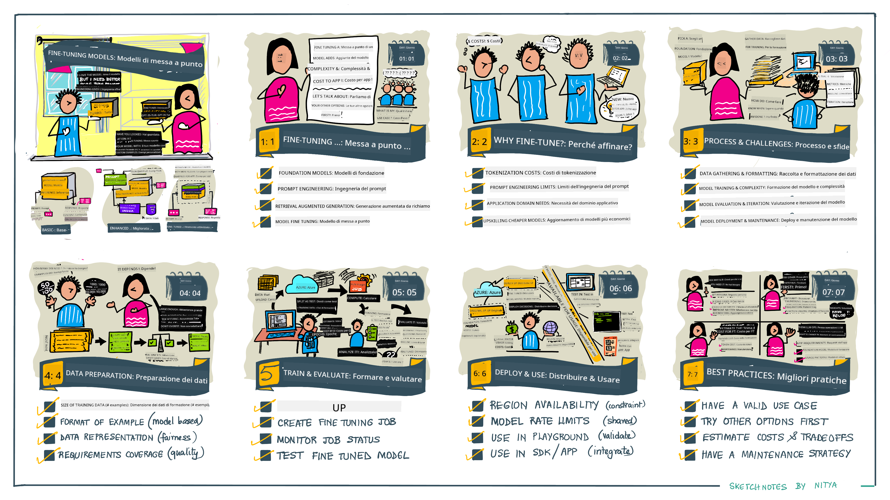

<!--
CO_OP_TRANSLATOR_METADATA:
{
  "original_hash": "68664f7e754a892ae1d8d5e2b7bd2081",
  "translation_date": "2025-07-09T17:41:53+00:00",
  "source_file": "18-fine-tuning/README.md",
  "language_code": "it"
}
-->

# Fine-Tuning del tuo LLM

L’utilizzo di grandi modelli di linguaggio per costruire applicazioni di intelligenza artificiale generativa comporta nuove sfide. Una questione chiave è garantire la qualità delle risposte (accuratezza e rilevanza) nel contenuto generato dal modello per una specifica richiesta dell’utente. Nelle lezioni precedenti abbiamo discusso tecniche come il prompt engineering e la generazione aumentata da retrieval, che cercano di risolvere il problema _modificando l’input del prompt_ al modello esistente.

Nella lezione di oggi, parleremo di una terza tecnica, il **fine-tuning**, che cerca di affrontare la sfida _riaddestrando il modello stesso_ con dati aggiuntivi. Entriamo nei dettagli.

## Obiettivi di Apprendimento

Questa lezione introduce il concetto di fine-tuning per modelli di linguaggio pre-addestrati, esplora i vantaggi e le sfide di questo approccio e fornisce indicazioni su quando e come utilizzare il fine-tuning per migliorare le prestazioni dei tuoi modelli di intelligenza artificiale generativa.

Al termine di questa lezione, dovresti essere in grado di rispondere alle seguenti domande:

- Cos’è il fine-tuning per i modelli di linguaggio?
- Quando e perché il fine-tuning è utile?
- Come posso fare il fine-tuning di un modello pre-addestrato?
- Quali sono i limiti del fine-tuning?

Pronto? Iniziamo.

## Guida Illustrata

Vuoi avere una panoramica di ciò che tratteremo prima di entrare nel dettaglio? Dai un’occhiata a questa guida illustrata che descrive il percorso di apprendimento per questa lezione – dall’apprendere i concetti fondamentali e la motivazione del fine-tuning, fino a comprendere il processo e le migliori pratiche per eseguire il compito di fine-tuning. È un argomento affascinante da esplorare, quindi non dimenticare di visitare la pagina [Resources](./RESOURCES.md?WT.mc_id=academic-105485-koreyst) per ulteriori link a supporto del tuo percorso di apprendimento autonomo!

## Cos’è il fine-tuning per i modelli di linguaggio?

Per definizione, i grandi modelli di linguaggio sono _pre-addestrati_ su grandi quantità di testo provenienti da fonti diverse, incluso internet. Come abbiamo imparato nelle lezioni precedenti, abbiamo bisogno di tecniche come il _prompt engineering_ e la _generazione aumentata da retrieval_ per migliorare la qualità delle risposte del modello alle domande dell’utente (“prompt”).

Una tecnica popolare di prompt engineering consiste nel fornire al modello maggiori indicazioni su cosa ci si aspetta nella risposta, sia tramite _istruzioni_ (guida esplicita) sia _fornendo alcuni esempi_ (guida implicita). Questo è noto come _few-shot learning_, ma presenta due limiti:

- I limiti di token del modello possono restringere il numero di esempi che puoi fornire, limitandone l’efficacia.
- I costi in token del modello possono rendere costoso aggiungere esempi a ogni prompt, limitando la flessibilità.

Il fine-tuning è una pratica comune nei sistemi di machine learning in cui si prende un modello pre-addestrato e lo si riaddestra con nuovi dati per migliorarne le prestazioni su un compito specifico. Nel contesto dei modelli di linguaggio, possiamo fare il fine-tuning del modello pre-addestrato _con un set curato di esempi per un dato compito o dominio applicativo_ per creare un **modello personalizzato** che può essere più accurato e rilevante per quel compito o dominio specifico. Un beneficio secondario del fine-tuning è che può anche ridurre il numero di esempi necessari per il few-shot learning, diminuendo l’uso di token e i costi correlati.

## Quando e perché dovremmo fare il fine-tuning dei modelli?

In _questo_ contesto, quando parliamo di fine-tuning, ci riferiamo al fine-tuning **supervisionato**, dove il riaddestramento avviene **aggiungendo nuovi dati** che non facevano parte del dataset originale di addestramento. Questo è diverso da un approccio di fine-tuning non supervisionato, in cui il modello viene riaddestrato sugli stessi dati originali, ma con iperparametri differenti.

La cosa importante da ricordare è che il fine-tuning è una tecnica avanzata che richiede un certo livello di competenza per ottenere i risultati desiderati. Se fatto in modo errato, potrebbe non fornire i miglioramenti attesi e potrebbe persino peggiorare le prestazioni del modello per il dominio target.

Quindi, prima di imparare “come” fare il fine-tuning dei modelli di linguaggio, devi sapere “perché” dovresti intraprendere questa strada e “quando” iniziare il processo di fine-tuning. Inizia ponendoti queste domande:

- **Caso d’uso**: Qual è il tuo _caso d’uso_ per il fine-tuning? Quale aspetto del modello pre-addestrato attuale vuoi migliorare?
- **Alternative**: Hai provato _altre tecniche_ per raggiungere i risultati desiderati? Usale per creare un punto di riferimento per il confronto.
  - Prompt engineering: Prova tecniche come il few-shot prompting con esempi di risposte rilevanti. Valuta la qualità delle risposte.
  - Generazione aumentata da retrieval: Prova ad arricchire i prompt con risultati di query recuperati cercando nei tuoi dati. Valuta la qualità delle risposte.
- **Costi**: Hai identificato i costi del fine-tuning?
  - Possibilità di tuning – il modello pre-addestrato è disponibile per il fine-tuning?
  - Sforzo – per preparare i dati di addestramento, valutare e perfezionare il modello.
  - Calcolo – per eseguire i job di fine-tuning e distribuire il modello fine-tuned.
  - Dati – accesso a esempi di qualità sufficiente per un impatto significativo del fine-tuning.
- **Benefici**: Hai confermato i benefici del fine-tuning?
  - Qualità – il modello fine-tuned ha superato il baseline?
  - Costo – riduce l’uso di token semplificando i prompt?
  - Estendibilità – puoi riutilizzare il modello base per nuovi domini?

Rispondendo a queste domande, dovresti essere in grado di decidere se il fine-tuning è l’approccio giusto per il tuo caso d’uso. Idealmente, l’approccio è valido solo se i benefici superano i costi. Una volta deciso di procedere, è il momento di pensare a _come_ fare il fine-tuning del modello pre-addestrato.

Vuoi approfondire il processo decisionale? Guarda [To fine-tune or not to fine-tune](https://www.youtube.com/watch?v=0Jo-z-MFxJs)

## Come possiamo fare il fine-tuning di un modello pre-addestrato?

Per fare il fine-tuning di un modello pre-addestrato, hai bisogno di:

- un modello pre-addestrato da fine-tunare
- un dataset da utilizzare per il fine-tuning
- un ambiente di addestramento per eseguire il job di fine-tuning
- un ambiente di hosting per distribuire il modello fine-tuned

## Fine-Tuning in Azione

Le risorse seguenti offrono tutorial passo-passo per guidarti attraverso un esempio reale utilizzando un modello selezionato con un dataset curato. Per seguire questi tutorial, è necessario avere un account presso il provider specifico, insieme all’accesso ai modelli e ai dataset rilevanti.

| Provider     | Tutorial                                                                                                                                                                       | Descrizione                                                                                                                                                                                                                                                                                                                                                                                                                        |
| ------------ | ------------------------------------------------------------------------------------------------------------------------------------------------------------------------------ | ---------------------------------------------------------------------------------------------------------------------------------------------------------------------------------------------------------------------------------------------------------------------------------------------------------------------------------------------------------------------------------------------------------------------------------- |
| OpenAI       | [How to fine-tune chat models](https://github.com/openai/openai-cookbook/blob/main/examples/How_to_finetune_chat_models.ipynb?WT.mc_id=academic-105485-koreyst)                | Impara a fare il fine-tuning di un `gpt-35-turbo` per un dominio specifico (“assistente ricette”) preparando i dati di addestramento, eseguendo il job di fine-tuning e utilizzando il modello fine-tuned per l’inferenza.                                                                                                                                                                                                          |
| Azure OpenAI | [GPT 3.5 Turbo fine-tuning tutorial](https://learn.microsoft.com/azure/ai-services/openai/tutorials/fine-tune?tabs=python-new%2Ccommand-line?WT.mc_id=academic-105485-koreyst) | Impara a fare il fine-tuning di un modello `gpt-35-turbo-0613` **su Azure** seguendo i passaggi per creare e caricare i dati di addestramento, eseguire il job di fine-tuning, distribuire e utilizzare il nuovo modello.                                                                                                                                                                                                             |
| Hugging Face | [Fine-tuning LLMs with Hugging Face](https://www.philschmid.de/fine-tune-llms-in-2024-with-trl?WT.mc_id=academic-105485-koreyst)                                               | Questo post sul blog ti guida nel fine-tuning di un _open LLM_ (es: `CodeLlama 7B`) usando la libreria [transformers](https://huggingface.co/docs/transformers/index?WT.mc_id=academic-105485-koreyst) e [Transformer Reinforcement Learning (TRL)](https://huggingface.co/docs/trl/index?WT.mc_id=academic-105485-koreyst) con dataset aperti su Hugging Face.                                                                                   |
|              |                                                                                                                                                                                |                                                                                                                                                                                                                                                                                                                                                                                                                                    |
| 🤗 AutoTrain | [Fine-tuning LLMs with AutoTrain](https://github.com/huggingface/autotrain-advanced/?WT.mc_id=academic-105485-koreyst)                                                         | AutoTrain (o AutoTrain Advanced) è una libreria Python sviluppata da Hugging Face che permette il fine-tuning per molti compiti diversi, incluso il fine-tuning di LLM. AutoTrain è una soluzione no-code e il fine-tuning può essere fatto nel tuo cloud, su Hugging Face Spaces o localmente. Supporta sia un’interfaccia web GUI, CLI e l’addestramento tramite file di configurazione yaml.                                                    |
|              |                                                                                                                                                                                |                                                                                                                                                                                                                                                                                                                                                                                                                                    |

## Compito

Scegli uno dei tutorial sopra e seguilo passo passo. _Potremmo replicare una versione di questi tutorial in Jupyter Notebooks in questo repository solo a scopo di riferimento. Ti consigliamo di usare direttamente le fonti originali per avere le versioni più aggiornate_.

## Ottimo lavoro! Continua a imparare.

Dopo aver completato questa lezione, dai un’occhiata alla nostra [collezione di apprendimento sull’Intelligenza Artificiale Generativa](https://aka.ms/genai-collection?WT.mc_id=academic-105485-koreyst) per continuare a migliorare le tue conoscenze sull’IA generativa!

Congratulazioni!! Hai completato l’ultima lezione della serie v2 di questo corso! Non smettere di imparare e costruire. \*\*Consulta la pagina [RESOURCES](RESOURCES.md?WT.mc_id=academic-105485-koreyst) per un elenco di suggerimenti aggiuntivi su questo argomento.

La nostra serie di lezioni v1 è stata aggiornata con più compiti e concetti. Prenditi un momento per rinfrescare le tue conoscenze – e per favore [condividi le tue domande e feedback](https://github.com/microsoft/generative-ai-for-beginners/issues?WT.mc_id=academic-105485-koreyst) per aiutarci a migliorare queste lezioni per la community.

**Disclaimer**:  
Questo documento è stato tradotto utilizzando il servizio di traduzione automatica [Co-op Translator](https://github.com/Azure/co-op-translator). Pur impegnandoci per garantire l’accuratezza, si prega di notare che le traduzioni automatiche possono contenere errori o imprecisioni. Il documento originale nella sua lingua nativa deve essere considerato la fonte autorevole. Per informazioni critiche, si raccomanda una traduzione professionale effettuata da un umano. Non ci assumiamo alcuna responsabilità per eventuali malintesi o interpretazioni errate derivanti dall’uso di questa traduzione.