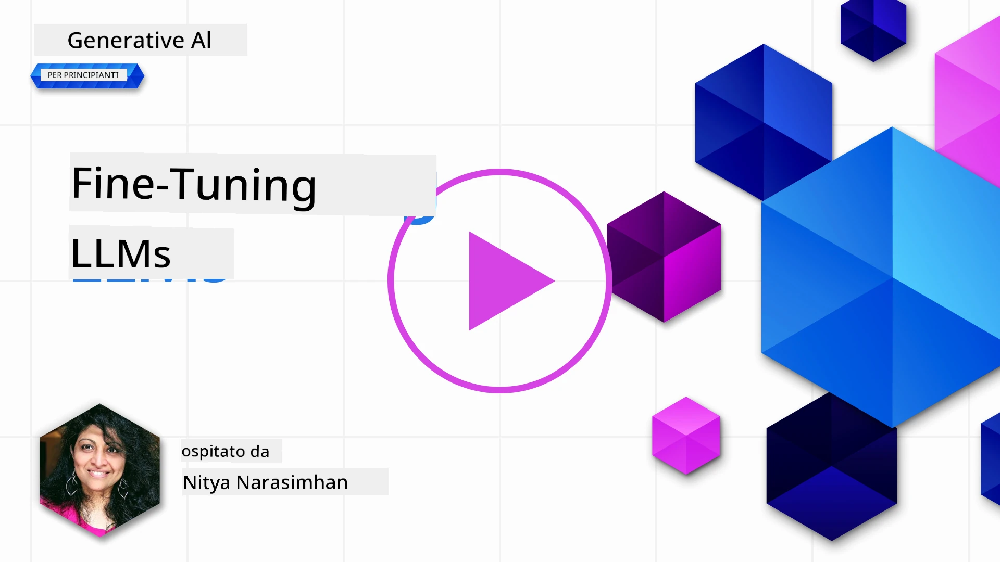
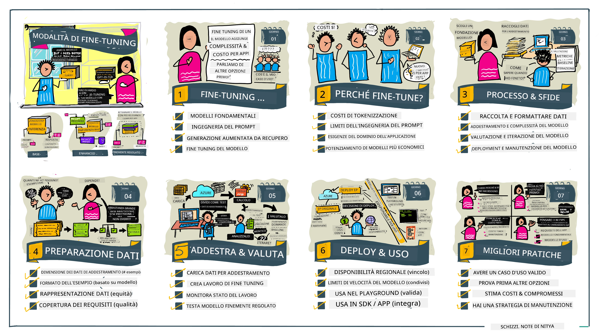

# Fine-Tuning del tuo LLM

L’utilizzo di grandi modelli linguistici per costruire applicazioni di intelligenza artificiale generativa comporta nuove sfide. Una questione chiave è garantire la qualità della risposta (accuratezza e pertinenza) nel contenuto generato dal modello per una specifica richiesta dell’utente. Nelle lezioni precedenti abbiamo discusso tecniche come il prompt engineering e la generazione aumentata da retrieval che cercano di risolvere il problema _modificando il prompt in ingresso_ del modello esistente.

Nella lezione di oggi, discutiamo una terza tecnica, il **fine-tuning**, che cerca di affrontare la sfida _riaddestrando il modello stesso_ con dati aggiuntivi. Entriamo nei dettagli.

## Obiettivi di Apprendimento

Questa lezione introduce il concetto di fine-tuning per modelli linguistici pre-addestrati, esplora i benefici e le sfide di questo approccio e fornisce indicazioni su quando e come utilizzare il fine-tuning per migliorare le prestazioni dei tuoi modelli di intelligenza artificiale generativa.

Al termine della lezione, dovresti essere in grado di rispondere alle seguenti domande:

- Che cos’è il fine-tuning per i modelli linguistici?
- Quando e perché il fine-tuning è utile?
- Come posso effettuare il fine-tuning di un modello pre-addestrato?
- Quali sono i limiti del fine-tuning?

Sei pronto? Iniziamo.

## Guida Illustrata

Vuoi avere una panoramica di ciò che tratteremo prima di iniziare? Dai un’occhiata a questa guida illustrata che descrive il percorso di apprendimento per questa lezione - dall’apprendere i concetti fondamentali e le motivazioni per il fine-tuning, a comprendere il processo e le migliori pratiche per eseguire il compito di fine-tuning. Questo è un argomento affascinante per l’esplorazione, quindi non dimenticare di visitare la pagina [Risorse](./RESOURCES.md?WT.mc_id=academic-105485-koreyst) per ulteriori link a supporto del tuo percorso di apprendimento autonomo!

## Che cos’è il fine-tuning per i modelli linguistici?

Per definizione, i grandi modelli linguistici sono _pre-addestrati_ su grandi quantità di testi provenienti da fonti diverse, inclusa internet. Come abbiamo appreso nelle lezioni precedenti, abbiamo bisogno di tecniche come il _prompt engineering_ e la _generazione aumentata da retrieval_ per migliorare la qualità delle risposte del modello alle domande ("prompt") dell’utente.

Una tecnica di prompt engineering popolare prevede di fornire al modello indicazioni più precise su cosa ci si aspetta nella risposta, sia fornendo _istruzioni_ (guida esplicita) sia _fornendo pochi esempi_ (guida implicita). Questo è noto come _few-shot learning_, ma ha due limitazioni:

- I limiti dei token del modello possono restringere il numero di esempi che puoi fornire, limitandone l’efficacia.
- I costi in token del modello possono rendere costoso aggiungere esempi a ogni prompt, limitando la flessibilità.

Il fine-tuning è una pratica comune nei sistemi di machine learning dove si prende un modello pre-addestrato e lo si riaddestra con nuovi dati per migliorare le prestazioni su un compito specifico. Nel contesto dei modelli linguistici, possiamo fare fine-tuning del modello pre-addestrato _con un insieme curato di esempi per un dato compito o dominio applicativo_ per creare un **modello personalizzato** che possa essere più accurato e pertinente per quel compito o dominio specifico. Un beneficio secondario del fine-tuning è che può anche ridurre il numero di esempi necessari per il few-shot learning, diminuendo l’uso di token e i costi correlati.

## Quando e perché dovremmo fare fine-tuning ai modelli?

In _questo_ contesto, quando parliamo di fine-tuning, ci riferiamo al fine-tuning **supervisionato**, dove il riaddestramento avviene **aggiungendo nuovi dati** che non facevano parte del dataset originale di addestramento. Questo è diverso da un approccio di fine-tuning non supervisionato, in cui il modello viene riaddestrato sui dati originali, ma con iperparametri diversi.

La cosa importante da ricordare è che il fine-tuning è una tecnica avanzata che richiede un certo livello di competenza per ottenere i risultati desiderati. Se fatto in modo scorretto, potrebbe non fornire i miglioramenti attesi, e potrebbe persino degradare le prestazioni del modello per il dominio mirato.

Quindi, prima di imparare "come" fare fine-tuning ai modelli linguistici, devi sapere "perché" dovresti intraprendere questa strada, e "quando" iniziare il processo di fine-tuning. Inizia ponendoti queste domande:

- **Caso d’uso**: Qual è il tuo _caso d’uso_ per il fine-tuning? Quale aspetto del modello pre-addestrato attuale vuoi migliorare?
- **Alternative**: Hai provato _altre tecniche_ per raggiungere i risultati desiderati? Usale per creare una baseline per il confronto.
  - Prompt engineering: prova tecniche come il few-shot prompting con esempi di risposte pertinenti. Valuta la qualità delle risposte.
  - Generazione Aumentata da Retrieval: prova ad arricchire i prompt con risultati di query ottenuti cercando nei tuoi dati. Valuta la qualità delle risposte.
- **Costi**: Hai identificato i costi per il fine-tuning?
  - Tunabilità – il modello pre-addestrato è disponibile per il fine-tuning?
  - Sforzo – per preparare i dati di addestramento, valutare e rifinire il modello.
  - Calcolo – per eseguire i lavori di fine-tuning e distribuire il modello fine-tunato.
  - Dati – accesso a esempi di qualità sufficientemente elevata per un impatto significativo.
- **Benefici**: Hai confermato i benefici del fine-tuning?
  - Qualità – il modello fine-tunato ha superato la baseline?
  - Costo – riduce l’uso di token semplificando i prompt?
  - Estendibilità – puoi riutilizzare il modello base per nuovi domini?

Rispondendo a queste domande, dovresti essere in grado di decidere se il fine-tuning è l’approccio giusto per il tuo caso d’uso. Idealmente, l’approccio è valido solo se i benefici superano i costi. Una volta deciso di procedere, è il momento di pensare a _come_ puoi fare fine-tuning del modello pre-addestrato.

Vuoi ottenere ulteriori approfondimenti sul processo decisionale? Guarda [Fine-tuning o no?](https://www.youtube.com/watch?v=0Jo-z-MFxJs)

## Come possiamo fare fine-tuning di un modello pre-addestrato?

Per fare fine-tuning di un modello pre-addestrato, hai bisogno di:

- un modello pre-addestrato da fine-tunare
- un dataset da utilizzare per il fine-tuning
- un ambiente di addestramento per eseguire il job di fine-tuning
- un ambiente di hosting per distribuire il modello fine-tunato

## Fine-Tuning in Azione

Le risorse seguenti forniscono tutorial passo passo per guidarti attraverso un esempio reale utilizzando un modello selezionato con un dataset curato. Per lavorare con questi tutorial, hai bisogno di un account sul provider specifico, insieme all’accesso al modello e ai dataset rilevanti.

| Provider     | Tutorial                                                                                                                                                                       | Descrizione                                                                                                                                                                                                                                                                                                                                                                                                                       |
| ------------ | ------------------------------------------------------------------------------------------------------------------------------------------------------------------------------ | --------------------------------------------------------------------------------------------------------------------------------------------------------------------------------------------------------------------------------------------------------------------------------------------------------------------------------------------------------------------------------------------------------------------------------- |
| OpenAI       | [Come fare fine-tuning ai modelli di chat](https://github.com/openai/openai-cookbook/blob/main/examples/How_to_finetune_chat_models.ipynb?WT.mc_id=academic-105485-koreyst)    | Impara a fare fine-tuning di un `gpt-35-turbo` per un dominio specifico ("assistente ricette") preparando i dati di addestramento, eseguendo il job di fine-tuning e usando il modello fine-tunato per l’inferenza.                                                                                                                                                                                                                  |
| Azure OpenAI | [Tutorial sul fine-tuning GPT 3.5 Turbo](https://learn.microsoft.com/azure/ai-services/openai/tutorials/fine-tune?tabs=python-new%2Ccommand-line?WT.mc_id=academic-105485-koreyst) | Impara a fare fine-tuning di un modello `gpt-35-turbo-0613` **su Azure** seguendo i passaggi per creare e caricare i dati di addestramento, eseguire il job di fine-tuning. Distribuire e usare il nuovo modello.                                                                                                                                                                                                                      |
| Hugging Face | [Fine-tuning dei LLM con Hugging Face](https://www.philschmid.de/fine-tune-llms-in-2024-with-trl?WT.mc_id=academic-105485-koreyst)                                           | Questo post sul blog ti guida nel fine-tuning di un _LLM open_ (es: `CodeLlama 7B`) usando la libreria [transformers](https://huggingface.co/docs/transformers/index?WT.mc_id=academic-105485-koreyst) e [Transformer Reinforcement Learning (TRL)](https://huggingface.co/docs/trl/index?WT.mc_id=academic-105485-koreyst) con dataset aperti su Hugging Face.                                                                   |
|              |                                                                                                                                                                                |                                                                                                                                                                                                                                                                                                                                                                                                                                   |
| 🤗 AutoTrain | [Fine-tuning dei LLM con AutoTrain](https://github.com/huggingface/autotrain-advanced/?WT.mc_id=academic-105485-koreyst)                                                     | AutoTrain (o AutoTrain Advanced) è una libreria Python sviluppata da Hugging Face che consente di fare fine-tuning per molti compiti diversi, incluso il fine-tuning di LLM. AutoTrain è una soluzione no-code e il fine-tuning può essere eseguito nel tuo cloud, su Hugging Face Spaces o localmente. Supporta un’interfaccia web GUI, CLI e addestramento via file di configurazione yaml.                                                               |
|              |                                                                                                                                                                                |                                                                                                                                                                                                                                                                                                                                                                                                                                   |
| 🦥 Unsloth   | [Fine-tuning dei LLM con Unsloth](https://github.com/unslothai/unsloth)                                                                                                     | Unsloth è un framework open source che supporta il fine-tuning dei LLM e il reinforcement learning (RL). Unsloth semplifica l’addestramento locale, la valutazione e la distribuzione con [notebook](https://github.com/unslothai/notebooks) pronti all’uso. Supporta anche text-to-speech (TTS), BERT e modelli multimodali. Per iniziare, leggi la loro guida passo passo [Fine-tuning LLMs Guide](https://docs.unsloth.ai/get-started/fine-tuning-llms-guide). |
|              |                                                                                                                                                                                |                                                                                                                                                                                                                                                                                                                                                                                                                                   |
## Compito

Seleziona uno dei tutorial sopra e seguilo. _Potremmo replicare una versione di questi tutorial in Jupyter Notebooks in questo repository solo come riferimento. Ti preghiamo di usare direttamente le fonti originali per avere le versioni più aggiornate_.

## Ottimo lavoro! Continua a Imparare.

Dopo aver completato questa lezione, dai un’occhiata alla nostra [collezione Generative AI Learning](https://aka.ms/genai-collection?WT.mc_id=academic-105485-koreyst) per continuare a migliorare le tue conoscenze in Intelligenza Artificiale Generativa!

Congratulazioni!! Hai completato la lezione finale della serie v2 per questo corso! Non smettere di imparare e costruire. \*\*Dai un’occhiata alla pagina [RISORSE](RESOURCES.md?WT.mc_id=academic-105485-koreyst) per un elenco di suggerimenti aggiuntivi su questo argomento.

La nostra serie di lezioni v1 è stata aggiornata con altri compiti e concetti. Quindi prenditi un minuto per aggiornare le tue conoscenze - e per favore [condividi le tue domande e feedback](https://github.com/microsoft/generative-ai-for-beginners/issues?WT.mc_id=academic-105485-koreyst) per aiutarci a migliorare queste lezioni per la community.

---

<!-- CO-OP TRANSLATOR DISCLAIMER START -->
**Disclaimer**:  
Questo documento è stato tradotto utilizzando il servizio di traduzione automatica AI [Co-op Translator](https://github.com/Azure/co-op-translator). Pur impegnandoci per garantire l’accuratezza, si prega di notare che le traduzioni automatiche potrebbero contenere errori o inesattezze. Il documento originale nella sua lingua madre deve essere considerato la fonte autorevole. Per informazioni critiche si raccomanda una traduzione professionale realizzata da un traduttore umano. Non ci assumiamo alcuna responsabilità per eventuali incomprensioni o interpretazioni errate derivanti dall’uso di questa traduzione.
<!-- CO-OP TRANSLATOR DISCLAIMER END -->