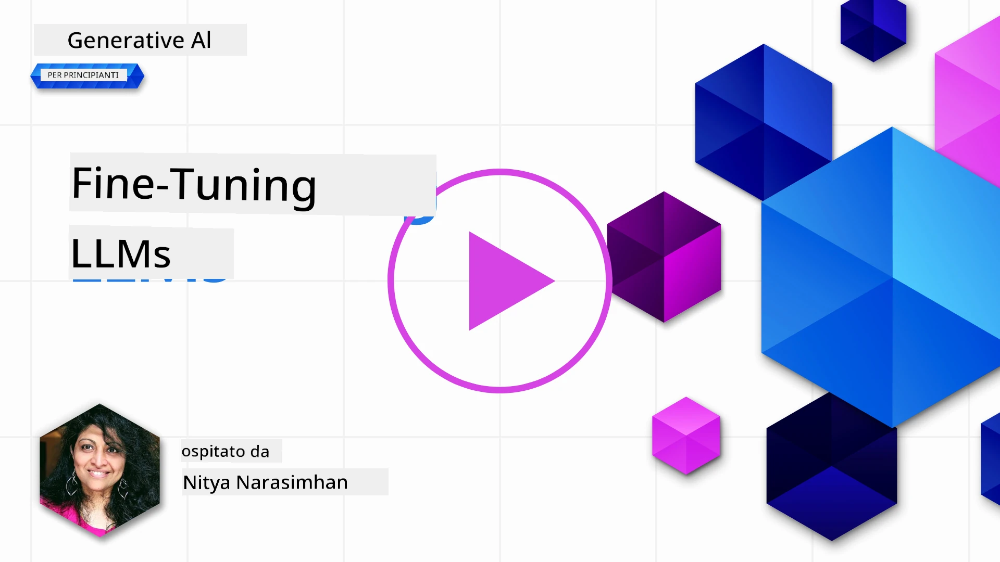
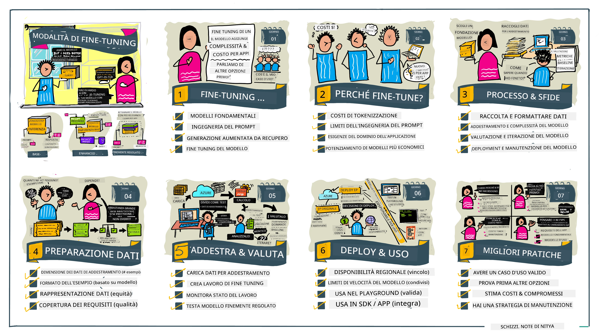

# Fine-Tuning del tuo LLM

Usare modelli linguistici grandi per costruire applicazioni di AI generativa comporta nuove sfide. Un problema chiave è garantire la qualità della risposta (accuratezza e pertinenza) nel contenuto generato dal modello per una determinata richiesta dell’utente. Nelle lezioni precedenti, abbiamo discusso tecniche come il prompt engineering e la generazione aumentata da retrieval che cercano di risolvere il problema modificando _l’input prompt_ al modello esistente.

Nella lezione di oggi, discutiamo una terza tecnica, il **fine-tuning**, che cerca di affrontare la sfida _riaddestrando il modello stesso_ con dati aggiuntivi. Entriamo nei dettagli.

## Obiettivi di Apprendimento

Questa lezione introduce il concetto di fine-tuning per modelli linguistici pre-addestrati, esplora i benefici e le sfide di questo approccio e fornisce indicazioni su quando e come utilizzare il fine-tuning per migliorare le prestazioni dei tuoi modelli di AI generativa.

Al termine di questa lezione, dovresti essere in grado di rispondere alle seguenti domande:

- Che cos’è il fine-tuning per modelli linguistici?
- Quando e perché il fine-tuning è utile?
- Come posso fare il fine-tuning di un modello pre-addestrato?
- Quali sono i limiti del fine-tuning?

Pronto? Iniziamo.

## Guida Illustrata

Vuoi avere una panoramica generale su quello che tratteremo prima di approfondire? Dai un’occhiata a questa guida illustrata che descrive il percorso di apprendimento per questa lezione – dall’apprendere i concetti chiave e le motivazioni per il fine-tuning, fino a capire il processo e le migliori pratiche per eseguire il compito di fine-tuning. È un argomento affascinante da esplorare, quindi non dimenticare di visitare la pagina [Resources](./RESOURCES.md?WT.mc_id=academic-105485-koreyst) per ulteriori link a supporto del tuo percorso di apprendimento autonomo!

## Che cos’è il fine-tuning per modelli linguistici?

Per definizione, i modelli linguistici grandi sono _pre-addestrati_ su grandi quantità di testi provenienti da fonti diverse, incluso internet. Come abbiamo appreso nelle lezioni precedenti, abbiamo bisogno di tecniche come _prompt engineering_ e _generazione aumentata da retrieval_ per migliorare la qualità delle risposte del modello alle domande (“prompt”) degli utenti.

Una tecnica popolare di prompt-engineering consiste nel fornire al modello una guida più dettagliata su cosa ci si aspetta nella risposta, sia tramite _istruzioni_ (guida esplicita) sia _fornendogli pochi esempi_ (guida implicita). Questo è chiamato _few-shot learning_ ma presenta due limitazioni:

- I limiti di token del modello possono restringere il numero di esempi che si possono fornire e limitarne l’efficacia.
- I costi dei token del modello possono rendere costoso aggiungere esempi a ogni prompt e limitarne la flessibilità.

Il fine-tuning è una pratica comune nei sistemi di machine learning in cui si prende un modello pre-addestrato e lo si riaddestra con nuovi dati per migliorarne le prestazioni su un compito specifico. Nel contesto dei modelli linguistici, possiamo fare il fine-tuning del modello pre-addestrato _con un set curato di esempi per un dato compito o dominio applicativo_ per creare un **modello personalizzato** che potrebbe essere più accurato e pertinente per quel particolare compito o dominio. Un beneficio secondario del fine-tuning è che può anche ridurre il numero di esempi necessari per il few-shot learning – diminuendo l’uso di token e i costi correlati.

## Quando e perché dovremmo fare il fine-tuning dei modelli?

In _questo_ contesto, quando parliamo di fine-tuning ci riferiamo al fine-tuning **supervisionato** in cui il riaddestramento si fa aggiungendo **nuovi dati** che non facevano parte del dataset originale di addestramento. Questo è diverso da un approccio di fine-tuning non supervisionato in cui il modello viene riaddestrato sui dati originali, ma con iperparametri differenti.

La cosa importante da ricordare è che il fine-tuning è una tecnica avanzata che richiede un certo livello di esperienza per ottenere i risultati desiderati. Se fatto in modo errato, potrebbe non fornire i miglioramenti attesi, e può persino degradare le prestazioni del modello per il dominio target.

Quindi, prima di imparare "come" fare il fine-tuning dei modelli linguistici, devi sapere "perché" dovresti intraprendere questa strada, e "quando" iniziare il processo di fine-tuning. Comincia facendoti queste domande:

- **Caso d'uso**: Qual è il tuo _caso d’uso_ per il fine-tuning? Quale aspetto del modello pre-addestrato attuale vuoi migliorare?
- **Alternative**: Hai provato _altre tecniche_ per ottenere i risultati desiderati? Usale per creare una baseline di confronto.
  - Prompt engineering: Prova tecniche come il few-shot prompting con esempi di risposte rilevanti. Valuta la qualità delle risposte.
  - Generazione aumentata da retrieval: Prova ad arricchire i prompt con risultati di query recuperati cercando nei tuoi dati. Valuta la qualità delle risposte.
- **Costi**: Hai identificato i costi per il fine-tuning?
  - Tunabilità – il modello pre-addestrato è disponibile per il fine-tuning?
  - Sforzo – per preparare i dati di addestramento, valutare e perfezionare il modello.
  - Risorse computazionali – per eseguire i lavori di fine-tuning e distribuire il modello fine-tuned.
  - Dati – accesso a esempi di qualità sufficiente per l’impatto del fine-tuning.
- **Benefici**: Hai confermato i benefici del fine-tuning?
  - Qualità – il modello fine-tuned ha superato la baseline?
  - Costo – riduce l’uso di token semplificando i prompt?
  - Estendibilità – puoi riutilizzare il modello base per nuovi domini?

Rispondendo a queste domande dovresti poter decidere se il fine-tuning è la scelta giusta per il tuo caso d’uso. Idealmente, l’approccio è valido solo se i benefici superano i costi. Una volta deciso di procedere, è tempo di pensare a _come_ puoi fare il fine-tuning del modello pre-addestrato.

Vuoi approfondire il processo decisionale? Guarda [Fare fine-tuning o non farlo](https://www.youtube.com/watch?v=0Jo-z-MFxJs)

## Come possiamo fare il fine-tuning di un modello pre-addestrato?

Per fare il fine-tuning di un modello pre-addestrato, devi avere:

- un modello pre-addestrato da fine-tunare
- un dataset da utilizzare per il fine-tuning
- un ambiente di addestramento per eseguire il lavoro di fine-tuning
- un ambiente di hosting per distribuire il modello fine-tuned

## Fine-Tuning in Azione

Le risorse seguenti forniscono tutorial passo passo per guidarti attraverso un esempio reale usando un modello selezionato con un dataset curato. Per lavorare con questi tutorial, ti serve un account sul provider specifico, insieme all’accesso al modello e ai dataset rilevanti.

| Provider     | Tutorial                                                                                                                                                                       | Descrizione                                                                                                                                                                                                                                                                                                                                                                                                                       |
| ------------ | ------------------------------------------------------------------------------------------------------------------------------------------------------------------------------ | -------------------------------------------------------------------------------------------------------------------------------------------------------------------------------------------------------------------------------------------------------------------------------------------------------------------------------------------------------------------------------------------------------------------------------- |
| OpenAI       | [Come fare il fine-tuning dei modelli chat](https://github.com/openai/openai-cookbook/blob/main/examples/How_to_finetune_chat_models.ipynb?WT.mc_id=academic-105485-koreyst)                | Impara a fare il fine-tuning di un `gpt-35-turbo` per un dominio specifico ("assistente ricette") preparando dati di addestramento, eseguendo il lavoro di fine-tuning e usando il modello fine-tuned per l’inferenza.                                                                                                                                                                                                              |
| Azure OpenAI | [Tutorial sul fine-tuning di GPT 3.5 Turbo](https://learn.microsoft.com/azure/ai-services/openai/tutorials/fine-tune?tabs=python-new%2Ccommand-line&WT.mc_id=academic-105485-koreyst) | Impara a fare il fine-tuning di un modello `gpt-35-turbo-0613` **su Azure** seguendo i passaggi per creare e caricare i dati di addestramento, eseguire il lavoro di fine-tuning. Distribuire e usare il nuovo modello.                                                                                                                                                                                                              |
| Hugging Face | [Fine-tuning dei LLM con Hugging Face](https://www.philschmid.de/fine-tune-llms-in-2024-with-trl?WT.mc_id=academic-105485-koreyst)                                               | Questo post sul blog ti guida nel fine-tuning di un _LLM aperto_ (es: `CodeLlama 7B`) utilizzando la libreria [transformers](https://huggingface.co/docs/transformers/index?WT.mc_id=academic-105485-koreyst) & [Transformer Reinforcement Learning (TRL)](https://huggingface.co/docs/trl/index?WT.mc_id=academic-105485-koreyst) con dataset aperti su Hugging Face.                                                          |
|              |                                                                                                                                                                                |                                                                                                                                                                                                                                                                                                                                                                                                                                  |
| 🤗 AutoTrain | [Fine-tuning dei LLM con AutoTrain](https://github.com/huggingface/autotrain-advanced/?WT.mc_id=academic-105485-koreyst)                                                         | AutoTrain (o AutoTrain Advanced) è una libreria python sviluppata da Hugging Face che permette il fine-tuning per molteplici compiti inclusi i LLM. AutoTrain è una soluzione no-code e il fine-tuning può essere fatto nel tuo cloud, su Hugging Face Spaces o in locale. Supporta interfaccia web GUI, CLI e training via file di configurazione yaml.                                                                                   |
|              |                                                                                                                                                                                |                                                                                                                                                                                                                                                                                                                                                                                                                                  |
| 🦥 Unsloth | [Fine-tuning dei LLM con Unsloth](https://github.com/unslothai/unsloth)                                                         | Unsloth è un framework open-source che supporta il fine-tuning dei LLM e l’apprendimento per rinforzo (RL). Unsloth semplifica training locale, valutazione e distribuzione con [notebook](https://github.com/unslothai/notebooks) pronti all’uso. Supporta anche text-to-speech (TTS), modelli BERT e multimodali. Per iniziare, leggi la loro guida passo passo [Fine-tuning LLMs Guide](https://docs.unsloth.ai/get-started/fine-tuning-llms-guide).               |
|              |                                                                                                                                                                                |                                                                                                                                                                                                                                                                                                                                                                                                                                  |
## Compito

Seleziona uno dei tutorial sopra e seguilo attentamente. _Potremmo replicare una versione di questi tutorial in Jupyter Notebooks in questo repo solo come riferimento. Per favore usa direttamente le fonti originali per avere le versioni più aggiornate_.

## Ottimo lavoro! Continua a imparare.

Dopo aver completato questa lezione, visita la nostra [collezione di apprendimento su Generative AI](https://aka.ms/genai-collection?WT.mc_id=academic-105485-koreyst) per continuare a migliorare le tue conoscenze sull’AI Generativa!

Congratulazioni!! Hai completato la lezione finale della serie v2 di questo corso! Non smettere di imparare e costruire. \*\*Dai un’occhiata alla pagina [RESOURCES](RESOURCES.md?WT.mc_id=academic-105485-koreyst) per una lista di suggerimenti aggiuntivi proprio su questo argomento.

La nostra serie v1 di lezioni è stata aggiornata con più compiti e concetti. Quindi prenditi un minuto per rinfrescare la tua conoscenza – e per favore [condividi le tue domande e feedback](https://github.com/microsoft/generative-ai-for-beginners/issues?WT.mc_id=academic-105485-koreyst) per aiutarci a migliorare queste lezioni per la community.

---

<!-- CO-OP TRANSLATOR DISCLAIMER START -->
**Disclaimer**:  
Questo documento è stato tradotto utilizzando il servizio di traduzione AI [Co-op Translator](https://github.com/Azure/co-op-translator). Pur impegnandoci per garantire l’accuratezza, si prega di considerare che le traduzioni automatiche possono contenere errori o inesattezze. Il documento originale nella sua lingua nativa deve essere considerato la fonte autorevole. Per informazioni di natura critica, si consiglia una traduzione professionale effettuata da un traduttore umano. Non ci assumiamo responsabilità per eventuali incomprensioni o interpretazioni errate derivanti dall’uso di questa traduzione.
<!-- CO-OP TRANSLATOR DISCLAIMER END -->