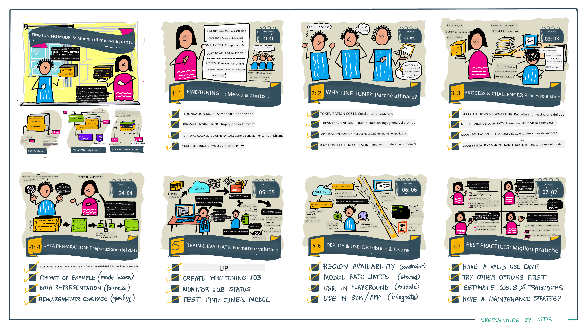

<!--
CO_OP_TRANSLATOR_METADATA:
{
  "original_hash": "68664f7e754a892ae1d8d5e2b7bd2081",
  "translation_date": "2025-06-26T00:40:24+00:00",
  "source_file": "18-fine-tuning/README.md",
  "language_code": "it"
}
-->

# Ottimizzazione del tuo LLM

Utilizzare grandi modelli linguistici per costruire applicazioni di intelligenza artificiale generativa comporta nuove sfide. Un problema chiave è garantire la qualità delle risposte (accuratezza e pertinenza) nel contenuto generato dal modello per una determinata richiesta dell'utente. Nelle lezioni precedenti, abbiamo discusso tecniche come l'ingegneria dei prompt e la generazione aumentata dal recupero che cercano di risolvere il problema _modificando l'input del prompt_ al modello esistente.

Nella lezione di oggi, discutiamo una terza tecnica, **l'ottimizzazione**, che cerca di affrontare la sfida _riaddestrando il modello stesso_ con dati aggiuntivi. Approfondiamo i dettagli.

## Obiettivi di apprendimento

Questa lezione introduce il concetto di ottimizzazione per modelli linguistici pre-addestrati, esplora i benefici e le sfide di questo approccio, e fornisce indicazioni su quando e come utilizzare l'ottimizzazione per migliorare le prestazioni dei tuoi modelli di intelligenza artificiale generativa.

Alla fine di questa lezione, dovresti essere in grado di rispondere alle seguenti domande:

- Cos'è l'ottimizzazione per i modelli linguistici?
- Quando e perché l'ottimizzazione è utile?
- Come posso ottimizzare un modello pre-addestrato?
- Quali sono le limitazioni dell'ottimizzazione?

Pronto? Iniziamo.

## Guida Illustrata

Vuoi avere una visione d'insieme di ciò che tratteremo prima di immergerci? Dai un'occhiata a questa guida illustrata che descrive il percorso di apprendimento per questa lezione - dall'apprendimento dei concetti base e della motivazione per l'ottimizzazione, alla comprensione del processo e delle migliori pratiche per eseguire il compito di ottimizzazione. Questo è un argomento affascinante da esplorare, quindi non dimenticare di controllare la pagina [Risorse](./RESOURCES.md?WT.mc_id=academic-105485-koreyst) per ulteriori link a supporto del tuo percorso di apprendimento autonomo!

## Cos'è l'ottimizzazione per i modelli linguistici?

Per definizione, i grandi modelli linguistici sono _pre-addestrati_ su grandi quantità di testo provenienti da fonti diverse, inclusa Internet. Come abbiamo appreso nelle lezioni precedenti, abbiamo bisogno di tecniche come _l'ingegneria dei prompt_ e la _generazione aumentata dal recupero_ per migliorare la qualità delle risposte del modello alle domande dell'utente ("prompt").

Una tecnica popolare di ingegneria dei prompt prevede di fornire al modello più indicazioni su cosa ci si aspetta nella risposta, sia fornendo _istruzioni_ (guida esplicita) sia _dandogli alcuni esempi_ (guida implicita). Questo è chiamato _apprendimento few-shot_, ma ha due limitazioni:

- I limiti dei token del modello possono limitare il numero di esempi che puoi fornire e limitarne l'efficacia.
- I costi dei token del modello possono rendere costoso aggiungere esempi a ogni prompt e limitare la flessibilità.

L'ottimizzazione è una pratica comune nei sistemi di apprendimento automatico in cui prendiamo un modello pre-addestrato e lo riaddestriamo con nuovi dati per migliorare le sue prestazioni su un compito specifico. Nel contesto dei modelli linguistici, possiamo ottimizzare il modello pre-addestrato _con un set curato di esempi per un determinato compito o dominio applicativo_ per creare un **modello personalizzato** che potrebbe essere più accurato e pertinente per quel compito o dominio specifico. Un vantaggio collaterale dell'ottimizzazione è che può anche ridurre il numero di esempi necessari per l'apprendimento few-shot - riducendo l'uso dei token e i relativi costi.

## Quando e perché dovremmo ottimizzare i modelli?

In _questo_ contesto, quando parliamo di ottimizzazione, ci riferiamo all'ottimizzazione **supervisionata** in cui il riaddestramento viene effettuato **aggiungendo nuovi dati** che non facevano parte del dataset di addestramento originale. Questo è diverso da un approccio di ottimizzazione non supervisionata in cui il modello viene riaddestrato sui dati originali, ma con iperparametri diversi.

La cosa fondamentale da ricordare è che l'ottimizzazione è una tecnica avanzata che richiede un certo livello di competenza per ottenere i risultati desiderati. Se fatta in modo errato, potrebbe non fornire i miglioramenti attesi e potrebbe persino degradare le prestazioni del modello per il tuo dominio mirato.

Quindi, prima di imparare "come" ottimizzare i modelli linguistici, devi sapere "perché" dovresti intraprendere questa strada e "quando" iniziare il processo di ottimizzazione. Inizia ponendoti queste domande:

- **Caso d'uso**: Qual è il tuo _caso d'uso_ per l'ottimizzazione? Quale aspetto del modello pre-addestrato attuale vuoi migliorare?
- **Alternative**: Hai provato _altre tecniche_ per raggiungere i risultati desiderati? Usale per creare una base di confronto.
  - Ingegneria dei prompt: Prova tecniche come il prompting few-shot con esempi di risposte pertinenti. Valuta la qualità delle risposte.
  - Generazione Aumentata dal Recupero: Prova ad aumentare i prompt con i risultati delle query recuperati cercando nei tuoi dati. Valuta la qualità delle risposte.
- **Costi**: Hai identificato i costi per l'ottimizzazione?
  - Ottimizzabilità - il modello pre-addestrato è disponibile per l'ottimizzazione?
  - Impegno - per preparare i dati di addestramento, valutare e perfezionare il modello.
  - Calcolo - per eseguire i lavori di ottimizzazione e distribuire il modello ottimizzato.
  - Dati - accesso a esempi di qualità sufficiente per l'impatto dell'ottimizzazione.
- **Benefici**: Hai confermato i benefici dell'ottimizzazione?
  - Qualità - il modello ottimizzato ha superato la base di confronto?
  - Costo - riduce l'uso dei token semplificando i prompt?
  - Estensibilità - puoi riutilizzare il modello base per nuovi domini?

Rispondendo a queste domande, dovresti essere in grado di decidere se l'ottimizzazione è l'approccio giusto per il tuo caso d'uso. Idealmente, l'approccio è valido solo se i benefici superano i costi. Una volta deciso di procedere, è il momento di pensare a _come_ puoi ottimizzare il modello pre-addestrato.

Vuoi ottenere più approfondimenti sul processo decisionale? Guarda [Ottimizzare o non ottimizzare](https://www.youtube.com/watch?v=0Jo-z-MFxJs)

## Come possiamo ottimizzare un modello pre-addestrato?

Per ottimizzare un modello pre-addestrato, è necessario avere:

- un modello pre-addestrato da ottimizzare
- un dataset da utilizzare per l'ottimizzazione
- un ambiente di addestramento per eseguire il lavoro di ottimizzazione
- un ambiente di hosting per distribuire il modello ottimizzato

## Ottimizzazione in Azione

Le seguenti risorse forniscono tutorial passo-passo per guidarti attraverso un esempio reale utilizzando un modello selezionato con un dataset curato. Per seguire questi tutorial, hai bisogno di un account sul fornitore specifico, insieme all'accesso al modello e ai dataset pertinenti.

| Fornitore    | Tutorial                                                                                                                                                                       | Descrizione                                                                                                                                                                                                                                                                                                                                                                                                                        |
| ------------ | ------------------------------------------------------------------------------------------------------------------------------------------------------------------------------ | ---------------------------------------------------------------------------------------------------------------------------------------------------------------------------------------------------------------------------------------------------------------------------------------------------------------------------------------------------------------------------------------------------------------------------------- |
| OpenAI       | [Come ottimizzare i modelli di chat](https://github.com/openai/openai-cookbook/blob/main/examples/How_to_finetune_chat_models.ipynb?WT.mc_id=academic-105485-koreyst)                | Impara a ottimizzare un `gpt-35-turbo` per un dominio specifico ("assistente ricette") preparando i dati di addestramento, eseguendo il lavoro di ottimizzazione e utilizzando il modello ottimizzato per l'inferenza.                                                                                                                                                                                                                                              |
| Azure OpenAI | [Tutorial di ottimizzazione GPT 3.5 Turbo](https://learn.microsoft.com/azure/ai-services/openai/tutorials/fine-tune?tabs=python-new%2Ccommand-line?WT.mc_id=academic-105485-koreyst) | Impara a ottimizzare un modello `gpt-35-turbo-0613` **su Azure** seguendo i passaggi per creare e caricare dati di addestramento, eseguire il lavoro di ottimizzazione. Distribuisci e usa il nuovo modello.                                                                                                                                                                                                                                                                 |
| Hugging Face | [Ottimizzazione dei LLM con Hugging Face](https://www.philschmid.de/fine-tune-llms-in-2024-with-trl?WT.mc_id=academic-105485-koreyst)                                               | Questo post sul blog ti guida nell'ottimizzazione di un _LLM aperto_ (es: `CodeLlama 7B`) utilizzando la libreria [transformers](https://huggingface.co/docs/transformers/index?WT.mc_id=academic-105485-koreyst) & [Transformer Reinforcement Learning (TRL)](https://huggingface.co/docs/trl/index?WT.mc_id=academic-105485-koreyst]) con [dataset](https://huggingface.co/docs/datasets/index?WT.mc_id=academic-105485-koreyst) aperti su Hugging Face. |
|              |                                                                                                                                                                                |                                                                                                                                                                                                                                                                                                                                                                                                                                    |
| 🤗 AutoTrain | [Ottimizzazione dei LLM con AutoTrain](https://github.com/huggingface/autotrain-advanced/?WT.mc_id=academic-105485-koreyst)                                                         | AutoTrain (o AutoTrain Advanced) è una libreria python sviluppata da Hugging Face che consente l'ottimizzazione per molti compiti diversi, inclusa l'ottimizzazione dei LLM. AutoTrain è una soluzione senza codice e l'ottimizzazione può essere eseguita nel tuo cloud, su Hugging Face Spaces o localmente. Supporta sia una GUI basata sul web, CLI e l'addestramento tramite file di configurazione yaml.                                                                               |
|              |                                                                                                                                                                                |                                                                                                                                                                                                                                                                                                                                                                                                                                    |

## Compito

Seleziona uno dei tutorial sopra e seguili. _Potremmo replicare una versione di questi tutorial nei Jupyter Notebooks in questo repository solo per riferimento. Si prega di utilizzare le fonti originali direttamente per ottenere le versioni più recenti_.

## Ottimo lavoro! Continua il tuo apprendimento.

Dopo aver completato questa lezione, dai un'occhiata alla nostra [collezione di apprendimento sull'AI Generativa](https://aka.ms/genai-collection?WT.mc_id=academic-105485-koreyst) per continuare ad approfondire le tue conoscenze sull'AI Generativa!

Congratulazioni!! Hai completato la lezione finale della serie v2 per questo corso! Non smettere di imparare e costruire. **Dai un'occhiata alla pagina [RISORSE](RESOURCES.md?WT.mc_id=academic-105485-koreyst) per un elenco di ulteriori suggerimenti proprio su questo argomento.

La nostra serie di lezioni v1 è stata aggiornata con più compiti e concetti. Quindi prenditi un minuto per rinfrescare le tue conoscenze - e per favore [condividi le tue domande e feedback](https://github.com/microsoft/generative-ai-for-beginners/issues?WT.mc_id=academic-105485-koreyst) per aiutarci a migliorare queste lezioni per la comunità.

**Disclaimer**:  
Questo documento è stato tradotto utilizzando il servizio di traduzione AI [Co-op Translator](https://github.com/Azure/co-op-translator). Sebbene ci impegniamo per garantire l'accuratezza, si prega di essere consapevoli che le traduzioni automatiche possono contenere errori o imprecisioni. Il documento originale nella sua lingua madre dovrebbe essere considerato la fonte autorevole. Per informazioni critiche, si raccomanda una traduzione professionale umana. Non siamo responsabili per eventuali incomprensioni o interpretazioni errate derivanti dall'uso di questa traduzione.