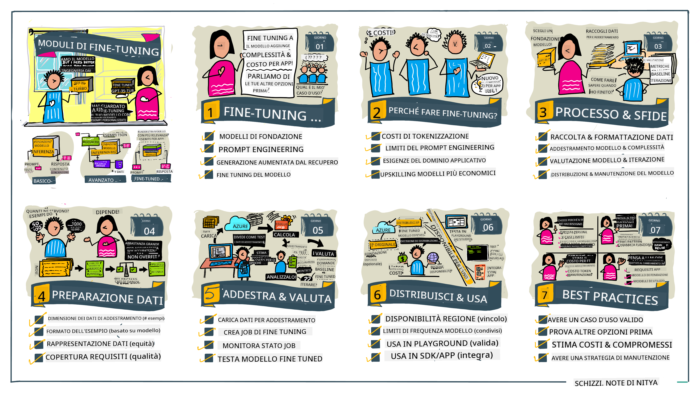

<!--
CO_OP_TRANSLATOR_METADATA:
{
  "original_hash": "807f0d9fc1747e796433534e1be6a98a",
  "translation_date": "2025-10-17T16:10:55+00:00",
  "source_file": "18-fine-tuning/README.md",
  "language_code": "it"
}
-->

# Ottimizzazione del tuo LLM

Utilizzare modelli di linguaggio di grandi dimensioni per costruire applicazioni di intelligenza artificiale generativa comporta nuove sfide. Una questione chiave è garantire la qualità delle risposte (accuratezza e pertinenza) nei contenuti generati dal modello per una determinata richiesta dell'utente. Nelle lezioni precedenti, abbiamo discusso tecniche come l'ingegneria dei prompt e la generazione aumentata dal recupero che cercano di risolvere il problema _modificando l'input del prompt_ al modello esistente.

Nella lezione di oggi, discutiamo una terza tecnica, **fine-tuning**, che cerca di affrontare la sfida _riaddestrando il modello stesso_ con dati aggiuntivi. Esploriamo i dettagli.

## Obiettivi di apprendimento

Questa lezione introduce il concetto di fine-tuning per modelli di linguaggio pre-addestrati, esplora i benefici e le sfide di questo approccio e fornisce indicazioni su quando e come utilizzare il fine-tuning per migliorare le prestazioni dei tuoi modelli di intelligenza artificiale generativa.

Alla fine di questa lezione, dovresti essere in grado di rispondere alle seguenti domande:

- Cos'è il fine-tuning per i modelli di linguaggio?
- Quando e perché il fine-tuning è utile?
- Come posso effettuare il fine-tuning di un modello pre-addestrato?
- Quali sono i limiti del fine-tuning?

Pronto? Iniziamo.

## Guida illustrata

Vuoi avere una visione d'insieme di ciò che tratteremo prima di approfondire? Dai un'occhiata a questa guida illustrata che descrive il percorso di apprendimento per questa lezione - dai concetti fondamentali e la motivazione per il fine-tuning, alla comprensione del processo e delle migliori pratiche per eseguire il compito di fine-tuning. È un argomento affascinante da esplorare, quindi non dimenticare di consultare la pagina [Risorse](./RESOURCES.md?WT.mc_id=academic-105485-koreyst) per ulteriori link a supporto del tuo percorso di apprendimento autonomo!

## Cos'è il fine-tuning per i modelli di linguaggio?

Per definizione, i modelli di linguaggio di grandi dimensioni sono _pre-addestrati_ su grandi quantità di testo provenienti da fonti diverse, inclusi internet. Come abbiamo appreso nelle lezioni precedenti, abbiamo bisogno di tecniche come _ingegneria dei prompt_ e _generazione aumentata dal recupero_ per migliorare la qualità delle risposte del modello alle domande dell'utente ("prompt").

Una tecnica popolare di ingegneria dei prompt consiste nel fornire al modello più indicazioni su ciò che ci si aspetta nella risposta, sia fornendo _istruzioni_ (indicazioni esplicite) sia _dandogli alcuni esempi_ (indicazioni implicite). Questo è noto come _few-shot learning_, ma presenta due limiti:

- I limiti di token del modello possono restringere il numero di esempi che puoi fornire e limitarne l'efficacia.
- I costi dei token del modello possono rendere costoso aggiungere esempi a ogni prompt e limitare la flessibilità.

Il fine-tuning è una pratica comune nei sistemi di machine learning in cui prendiamo un modello pre-addestrato e lo riaddestriamo con nuovi dati per migliorarne le prestazioni su un compito specifico. Nel contesto dei modelli di linguaggio, possiamo effettuare il fine-tuning del modello pre-addestrato _con un set curato di esempi per un determinato compito o dominio applicativo_ per creare un **modello personalizzato** che potrebbe essere più accurato e pertinente per quel compito o dominio specifico. Un vantaggio secondario del fine-tuning è che può anche ridurre il numero di esempi necessari per il few-shot learning, riducendo l'uso di token e i costi correlati.

## Quando e perché dovremmo effettuare il fine-tuning dei modelli?

In _questo_ contesto, quando parliamo di fine-tuning, ci riferiamo al fine-tuning **supervisionato**, in cui il riaddestramento viene effettuato **aggiungendo nuovi dati** che non facevano parte del dataset di addestramento originale. Questo è diverso dall'approccio di fine-tuning non supervisionato, in cui il modello viene riaddestrato sui dati originali, ma con iperparametri diversi.

La cosa fondamentale da ricordare è che il fine-tuning è una tecnica avanzata che richiede un certo livello di competenza per ottenere i risultati desiderati. Se fatto in modo errato, potrebbe non fornire i miglioramenti attesi e potrebbe persino degradare le prestazioni del modello per il tuo dominio mirato.

Quindi, prima di imparare "come" effettuare il fine-tuning dei modelli di linguaggio, devi sapere "perché" dovresti intraprendere questa strada e "quando" iniziare il processo di fine-tuning. Inizia ponendoti queste domande:

- **Caso d'uso**: Qual è il tuo _caso d'uso_ per il fine-tuning? Quale aspetto del modello pre-addestrato attuale vuoi migliorare?
- **Alternative**: Hai provato _altre tecniche_ per raggiungere i risultati desiderati? Usale per creare un punto di riferimento per il confronto.
  - Ingegneria dei prompt: Prova tecniche come il few-shot prompting con esempi di risposte pertinenti al prompt. Valuta la qualità delle risposte.
  - Generazione aumentata dal recupero: Prova ad aumentare i prompt con risultati di query recuperati cercando nei tuoi dati. Valuta la qualità delle risposte.
- **Costi**: Hai identificato i costi per il fine-tuning?
  - Adattabilità - il modello pre-addestrato è disponibile per il fine-tuning?
  - Sforzo - per preparare i dati di addestramento, valutare e perfezionare il modello.
  - Calcolo - per eseguire i lavori di fine-tuning e distribuire il modello ottimizzato.
  - Dati - accesso a esempi di qualità sufficienti per avere un impatto con il fine-tuning.
- **Benefici**: Hai confermato i benefici del fine-tuning?
  - Qualità - il modello ottimizzato ha superato il punto di riferimento?
  - Costo - riduce l'uso di token semplificando i prompt?
  - Estensibilità - puoi riutilizzare il modello base per nuovi domini?

Rispondendo a queste domande, dovresti essere in grado di decidere se il fine-tuning è l'approccio giusto per il tuo caso d'uso. Idealmente, l'approccio è valido solo se i benefici superano i costi. Una volta deciso di procedere, è il momento di pensare a _come_ puoi effettuare il fine-tuning del modello pre-addestrato.

Vuoi ottenere più approfondimenti sul processo decisionale? Guarda [To fine-tune or not to fine-tune](https://www.youtube.com/watch?v=0Jo-z-MFxJs)

## Come possiamo effettuare il fine-tuning di un modello pre-addestrato?

Per effettuare il fine-tuning di un modello pre-addestrato, devi avere:

- un modello pre-addestrato da ottimizzare
- un dataset da utilizzare per il fine-tuning
- un ambiente di addestramento per eseguire il lavoro di fine-tuning
- un ambiente di hosting per distribuire il modello ottimizzato

## Fine-Tuning in pratica

Le seguenti risorse forniscono tutorial passo-passo per guidarti attraverso un esempio reale utilizzando un modello selezionato con un dataset curato. Per seguire questi tutorial, è necessario un account sul provider specifico, insieme all'accesso al modello e ai dataset pertinenti.

| Provider     | Tutorial                                                                                                                                                                       | Descrizione                                                                                                                                                                                                                                                                                                                                                                                                                        |
| ------------ | ------------------------------------------------------------------------------------------------------------------------------------------------------------------------------ | ---------------------------------------------------------------------------------------------------------------------------------------------------------------------------------------------------------------------------------------------------------------------------------------------------------------------------------------------------------------------------------------------------------------------------------- |
| OpenAI       | [How to fine-tune chat models](https://github.com/openai/openai-cookbook/blob/main/examples/How_to_finetune_chat_models.ipynb?WT.mc_id=academic-105485-koreyst)                | Impara a ottimizzare un `gpt-35-turbo` per un dominio specifico ("assistente di ricette") preparando i dati di addestramento, eseguendo il lavoro di fine-tuning e utilizzando il modello ottimizzato per l'inferenza.                                                                                                                                                                                                                 |
| Azure OpenAI | [GPT 3.5 Turbo fine-tuning tutorial](https://learn.microsoft.com/azure/ai-services/openai/tutorials/fine-tune?tabs=python-new%2Ccommand-line?WT.mc_id=academic-105485-koreyst) | Impara a ottimizzare un modello `gpt-35-turbo-0613` **su Azure** seguendo i passaggi per creare e caricare i dati di addestramento, eseguire il lavoro di fine-tuning. Distribuisci e utilizza il nuovo modello.                                                                                                                                                                                                                     |
| Hugging Face | [Fine-tuning LLMs with Hugging Face](https://www.philschmid.de/fine-tune-llms-in-2024-with-trl?WT.mc_id=academic-105485-koreyst)                                               | Questo post sul blog ti guida nel fine-tuning di un _open LLM_ (es: `CodeLlama 7B`) utilizzando la libreria [transformers](https://huggingface.co/docs/transformers/index?WT.mc_id=academic-105485-koreyst) e [Transformer Reinforcement Learning (TRL)](https://huggingface.co/docs/trl/index?WT.mc_id=academic-105485-koreyst]) con [dataset aperti](https://huggingface.co/docs/datasets/index?WT.mc_id=academic-105485-koreyst) su Hugging Face. |
|              |                                                                                                                                                                                |                                                                                                                                                                                                                                                                                                                                                                                                                                    |
| 🤗 AutoTrain | [Fine-tuning LLMs with AutoTrain](https://github.com/huggingface/autotrain-advanced/?WT.mc_id=academic-105485-koreyst)                                                         | AutoTrain (o AutoTrain Advanced) è una libreria Python sviluppata da Hugging Face che consente il fine-tuning per molti compiti diversi, incluso il fine-tuning di LLM. AutoTrain è una soluzione senza codice e il fine-tuning può essere effettuato nel tuo cloud, su Hugging Face Spaces o localmente. Supporta sia un'interfaccia grafica web, CLI e addestramento tramite file di configurazione yaml.                          |
|              |                                                                                                                                                                                |                                                                                                                                                                                                                                                                                                                                                                                                                                    |

## Compito

Seleziona uno dei tutorial sopra e seguilo. _Potremmo replicare una versione di questi tutorial in Jupyter Notebooks in questo repository solo a scopo di riferimento. Ti preghiamo di utilizzare direttamente le fonti originali per ottenere le versioni più aggiornate_.

## Ottimo lavoro! Continua a imparare.

Dopo aver completato questa lezione, dai un'occhiata alla nostra [collezione di apprendimento sull'AI generativa](https://aka.ms/genai-collection?WT.mc_id=academic-105485-koreyst) per continuare a migliorare la tua conoscenza sull'AI generativa!

Congratulazioni!! Hai completato l'ultima lezione della serie v2 di questo corso! Non smettere di imparare e costruire. \*\*Consulta la pagina [RISORSE](RESOURCES.md?WT.mc_id=academic-105485-koreyst) per un elenco di suggerimenti aggiuntivi su questo argomento.

La nostra serie di lezioni v1 è stata aggiornata con più compiti e concetti. Quindi prenditi un minuto per rinfrescare le tue conoscenze - e ti preghiamo di [condividere le tue domande e feedback](https://github.com/microsoft/generative-ai-for-beginners/issues?WT.mc_id=academic-105485-koreyst) per aiutarci a migliorare queste lezioni per la comunità.

---

**Disclaimer**:  
Questo documento è stato tradotto utilizzando il servizio di traduzione AI [Co-op Translator](https://github.com/Azure/co-op-translator). Sebbene ci impegniamo per garantire l'accuratezza, si prega di notare che le traduzioni automatiche possono contenere errori o imprecisioni. Il documento originale nella sua lingua nativa dovrebbe essere considerato la fonte autorevole. Per informazioni critiche, si raccomanda una traduzione professionale umana. Non siamo responsabili per eventuali incomprensioni o interpretazioni errate derivanti dall'uso di questa traduzione.