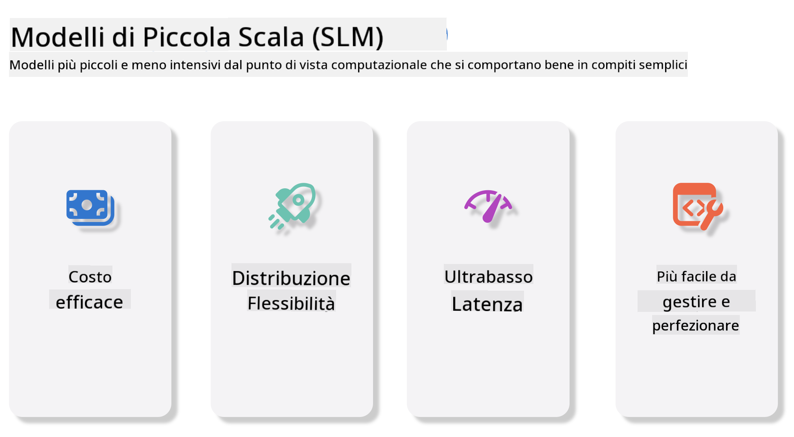
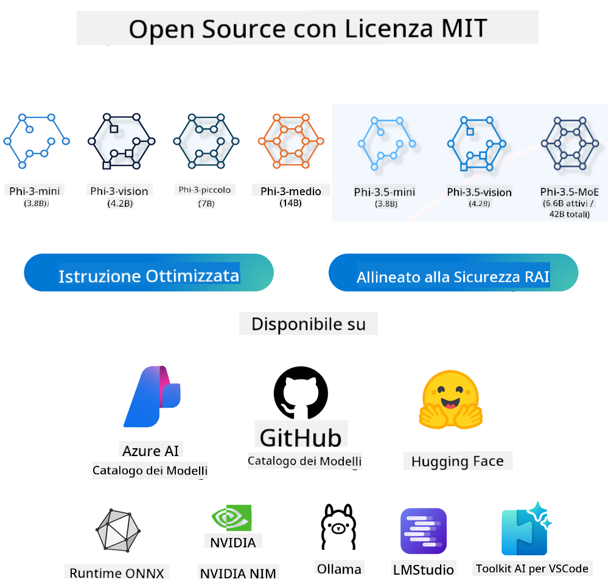
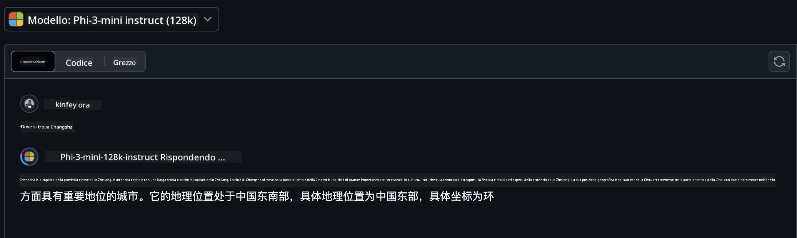
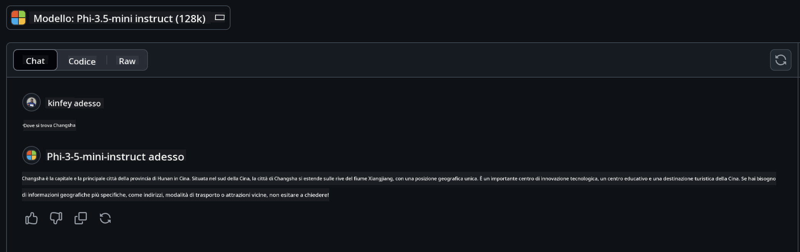

<!--
CO_OP_TRANSLATOR_METADATA:
{
  "original_hash": "124ad36cfe96f74038811b6e2bb93e9d",
  "translation_date": "2025-05-20T09:44:47+00:00",
  "source_file": "19-slm/README.md",
  "language_code": "it"
}
-->
# Introduzione ai modelli linguistici piccoli per l'IA generativa per principianti

L'IA generativa è un affascinante campo dell'intelligenza artificiale che si concentra sulla creazione di sistemi capaci di generare nuovi contenuti. Questo contenuto può variare da testo e immagini a musica e persino interi ambienti virtuali. Una delle applicazioni più entusiasmanti dell'IA generativa è nel campo dei modelli linguistici.

## Cosa sono i modelli linguistici piccoli?

Un modello linguistico piccolo (SLM) rappresenta una variante ridotta di un grande modello linguistico (LLM), sfruttando molti dei principi architetturali e delle tecniche degli LLM, pur mostrando un'impronta computazionale significativamente ridotta. Gli SLM sono un sottoinsieme di modelli linguistici progettati per generare testo simile a quello umano. A differenza dei loro omologhi più grandi, come GPT-4, gli SLM sono più compatti ed efficienti, rendendoli ideali per applicazioni dove le risorse computazionali sono limitate. Nonostante le loro dimensioni ridotte, possono comunque svolgere una varietà di compiti. Tipicamente, gli SLM sono costruiti comprimendo o distillando gli LLM, cercando di mantenere una parte sostanziale della funzionalità originale del modello e delle capacità linguistiche. Questa riduzione delle dimensioni del modello diminuisce la complessità complessiva, rendendo gli SLM più efficienti in termini di utilizzo della memoria e requisiti computazionali. Nonostante queste ottimizzazioni, gli SLM possono comunque svolgere un'ampia gamma di compiti di elaborazione del linguaggio naturale (NLP):

- Generazione di testo: Creare frasi o paragrafi coerenti e contestualmente rilevanti.
- Completamento del testo: Prevedere e completare frasi in base a un dato prompt.
- Traduzione: Convertire testo da una lingua a un'altra.
- Sintesi: Condensare lunghi pezzi di testo in riassunti più brevi e digeribili.

Anche se con alcuni compromessi in termini di prestazioni o profondità di comprensione rispetto ai loro omologhi più grandi.

## Come funzionano i modelli linguistici piccoli?

Gli SLM sono addestrati su grandi quantità di dati testuali. Durante l'addestramento, apprendono i modelli e le strutture del linguaggio, consentendo loro di generare testo che è sia grammaticalmente corretto che contestualmente appropriato. Il processo di addestramento coinvolge:

- Raccolta dati: Raccogliere grandi set di dati testuali da varie fonti.
- Pre-elaborazione: Pulire e organizzare i dati per renderli adatti all'addestramento.
- Addestramento: Utilizzare algoritmi di apprendimento automatico per insegnare al modello come comprendere e generare testo.
- Messa a punto: Regolare il modello per migliorare le sue prestazioni su compiti specifici.

Lo sviluppo degli SLM si allinea con la crescente necessità di modelli che possano essere distribuiti in ambienti con risorse limitate, come dispositivi mobili o piattaforme di edge computing, dove gli LLM a piena scala possono essere impraticabili a causa delle loro elevate richieste di risorse. Concentrandosi sull'efficienza, gli SLM bilanciano prestazioni e accessibilità, consentendo un'applicazione più ampia in vari domini.



## Obiettivi di apprendimento

In questa lezione, speriamo di introdurre la conoscenza degli SLM e combinarla con Microsoft Phi-3 per apprendere diversi scenari nel contenuto testuale, visione e MoE. Alla fine di questa lezione, dovresti essere in grado di rispondere alle seguenti domande:

- Cos'è SLM
- Qual è la differenza tra SLM e LLM
- Cos'è la famiglia Microsoft Phi-3/3.5
- Come fare inferenza sulla famiglia Microsoft Phi-3/3.5

Pronto? Iniziamo.

## Le distinzioni tra grandi modelli linguistici (LLM) e modelli linguistici piccoli (SLM)

Sia gli LLM che gli SLM si basano su principi fondamentali di apprendimento automatico probabilistico, seguendo approcci simili nel loro design architettonico, metodologie di addestramento, processi di generazione dei dati e tecniche di valutazione del modello. Tuttavia, diversi fattori chiave differenziano questi due tipi di modelli.

## Applicazioni dei modelli linguistici piccoli

Gli SLM hanno un'ampia gamma di applicazioni, tra cui:

- Chatbot: Fornire supporto clienti e interagire con gli utenti in modo conversazionale.
- Creazione di contenuti: Assistere gli scrittori generando idee o persino redigendo interi articoli.
- Educazione: Aiutare gli studenti con compiti di scrittura o nell'apprendimento di nuove lingue.
- Accessibilità: Creare strumenti per individui con disabilità, come sistemi di sintesi vocale.

**Dimensione**

Una distinzione primaria tra LLM e SLM risiede nella scala dei modelli. Gli LLM, come ChatGPT (GPT-4), possono comprendere circa 1,76 trilioni di parametri, mentre gli SLM open-source come Mistral 7B sono progettati con un numero significativamente inferiore di parametri—circa 7 miliardi. Questa disparità è principalmente dovuta a differenze nell'architettura del modello e nei processi di addestramento. Ad esempio, ChatGPT impiega un meccanismo di auto-attenzione all'interno di un framework encoder-decoder, mentre Mistral 7B utilizza un'attenzione a finestra scorrevole, che consente un addestramento più efficiente all'interno di un modello solo-decoder. Questa variazione architettonica ha profonde implicazioni per la complessità e le prestazioni di questi modelli.

**Comprensione**

Gli SLM sono tipicamente ottimizzati per prestazioni all'interno di domini specifici, rendendoli altamente specializzati ma potenzialmente limitati nella loro capacità di fornire una comprensione contestuale ampia attraverso molteplici campi di conoscenza. Al contrario, gli LLM mirano a simulare un'intelligenza simile a quella umana a un livello più completo. Addestrati su set di dati vasti e diversificati, gli LLM sono progettati per funzionare bene in una varietà di domini, offrendo maggiore versatilità e adattabilità. Di conseguenza, gli LLM sono più adatti per una gamma più ampia di compiti a valle, come l'elaborazione del linguaggio naturale e la programmazione.

**Computazione**

L'addestramento e la distribuzione degli LLM sono processi che richiedono molte risorse, spesso richiedendo un'infrastruttura computazionale significativa, inclusi grandi cluster di GPU. Ad esempio, addestrare un modello come ChatGPT da zero può richiedere migliaia di GPU per periodi prolungati. Al contrario, gli SLM, con il loro numero inferiore di parametri, sono più accessibili in termini di risorse computazionali. Modelli come Mistral 7B possono essere addestrati ed eseguiti su macchine locali dotate di capacità GPU moderate, anche se l'addestramento richiede ancora diverse ore su più GPU.

**Bias**

Il bias è un problema noto negli LLM, principalmente a causa della natura dei dati di addestramento. Questi modelli spesso si basano su dati grezzi e disponibili pubblicamente da internet, che possono sottorappresentare o rappresentare erroneamente certi gruppi, introdurre etichettature errate o riflettere bias linguistici influenzati da dialetti, variazioni geografiche e regole grammaticali. Inoltre, la complessità delle architetture degli LLM può inavvertitamente esacerbare il bias, che può passare inosservato senza un'attenta messa a punto. D'altra parte, gli SLM, essendo addestrati su set di dati più limitati e specifici per dominio, sono intrinsecamente meno suscettibili a tali bias, anche se non ne sono immuni.

**Inferenza**

La dimensione ridotta degli SLM offre loro un vantaggio significativo in termini di velocità di inferenza, permettendo loro di generare output in modo efficiente su hardware locale senza la necessità di un'elaborazione parallela estensiva. Al contrario, gli LLM, a causa delle loro dimensioni e complessità, richiedono spesso risorse computazionali parallele sostanziali per raggiungere tempi di inferenza accettabili. La presenza di più utenti concorrenti rallenta ulteriormente i tempi di risposta degli LLM, specialmente quando distribuiti su larga scala.

In sintesi, mentre sia gli LLM che gli SLM condividono una base fondamentale nell'apprendimento automatico, differiscono significativamente in termini di dimensioni del modello, requisiti di risorse, comprensione contestuale, suscettibilità al bias e velocità di inferenza. Queste distinzioni riflettono la loro rispettiva idoneità per diversi casi d'uso, con gli LLM che offrono maggiore versatilità ma richiedono molte risorse, e gli SLM che offrono maggiore efficienza specifica per dominio con ridotte esigenze computazionali.

***Nota: in questo capitolo, introdurremo gli SLM utilizzando Microsoft Phi-3 / 3.5 come esempio.***

## Introduzione alla famiglia Phi-3 / Phi-3.5

La famiglia Phi-3 / 3.5 si rivolge principalmente a scenari di applicazione di testo, visione e agente (MoE):

### Phi-3 / 3.5 Instruct

Principalmente per la generazione di testo, il completamento delle chat e l'estrazione di informazioni dai contenuti.

**Phi-3-mini**

Il modello linguistico da 3,8 miliardi di parametri è disponibile su Microsoft Azure AI Studio, Hugging Face e Ollama. I modelli Phi-3 superano significativamente i modelli linguistici di dimensioni uguali e maggiori su benchmark chiave (vedi i numeri dei benchmark sotto, numeri più alti sono migliori). Phi-3-mini supera modelli di dimensioni doppie, mentre Phi-3-small e Phi-3-medium superano modelli più grandi, incluso GPT-3.5.

**Phi-3-small & medium**

Con soli 7 miliardi di parametri, Phi-3-small supera GPT-3.5T su una varietà di benchmark di linguaggio, ragionamento, codifica e matematica. Il Phi-3-medium con 14 miliardi di parametri continua questa tendenza e supera il Gemini 1.0 Pro.

**Phi-3.5-mini**

Possiamo considerarlo un aggiornamento di Phi-3-mini. Mentre i parametri rimangono invariati, migliora la capacità di supportare più lingue (Supporta oltre 20 lingue: arabo, cinese, ceco, danese, olandese, inglese, finlandese, francese, tedesco, ebraico, ungherese, italiano, giapponese, coreano, norvegese, polacco, portoghese, russo, spagnolo, svedese, tailandese, turco, ucraino) e aggiunge un supporto più forte per il contesto lungo. Phi-3.5-mini con 3,8 miliardi di parametri supera i modelli linguistici della stessa dimensione ed è alla pari con modelli di dimensioni doppie.

### Phi-3 / 3.5 Vision

Possiamo considerare il modello Instruct di Phi-3/3.5 come la capacità di Phi di comprendere, e Vision è ciò che dà a Phi occhi per comprendere il mondo.

**Phi-3-Vision**

Phi-3-vision, con soli 4,2 miliardi di parametri, continua questa tendenza e supera modelli più grandi come Claude-3 Haiku e Gemini 1.0 Pro V in compiti di ragionamento visivo generale, OCR e comprensione di tabelle e diagrammi.

**Phi-3.5-Vision**

Phi-3.5-Vision è anche un aggiornamento di Phi-3-Vision, aggiungendo il supporto per immagini multiple. Puoi considerarlo un miglioramento nella visione, non solo puoi vedere immagini, ma anche video. Phi-3.5-vision supera modelli più grandi come Claude-3.5 Sonnet e Gemini 1.5 Flash nei compiti di comprensione OCR, tabelle e grafici ed è alla pari nei compiti di ragionamento sulla conoscenza visiva generale. Supporta input multi-frame, cioè esegue ragionamenti su più immagini di input.

### Phi-3.5-MoE

***Mixture of Experts (MoE)*** consente ai modelli di essere pre-addestrati con molto meno calcolo, il che significa che puoi aumentare drasticamente le dimensioni del modello o del dataset con lo stesso budget computazionale di un modello denso. In particolare, un modello MoE dovrebbe raggiungere la stessa qualità del suo omologo denso molto più velocemente durante il pre-addestramento. Phi-3.5-MoE comprende 16x3.8B moduli esperti. Phi-3.5-MoE con soli 6,6 miliardi di parametri attivi raggiunge un livello simile di ragionamento, comprensione del linguaggio e matematica rispetto a modelli molto più grandi.

Possiamo utilizzare il modello della famiglia Phi-3/3.5 in base a diversi scenari. A differenza degli LLM, puoi distribuire Phi-3/3.5-mini o Phi-3/3.5-Vision su dispositivi edge.

## Come utilizzare i modelli della famiglia Phi-3/3.5

Speriamo di utilizzare Phi-3/3.5 in diversi scenari. Successivamente, utilizzeremo Phi-3/3.5 in base a diversi scenari.



### Differenza di inferenza

API del Cloud

**Modelli GitHub**

GitHub
I modelli sono il modo più diretto. Puoi accedere rapidamente al modello Phi-3/3.5-Instruct tramite GitHub Models. Combinato con l'SDK di Azure AI Inference / OpenAI SDK, puoi accedere all'API tramite codice per completare la chiamata Phi-3/3.5-Instruct. Puoi anche testare diversi effetti tramite Playground. - Demo: Confronto degli effetti di Phi-3-mini e Phi-3.5-mini in scenari cinesi   **Azure AI Studio** Oppure, se vogliamo utilizzare i modelli di visione e MoE, puoi utilizzare Azure AI Studio per completare la chiamata. Se sei interessato, puoi leggere il Phi-3 Cookbook per imparare come chiamare Phi-3/3.5 Instruct, Vision, MoE tramite Azure AI Studio [Clicca questo link](https://github.com/microsoft/Phi-3CookBook/blob/main/md/02.QuickStart/AzureAIStudio_QuickStart.md?WT.mc_id=academic-105485-koreyst) **NVIDIA NIM** Oltre alle soluzioni del catalogo modelli basate su cloud fornite da Azure e GitHub, puoi anche utilizzare [Nivida NIM](https://developer.nvidia.com/nim?WT.mc_id=academic-105485-koreyst) per completare le chiamate correlate. Puoi visitare NIVIDA NIM per completare le chiamate API della famiglia Phi-3/3.5. NVIDIA NIM (NVIDIA Inference Microservices) è un insieme di microservizi di inferenza accelerata progettati per aiutare gli sviluppatori a distribuire modelli AI in modo efficiente in vari ambienti, inclusi cloud, data center e workstation. Ecco alcune caratteristiche chiave di NVIDIA NIM: - **Facilità di Distribuzione:** NIM consente la distribuzione di modelli AI con un solo comando, rendendo semplice l'integrazione nei flussi di lavoro esistenti. - **Prestazioni Ottimizzate:** Sfrutta i motori di inferenza pre-ottimizzati di NVIDIA, come TensorRT e TensorRT-LLM, per garantire bassa latenza e alta velocità di trasferimento. - **Scalabilità:** NIM supporta l'autoscaling su Kubernetes, consentendo di gestire in modo efficace carichi di lavoro variabili. - **Sicurezza e Controllo:** Le organizzazioni possono mantenere il controllo sui loro dati e applicazioni ospitando autonomamente i microservizi NIM sulla propria infrastruttura gestita. - **API Standard:** NIM fornisce API standard del settore, rendendo facile costruire e integrare applicazioni AI come chatbot, assistenti AI e altro. NIM fa parte di NVIDIA AI Enterprise, che mira a semplificare la distribuzione e l'operazionalizzazione dei modelli AI, assicurandosi che funzionino in modo efficiente su GPU NVIDIA. - Demo: Utilizzo di Nividia NIM per chiamare Phi-3.5-Vision-API [[Clicca questo link](../../../19-slm/python/Phi-3-Vision-Nividia-NIM.ipynb)] ### Inferenza Phi-3/3.5 in ambiente locale L'inferenza in relazione a Phi-3, o a qualsiasi modello linguistico come GPT-3, si riferisce al processo di generazione di risposte o previsioni basate sull'input che riceve. Quando fornisci un prompt o una domanda a Phi-3, utilizza la sua rete neurale addestrata per dedurre la risposta più probabile e pertinente analizzando i modelli e le relazioni nei dati su cui è stato addestrato. **Hugging Face Transformer** Hugging Face Transformers è una potente libreria progettata per l'elaborazione del linguaggio naturale (NLP) e altri compiti di apprendimento automatico. Ecco alcuni punti chiave su di essa: 1. **Modelli Preaddestrati**: Fornisce migliaia di modelli preaddestrati che possono essere utilizzati per vari compiti come classificazione del testo, riconoscimento di entità nominate, risposta a domande, riassunto, traduzione e generazione di testo. 2. **Interoperabilità del Framework**: La libreria supporta più framework di apprendimento profondo, tra cui PyTorch, TensorFlow e JAX. Questo ti permette di addestrare un modello in un framework e usarlo in un altro. 3. **Capacità Multimodali**: Oltre all'NLP, Hugging Face Transformers supporta anche compiti nella visione artificiale (ad esempio, classificazione delle immagini, rilevamento degli oggetti) e nell'elaborazione audio (ad esempio, riconoscimento vocale, classificazione audio). 4. **Facilità d'Uso**: La libreria offre API e strumenti per scaricare e perfezionare facilmente i modelli, rendendola accessibile sia ai principianti che agli esperti. 5. **Comunità e Risorse**: Hugging Face ha una comunità vivace e documentazione estesa, tutorial e guide per aiutare gli utenti a iniziare e sfruttare al meglio la libreria. [documentazione ufficiale](https://huggingface.co/docs/transformers/index?WT.mc_id=academic-105485-koreyst) o il loro [repository GitHub](https://github.com/huggingface/transformers?WT.mc_id=academic-105485-koreyst). Questo è il metodo più comunemente usato, ma richiede anche l'accelerazione della GPU. Dopo tutto, scene come Vision e MoE richiedono molti calcoli, che saranno molto limitati nel CPU se non sono quantizzati. - Demo: Utilizzo di Transformer per chiamare Phi-3.5-Instuct [Clicca questo link](../../../19-slm/python/phi35-instruct-demo.ipynb) - Demo: Utilizzo di Transformer per chiamare Phi-3.5-Vision [Clicca questo link](../../../19-slm/python/phi35-vision-demo.ipynb) - Demo: Utilizzo di Transformer per chiamare Phi-3.5-MoE [Clicca questo link](../../../19-slm/python/phi35_moe_demo.ipynb) **Ollama** [Ollama](https://ollama.com/?WT.mc_id=academic-105485-koreyst) è una piattaforma progettata per semplificare l'esecuzione di grandi modelli linguistici (LLM) localmente sulla tua macchina. Supporta vari modelli come Llama 3.1, Phi 3, Mistral e Gemma 2, tra gli altri. La piattaforma semplifica il processo raggruppando i pesi del modello, la configurazione e i dati in un unico pacchetto, rendendolo più accessibile per gli utenti per personalizzare e creare i propri modelli. Ollama è disponibile per macOS, Linux e Windows. È un ottimo strumento se stai cercando di sperimentare o distribuire LLM senza fare affidamento su servizi cloud. Ollama è il modo più diretto, devi solo eseguire la seguente istruzione. ```bash

ollama run phi3.5

``` **ONNX Runtime per GenAI** [ONNX Runtime](https://github.com/microsoft/onnxruntime-genai?WT.mc_id=academic-105485-koreyst) è un acceleratore di apprendimento automatico per inferenza e addestramento multipiattaforma. ONNX Runtime per Generative AI (GENAI) è uno strumento potente che ti aiuta a eseguire modelli di AI generativa in modo efficiente su varie piattaforme. ## Cos'è ONNX Runtime? ONNX Runtime è un progetto open-source che consente l'inferenza ad alte prestazioni di modelli di apprendimento automatico. Supporta modelli nel formato Open Neural Network Exchange (ONNX), che è uno standard per rappresentare modelli di apprendimento automatico. L'inferenza ONNX Runtime può consentire esperienze cliente più rapide e costi inferiori, supportando modelli da framework di apprendimento profondo come PyTorch e TensorFlow/Keras, nonché librerie di apprendimento automatico classiche come scikit-learn, LightGBM, XGBoost, ecc. ONNX Runtime è compatibile con diversi hardware, driver e sistemi operativi e fornisce prestazioni ottimali sfruttando gli acceleratori hardware ove applicabile, insieme a ottimizzazioni e trasformazioni dei grafici. ## Cos'è l'AI Generativa? L'AI Generativa si riferisce a sistemi AI che possono generare nuovi contenuti, come testo, immagini o musica, basati sui dati su cui sono stati addestrati. Esempi includono modelli linguistici come GPT-3 e modelli di generazione di immagini come Stable Diffusion. La libreria ONNX Runtime per GenAI fornisce il ciclo AI generativo per modelli ONNX, inclusa l'inferenza con ONNX Runtime, l'elaborazione dei logit, la ricerca e il campionamento, e la gestione della cache KV. ## ONNX Runtime per GENAI ONNX Runtime per GENAI estende le capacità di ONNX Runtime per supportare modelli di AI generativa. Ecco alcune caratteristiche chiave: - **Ampio Supporto Piattaforma:** Funziona su varie piattaforme, tra cui Windows, Linux, macOS, Android e iOS. - **Supporto Modelli:** Supporta molti modelli di AI generativa popolari, come LLaMA, GPT-Neo, BLOOM e altri. - **Ottimizzazione delle Prestazioni:** Include ottimizzazioni per diversi acceleratori hardware come GPU NVIDIA, GPU AMD e altro. - **Facilità d'Uso:** Fornisce API per una facile integrazione nelle applicazioni, consentendo di generare testo, immagini e altri contenuti con codice minimo. - Gli utenti possono chiamare un metodo generate() di alto livello o eseguire ogni iterazione del modello in un ciclo, generando un token alla volta e aggiornando facoltativamente i parametri di generazione all'interno del ciclo. - L'ONNX runtime supporta anche la ricerca greedy/beam e il campionamento TopP, TopK per generare sequenze di token e l'elaborazione dei logit integrata come le penalità di ripetizione. Puoi anche aggiungere facilmente punteggi personalizzati. ## Iniziare Per iniziare con ONNX Runtime per GENAI, puoi seguire questi passaggi: ### Installa ONNX Runtime: ```Python
pip install onnxruntime
``` ### Installa le Estensioni di AI Generativa: ```Python
pip install onnxruntime-genai
``` ### Esegui un Modello: Ecco un semplice esempio in Python: ```Python
import onnxruntime_genai as og

model = og.Model('path_to_your_model.onnx')

tokenizer = og.Tokenizer(model)

input_text = "Hello, how are you?"

input_tokens = tokenizer.encode(input_text)

output_tokens = model.generate(input_tokens)

output_text = tokenizer.decode(output_tokens)

print(output_text) 
``` ### Demo: Utilizzo di ONNX Runtime GenAI per chiamare Phi-3.5-Vision ```python

import onnxruntime_genai as og

model_path = './Your Phi-3.5-vision-instruct ONNX Path'

img_path = './Your Image Path'

model = og.Model(model_path)

processor = model.create_multimodal_processor()

tokenizer_stream = processor.create_stream()

text = "Your Prompt"

prompt = "<|user|>\n"

prompt += "<|image_1|>\n"

prompt += f"{text}<|end|>\n"

prompt += "<|assistant|>\n"

image = og.Images.open(img_path)

inputs = processor(prompt, images=image)

params = og.GeneratorParams(model)

params.set_inputs(inputs)

params.set_search_options(max_length=3072)

generator = og.Generator(model, params)

while not generator.is_done():

    generator.compute_logits()
    
    generator.generate_next_token()

    new_token = generator.get_next_tokens()[0]
    
    code += tokenizer_stream.decode(new_token)
    
    print(tokenizer_stream.decode(new_token), end='', flush=True)

``` **Altri** Oltre ai metodi di riferimento ONNX Runtime e Ollama, possiamo anche completare il riferimento di modelli quantitativi basati sui metodi di riferimento del modello forniti da diversi produttori. Come il framework Apple MLX con Apple Metal, Qualcomm QNN con NPU, Intel OpenVINO con CPU/GPU, ecc. Puoi anche ottenere più contenuti dal [Phi-3 Cookbook](https://github.com/microsoft/phi-3cookbook?WT.mc_id=academic-105485-koreyst) ## Altro Abbiamo appreso le basi della famiglia Phi-3/3.5, ma per saperne di più su SLM abbiamo bisogno di più conoscenze. Puoi trovare le risposte nel Phi-3 Cookbook. Se vuoi saperne di più, visita il [Phi-3 Cookbook](https://github.com/microsoft/phi-3cookbook?WT.mc_id=academic-105485-koreyst).

**Disclaimer**:  
Questo documento è stato tradotto utilizzando il servizio di traduzione AI [Co-op Translator](https://github.com/Azure/co-op-translator). Sebbene ci impegniamo per l'accuratezza, si prega di essere consapevoli che le traduzioni automatiche possono contenere errori o imprecisioni. Il documento originale nella sua lingua nativa dovrebbe essere considerato la fonte autorevole. Per informazioni critiche, si raccomanda la traduzione professionale umana. Non siamo responsabili per eventuali incomprensioni o interpretazioni errate derivanti dall'uso di questa traduzione.