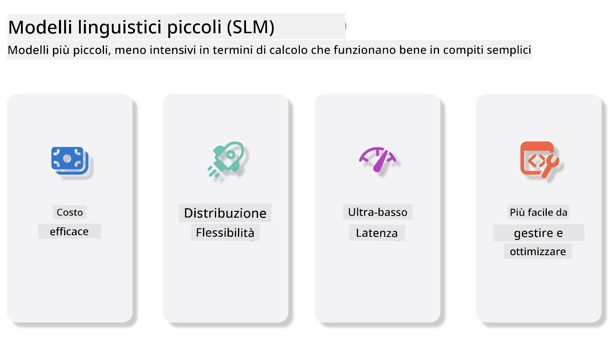
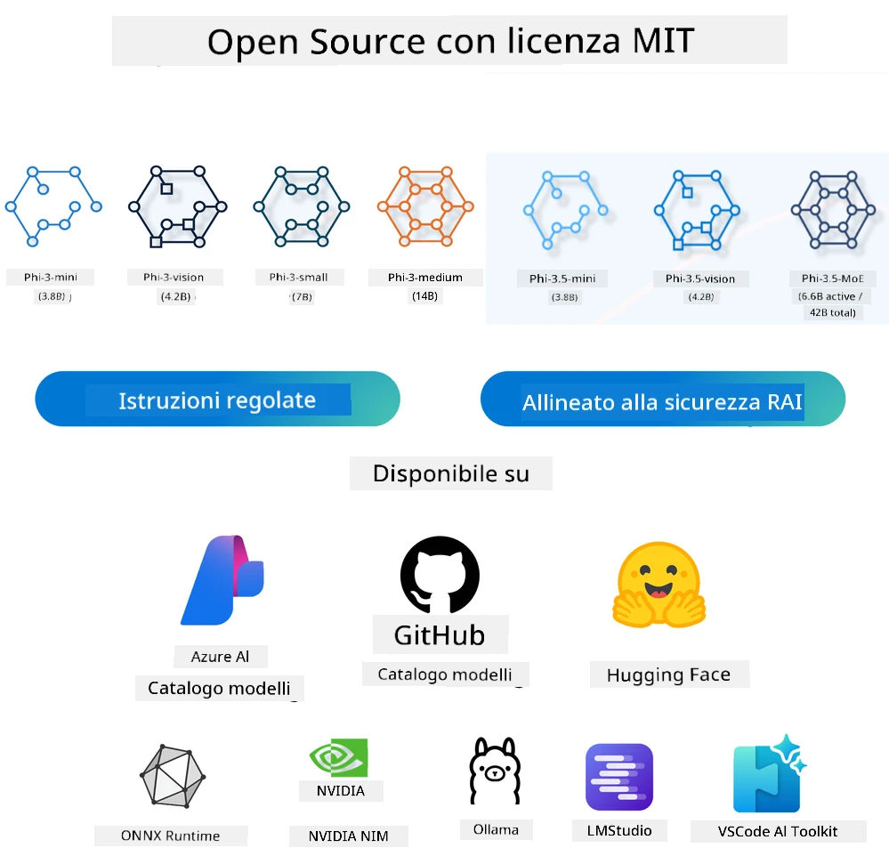
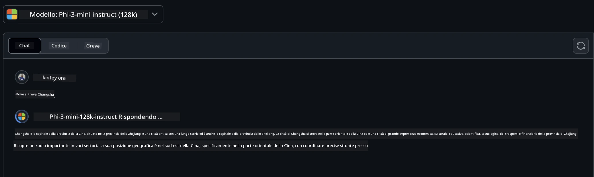
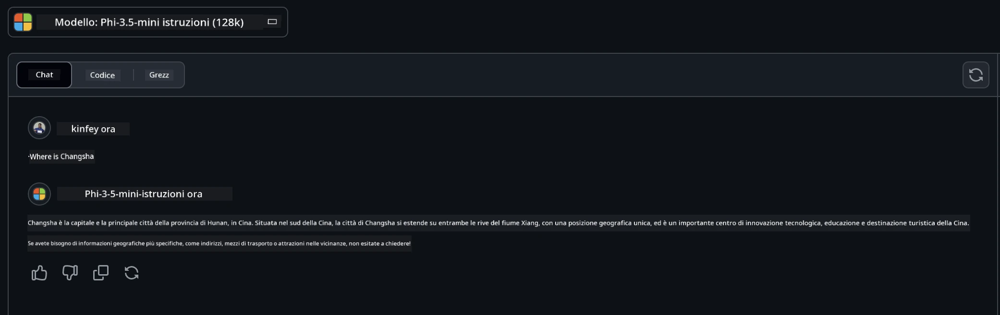

# Introduzione ai Small Language Model per Generative AI per Principianti
Generative AI è un campo affascinante dell'intelligenza artificiale che si concentra sulla creazione di sistemi capaci di generare nuovi contenuti. Questi contenuti possono spaziare da testi e immagini a musica e persino interi ambienti virtuali. Una delle applicazioni più emozionanti della generative AI è nel campo dei modelli di linguaggio.

## Cosa sono i Small Language Model?

Un Small Language Model (SLM) rappresenta una variante ridotta di un grande modello di linguaggio (LLM), sfruttando molti dei principi architetturali e delle tecniche degli LLM, pur presentando un'impronta computazionale significativamente ridotta.

Gli SLM sono una sottoclasse di modelli di linguaggio progettati per generare testo simile a quello umano. A differenza dei loro omologhi più grandi, come GPT-4, gli SLM sono più compatti ed efficienti, rendendoli ideali per applicazioni in cui le risorse computazionali sono limitate. Nonostante le dimensioni più piccole, possono comunque svolgere una varietà di compiti. Tipicamente, gli SLM sono costruiti comprimendo o distillando gli LLM, con l'obiettivo di mantenere una porzione sostanziale della funzionalità e delle capacità linguistiche del modello originale. Questa riduzione nella dimensione del modello diminuisce la complessità complessiva, rendendo gli SLM più efficienti sia in termini di utilizzo della memoria sia di requisiti computazionali. Nonostante queste ottimizzazioni, gli SLM possono svolgere una vasta gamma di compiti di elaborazione del linguaggio naturale (NLP):

- Generazione di testo: Creare frasi o paragrafi coerenti e contestualmente rilevanti.
- Completamento del testo: Prevedere e completare frasi basate su un prompt fornito.
- Traduzione: Convertire testo da una lingua a un'altra.
- Sintesi: Ridurre testi lunghi in riassunti più brevi e facilmente digeribili.

Con alcune concessioni in termini di prestazioni o profondità di comprensione rispetto ai loro omologhi più grandi.

## Come funzionano i Small Language Model?
Gli SLM sono addestrati su enormi quantità di dati testuali. Durante l’addestramento, imparano i modelli e le strutture del linguaggio, permettendo loro di generare testo grammaticalmente corretto e contestualmente appropriato. Il processo di addestramento comprende:

- Raccolta dati: Raccogliere grandi dataset di testo da varie fonti.
- Preprocessing: Pulire e organizzare i dati per renderli adatti all’addestramento.
- Addestramento: Utilizzare algoritmi di machine learning per insegnare al modello come comprendere e generare testo.
- Fine-tuning: Regolare il modello per migliorare le sue prestazioni su compiti specifici.

Lo sviluppo degli SLM si allinea con la crescente necessità di modelli che possano essere distribuiti in ambienti a risorse limitate, come dispositivi mobili o piattaforme di edge computing, dove gli LLM a piena scala potrebbero essere impraticabili a causa delle loro elevate richieste di risorse. Concentrandosi sull’efficienza, gli SLM bilanciano prestazioni e accessibilità, permettendo un’applicazione più ampia in vari domini.



## Obiettivi di Apprendimento

In questa lezione, speriamo di introdurre la conoscenza degli SLM e combinarla con Microsoft Phi-3 per apprendere differenti scenari in contenuto testuale, visione e MoE.

Al termine di questa lezione, dovresti essere in grado di rispondere alle seguenti domande:

- Che cos’è uno SLM?
- Qual è la differenza tra SLM e LLM?
- Cos’è la famiglia Microsoft Phi-3/3.5?
- Come eseguire inferenza con la famiglia Microsoft Phi-3/3.5?

Pronti? Iniziamo.

## Le differenze tra Large Language Models (LLM) e Small Language Models (SLM)

Sia gli LLM che gli SLM sono costruiti su principi fondamentali di apprendimento automatico probabilistico, seguendo approcci simili nel loro design architetturale, metodologie di addestramento, processi di generazione dati e tecniche di valutazione del modello. Tuttavia, diversi fattori chiave differenziano questi due tipi di modelli.

## Applicazioni dei Small Language Models

Gli SLM hanno una vasta gamma di applicazioni, tra cui:

- Chatbot: Fornire supporto clienti e interagire con gli utenti in modo conversazionale.
- Creazione di contenuti: Assistere gli scrittori generando idee o anche bozze complete di articoli.
- Educazione: Aiutare gli studenti con i compiti di scrittura o l’apprendimento di nuove lingue.
- Accessibilità: Creare strumenti per persone con disabilità, come sistemi di sintesi vocale.

**Dimensione**

Una distinzione primaria tra LLM e SLM risiede nella scala dei modelli. Gli LLM, come ChatGPT (GPT-4), possono comprendere circa 1,76 trilioni di parametri, mentre gli SLM open-source come Mistral 7B sono progettati con un numero significativamente inferiore di parametri — circa 7 miliardi. Questa disparità deriva principalmente da differenze nell'architettura del modello e nei processi di addestramento. Ad esempio, ChatGPT impiega un meccanismo di self-attention all’interno di un framework encoder-decoder, mentre Mistral 7B utilizza l'attenzione a finestra scorrevole, che consente un addestramento più efficiente all’interno di un modello solo decoder. Questa variazione architetturale ha profonde implicazioni per la complessità e le prestazioni di questi modelli.

**Comprensione**

Gli SLM sono tipicamente ottimizzati per prestazioni in ambiti specifici, rendendoli altamente specializzati ma potenzialmente limitati nella capacità di fornire una comprensione contestuale ampia su più campi di conoscenza. Al contrario, gli LLM mirano a simulare un’intelligenza umana a livello più comprensivo. Addestrati su dataset vasti e diversificati, gli LLM sono progettati per eccellere in vari domini, offrendo maggiore versatilità e adattabilità. Di conseguenza, gli LLM sono più adatti a una gamma più ampia di compiti downstream, come elaborazione del linguaggio naturale e programmazione.

**Calcolo**

L’addestramento e il deployment degli LLM sono processi ad alta intensità di risorse, spesso richiedendo infrastrutture computazionali significative, inclusi cluster GPU su larga scala. Per esempio, addestrare un modello come ChatGPT da zero può richiedere migliaia di GPU per lunghi periodi. Al contrario, gli SLM, con i loro parametri minori, sono più accessibili in termini di risorse computazionali. Modelli come Mistral 7B possono essere addestrati e utilizzati su macchine locali dotate di GPU moderate, anche se l’addestramento richiede ancora diverse ore su più GPU.

**Bias**

Il bias è un problema noto negli LLM, principalmente a causa della natura dei dati di addestramento. Questi modelli spesso si basano su dati grezzi e pubblicamente disponibili dal web, che possono sottorappresentare o rappresentare in modo errato certi gruppi, introdurre etichettature errate o riflettere bias linguistici influenzati da dialetti, variazioni geografiche e regole grammaticali. Inoltre, la complessità delle architetture LLM può involontariamente esacerbare i bias, che potrebbero passare inosservati senza un attento fine-tuning. D’altro canto, gli SLM, essendo addestrati su dataset più ristretti e specifici per dominio, sono intrinsecamente meno suscettibili a tali pregiudizi, sebbene non ne siano immuni.

**Inferenza**

La minore dimensione degli SLM conferisce loro un vantaggio significativo in termini di velocità di inferenza, permettendo di generare output in modo efficiente su hardware locale senza necessità di elaborazione parallela estesa. Al contrario, gli LLM, a causa delle dimensioni e della complessità, spesso richiedono risorse computazionali parallele sostanziali per raggiungere tempi di inferenza accettabili. La presenza di utenti concorrenti inoltre rallenta i tempi di risposta degli LLM, specialmente in contesti di distribuzione su larga scala.

In sintesi, mentre sia gli LLM che gli SLM condividono una base fondamentale nell’apprendimento automatico, differiscono significativamente in termini di dimensioni del modello, requisiti di risorse, comprensione contestuale, suscettibilità ai bias e velocità di inferenza. Queste distinzioni riflettono la rispettiva idoneità a diversi casi d’uso, con gli LLM più versatili ma esigenti in risorse, e gli SLM che offrono maggiore efficienza specifica per dominio con minori richieste computazionali.

***Nota: in questa lezione, introdurremo gli SLM utilizzando Microsoft Phi-3 / 3.5 come esempio.***

## Introduzione alla famiglia Phi-3 / Phi-3.5

La famiglia Phi-3 / 3.5 è principalmente rivolta a scenari applicativi di testo, visione e Agent (MoE):

### Phi-3 / 3.5 Instruct

Principalmente per generazione di testo, completamento di chat ed estrazione di informazioni di contenuto, ecc.

**Phi-3-mini**

Il modello linguistico da 3,8 miliardi di parametri è disponibile su Microsoft Azure AI Studio, Hugging Face e Ollama. I modelli Phi-3 superano significativamente i modelli linguisticamente di pari e maggiori dimensioni in benchmark chiave (vedi numeri benchmark sotto, numeri più alti sono migliori). Phi-3-mini supera modelli il doppio della sua dimensione, mentre Phi-3-small e Phi-3-medium superano modelli più grandi, incluso GPT-3.5.

**Phi-3-small & medium**

Con appena 7 miliardi di parametri, Phi-3-small batte GPT-3.5T in una varietà di benchmark linguistici, di ragionamento, coding e matematici.

Il Phi-3-medium con 14 miliardi di parametri continua questa tendenza e supera il Gemini 1.0 Pro.

**Phi-3.5-mini**

Lo possiamo vedere come un upgrade di Phi-3-mini. Pur mantenendo invariati i parametri, migliora la capacità di supportare più lingue (supporta oltre 20 lingue: Arabo, Cinese, Ceco, Danese, Olandese, Inglese, Finlandese, Francese, Tedesco, Ebraico, Ungherese, Italiano, Giapponese, Coreano, Norvegese, Polacco, Portoghese, Russo, Spagnolo, Svedese, Thai, Turco, Ucraino) e aggiunge un supporto più robusto per contesti lunghi.

Phi-3.5-mini con 3,8 miliardi di parametri supera i modelli della stessa dimensione ed è alla pari con modelli doppio della sua dimensione.

### Phi-3 / 3.5 Vision

Possiamo pensare al modello Instruct di Phi-3/3.5 come alla capacità di Phi di comprendere, mentre Vision è ciò che dà a Phi occhi per comprendere il mondo.

**Phi-3-Vision**

Phi-3-Vision, con solo 4,2 miliardi di parametri, continua questa tendenza e supera modelli più grandi come Claude-3 Haiku e Gemini 1.0 Pro V in compiti generali di ragionamento visivo, OCR, e comprensione di tabelle e diagrammi.

**Phi-3.5-Vision**

Phi-3.5-Vision è anche un aggiornamento di Phi-3-Vision, aggiungendo supporto per immagini multiple. Puoi pensarlo come un miglioramento nella visione: non solo può vedere immagini, ma anche video.

Phi-3.5-vision supera modelli più grandi come Claude-3.5 Sonnet e Gemini 1.5 Flash in compiti di OCR, comprensione di tabelle e grafici e si pone alla pari in compiti generali di ragionamento su conoscenze visive. Supporta input multi-frame, ovvero può ragionare su più immagini contemporaneamente.

### Phi-3.5-MoE

***Mixture of Experts (MoE)*** consente ai modelli di essere pre-addestrati con un calcolo molto inferiore, il che significa che è possibile scalare drasticamente la dimensione del modello o del dataset con lo stesso budget di calcolo di un modello denso. In particolare, un modello MoE dovrebbe raggiungere la stessa qualità del suo equivalente denso molto più rapidamente durante il pre-addestramento.

Phi-3.5-MoE comprende 16 moduli esperti da 3,8 miliardi ciascuno. Phi-3.5-MoE con soli 6,6 miliardi di parametri attivi raggiunge un livello simile di ragionamento, comprensione del linguaggio e matematica rispetto a modelli molto più grandi.

Possiamo usare il modello della famiglia Phi-3/3.5 basandoci su scenari diversi. A differenza degli LLM, puoi distribuire Phi-3/3.5-mini o Phi-3/3.5-Vision su dispositivi edge.

## Come utilizzare i modelli della famiglia Phi-3/3.5

Speriamo di utilizzare Phi-3/3.5 in diversi scenari. Di seguito, useremo Phi-3/3.5 in base ai diversi scenari.



### Inferenza tramite Cloud API

**GitHub Models**

GitHub Models è il modo più diretto. Puoi accedere rapidamente al modello Phi-3/3.5-Instruct tramite GitHub Models. Combinando l’Azure AI Inference SDK / OpenAI SDK, puoi accedere all’API attraverso il codice per completare la chiamata Phi-3/3.5-Instruct. Puoi anche testare diversi effetti tramite Playground.

- Demo: Confronto degli effetti di Phi-3-mini e Phi-3.5-mini in scenari in cinese






**Azure AI Studio**

Oppure, se vogliamo usare i modelli vision e MoE, puoi usare Azure AI Studio per completare la chiamata. Se sei interessato, puoi leggere il Phi-3 Cookbook per imparare come chiamare Phi-3/3.5 Instruct, Vision, MoE tramite Azure AI Studio [Clicca questo link](https://github.com/microsoft/Phi-3CookBook/blob/main/md/02.QuickStart/AzureAIStudio_QuickStart.md?WT.mc_id=academic-105485-koreyst)


**NVIDIA NIM**

Oltre alle soluzioni basate su cloud Model Catalog fornite da Azure e GitHub, puoi anche utilizzare [NVIDIA NIM](https://developer.nvidia.com/nim?WT.mc_id=academic-105485-koreyst) per completare le chiamate correlate. Puoi visitare NVIDIA NIM per eseguire le chiamate API della famiglia Phi-3/3.5. NVIDIA NIM (NVIDIA Inference Microservices) è un insieme di microservizi di inferenza accelerata progettati per aiutare gli sviluppatori a distribuire modelli AI in modo efficiente in vari ambienti, inclusi cloud, data center e workstation.

Ecco alcune caratteristiche chiave di NVIDIA NIM:
- **Facilità di distribuzione:** NIM consente di distribuire modelli AI con un solo comando, rendendo semplice l'integrazione nei flussi di lavoro esistenti.
- **Prestazioni ottimizzate:** Sfrutta i motori di inferenza pre-ottimizzati di NVIDIA, come TensorRT e TensorRT-LLM, per garantire bassa latenza e alta produttività.
- **Scalabilità:** NIM supporta l’autoscaling su Kubernetes, permettendo di gestire efficacemente carichi di lavoro variabili.
- **Sicurezza e controllo:** Le organizzazioni possono mantenere il controllo sui propri dati e applicazioni ospitando in proprio i microservizi NIM sulla propria infrastruttura gestita.
- **API standard:** NIM fornisce API standard del settore, facilitando la creazione e l’integrazione di applicazioni AI come chatbot, assistenti AI e altro.

NIM fa parte di NVIDIA AI Enterprise, che mira a semplificare la distribuzione e l’operatività dei modelli AI, garantendo che funzionino in modo efficiente sulle GPU NVIDIA.

- Demo: Utilizzo di NVIDIA NIM per chiamare Phi-3.5-Vision-API  [[Clicca questo link](./python/Phi-3-Vision-Nividia-NIM.ipynb?WT.mc_id=academic-105485-koreyst)]


### Esecuzione locale di Phi-3/3.5
L’inferenza in relazione a Phi-3, o a qualsiasi modello linguistico come GPT-3, si riferisce al processo di generazione di risposte o predizioni basate sull’input ricevuto. Quando fornisci un prompt o una domanda a Phi-3, utilizza la sua rete neurale allenata per dedurre la risposta più probabile e rilevante analizzando schemi e relazioni nei dati su cui è stato addestrato.

**Transformer di Hugging Face**  
Hugging Face Transformers è una potente libreria progettata per l’elaborazione del linguaggio naturale (NLP) e altri compiti di machine learning. Ecco alcuni punti chiave:

1. **Modelli pretrained:** Offre migliaia di modelli pretrained utilizzabili per vari compiti come classificazione del testo, riconoscimento di entità nominate, question answering, riassunto, traduzione e generazione di testo.

2. **Interoperabilità con framework:** Supporta più framework di deep learning, tra cui PyTorch, TensorFlow e JAX. Questo permette di addestrare un modello in un framework e usarlo in un altro.

3. **Capacità multimodali:** Oltre alla NLP, Hugging Face Transformers supporta anche compiti di visione artificiale (es. classificazione immagini, rilevamento oggetti) e elaborazione audio (es. riconoscimento vocale, classificazione audio).

4. **Facilità d’uso:** La libreria offre API e strumenti per scaricare e affinare facilmente i modelli, rendendola accessibile sia ai principianti che agli esperti.

5. **Comunità e risorse:** Hugging Face ha una comunità vivace ed estesa documentazione, tutorial e guide per aiutare gli utenti a iniziare e sfruttare al meglio la libreria.  
[documentazione ufficiale](https://huggingface.co/docs/transformers/index?WT.mc_id=academic-105485-koreyst) o il loro [repository GitHub](https://github.com/huggingface/transformers?WT.mc_id=academic-105485-koreyst).

Questo è il metodo più comunemente usato, ma richiede anche l’accelerazione GPU. Dopotutto, scenari come Vision e MoE richiedono molti calcoli, che saranno molto lenti su CPU se non quantizzati.


- Demo: Utilizzo di Transformer per chiamare Phi-3.5-Instruct [Clicca questo link](./python/phi35-instruct-demo.ipynb?WT.mc_id=academic-105485-koreyst)

- Demo: Utilizzo di Transformer per chiamare Phi-3.5-Vision [Clicca questo link](./python/phi35-vision-demo.ipynb?WT.mc_id=academic-105485-koreyst)

- Demo: Utilizzo di Transformer per chiamare Phi-3.5-MoE [Clicca questo link](./python/phi35_moe_demo.ipynb?WT.mc_id=academic-105485-koreyst)

**Ollama**  
[Ollama](https://ollama.com/?WT.mc_id=academic-105485-koreyst) è una piattaforma pensata per facilitare l’esecuzione locale di grandi modelli linguistici (LLM) sulla tua macchina. Supporta vari modelli come Llama 3.1, Phi 3, Mistral e Gemma 2, tra gli altri. La piattaforma semplifica il processo raggruppando pesi, configurazione e dati del modello in un unico pacchetto, rendendo più accessibile la personalizzazione e la creazione di modelli propri. Ollama è disponibile per macOS, Linux e Windows. È uno strumento eccellente se vuoi sperimentare o distribuire LLM senza dipendere dai servizi cloud. Ollama è il modo più diretto, basta eseguire il comando seguente.


```bash

ollama run phi3.5

```


**ONNX Runtime per GenAI**

[ONNX Runtime](https://github.com/microsoft/onnxruntime-genai?WT.mc_id=academic-105485-koreyst) è un acceleratore di inferenza e training cross-platform per machine learning. ONNX Runtime per Generative AI (GENAI) è uno strumento potente che ti aiuta a eseguire modelli AI generativi efficacemente su varie piattaforme.

## Cos’è ONNX Runtime?  
ONNX Runtime è un progetto open-source che consente inferenza ad alte prestazioni di modelli machine learning. Supporta modelli nel formato Open Neural Network Exchange (ONNX), uno standard per rappresentare modelli di machine learning. L’inferenza con ONNX Runtime può migliorare l’esperienza utente con tempi di risposta più rapidi e costi ridotti, supportando modelli provenienti da framework di deep learning come PyTorch e TensorFlow/Keras, oltre a librerie classiche di machine learning come scikit-learn, LightGBM, XGBoost, ecc. ONNX Runtime è compatibile con diversi hardware, driver e sistemi operativi, e offre prestazioni ottimali sfruttando acceleratori hardware dove disponibili insieme a ottimizzazioni e trasformazioni del grafo.

## Cos’è l’Intelligenza Artificiale Generativa?  
L’intelligenza artificiale generativa si riferisce a sistemi AI capaci di generare nuovi contenuti, come testo, immagini o musica, basandosi sui dati su cui sono stati addestrati. Esempi includono modelli linguistici come GPT-3 e modelli per generazione di immagini come Stable Diffusion. La libreria ONNX Runtime per GenAI fornisce il ciclo generativo AI per modelli ONNX, includendo inferenza con ONNX Runtime, elaborazione dei logits, ricerca e campionamento, e gestione della cache KV.

## ONNX Runtime per GENAI  
ONNX Runtime per GENAI estende le capacità di ONNX Runtime per supportare modelli di AI generativa. Ecco alcune caratteristiche chiave:

- **Supporto ampio per piattaforme:** Funziona su varie piattaforme, inclusi Windows, Linux, macOS, Android e iOS.
- **Supporto modelli:** Supporta molti modelli AI generativi popolari, come LLaMA, GPT-Neo, BLOOM e altri.
- **Ottimizzazione delle prestazioni:** Include ottimizzazioni per diversi acceleratori hardware come GPU NVIDIA, GPU AMD e altri.
- **Facilità d’uso:** Fornisce API per un’integrazione semplice nelle applicazioni, permettendo di generare testo, immagini e altri contenuti con poco codice.
- Gli utenti possono chiamare un metodo di alto livello generate(), o eseguire ogni iterazione del modello in un ciclo, generando un token alla volta, e opzionalmente aggiornando i parametri di generazione all’interno del ciclo.
- ONNX runtime supporta anche la ricerca greedy/beam e il campionamento TopP, TopK per generare sequenze di token e ha elaborazione integrata dei logits come penalità di ripetizione. È anche facile aggiungere valutazioni personalizzate.

## Per iniziare  
Per iniziare con ONNX Runtime per GENAI, puoi seguire questi passaggi:

### Installa ONNX Runtime:  
```Python
pip install onnxruntime
```


### Installa le estensioni per Generative AI:  
```Python
pip install onnxruntime-genai
```


### Esegui un modello: Ecco un esempio semplice in Python:  
```Python
import onnxruntime_genai as og

model = og.Model('path_to_your_model.onnx')

tokenizer = og.Tokenizer(model)

input_text = "Hello, how are you?"

input_tokens = tokenizer.encode(input_text)

output_tokens = model.generate(input_tokens)

output_text = tokenizer.decode(output_tokens)

print(output_text) 
```


### Demo: Utilizzo di ONNX Runtime GenAI per chiamare Phi-3.5-Vision  
```python

import onnxruntime_genai as og

model_path = './Your Phi-3.5-vision-instruct ONNX Path'

img_path = './Your Image Path'

model = og.Model(model_path)

processor = model.create_multimodal_processor()

tokenizer_stream = processor.create_stream()

text = "Your Prompt"

prompt = "<|user|>\n"

prompt += "<|image_1|>\n"

prompt += f"{text}<|end|>\n"

prompt += "<|assistant|>\n"

image = og.Images.open(img_path)

inputs = processor(prompt, images=image)

params = og.GeneratorParams(model)

params.set_inputs(inputs)

params.set_search_options(max_length=3072)

generator = og.Generator(model, params)

while not generator.is_done():

    generator.compute_logits()
    
    generator.generate_next_token()

    new_token = generator.get_next_tokens()[0]
    
    output = tokenizer_stream.decode(new_token)
    
    print(tokenizer_stream.decode(new_token), end='', flush=True)

```


**Altri**

Oltre ai metodi di riferimento ONNX Runtime e Ollama, possiamo anche completare il riferimento dei modelli quantitativi basandoci sui metodi di riferimento dei modelli forniti da diversi produttori, come Apple MLX framework con Apple Metal, Qualcomm QNN con NPU, Intel OpenVINO con CPU/GPU, ecc. Puoi trovare ulteriori contenuti su [Phi-3 Cookbook](https://github.com/microsoft/phi-3cookbook?WT.mc_id=academic-105485-koreyst)


## Altro

Abbiamo imparato le basi della famiglia Phi-3/3.5, ma per approfondire SLM servono ulteriori conoscenze. Puoi trovare le risposte nel Phi-3 Cookbook. Se vuoi saperne di più, visita il [Phi-3 Cookbook](https://github.com/microsoft/phi-3cookbook?WT.mc_id=academic-105485-koreyst).

---

<!-- CO-OP TRANSLATOR DISCLAIMER START -->
**Avvertenza**:  
Questo documento è stato tradotto utilizzando il servizio di traduzione automatica [Co-op Translator](https://github.com/Azure/co-op-translator). Pur impegnandoci per garantire l’accuratezza, si prega di notare che le traduzioni automatiche possono contenere errori o imprecisioni. Il documento originale nella sua lingua originale deve essere considerato la fonte autorevole. Per informazioni critiche, si raccomanda la traduzione professionale effettuata da un essere umano. Non siamo responsabili per eventuali incomprensioni o interpretazioni errate derivanti dall’uso di questa traduzione.
<!-- CO-OP TRANSLATOR DISCLAIMER END -->