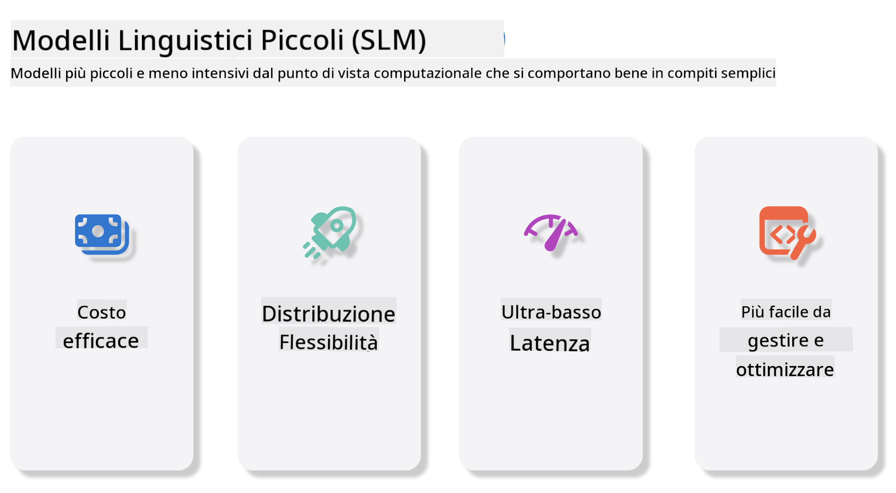
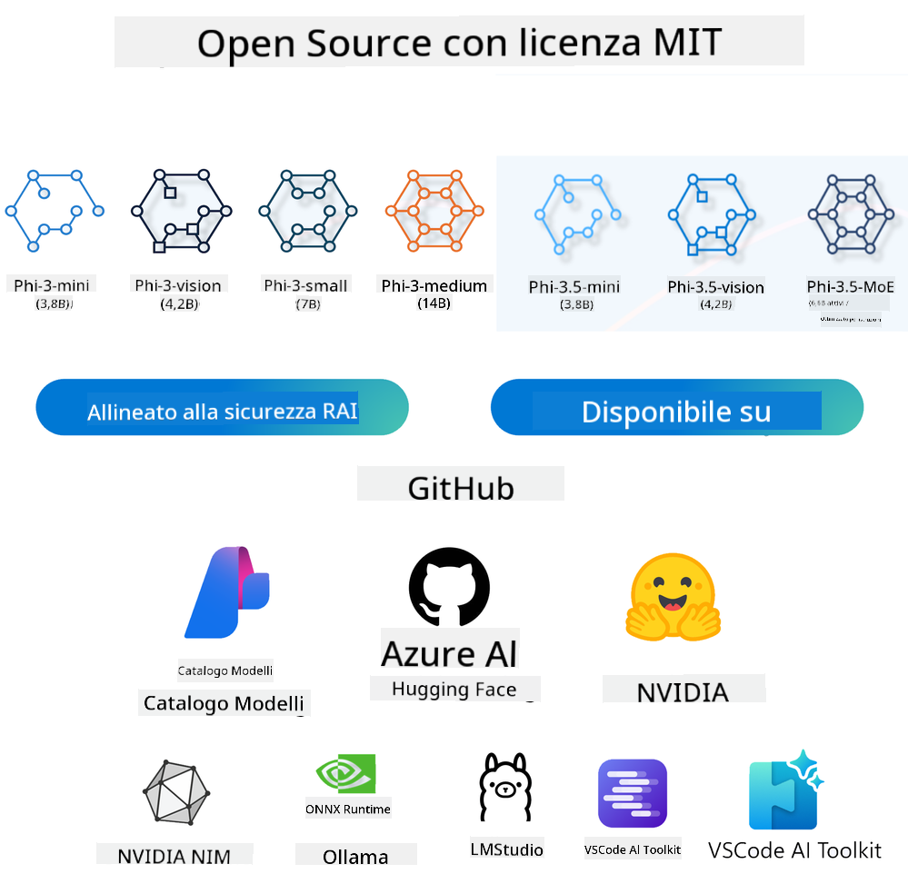

<!--
CO_OP_TRANSLATOR_METADATA:
{
  "original_hash": "124ad36cfe96f74038811b6e2bb93e9d",
  "translation_date": "2025-07-09T18:31:28+00:00",
  "source_file": "19-slm/README.md",
  "language_code": "it"
}
-->
# Introduzione ai Modelli Linguistici di Piccole Dimensioni per l’IA Generativa per Principianti  
L’IA generativa è un campo affascinante dell’intelligenza artificiale che si concentra sulla creazione di sistemi capaci di generare nuovi contenuti. Questi contenuti possono spaziare da testi e immagini a musica e persino interi ambienti virtuali. Una delle applicazioni più entusiasmanti dell’IA generativa riguarda i modelli linguistici.

## Cosa Sono i Modelli Linguistici di Piccole Dimensioni?  

Un Modello Linguistico di Piccole Dimensioni (SLM) rappresenta una variante ridotta di un grande modello linguistico (LLM), che sfrutta molti dei principi architetturali e delle tecniche degli LLM, ma con un’impronta computazionale significativamente minore.

Gli SLM sono una sottocategoria di modelli linguistici progettati per generare testo simile a quello umano. A differenza dei loro omologhi più grandi, come GPT-4, gli SLM sono più compatti ed efficienti, rendendoli ideali per applicazioni in cui le risorse computazionali sono limitate. Nonostante le dimensioni ridotte, possono comunque svolgere una varietà di compiti. Tipicamente, gli SLM vengono costruiti comprimendo o distillando gli LLM, con l’obiettivo di mantenere una parte sostanziale delle funzionalità e delle capacità linguistiche del modello originale. Questa riduzione delle dimensioni del modello diminuisce la complessità complessiva, rendendo gli SLM più efficienti sia in termini di utilizzo della memoria che di requisiti computazionali. Nonostante queste ottimizzazioni, gli SLM possono ancora eseguire un’ampia gamma di compiti di elaborazione del linguaggio naturale (NLP):

- Generazione di testo: Creare frasi o paragrafi coerenti e contestualmente rilevanti.  
- Completamento del testo: Predire e completare frasi basandosi su un prompt dato.  
- Traduzione: Convertire testo da una lingua all’altra.  
- Sintesi: Riassumere testi lunghi in versioni più brevi e facilmente digeribili.

Tuttavia, con qualche compromesso in termini di prestazioni o profondità di comprensione rispetto ai modelli più grandi.

## Come Funzionano i Modelli Linguistici di Piccole Dimensioni?  
Gli SLM vengono addestrati su enormi quantità di dati testuali. Durante l’addestramento, apprendono i modelli e le strutture del linguaggio, permettendo loro di generare testi grammaticalmente corretti e contestualmente appropriati. Il processo di addestramento comprende:

- Raccolta dati: Acquisizione di grandi dataset testuali da varie fonti.  
- Preprocessing: Pulizia e organizzazione dei dati per renderli adatti all’addestramento.  
- Addestramento: Utilizzo di algoritmi di machine learning per insegnare al modello come comprendere e generare testo.  
- Fine-tuning: Regolazione del modello per migliorare le prestazioni su compiti specifici.

Lo sviluppo degli SLM risponde alla crescente necessità di modelli che possano essere implementati in ambienti con risorse limitate, come dispositivi mobili o piattaforme di edge computing, dove gli LLM a piena scala potrebbero risultare impraticabili a causa dell’elevato consumo di risorse. Concentrandosi sull’efficienza, gli SLM bilanciano prestazioni e accessibilità, permettendo un’applicazione più ampia in diversi ambiti.



## Obiettivi di Apprendimento  

In questa lezione, intendiamo introdurre la conoscenza degli SLM e combinarla con Microsoft Phi-3 per esplorare diversi scenari nei contenuti testuali, nella visione e in MoE.

Al termine di questa lezione, dovresti essere in grado di rispondere alle seguenti domande:

- Cos’è un SLM  
- Quali sono le differenze tra SLM e LLM  
- Cos’è la famiglia Microsoft Phi-3/3.5  
- Come effettuare inferenze con la famiglia Microsoft Phi-3/3.5

Pronto? Iniziamo.

## Le Differenze tra Grandi Modelli Linguistici (LLM) e Modelli Linguistici di Piccole Dimensioni (SLM)  

Sia gli LLM che gli SLM si basano su principi fondamentali del machine learning probabilistico, seguendo approcci simili nel design architetturale, nelle metodologie di addestramento, nei processi di generazione dati e nelle tecniche di valutazione del modello. Tuttavia, diversi fattori chiave distinguono questi due tipi di modelli.

## Applicazioni dei Modelli Linguistici di Piccole Dimensioni  

Gli SLM trovano impiego in molteplici ambiti, tra cui:

- Chatbot: Fornire supporto clienti e interagire con gli utenti in modo conversazionale.  
- Creazione di contenuti: Assistere gli scrittori generando idee o addirittura bozze di articoli.  
- Educazione: Aiutare gli studenti con compiti di scrittura o nell’apprendimento di nuove lingue.  
- Accessibilità: Creare strumenti per persone con disabilità, come sistemi di sintesi vocale.

**Dimensioni**  

Una distinzione primaria tra LLM e SLM riguarda la scala dei modelli. Gli LLM, come ChatGPT (GPT-4), possono comprendere circa 1,76 trilioni di parametri, mentre gli SLM open-source come Mistral 7B sono progettati con un numero significativamente inferiore di parametri—circa 7 miliardi. Questa disparità deriva principalmente da differenze nell’architettura del modello e nei processi di addestramento. Ad esempio, ChatGPT utilizza un meccanismo di self-attention all’interno di un framework encoder-decoder, mentre Mistral 7B impiega un’attenzione a finestra scorrevole, che consente un addestramento più efficiente in un modello solo decoder. Questa differenza architetturale ha profonde implicazioni sulla complessità e sulle prestazioni di questi modelli.

**Comprensione**  

Gli SLM sono generalmente ottimizzati per prestazioni in domini specifici, risultando altamente specializzati ma potenzialmente limitati nella capacità di fornire una comprensione contestuale ampia su molteplici campi del sapere. Al contrario, gli LLM mirano a simulare un’intelligenza simile a quella umana su un livello più ampio. Addestrati su dataset vasti e diversificati, gli LLM sono progettati per funzionare bene in vari domini, offrendo maggiore versatilità e adattabilità. Di conseguenza, gli LLM sono più adatti a una gamma più ampia di compiti downstream, come l’elaborazione del linguaggio naturale e la programmazione.

**Calcolo**  

L’addestramento e il deployment degli LLM sono processi ad alta intensità di risorse, spesso richiedendo infrastrutture computazionali significative, inclusi cluster GPU su larga scala. Per esempio, addestrare un modello come ChatGPT da zero può richiedere migliaia di GPU per lunghi periodi. Al contrario, gli SLM, con un numero di parametri inferiore, sono più accessibili in termini di risorse computazionali. Modelli come Mistral 7B possono essere addestrati ed eseguiti su macchine locali dotate di GPU di capacità moderata, anche se l’addestramento richiede comunque diverse ore su più GPU.

**Bias**  

Il bias è un problema noto negli LLM, principalmente a causa della natura dei dati di addestramento. Questi modelli spesso si basano su dati grezzi e disponibili pubblicamente su internet, che possono sottorappresentare o rappresentare in modo errato certi gruppi, introdurre etichettature errate o riflettere bias linguistici influenzati da dialetti, variazioni geografiche e regole grammaticali. Inoltre, la complessità delle architetture LLM può involontariamente amplificare il bias, che può passare inosservato senza un attento fine-tuning. D’altra parte, gli SLM, essendo addestrati su dataset più ristretti e specifici per dominio, sono intrinsecamente meno suscettibili a tali bias, anche se non ne sono immuni.

**Inferenza**  

La dimensione ridotta degli SLM conferisce loro un vantaggio significativo in termini di velocità di inferenza, permettendo di generare output in modo efficiente su hardware locale senza la necessità di un’elaborazione parallela estesa. Al contrario, gli LLM, a causa delle loro dimensioni e complessità, spesso richiedono risorse computazionali parallele sostanziali per raggiungere tempi di inferenza accettabili. La presenza di più utenti concorrenti rallenta ulteriormente i tempi di risposta degli LLM, specialmente quando sono distribuiti su larga scala.

In sintesi, mentre LLM e SLM condividono una base fondamentale nel machine learning, differiscono significativamente in termini di dimensioni del modello, requisiti di risorse, comprensione contestuale, suscettibilità al bias e velocità di inferenza. Queste differenze riflettono la loro idoneità a diversi casi d’uso, con gli LLM più versatili ma esigenti in termini di risorse, e gli SLM più efficienti e specifici per dominio con minori richieste computazionali.

***Nota：In questo capitolo introdurremo gli SLM usando come esempio Microsoft Phi-3 / 3.5.***

## Introduzione alla Famiglia Phi-3 / Phi-3.5  

La famiglia Phi-3 / 3.5 è principalmente rivolta a scenari applicativi di testo, visione e Agent (MoE):

### Phi-3 / 3.5 Instruct  

Principalmente per generazione di testo, completamento di chat ed estrazione di informazioni dai contenuti, ecc.

**Phi-3-mini**  

Il modello linguistico da 3.8B è disponibile su Microsoft Azure AI Studio, Hugging Face e Ollama. I modelli Phi-3 superano significativamente i modelli linguistici di dimensioni uguali o maggiori su benchmark chiave (vedi numeri benchmark sotto, numeri più alti indicano migliori prestazioni). Phi-3-mini supera modelli di dimensioni doppie, mentre Phi-3-small e Phi-3-medium superano modelli più grandi, incluso GPT-3.5.

**Phi-3-small & medium**  

Con soli 7 miliardi di parametri, Phi-3-small batte GPT-3.5T in vari benchmark di linguaggio, ragionamento, coding e matematica.

Phi-3-medium con 14 miliardi di parametri continua questa tendenza e supera Gemini 1.0 Pro.

**Phi-3.5-mini**  

Lo possiamo considerare un upgrade di Phi-3-mini. Pur mantenendo invariati i parametri, migliora la capacità di supportare più lingue (supporta oltre 20 lingue: arabo, cinese, ceco, danese, olandese, inglese, finlandese, francese, tedesco, ebraico, ungherese, italiano, giapponese, coreano, norvegese, polacco, portoghese, russo, spagnolo, svedese, tailandese, turco, ucraino) e aggiunge un supporto più robusto per contesti lunghi.

Phi-3.5-mini con 3.8 miliardi di parametri supera modelli linguistici della stessa dimensione ed è alla pari con modelli di dimensioni doppie.

### Phi-3 / 3.5 Vision  

Possiamo pensare al modello Instruct di Phi-3/3.5 come alla capacità di Phi di comprendere, mentre Vision è ciò che dà a Phi gli “occhi” per capire il mondo.

**Phi-3-Vision**  

Phi-3-vision, con soli 4.2 miliardi di parametri, continua questa tendenza e supera modelli più grandi come Claude-3 Haiku e Gemini 1.0 Pro V in compiti generali di ragionamento visivo, OCR e comprensione di tabelle e diagrammi.

**Phi-3.5-Vision**  

Phi-3.5-Vision è un upgrade di Phi-3-Vision, aggiungendo il supporto per immagini multiple. Puoi considerarlo un miglioramento nella visione: non solo può vedere immagini, ma anche video.

Phi-3.5-vision supera modelli più grandi come Claude-3.5 Sonnet e Gemini 1.5 Flash in compiti di OCR, comprensione di tabelle e grafici, ed è alla pari nei compiti di ragionamento visivo generale. Supporta input multi-frame, cioè può ragionare su più immagini in ingresso.

### Phi-3.5-MoE  

***Mixture of Experts (MoE)*** permette ai modelli di essere pre-addestrati con un consumo computazionale molto inferiore, il che significa che puoi scalare drasticamente la dimensione del modello o del dataset con lo stesso budget computazionale di un modello denso. In particolare, un modello MoE dovrebbe raggiungere la stessa qualità del suo corrispettivo denso molto più rapidamente durante il pre-addestramento.

Phi-3.5-MoE comprende 16 moduli esperti da 3.8B ciascuno. Phi-3.5-MoE, con soli 6.6 miliardi di parametri attivi, raggiunge un livello simile di ragionamento, comprensione linguistica e matematica rispetto a modelli molto più grandi.

Possiamo utilizzare il modello della famiglia Phi-3/3.5 in base a diversi scenari. A differenza degli LLM, puoi distribuire Phi-3/3.5-mini o Phi-3/3.5-Vision su dispositivi edge.

## Come Usare i Modelli della Famiglia Phi-3/3.5  

Vogliamo utilizzare Phi-3/3.5 in diversi scenari. Di seguito, useremo Phi-3/3.5 in base a differenti contesti.



### Differenze di Inferenza con l’API Cloud  

**GitHub Models**  

GitHub Models è il modo più diretto. Puoi accedere rapidamente al modello Phi-3/3.5-Instruct tramite GitHub Models. Integrandolo con Azure AI Inference SDK / OpenAI SDK, puoi accedere all’API tramite codice per completare la chiamata a Phi-3/3.5-Instruct. Puoi anche testare diversi effetti tramite Playground.

- Demo: Confronto degli effetti di Phi-3-mini e Phi-3.5-mini in scenari in cinese


**Azure AI Studio**  

Se invece vogliamo utilizzare i modelli vision e MoE, possiamo usare Azure AI Studio per completare la chiamata. Se sei interessato, puoi leggere il Phi-3 Cookbook per imparare come chiamare Phi-3/3.5 Instruct, Vision, MoE tramite Azure AI Studio [Clicca questo link](https://github.com/microsoft/Phi-3CookBook/blob/main/md/02.QuickStart/AzureAIStudio_QuickStart.md?WT.mc_id=academic-105485-koreyst)

**NVIDIA NIM**  

Oltre alle soluzioni cloud basate su Model Catalog offerte da Azure e GitHub, puoi anche utilizzare [NVIDIA NIM](https://developer.nvidia.com/nim?WT.mc_id=academic-105485-koreyst) per completare le chiamate correlate. Puoi visitare NVIDIA NIM per effettuare le chiamate API della famiglia Phi-3/3.5. NVIDIA NIM (NVIDIA Inference Microservices) è un insieme di microservizi di inferenza accelerata progettati per aiutare gli sviluppatori a distribuire modelli AI in modo efficiente in vari ambienti, inclusi cloud, data center e workstation.

Ecco alcune caratteristiche chiave di NVIDIA NIM:

- **Facilità di distribuzione:** NIM consente di distribuire modelli AI con un solo comando, rendendo semplice l’integrazione nei flussi di lavoro esistenti.  
- **Prestazioni ottimizzate:** Sfrutta i motori di inferenza pre-ottimizzati di NVIDIA, come TensorRT e TensorRT-LLM, per garantire bassa latenza e alta produttività.  
- **Scalabilità:** NIM supporta l’autoscaling su Kubernetes, permettendo di gestire efficacemente carichi di lavoro variabili.
- **Sicurezza e Controllo:** Le organizzazioni possono mantenere il controllo sui propri dati e applicazioni ospitando autonomamente i microservizi NIM sulla propria infrastruttura gestita.
- **API Standard:** NIM offre API standard del settore, facilitando la creazione e l’integrazione di applicazioni AI come chatbot, assistenti AI e altro.

NIM fa parte di NVIDIA AI Enterprise, che mira a semplificare il deployment e l’operatività dei modelli AI, garantendo un’esecuzione efficiente sulle GPU NVIDIA.

- Demo: Utilizzo di Nividia NIM per chiamare Phi-3.5-Vision-API  [[Clicca qui](python/Phi-3-Vision-Nividia-NIM.ipynb)]


### Inferenza Phi-3/3.5 in ambiente locale
L’inferenza in relazione a Phi-3, o a qualsiasi modello linguistico come GPT-3, si riferisce al processo di generazione di risposte o previsioni basate sull’input ricevuto. Quando fornisci un prompt o una domanda a Phi-3, utilizza la sua rete neurale addestrata per dedurre la risposta più probabile e pertinente analizzando schemi e relazioni nei dati su cui è stato addestrato.

**Hugging Face Transformer**  
Hugging Face Transformers è una libreria potente progettata per il natural language processing (NLP) e altri compiti di machine learning. Ecco alcuni punti chiave:

1. **Modelli Preaddestrati**: Offre migliaia di modelli preaddestrati utilizzabili per vari compiti come classificazione del testo, riconoscimento di entità nominate, question answering, riassunti, traduzione e generazione di testo.

2. **Interoperabilità tra Framework**: La libreria supporta diversi framework di deep learning, tra cui PyTorch, TensorFlow e JAX. Questo permette di addestrare un modello in un framework e usarlo in un altro.

3. **Capacità Multimodali**: Oltre al NLP, Hugging Face Transformers supporta anche compiti di computer vision (es. classificazione immagini, rilevamento oggetti) e elaborazione audio (es. riconoscimento vocale, classificazione audio).

4. **Facilità d’Uso**: La libreria offre API e strumenti per scaricare e affinare facilmente i modelli, rendendola accessibile sia ai principianti che agli esperti.

5. **Comunità e Risorse**: Hugging Face ha una comunità attiva e una documentazione estesa, tutorial e guide per aiutare gli utenti a iniziare e sfruttare al meglio la libreria.  
[documentazione ufficiale](https://huggingface.co/docs/transformers/index?WT.mc_id=academic-105485-koreyst) o il loro [repository GitHub](https://github.com/huggingface/transformers?WT.mc_id=academic-105485-koreyst).

Questo è il metodo più comunemente usato, ma richiede anche accelerazione GPU. Dopotutto, scenari come Vision e MoE richiedono molti calcoli, che saranno molto limitati sulla CPU se non quantizzati.


- Demo: Utilizzo di Transformer per chiamare Phi-3.5-Instuct [Clicca qui](python/phi35-instruct-demo.ipynb)

- Demo: Utilizzo di Transformer per chiamare Phi-3.5-Vision [Clicca qui](python/phi35-vision-demo.ipynb)

- Demo: Utilizzo di Transformer per chiamare Phi-3.5-MoE [Clicca qui](python/phi35_moe_demo.ipynb)

**Ollama**  
[Ollama](https://ollama.com/?WT.mc_id=academic-105485-koreyst) è una piattaforma pensata per facilitare l’esecuzione locale di grandi modelli linguistici (LLM) sul proprio computer. Supporta vari modelli come Llama 3.1, Phi 3, Mistral e Gemma 2, tra gli altri. La piattaforma semplifica il processo raggruppando pesi del modello, configurazione e dati in un unico pacchetto, rendendo più accessibile la personalizzazione e la creazione di modelli propri. Ollama è disponibile per macOS, Linux e Windows. È uno strumento ideale se vuoi sperimentare o distribuire LLM senza dipendere da servizi cloud. Ollama è il metodo più diretto, basta eseguire la seguente istruzione.


```bash

ollama run phi3.5

```


**ONNX Runtime per GenAI**

[ONNX Runtime](https://github.com/microsoft/onnxruntime-genai?WT.mc_id=academic-105485-koreyst) è un acceleratore cross-platform per inferenza e training di machine learning. ONNX Runtime per Generative AI (GENAI) è uno strumento potente che ti aiuta a eseguire modelli di AI generativa in modo efficiente su diverse piattaforme.

## Cos’è ONNX Runtime?  
ONNX Runtime è un progetto open-source che consente inferenze ad alte prestazioni di modelli di machine learning. Supporta modelli nel formato Open Neural Network Exchange (ONNX), uno standard per rappresentare modelli di machine learning. L’inferenza con ONNX Runtime può migliorare l’esperienza utente e ridurre i costi, supportando modelli provenienti da framework di deep learning come PyTorch e TensorFlow/Keras, oltre a librerie di machine learning classico come scikit-learn, LightGBM, XGBoost, ecc. ONNX Runtime è compatibile con diversi hardware, driver e sistemi operativi, offrendo prestazioni ottimali sfruttando acceleratori hardware quando disponibili, insieme a ottimizzazioni e trasformazioni del grafo.

## Cos’è l’AI Generativa?  
L’AI generativa si riferisce a sistemi AI in grado di generare nuovi contenuti, come testo, immagini o musica, basandosi sui dati su cui sono stati addestrati. Esempi includono modelli linguistici come GPT-3 e modelli di generazione immagini come Stable Diffusion. La libreria ONNX Runtime per GenAI fornisce il ciclo generativo per modelli ONNX, includendo inferenza con ONNX Runtime, elaborazione dei logits, ricerca e campionamento, e gestione della cache KV.

## ONNX Runtime per GENAI  
ONNX Runtime per GENAI estende le capacità di ONNX Runtime per supportare modelli di AI generativa. Ecco alcune caratteristiche principali:

- **Ampio Supporto Piattaforme:** Funziona su varie piattaforme, tra cui Windows, Linux, macOS, Android e iOS.
- **Supporto Modelli:** Supporta molti modelli generativi popolari, come LLaMA, GPT-Neo, BLOOM e altri.
- **Ottimizzazione delle Prestazioni:** Include ottimizzazioni per diversi acceleratori hardware come GPU NVIDIA, GPU AMD e altri.
- **Facilità d’Uso:** Fornisce API per una facile integrazione nelle applicazioni, permettendo di generare testo, immagini e altri contenuti con poco codice.
- Gli utenti possono chiamare un metodo generate() di alto livello, oppure eseguire ogni iterazione del modello in un ciclo, generando un token alla volta e aggiornando opzionalmente i parametri di generazione all’interno del ciclo.
- ONNX Runtime supporta anche ricerche greedy/beam e campionamenti TopP, TopK per generare sequenze di token e l’elaborazione integrata dei logits come penalità di ripetizione. È inoltre possibile aggiungere facilmente scoring personalizzati.

## Come Iniziare  
Per iniziare con ONNX Runtime per GENAI, puoi seguire questi passaggi:

### Installa ONNX Runtime:  
```Python
pip install onnxruntime
```  
### Installa le Estensioni per Generative AI:  
```Python
pip install onnxruntime-genai
```

### Esegui un Modello: Ecco un esempio semplice in Python:  
```Python
import onnxruntime_genai as og

model = og.Model('path_to_your_model.onnx')

tokenizer = og.Tokenizer(model)

input_text = "Hello, how are you?"

input_tokens = tokenizer.encode(input_text)

output_tokens = model.generate(input_tokens)

output_text = tokenizer.decode(output_tokens)

print(output_text) 
```  
### Demo: Utilizzo di ONNX Runtime GenAI per chiamare Phi-3.5-Vision


```python

import onnxruntime_genai as og

model_path = './Your Phi-3.5-vision-instruct ONNX Path'

img_path = './Your Image Path'

model = og.Model(model_path)

processor = model.create_multimodal_processor()

tokenizer_stream = processor.create_stream()

text = "Your Prompt"

prompt = "<|user|>\n"

prompt += "<|image_1|>\n"

prompt += f"{text}<|end|>\n"

prompt += "<|assistant|>\n"

image = og.Images.open(img_path)

inputs = processor(prompt, images=image)

params = og.GeneratorParams(model)

params.set_inputs(inputs)

params.set_search_options(max_length=3072)

generator = og.Generator(model, params)

while not generator.is_done():

    generator.compute_logits()
    
    generator.generate_next_token()

    new_token = generator.get_next_tokens()[0]
    
    code += tokenizer_stream.decode(new_token)
    
    print(tokenizer_stream.decode(new_token), end='', flush=True)

```


**Altri**

Oltre ai metodi di riferimento ONNX Runtime e Ollama, possiamo completare il riferimento dei modelli quantizzati basandoci sui metodi di riferimento forniti da diversi produttori. Come il framework Apple MLX con Apple Metal, Qualcomm QNN con NPU, Intel OpenVINO con CPU/GPU, ecc. Puoi trovare ulteriori contenuti su [Phi-3 Cookbook](https://github.com/microsoft/phi-3cookbook?WT.mc_id=academic-105485-koreyst)


## Altro

Abbiamo appreso le basi della famiglia Phi-3/3.5, ma per approfondire SLM serve più conoscenza. Puoi trovare le risposte nel Phi-3 Cookbook. Se vuoi saperne di più, visita il [Phi-3 Cookbook](https://github.com/microsoft/phi-3cookbook?WT.mc_id=academic-105485-koreyst).

**Disclaimer**:  
Questo documento è stato tradotto utilizzando il servizio di traduzione automatica [Co-op Translator](https://github.com/Azure/co-op-translator). Pur impegnandoci per garantire l’accuratezza, si prega di notare che le traduzioni automatiche possono contenere errori o imprecisioni. Il documento originale nella sua lingua nativa deve essere considerato la fonte autorevole. Per informazioni critiche, si raccomanda una traduzione professionale effettuata da un umano. Non ci assumiamo alcuna responsabilità per eventuali malintesi o interpretazioni errate derivanti dall’uso di questa traduzione.