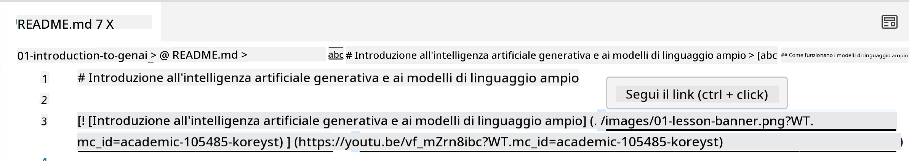
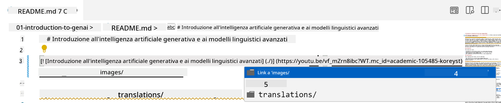
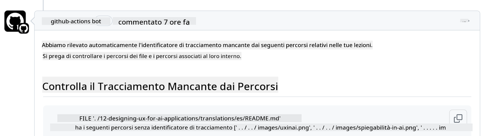
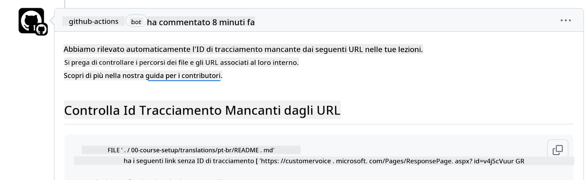
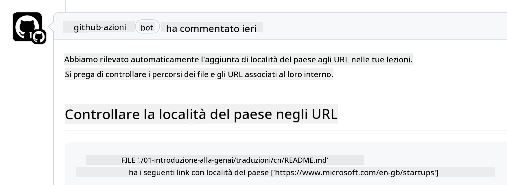

<!--
CO_OP_TRANSLATOR_METADATA:
{
  "original_hash": "57c41f2af71001a2cff9d8eb797cb843",
  "translation_date": "2025-05-19T11:15:13+00:00",
  "source_file": "CONTRIBUTING.md",
  "language_code": "it"
}
-->
# Contribuire

Questo progetto accoglie contributi e suggerimenti. La maggior parte dei contributi richiede che tu accetti un Accordo di Licenza per i Contributori (CLA) dichiarando che hai il diritto di, e effettivamente, concederci i diritti di utilizzare il tuo contributo. Per dettagli, visita <https://cla.microsoft.com>.

> Importante: quando traduci il testo in questo repository, assicurati di non utilizzare la traduzione automatica. Verificheremo le traduzioni tramite la comunità, quindi offriti volontario solo per le traduzioni in lingue in cui sei competente.

Quando invii una pull request, un CLA-bot determinerà automaticamente se devi fornire un CLA e decorare la PR in modo appropriato (ad esempio, etichetta, commento). Segui semplicemente le istruzioni fornite dal bot. Dovrai farlo solo una volta in tutti i repository che utilizzano il nostro CLA.

## Codice di Condotta

Questo progetto ha adottato il [Codice di Condotta Open Source di Microsoft](https://opensource.microsoft.com/codeofconduct/?WT.mc_id=academic-105485-koreyst).
Per ulteriori informazioni leggi le [FAQ sul Codice di Condotta](https://opensource.microsoft.com/codeofconduct/faq/?WT.mc_id=academic-105485-koreyst) o contatta [opencode@microsoft.com](mailto:opencode@microsoft.com) per qualsiasi domanda o commento aggiuntivo.

## Domande o Problemi?

Si prega di non aprire problemi su GitHub per domande di supporto generale poiché la lista di GitHub dovrebbe essere utilizzata per richieste di funzionalità e segnalazioni di bug. In questo modo possiamo più facilmente tracciare problemi o bug effettivi dal codice e mantenere la discussione generale separata dal codice effettivo.

## Errori di battitura, Problemi, Bug e contributi

Ogni volta che invii modifiche al repository Generative AI for Beginners, segui queste raccomandazioni.

* Fai sempre il fork del repository sul tuo account prima di effettuare le modifiche
* Non combinare più modifiche in una sola pull request. Ad esempio, invia qualsiasi correzione di bug e aggiornamento della documentazione utilizzando PR separati
* Se la tua pull request mostra conflitti di merge, assicurati di aggiornare il tuo main locale per essere uno specchio di ciò che è nel repository principale prima di fare le modifiche
* Se stai inviando una traduzione, crea una PR per tutti i file tradotti poiché non accettiamo traduzioni parziali per il contenuto
* Se stai inviando una correzione di errori di battitura o documentazione, puoi combinare le modifiche in una singola PR dove appropriato

## Linee guida generali per la scrittura

- Assicurati che tutti gli URL siano racchiusi tra parentesi quadre seguite da una parentesi senza spazi extra intorno o dentro ``.
- Assicurati che qualsiasi link relativo (cioè link ad altri file e cartelle nel repository) inizi con `./` riferendosi a un file o una cartella situata nella directory di lavoro corrente o `../` riferendosi a un file o una cartella situata in una directory di lavoro padre.
- Assicurati che qualsiasi link relativo (cioè link ad altri file e cartelle nel repository) abbia un ID di tracciamento (cioè `?` o `&` quindi `wt.mc_id=` o `WT.mc_id=`) alla fine.
- Assicurati che qualsiasi URL dai seguenti domini _github.com, microsoft.com, visualstudio.com, aka.ms, e azure.com_ abbia un ID di tracciamento (cioè `?` o `&` quindi `wt.mc_id=` o `WT.mc_id=`) alla fine.
- Assicurati che i tuoi link non abbiano un locale specifico del paese (cioè `/en-us/` o `/en/`).
- Assicurati che tutte le immagini siano archiviate nella cartella `./images`.
- Assicurati che le immagini abbiano nomi descrittivi usando caratteri inglesi, numeri e trattini nel nome dell'immagine.

## Flussi di lavoro GitHub

Quando invii una pull request, verranno attivati quattro flussi di lavoro diversi per convalidare le regole precedenti.
Segui semplicemente le istruzioni elencate qui per superare i controlli del flusso di lavoro.

- [Controlla Percorsi Relativi Interrotti](../..)
- [Controlla Percorsi con Tracciamento](../..)
- [Controlla URL con Tracciamento](../..)
- [Controlla URL Senza Locale](../..)

### Controlla Percorsi Relativi Interrotti

Questo flusso di lavoro garantisce che qualsiasi percorso relativo nei tuoi file funzioni.
Questo repository è distribuito su GitHub pages, quindi devi essere molto attento quando digiti i link che uniscono tutto per non indirizzare nessuno nel posto sbagliato.

Per assicurarti che i tuoi link funzionino correttamente, usa semplicemente VS code per verificarlo.

Ad esempio, quando passi il mouse su un link nei tuoi file, ti verrà chiesto di seguire il link premendo **ctrl + click**

Se fai clic su un link e non funziona localmente, sicuramente attiverà il flusso di lavoro e non funzionerà su GitHub.

Per risolvere questo problema, prova a digitare il link con l'aiuto di VS code.

Quando digiti `./` o `../`, VS code ti inviterà a scegliere tra le opzioni disponibili in base a ciò che hai digitato.

Segui il percorso facendo clic sul file o cartella desiderata e sarai sicuro che il tuo percorso non sia interrotto.

Una volta aggiunto il percorso relativo corretto, salva e spingi le tue modifiche, il flusso di lavoro verrà attivato nuovamente per verificare le tue modifiche.
Se superi il controllo, sei a posto.

### Controlla Percorsi con Tracciamento

Questo flusso di lavoro garantisce che qualsiasi percorso relativo abbia un tracciamento.
Questo repository è distribuito su GitHub pages, quindi dobbiamo tracciare il movimento tra i diversi file e cartelle.

Per assicurarti che i tuoi percorsi relativi abbiano un tracciamento, controlla semplicemente il seguente testo `?wt.mc_id=` alla fine del percorso.
Se è aggiunto ai tuoi percorsi relativi, supererai questo controllo.

In caso contrario, potresti ricevere il seguente errore.

Per risolvere questo problema, prova ad aprire il percorso del file che il flusso di lavoro ha evidenziato e aggiungi l'ID di tracciamento alla fine dei percorsi relativi.

Una volta aggiunto l'ID di tracciamento, salva e spingi le tue modifiche, il flusso di lavoro verrà attivato nuovamente per verificare le tue modifiche.
Se superi il controllo, sei a posto.

### Controlla URL con Tracciamento

Questo flusso di lavoro garantisce che qualsiasi URL web abbia un tracciamento.
Questo repository è disponibile a tutti, quindi devi assicurarti di tracciare l'accesso per sapere da dove proviene il traffico.

Per assicurarti che i tuoi URL abbiano un tracciamento, controlla semplicemente il seguente testo `?wt.mc_id=` alla fine dell'URL.
Se è aggiunto ai tuoi URL, supererai questo controllo.

In caso contrario, potresti ricevere il seguente errore.

Per risolvere questo problema, prova ad aprire il percorso del file che il flusso di lavoro ha evidenziato e aggiungi l'ID di tracciamento alla fine degli URL.

Una volta aggiunto l'ID di tracciamento, salva e spingi le tue modifiche, il flusso di lavoro verrà attivato nuovamente per verificare le tue modifiche.
Se superi il controllo, sei a posto.

### Controlla URL Senza Locale

Questo flusso di lavoro garantisce che qualsiasi URL web non abbia un locale specifico del paese.
Questo repository è disponibile a tutti in tutto il mondo, quindi devi assicurarti di non includere il locale del tuo paese negli URL.

Per assicurarti che i tuoi URL non abbiano un locale del paese, controlla semplicemente il seguente testo `/en-us/` o `/en/` o qualsiasi altro locale di lingua ovunque nell'URL.
Se non è presente nei tuoi URL, supererai questo controllo.

In caso contrario, potresti ricevere il seguente errore.

Per risolvere questo problema, prova ad aprire il percorso del file che il flusso di lavoro ha evidenziato e rimuovi il locale del paese dagli URL.

Una volta rimosso il locale del paese, salva e spingi le tue modifiche, il flusso di lavoro verrà attivato nuovamente per verificare le tue modifiche.
Se superi il controllo, sei a posto.

Congratulazioni! Ti contatteremo il prima possibile con un feedback sul tuo contributo.

**Disclaimer**:  
Questo documento è stato tradotto utilizzando il servizio di traduzione AI [Co-op Translator](https://github.com/Azure/co-op-translator). Sebbene ci impegniamo per l'accuratezza, si prega di essere consapevoli che le traduzioni automatiche possono contenere errori o imprecisioni. Il documento originale nella sua lingua madre dovrebbe essere considerato la fonte autorevole. Per informazioni critiche, si raccomanda una traduzione professionale umana. Non siamo responsabili per eventuali malintesi o interpretazioni errate derivanti dall'uso di questa traduzione.