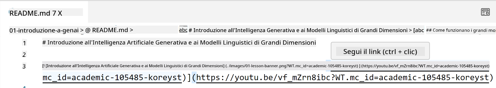
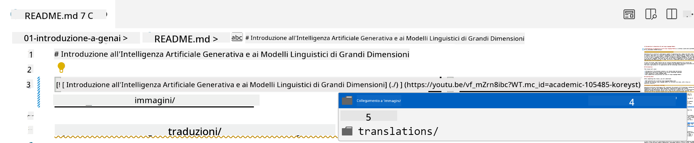
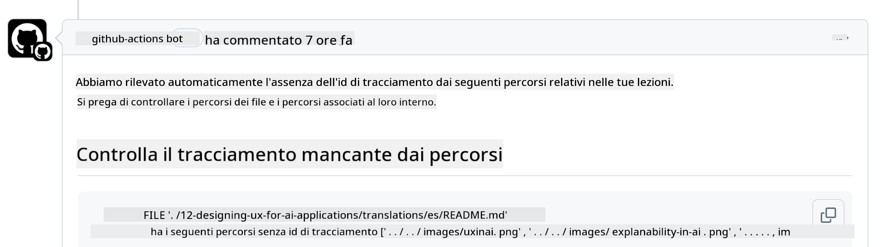

<!--
CO_OP_TRANSLATOR_METADATA:
{
  "original_hash": "57c41f2af71001a2cff9d8eb797cb843",
  "translation_date": "2025-07-09T05:54:17+00:00",
  "source_file": "CONTRIBUTING.md",
  "language_code": "it"
}
-->
# Contribuire

Questo progetto accoglie contributi e suggerimenti. La maggior parte dei contributi richiede di
accettare un Contributor License Agreement (CLA) che dichiara che hai il diritto di,
e effettivamente concedi, i diritti per utilizzare il tuo contributo. Per maggiori dettagli, visita
<https://cla.microsoft.com>.

> Importante: quando traduci testi in questo repository, assicurati di non utilizzare traduzioni automatiche. Verificheremo le traduzioni tramite la community, quindi ti preghiamo di offrire il tuo aiuto solo per le lingue in cui sei competente.

Quando invii una pull request, un CLA-bot determinerà automaticamente se devi
fornire un CLA e decorerà la PR di conseguenza (ad esempio, etichetta, commento). Segui semplicemente le
istruzioni fornite dal bot. Dovrai farlo solo una volta per tutti i repository che utilizzano il nostro CLA.

## Codice di Condotta

Questo progetto ha adottato il [Microsoft Open Source Code of Conduct](https://opensource.microsoft.com/codeofconduct/?WT.mc_id=academic-105485-koreyst).
Per maggiori informazioni leggi le [FAQ sul Codice di Condotta](https://opensource.microsoft.com/codeofconduct/faq/?WT.mc_id=academic-105485-koreyst) o contatta [opencode@microsoft.com](mailto:opencode@microsoft.com) per domande o commenti aggiuntivi.

## Domande o Problemi?

Ti preghiamo di non aprire issue su GitHub per domande di supporto generali, poiché la lista GitHub dovrebbe essere usata per richieste di funzionalità e segnalazioni di bug. In questo modo possiamo tracciare più facilmente problemi o bug reali nel codice e mantenere la discussione generale separata dal codice vero e proprio.

## Errori di battitura, problemi, bug e contributi

Quando invii modifiche al repository Generative AI for Beginners, segui queste raccomandazioni.

* Fai sempre un fork del repository sul tuo account prima di apportare modifiche
* Non combinare più modifiche in una sola pull request. Ad esempio, invia correzioni di bug e aggiornamenti della documentazione in PR separate
* Se la tua pull request mostra conflitti di merge, assicurati di aggiornare il tuo main locale per rispecchiare il main del repository prima di apportare modifiche
* Se stai inviando una traduzione, crea una sola PR per tutti i file tradotti, poiché non accettiamo traduzioni parziali del contenuto
* Se stai inviando una correzione di errori di battitura o documentazione, puoi combinare le modifiche in una singola PR quando appropriato

## Linee guida generali per la scrittura

- Assicurati che tutti i tuoi URL siano racchiusi tra parentesi quadre seguite da parentesi tonde senza spazi extra intorno o all’interno ``.
- Assicurati che ogni link relativo (cioè link ad altri file e cartelle nel repository) inizi con `./` riferendosi a un file o cartella nella directory di lavoro corrente o con `../` riferendosi a un file o cartella in una directory superiore.
- Assicurati che ogni link relativo (cioè link ad altri file e cartelle nel repository) abbia un ID di tracciamento (cioè `?` o `&` seguito da `wt.mc_id=` o `WT.mc_id=`) alla fine.
- Assicurati che ogni URL proveniente dai domini _github.com, microsoft.com, visualstudio.com, aka.ms, e azure.com_ abbia un ID di tracciamento (cioè `?` o `&` seguito da `wt.mc_id=` o `WT.mc_id=`) alla fine.
- Assicurati che i tuoi link non contengano localizzazioni specifiche per paese (cioè `/en-us/` o `/en/`).
- Assicurati che tutte le immagini siano archiviate nella cartella `./images`.
- Assicurati che le immagini abbiano nomi descrittivi usando caratteri inglesi, numeri e trattini nel nome dell’immagine.

## Workflow di GitHub

Quando invii una pull request, verranno attivati quattro workflow diversi per convalidare le regole precedenti.
Segui semplicemente le istruzioni elencate qui per superare i controlli del workflow.

- [Check Broken Relative Paths](../..)
- [Check Paths Have Tracking](../..)
- [Check URLs Have Tracking](../..)
- [Check URLs Don't Have Locale](../..)

### Check Broken Relative Paths

Questo workflow verifica che ogni percorso relativo nei tuoi file funzioni correttamente.
Questo repository è distribuito su GitHub pages, quindi devi fare molta attenzione quando digiti i link che collegano tutto per non indirizzare nessuno nel posto sbagliato.

Per assicurarti che i tuoi link funzionino correttamente, usa semplicemente VS code per verificarlo.

Ad esempio, quando passi il mouse su un link nei tuoi file, ti verrà chiesto di seguire il link premendo **ctrl + click**

Se clicchi su un link e non funziona localmente, sicuramente attiverà il workflow e non funzionerà su GitHub.

Per risolvere questo problema, prova a digitare il link con l’aiuto di VS code.

Quando digiti `./` o `../` VS code ti suggerirà di scegliere tra le opzioni disponibili in base a ciò che hai digitato.

Segui il percorso cliccando sul file o cartella desiderata e sarai sicuro che il tuo percorso non è rotto.

Una volta aggiunto il percorso relativo corretto, salva e invia le modifiche; il workflow verrà attivato di nuovo per verificare le modifiche.
Se superi il controllo, sei a posto.

### Check Paths Have Tracking

Questo workflow verifica che ogni percorso relativo abbia un tracciamento.
Questo repository è distribuito su GitHub pages, quindi dobbiamo tracciare il movimento tra i diversi file e cartelle.

Per assicurarti che i tuoi percorsi relativi abbiano il tracciamento, controlla semplicemente che alla fine del percorso ci sia il testo `?wt.mc_id=`.
Se è presente nei tuoi percorsi relativi, supererai questo controllo.

Altrimenti, potresti ricevere il seguente errore.

Per risolvere questo problema, apri il file indicato dal workflow e aggiungi l’ID di tracciamento alla fine dei percorsi relativi.

Una volta aggiunto l’ID di tracciamento, salva e invia le modifiche; il workflow verrà attivato di nuovo per verificare le modifiche.
Se superi il controllo, sei a posto.

### Check URLs Have Tracking

Questo workflow verifica che ogni URL web abbia un tracciamento.
Questo repository è accessibile a tutti, quindi devi assicurarti di tracciare gli accessi per sapere da dove proviene il traffico.

Per assicurarti che i tuoi URL abbiano il tracciamento, controlla semplicemente che alla fine dell’URL ci sia il testo `?wt.mc_id=`.
Se è presente nei tuoi URL, supererai questo controllo.

Altrimenti, potresti ricevere il seguente errore.

Per risolvere questo problema, apri il file indicato dal workflow e aggiungi l’ID di tracciamento alla fine degli URL.

Una volta aggiunto l’ID di tracciamento, salva e invia le modifiche; il workflow verrà attivato di nuovo per verificare le modifiche.
Se superi il controllo, sei a posto.

### Check URLs Don't Have Locale

Questo workflow verifica che nessun URL web contenga localizzazioni specifiche per paese.
Questo repository è accessibile a tutti nel mondo, quindi devi assicurarti di non includere la localizzazione del tuo paese negli URL.

Per assicurarti che i tuoi URL non contengano localizzazioni di paese, controlla semplicemente che non ci siano i testi `/en-us/` o `/en/` o altre localizzazioni linguistiche in qualsiasi punto dell’URL.
Se non sono presenti nei tuoi URL, supererai questo controllo.

Altrimenti, potresti ricevere il seguente errore.

Per risolvere questo problema, apri il file indicato dal workflow e rimuovi la localizzazione paese dagli URL.

Una volta rimossa la localizzazione paese, salva e invia le modifiche; il workflow verrà attivato di nuovo per verificare le modifiche.
Se superi il controllo, sei a posto.

Congratulazioni! Ti risponderemo il prima possibile con un feedback sul tuo contributo.

**Disclaimer**:  
Questo documento è stato tradotto utilizzando il servizio di traduzione automatica [Co-op Translator](https://github.com/Azure/co-op-translator). Pur impegnandoci per garantire l’accuratezza, si prega di notare che le traduzioni automatiche possono contenere errori o imprecisioni. Il documento originale nella sua lingua nativa deve essere considerato la fonte autorevole. Per informazioni critiche, si raccomanda una traduzione professionale effettuata da un umano. Non ci assumiamo alcuna responsabilità per eventuali malintesi o interpretazioni errate derivanti dall’uso di questa traduzione.