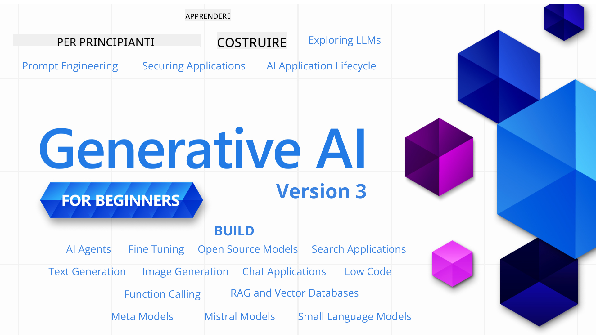

<!--
CO_OP_TRANSLATOR_METADATA:
{
  "original_hash": "c2ee25895ebbfa1a52868bb6eab686fc",
  "translation_date": "2025-05-19T11:41:22+00:00",
  "source_file": "README.md",
  "language_code": "it"
}
-->

### 21 lezioni che insegnano tutto ciò che devi sapere per iniziare a creare applicazioni di Generative AI

### 🌐 Supporto Multilingue

#### Supportato tramite GitHub Action (Automatico e Sempre Aggiornato)
[Francese](../fr/README.md) | [Spagnolo](../es/README.md) | [Tedesco](../de/README.md) | [Russo](../ru/README.md) | [Arabo](../ar/README.md) | [Persiano (Farsi)](../fa/README.md) | [Urdu](../ur/README.md) | [Cinese (Semplificato)](../zh/README.md) | [Cinese (Tradizionale, Macao)](../mo/README.md) | [Cinese (Tradizionale, Hong Kong)](../hk/README.md) | [Cinese (Tradizionale, Taiwan)](../tw/README.md) | [Giapponese](../ja/README.md) | [Coreano](../ko/README.md) | [Hindi](../hi/README.md) | [Bengalese](../bn/README.md) | [Marathi](../mr/README.md) | [Nepalese](../ne/README.md) | [Punjabi (Gurmukhi)](../pa/README.md) | [Portoghese (Portogallo)](../pt/README.md) | [Portoghese (Brasile)](../br/README.md) | [Italiano](./README.md) | [Polacco](../pl/README.md) | [Turco](../tr/README.md) | [Greco](../el/README.md) | [Tailandese](../th/README.md) | [Svedese](../sv/README.md) | [Danese](../da/README.md) | [Norvegese](../no/README.md) | [Finlandese](../fi/README.md) | [Olandese](../nl/README.md) | [Ebraico](../he/README.md) | [Vietnamita](../vi/README.md) | [Indonesiano](../id/README.md) | [Malese](../ms/README.md) | [Tagalog (Filippino)](../tl/README.md) | [Swahili](../sw/README.md) | [Ungherese](../hu/README.md) | [Ceco](../cs/README.md) | [Slovacco](../sk/README.md) | [Rumeno](../ro/README.md) | [Bulgaro](../bg/README.md) | [Serbo (Cirillico)](../sr/README.md) | [Croato](../hr/README.md) | [Sloveno](../sl/README.md)
# Intelligenza Artificiale Generativa per Principianti (Versione 3) - Un Corso

Impara i fondamenti per costruire applicazioni di Intelligenza Artificiale Generativa con il nostro corso completo di 21 lezioni offerto dai Microsoft Cloud Advocates.

## 🌱 Iniziare

Questo corso comprende 21 lezioni. Ogni lezione tratta un argomento specifico, quindi puoi iniziare da dove preferisci!

Le lezioni sono etichettate come lezioni "Impara", che spiegano un concetto di IA Generativa, o lezioni "Costruisci", che illustrano un concetto e esempi di codice sia in **Python** che **TypeScript** quando possibile.

Per gli sviluppatori .NET, consulta [Intelligenza Artificiale Generativa per Principianti (Edizione .NET)](https://github.com/microsoft/Generative-AI-for-beginners-dotnet?WT.mc_id=academic-105485-koreyst)!

Ogni lezione include anche una sezione "Continua a Imparare" con strumenti di apprendimento aggiuntivi.

## Cosa Ti Serve
### Per eseguire il codice di questo corso, puoi utilizzare: 
 - [Azure OpenAI Service](https://aka.ms/genai-beginners/azure-open-ai?WT.mc_id=academic-105485-koreyst) - **Lezioni:** "aoai-assignment"
 - [GitHub Marketplace Model Catalog](https://aka.ms/genai-beginners/gh-models?WT.mc_id=academic-105485-koreyst) - **Lezioni:** "githubmodels"
 - [OpenAI API](https://aka.ms/genai-beginners/open-ai?WT.mc_id=academic-105485-koreyst) - **Lezioni:** "oai-assignment" 
   
- È utile avere una conoscenza di base di Python o TypeScript - \*Per i principianti assoluti, consulta questi corsi di [Python](https://aka.ms/genai-beginners/python?WT.mc_id=academic-105485-koreyst) e [TypeScript](https://aka.ms/genai-beginners/typescript?WT.mc_id=academic-105485-koreyst)
- Un account GitHub per [fare il fork di questo intero repository](https://aka.ms/genai-beginners/github?WT.mc_id=academic-105485-koreyst) sul tuo account GitHub

Abbiamo creato una lezione di **[Configurazione del Corso](./00-course-setup/README.md?WT.mc_id=academic-105485-koreyst)** per aiutarti a configurare il tuo ambiente di sviluppo.

Non dimenticare di [aggiungere una stella (🌟) a questo repository](https://docs.github.com/en/get-started/exploring-projects-on-github/saving-repositories-with-stars?WT.mc_id=academic-105485-koreyst) per trovarlo più facilmente in seguito.

## 🧠 Pronto per il Deploy?

Se cerchi esempi di codice più avanzati, dai un'occhiata alla nostra [collezione di Esempi di Codice di Intelligenza Artificiale Generativa](https://aka.ms/genai-beg-code?WT.mc_id=academic-105485-koreyst) sia in **Python** che **TypeScript**.

## 🗣️ Incontra Altri Studenti, Ottieni Supporto

Unisciti al nostro [server ufficiale Discord di Azure AI Foundry](https://aka.ms/genai-discord?WT.mc_id=academic-105485-koreyst) per incontrare e fare networking con altri studenti che seguono questo corso e ottenere supporto.

Fai domande o condividi feedback sui prodotti nel nostro [Forum degli Sviluppatori di Azure AI Foundry](https://aka.ms/azureaifoundry/forum) su Github.

## 🚀 Stai Costruendo una Startup?

Iscriviti a [Microsoft for Startups Founders Hub](https://aka.ms/genai-foundershub?WT.mc_id=academic-105485-koreyst) per ricevere **crediti OpenAI gratuiti** e fino a **$150k in crediti Azure per accedere ai modelli OpenAI attraverso i Servizi Azure OpenAI**.

## 🙏 Vuoi aiutare?

Hai suggerimenti o hai trovato errori di ortografia o codice? [Apri un problema](https://github.com/microsoft/generative-ai-for-beginners/issues?WT.mc_id=academic-105485-koreyst) o [Crea una pull request](https://github.com/microsoft/generative-ai-for-beginners/pulls?WT.mc_id=academic-105485-koreyst)

## 📂 Ogni lezione include:

- Un breve video introduttivo sull'argomento
- Una lezione scritta situata nel README
- Esempi di codice Python e TypeScript che supportano Azure OpenAI e OpenAI API
- Link a risorse extra per continuare il tuo apprendimento

## 🗃️ Lezioni

| #   | **Link alla Lezione**                                                                                                                            | **Descrizione**                                                                                  | **Video**                                                                     | **Apprendimento Extra**                                                          |
| --- | ------------------------------------------------------------------------------------------------------------------------------------------------ | ------------------------------------------------------------------------------------------------ | ----------------------------------------------------------------------------- | -------------------------------------------------------------------------------- |
| 00  | [Configurazione del Corso](./00-course-setup/README.md?WT.mc_id=academic-105485-koreyst)                                                         | **Impara:** Come Configurare il Tuo Ambiente di Sviluppo                                         | Video in Arrivo                                                               | [Scopri di più](https://aka.ms/genai-collection?WT.mc_id=academic-105485-koreyst) |
| 01  | [Introduzione all'IA Generativa e ai LLM](./01-introduction-to-genai/README.md?WT.mc_id=academic-105485-koreyst)                                 | **Impara:** Comprendere cosa sia l'IA Generativa e come funzionano i Modelli di Linguaggio Ampio (LLM). | [Video](https://aka.ms/gen-ai-lesson-1-gh?WT.mc_id=academic-105485-koreyst)  | [Scopri di più](https://aka.ms/genai-collection?WT.mc_id=academic-105485-koreyst) |
| 02  | [Esplorare e confrontare diversi LLM](./02-exploring-and-comparing-different-llms/README.md?WT.mc_id=academic-105485-koreyst)                    | **Impara:** Come selezionare il modello giusto per il tuo caso d'uso                               | [Video](https://aka.ms/gen-ai-lesson2-gh?WT.mc_id=academic-105485-koreyst)   | [Scopri di più](https://aka.ms/genai-collection?WT.mc_id=academic-105485-koreyst) |
| 03  | [Utilizzare l'IA Generativa in modo Responsabile](./03-using-generative-ai-responsibly/README.md?WT.mc_id=academic-105485-koreyst)               | **Impara:** Come costruire applicazioni di IA Generativa in modo responsabile                     | [Video](https://aka.ms/gen-ai-lesson3-gh?WT.mc_id=academic-105485-koreyst)   | [Scopri di più](https://aka.ms/genai-collection?WT.mc_id=academic-105485-koreyst) |
| 04  | [Comprendere i Fondamenti dell'Ingegneria del Prompt](./04-prompt-engineering-fundamentals/README.md?WT.mc_id=academic-105485-koreyst)           | **Impara:** Pratiche migliori per l'Ingegneria del Prompt                                         | [Video](https://aka.ms/gen-ai-lesson4-gh?WT.mc_id=academic-105485-koreyst)   | [Scopri di più](https://aka.ms/genai-collection?WT.mc_id=academic-105485-koreyst) |
| 05  | [Creare Prompt Avanzati](./05-advanced-prompts/README.md?WT.mc_id=academic-105485-koreyst)                                                | **Impara:** Come applicare tecniche di ingegneria dei prompt che migliorano il risultato dei tuoi prompt. | [Video](https://aka.ms/gen-ai-lesson5-gh?WT.mc_id=academic-105485-koreyst)  | [Scopri di più](https://aka.ms/genai-collection?WT.mc_id=academic-105485-koreyst) |
| 06  | [Costruire Applicazioni di Generazione Testo](./06-text-generation-apps/README.md?WT.mc_id=academic-105485-koreyst)                                | **Costruisci:** Un'app di generazione testo utilizzando Azure OpenAI / OpenAI API                                | [Video](https://aka.ms/gen-ai-lesson6-gh?WT.mc_id=academic-105485-koreyst)  | [Scopri di più](https://aka.ms/genai-collection?WT.mc_id=academic-105485-koreyst) |
| 07  | [Costruire Applicazioni di Chat](./07-building-chat-applications/README.md?WT.mc_id=academic-105485-koreyst)                                     | **Costruisci:** Tecniche per costruire e integrare applicazioni di chat in modo efficiente.               | [Video](https://aka.ms/gen-ai-lessons7-gh?WT.mc_id=academic-105485-koreyst) | [Scopri di più](https://aka.ms/genai-collection?WT.mc_id=academic-105485-koreyst) |
| 08  | [Costruire Applicazioni di Ricerca con Database a Vettori](./08-building-search-applications/README.md?WT.mc_id=academic-105485-koreyst)                        | **Costruisci:** Un'applicazione di ricerca che utilizza gli Embeddings per cercare dati.                        | [Video](https://aka.ms/gen-ai-lesson8-gh?WT.mc_id=academic-105485-koreyst)  | [Scopri di più](https://aka.ms/genai-collection?WT.mc_id=academic-105485-koreyst) |
| 09  | [Costruire Applicazioni di Generazione Immagini](./09-building-image-applications/README.md?WT.mc_id=academic-105485-koreyst)                        | **Costruisci:** Un'applicazione di generazione immagini                                                       | [Video](https://aka.ms/gen-ai-lesson9-gh?WT.mc_id=academic-105485-koreyst)  | [Scopri di più](https://aka.ms/genai-collection?WT.mc_id=academic-105485-koreyst) |
| 10  | [Costruire Applicazioni AI con Basso Codice](./10-building-low-code-ai-applications/README.md?WT.mc_id=academic-105485-koreyst)                       | **Costruisci:** Un'applicazione di AI Generativa utilizzando strumenti Low Code                                     | [Video](https://aka.ms/gen-ai-lesson10-gh?WT.mc_id=academic-105485-koreyst) | [Scopri di più](https://aka.ms/genai-collection?WT.mc_id=academic-105485-koreyst) |
| 11  | [Integrare Applicazioni Esterne con Chiamata di Funzione](./11-integrating-with-function-calling/README.md?WT.mc_id=academic-105485-koreyst) | **Costruisci:** Cos'è la chiamata di funzione e i suoi casi d'uso per le applicazioni                          | [Video](https://aka.ms/gen-ai-lesson11-gh?WT.mc_id=academic-105485-koreyst) | [Scopri di più](https://aka.ms/genai-collection?WT.mc_id=academic-105485-koreyst) |
| 12  | [Progettare UX per Applicazioni AI](./12-designing-ux-for-ai-applications/README.md?WT.mc_id=academic-105485-koreyst)                         | **Impara:** Come applicare principi di design UX quando si sviluppano Applicazioni AI Generative         | [Video](https://aka.ms/gen-ai-lesson12-gh?WT.mc_id=academic-105485-koreyst) | [Scopri di più](https://aka.ms/genai-collection?WT.mc_id=academic-105485-koreyst) |
| 13  | [Mettere in Sicurezza le Tue Applicazioni AI Generative](./13-securing-ai-applications/README.md?WT.mc_id=academic-105485-koreyst)                         | **Impara:** Le minacce e i rischi per i sistemi AI e i metodi per mettere in sicurezza questi sistemi.             | [Video](https://aka.ms/gen-ai-lesson13-gh?WT.mc_id=academic-105485-koreyst) | [Scopri di più](https://aka.ms/genai-collection?WT.mc_id=academic-105485-koreyst) |
| 14  | [Il Ciclo di Vita delle Applicazioni AI Generative](./14-the-generative-ai-application-lifecycle/README.md?WT.mc_id=academic-105485-koreyst)           | **Impara:** Gli strumenti e le metriche per gestire il Ciclo di Vita di LLM e LLMOps                         | [Video](https://aka.ms/gen-ai-lesson14-gh?WT.mc_id=academic-105485-koreyst) | [Scopri di più](https://aka.ms/genai-collection?WT.mc_id=academic-105485-koreyst) |
| 15  | [Generazione aumentata dal recupero (RAG) e database vettoriali](./15-rag-and-vector-databases/README.md?WT.mc_id=academic-105485-koreyst) | **Costruisci:** Un'applicazione utilizzando un framework RAG per recuperare embeddings da un database vettoriale | [Video](https://aka.ms/gen-ai-lesson15-gh?WT.mc_id=academic-105485-koreyst) | [Scopri di più](https://aka.ms/genai-collection?WT.mc_id=academic-105485-koreyst) |
| 16  | [Modelli open source e Hugging Face](./16-open-source-models/README.md?WT.mc_id=academic-105485-koreyst) | **Costruisci:** Un'applicazione utilizzando modelli open source disponibili su Hugging Face | [Video](https://aka.ms/gen-ai-lesson16-gh?WT.mc_id=academic-105485-koreyst) | [Scopri di più](https://aka.ms/genai-collection?WT.mc_id=academic-105485-koreyst) |
| 17  | [Agenti AI](./17-ai-agents/README.md?WT.mc_id=academic-105485-koreyst) | **Costruisci:** Un'applicazione utilizzando un framework di agenti AI | [Video](https://aka.ms/gen-ai-lesson17-gh?WT.mc_id=academic-105485-koreyst) | [Scopri di più](https://aka.ms/genai-collection?WT.mc_id=academic-105485-koreyst) |
| 18  | [Fine-Tuning di LLMs](./18-fine-tuning/README.md?WT.mc_id=academic-105485-koreyst) | **Impara:** Cosa, perché e come del fine-tuning di LLMs | [Video](https://aka.ms/gen-ai-lesson18-gh?WT.mc_id=academic-105485-koreyst) | [Scopri di più](https://aka.ms/genai-collection?WT.mc_id=academic-105485-koreyst) |
| 19  | [Costruire con SLMs](./19-slm/README.md?WT.mc_id=academic-105485-koreyst) | **Impara:** I vantaggi di costruire con modelli di linguaggio piccoli | Video in arrivo | [Scopri di più](https://aka.ms/genai-collection?WT.mc_id=academic-105485-koreyst) |
| 20  | [Costruire con modelli Mistral](./20-mistral/README.md?WT.mc_id=academic-105485-koreyst) | **Impara:** Le caratteristiche e le differenze dei modelli della famiglia Mistral | Video in arrivo | [Scopri di più](https://aka.ms/genai-collection?WT.mc_id=academic-105485-koreyst) |
| 21  | [Costruire con modelli Meta](./21-meta/README.md?WT.mc_id=academic-105485-koreyst) | **Impara:** Le caratteristiche e le differenze dei modelli della famiglia Meta | Video in arrivo | [Scopri di più](https://aka.ms/genai-collection?WT.mc_id=academic-105485-koreyst) |

### 🌟 Ringraziamenti speciali

Un ringraziamento speciale a [**John Aziz**](https://www.linkedin.com/in/john0isaac/) per aver creato tutte le GitHub Actions e i flussi di lavoro.

[**Bernhard Merkle**](https://www.linkedin.com/in/bernhard-merkle-738b73/) per aver fornito contributi chiave a ogni lezione per migliorare l'esperienza del discente e del codice.

## 🎒 Altri corsi

Il nostro team produce altri corsi! Dai un'occhiata:

- [**NUOVO** Agenti AI per principianti](https://github.com/microsoft/ai-agents-for-beginners?WT.mc_id=academic-105485-koreyst)
- [**NUOVO** AI generativa per principianti usando .NET](https://github.com/microsoft/Generative-AI-for-beginners-dotnet?WT.mc_id=academic-105485-koreyst)
- [**NUOVO** AI generativa per principianti usando JavaScript](https://aka.ms/genai-js-course?WT.mc_id=academic-105485-koreyst)
- [ML per principianti](https://aka.ms/ml-beginners?WT.mc_id=academic-105485-koreyst)
- [Data Science per principianti](https://aka.ms/datascience-beginners?WT.mc_id=academic-105485-koreyst)
- [AI per principianti](https://aka.ms/ai-beginners?WT.mc_id=academic-105485-koreyst)
- [Cybersecurity per principianti](https://github.com/microsoft/Security-101??WT.mc_id=academic-96948-sayoung)
- [Sviluppo web per principianti](https://aka.ms/webdev-beginners?WT.mc_id=academic-105485-koreyst)
- [IoT per principianti](https://aka.ms/iot-beginners?WT.mc_id=academic-105485-koreyst)
- [Sviluppo XR per principianti](https://github.com/microsoft/xr-development-for-beginners?WT.mc_id=academic-105485-koreyst)
- [Padroneggiare GitHub Copilot per la programmazione in coppia con l'IA](https://aka.ms/GitHubCopilotAI?WT.mc_id=academic-105485-koreyst)
- [Padroneggiare GitHub Copilot per sviluppatori C#/.NET](https://github.com/microsoft/mastering-github-copilot-for-dotnet-csharp-developers?WT.mc_id=academic-105485-koreyst)
- [Scegli la tua avventura con Copilot](https://github.com/microsoft/CopilotAdventures?WT.mc_id=academic-105485-koreyst)

**Disclaimer**:  
Questo documento è stato tradotto utilizzando il servizio di traduzione AI [Co-op Translator](https://github.com/Azure/co-op-translator). Sebbene ci impegniamo per l'accuratezza, si prega di essere consapevoli che le traduzioni automatiche possono contenere errori o imprecisioni. Il documento originale nella sua lingua madre dovrebbe essere considerato la fonte autorevole. Per informazioni critiche, è consigliata una traduzione professionale umana. Non siamo responsabili per eventuali incomprensioni o interpretazioni errate derivanti dall'uso di questa traduzione.