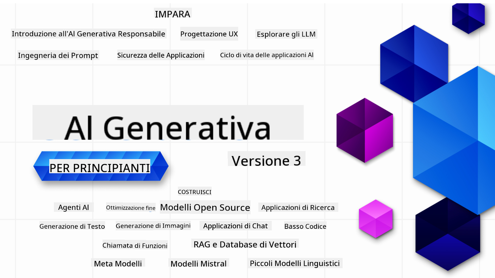

<!--
CO_OP_TRANSLATOR_METADATA:
{
  "original_hash": "5740c9b7fcb6919da1ea4df93475f331",
  "translation_date": "2025-07-09T06:30:55+00:00",
  "source_file": "README.md",
  "language_code": "it"
}
-->

### 21 lezioni che insegnano tutto ciò che devi sapere per iniziare a costruire applicazioni di Generative AI

### 🌐 Supporto Multilingue

#### Supportato tramite GitHub Action (Automatizzato e Sempre Aggiornato)

[Francese](../fr/README.md) | [Spagnolo](../es/README.md) | [Tedesco](../de/README.md) | [Russo](../ru/README.md) | [Arabo](../ar/README.md) | [Persiano (Farsi)](../fa/README.md) | [Urdu](../ur/README.md) | [Cinese (Semplificato)](../zh/README.md) | [Cinese (Tradizionale, Macao)](../mo/README.md) | [Cinese (Tradizionale, Hong Kong)](../hk/README.md) | [Cinese (Tradizionale, Taiwan)](../tw/README.md) | [Giapponese](../ja/README.md) | [Coreano](../ko/README.md) | [Hindi](../hi/README.md) | [Bengalese](../bn/README.md) | [Marathi](../mr/README.md) | [Nepalese](../ne/README.md) | [Punjabi (Gurmukhi)](../pa/README.md) | [Portoghese (Portogallo)](../pt/README.md) | [Portoghese (Brasile)](../br/README.md) | [Italiano](./README.md) | [Polacco](../pl/README.md) | [Turco](../tr/README.md) | [Greco](../el/README.md) | [Thailandese](../th/README.md) | [Svedese](../sv/README.md) | [Danese](../da/README.md) | [Norvegese](../no/README.md) | [Finlandese](../fi/README.md) | [Olandese](../nl/README.md) | [Ebraico](../he/README.md) | [Vietnamita](../vi/README.md) | [Indonesiano](../id/README.md) | [Malese](../ms/README.md) | [Tagalog (Filippino)](../tl/README.md) | [Swahili](../sw/README.md) | [Ungherese](../hu/README.md) | [Ceco](../cs/README.md) | [Slovacco](../sk/README.md) | [Rumeno](../ro/README.md) | [Bulgaro](../bg/README.md) | [Serbo (Cirillico)](../sr/README.md) | [Croato](../hr/README.md) | [Sloveno](../sl/README.md) | [Ucraino](../uk/README.md) | [Birmano (Myanmar)](../my/README.md)

# Generative AI per Principianti (Versione 3) - Un Corso

Impara le basi per costruire applicazioni di Generative AI con il nostro corso completo di 21 lezioni creato dai Microsoft Cloud Advocates.

## 🌱 Iniziare

Questo corso comprende 21 lezioni. Ogni lezione tratta un argomento specifico, quindi inizia da dove preferisci!

Le lezioni sono etichettate come "Learn" per spiegare un concetto di Generative AI o "Build" che spiegano un concetto e mostrano esempi di codice sia in **Python** che in **TypeScript** quando possibile.

Per gli sviluppatori .NET, dai un’occhiata a [Generative AI for Beginners (.NET Edition)](https://github.com/microsoft/Generative-AI-for-beginners-dotnet?WT.mc_id=academic-105485-koreyst)!

Ogni lezione include anche una sezione "Keep Learning" con ulteriori strumenti di apprendimento.

## Cosa ti serve
### Per eseguire il codice di questo corso, puoi usare:
 - [Azure OpenAI Service](https://aka.ms/genai-beginners/azure-open-ai?WT.mc_id=academic-105485-koreyst) - **Lezioni:** "aoai-assignment"
 - [GitHub Marketplace Model Catalog](https://aka.ms/genai-beginners/gh-models?WT.mc_id=academic-105485-koreyst) - **Lezioni:** "githubmodels"
 - [OpenAI API](https://aka.ms/genai-beginners/open-ai?WT.mc_id=academic-105485-koreyst) - **Lezioni:** "oai-assignment" 
   
- Conoscenze di base di Python o TypeScript sono utili - \*Per principianti assoluti dai un’occhiata a questi corsi di [Python](https://aka.ms/genai-beginners/python?WT.mc_id=academic-105485-koreyst) e [TypeScript](https://aka.ms/genai-beginners/typescript?WT.mc_id=academic-105485-koreyst)
- Un account GitHub per [fare il fork di questo intero repo](https://aka.ms/genai-beginners/github?WT.mc_id=academic-105485-koreyst) sul tuo account GitHub

Abbiamo creato una lezione **[Course Setup](./00-course-setup/README.md?WT.mc_id=academic-105485-koreyst)** per aiutarti a configurare il tuo ambiente di sviluppo.

Non dimenticare di [mettere una stella (🌟) a questo repo](https://docs.github.com/en/get-started/exploring-projects-on-github/saving-repositories-with-stars?WT.mc_id=academic-105485-koreyst) per trovarlo più facilmente in futuro.

## 🧠 Pronto per il Deployment?

Se cerchi esempi di codice più avanzati, dai un’occhiata alla nostra [collezione di esempi di codice Generative AI](https://aka.ms/genai-beg-code?WT.mc_id=academic-105485-koreyst) sia in **Python** che in **TypeScript**.

## 🗣️ Incontra altri studenti, ricevi supporto

Unisciti al nostro [server Discord ufficiale Azure AI Foundry](https://aka.ms/genai-discord?WT.mc_id=academic-105485-koreyst) per incontrare e fare networking con altri studenti che seguono questo corso e ricevere supporto.

Fai domande o condividi feedback sul prodotto nel nostro [Azure AI Foundry Developer Forum](https://aka.ms/azureaifoundry/forum) su Github.

## 🚀 Stai costruendo una startup?

Iscriviti a [Microsoft for Startups Founders Hub](https://aka.ms/genai-foundershub?WT.mc_id=academic-105485-koreyst) per ricevere **crediti OpenAI gratuiti** e fino a **$150k in crediti Azure per accedere ai modelli OpenAI tramite Azure OpenAI Services**.

## 🙏 Vuoi aiutare?

Hai suggerimenti o hai trovato errori di ortografia o di codice? [Apri un issue](https://github.com/microsoft/generative-ai-for-beginners/issues?WT.mc_id=academic-105485-koreyst) o [crea una pull request](https://github.com/microsoft/generative-ai-for-beginners/pulls?WT.mc_id=academic-105485-koreyst)

## 📂 Ogni lezione include:

- Una breve introduzione video all’argomento
- Una lezione scritta nel README
- Esempi di codice Python e TypeScript che supportano Azure OpenAI e OpenAI API
- Link a risorse extra per continuare ad imparare

## 🗃️ Lezioni

| #   | **Link alla Lezione**                                                                                                                        | **Descrizione**                                                                                 | **Video**                                                                   | **Apprendimento Extra**                                                         |
| --- | -------------------------------------------------------------------------------------------------------------------------------------------- | ----------------------------------------------------------------------------------------------- | --------------------------------------------------------------------------- | ------------------------------------------------------------------------------ |
| 00  | [Course Setup](./00-course-setup/README.md?WT.mc_id=academic-105485-koreyst)                                                                 | **Learn:** Come configurare il tuo ambiente di sviluppo                                        | Video in arrivo                                                             | [Scopri di più](https://aka.ms/genai-collection?WT.mc_id=academic-105485-koreyst) |
| 01  | [Introduzione a Generative AI e LLMs](./01-introduction-to-genai/README.md?WT.mc_id=academic-105485-koreyst)                                  | **Learn:** Comprendere cos’è la Generative AI e come funzionano i Large Language Models (LLMs)  | [Video](https://aka.ms/gen-ai-lesson-1-gh?WT.mc_id=academic-105485-koreyst) | [Scopri di più](https://aka.ms/genai-collection?WT.mc_id=academic-105485-koreyst) |
| 02  | [Esplorare e confrontare diversi LLMs](./02-exploring-and-comparing-different-llms/README.md?WT.mc_id=academic-105485-koreyst)               | **Learn:** Come scegliere il modello giusto per il tuo caso d’uso                              | [Video](https://aka.ms/gen-ai-lesson2-gh?WT.mc_id=academic-105485-koreyst)  | [Scopri di più](https://aka.ms/genai-collection?WT.mc_id=academic-105485-koreyst) |
| 03  | [Usare Generative AI in modo responsabile](./03-using-generative-ai-responsibly/README.md?WT.mc_id=academic-105485-koreyst)                     | **Learn:** Come costruire applicazioni di Generative AI in modo responsabile                   | [Video](https://aka.ms/gen-ai-lesson3-gh?WT.mc_id=academic-105485-koreyst)  | [Scopri di più](https://aka.ms/genai-collection?WT.mc_id=academic-105485-koreyst) |
| 04  | [Fondamenti di Prompt Engineering](./04-prompt-engineering-fundamentals/README.md?WT.mc_id=academic-105485-koreyst)                           | **Learn:** Best practice pratiche di Prompt Engineering                                       | [Video](https://aka.ms/gen-ai-lesson4-gh?WT.mc_id=academic-105485-koreyst)  | [Scopri di più](https://aka.ms/genai-collection?WT.mc_id=academic-105485-koreyst) |
| 05  | [Creare Prompt Avanzati](./05-advanced-prompts/README.md?WT.mc_id=academic-105485-koreyst)                                                    | **Learn:** Come applicare tecniche di prompt engineering che migliorano i risultati dei tuoi prompt | [Video](https://aka.ms/gen-ai-lesson5-gh?WT.mc_id=academic-105485-koreyst)  | [Scopri di più](https://aka.ms/genai-collection?WT.mc_id=academic-105485-koreyst) |
| 06  | [Creare applicazioni di generazione di testo](./06-text-generation-apps/README.md?WT.mc_id=academic-105485-koreyst)                                | **Costruisci:** Un'app di generazione di testo usando Azure OpenAI / OpenAI API                                | [Video](https://aka.ms/gen-ai-lesson6-gh?WT.mc_id=academic-105485-koreyst)  | [Scopri di più](https://aka.ms/genai-collection?WT.mc_id=academic-105485-koreyst) |
| 07  | [Creare applicazioni di chat](./07-building-chat-applications/README.md?WT.mc_id=academic-105485-koreyst)                                     | **Costruisci:** Tecniche per costruire e integrare applicazioni di chat in modo efficiente.               | [Video](https://aka.ms/gen-ai-lessons7-gh?WT.mc_id=academic-105485-koreyst) | [Scopri di più](https://aka.ms/genai-collection?WT.mc_id=academic-105485-koreyst) |
| 08  | [Creare app di ricerca con database vettoriali](./08-building-search-applications/README.md?WT.mc_id=academic-105485-koreyst)                        | **Costruisci:** Un'applicazione di ricerca che utilizza Embeddings per cercare dati.                        | [Video](https://aka.ms/gen-ai-lesson8-gh?WT.mc_id=academic-105485-koreyst)  | [Scopri di più](https://aka.ms/genai-collection?WT.mc_id=academic-105485-koreyst) |
| 09  | [Creare applicazioni di generazione di immagini](./09-building-image-applications/README.md?WT.mc_id=academic-105485-koreyst)                        | **Costruisci:** Un'applicazione per la generazione di immagini                                                       | [Video](https://aka.ms/gen-ai-lesson9-gh?WT.mc_id=academic-105485-koreyst)  | [Scopri di più](https://aka.ms/genai-collection?WT.mc_id=academic-105485-koreyst) |
| 10  | [Creare applicazioni AI Low Code](./10-building-low-code-ai-applications/README.md?WT.mc_id=academic-105485-koreyst)                       | **Costruisci:** Un'applicazione di AI generativa usando strumenti Low Code                                     | [Video](https://aka.ms/gen-ai-lesson10-gh?WT.mc_id=academic-105485-koreyst) | [Scopri di più](https://aka.ms/genai-collection?WT.mc_id=academic-105485-koreyst) |
| 11  | [Integrare applicazioni esterne con Function Calling](./11-integrating-with-function-calling/README.md?WT.mc_id=academic-105485-koreyst) | **Costruisci:** Cos’è function calling e i suoi casi d’uso nelle applicazioni                          | [Video](https://aka.ms/gen-ai-lesson11-gh?WT.mc_id=academic-105485-koreyst) | [Scopri di più](https://aka.ms/genai-collection?WT.mc_id=academic-105485-koreyst) |
| 12  | [Progettare UX per applicazioni AI](./12-designing-ux-for-ai-applications/README.md?WT.mc_id=academic-105485-koreyst)                         | **Impara:** Come applicare i principi di design UX nello sviluppo di applicazioni di AI generativa         | [Video](https://aka.ms/gen-ai-lesson12-gh?WT.mc_id=academic-105485-koreyst) | [Scopri di più](https://aka.ms/genai-collection?WT.mc_id=academic-105485-koreyst) |
| 13  | [Mettere in sicurezza le tue applicazioni di AI generativa](./13-securing-ai-applications/README.md?WT.mc_id=academic-105485-koreyst)                         | **Impara:** Le minacce e i rischi per i sistemi AI e i metodi per proteggerli.             | [Video](https://aka.ms/gen-ai-lesson13-gh?WT.mc_id=academic-105485-koreyst) | [Scopri di più](https://aka.ms/genai-collection?WT.mc_id=academic-105485-koreyst) |
| 14  | [Il ciclo di vita delle applicazioni di AI generativa](./14-the-generative-ai-application-lifecycle/README.md?WT.mc_id=academic-105485-koreyst)           | **Impara:** Gli strumenti e le metriche per gestire il ciclo di vita LLM e LLMOps                         | [Video](https://aka.ms/gen-ai-lesson14-gh?WT.mc_id=academic-105485-koreyst) | [Scopri di più](https://aka.ms/genai-collection?WT.mc_id=academic-105485-koreyst) |
| 15  | [Retrieval Augmented Generation (RAG) e database vettoriali](./15-rag-and-vector-databases/README.md?WT.mc_id=academic-105485-koreyst)        | **Costruisci:** Un'applicazione che utilizza un framework RAG per recuperare embeddings da database vettoriali  | [Video](https://aka.ms/gen-ai-lesson15-gh?WT.mc_id=academic-105485-koreyst) | [Scopri di più](https://aka.ms/genai-collection?WT.mc_id=academic-105485-koreyst) |
| 16  | [Modelli open source e Hugging Face](./16-open-source-models/README.md?WT.mc_id=academic-105485-koreyst)                                    | **Costruisci:** Un'applicazione che utilizza modelli open source disponibili su Hugging Face                    | [Video](https://aka.ms/gen-ai-lesson16-gh?WT.mc_id=academic-105485-koreyst) | [Scopri di più](https://aka.ms/genai-collection?WT.mc_id=academic-105485-koreyst) |
| 17  | [Agenti AI](./17-ai-agents/README.md?WT.mc_id=academic-105485-koreyst)                                                                       | **Costruisci:** Un'applicazione che utilizza un framework di AI Agent                                           | [Video](https://aka.ms/gen-ai-lesson17-gh?WT.mc_id=academic-105485-koreyst) | [Scopri di più](https://aka.ms/genai-collection?WT.mc_id=academic-105485-koreyst) |
| 18  | [Fine-Tuning LLMs](./18-fine-tuning/README.md?WT.mc_id=academic-105485-koreyst)                                                              | **Impara:** Cosa, perché e come fare il fine-tuning dei LLM                                            | [Video](https://aka.ms/gen-ai-lesson18-gh?WT.mc_id=academic-105485-koreyst) | [Scopri di più](https://aka.ms/genai-collection?WT.mc_id=academic-105485-koreyst) |
| 19  | [Costruire con SLMs](./19-slm/README.md?WT.mc_id=academic-105485-koreyst)                                                              | **Impara:** I vantaggi di costruire con Small Language Models                                            | Video in arrivo | [Scopri di più](https://aka.ms/genai-collection?WT.mc_id=academic-105485-koreyst) |
| 20  | [Costruire con modelli Mistral](./20-mistral/README.md?WT.mc_id=academic-105485-koreyst)                                                              | **Impara:** Le caratteristiche e le differenze dei modelli della famiglia Mistral                                           | Video in arrivo | [Scopri di più](https://aka.ms/genai-collection?WT.mc_id=academic-105485-koreyst) |
| 21  | [Costruire con modelli Meta](./21-meta/README.md?WT.mc_id=academic-105485-koreyst)                                                              | **Impara:** Le caratteristiche e le differenze dei modelli della famiglia Meta                                           | Video in arrivo | [Scopri di più](https://aka.ms/genai-collection?WT.mc_id=academic-105485-koreyst) |

### 🌟 Ringraziamenti speciali

Un ringraziamento speciale a [**John Aziz**](https://www.linkedin.com/in/john0isaac/) per aver creato tutte le GitHub Actions e i workflow

[**Bernhard Merkle**](https://www.linkedin.com/in/bernhard-merkle-738b73/) per i contributi chiave in ogni lezione, migliorando l’esperienza di apprendimento e del codice.

## 🎒 Altri corsi

Il nostro team produce altri corsi! Dai un’occhiata a:

- [**NUOVO** Model Context Protocol per principianti](https://github.com/microsoft/mcp-for-beginners?WT.mc_id=academic-105485-koreyst)
- [Agenti AI per principianti](https://github.com/microsoft/ai-agents-for-beginners?WT.mc_id=academic-105485-koreyst)
- [AI generativa per principianti con .NET](https://github.com/microsoft/Generative-AI-for-beginners-dotnet?WT.mc_id=academic-105485-koreyst)
- [AI generativa per principianti con JavaScript](https://aka.ms/genai-js-course?WT.mc_id=academic-105485-koreyst)
- [ML per principianti](https://aka.ms/ml-beginners?WT.mc_id=academic-105485-koreyst)
- [Data Science per principianti](https://aka.ms/datascience-beginners?WT.mc_id=academic-105485-koreyst)
- [AI per principianti](https://aka.ms/ai-beginners?WT.mc_id=academic-105485-koreyst)
- [Cybersecurity per principianti](https://github.com/microsoft/Security-101??WT.mc_id=academic-96948-sayoung)
- [Sviluppo Web per principianti](https://aka.ms/webdev-beginners?WT.mc_id=academic-105485-koreyst)
- [IoT per principianti](https://aka.ms/iot-beginners?WT.mc_id=academic-105485-koreyst)
- [Sviluppo XR per principianti](https://github.com/microsoft/xr-development-for-beginners?WT.mc_id=academic-105485-koreyst)
- [Mastering GitHub Copilot per programmazione AI in coppia](https://aka.ms/GitHubCopilotAI?WT.mc_id=academic-105485-koreyst)
- [Mastering GitHub Copilot per sviluppatori C#/.NET](https://github.com/microsoft/mastering-github-copilot-for-dotnet-csharp-developers?WT.mc_id=academic-105485-koreyst)
- [Scegli la tua avventura con Copilot](https://github.com/microsoft/CopilotAdventures?WT.mc_id=academic-105485-koreyst)

**Disclaimer**:  
Questo documento è stato tradotto utilizzando il servizio di traduzione automatica [Co-op Translator](https://github.com/Azure/co-op-translator). Pur impegnandoci per garantire l’accuratezza, si prega di notare che le traduzioni automatiche possono contenere errori o imprecisioni. Il documento originale nella sua lingua nativa deve essere considerato la fonte autorevole. Per informazioni critiche, si raccomanda una traduzione professionale effettuata da un umano. Non ci assumiamo alcuna responsabilità per eventuali malintesi o interpretazioni errate derivanti dall’uso di questa traduzione.