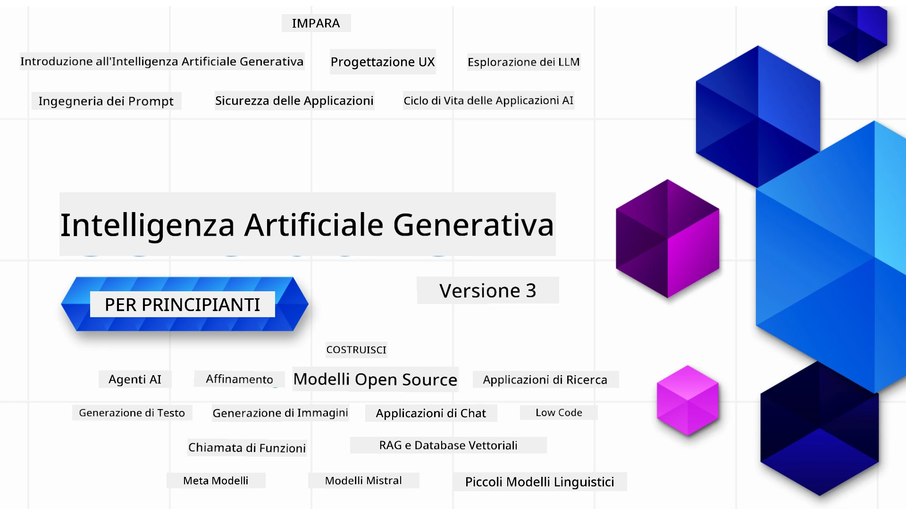

### 21 Lezioni che insegnano tutto ciò che devi sapere per iniziare a costruire applicazioni di IA Generativa

[](https://github.com/microsoft/Generative-AI-For-Beginners/blob/master/LICENSE?WT.mc_id=academic-105485-koreyst)
[](https://GitHub.com/microsoft/Generative-AI-For-Beginners/graphs/contributors/?WT.mc_id=academic-105485-koreyst)
[](https://GitHub.com/microsoft/Generative-AI-For-Beginners/issues/?WT.mc_id=academic-105485-koreyst)
[](https://GitHub.com/microsoft/Generative-AI-For-Beginners/pulls/?WT.mc_id=academic-105485-koreyst)
[](http://makeapullrequest.com?WT.mc_id=academic-105485-koreyst)

[](https://GitHub.com/microsoft/Generative-AI-For-Beginners/watchers/?WT.mc_id=academic-105485-koreyst)
[](https://GitHub.com/microsoft/Generative-AI-For-Beginners/network/?WT.mc_id=academic-105485-koreyst)
[](https://GitHub.com/microsoft/Generative-AI-For-Beginners/stargazers/?WT.mc_id=academic-105485-koreyst)

[](https://discord.gg/nTYy5BXMWG)

### 🌐 Supporto Multilingue

#### Supportato tramite GitHub Action (Automatizzato e Sempre Aggiornato)

<!-- CO-OP TRANSLATOR LANGUAGES TABLE START -->
[Arabo](../ar/README.md) | [Bengalese](../bn/README.md) | [Bulgaro](../bg/README.md) | [Birmano (Myanmar)](../my/README.md) | [Cinese (Semplificato)](../zh-CN/README.md) | [Cinese (Tradizionale, Hong Kong)](../zh-HK/README.md) | [Cinese (Tradizionale, Macao)](../zh-MO/README.md) | [Cinese (Tradizionale, Taiwan)](../zh-TW/README.md) | [Croato](../hr/README.md) | [Ceco](../cs/README.md) | [Danese](../da/README.md) | [Olandese](../nl/README.md) | [Estone](../et/README.md) | [Finlandese](../fi/README.md) | [Francese](../fr/README.md) | [Tedesco](../de/README.md) | [Greco](../el/README.md) | [Ebraico](../he/README.md) | [Hindi](../hi/README.md) | [Ungherese](../hu/README.md) | [Indonesiano](../id/README.md) | [Italiano](./README.md) | [Giapponese](../ja/README.md) | [Kannada](../kn/README.md) | [Khmer](../km/README.md) | [Coreano](../ko/README.md) | [Lituano](../lt/README.md) | [Malese](../ms/README.md) | [Malayalam](../ml/README.md) | [Marathi](../mr/README.md) | [Nepalese](../ne/README.md) | [Pidgin Nigeriano](../pcm/README.md) | [Norvegese](../no/README.md) | [Persiano (Farsi)](../fa/README.md) | [Polacco](../pl/README.md) | [Portoghese (Brasile)](../pt-BR/README.md) | [Portoghese (Portogallo)](../pt-PT/README.md) | [Punjabi (Gurmukhi)](../pa/README.md) | [Rumeno](../ro/README.md) | [Russo](../ru/README.md) | [Serbo (Cirillico)](../sr/README.md) | [Slovacco](../sk/README.md) | [Sloveno](../sl/README.md) | [Spagnolo](../es/README.md) | [Swahili](../sw/README.md) | [Svedese](../sv/README.md) | [Tagalog (Filippino)](../tl/README.md) | [Tamil](../ta/README.md) | [Telugu](../te/README.md) | [Thailandese](../th/README.md) | [Turco](../tr/README.md) | [Ucraino](../uk/README.md) | [Urdu](../ur/README.md) | [Vietnamita](../vi/README.md)

> **Preferisci Clonare Localmente?**
>
> Questo repository include traduzioni in più di 50 lingue che aumentano significativamente la dimensione del download. Per clonare senza traduzioni, usa il checkout sparso:
>
> **Bash / macOS / Linux:**
> ```bash
> git clone --filter=blob:none --sparse https://github.com/microsoft/generative-ai-for-beginners.git
> cd generative-ai-for-beginners
> git sparse-checkout set --no-cone '/*' '!translations' '!translated_images'
> ```
>
> **CMD (Windows):**
> ```cmd
> git clone --filter=blob:none --sparse https://github.com/microsoft/generative-ai-for-beginners.git
> cd generative-ai-for-beginners
> git sparse-checkout set --no-cone "/*" "!translations" "!translated_images"
> ```
>
> Questo ti fornisce tutto ciò che ti serve per completare il corso con un download molto più rapido.
<!-- CO-OP TRANSLATOR LANGUAGES TABLE END -->

# IA Generativa per Principianti (Versione 3) - Un Corso

Impara le basi della creazione di applicazioni di IA Generativa con il nostro corso completo di 21 lezioni realizzato dai Microsoft Cloud Advocates.

## 🌱 Per Iniziare

Questo corso ha 21 lezioni. Ogni lezione tratta un argomento specifico, quindi inizia da dove vuoi!

Le lezioni sono etichettate come "Learn" per imparare un concetto di IA Generativa o "Build" che spiegano un concetto con esempi di codice sia in **Python** che in **TypeScript**, quando possibile.

Per sviluppatori .NET, dai un'occhiata a [Generative AI for Beginners (.NET Edition)](https://github.com/microsoft/Generative-AI-for-beginners-dotnet?WT.mc_id=academic-105485-koreyst)!

Ogni lezione include anche una sezione "Keep Learning" con ulteriori strumenti di apprendimento.

## Cosa Ti Serve
### Per eseguire il codice di questo corso, puoi usare uno tra: 
 - [Azure OpenAI Service](https://aka.ms/genai-beginners/azure-open-ai?WT.mc_id=academic-105485-koreyst) - **Lezioni:** "aoai-assignment"
 - [Microsoft Foundry Models](https://ai.azure.com/catalog/models?WT.mc_id=academic-105485-koreyst) - **Lezioni:** "githubmodels" (GitHub Models sarà ritirato alla fine di luglio 2026 - usa invece Microsoft Foundry Models)
 - [OpenAI API](https://aka.ms/genai-beginners/open-ai?WT.mc_id=academic-105485-koreyst) - **Lezioni:** "oai-assignment" 
 - [Foundry Local](https://foundrylocal.ai?WT.mc_id=academic-105485-koreyst) - Esegui i modelli completamente offline sul tuo dispositivo, senza bisogno di abbonamento cloud
   
- Conoscenze di base di Python o TypeScript sono utili - \*Per assoluti principianti guarda questi corsi [Python](https://aka.ms/genai-beginners/python?WT.mc_id=academic-105485-koreyst) e [TypeScript](https://aka.ms/genai-beginners/typescript?WT.mc_id=academic-105485-koreyst)
- Un account GitHub per [fare fork di questo intero repo](https://aka.ms/genai-beginners/github?WT.mc_id=academic-105485-koreyst) sul tuo account GitHub

Abbiamo creato una lezione **[Installazione del Corso](./00-course-setup/README.md?WT.mc_id=academic-105485-koreyst)** per aiutarti a configurare il tuo ambiente di sviluppo.

Non dimenticare di [mettere una stella (🌟) a questo repo](https://docs.github.com/en/get-started/exploring-projects-on-github/saving-repositories-with-stars?WT.mc_id=academic-105485-koreyst) per trovarlo più facilmente in seguito.

## 🧠 Pronto per il Deployment?

Se cerchi esempi di codice più avanzati, dai un'occhiata alla nostra [collezione di Esempi di Codice per IA Generativa](https://aka.ms/genai-beg-code?WT.mc_id=academic-105485-koreyst) in **Python** e **TypeScript**.

## 🗣️ Incontra Altri Studenti, Ricevi Supporto

Unisciti al nostro [server Discord ufficiale Microsoft Foundry](https://aka.ms/genai-discord?WT.mc_id=academic-105485-koreyst) per incontrare e fare networking con altri studenti che seguono questo corso e ricevere supporto.

Fai domande o condividi feedback sul prodotto nel nostro [Forum per Sviluppatori Microsoft Foundry](https://aka.ms/azureaifoundry/forum) su Github.

## 🚀 Stai Costruendo una Startup?

Visita [Microsoft for Startups](https://www.microsoft.com/startups) per scoprire come iniziare a costruire con i crediti Azure oggi stesso.

## 🙏 Vuoi Aiutare?

Hai suggerimenti o hai trovato errori di ortografia o codice? [Apri un issue](https://github.com/microsoft/generative-ai-for-beginners/issues?WT.mc_id=academic-105485-koreyst) o [Crea una pull request](https://github.com/microsoft/generative-ai-for-beginners/pulls?WT.mc_id=academic-105485-koreyst)

## 📂 Ogni lezione include:

- Una breve introduzione video all'argomento
- Una lezione scritta situata nel README
- Esempi di codice in Python e TypeScript che supportano Azure OpenAI e OpenAI API
- Link a risorse extra per continuare il tuo apprendimento

## 🗃️ Lezioni

| #   | **Link alla Lezione**                                                                                                                              | **Descrizione**                                                                                 | **Video**                                                                   | **Apprendimento Extra**                                                             |
| --- | -------------------------------------------------------------------------------------------------------------------------------------------- | ----------------------------------------------------------------------------------------------- | --------------------------------------------------------------------------- | ------------------------------------------------------------------------------ |
| 00  | [Installazione del Corso](./00-course-setup/README.md?WT.mc_id=academic-105485-koreyst)                                                         | **Learn:** Come configurare il tuo ambiente di sviluppo                                        | Video in arrivo                                                               | [Scopri di più](https://aka.ms/genai-collection?WT.mc_id=academic-105485-koreyst) |
| 01  | [Introduzione a Generative AI e LLMs](./01-introduction-to-genai/README.md?WT.mc_id=academic-105485-koreyst)                                    | **Learn:** Capire cos’è l’IA Generativa e come funzionano i Large Language Models (LLMs)        | [Video](https://aka.ms/gen-ai-lesson-1-gh?WT.mc_id=academic-105485-koreyst)  | [Scopri di più](https://aka.ms/genai-collection?WT.mc_id=academic-105485-koreyst) |
| 02  | [Esplorare e confrontare diversi LLMs](./02-exploring-and-comparing-different-llms/README.md?WT.mc_id=academic-105485-koreyst)                   | **Learn:** Come selezionare il modello giusto per il tuo caso d’uso                            | [Video](https://aka.ms/gen-ai-lesson2-gh?WT.mc_id=academic-105485-koreyst)   | [Scopri di più](https://aka.ms/genai-collection?WT.mc_id=academic-105485-koreyst) |
| 03  | [Usare l’IA Generativa in modo Responsabile](./03-using-generative-ai-responsibly/README.md?WT.mc_id=academic-105485-koreyst)                     | **Learn:** Come costruire applicazioni IA Generativa in modo responsabile                      | [Video](https://aka.ms/gen-ai-lesson3-gh?WT.mc_id=academic-105485-koreyst)   | [Scopri di più](https://aka.ms/genai-collection?WT.mc_id=academic-105485-koreyst) |

| 04  | [Comprendere i Fondamenti di Prompt Engineering](./04-prompt-engineering-fundamentals/README.md?WT.mc_id=academic-105485-koreyst)             | **Impara:** Best Practice pratiche di Prompt Engineering                                           | [Video](https://aka.ms/gen-ai-lesson4-gh?WT.mc_id=academic-105485-koreyst)  | [Ulteriori informazioni](https://aka.ms/genai-collection?WT.mc_id=academic-105485-koreyst) |
| 05  | [Creare Prompt Avanzati](./05-advanced-prompts/README.md?WT.mc_id=academic-105485-koreyst)                                                | **Impara:** Come applicare tecniche di prompt engineering che migliorano il risultato dei tuoi prompt. | [Video](https://aka.ms/gen-ai-lesson5-gh?WT.mc_id=academic-105485-koreyst)  | [Ulteriori informazioni](https://aka.ms/genai-collection?WT.mc_id=academic-105485-koreyst) |
| 06  | [Costruire Applicazioni di Generazione di Testo](./06-text-generation-apps/README.md?WT.mc_id=academic-105485-koreyst)                                | **Costruisci:** Un'app di generazione di testo usando Azure OpenAI / OpenAI API                                | [Video](https://aka.ms/gen-ai-lesson6-gh?WT.mc_id=academic-105485-koreyst)  | [Ulteriori informazioni](https://aka.ms/genai-collection?WT.mc_id=academic-105485-koreyst) |
| 07  | [Costruire Applicazioni Chat](./07-building-chat-applications/README.md?WT.mc_id=academic-105485-koreyst)                                     | **Costruisci:** Tecniche per costruire efficientemente e integrare applicazioni chat.               | [Video](https://aka.ms/gen-ai-lessons7-gh?WT.mc_id=academic-105485-koreyst) | [Ulteriori informazioni](https://aka.ms/genai-collection?WT.mc_id=academic-105485-koreyst) |
| 08  | [Costruire App di Ricerca con Database Vettoriali](./08-building-search-applications/README.md?WT.mc_id=academic-105485-koreyst)                        | **Costruisci:** Un'applicazione di ricerca che utilizza gli Embeddings per cercare dati.                        | [Video](https://aka.ms/gen-ai-lesson8-gh?WT.mc_id=academic-105485-koreyst)  | [Ulteriori informazioni](https://aka.ms/genai-collection?WT.mc_id=academic-105485-koreyst) |
| 09  | [Costruire Applicazioni di Generazione Immagini](./09-building-image-applications/README.md?WT.mc_id=academic-105485-koreyst)                        | **Costruisci:** Un'applicazione di generazione di immagini                                                       | [Video](https://aka.ms/gen-ai-lesson9-gh?WT.mc_id=academic-105485-koreyst)  | [Ulteriori informazioni](https://aka.ms/genai-collection?WT.mc_id=academic-105485-koreyst) |
| 10  | [Costruire Applicazioni AI Low Code](./10-building-low-code-ai-applications/README.md?WT.mc_id=academic-105485-koreyst)                       | **Costruisci:** Un'applicazione Generative AI usando strumenti Low Code                                     | [Video](https://aka.ms/gen-ai-lesson10-gh?WT.mc_id=academic-105485-koreyst) | [Ulteriori informazioni](https://aka.ms/genai-collection?WT.mc_id=academic-105485-koreyst) |
| 11  | [Integrare Applicazioni Esterne con Function Calling](./11-integrating-with-function-calling/README.md?WT.mc_id=academic-105485-koreyst) | **Costruisci:** Cos'è il function calling e i suoi casi d'uso per le applicazioni                          | [Video](https://aka.ms/gen-ai-lesson11-gh?WT.mc_id=academic-105485-koreyst) | [Ulteriori informazioni](https://aka.ms/genai-collection?WT.mc_id=academic-105485-koreyst) |
| 12  | [Progettare UX per Applicazioni AI](./12-designing-ux-for-ai-applications/README.md?WT.mc_id=academic-105485-koreyst)                         | **Impara:** Come applicare i principi di design UX nello sviluppo di applicazioni Generative AI         | [Video](https://aka.ms/gen-ai-lesson12-gh?WT.mc_id=academic-105485-koreyst) | [Ulteriori informazioni](https://aka.ms/genai-collection?WT.mc_id=academic-105485-koreyst) |
| 13  | [Mettere in Sicurezza le Tue Applicazioni Generative AI](./13-securing-ai-applications/README.md?WT.mc_id=academic-105485-koreyst)                         | **Impara:** Le minacce e i rischi per i sistemi AI e i metodi per mettere in sicurezza questi sistemi.             | [Video](https://aka.ms/gen-ai-lesson13-gh?WT.mc_id=academic-105485-koreyst) | [Ulteriori informazioni](https://aka.ms/genai-collection?WT.mc_id=academic-105485-koreyst) |
| 14  | [Il Ciclo di Vita dell'Applicazione Generative AI](./14-the-generative-ai-application-lifecycle/README.md?WT.mc_id=academic-105485-koreyst)           | **Impara:** Gli strumenti e le metriche per gestire il ciclo di vita LLM e LLMOps                         | [Video](https://aka.ms/gen-ai-lesson14-gh?WT.mc_id=academic-105485-koreyst) | [Ulteriori informazioni](https://aka.ms/genai-collection?WT.mc_id=academic-105485-koreyst) |
| 15  | [Retrieval Augmented Generation (RAG) e Database Vettoriali](./15-rag-and-vector-databases/README.md?WT.mc_id=academic-105485-koreyst)        | **Costruisci:** Un'applicazione usando un Framework RAG per recuperare embeddings da Database Vettoriali  | [Video](https://aka.ms/gen-ai-lesson15-gh?WT.mc_id=academic-105485-koreyst) | [Ulteriori informazioni](https://aka.ms/genai-collection?WT.mc_id=academic-105485-koreyst) |
| 16  | [Modelli Open Source e Hugging Face](./16-open-source-models/README.md?WT.mc_id=academic-105485-koreyst)                                    | **Costruisci:** Un'applicazione usando modelli open source disponibili su Hugging Face                    | [Video](https://aka.ms/gen-ai-lesson16-gh?WT.mc_id=academic-105485-koreyst) | [Ulteriori informazioni](https://aka.ms/genai-collection?WT.mc_id=academic-105485-koreyst) |
| 17  | [Agenti AI](./17-ai-agents/README.md?WT.mc_id=academic-105485-koreyst)                                                                       | **Costruisci:** Un'applicazione usando un Framework di Agenti AI                                           | [Video](https://aka.ms/gen-ai-lesson17-gh?WT.mc_id=academic-105485-koreyst) | [Ulteriori informazioni](https://aka.ms/genai-collection?WT.mc_id=academic-105485-koreyst) |
| 18  | [Fine-Tuning LLMs](./18-fine-tuning/README.md?WT.mc_id=academic-105485-koreyst)                                                              | **Impara:** Cosa, perché e come fare fine-tuning degli LLM                                            | [Video](https://aka.ms/gen-ai-lesson18-gh?WT.mc_id=academic-105485-koreyst) | [Ulteriori informazioni](https://aka.ms/genai-collection?WT.mc_id=academic-105485-koreyst) |
| 19  | [Costruire con SLMs](./19-slm/README.md?WT.mc_id=academic-105485-koreyst)                                                              | **Impara:** I benefici del costruire con Small Language Models                                            | Video in arrivo | [Ulteriori informazioni](https://aka.ms/genai-collection?WT.mc_id=academic-105485-koreyst) |
| 20  | [Costruire con Modelli Mistral](./20-mistral/README.md?WT.mc_id=academic-105485-koreyst)                                                              | **Impara:** Le caratteristiche e le differenze dei Modelli della Famiglia Mistral                                           | Video in arrivo | [Ulteriori informazioni](https://aka.ms/genai-collection?WT.mc_id=academic-105485-koreyst) |
| 21  | [Costruire con Modelli Meta](./21-meta/README.md?WT.mc_id=academic-105485-koreyst)                                                              | **Impara:** Le caratteristiche e le differenze dei Modelli della Famiglia Meta                                           | Video in arrivo | [Ulteriori informazioni](https://aka.ms/genai-collection?WT.mc_id=academic-105485-koreyst) |

### 🌟 Ringraziamenti speciali

Ringraziamenti speciali a [**John Aziz**](https://www.linkedin.com/in/john0isaac/) per aver creato tutte le GitHub Actions e workflow

[**Bernhard Merkle**](https://www.linkedin.com/in/bernhard-merkle-738b73/) per aver dato contributi chiave a ogni lezione per migliorare l'esperienza dell'apprendente e del codice. 

## 🎒 Altri Corsi

Il nostro team produce altri corsi! Dai un'occhiata a:

<!-- CO-OP TRANSLATOR OTHER COURSES START -->
### LangChain
[](https://aka.ms/langchain4j-for-beginners)
[](https://aka.ms/langchainjs-for-beginners?WT.mc_id=m365-94501-dwahlin)
[](https://github.com/microsoft/langchain-for-beginners?WT.mc_id=m365-94501-dwahlin)
---

### Azure / Edge / MCP / Agenti
[](https://github.com/microsoft/AZD-for-beginners?WT.mc_id=academic-105485-koreyst)
[](https://github.com/microsoft/edgeai-for-beginners?WT.mc_id=academic-105485-koreyst)
[](https://github.com/microsoft/mcp-for-beginners?WT.mc_id=academic-105485-koreyst)
[](https://github.com/microsoft/ai-agents-for-beginners?WT.mc_id=academic-105485-koreyst)

---
 
### Serie Generative AI
[](https://github.com/microsoft/generative-ai-for-beginners?WT.mc_id=academic-105485-koreyst)
[-9333EA?style=for-the-badge&labelColor=E5E7EB&color=9333EA)](https://github.com/microsoft/Generative-AI-for-beginners-dotnet?WT.mc_id=academic-105485-koreyst)
[-C084FC?style=for-the-badge&labelColor=E5E7EB&color=C084FC)](https://github.com/microsoft/generative-ai-for-beginners-java?WT.mc_id=academic-105485-koreyst)

[-E879F9?style=for-the-badge&labelColor=E5E7EB&color=E879F9)](https://github.com/microsoft/generative-ai-with-javascript?WT.mc_id=academic-105485-koreyst)

---
 
### Apprendimento Principale
[](https://aka.ms/ml-beginners?WT.mc_id=academic-105485-koreyst)
[](https://aka.ms/datascience-beginners?WT.mc_id=academic-105485-koreyst)
[](https://aka.ms/ai-beginners?WT.mc_id=academic-105485-koreyst)
[](https://github.com/microsoft/Security-101?WT.mc_id=academic-96948-sayoung)
[](https://aka.ms/webdev-beginners?WT.mc_id=academic-105485-koreyst)
[](https://aka.ms/iot-beginners?WT.mc_id=academic-105485-koreyst)
[](https://github.com/microsoft/xr-development-for-beginners?WT.mc_id=academic-105485-koreyst)

---
 
### Serie Copilot
[](https://aka.ms/GitHubCopilotAI?WT.mc_id=academic-105485-koreyst)
[](https://github.com/microsoft/mastering-github-copilot-for-dotnet-csharp-developers?WT.mc_id=academic-105485-koreyst)
[](https://github.com/microsoft/CopilotAdventures?WT.mc_id=academic-105485-koreyst)
<!-- CO-OP TRANSLATOR OTHER COURSES END -->

## Ottenere Aiuto

Se rimani bloccato o hai domande sulla creazione di app AI, unisciti ad altri studenti e sviluppatori esperti nelle discussioni su MCP. È una comunità di supporto dove le domande sono benvenute e la conoscenza è condivisa liberamente.

[](https://discord.gg/nTYy5BXMWG)

Se hai feedback sul prodotto o errori durante lo sviluppo visita:

[](https://aka.ms/foundry/forum)

---

<!-- CO-OP TRANSLATOR DISCLAIMER START -->
**Disclaimer**:
Questo documento è stato tradotto utilizzando il servizio di traduzione AI [Co-op Translator](https://github.com/Azure/co-op-translator). Sebbene ci impegniamo per garantire la precisione, si prega di notare che le traduzioni automatizzate possono contenere errori o imprecisioni. Il documento originale nella sua lingua nativa deve essere considerato la fonte autorevole. Per informazioni critiche, si raccomanda una traduzione professionale effettuata da un essere umano. Non siamo responsabili per eventuali malintesi o interpretazioni errate derivanti dall’uso di questa traduzione.
<!-- CO-OP TRANSLATOR DISCLAIMER END -->