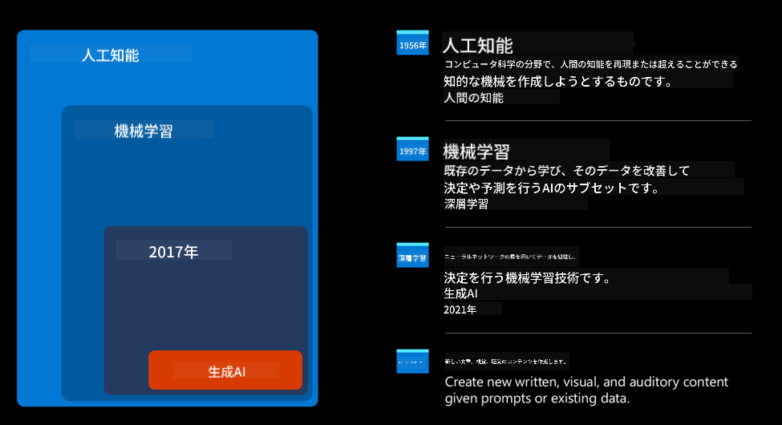
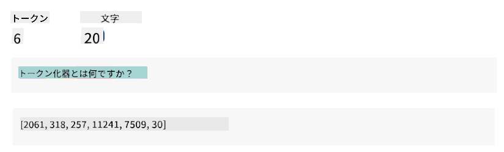
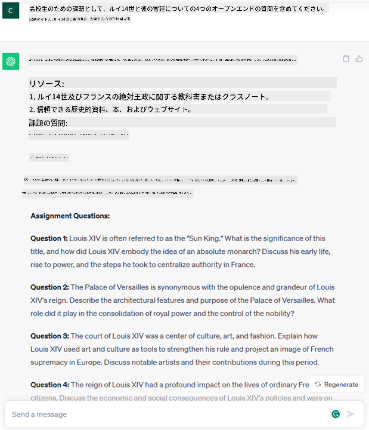
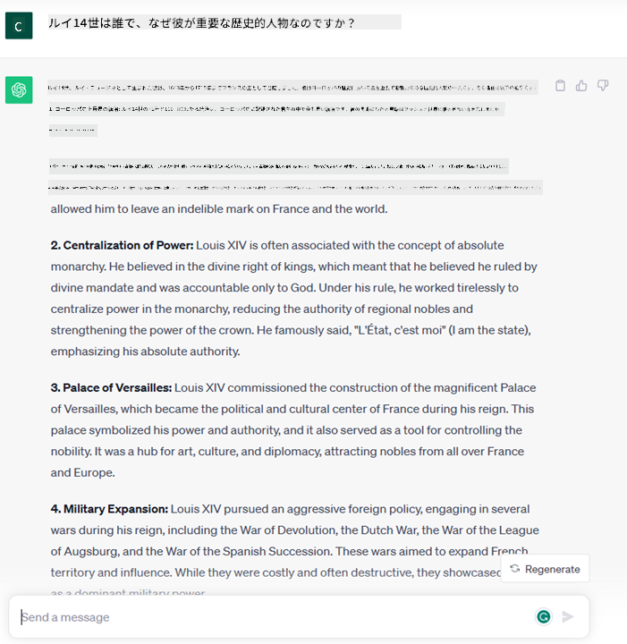
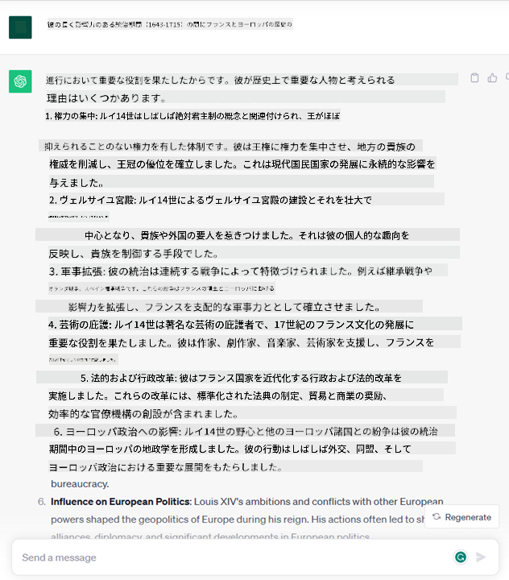
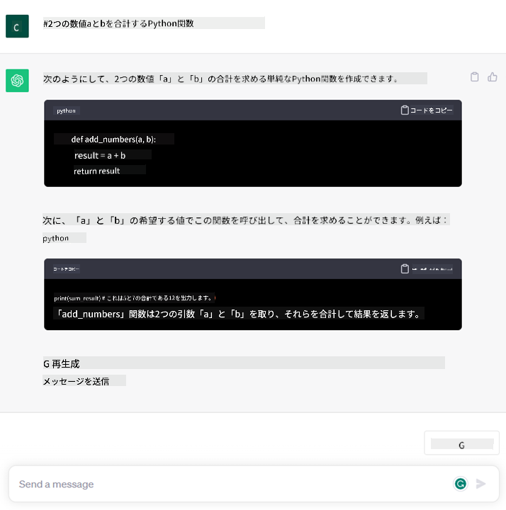

<!--
CO_OP_TRANSLATOR_METADATA:
{
  "original_hash": "f53ba0fa49164f9323043f1c6b11f2b1",
  "translation_date": "2025-05-19T09:10:44+00:00",
  "source_file": "01-introduction-to-genai/README.md",
  "language_code": "ja"
}
-->
# ジェネレーティブAIと大規模言語モデルの紹介

_(このレッスンのビデオを見るには、上の画像をクリックしてください)_

ジェネレーティブAIは、テキストや画像、その他のコンテンツを生成できる人工知能です。この技術が素晴らしいのは、AIを民主化し、誰でも自然言語で書かれた文章のようなテキストプロンプトを使うだけで利用できることです。JavaやSQLのような言語を学ぶ必要はなく、自分の言葉で何をしたいかを述べれば、AIモデルから提案が得られます。この技術の応用と影響は非常に大きく、レポートの作成や理解、アプリケーションの作成などが数秒で可能です。

このカリキュラムでは、ジェネレーティブAIが教育の世界でどのように新しいシナリオを切り開くのか、またその応用による社会的影響や技術的制約に関連する課題にどのように対処しているのかを探ります。

## はじめに

このレッスンでは以下をカバーします：

- ビジネスシナリオの紹介：私たちのスタートアップのアイデアとミッション
- ジェネレーティブAIと現在の技術的風景への到達
- 大規模言語モデルの内部構造
- 大規模言語モデルの主な能力と実用的なユースケース

## 学習目標

このレッスンを終えた後、以下を理解します：

- ジェネレーティブAIとは何か、大規模言語モデルがどのように機能するか
- 教育シナリオに焦点を当て、大規模言語モデルをどのように活用できるか

## シナリオ：私たちの教育系スタートアップ

ジェネレーティブ人工知能（AI）はAI技術の頂点を表し、かつて不可能と思われた境界を押し広げています。ジェネレーティブAIモデルにはいくつかの能力と応用がありますが、このカリキュラムでは架空のスタートアップを通じて教育を革命的に変える方法を探ります。このスタートアップを「私たちのスタートアップ」と呼びます。私たちのスタートアップは教育分野で活動しており、その野心的なミッションステートメントは

> _学習へのアクセスをグローバル規模で改善し、公平な教育アクセスを確保し、学習者一人ひとりのニーズに応じた個別学習体験を提供すること_

です。

私たちのスタートアップチームは、この目標を達成するためには、現代の最も強力なツールの一つである大規模言語モデル（LLM）を活用しなければならないことを認識しています。

ジェネレーティブAIは、今日の学び方や教え方を革命的に変えると期待されています。学生は24時間利用可能な仮想教師を利用して大量の情報と例を提供され、教師は革新的なツールを活用して学生を評価しフィードバックを与えることができます。

まず、カリキュラム全体で使用する基本的な概念と用語を定義しましょう。

## ジェネレーティブAIはどのようにして誕生したのか？

ジェネレーティブAIモデルの発表によって最近生まれた驚くべき_熱狂_にもかかわらず、この技術は数十年にわたって発展してきました。最初の研究は60年代にさかのぼります。現在では、AIは人間の認知能力を持ち、例えば[OpenAI ChatGPT](https://openai.com/chatgpt)や[Microsoft Bing Chat](https://www.microsoft.com/edge/features/bing-chat?WT.mc_id=academic-105485-koreyst)のように、会話が可能です。Bing Chatもウェブ検索Bingの会話にGPTモデルを使用しています。

少し遡ると、AIの最初のプロトタイプはタイプライターで入力するチャットボットであり、専門家の知識ベースを抽出してコンピュータに表現したものでした。知識ベースの回答は入力テキストに現れるキーワードによってトリガーされました。しかし、すぐにタイプライターチャットボットを使ったアプローチはスケールしにくいことが明らかになりました。

### AIへの統計的アプローチ：機械学習

90年代に統計的アプローチをテキスト分析に応用したことで、転機が訪れました。これにより、データからパターンを学習する新しいアルゴリズムが開発されました。これが機械学習です。このアプローチにより、機械は人間の言語理解をシミュレートできるようになりました。統計モデルはテキストとラベルのペアリングで訓練され、モデルは未知の入力テキストをメッセージの意図を表す事前定義されたラベルで分類できるようになります。

### ニューラルネットワークと現代の仮想アシスタント

近年、より多くのデータを扱えるハードウェアの技術進化により、AI研究が進み、ニューラルネットワークやディープラーニングアルゴリズムと呼ばれる高度な機械学習アルゴリズムが開発されました。

ニューラルネットワーク（特にリカレントニューラルネットワーク – RNN）は自然言語処理を大幅に強化し、文中の単語の意味をより意味深く表現し、文脈を重視することができるようになりました。

これが、21世紀の最初の10年間に誕生した仮想アシスタントを支える技術であり、人間の言語を解釈し、ニーズを特定し、満たすためのアクションを実行するのに非常に優れています。例えば、事前定義されたスクリプトで回答したり、サードパーティサービスを利用したりします。

### 現代、ジェネレーティブAI

これが今日のジェネレーティブAIに至るまでの道のりです。ジェネレーティブAIはディープラーニングのサブセットと見なすことができます。

AI分野での数十年にわたる研究の後、新しいモデルアーキテクチャ – _Transformer_ と呼ばれるものがRNNの限界を克服し、はるかに長いテキストシーケンスを入力として扱えるようになりました。Transformersはアテンションメカニズムに基づいており、モデルが受け取った入力に異なる重みを与え、テキストシーケンスの順序に関係なく、最も関連性の高い情報が集中している場所に「より注意を払う」ことができます。

最近のジェネレーティブAIモデルの多くは、テキスト入力と出力を扱うため、_大規模言語モデル（LLM）_ とも呼ばれるこのアーキテクチャに基づいています。これらのモデルが面白いのは、書籍、記事、ウェブサイトなどの多様なソースからの大量のラベルなしデータで訓練されており、さまざまなタスクに適応でき、創造性のあるような文法的に正しいテキストを生成できることです。これにより、機械が入力テキストを「理解」する能力が大幅に向上しただけでなく、人間の言語でオリジナルの応答を生成する能力も可能になりました。

## 大規模言語モデルはどのように機能するのか？

次の章では、さまざまなタイプのジェネレーティブAIモデルを探りますが、今はOpenAI GPT（Generative Pre-trained Transformer）モデルに焦点を当てて、大規模言語モデルがどのように機能するのかを見てみましょう。

- **トークナイザー、テキストから数値へ**: 大規模言語モデルはテキストを入力として受け取り、テキストを出力として生成します。しかし、統計モデルであるため、テキストシーケンスよりも数値の方がうまく機能します。したがって、モデルへのすべての入力は、コアモデルで使用される前にトークナイザーによって処理されます。トークンは可変数の文字で構成されたテキストのチャンクであり、トークナイザーの主な役割は入力をトークンの配列に分割することです。次に、各トークンはトークンインデックスとマッピングされ、元のテキストチャンクの整数エンコーディングとなります。

- **出力トークンの予測**: n個のトークンを入力として受け取った場合（最大nはモデルによって異なる）、モデルは1つのトークンを出力として予測できます。このトークンは次のイテレーションの入力に組み込まれ、拡大するウィンドウパターンで、ユーザーに1つ（または複数）の文を回答として提供するより良い体験を可能にします。これが、ChatGPTで遊んだことがあるなら、時々文の途中で止まるように見える理由です。

- **選択プロセス、確率分布**: 出力トークンは、現在のテキストシーケンスの後に出現する確率に基づいてモデルによって選ばれます。これは、モデルが訓練に基づいてすべての可能な「次のトークン」の確率分布を予測するためです。しかし、常に最も高い確率のトークンが選ばれるわけではありません。この選択にはランダム性が加えられ、モデルが非決定論的な方法で動作するようになっています。つまり、同じ入力に対して同じ出力を得ることはありません。このランダム性の度合いは、創造的思考のプロセスをシミュレートするために加えられており、温度というモデルパラメータを使用して調整できます。

## 私たちのスタートアップはどのように大規模言語モデルを活用できるか？

大規模言語モデルの内部構造をよりよく理解したので、私たちのビジネスシナリオに目を向けて、彼らが非常によく実行できる最も一般的なタスクのいくつかの実用的な例を見てみましょう。私たちは、大規模言語モデルの主な能力が_自然言語で書かれたテキスト入力から新しいテキストを生成すること_であると言いました。

しかし、どのようなテキスト入力と出力なのでしょうか？
大規模言語モデルの入力はプロンプトと呼ばれ、出力はコンプリートと呼ばれます。これは、現在の入力を完了するために次のトークンを生成するモデルのメカニズムを指します。プロンプトとは何か、そしてどのように設計してモデルを最大限に活用するかについて詳しく掘り下げていきますが、今のところ、プロンプトには以下が含まれることがあります：

- モデルから期待する出力のタイプを指定する**指示**。この指示には、例や追加のデータが含まれることもあります。

  1. 記事、本、製品レビューなどの要約、および非構造化データからの洞察の抽出。

    
  
  2. 記事、エッセイ、課題などの創造的なアイデアとデザイン。

     

- エージェントとの会話形式での**質問**。

  

- 暗黙的に書き支援を求める**テキストの完成**のチャンク。

  

- **コード**のチャンクと、それを説明し文書化する要求、または特定のタスクを実行するコードの生成を求めるコメント。

  

上記の例は非常にシンプルであり、大規模言語モデルの能力を網羅的に示すものではありません。教育的な文脈に限定されない、ジェネレーティブAIの使用の可能性を示すことを目的としています。

また、ジェネレーティブAIモデルの出力は完璧ではなく、時にはモデルの創造性が逆効果を生み出し、人間のユーザーが現実の歪曲として解釈する単語の組み合わせが生じたり、攻撃的なものになることがあります。ジェネレーティブAIは知性を持っていません – 批判的かつ創造的な推論や感情的知性を含むより包括的な知性の定義において少なくとも – 非決定論的であり、信頼できるものではありません。誤った参照やコンテンツ、声明などの虚偽が正確な情報と組み合わされ、説得力と自信を持って提示される可能性があります。次のレッスンでは、これらの制約に対処し、どのようにそれらを軽減するかを見ていきます。

## 課題

あなたの課題は、[ジェネレーティブAI](https://en.wikipedia.org/wiki/Generative_artificial_intelligence?WT.mc_id=academic-105485-koreyst)についてさらに調べ、現在ジェネレーティブAIが存在しない分野を特定することです。従来の方法と比較して、どのように違った影響を与えるか、以前はできなかったことができるようになるのか、またはより速くなるのかを考えてみてください。あなたの夢のAIスタートアップがどのようなものかを300語でまとめ、「問題」、「AIの使用方法」、「影響」、および任意でビジネスプランの見出しを含めてください。

この課題を行った場合、Microsoftのインキュベーター、[Microsoft for Startups Founders Hub](https://www.microsoft.com/startups?WT.mc_id=academic-105485-koreyst)に応募する準備ができているかもしれません。Azure、OpenAI、メンタリングなどのクレジットを提供していますので、ぜひチェックしてください！

## 知識チェック

大規模言語モデルについて正しいことは何ですか？

1. 毎回同じ応答が得られます。
2. 完璧に物事を行い、数を追加したり、動作するコードを生成したりするのが得意です。
3. 同じプロンプトを使用しても応答が異なる場合があります。また、テキストやコードの最初のドラフトを提供するのに優れています。しかし、結果を改善する必要があります。

A: 3、大規模言語モデルは非決定論的であり、応答が変わりますが、温度設定を使用してその変動を制御できます。また、完璧な結果を期待すべきではなく、重労働をしてくれるため、徐々に改善が必要な最初の試みを得ることが多いです。

## 素晴らしい仕事！旅を続けましょう

このレッスンを終えたら、[ジェネレーティブAI学習コレクション](https://aka.ms/genai-collection?WT.mc_id=academic-105485-koreyst)をチェックして、ジェネレーティブAIの知識をさらに深めてください！

レ

**免責事項**:  
このドキュメントはAI翻訳サービス [Co-op Translator](https://github.com/Azure/co-op-translator) を使用して翻訳されています。正確性を追求していますが、自動翻訳には誤りや不正確さが含まれる場合があることをご了承ください。元の言語でのオリジナルドキュメントが権威ある情報源と見なされるべきです。重要な情報については、専門の人間による翻訳を推奨します。この翻訳の使用に起因する誤解や誤解釈について、当社は責任を負いません。