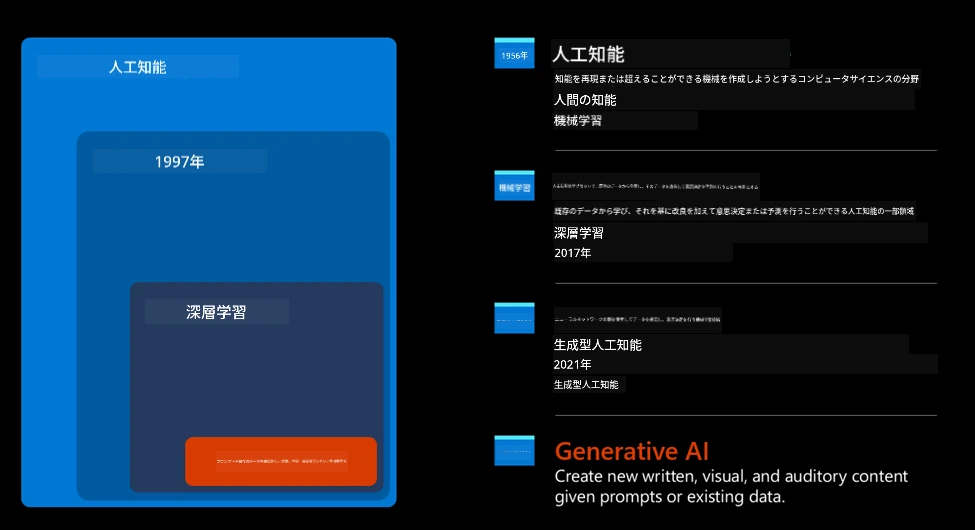
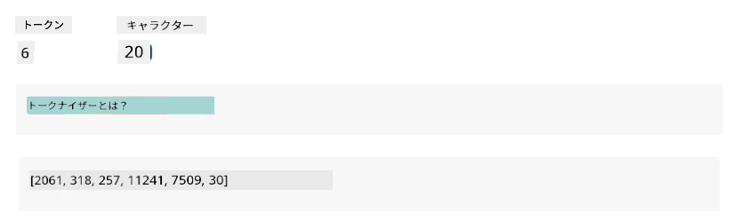
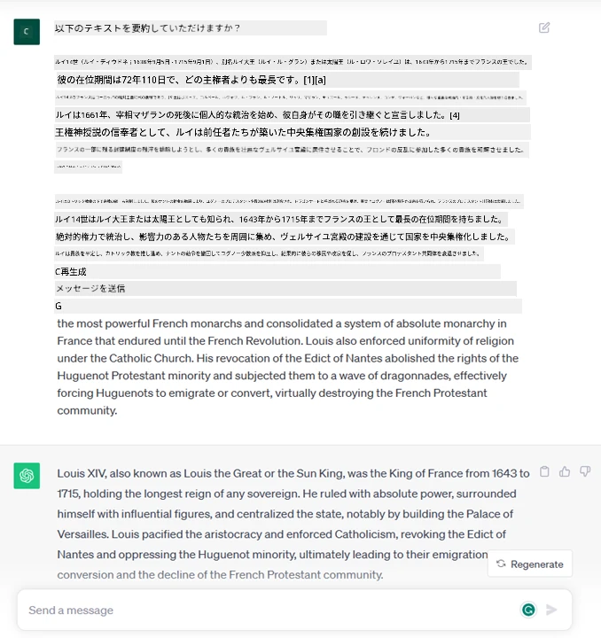
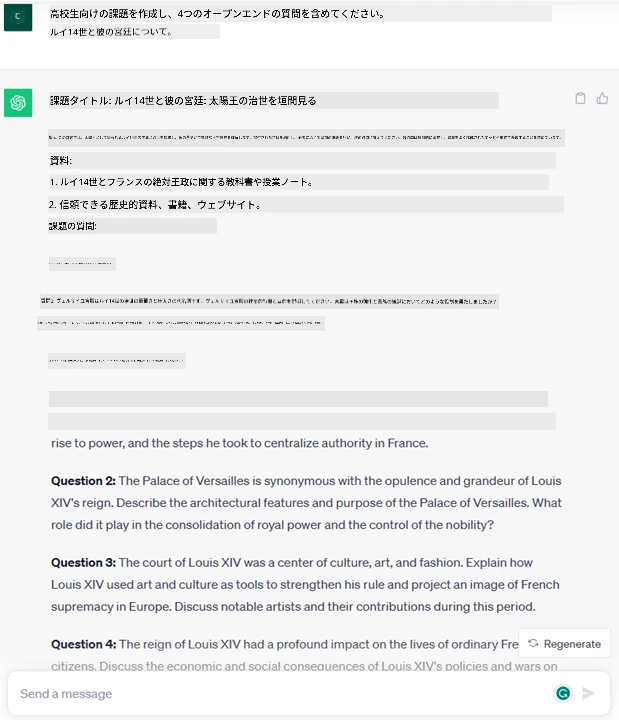
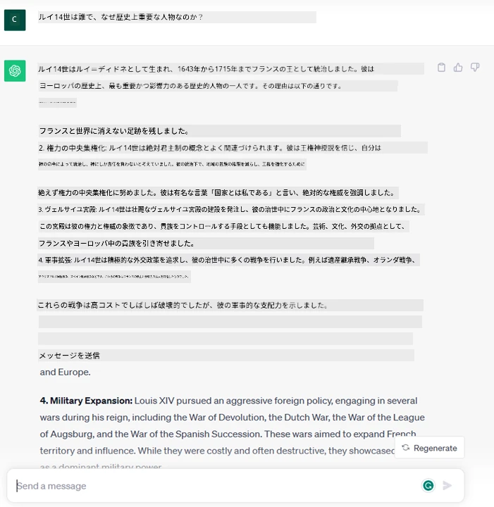
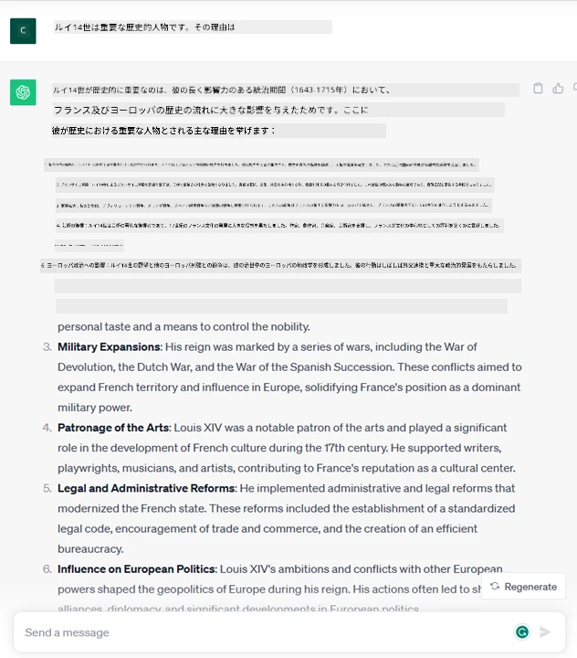
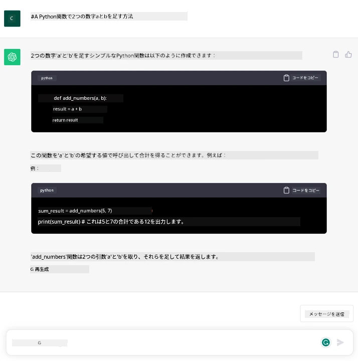

# 生成型AIと大規模言語モデルの導入

_(上の画像をクリックするとこのレッスンのビデオを視聴できます)_

生成型AIは、テキスト、画像、その他のタイプのコンテンツを生成できる人工知能です。優れた技術である理由は、AIを民主化し、誰でも自然言語で書かれたテキストプロンプトという単純な入力で利用できるようになる点にあります。JavaやSQLのようなプログラミング言語を学ぶことなく、単に自分の言葉で望むことを伝えるだけで、AIモデルから提案が得られます。その応用と影響は非常に大きく、レポートの作成や理解、アプリケーションの作成など、多くが数秒で可能です。

このカリキュラムでは、当社のスタートアップが生成型AIをどのように活用して教育の世界に新たなシナリオを開くか、またその社会的影響や技術的制約に伴う避けられない課題にどのように対処しているかを探ります。

## はじめに

このレッスンで扱う内容：

- ビジネスシナリオの紹介：当社のスタートアップアイデアと使命。
- 生成型AIと現在の技術的状況に至るまでの経緯。
- 大規模言語モデルの内部構造。
- 大規模言語モデルの主な機能と実用的なユースケース。

## 学習目標

このレッスンを終えると、以下が理解できるようになります：

- 生成型AIとは何か、そして大規模言語モデルがどのように動作するか。
- 教育シナリオに焦点を当てた、さまざまなユースケースで大規模言語モデルを活用する方法。

## シナリオ：当社の教育系スタートアップ

生成型人工知能（AI）はAI技術の究極の形態であり、不可能だと思われていたことの限界を押し広げています。生成型AIモデルにはさまざまな機能と応用がありますが、このカリキュラムでは、教育に革命を起こす架空のスタートアップに焦点を当てます。このスタートアップを_私たちのスタートアップ_と呼びます。当社は教育分野で、次のような野心的な使命を掲げています。

> _学習のアクセシビリティを世界規模で改善し、公正な教育へのアクセスを保証し、すべての学習者にニーズに応じたパーソナライズされた学習体験を提供すること_。

私たちのスタートアップチームは、この目標を達成するには現代で最も強力なツールの一つである大規模言語モデル（LLM）を活用しなければならないことを認識しています。

生成型AIは、学生が24時間体制で豊富な情報と例を提供する仮想教師を利用でき、教師は革新的なツールを活用して生徒の評価やフィードバックを行えるようにし、私たちの学習と教育の方法を変革すると期待されています。

まずは、このカリキュラムを通じて使う基本的な概念と言葉を定義しましょう。

## 生成型AIはどのように生まれたのか？

最近の生成型AIモデルの発表による大きな_話題_にもかかわらず、この技術は数十年の歴史があり、研究は60年代にまでさかのぼります。現在、[OpenAI ChatGPT](https://openai.com/chatgpt)や[Microsoft Copilot](https://copilot.microsoft.com/?WT.mc_id=academic-105485-koreyst)のように、人間の認知能力、例えば会話能力を持つAIが存在します。後者はGPTモデルを使った会話型ウェブ検索体験も提供しています。

少し戻って、最初のAIプロトタイプは専門家グループから抽出された知識ベースに基づき、入力テキスト内のキーワードをトリガーとして応答するタイプライターチャットボットで構成されていました。
しかし、このようなタイプライターチャットボットのアプローチはスケーラビリティに限界があることがすぐに明らかになりました。

### AIへの統計的アプローチ：機械学習

90年代に、テキスト解析に統計的アプローチを適用することで転換点を迎えました。これにより機械学習と呼ばれる新しいアルゴリズムが開発され、明示的なプログラミングなしにデータからパターンを学習できるようになりました。この方法により、機械は人間の言語理解をシミュレーションでき、テキストとラベルのペアでモデルを訓練し、未知の入力テキストを事前定義のラベル（メッセージの意図を表す）で分類できるようになりました。

### ニューラルネットワークと現代の仮想アシスタント

近年、より多くのデータと複雑な計算を扱えるハードウェアの技術的進歩がAI研究を後押しし、ニューラルネットワークまたはディープラーニングアルゴリズムと呼ばれる高度な機械学習アルゴリズムが誕生しました。

ニューラルネットワーク（特にリカレントニューラルネットワーク - RNN）は自然言語処理を大幅に進化させ、文中の単語の意味を文脈に基づいてより有意義に表現できるようになりました。

これは、新世紀の最初の10年間に生まれた仮想アシスタントを支える技術であり、人間の言語を解釈しニーズを特定し、それを満たすために予め定義されたスクリプトで応答したり、外部サービスを利用したりすることに習熟しています。

### 現代、生成型AI

このようにして、現在の生成型AI、すなわちディープラーニングのサブセットと考えられる技術が誕生しました。

数十年のAI研究の末、_Transformer_と呼ばれる新しいモデルアーキテクチャがRNNの限界を超え、より長いテキスト列を入力として処理可能になりました。Transformerはアテンションメカニズムに基づき、受け取る入力に異なる重みを付け、最も関連性の高い情報に‘より注意を払う’ことができます。テキストの順序に関わらず情報の集中している部分に重点を置くことができます。

最近の生成型AIモデルは、テキストの入出力を扱う大規模言語モデル（LLM）とも呼ばれていますが、ほとんどがこのアーキテクチャに基づいています。これらのモデルは膨大な量のラベル付けされていない書籍、記事、ウェブサイトなど多様なソースから訓練されており、さまざまなタスクに適応可能で、文法的に正しいテキストをまるで創造性があるかのように生成できます。つまり、入力テキストを‘理解’する能力を劇的に強化しただけでなく、人間の言語で独創的な応答を生成する能力も得ました。

## 大規模言語モデルはどう動くのか？

次章ではさまざまなタイプの生成型AIモデルについて探りますが、ここではOpenAIのGPT（Generative Pre-trained Transformer）モデルに焦点を当てて、大規模言語モデルの動作を見てみましょう。

- **トークナイザー、テキストから数字へ**：大規模言語モデルはテキストを入力として受け取り、テキストを出力します。しかし統計モデルとして数字の方が扱いやすいため、すべての入力は核心モデルに渡される前にトークナイザーで処理されます。トークンは可変長の文字列の意味の塊であり、トークナイザーの役割は入力をトークンの配列に分割することです。その後、各トークンは元のテキスト塊の整数エンコードであるトークンインデックスにマッピングされます。

- <strong>出力トークンの予測</strong>：n個のトークンを入力として与えると（nの最大値はモデルによって異なります）、モデルは出力トークンを一つ予測します。このトークンは次の反復での入力に取り込まれ、拡張ウィンドウパターンで使用されます。これにより、ユーザーは1文または複数文の回答を受け取ることができ、ChatGPTのように時々文の途中で止まるように見えることも説明できます。

- **選択プロセス、確率分布**：出力トークンは、現在のテキスト列の後に現れる確率に基づきモデルが選択します。モデルは訓練に基づき、すべての「次のトークン」について確率分布を予測します。ただし、最高確率のトークンが常に選ばれるわけではありません。モデルは非決定論的に振る舞うために、確率に一定のランダム性が加えられます。同じ入力でも常に同じ出力が得られるわけではありません。このランダム度は創造的思考をシミュレートするために用いられ、temperatureというパラメーターで調整可能です。

## 当社のスタートアップは大規模言語モデルをどう活用できるか？

大規模言語モデルの内部動作が理解できたところで、ビジネスシナリオに目を向け、よく行われるタスクの実用的な例を見てみましょう。
大規模言語モデルの主な機能は、_自然言語で書かれたテキスト入力からテキストを一から生成すること_です。

では、どのようなテキスト入力と出力でしょうか？
大規模言語モデルの入力はプロンプトと呼ばれ、出力は完了（completion）と呼ばれます。完了はモデルが次のトークンを生成して現在の入力を完成させる動作を指します。プロンプトとは何か、どう設計してモデルを最大限活用するかについて深く掘り下げますが、とりあえずプロンプトは次を含むことがあります。

- <strong>出力タイプを指定する指示</strong>。この指示には例や追加データが含まれることがあります。

  1. 記事、本、製品レビューの要約や非構造化データからの洞察抽出。
    
    
  
  2. 記事、エッセイ、課題などのクリエイティブなアイデア生成とデザイン。
      
     

- <strong>エージェントとの対話形式での質問</strong>。
  
  

- <strong>補完すべきテキストの断片</strong>、つまり執筆支援の依頼。
  
  

- <strong>コードの断片</strong>と、それについての説明やドキュメント作成の依頼、または特定のタスクを実行するコードの生成を求めるコメント。
  
  

上記の例は非常にシンプルで、大規模言語モデルの能力の全てを示すものではありません。生成型AI、特に教育コンテキストでの潜在能力を示すことを目的としています。

また、生成型AIモデルの出力は完璧ではなく、時にモデルの創造性が逆効果となり、現実の謎めいた解釈や不快な内容を含むことがあります。生成型AIは知性を持ちません—少なくとも批判的・創造的思考や感情知能を含む広義の知性ではありません。非決定的で信頼性が低く、誤った参照や内容、発言が正しい情報と混ざって説得力を持って提示される場合があります。以後のレッスンではこれらの限界に取り組み、軽減策を見ていきます。

## 課題

課題は、[生成型AI](https://en.wikipedia.org/wiki/Generative_artificial_intelligence?WT.mc_id=academic-105485-koreyst)についてさらに調査し、まだ生成型AIが導入されていない分野を見つけ出すことです。「昔ながら」の方法と比べてどんな影響があり、以前はできなかったことが可能になるのか、あるいは単に速くなるのかを考えます。夢のAIスタートアップについて300字でまとめ、"問題", "AIの使い方", "影響" などの見出し、必要に応じてビジネスプランも含めて書いてください。

この課題に取り組めば、[Microsoft for Startups Founders Hub](https://www.microsoft.com/startups?WT.mc_id=academic-105485-koreyst) への応募準備ができているかもしれません。ここではAzure、OpenAI、メンタリングなどのクレジットを提供しています。ぜひチェックしてください！

## 知識確認

大規模言語モデルについて正しいのはどれですか？

1. 毎回全く同じ応答が得られる。
1. 完璧に作業をこなす。計算や動くコードの生成が得意など。
1. 同じプロンプトでも応答は異なる場合がある。文章でもコードでも最初の草案を出すのが得意だが、結果の改善は必要。

A: 3が正しいです。LLMは非決定論的で応答は変化しますが、temperature設定でその変動を制御できます。完璧な作業を期待すべきではありません。最初の良い試みを提供し、その後改善していくための重い作業を担っています。

## よくできました！学びを続けましょう

このレッスンを終えたら、[Generative AI Learning collection](https://aka.ms/genai-collection?WT.mc_id=academic-105485-koreyst) をチェックして、生成型AIの知識をさらに深めましょう！

レッスン2へ進み、[さまざまなLLMタイプを探索・比較する方法](../02-exploring-and-comparing-different-llms/README.md?WT.mc_id=academic-105485-koreyst)を見ていきましょう！

---

<!-- CO-OP TRANSLATOR DISCLAIMER START -->
**免責事項**：
本書類は AI 翻訳サービス [Co-op Translator](https://github.com/Azure/co-op-translator) を使用して翻訳されています。正確性を期していますが、自動翻訳には誤りや不正確な部分が含まれる可能性があることをご承知おきください。原文の原語版が正式な情報源とみなされるべきです。重要な情報については、専門の人間による翻訳を推奨します。本翻訳の利用により生じたいかなる誤解や解釈違いについても、当方は責任を負いかねます。
<!-- CO-OP TRANSLATOR DISCLAIMER END -->