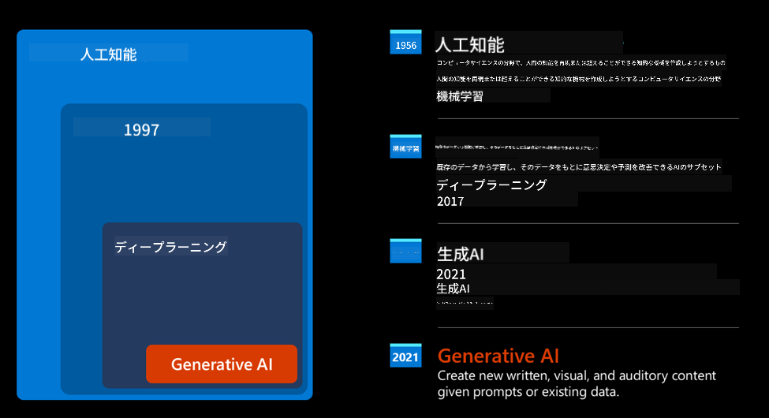
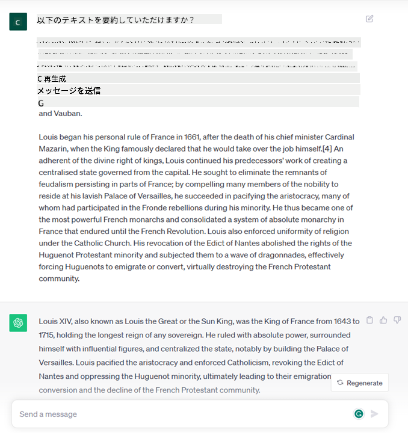
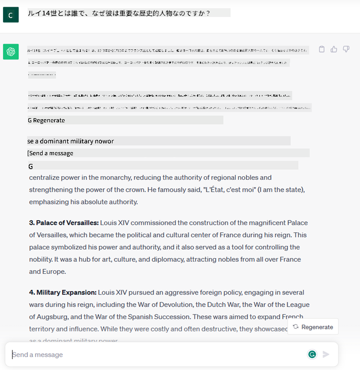
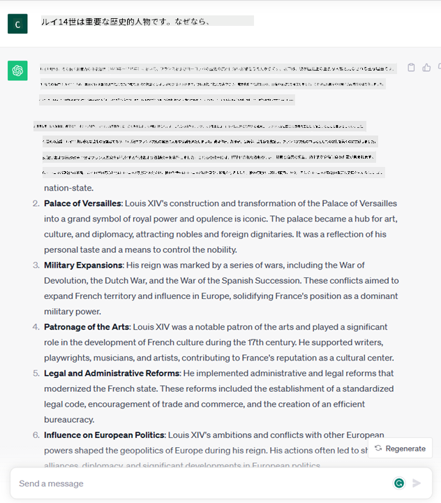

<!--
CO_OP_TRANSLATOR_METADATA:
{
  "original_hash": "bfb7901bdbece1ba3e9f35c400ca33e8",
  "translation_date": "2025-10-17T23:56:13+00:00",
  "source_file": "01-introduction-to-genai/README.md",
  "language_code": "ja"
}
-->
# 生成AIと大規模言語モデルの紹介

_(上の画像をクリックして、このレッスンの動画をご覧ください)_

生成AIは、テキスト、画像、その他のコンテンツを生成できる人工知能です。この技術が素晴らしいのは、AIを民主化する力を持っていることです。誰でも自然言語で書かれた1つの文章、つまりテキストプロンプトだけで利用できます。JavaやSQLのようなプログラミング言語を学ぶ必要はなく、自分の言葉で欲しいものを伝えるだけで、AIモデルから提案が得られます。この技術の応用範囲と影響は非常に広く、レポートの作成や理解、アプリケーションの作成など、ほんの数秒で可能になります。

このカリキュラムでは、私たちのスタートアップが教育分野で生成AIを活用して新しいシナリオを切り開く方法や、その応用に伴う社会的影響や技術的制約にどのように対処しているかを探ります。

## はじめに

このレッスンでは以下を学びます：

- ビジネスシナリオの紹介：私たちのスタートアップのアイデアと使命。
- 生成AIと現在の技術的状況への到達過程。
- 大規模言語モデルの内部構造。
- 大規模言語モデルの主な能力と実用的なユースケース。

## 学習目標

このレッスンを終えると、以下を理解できます：

- 生成AIとは何か、大規模言語モデルがどのように機能するか。
- 大規模言語モデルをさまざまなユースケースに活用する方法、特に教育シナリオに焦点を当てて。

## シナリオ：私たちの教育系スタートアップ

生成AIはAI技術の頂点を象徴し、かつて不可能だと思われていた限界を押し広げています。生成AIモデルには多くの能力と応用がありますが、このカリキュラムでは架空のスタートアップを通じて教育分野での革命的な変化を探ります。このスタートアップを「私たちのスタートアップ」と呼びます。私たちのスタートアップは教育分野で活動しており、その野心的な使命は以下の通りです：

> _学習のアクセシビリティを世界規模で向上させ、教育への公平なアクセスを確保し、学習者一人ひとりのニーズに応じた個別学習体験を提供すること_

私たちのスタートアップチームは、この目標を達成するためには、現代の最も強力なツールの1つである大規模言語モデル（LLM）を活用する必要があることを認識しています。

生成AIは、今日の学び方や教え方を革命的に変えると期待されています。学生は24時間利用可能な仮想教師を手に入れ、膨大な情報や例を提供し、教師は革新的なツールを活用して生徒を評価し、フィードバックを提供することができます。

まずは、このカリキュラムで使用する基本的な概念と用語を定義しましょう。

## 生成AIはどのようにして誕生したのか？

最近の生成AIモデルの発表によって生まれた驚異的な_注目_にもかかわらず、この技術は数十年にわたる研究の成果であり、最初の研究は1960年代に遡ります。現在では、AIが人間の認知能力を持つ段階に到達しており、例えば[OpenAI ChatGPT](https://openai.com/chatgpt)や[Microsoft Bing Chat](https://www.microsoft.com/edge/features/bing-chat?WT.mc_id=academic-105485-koreyst)のように、GPTモデルを使用してウェブ検索や会話を行うことができます。

少し遡ると、AIの最初のプロトタイプはタイプライター式のチャットボットで、専門家グループから抽出された知識ベースをコンピュータに表現していました。この知識ベースの回答は、入力テキストに現れるキーワードによってトリガーされました。
しかし、このアプローチはスケーラビリティに問題があることがすぐに明らかになりました。

### AIへの統計的アプローチ：機械学習

1990年代に転機が訪れ、テキスト分析への統計的アプローチが適用されました。これにより、機械学習と呼ばれる新しいアルゴリズムが開発され、データからパターンを学習し、明示的にプログラムされることなく動作する能力を持つようになりました。このアプローチにより、機械が人間の言語理解をシミュレートすることが可能になりました。統計モデルはテキストとラベルのペアで訓練され、未知の入力テキストを事前定義されたラベルで分類することができるようになりました。

### ニューラルネットワークと現代の仮想アシスタント

近年、より大規模なデータと複雑な計算を処理できるハードウェアの技術進化により、AI研究が促進され、高度な機械学習アルゴリズムであるニューラルネットワークや深層学習アルゴリズムが開発されました。

ニューラルネットワーク（特にリカレントニューラルネットワーク – RNN）は自然言語処理を大幅に向上させ、文中の単語の意味をより意味深く表現し、文脈を重視するようになりました。

この技術は、21世紀初頭に誕生した仮想アシスタントを支えるものであり、人間の言語を解釈し、ニーズを特定し、それを満たすためのアクションを実行する能力を持っています。例えば、事前定義されたスクリプトで回答したり、サードパーティのサービスを利用したりすることができます。

### 現代の生成AI

こうして、今日の生成AIに至りました。生成AIは深層学習の一部と見なすことができます。

AI分野での数十年にわたる研究の結果、新しいモデルアーキテクチャである_Transformer_がRNNの限界を克服し、より長いテキストシーケンスを入力として受け取ることが可能になりました。Transformerは注意機構に基づいており、モデルが受け取る入力に異なる重みを与え、テキストシーケンス内の順序に関係なく、最も関連性の高い情報に「より注意を払う」ことを可能にします。

最近の生成AIモデルの多くは、テキスト入力と出力を扱うため、大規模言語モデル（LLM）とも呼ばれています。これらのモデルは、書籍、記事、ウェブサイトなど多様なソースから収集された膨大な量のラベルなしデータで訓練されており、さまざまなタスクに適応し、文法的に正しいテキストを生成する能力を持っています。これにより、機械が入力テキストを「理解」する能力が大幅に向上しただけでなく、人間の言語で独自の応答を生成する能力も可能になりました。

## 大規模言語モデルはどのように機能するのか？

次の章では、さまざまな生成AIモデルについて探りますが、ここではOpenAI GPT（Generative Pre-trained Transformer）モデルに焦点を当てて、大規模言語モデルの仕組みを見てみましょう。

- **トークナイザー、テキストから数値へ**: 大規模言語モデルはテキストを入力として受け取り、テキストを出力として生成します。しかし、統計モデルであるため、テキストシーケンスよりも数値での処理が得意です。そのため、モデルのコア部分で使用される前に、入力はトークナイザーによって処理されます。トークンは可変長の文字列で構成されており、トークナイザーの主な役割は入力をトークンの配列に分割することです。その後、各トークンはトークンインデックスにマッピングされ、元のテキストチャンクの整数エンコーディングとなります。

- **出力トークンの予測**: n個のトークンを入力として与えると（モデルによって最大nは異なる）、モデルは1つのトークンを出力として予測します。このトークンは次の反復の入力に組み込まれ、拡張ウィンドウパターンを形成し、1つまたは複数の文を回答として得るユーザー体験を向上させます。これにより、ChatGPTを使用したことがある場合、時々文の途中で止まるように見える理由が説明されます。

- **選択プロセス、確率分布**: 出力トークンは、現在のテキストシーケンスの後に発生する確率に基づいてモデルによって選択されます。これは、モデルがトレーニングに基づいてすべての可能な「次のトークン」に対する確率分布を予測するためです。ただし、結果の分布から最も高い確率のトークンが常に選ばれるわけではありません。この選択にはランダム性が加えられ、モデルが非決定論的に動作するようにします。同じ入力であっても、毎回同じ出力が得られるわけではありません。このランダム性は創造的思考のプロセスをシミュレートするために追加され、温度というモデルパラメータを使用して調整できます。

## 私たちのスタートアップは大規模言語モデルをどのように活用できるのか？

大規模言語モデルの内部構造をより深く理解したところで、最も一般的なタスクのいくつかを実際にどのように活用できるか、特に私たちのビジネスシナリオに目を向けて見てみましょう。
大規模言語モデルの主な能力は、_自然言語で書かれたテキスト入力からゼロからテキストを生成すること_です。

では、どのようなテキスト入力と出力があるのでしょうか？
大規模言語モデルの入力はプロンプトと呼ばれ、出力は補完と呼ばれます。この補完という用語は、現在の入力を完成させるために次のトークンを生成するモデルのメカニズムを指します。プロンプトについては後ほど詳しく説明しますが、ここでは簡単に、プロンプトには以下が含まれる可能性があることを述べておきます：

- **指示**: モデルから期待する出力の種類を指定するもの。この指示には、例や追加データが含まれることがあります。

  1. 記事、書籍、製品レビューなどの要約、または非構造化データからの洞察の抽出。
    
    
  
  2. 記事、エッセイ、課題などの創造的なアイデアとデザイン。
      
     

- **質問**: エージェントとの会話形式で尋ねるもの。
  
  

- **補完するテキストの一部**: 暗黙的に執筆支援を求めるもの。
  
  

- **コードの一部**: 説明や文書化を求めるコメント、または特定のタスクを実行するコードの生成を求めるコメント。
  
  

上記の例は非常にシンプルで、大規模言語モデルの能力を完全に示すものではありません。これらは生成AIの使用可能性を示すものであり、特に教育的な文脈に限定されるものではありません。

また、生成AIモデルの出力は完璧ではなく、モデルの創造性が逆効果をもたらすこともあります。その結果、人間のユーザーが現実の歪曲と解釈する可能性のある言葉の組み合わせが生成されたり、攻撃的な内容が含まれることがあります。生成AIは知的ではありません – 少なくとも批判的・創造的な推論や感情的知性を含む包括的な知性の定義においては – 決定論的ではなく、信頼性もありません。誤った参照や内容、主張が正しい情報と組み合わされ、説得力のある自信を持って提示されることがあります。次のレッスンでは、これらの制限に対処し、それを軽減するために何ができるかを見ていきます。

## 課題

[生成AI](https://en.wikipedia.org/wiki/Generative_artificial_intelligence?WT.mc_id=academic-105485-koreyst)についてさらに調べ、現在生成AIが導入されていない分野で導入したいと思う領域を特定してください。従来の方法と比べてどのように違いが生まれるのか、以前はできなかったことができるようになるのか、またはより速くなるのかを考えてみましょう。あなたの理想のAIスタートアップがどのようなものかを300語でまとめ、「問題」「AIの活用方法」「影響」、そしてオプションでビジネスプランといった見出しを含めてください。

この課題を完了したら、Microsoftのインキュベーター[Microsoft for Startups Founders Hub](https://www.microsoft.com/startups?WT.mc_id=academic-105485-koreyst)に応募する準備ができているかもしれません。Azure、OpenAI、メンタリングなどのクレジットを提供していますので、ぜひチェックしてみてください！

## 知識チェック

大規模言語モデルについて正しいのはどれですか？

1. 毎回同じ応答が得られる。
1. 完璧に動作し、数値の計算や動作するコードの生成が得意。
1. 同じプロンプトを使用しても応答が変わる可能性がある。また、テキストやコードの初稿を提供するのが得意。ただし、結果を改善する必要がある。

A: 3、大規模言語モデルは非決定論的であり、応答は変動します。ただし、温度設定を使用してその変動を制御することができます。また、完璧な結果を期待すべきではありません。モデルは重い作業を代行するために存在しており、しばしば改善が必要な良い初稿を提供します。

## 素晴らしい仕事！次のステップへ進みましょう

このレッスンを完了したら、[生成AI学習コレクション](https://aka.ms/genai-collection?WT.mc_id=academic-105485-koreyst)をチェックして、生成AIの知識をさらに深めてください！
レッスン2に進み、[さまざまなLLMタイプを探索し比較する方法](../02-exploring-and-comparing-different-llms/README.md?WT.mc_id=academic-105485-koreyst)を見てみましょう！

---

**免責事項**:  
この文書はAI翻訳サービス[Co-op Translator](https://github.com/Azure/co-op-translator)を使用して翻訳されています。正確性を追求しておりますが、自動翻訳には誤りや不正確な部分が含まれる可能性があります。元の言語で記載された文書を正式な情報源としてご参照ください。重要な情報については、専門の人間による翻訳を推奨します。この翻訳の使用に起因する誤解や誤解について、当社は一切の責任を負いません。