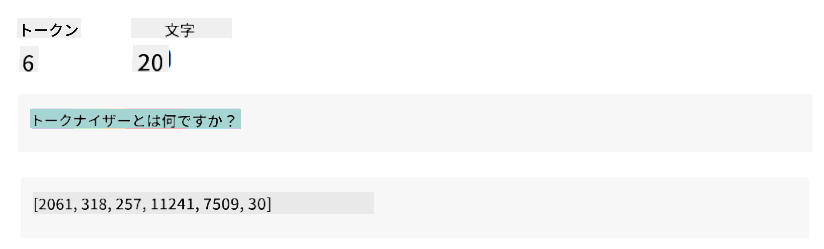
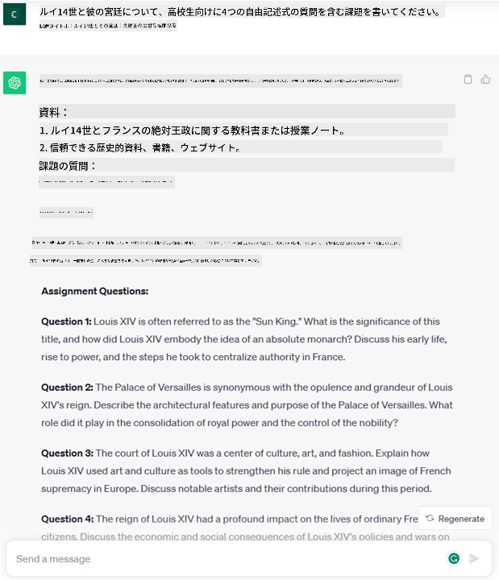

<!--
CO_OP_TRANSLATOR_METADATA:
{
  "original_hash": "f53ba0fa49164f9323043f1c6b11f2b1",
  "translation_date": "2025-07-09T07:45:53+00:00",
  "source_file": "01-introduction-to-genai/README.md",
  "language_code": "ja"
}
-->
# 生成AIと大規模言語モデルの紹介

_(上の画像をクリックすると、このレッスンの動画がご覧いただけます)_

生成AIは、テキストや画像、その他さまざまなコンテンツを生成できる人工知能です。この技術の素晴らしい点は、AIを民主化し、誰でも自然言語で書かれた短い文章（テキストプロンプト）を使うだけで利用できることです。JavaやSQLのようなプログラミング言語を学ぶ必要はなく、自分の言葉で欲しいものを伝えれば、AIモデルから提案が返ってきます。これにより、レポートの作成や理解、アプリケーションの作成などが数秒で可能になり、その応用範囲と影響は非常に大きいです。

このカリキュラムでは、私たちのスタートアップが生成AIを活用して教育分野で新たなシナリオを切り開く方法と、その社会的影響や技術的制約に伴う課題にどう対処しているかを探っていきます。

## はじめに

このレッスンで扱う内容は以下の通りです：

- ビジネスシナリオの紹介：私たちのスタートアップのアイデアとミッション
- 生成AIと現在の技術動向について
- 大規模言語モデルの内部構造
- 大規模言語モデルの主な機能と実用的なユースケース

## 学習目標

このレッスンを終えた後、あなたは以下を理解できるようになります：

- 生成AIとは何か、大規模言語モデルがどのように動作するか
- 教育シナリオを中心に、大規模言語モデルをさまざまな用途で活用する方法

## シナリオ：私たちの教育系スタートアップ

生成人工知能（AI）は、かつて不可能と考えられていたことの限界を押し広げる、AI技術の最先端を示しています。生成AIモデルには多くの機能と応用がありますが、このカリキュラムでは架空のスタートアップを通じて、教育分野に革命をもたらす様子を探ります。このスタートアップを「私たちのスタートアップ」と呼びます。私たちのスタートアップは教育分野で活動し、以下のような野心的なミッションを掲げています。

> _学習のアクセシビリティを世界規模で向上させ、すべての学習者に公平な教育機会と個別化された学習体験を提供すること_

私たちのチームは、この目標を達成するには現代で最も強力なツールの一つである大規模言語モデル（LLM）を活用する必要があることを認識しています。

生成AIは、学生が24時間いつでも利用できる仮想教師を手に入れ、膨大な情報や例を提供できるようにし、教師は革新的なツールを使って生徒の評価やフィードバックを行えるようにするなど、学びと教えの方法を根本的に変えると期待されています。

まずは、このカリキュラムで使う基本的な概念や用語を定義しましょう。

## 生成AIはどのようにして生まれたのか？

最近の生成AIモデルの発表による大きな話題の裏には、この技術が数十年にわたる研究の積み重ねであるという事実があります。最初の研究は1960年代に遡ります。現在では、[OpenAI ChatGPT](https://openai.com/chatgpt)や[Microsoft Bing Chat](https://www.microsoft.com/edge/features/bing-chat?WT.mc_id=academic-105485-koreyst)のように、人間の認知能力を持つかのような会話が可能なAIが登場しています。Bing ChatもGPTモデルを使ってウェブ検索の会話を実現しています。

少し振り返ると、最初のAIプロトタイプはタイプライター式のチャットボットで、専門家の知識ベースをコンピューターに組み込み、入力テキストに含まれるキーワードに応じて回答を返していました。しかし、この方法はスケールしにくいことがすぐに明らかになりました。

### AIへの統計的アプローチ：機械学習

90年代に転機が訪れ、テキスト解析に統計的手法が応用されました。これにより、明示的にプログラムされなくてもデータからパターンを学習できる機械学習アルゴリズムが開発されました。この手法は、人間の言語理解を模倣することを可能にします。具体的には、テキストとラベルのペアでモデルを訓練し、未知の入力テキストをメッセージの意図を表すラベルに分類できるようにします。

### ニューラルネットワークと現代の仮想アシスタント

近年、より大量のデータ処理や複雑な計算を可能にするハードウェアの進化により、ニューラルネットワークや深層学習と呼ばれる高度な機械学習アルゴリズムの研究が進みました。

ニューラルネットワーク（特にリカレントニューラルネットワーク：RNN）は自然言語処理を大きく進化させ、文中の単語の意味を文脈に応じてより深く理解できるようになりました。

この技術は、21世紀初頭に登場した仮想アシスタントの基盤となり、人間の言語を解釈し、ニーズを特定し、事前に用意されたスクリプトで応答したり、外部サービスを利用したりすることができました。

### 現代の生成AI

こうして今日の生成AIに至ります。生成AIは深層学習の一分野と見なせます。

数十年にわたるAI研究の成果として、新しいモデルアーキテクチャである_Transformer_がRNNの限界を超え、より長いテキスト列を入力として扱えるようになりました。Transformerは注意機構（attention mechanism）を基盤としており、テキスト内の情報の重要度に応じて異なる重みを与え、順序に関係なく最も関連性の高い部分に「注意を払う」ことができます。

最近の多くの生成AIモデルは、大規模言語モデル（LLM）とも呼ばれ、テキストの入出力を扱うこれらのモデルはこのアーキテクチャに基づいています。書籍や記事、ウェブサイトなど多様なソースから大量のラベルなしデータで訓練されており、多様なタスクに適応可能で、文法的に正しく、創造性を感じさせるテキストを生成できます。つまり、入力テキストを「理解」する能力が飛躍的に向上しただけでなく、人間の言語でオリジナルの応答を生成する能力も備えています。

## 大規模言語モデルはどのように動くのか？

次の章ではさまざまな生成AIモデルを紹介しますが、ここではOpenAIのGPT（Generative Pre-trained Transformer）モデルに焦点を当てて、大規模言語モデルの動作を見てみましょう。

- **トークナイザー：テキストを数字に変換**  
  大規模言語モデルはテキストを入力として受け取り、テキストを出力します。しかし、統計モデルであるため、テキストよりも数字の方が扱いやすいです。そこで、入力はモデルに渡される前にトークナイザーで処理されます。トークンとは、可変長の文字列の塊で、トークナイザーの主な役割は入力をトークンの配列に分割することです。各トークンはトークンインデックスという整数にマッピングされ、元のテキストの符号化となります。

- **出力トークンの予測**  
  n個のトークンを入力として受け取ると（最大nはモデルによって異なります）、モデルは次の1トークンを予測します。このトークンは次の入力に組み込まれ、拡大するウィンドウのように繰り返されます。これにより、ユーザーは1文または複数文の回答を得られます。ChatGPTを使ったことがある人は、時々途中で文章が止まるように見えることがあるのはこのためです。

- **選択プロセス：確率分布**  
  出力トークンは、現在のテキスト列の後に続く確率に基づいてモデルが選びます。モデルはすべての可能な「次のトークン」に対して確率分布を予測しますが、必ずしも最も確率の高いトークンが選ばれるわけではありません。ある程度のランダム性が加えられ、モデルは非決定的に動作します。同じ入力でも全く同じ出力が得られないことがあります。このランダム性は創造的思考を模倣するためで、temperatureというパラメーターで調整可能です。

## 私たちのスタートアップは大規模言語モデルをどう活用できるか？

大規模言語モデルの内部動作がわかったところで、ビジネスシナリオに照らして、彼らが得意とする代表的なタスクの実例を見てみましょう。大規模言語モデルの主な能力は、_自然言語で書かれたテキスト入力から、ゼロからテキストを生成すること_です。

では、どのようなテキストの入力と出力でしょうか？  
大規模言語モデルの入力はプロンプトと呼ばれ、出力はコンプリーションと呼ばれます。コンプリーションは、現在の入力を完成させるために次のトークンを生成するモデルの仕組みを指します。プロンプトとは何か、どう設計すればモデルの性能を最大限に引き出せるかは後ほど詳しく説明しますが、ここではプロンプトに含まれる可能性のあるものを挙げておきます。

- モデルに期待する出力の種類を指定する**指示**。この指示には例や追加データが含まれることもあります。

  1. 記事や書籍、商品レビューの要約や、非構造化データからの洞察抽出など。
    
    
  
  2. 記事、エッセイ、課題などの創造的なアイデア出しや設計。
      
     

- エージェントとの会話形式での**質問**。
  
  

- 書きかけの**テキストの補完**。これは暗黙のうちに文章作成支援の依頼です。
  
  

- **コードの断片**と、それを説明・ドキュメント化する依頼、または特定のタスクを実行するコード生成の依頼。
  
  

上記の例は比較的シンプルで、大規模言語モデルの能力を網羅的に示すものではありません。生成AIの可能性を示すためのもので、特に教育分野に限らず幅広く応用可能です。

また、生成AIの出力は完璧ではなく、モデルの創造性が裏目に出て、現実のねじれや誤解を招く表現、あるいは不快な内容になることもあります。生成AIは知性を持っているわけではありません。批判的・創造的思考や感情知能を含む広義の知性とは異なり、決定論的でもなく、信頼できるわけでもありません。誤った参照や内容、発言が正しい情報と混ざって説得力を持って提示されることもあります。今後のレッスンでは、これらの限界にどう対処するかを学んでいきます。

## 課題

[generative AI](https://en.wikipedia.org/wiki/Generative_artificial_intelligence?WT.mc_id=academic-105485-koreyst)についてさらに調べて、まだ生成AIが使われていない分野を見つけてみてください。従来の方法と比べてどのように影響が変わるでしょうか？以前はできなかったことができるようになるのか、それともより速くできるのか？  
あなたの理想のAIスタートアップについて300字程度でまとめ、「問題点」「AIの活用方法」「影響」、必要に応じてビジネスプランの見出しをつけて書いてみてください。

この課題を終えたら、Microsoftのインキュベーターである[Microsoft for Startups Founders Hub](https://www.microsoft.com/startups?WT.mc_id=academic-105485-koreyst)への応募も検討してみてください。AzureやOpenAIのクレジット、メンタリングなど多くの支援が受けられます。

## 知識チェック

大規模言語モデルについて正しいのはどれでしょう？

1. 毎回まったく同じ応答が返ってくる。  
1. 完璧に動作し、計算やコード生成も正確に行う。  
1. 同じプロンプトでも応答は変わることがある。テキストやコードの初稿を作るのに優れているが、結果は改善が必要。

答え：3。LLMは非決定的で応答は変わりますが、temperature設定で変動を調整できます。完璧な動作は期待せず、重労働を肩代わりしてくれる存在として、まずは良い初稿を得て徐々に改善していくイメージです。

## よくできました！学びを続けましょう

このレッスンを終えたら、[Generative AI Learning collection](https://aka.ms/genai-collection?WT.mc_id=academic-105485-koreyst)で生成AIの知識をさらに深めていきましょう！
Lesson 2に進み、さまざまなLLMタイプを[探索して比較する方法](../02-exploring-and-comparing-different-llms/README.md?WT.mc_id=academic-105485-koreyst)を見ていきましょう！

**免責事項**：  
本書類はAI翻訳サービス「[Co-op Translator](https://github.com/Azure/co-op-translator)」を使用して翻訳されました。正確性の向上に努めておりますが、自動翻訳には誤りや不正確な部分が含まれる可能性があります。原文の言語によるオリジナル文書が正式な情報源とみなされるべきです。重要な情報については、専門の人間による翻訳を推奨します。本翻訳の利用により生じたいかなる誤解や誤訳についても、当方は責任を負いかねます。