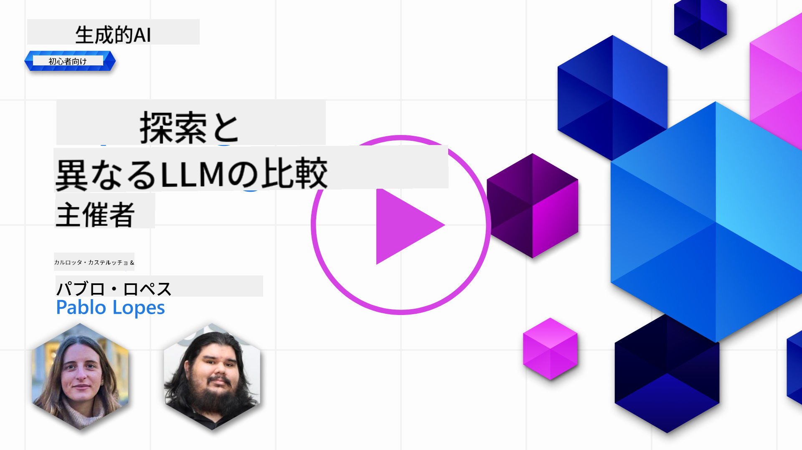
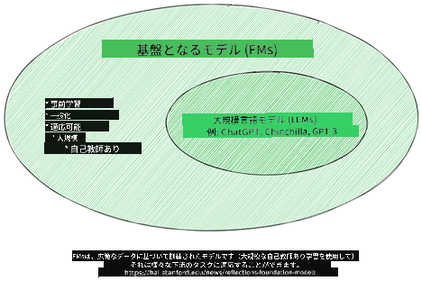
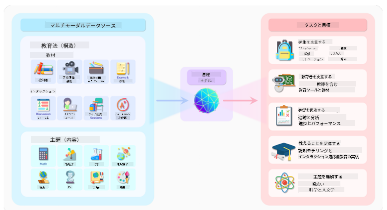
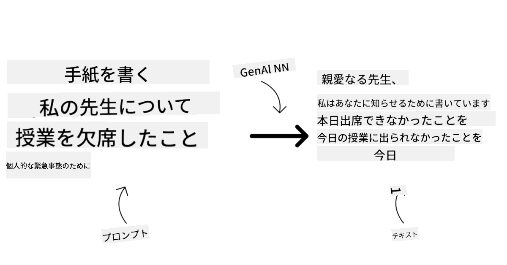
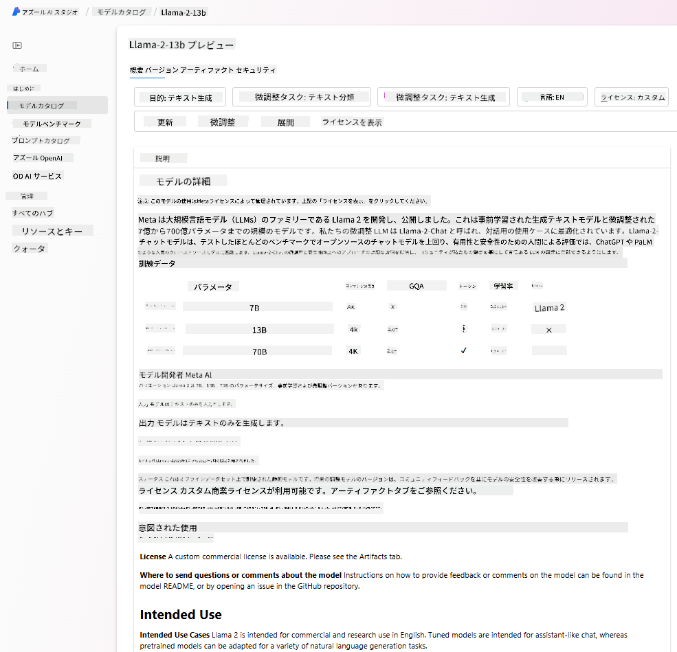
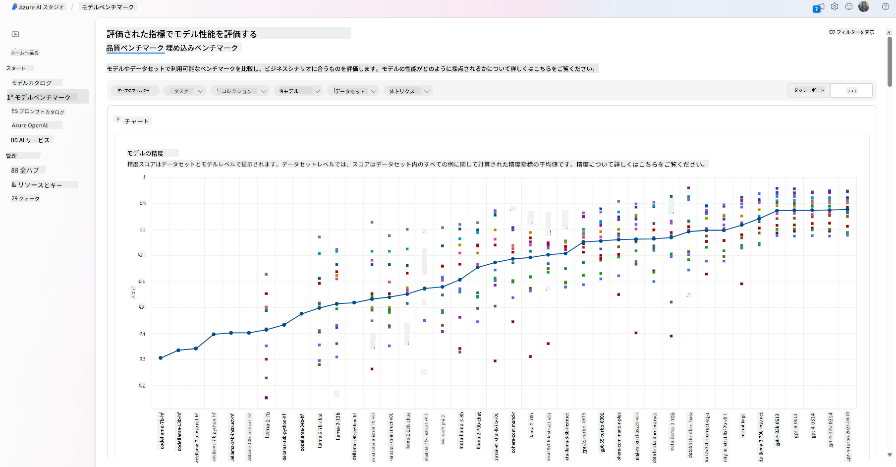
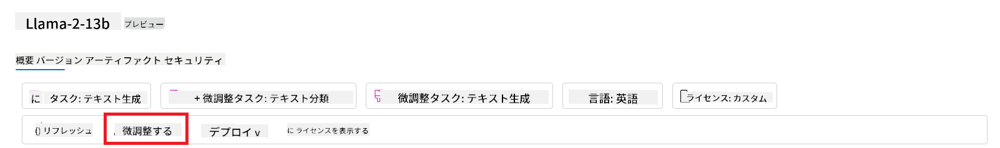
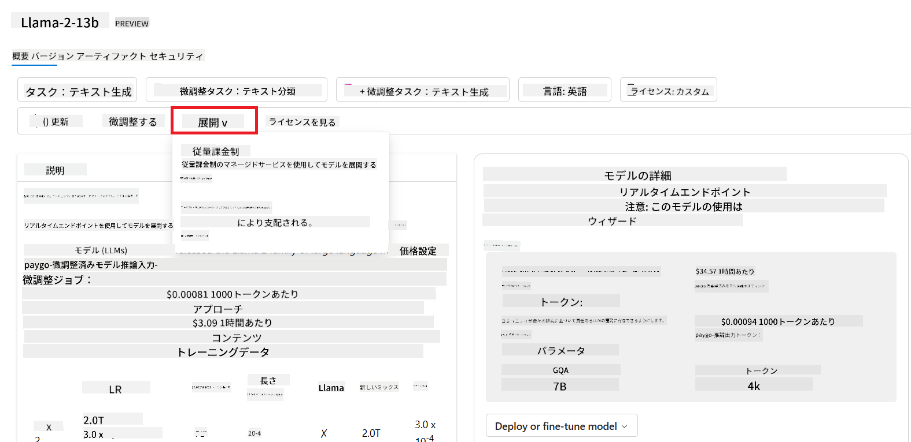
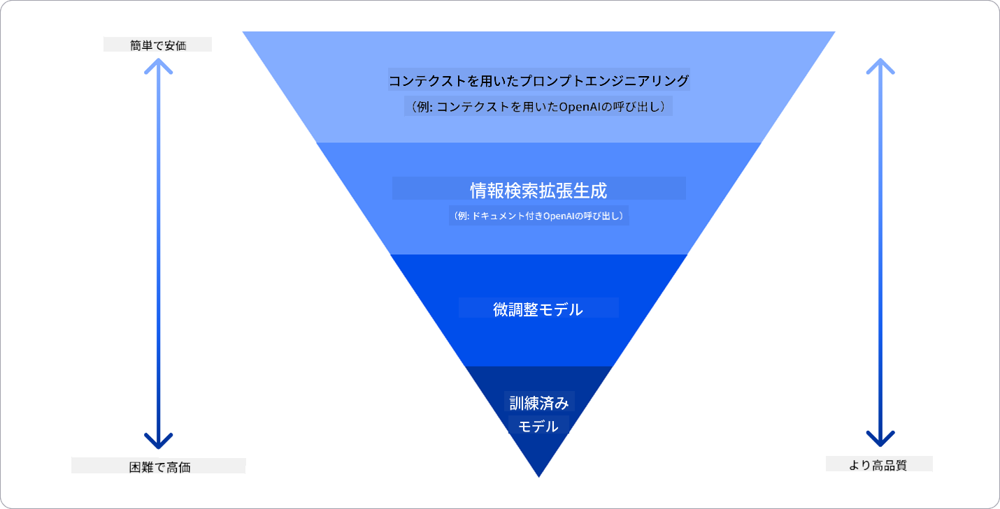

<!--
CO_OP_TRANSLATOR_METADATA:
{
  "original_hash": "e2f686f2eb794941761252ac5e8e090b",
  "translation_date": "2025-05-19T09:19:24+00:00",
  "source_file": "02-exploring-and-comparing-different-llms/README.md",
  "language_code": "ja"
}
-->
# 様々なLLMの探索と比較

> _上の画像をクリックするとこのレッスンのビデオが見られます_

前回のレッスンでは、生成AIが技術の風景をどのように変えているか、LLMがどのように機能するか、そして私たちのスタートアップのような企業がどのようにそれらを適用して成長するかを見てきました。この章では、様々な種類のLLMを比較してその利点と欠点を理解することを目指しています。

スタートアップの次のステップは、現在のLLMの状況を探り、どれが私たちのユースケースに適しているかを理解することです。

## はじめに

このレッスンでは以下をカバーします：

- 現在の状況における様々な種類のLLM。
- Azureでのユースケースに対する異なるモデルのテスト、反復、比較。
- LLMの展開方法。

## 学習目標

このレッスンを完了した後、あなたは以下ができるようになります：

- ユースケースに適したモデルを選択する。
- モデルの性能をテストし、反復し、改善する方法を理解する。
- 企業がどのようにモデルを展開するかを知る。

## 様々な種類のLLMを理解する

LLMは、そのアーキテクチャ、トレーニングデータ、ユースケースに基づいて複数のカテゴリに分けられます。これらの違いを理解することで、スタートアップはシナリオに適したモデルを選択し、性能をテスト、反復、改善する方法を理解できます。

LLMモデルには多くの種類があり、どのモデルを選ぶかは何に使うか、データ、支払い準備がどれくらいかなどによります。

テキスト、音声、動画、画像生成などの目的に応じて、異なるタイプのモデルを選ぶことができます。

- **音声認識**。この目的には、Whisperタイプのモデルが最適です。これらは汎用的で音声認識に特化しています。多様な音声でトレーニングされており、多言語の音声認識が可能です。詳細は[こちら](https://platform.openai.com/docs/models/whisper?WT.mc_id=academic-105485-koreyst)で確認できます。

- **画像生成**。画像生成には、DALL-EとMidjourneyが非常に有名な選択肢です。DALL-EはAzure OpenAIから提供されています。[DALL-Eについてはこちら](https://platform.openai.com/docs/models/dall-e?WT.mc_id=academic-105485-koreyst)およびこのカリキュラムの第9章でさらに詳しく説明しています。

- **テキスト生成**。ほとんどのモデルはテキスト生成にトレーニングされており、GPT-3.5からGPT-4まで多くの選択肢があります。GPT-4は最も高価です。[Azure OpenAI playground](https://oai.azure.com/portal/playground?WT.mc_id=academic-105485-koreyst)を使って、能力とコストに関してニーズに最適なモデルを評価する価値があります。

- **マルチモダリティ**。入力と出力で複数のデータタイプを扱いたい場合は、[gpt-4 turbo with visionやgpt-4o](https://learn.microsoft.com/azure/ai-services/openai/concepts/models#gpt-4-and-gpt-4-turbo-models?WT.mc_id=academic-105485-koreyst)などのモデルを検討する価値があります。これらは自然言語処理と視覚的理解を組み合わせ、マルチモーダルインターフェースを通じたインタラクションを可能にします。

モデルを選択することで基本的な能力を得ることができますが、それだけでは不十分な場合があります。企業特有のデータをLLMに伝える必要がある場合もあります。これに対するアプローチにはいくつかの選択肢があります。詳細は次のセクションで説明します。

### 基盤モデルとLLM

基盤モデルという用語は[スタンフォードの研究者によって](https://arxiv.org/abs/2108.07258?WT.mc_id=academic-105485-koreyst)造られ、以下のような基準に従うAIモデルとして定義されています：

- **教師なし学習または自己教師あり学習を使用してトレーニングされている**。つまり、ラベルのないマルチモーダルデータでトレーニングされており、人間の注釈やデータのラベル付けを必要としません。
- **非常に大きなモデル**であり、数十億のパラメータでトレーニングされた非常に深いニューラルネットワークに基づいています。
- **通常、他のモデルの「基盤」として機能することを目的としている**。つまり、他のモデルがその上に構築されるための出発点として使用できます。これは微調整によって行われます。

画像ソース：[Essential Guide to Foundation Models and Large Language Models | by Babar M Bhatti | Medium](https://thebabar.medium.com/essential-guide-to-foundation-models-and-large-language-models-27dab58f7404)

この区別をさらに明確にするために、ChatGPTを例にとりましょう。ChatGPTの最初のバージョンを構築するために、GPT-3.5というモデルが基盤モデルとして使用されました。これは、OpenAIがチャットに特化したデータを使用して、会話シナリオで優れた性能を発揮するようにGPT-3.5を調整したバージョンを作成したことを意味します。

画像ソース：[2108.07258.pdf (arxiv.org)](https://arxiv.org/pdf/2108.07258.pdf?WT.mc_id=academic-105485-koreyst)

### オープンソースとプロプライエタリモデル

LLMを分類するもう一つの方法は、それがオープンソースかプロプライエタリかです。

オープンソースモデルは、一般に公開されており、誰でも使用できるモデルです。これらは、作成した企業や研究コミュニティによって公開されることが多いです。これらのモデルは検査、変更、カスタマイズが許可されており、LLMの様々なユースケースに使用できます。しかし、必ずしも生産用に最適化されているわけではなく、プロプライエタリモデルほどの性能を持たない場合があります。また、オープンソースモデルの資金は限られており、長期的に維持されない場合や最新の研究で更新されない場合があります。人気のあるオープンソースモデルの例としては、[Alpaca](https://crfm.stanford.edu/2023/03/13/alpaca.html?WT.mc_id=academic-105485-koreyst)、[Bloom](https://huggingface.co/bigscience/bloom)、[LLaMA](https://llama.meta.com)などがあります。

プロプライエタリモデルは、企業が所有しており、一般に公開されていないモデルです。これらのモデルは、通常、生産用に最適化されています。しかし、異なるユースケースに対して検査、変更、カスタマイズすることは許可されていません。さらに、必ずしも無料で利用できるわけではなく、利用するためにはサブスクリプションや支払いが必要になる場合があります。また、モデルのトレーニングに使用されるデータに対してユーザーが制御できないため、データのプライバシーとAIの責任ある使用を確保するためにモデルの所有者に委託する必要があります。人気のあるプロプライエタリモデルの例としては、[OpenAIモデル](https://platform.openai.com/docs/models/overview?WT.mc_id=academic-105485-koreyst)、[Google Bard](https://sapling.ai/llm/bard?WT.mc_id=academic-105485-koreyst)、[Claude 2](https://www.anthropic.com/index/claude-2?WT.mc_id=academic-105485-koreyst)などがあります。

### 埋め込み、画像生成、テキストとコード生成

LLMは生成する出力によっても分類されます。

埋め込みは、テキストを数値形式に変換するモデルのセットであり、入力テキストの数値表現です。埋め込みは、単語や文の関係を理解しやすくし、分類モデルや数値データに対して性能が向上するクラスタリングモデルなど、他のモデルの入力として使用されます。埋め込みモデルは、データが豊富な代替タスクのためにモデルが構築され、その後他の下流タスクに対してモデルの重み（埋め込み）が再利用される転移学習にしばしば使用されます。このカテゴリの例としては、[OpenAI embeddings](https://platform.openai.com/docs/models/embeddings?WT.mc_id=academic-105485-koreyst)があります。

画像生成モデルは画像を生成するモデルです。これらのモデルは、画像編集、画像合成、画像翻訳にしばしば使用されます。画像生成モデルは、しばしば[LAION-5B](https://laion.ai/blog/laion-5b/?WT.mc_id=academic-105485-koreyst)のような大規模な画像データセットでトレーニングされ、新しい画像を生成したり、既存の画像をインペインティング、超解像、色付け技術で編集したりするために使用されます。例としては、[DALL-E-3](https://openai.com/dall-e-3?WT.mc_id=academic-105485-koreyst)や[Stable Diffusion models](https://github.com/Stability-AI/StableDiffusion?WT.mc_id=academic-105485-koreyst)があります。

テキストとコード生成モデルは、テキストやコードを生成するモデルです。これらのモデルは、テキスト要約、翻訳、質問応答にしばしば使用されます。テキスト生成モデルは、しばしば[BookCorpus](https://www.cv-foundation.org/openaccess/content_iccv_2015/html/Zhu_Aligning_Books_and_ICCV_2015_paper.html?WT.mc_id=academic-105485-koreyst)のような大規模なテキストデータセットでトレーニングされ、新しいテキストを生成したり、質問に答えたりするために使用されます。コード生成モデルは、[CodeParrot](https://huggingface.co/codeparrot?WT.mc_id=academic-105485-koreyst)のように、しばしばGitHubのような大規模なコードデータセットでトレーニングされ、新しいコードを生成したり、既存のコードのバグを修正したりするために使用されます。

### エンコーダーデコーダーとデコーダーのみ

LLMの様々なアーキテクチャのタイプについて話すために、アナロジーを使いましょう。

あなたの上司が学生向けのクイズを書くタスクを与えたとします。あなたには2人の同僚がいて、一人はコンテンツの作成を担当し、もう一人はそれをレビューする役割です。

コンテンツ作成者はデコーダーのみのモデルのようなもので、トピックを見てあなたがすでに書いたものを見て、その基にコースを書くことができます。彼らは非常に魅力的で情報豊富なコンテンツを書くのが得意ですが、トピックや学習目標を理解するのはあまり得意ではありません。デコーダーモデルの例としては、GPTファミリーモデル、例えばGPT-3があります。

レビュアーはエンコーダーのみのモデルのようなもので、書かれたコースと回答を見て、それらの関係を理解し、コンテキストを理解しますが、コンテンツを生成するのは得意ではありません。エンコーダーのみのモデルの例としてはBERTがあります。

クイズを作成しレビューすることができる誰かがいると想像してください。これがエンコーダーデコーダーモデルです。例としてはBARTやT5があります。

### サービスとモデル

次に、サービスとモデルの違いについて話しましょう。サービスはクラウドサービスプロバイダーによって提供される製品であり、通常、モデル、データ、その他のコンポーネントの組み合わせです。モデルはサービスの核心部分であり、通常、LLMのような基盤モデルです。

サービスは通常、生産用に最適化されており、グラフィカルユーザーインターフェースを介してモデルよりも使いやすいです。しかし、サービスは必ずしも無料で利用できるわけではなく、使用するためにはサブスクリプションや支払いが必要になる場合があります。これはサービスの所有者の設備とリソースを利用し、費用を最適化し、容易にスケールするためです。サービスの例としては、[Azure OpenAI Service](https://learn.microsoft.com/azure/ai-services/openai/overview?WT.mc_id=academic-105485-koreyst)があり、利用量に応じて料金が発生する従量制プランを提供しています。また、Azure OpenAI Serviceはモデルの能力に加えて、企業向けのセキュリティとAIの責任ある使用のフレームワークを提供しています。

モデルはただのニューラルネットワークであり、パラメータ、重みなどを含んでいます。企業がローカルで実行することを可能にしますが、機器を購入し、スケールするための構造を構築し、ライセンスを購入するかオープンソースモデルを使用する必要があります。モデルとしては、LLaMAが利用可能であり、モデルを実行するための計算能力が必要です。

## Azureでの性能を理解するための異なるモデルのテストと反復の方法

チームが現在のLLMの状況を探り、シナリオに適した候補を特定した後、次のステップはデータとワークロードでのテストです。これは実験と測定による反復プロセスです。
前の段落で述べたほとんどのモデル（OpenAIモデル、Llama2のようなオープンソースモデル、Hugging Face transformers）は、[Azure AI Studio](https://ai.azure.com/?WT.mc_id=academic-105485-koreyst)の[モデルカタログ](https://learn.microsoft.com/azure/ai-studio/how-to/model-catalog-overview?WT.mc_id=academic-105485-koreyst)で利用可能です。

[Azure AI Studio](https://learn.microsoft.com/azure/ai-studio/what-is-ai-studio?WT.mc_id=academic-105485-koreyst)は、開発者が生成AIアプリケーションを構築し、実験から評価までの開発ライフサイクル全体を管理するために設計されたクラウドプラットフォームです。すべてのAzure AIサービスを1つのハブに統合した便利なGUIを提供しています。Azure AI Studioのモデルカタログでは、ユーザーが以下を行えます：

- カタログで興味のある基盤モデルを見つける - プロプライエタリまたはオープンソース、タスク、ライセンス、名前でフィルタリング。検索性を向上させるために、モデルはAzure OpenAIコレクション、Hugging Faceコレクションなどのコレクションに整理されています。

- モデルカードをレビューし、意図された使用法とトレーニングデータの詳細な説明、コードサンプル、内部評価ライブラリでの評価結果を確認。

- 業界で利用可能なモデルとデータセットのベンチマークを比較し、ビジネスシナリオに適したものを評価するために、[モデルベンチマーク](https://learn.microsoft.com/azure/ai-studio/how-to/model-benchmarks?WT.mc_id=academic-105485-koreyst) ペインを使用します。

- 特定のワークロードでモデルの性能を向上させるために、カスタムトレーニングデータでモデルを微調整し、Azure AI Studioの実験と追跡機能を活用します。

- 元の事前学習済みモデルまたは微調整版をリモートリアルタイム推論 - 管理コンピュート - またはサーバーレスAPIエンドポイント - [従量課金](https://learn.microsoft.com/azure/ai-studio/how-to/model-catalog-overview#model-deployment-managed-compute-and-serverless-api-pay-as-you-go?WT.mc_id=academic-105485-koreyst) - にデプロイし、アプリケーションがそれを利用できるようにします。

> [!NOTE]
> カタログ内のすべてのモデルが現在微調整および/または従量課金デプロイメントに利用可能ではありません。モデルの能力と制限の詳細はモデルカードを確認してください。

## LLM結果の改善

私たちのスタートアップチームは、異なる種類のLLMとクラウドプラットフォーム（Azure Machine Learning）を探索し、異なるモデルを比較し、テストデータで評価し、性能を向上させ、推論エンドポイントにデプロイすることができました。

しかし、事前学習済みモデルを使用するのではなく、モデルを微調整するのはいつが良いでしょうか？特定のワークロードでモデルの性能を向上させるための他のアプローチはありますか？

ビジネスがLLMから必要な結果を得るためには、いくつかのアプローチがあります。生産環境でLLMをデプロイする際に、異なるトレーニング度合いの異なる種類のモデルを選択でき、複雑さ、コスト、品質が異なります。以下にいくつかの異なるアプローチを示します：

- **コンテキストを用いたプロンプトエンジニアリング**。プロンプトをする際に十分なコンテキストを提供することで、必要な応答を得ることができます。

- **Retrieval Augmented Generation, RAG**。例えばデータがデータベースやウェブエンドポイントに存在する場合、そのデータまたはその一部がプロンプト時に含まれるように、関連するデータを取得してユーザーのプロンプトの一部とすることができます。

- **微調整モデル**。ここでは、モデルを独自のデータでさらにトレーニングし、モデルがより正確でニーズに応じたものになりますが、費用がかかる可能性があります。

画像出典: [企業がLLMsをデプロイする4つの方法 | Fiddler AI Blog](https://www.fiddler.ai/blog/four-ways-that-enterprises-deploy-llms?WT.mc_id=academic-105485-koreyst)

### コンテキストを用いたプロンプトエンジニアリング

事前学習済みLLMは、短いプロンプト（例えば、完了するべき文や質問）で呼び出すだけでも、一般化された自然言語タスクで非常に良く機能します。これはいわゆる「ゼロショット」学習です。

しかし、ユーザーが詳細な要求と例を用いてクエリをフレームするほど、つまりコンテキストを提供するほど、回答はより正確でユーザーの期待に近いものになります。この場合、プロンプトに例が1つだけ含まれている場合は「ワンショット」学習と呼び、複数の例が含まれている場合は「少数ショット学習」と呼びます。コンテキストを用いたプロンプトエンジニアリングは、最も費用対効果の高いアプローチです。

### Retrieval Augmented Generation (RAG)

LLMは、トレーニング時に使用されたデータだけを使用して回答を生成するという制限があります。これは、トレーニングプロセス後に起こった事実について何も知らないことを意味し、非公開情報（例えば企業データ）にアクセスできないことを意味します。
これを克服するために、RAGという技術があり、プロンプトを外部データのチャンクで拡張し、プロンプトの長さの制限を考慮します。これは、様々な事前定義されたデータソースから有用なチャンクを取得し、プロンプトコンテキストに追加するVectorデータベースツール（例えば [Azure Vector Search](https://learn.microsoft.com/azure/search/vector-search-overview?WT.mc_id=academic-105485-koreyst)）によってサポートされています。

この技術は、ビジネスが十分なデータや時間、リソースがない場合でも、特定のワークロードで性能を向上させ、現実の歪曲や有害なコンテンツのリスクを軽減したい場合に非常に役立ちます。

### 微調整モデル

微調整は、トランスファーラーニングを活用してモデルを下流タスクに「適応」させたり、特定の問題を解決したりするプロセスです。少数ショット学習やRAGとは異なり、新しいモデルが生成され、更新された重みとバイアスを持ちます。プロンプト（入力）とその関連する出力（完了）からなるトレーニング例のセットが必要です。
以下の場合に推奨されるアプローチです：

- **微調整モデルの使用**。ビジネスが高性能モデルよりも微調整された能力の低いモデル（埋め込みモデルなど）を使用したい場合、より費用対効果が高く迅速なソリューションが得られます。

- **レイテンシーの考慮**。特定のユースケースにおいてレイテンシーが重要であるため、非常に長いプロンプトを使用することができない場合や、モデルが学習するべき例の数がプロンプトの長さの制限に合わない場合。

- **最新の状態を維持**。ビジネスが高品質のデータと真実のラベルを持ち、このデータを時間とともに最新の状態に保つためのリソースを持っている場合。

### トレーニング済みモデル

LLMをゼロからトレーニングすることは、間違いなく最も困難で複雑なアプローチであり、大量のデータ、熟練したリソース、適切な計算能力を必要とします。このオプションは、ビジネスがドメイン固有のユースケースと大量のドメイン中心のデータを持っている場合にのみ考慮されるべきです。

## 知識チェック

LLMの完了結果を改善するための良いアプローチは何ですか？

1. コンテキストを用いたプロンプトエンジニアリング
1. RAG
1. 微調整モデル

A:3、時間とリソースがあり高品質のデータがある場合、微調整が最新の状態を維持するためのより良いオプションです。しかし、改善を目指していて時間がない場合は、まずRAGを検討する価値があります。

## 🚀 チャレンジ

ビジネスで[RAGを使用する方法](https://learn.microsoft.com/azure/search/retrieval-augmented-generation-overview?WT.mc_id=academic-105485-koreyst)についてさらに調べてみましょう。

## 素晴らしい仕事、学習を続けましょう

このレッスンを完了した後、[生成AI学習コレクション](https://aka.ms/genai-collection?WT.mc_id=academic-105485-koreyst)をチェックして、生成AIの知識をさらに向上させましょう！

レッスン3に進み、[責任を持って生成AIを構築する方法](../03-using-generative-ai-responsibly/README.md?WT.mc_id=academic-105485-koreyst)を見てみましょう！

**免責事項**:  
この文書はAI翻訳サービス[Co-op Translator](https://github.com/Azure/co-op-translator)を使用して翻訳されています。正確さを期していますが、自動翻訳には誤りや不正確さが含まれる可能性があることをご了承ください。原文は権威ある情報源とみなされるべきです。重要な情報については、専門の人間による翻訳をお勧めします。この翻訳の使用に起因する誤解や誤訳について、当社は責任を負いません。