<!--
CO_OP_TRANSLATOR_METADATA:
{
  "original_hash": "e2f686f2eb794941761252ac5e8e090b",
  "translation_date": "2025-06-25T10:23:26+00:00",
  "source_file": "02-exploring-and-comparing-different-llms/README.md",
  "language_code": "ja"
}
-->
# 異なるLLMの探索と比較

[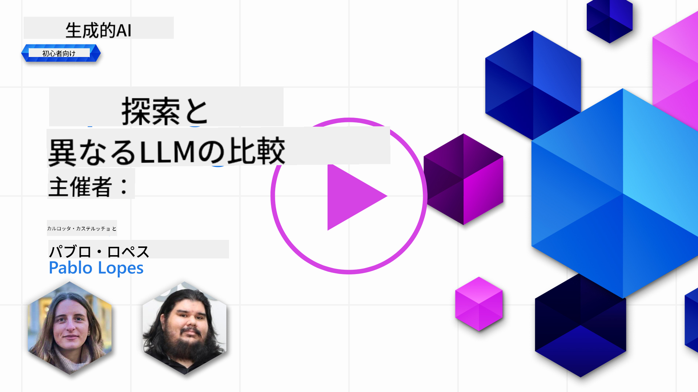](https://aka.ms/gen-ai-lesson2-gh?WT.mc_id=academic-105485-koreyst)

> _上の画像をクリックすると、このレッスンのビデオが表示されます_

前回のレッスンでは、生成AIが技術の風景をどのように変えているか、LLM（大規模言語モデル）がどのように機能するか、そして私たちのスタートアップのようなビジネスがそれらをどのように活用して成長できるかを見てきました。この章では、異なるタイプのLLMを比較し、それらの長所と短所を理解します。

私たちのスタートアップの次のステップは、現在のLLMの状況を探り、どれが私たちのユースケースに適しているかを理解することです。

## はじめに

このレッスンでは以下をカバーします:

- 現在の状況におけるさまざまなタイプのLLM
- Azureでのユースケースに適したモデルのテスト、反復、および比較
- LLMのデプロイ方法

## 学習目標

このレッスンを完了すると、次のことができるようになります:

- ユースケースに適したモデルを選択する
- モデルのテスト、反復、パフォーマンス向上の方法を理解する
- ビジネスがモデルをどのようにデプロイするかを知る

## 異なるタイプのLLMを理解する

LLMは、そのアーキテクチャ、トレーニングデータ、ユースケースに基づいて複数の分類が可能です。これらの違いを理解することで、私たちのスタートアップはシナリオに適したモデルを選択し、テスト、反復、パフォーマンス向上の方法を理解できます。

LLMモデルには多くの種類があり、どのモデルを選ぶかは、使用目的、データ、支払う用意のある金額などによります。

テキスト、オーディオ、ビデオ、画像生成などにモデルを使用することを目的とする場合、異なるタイプのモデルを選択するかもしれません。

- **オーディオと音声認識**。この目的には、Whisperタイプのモデルが優れた選択肢です。これらは汎用目的で音声認識を目指しています。多様なオーディオでトレーニングされており、多言語の音声認識が可能です。詳細は[こちらでWhisperタイプモデルについて学ぶ](https://platform.openai.com/docs/models/whisper?WT.mc_id=academic-105485-koreyst)ことができます。

- **画像生成**。画像生成には、DALL-EやMidjourneyが非常によく知られた選択肢です。DALL-EはAzure OpenAIで提供されています。[DALL-Eについてはこちらで詳細を読む](https://platform.openai.com/docs/models/dall-e?WT.mc_id=academic-105485-koreyst)ことができ、このカリキュラムの第9章でも取り上げられています。

- **テキスト生成**。ほとんどのモデルはテキスト生成にトレーニングされており、GPT-3.5からGPT-4まで多くの選択肢があります。それらは異なるコストで提供され、GPT-4が最も高価です。[Azure OpenAIプレイグラウンド](https://oai.azure.com/portal/playground?WT.mc_id=academic-105485-koreyst)で、機能とコストの観点からどのモデルがニーズに最も適しているかを評価する価値があります。

- **マルチモダリティ**。入力と出力の複数のデータタイプを扱いたい場合、[gpt-4 turbo with visionやgpt-4o](https://learn.microsoft.com/azure/ai-services/openai/concepts/models#gpt-4-and-gpt-4-turbo-models?WT.mc_id=academic-105485-koreyst)のようなモデルを検討することができます。これらはOpenAIモデルの最新リリースで、自然言語処理と視覚理解を組み合わせ、マルチモーダルインターフェースを通じたインタラクションを可能にします。

モデルを選択することは、基本的な機能を得ることを意味しますが、それだけでは不十分かもしれません。多くの場合、会社特有のデータをLLMに伝える必要があります。それにアプローチする方法はいくつかあり、次のセクションで詳しく説明します。

### 基盤モデルとLLM

基盤モデルという用語は[スタンフォードの研究者によって提唱](https://arxiv.org/abs/2108.07258?WT.mc_id=academic-105485-koreyst)され、いくつかの基準を満たすAIモデルとして定義されています。

- **無監督学習または自己監督学習を使用してトレーニングされている**。つまり、ラベルのないマルチモーダルデータでトレーニングされ、データの人間による注釈やラベル付けを必要としません。
- **非常に大きなモデルである**。非常に深いニューラルネットワークに基づいており、数十億のパラメータでトレーニングされています。
- **通常、他のモデルの「基盤」として機能することを意図している**。つまり、他のモデルを構築するための出発点として使用でき、微調整によって行うことができます。

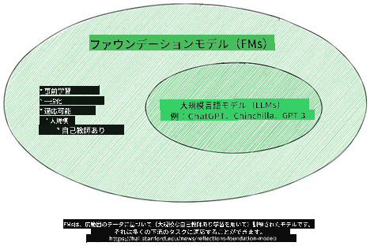

画像出典: [Essential Guide to Foundation Models and Large Language Models | by Babar M Bhatti | Medium](https://thebabar.medium.com/essential-guide-to-foundation-models-and-large-language-models-27dab58f7404)

この区別をさらに明確にするために、ChatGPTを例に取りましょう。ChatGPTの最初のバージョンを構築するために、GPT-3.5というモデルが基盤モデルとして使用されました。これは、OpenAIがチャット特有のデータを使用して、会話シナリオで優れた性能を発揮するようにGPT-3.5を調整したことを意味します。

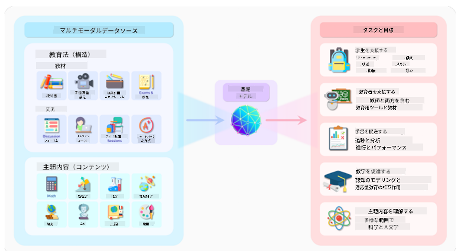

画像出典: [2108.07258.pdf (arxiv.org)](https://arxiv.org/pdf/2108.07258.pdf?WT.mc_id=academic-105485-koreyst)

### オープンソースモデルとプロプライエタリモデル

LLMを分類するもう一つの方法は、それらがオープンソースかプロプライエタリかによります。

オープンソースモデルは、一般に公開され、誰でも使用できるモデルです。これらはしばしば、作成した会社や研究コミュニティによって公開されます。これらのモデルは、LLMのさまざまなユースケースに合わせて検査、修正、カスタマイズすることが許可されています。ただし、必ずしもプロダクションでの使用に最適化されているわけではなく、プロプライエタリモデルほど性能が高くない場合があります。また、オープンソースモデルへの資金提供は限られていることがあり、長期的に維持されない場合や最新の研究で更新されない場合があります。人気のあるオープンソースモデルの例には、[Alpaca](https://crfm.stanford.edu/2023/03/13/alpaca.html?WT.mc_id=academic-105485-koreyst)、[Bloom](https://huggingface.co/bigscience/bloom)、[LLaMA](https://llama.meta.com)があります。

プロプライエタリモデルは、企業が所有し、一般に公開されていないモデルです。これらのモデルはしばしばプロダクションでの使用に最適化されています。ただし、さまざまなユースケースに合わせて検査、修正、カスタマイズすることは許可されていません。また、無料で利用できないことがあり、使用するためにサブスクリプションや支払いが必要な場合があります。また、モデルのトレーニングに使用されるデータをユーザーが制御できないため、データのプライバシーとAIの責任ある使用に対するコミットメントをモデル所有者に委ねる必要があります。人気のあるプロプライエタリモデルの例には、[OpenAIモデル](https://platform.openai.com/docs/models/overview?WT.mc_id=academic-105485-koreyst)、[Google Bard](https://sapling.ai/llm/bard?WT.mc_id=academic-105485-koreyst)、[Claude 2](https://www.anthropic.com/index/claude-2?WT.mc_id=academic-105485-koreyst)があります。

### 埋め込みと画像生成、テキストとコード生成

LLMは生成する出力によっても分類できます。

埋め込みは、テキストを数値形式に変換できるモデルのセットであり、入力テキストの数値表現です。埋め込みは、機械が単語や文の関係を理解しやすくし、分類モデルや数値データでより良い性能を発揮するクラスタリングモデルなど、他のモデルの入力として消費できます。埋め込みモデルは、データが豊富な代替タスクのためにモデルを構築し、その後、モデルの重み（埋め込み）を他の下流タスクに再利用する転移学習によく使用されます。このカテゴリの例としては、[OpenAI埋め込み](https://platform.openai.com/docs/models/embeddings?WT.mc_id=academic-105485-koreyst)があります。

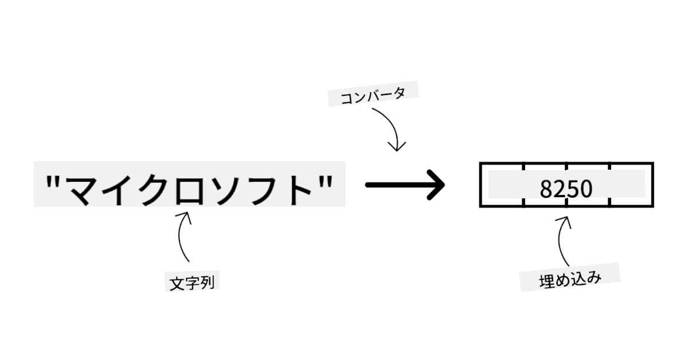

画像生成モデルは、画像を生成するモデルです。これらのモデルはしばしば画像編集、画像合成、画像翻訳に使用されます。画像生成モデルは、[LAION-5B](https://laion.ai/blog/laion-5b/?WT.mc_id=academic-105485-koreyst)などの大規模な画像データセットでトレーニングされ、新しい画像を生成したり、既存の画像をインペインティング、超解像、カラー化技術で編集するために使用できます。例には、[DALL-E-3](https://openai.com/dall-e-3?WT.mc_id=academic-105485-koreyst)や[Stable Diffusionモデル](https://github.com/Stability-AI/StableDiffusion?WT.mc_id=academic-105485-koreyst)があります。

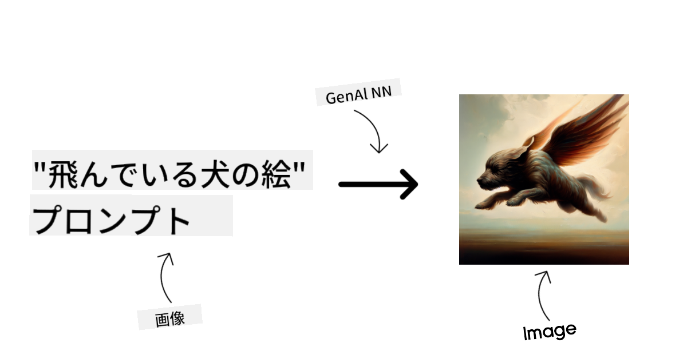

テキストとコード生成モデルは、テキストまたはコードを生成するモデルです。これらのモデルはしばしばテキスト要約、翻訳、質問応答に使用されます。テキスト生成モデルは、[BookCorpus](https://www.cv-foundation.org/openaccess/content_iccv_2015/html/Zhu_Aligning_Books_and_ICCV_2015_paper.html?WT.mc_id=academic-105485-koreyst)などの大規模なテキストデータセットでトレーニングされ、新しいテキストを生成したり、質問に答えるために使用できます。コード生成モデルは、GitHubなどの大規模なコードデータセットでトレーニングされ、新しいコードを生成したり、既存のコードのバグを修正するために使用できます。

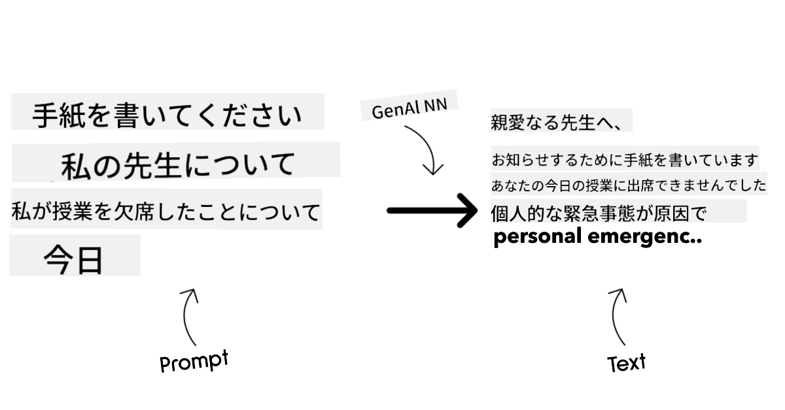

### エンコーダーデコーダーとデコーダーのみ

LLMの異なるタイプのアーキテクチャについて話すために、アナロジーを使いましょう。

あなたのマネージャーが学生のためのクイズを書くタスクを与えたとします。あなたには2人の同僚がいます。一人はコンテンツの作成を担当し、もう一人はそれをレビューする役割を担っています。

コンテンツ作成者はデコーダーのみのモデルのようなもので、トピックを見て、あなたがすでに書いたものを見て、それに基づいてコースを書くことができます。彼らは魅力的で情報豊富なコンテンツを書くのが得意ですが、トピックや学習目標を理解するのは得意ではありません。デコーダーモデルの例としては、GPTファミリーモデル（GPT-3など）があります。

レビュアーはエンコーダーのみのモデルのようなもので、書かれたコースと回答を見て、それらの関係を理解し、文脈を理解しますが、コンテンツの生成は得意ではありません。エンコーダーのみのモデルの例としては、BERTがあります。

クイズを作成しレビューすることができる誰かもいると想像してください。これがエンコーダーデコーダーモデルです。例としては、BARTやT5があります。

### サービスとモデル

次に、サービスとモデルの違いについて話しましょう。サービスはクラウドサービスプロバイダーが提供する製品であり、通常はモデル、データ、その他のコンポーネントの組み合わせです。モデルはサービスのコアコンポーネントであり、しばしばLLMのような基盤モデルです。

サービスは通常、プロダクションでの使用に最適化されており、グラフィカルユーザーインターフェースを介してモデルよりも使いやすいことがよくあります。ただし、サービスは必ずしも無料で利用できるわけではなく、使用するためにサブスクリプションや支払いが必要な場合がありますが、サービス所有者の設備とリソースを活用することで、費用を最適化し、簡単にスケーリングできます。サービスの例としては、[Azure OpenAI Service](https://learn.microsoft.com/azure/ai-services/openai/overview?WT.mc_id=academic-105485-koreyst)があり、利用量に応じて料金が課金される従量課金制の料金プランを提供しています。また、Azure OpenAI Serviceは、モデルの機能の上にエンタープライズグレードのセキュリティと責任あるAIフレームワークを提供しています。

モデルはニューラルネットワークそのものであり、パラメータ、重みなどを含みます。企業がローカルで実行することを許可するためには、設備を購入し、スケールするための構造を構築し、ライセンスを購入するかオープンソースモデルを使用する必要があります。LLaMAのようなモデルは使用可能であり、モデルを実行するための計算能力が必要です。

## Azureでパフォーマンスを理解するために異なるモデルをテストし反復する方法

チームが現在のLLMの状況を調査し、シナリオに適した候補を特定したら、次のステップはデータとワークロードでそれらをテストすることです。これは実験と測定によって行われる反復的なプロセスです。前の段落で言及したほとんどのモデル（OpenAIモデル、Llama2のようなオープンソースモデル、Hugging Faceトランスフォーマー）は、[Azure AI Studio](https://ai.azure.com/?WT.mc_id=academic-105485-koreyst)の[モデルカタログ](https://learn.microsoft.com/azure/ai-studio/how-to/model-catalog-overview?WT.mc_id=academic-105485-koreyst)で利用可能です。

[Azure AI Studio](https://learn.microsoft.com/azure/ai-studio/what-is-ai-studio?WT.mc_id=academic-105485-koreyst)は、開発者が生成AIアプリケーションを構築し、実験から評価までの開発ライフサイクル全体を管理するために設計されたクラウドプラットフォームであり、すべてのAzure AIサービスを1つのハブに統合し、便利なGUIを提供しています。Azure AI Studioのモデルカタログでは、ユーザーが次のことを行えます。

- カタログで関心のある基盤モデルを見つける - プロプライエタリまたはオープンソースのいずれかを、タスク、ライセンス、または名前でフィルタリングします。検索性を向上させるために、モデルはAzure OpenAIコレクション、Hugging Faceコレクションなどのコレクションに整理されています。

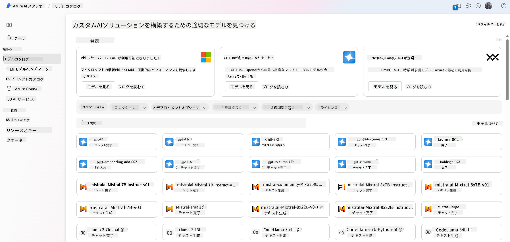

- モデルカードをレビューし、意図された使用法とトレーニングデータ
- 業界で利用可能なモデルとデータセットを比較し、ビジネスシナリオに適したものを評価するために、[Model Benchmarks](https://learn.microsoft.com/azure/ai-studio/how-to/model-benchmarks?WT.mc_id=academic-105485-koreyst) ペインを利用します。

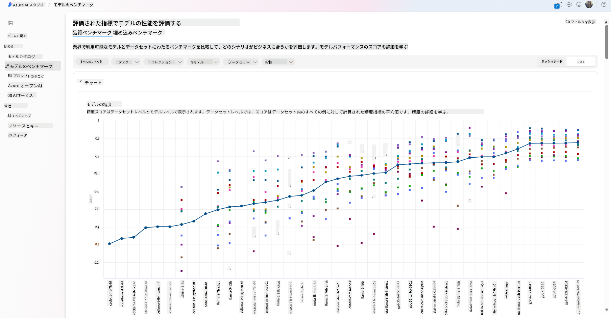

- 特定のワークロードにおけるモデルのパフォーマンスを向上させるために、カスタムトレーニングデータでモデルを微調整し、Azure AI Studioの実験と追跡機能を活用します。

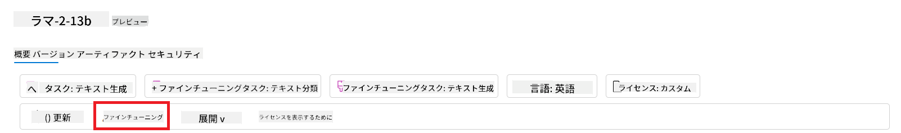

- オリジナルの事前トレーニング済みモデルまたは微調整版を、リモートのリアルタイム推論 - 管理されたコンピュート - またはサーバーレスAPIエンドポイント - [従量課金制](https://learn.microsoft.com/azure/ai-studio/how-to/model-catalog-overview#model-deployment-managed-compute-and-serverless-api-pay-as-you-go?WT.mc_id=academic-105485-koreyst) - にデプロイし、アプリケーションが利用できるようにします。

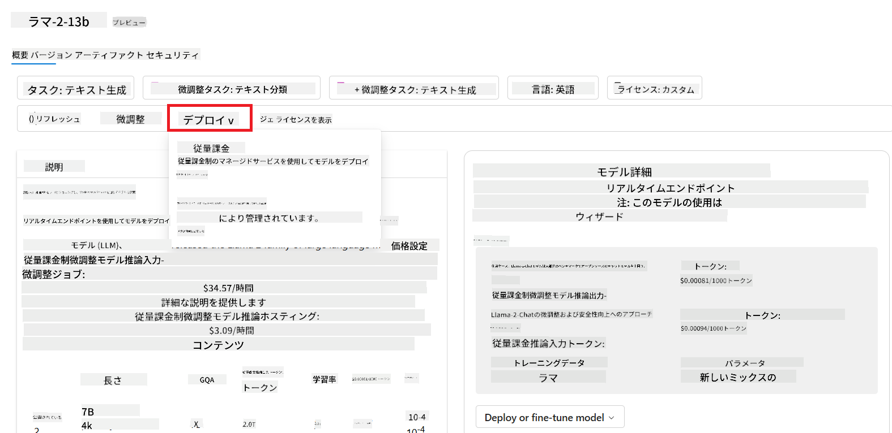

> [!NOTE]
> カタログ内のすべてのモデルが現在微調整および/または従量課金制のデプロイメントに対応しているわけではありません。モデルの能力と制限に関する詳細は、モデルカードを確認してください。

## LLM結果の改善

私たちのスタートアップチームは、さまざまな種類のLLMと、異なるモデルを比較し、テストデータで評価し、パフォーマンスを向上させ、推論エンドポイントにデプロイすることを可能にするクラウドプラットフォーム（Azure Machine Learning）を探求しました。

しかし、いつ事前トレーニング済みモデルではなく微調整を考慮すべきでしょうか？特定のワークロードでモデルのパフォーマンスを向上させる他のアプローチはありますか？

ビジネスがLLMから必要な結果を得るために使用できるいくつかのアプローチがあります。生産環境でLLMをデプロイする際に、異なるトレーニング度合いを持つ異なるタイプのモデルを選択することができ、複雑さ、コスト、品質のレベルが異なります。以下はいくつかの異なるアプローチです：

- **コンテキストを伴うプロンプトエンジニアリング**。プロンプトを与える際に十分なコンテキストを提供することで、必要な応答を確実に得るというアイデアです。

- **情報検索強化生成（RAG）**。データがデータベースやウェブエンドポイントに存在する場合、プロンプト時にそのデータまたはそのサブセットを含めるために、関連するデータを取得し、ユーザーのプロンプトの一部にすることができます。

- **微調整モデル**。ここでは、自分のデータでモデルをさらにトレーニングし、ニーズにより正確で応答性の高いモデルを作成しますが、コストがかかる可能性があります。

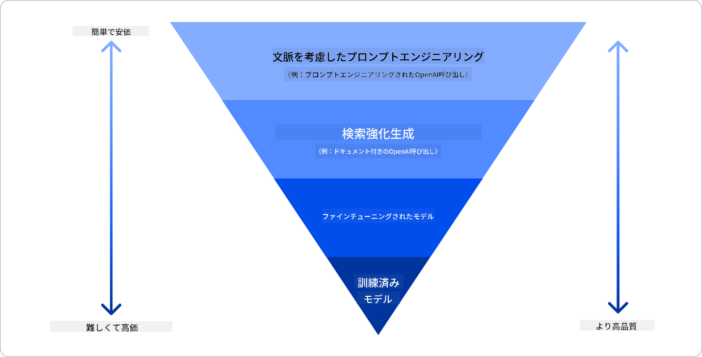

画像出典: [Four Ways that Enterprises Deploy LLMs | Fiddler AI Blog](https://www.fiddler.ai/blog/four-ways-that-enterprises-deploy-llms?WT.mc_id=academic-105485-koreyst)

### コンテキストを伴うプロンプトエンジニアリング

事前トレーニング済みのLLMは、短いプロンプト、例えば完了するべき文や質問といったもので呼び出しても、一般化された自然言語タスクで非常にうまく機能します。これはいわゆる「ゼロショット」学習です。

しかし、ユーザーが詳細なリクエストと例を含めたコンテキストでクエリをフレーム化できるほど、回答はユーザーの期待により正確で近くなります。この場合、プロンプトに1つの例しか含まれていない場合は「ワンショット」学習、複数の例が含まれている場合は「少数ショット」学習と呼びます。コンテキストを伴うプロンプトエンジニアリングは、最もコスト効果の高いアプローチです。

### 情報検索強化生成（RAG）

LLMは、トレーニング中に使用されたデータのみを使用して回答を生成できるという制限があります。これは、トレーニングプロセス後に発生した事実について何も知らず、非公開情報（企業データなど）にアクセスできないことを意味します。
これを克服するために、RAGは、プロンプトの長さの制限を考慮しながら、外部データをドキュメントのチャンクとしてプロンプトに追加する技術です。これは、さまざまな事前定義されたデータソースから有用なチャンクを取得し、プロンプトコンテキストに追加するベクターデータベースツール（[Azure Vector Search](https://learn.microsoft.com/azure/search/vector-search-overview?WT.mc_id=academic-105485-koreyst)など）によってサポートされています。

この技術は、LLMを微調整するための十分なデータ、時間、リソースがないが、特定のワークロードでパフォーマンスを向上させ、虚構のリスク、すなわち現実の神秘化や有害なコンテンツを減少させたい企業にとって非常に役立ちます。

### 微調整モデル

微調整は、転移学習を利用してモデルを下流タスクに「適応」させるか、特定の問題を解決するプロセスです。少数ショット学習やRAGとは異なり、新しいモデルが生成され、重みとバイアスが更新されます。プロンプト（入力）とそれに関連する完了（出力）からなるトレーニング例のセットが必要です。
このアプローチは以下の場合に推奨されます：

- **微調整モデルの使用**。企業は、パフォーマンスの高いモデルではなく、微調整された能力の低いモデル（埋め込みモデルなど）を使用したいと考えており、よりコスト効果が高く迅速な解決策を求めています。

- **レイテンシーの考慮**。特定のユースケースにおいてレイテンシーが重要であり、非常に長いプロンプトを使用できないか、モデルが学習すべき例の数がプロンプトの長さの制限に合わない場合。

- **最新情報の維持**。企業は、高品質なデータと真実のラベルを多く持ち、このデータを時間とともに最新の状態に保つために必要なリソースを持っています。

### トレーニング済みモデル

LLMをゼロからトレーニングすることは、間違いなく最も難しく、最も複雑なアプローチであり、大量のデータ、熟練したリソース、適切な計算能力を必要とします。このオプションは、企業がドメイン固有のユースケースと大量のドメイン中心のデータを持っているシナリオでのみ検討されるべきです。

## 知識チェック

LLMの完了結果を改善するための良いアプローチは何でしょうか？

1. コンテキストを伴うプロンプトエンジニアリング
2. RAG
3. 微調整モデル

A:3、時間とリソース、高品質なデータがある場合、微調整が最新の状態を保つためのより良いオプションです。しかし、改善を目指していて時間がない場合は、まずRAGを考慮する価値があります。

## 🚀 チャレンジ

あなたのビジネスにRAGを[どのように利用できるか](https://learn.microsoft.com/azure/search/retrieval-augmented-generation-overview?WT.mc_id=academic-105485-koreyst)についてもっと学びましょう。

## 素晴らしい仕事、学習を続けましょう

このレッスンを終えた後、[生成AI学習コレクション](https://aka.ms/genai-collection?WT.mc_id=academic-105485-koreyst)をチェックして、生成AIの知識をさらに高めましょう！

レッスン3に進んで、[生成AIを責任を持って構築する方法](../03-using-generative-ai-responsibly/README.md?WT.mc_id=academic-105485-koreyst)を見てみましょう！

**免責事項**:
この文書は、AI翻訳サービス[Co-op Translator](https://github.com/Azure/co-op-translator)を使用して翻訳されています。正確さを追求していますが、自動翻訳には誤りや不正確さが含まれる可能性があることをご了承ください。原文はその言語での権威ある情報源とみなされるべきです。重要な情報については、専門の人間による翻訳をお勧めします。この翻訳の使用に起因する誤解や誤解釈について、当社は責任を負いません。