# さまざまなLLMの探索と比較

[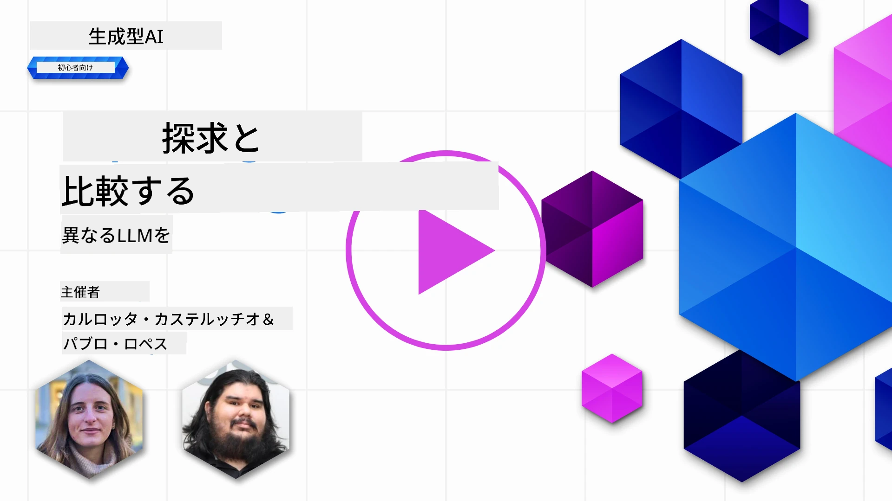](https://youtu.be/KIRUeDKscfI?si=8BHX1zvwzQBn-PlK)

> _上の画像をクリックすると、このレッスンのビデオが表示されます_

前回のレッスンでは、生成AIが技術の風景をどのように変えているか、大型言語モデル（LLM）がどのように機能するか、そしてスタートアップのようなビジネスがこれらをどのように活用して成長できるかを見てきました。この章では、異なる種類の大型言語モデル（LLM）を比較し、その長所と短所を理解します。

スタートアップの次のステップは、現在のLLMの環境を探り、どのモデルが自分たちのユースケースに適しているかを理解することです。

## はじめに

このレッスンでは以下をカバーします:

- 現在の環境における様々なタイプのLLM。
- Azureでのユースケースにおける異なるモデルのテスト、反復、比較。
- LLMのデプロイ方法。

## 学習目標

このレッスンを修了すると、以下ができるようになります:

- ユースケースに合った適切なモデルの選択。
- モデルのテスト、反復、性能向上の方法を理解すること。
- 企業がどのようにモデルをデプロイするかの知識を得ること。

## 異なる種類のLLMを理解する

LLMはそのアーキテクチャ、トレーニングデータ、ユースケースに基づいて複数のカテゴリに分けられます。これらの違いを理解することで、スタートアップがシナリオに適したモデルを選択し、性能をテスト、反復、向上させる方法を理解するのに役立ちます。

多くの異なるタイプのLLMモデルがあり、モデルの選択は利用目的、データ、支払い可能な金額などによって異なります。

モデルをテキスト、音声、動画、画像生成などに使用するかどうかによって、異なるタイプのモデルを選ぶことがあります。

- <strong>音声および音声認識</strong>。Whisperタイプのモデルは依然として汎用の音声認識モデルとして有用ですが、現在の運用選択肢には`gpt-4o-transcribe`、`gpt-4o-mini-transcribe`、および話者分離（ダイアリゼーション）バリアントなどの新しい音声からテキストへのモデルも含まれます。シナリオにあった言語カバレッジ、話者分離、リアルタイム対応、遅延、コストを評価してください。詳細は[OpenAI音声からテキストのドキュメント](https://platform.openai.com/docs/guides/speech-to-text?WT.mc_id=academic-105485-koreyst)で学べます。

- <strong>画像生成</strong>。DALL-EやMidjourneyはよく知られた画像生成オプションですが、現在のOpenAI画像APIは`gpt-image-2`などのGPT画像モデルを中心としており、Stable Diffusion、Imagen、Fluxなどのモデルファミリーも一般的な選択肢です。プロンプトの忠実度、編集対応、スタイル制御、安全性要件、ライセンスを比較してください。詳細は[OpenAI画像生成ガイド](https://platform.openai.com/docs/guides/images?WT.mc_id=academic-105485-koreyst)および本カリキュラムの第9章をご覧ください。

- <strong>テキスト生成</strong>。テキストモデルは最先端モデル、推論モデル、小型の低遅延モデル、オープンウェイトモデルに渡ります。現在の例としてはOpenAI GPT-5.xモデル、Anthropic Claude 4.xモデル、Google Gemini 3.xモデル、Meta Llama 4モデル、Mistralモデルがあります。リリース日や価格だけで選ばず、タスク品質、遅延、コンテキストウィンドウ、ツール利用、安全性動作、地域利用可能性、総コストを比較してください。[Microsoft Foundryモデルカタログ](https://ai.azure.com/catalog?WT.mc_id=academic-105485-koreyst)はAzureで利用可能なモデルを見る良い場所です。

- <strong>マルチモーダル性</strong>。多くの現行モデルはテキスト以外の入力も処理できます。画像、音声、動画を受け入れるものもあれば、ツール呼び出しが可能なもの、画像や音声、動画を生成できる専門モデルもあります。例えば、現在のOpenAIモデルはテキストと画像入力をサポートし、Geminiモデルはバリアントに応じてテキスト、コード、画像、音声、動画入力をサポートでき、Llama 4 ScoutとMaverickは元からマルチモーダルのオープンウェイトモデルです。必ず各モデルカードで対応する入出力モダリティを確認してからワークフローを構築してください。

モデルを選ぶと基本的な能力は得られますが、それだけでは十分でないことがよくあります。多くの場合、会社固有のデータをLLMに伝える必要があります。これに対していくつかの方法がありますが、その詳細は今後の章で説明します。

### ファウンデーションモデルとLLMの違い

「ファウンデーションモデル」という用語は[スタンフォードの研究者たちによって提唱され](https://arxiv.org/abs/2108.07258?WT.mc_id=academic-105485-koreyst)、以下のような基準を満たすAIモデルと定義されています:

- <strong>自己教師あり学習または無監督学習を用いてトレーニングされている</strong>。つまり、ラベルなしのマルチモーダルデータでトレーニングされ、トレーニングに人的アノテーションやラベル付けを必要としません。
- <strong>非常に大規模なモデル</strong>であり、数十億のパラメータでトレーニングされた非常に深いニューラルネットワークに基づいています。
- **通常「ファウンデーション（基盤）」として他のモデルの土台となることを意図している**。つまり、ファインチューニングによって上に他のモデルを構築する出発点として使えます。

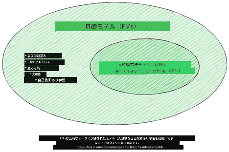

画像出典: [Essential Guide to Foundation Models and Large Language Models | by Babar M Bhatti | Medium
](https://thebabar.medium.com/essential-guide-to-foundation-models-and-large-language-models-27dab58f7404)

この区別を更に明確にするために、歴史的な例としてChatGPTを見てみましょう。初期のChatGPTはGPT-3.5をファウンデーションモデルとして使用しました。その後OpenAIはチャット特化型のデータと整合性調整技術を用いて、チャットボットのような会話シナリオでより良好な性能を示すチューニング済みモデルを作成しました。現代のAIサービスは複数のモデルバリアント間でルーティングすることが多く、サービス名と基盤モデル名が必ずしも同じとは限りません。

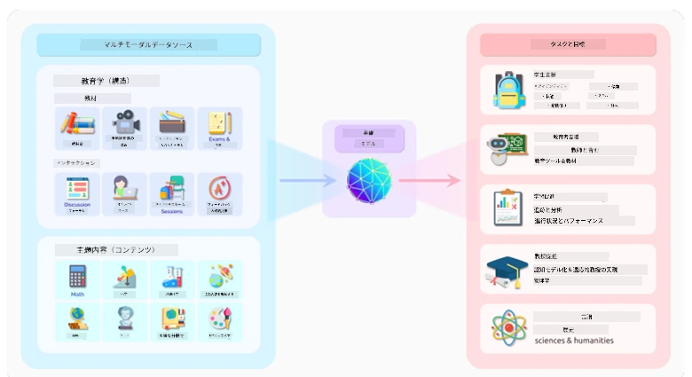

画像出典: [2108.07258.pdf (arxiv.org)](https://arxiv.org/pdf/2108.07258.pdf?WT.mc_id=academic-105485-koreyst)

### オープンウェイト/オープンソース vs プロプライエタリモデル

LLMを分類する別の方法に、オープンウェイト、オープンソース、プロプライエタリ（独自）かで分ける方法があります。

オープンソースおよびオープンウェイトモデルはモデルアーティファクトの調査、ダウンロード、カスタマイズを可能にしますが、ライセンスは異なります。完全にオープンソースのものもあれば、使用制限付きのオープンウェイトモデルもあります。ビジネスがデプロイ、データの所在、コスト、カスタマイズの制御を強化したいときに役立ちます。ただし、利用にあたってはライセンス条項、提供コスト、保守、セキュリティアップデート、評価品質を注意深く確認する必要があります。例としては[Meta Llama 4](https://ai.meta.com/blog/llama-4-multimodal-intelligence/?WT.mc_id=academic-105485-koreyst)、一部の[Mistralモデル](https://docs.mistral.ai/models/overview?WT.mc_id=academic-105485-koreyst)、[Hugging Face](https://huggingface.co/models?WT.mc_id=academic-105485-koreyst)でホストされている多くのモデルがあります。

プロプライエタリモデルはプロバイダーが所有・ホストします。これらは運用環境での管理と最適化がされていることが多く、強力なサポート、安全システム、ツール統合、スケールを提供します。ただし、一般にはモデル重みを検査・変更できず、プライバシー、保持、遵守、適正利用のためにプロバイダーの利用規約を確認する必要があります。例としては[OpenAIモデル](https://platform.openai.com/docs/models?WT.mc_id=academic-105485-koreyst)、[Google Gemini](https://deepmind.google/models/gemini/pro/?WT.mc_id=academic-105485-koreyst)、[Anthropic Claude](https://platform.claude.com/docs/en/about-claude/models/overview?WT.mc_id=academic-105485-koreyst)などがあります。

### 埋め込み、画像生成、テキスト・コード生成の違い

LLMは出力内容によっても分類できます。

埋め込み（Embedding）はテキストを埋め込みと呼ばれる数値表現に変換できるモデル群です。埋め込みは単語や文の関係性を機械が理解しやすくし、分類モデルやクラスタリングモデルなど、数値データの方が性能が良いモデルの入力として利用されます。埋め込みモデルは転移学習にもよく使用され、データが豊富な代理タスク用にモデルを構築し、そのモデル重み（埋め込み）を下流タスク用に再利用します。このカテゴリの例が[OpenAIの埋め込みモデル](https://platform.openai.com/docs/models/embeddings?WT.mc_id=academic-105485-koreyst)です。

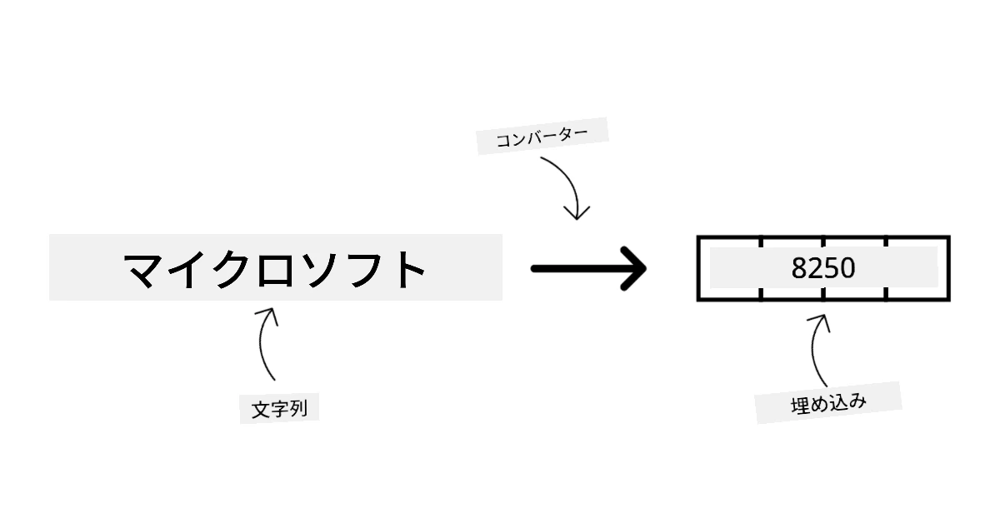

画像生成モデルは画像を生成するモデルです。画像編集、画像合成、画像翻訳でよく使われます。これらのモデルは[LAION-5B](https://laion.ai/blog/laion-5b/?WT.mc_id=academic-105485-koreyst)のような大規模画像データセットでトレーニングされ、新しい画像生成や、インペインティング、超解像、色付けなどの技術で既存画像を編集することが可能です。例としては[GPT画像モデル](https://platform.openai.com/docs/guides/images?WT.mc_id=academic-105485-koreyst)、[Stable Diffusionモデル](https://github.com/Stability-AI/StableDiffusion?WT.mc_id=academic-105485-koreyst)、Imagenモデルなどがあります。

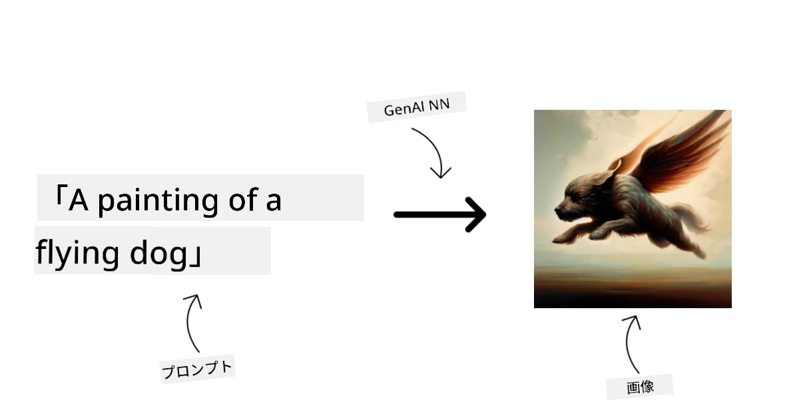

テキスト・コード生成モデルはテキストやコードを生成するモデルです。テキスト要約、翻訳、質問応答でよく利用されます。テキスト生成モデルは[BookCorpus](https://www.cv-foundation.org/openaccess/content_iccv_2015/html/Zhu_Aligning_Books_and_ICCV_2015_paper.html?WT.mc_id=academic-105485-koreyst)のような大規模テキストデータセットでトレーニングされ、新たなテキストの生成や質問への回答が可能です。コード生成モデルは[CodeParrot](https://huggingface.co/codeparrot?WT.mc_id=academic-105485-koreyst)のようにGitHubなどの大規模コードデータセットでトレーニングされ、新しいコードの生成や既存コードのバグ修正に用いられます。

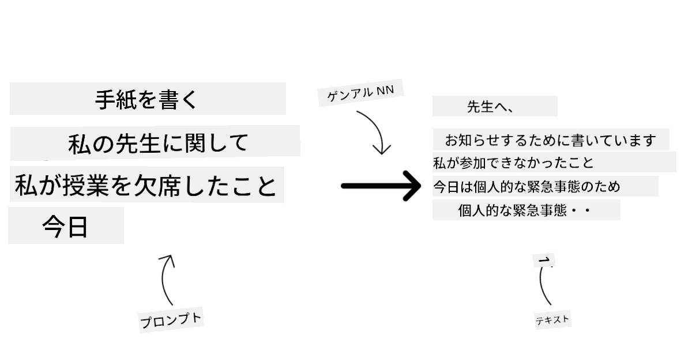

### エンコーダー・デコーダー型 vs デコーダーのみ型

LLMのさまざまなアーキテクチャタイプについて比喩を用いて説明しましょう。

マネージャーから学生向けクイズ作成のタスクを任されたと想像してください。あなたには２人の同僚がいます。一人はコンテンツ作成を担当し、もう一人はレビューを担当します。

コンテンツ作成担当はデコーダーのみモデルのような存在で、トピックを見て既に書いた内容を理解し、その文脈に基づいてコンテンツを生成します。彼らは魅力的で情報豊かな内容を書くのが得意ですが、分類、検索、情報のエンコードだけを行うタスクには必ずしも最適とは言えません。デコーダーのみモデルの例としてはGPTやLlamaシリーズがあります。

レビュー担当はエンコーダーのみモデルのような存在で、書かれたコースや回答を見て、それらの関係性や文脈を理解しますが、コンテンツ生成は得意ではありません。エンコーダーのみモデルの例としてBERTがあります。

作成とレビューの両方を担当できる人がいると想像すると、それがエンコーダー・デコーダーモデルです。例としてはBARTやT5があります。

### サービスとモデルの違い

次に、サービスとモデルの違いについて説明します。サービスはクラウドサービスプロバイダーが提供する製品で、多くの場合、モデル、データ、その他のコンポーネントの組み合わせです。モデルはサービスのコアコンポーネントで、しばしばファウンデーションモデル、つまりLLMです。

サービスは製品利用に最適化されており、GUIを通じてモデルより使いやすいことが多いです。ただし、無料でない場合が多く、サービス提供者の設備とリソースを活用し、費用を最適化しスケールしやすくするためにサブスクリプションや利用に応じた課金が必要となります。サービスの例には[Azure OpenAI Service](https://learn.microsoft.com/azure/ai-foundry/openai/overview?WT.mc_id=academic-105485-koreyst)があり、こちらは従量課金制でユーザーは使用量に比例して支払います。またAzure OpenAI Serviceは企業向けのセキュリティと責任あるAIフレームワークも提供します。

モデルはニューラルネットワークのアーティファクト：パラメータ、重み、アーキテクチャ、トークナイザー、設定情報などです。モデルをローカルやプライベート環境で実行するには適切なハードウェア、提供インフラ、監視、そして互換性のあるオープンソース/オープンウェイトライセンスか商用ライセンスが必要です。Llama 4やMistralのようなオープンウェイトモデルは自社ホスティング可能ですが、それでも計算リソースと運用ノウハウが必要です。

## Azure上でさまざまなモデルをテスト・反復して性能を理解する方法

私たちのチームが現在のLLMの状況を探り、シナリオに適した候補をいくつか特定したら、次のステップはそれらを実際のデータとワークロードでテストすることです。これは実験と測定によって行われる反復的なプロセスです。
前の段落で挙げたほとんどのモデル（OpenAIモデル、Llama 4やMistralなどのオープンウェイトモデル、Hugging Faceモデル）は[Microsoft Foundry Models](https://learn.microsoft.com/azure/foundry/concepts/foundry-models-overview?WT.mc_id=academic-105485-koreyst)で利用可能です。

[Microsoft Foundry](https://learn.microsoft.com/azure/foundry/what-is-foundry?WT.mc_id=academic-105485-koreyst)は、以前はAzure AI Studio/Azure AI Foundryと呼ばれており、AIアプリやエージェント構築のための統合Azureプラットフォームです。実験や評価から展開、監視、ガバナンスまでのライフサイクル管理を開発者が行う手助けをします。Microsoft Foundryのモデルカタログにより、利用者は以下のことができます：

- カタログ内で興味のある基盤モデルを見つける。Azureが販売するモデルやパートナー、コミュニティ提供者のモデルを含みます。利用者はタスク、提供者、ライセンス、展開オプション、名前でフィルター可能です。

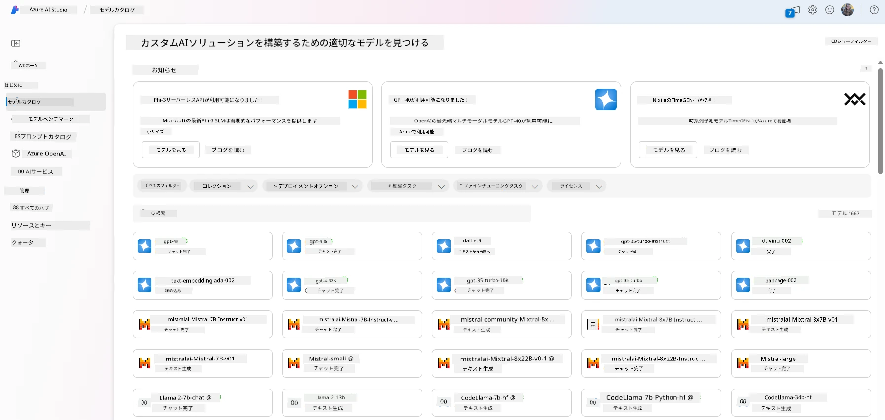

- モデルカードのレビュー、利用意図やトレーニングデータの詳細説明、コードサンプル、内部評価ライブラリの評価結果の確認。

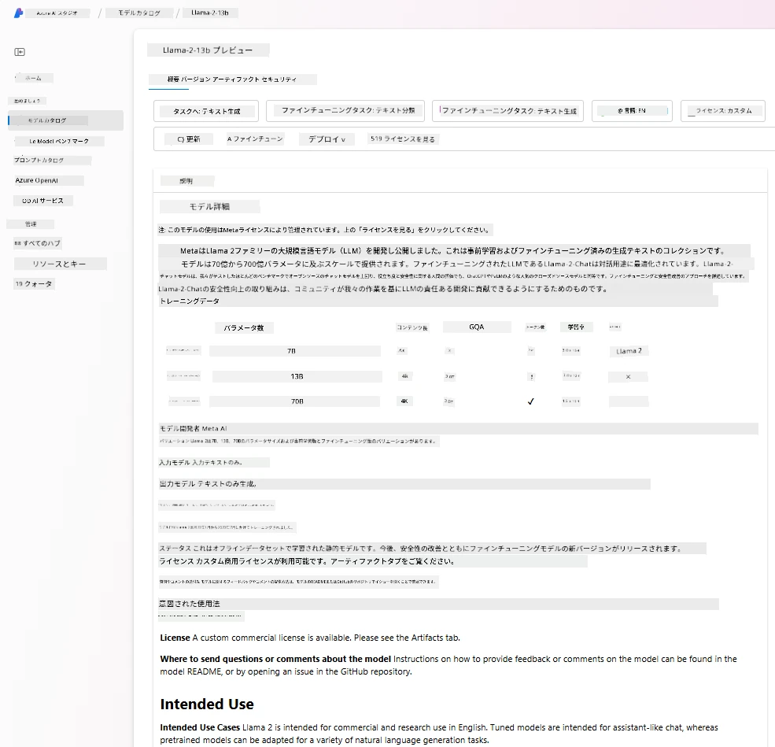

- 業界で利用可能なモデルとデータセットのベンチマークを比較し、ビジネスシナリオに合致するモデルを評価するための[Model Benchmarks](https://learn.microsoft.com/azure/ai-foundry/concepts/model-benchmarks?WT.mc_id=academic-105485-koreyst) ペイン。

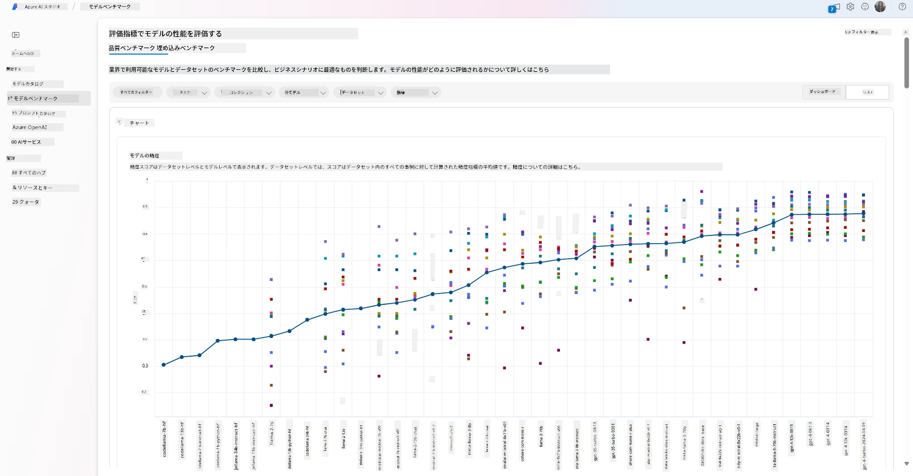

- サポートされているモデルをカスタムトレーニングデータでファインチューニングし、特定のワークロードにおけるモデルの性能を向上させる。Microsoft Foundryの実験と追跡機能を活用。

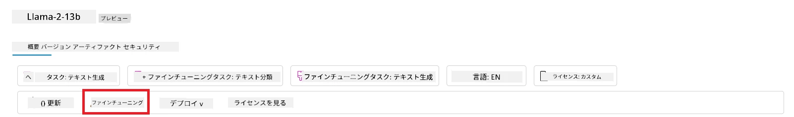

- 元の事前学習済みモデルまたはファインチューニング済みモデルを、マネージドコンピュートやサーバーレスの展開オプションを使い、リモートのリアルタイム推論エンドポイントにデプロイしてアプリケーションが利用可能にする。

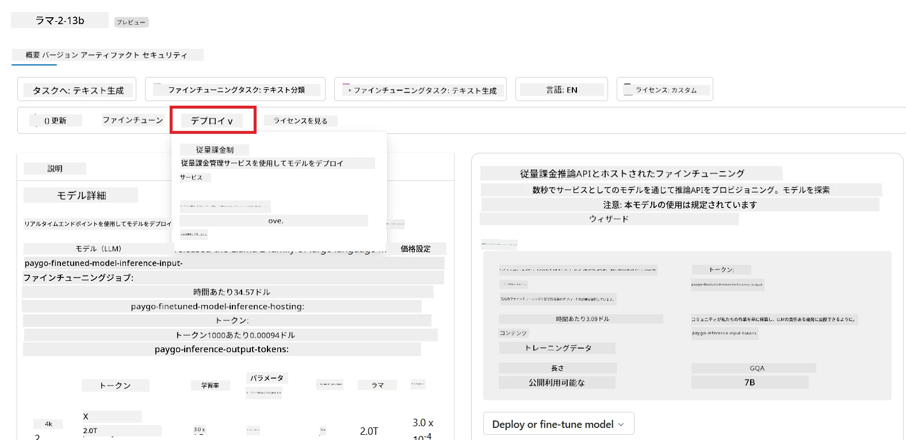

> [!NOTE]
> カタログ内のすべてのモデルが現在、ファインチューニングや従量課金型デプロイメントに対応しているわけではありません。モデルカードでモデルの能力や制限の詳細を確認してください。

## LLM結果の改善

私たちはスタートアップチームで様々な種類のLLMと、異なるモデルを比較・評価し性能を向上させ、推論エンドポイントへ展開できるクラウドプラットフォーム（Microsoft Foundry）を試してみました。

しかし、事前学習済みモデルを使うのではなく、いつファインチューニングすべきでしょうか？特定のワークロードでモデル性能を向上させる他の方法はありますか？

企業がLLMから必要な結果を得るための方法はいくつかあります。LLMを運用環境に展開する際には、訓練度合いが異なるモデルをさまざまに選択でき、複雑さ、コスト、品質も異なります。以下に代表的なアプローチを示します：

- <strong>コンテキストを活用したプロンプトエンジニアリング</strong>。必要な回答を得られるよう、十分なコンテキストを与えてプロンプトを作成する手法です。

- **Retrieval Augmented Generation（RAG）**。データがデータベースやWebエンドポイントなどに存在する場合、関連データまたはその一部を取得し、ユーザーのプロンプトの一部として含めることで、データを反映させる方法です。

- <strong>ファインチューニング済みモデル</strong>。自身のデータでモデルをさらに訓練することにより、モデルがより正確かつ応答的になりますが、コストがかかる場合があります。

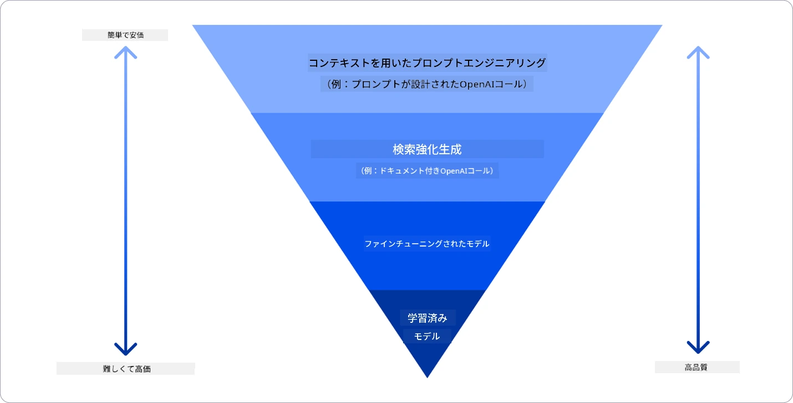

画像出典: [Four Ways that Enterprises Deploy LLMs | Fiddler AI Blog](https://www.fiddler.ai/blog/four-ways-that-enterprises-deploy-llms?WT.mc_id=academic-105485-koreyst)

### コンテキストを活用したプロンプトエンジニアリング

事前学習済みLLMは、短いプロンプトで呼び出すだけでも、文を完成させる、質問に答えるなど、一般的な自然言語タスクに非常に良く対応します。これは「ゼロショット」学習と呼ばれます。

ただし、詳細な要求や例などのコンテキストを付加すればするほど、回答はより正確で利用者の期待に近づきます。この場合、例が1つだけなら「ワンショット学習」、複数なら「フューショット学習」と呼ばれます。
コンテキストを活用したプロンプトエンジニアリングは、最もコスト効率が良く、導入に適した方法です。

### Retrieval Augmented Generation（RAG）

LLMの制約として、回答生成に使用できるデータは訓練時に利用されたものだけです。つまり訓練後に発生した事柄や非公開情報（企業データなど）については知識がありません。
この制約はRAGによって克服できます。RAGはプロンプトに文書のチャンクという形の外部データを補強し、プロンプト長の制限を考慮しつつ文脈に加えます。これは[Azure Vector Search](https://learn.microsoft.com/azure/search/vector-search-overview?WT.mc_id=academic-105485-koreyst)のようなベクトルデータベースツールにより、事前定義された様々なデータソースから有用なチャンクを検索し、コンテキストに追加されます。

この技術は、データ不足やファインチューニングに十分な時間やリソースがない場合でも、特定ワークロードの性能を向上させ、幻覚的回答や古い情報、不正確な回答のリスクを減らしたい企業にとって非常に有効です。

### ファインチューニング済みモデル

ファインチューニングは、転移学習を用いてモデルを下流タスクに適合させたり特定問題を解決したりするプロセスです。フューショット学習やRAGとは異なり、新しいモデルが生成され、重みやバイアスが更新されます。トレーニング例のセット（単一入力＝プロンプトと対応する出力＝補完）が必要です。
この方法を選ぶのが望ましい状況は以下の通りです。

- <strong>小さめのタスク特化モデルを使う場合</strong>。大きな先端モデルに繰り返しプロンプトを送る代わりに、小さなモデルを特定タスク用にファインチューニングすると、よりコスト効率が良く、迅速な解決策となります。

- **レイテンシー（応答遅延）を重視する場合**。レイテンシーが重要なユースケースでは、非常に長いプロンプトを使ったり、多数の例をプロンプト内に含めてモデルに学習させることは、プロンプト長の制限と合わず使えません。

- <strong>安定した挙動に適応させたい場合</strong>。多くの高品質な例を持ち、モデルがタスクパターンや出力フォーマット、トーン、特定ドメインのスタイルに継続的に従うことを望む企業。新しい事実や頻繁に変わる非公開知識が問題なら、単にファインチューニングに頼るのではなくRAGを併用すべきです。

### 新規トレーニングモデル

LLMをゼロから訓練するのは間違いなく最も難しく複雑な方法であり、膨大なデータ、熟練した人材、適切な計算リソースが必要です。この選択は、特定のドメイン向けユースケースにおいて大量のドメイン専用データがある場合に限り検討すべきです。

## 知識チェック

LLMの補完結果を改善する良い方法はどれでしょうか？

1. コンテキストを活用したプロンプトエンジニアリング
1. RAG
1. ファインチューニング済みモデル

答え：三つすべてが有効です。迅速な改善にはまずプロンプトエンジニアリングとコンテキストから始め、モデルに最新の事実や非公開ビジネスデータが必要な場合はRAGを使います。多くの高品質な例があり、モデルに一貫したタスク、フォーマット、トーン、ドメインパターンを従わせたい場合はファインチューニングを選択してください。

## 🚀 チャレンジ

さらに詳しく[RAGの活用方法](https://learn.microsoft.com/azure/search/retrieval-augmented-generation-overview?WT.mc_id=academic-105485-koreyst)について学んでみましょう。

## お疲れ様でした、学習を続けましょう

このレッスンが終わったら、[Generative AI Learningコレクション](https://aka.ms/genai-collection?WT.mc_id=academic-105485-koreyst)をチェックして、生成AIの知識をさらにレベルアップしましょう！

続けてレッスン3で、[責任を持って生成AIを活用する方法](../03-using-generative-ai-responsibly/README.md?WT.mc_id=academic-105485-koreyst)を見ていきます！

---

<!-- CO-OP TRANSLATOR DISCLAIMER START -->
**免責事項**：
本書類は AI 翻訳サービス [Co-op Translator](https://github.com/Azure/co-op-translator) を使用して翻訳されています。正確性を期していますが、自動翻訳には誤りや不正確な部分が含まれる可能性があることをご承知おきください。原文の原語版が正式な情報源とみなされるべきです。重要な情報については、専門の人間による翻訳を推奨します。本翻訳の利用により生じたいかなる誤解や解釈違いについても、当方は責任を負いかねます。
<!-- CO-OP TRANSLATOR DISCLAIMER END -->