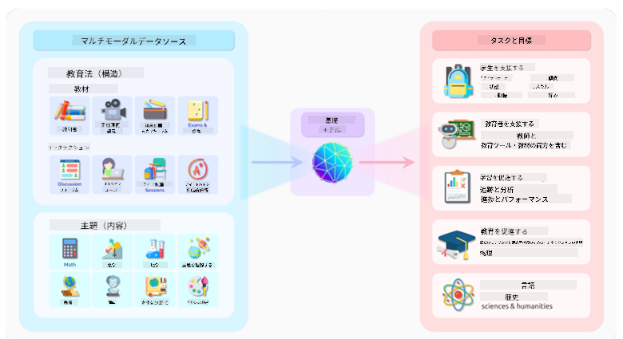
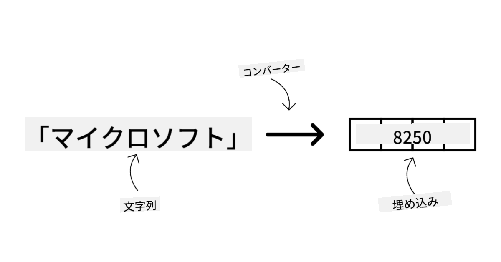
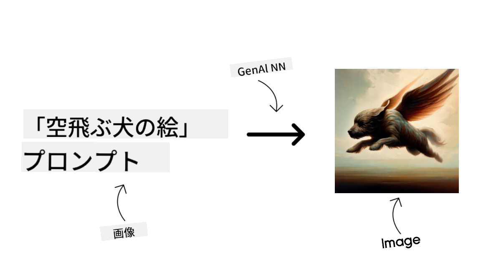
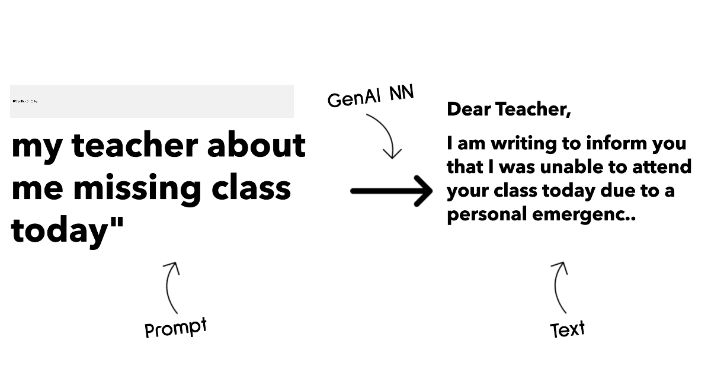
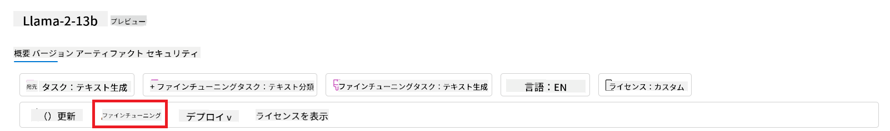

<!--
CO_OP_TRANSLATOR_METADATA:
{
  "original_hash": "e2f686f2eb794941761252ac5e8e090b",
  "translation_date": "2025-07-09T08:16:24+00:00",
  "source_file": "02-exploring-and-comparing-different-llms/README.md",
  "language_code": "ja"
}
-->
# さまざまなLLMの探索と比較

> _上の画像をクリックすると、このレッスンの動画がご覧いただけます_

前回のレッスンでは、Generative AIが技術の風景をどのように変えているか、Large Language Models（LLM）がどのように機能するか、そしてスタートアップのようなビジネスがそれらをどのように活用して成長できるかを見てきました。本章では、さまざまなタイプの大規模言語モデル（LLM）を比較し、それぞれの長所と短所を理解していきます。

スタートアップの次のステップは、現在のLLMの状況を調査し、自分たちのユースケースに適したモデルを見極めることです。

## はじめに

このレッスンで扱う内容は以下の通りです：

- 現在のLLMのさまざまなタイプ
- Azure上でのモデルのテスト、反復、比較
- LLMのデプロイ方法

## 学習目標

このレッスンを終えた後、あなたは以下のことができるようになります：

- ユースケースに最適なモデルを選択する
- モデルのテスト、反復、性能向上の方法を理解する
- ビジネスがモデルをどのようにデプロイしているかを知る

## さまざまなタイプのLLMを理解する

LLMは、そのアーキテクチャ、学習データ、ユースケースに基づいて複数の分類が可能です。これらの違いを理解することで、スタートアップはシナリオに合ったモデルを選び、テストや反復、性能向上の方法を把握できます。

多くの種類のLLMモデルがあり、どのモデルを選ぶかは、使用目的、データ、予算などによって異なります。

テキスト、音声、動画、画像生成など、何に使いたいかによって選ぶモデルも変わってきます。

- **音声認識**  
  この用途には、Whisperタイプのモデルが優れています。汎用的で音声認識に特化しており、多様な音声データで学習されていて多言語の音声認識が可能です。[Whisperタイプのモデルについてはこちら](https://platform.openai.com/docs/models/whisper?WT.mc_id=academic-105485-koreyst)をご覧ください。

- **画像生成**  
  画像生成には、DALL-EやMidjourneyがよく知られています。DALL-EはAzure OpenAIで提供されています。[DALL-Eについてはこちら](https://platform.openai.com/docs/models/dall-e?WT.mc_id=academic-105485-koreyst)や、本カリキュラムの第9章も参照してください。

- **テキスト生成**  
  ほとんどのモデルはテキスト生成に特化しており、GPT-3.5からGPT-4まで幅広い選択肢があります。コストもさまざまで、GPT-4が最も高価です。[Azure OpenAI playground](https://oai.azure.com/portal/playground?WT.mc_id=academic-105485-koreyst)で、性能やコスト面から最適なモデルを評価するのがおすすめです。

- **マルチモーダル**  
  入力や出力で複数のデータタイプを扱いたい場合は、[gpt-4 turbo with visionやgpt-4o](https://learn.microsoft.com/azure/ai-services/openai/concepts/models#gpt-4-and-gpt-4-turbo-models?WT.mc_id=academic-105485-koreyst)のような最新のOpenAIモデルを検討すると良いでしょう。これらは自然言語処理と視覚理解を組み合わせ、マルチモーダルなインターフェースでの対話を可能にします。

モデルを選ぶということは、基本的な能力を得ることですが、それだけでは不十分な場合もあります。多くの場合、企業固有のデータをLLMに伝える必要があります。その方法については、後のセクションで詳しく説明します。

### Foundation ModelsとLLMの違い

Foundation Modelという用語は[スタンフォードの研究者によって提唱され](https://arxiv.org/abs/2108.07258?WT.mc_id=academic-105485-koreyst)、以下のような特徴を持つAIモデルを指します：

- **教師なし学習または自己教師あり学習で訓練されている**  
  ラベル付けされていないマルチモーダルデータで学習し、データの人手による注釈やラベル付けを必要としません。

- **非常に大規模なモデルである**  
  数十億のパラメータを持つ深いニューラルネットワークに基づいています。

- **他のモデルの「基盤」として使われることを意図している**  
  ファインチューニングによって他のモデルの土台として利用されます。

画像出典：[Essential Guide to Foundation Models and Large Language Models | by Babar M Bhatti | Medium](https://thebabar.medium.com/essential-guide-to-foundation-models-and-large-language-models-27dab58f7404)

この違いをさらに明確にするために、ChatGPTを例に挙げましょう。ChatGPTの最初のバージョンは、GPT-3.5というモデルを基盤モデルとして構築されました。つまり、OpenAIはチャットに特化したデータを使ってGPT-3.5を調整し、チャットボットのような会話シナリオで高い性能を発揮するモデルを作り上げたのです。

画像出典：[2108.07258.pdf (arxiv.org)](https://arxiv.org/pdf/2108.07258.pdf?WT.mc_id=academic-105485-koreyst)

### オープンソースモデルとプロプライエタリモデル

LLMを分類するもう一つの方法は、オープンソースかプロプライエタリかです。

オープンソースモデルは、一般に公開されていて誰でも利用可能です。多くは開発元の企業や研究コミュニティによって提供されており、モデルの中身を検査、改変、カスタマイズできます。ただし、必ずしも本番環境向けに最適化されているわけではなく、性能面でプロプライエタリモデルに劣ることもあります。また、資金面での制約があり、長期的なメンテナンスや最新研究の反映が十分でない場合もあります。代表的なオープンソースモデルには[Alpaca](https://crfm.stanford.edu/2023/03/13/alpaca.html?WT.mc_id=academic-105485-koreyst)、[Bloom](https://huggingface.co/bigscience/bloom)、[LLaMA](https://llama.meta.com)などがあります。

プロプライエタリモデルは企業が所有し、一般には公開されていません。多くは本番環境向けに最適化されており、利用にはサブスクリプションや料金が必要な場合があります。中身の検査や改変は許可されておらず、利用者はモデルのトレーニングに使われるデータの管理やAIの責任ある利用について、モデル所有者に信頼を置く必要があります。代表的なプロプライエタリモデルには[OpenAIモデル](https://platform.openai.com/docs/models/overview?WT.mc_id=academic-105485-koreyst)、[Google Bard](https://sapling.ai/llm/bard?WT.mc_id=academic-105485-koreyst)、[Claude 2](https://www.anthropic.com/index/claude-2?WT.mc_id=academic-105485-koreyst)などがあります。

### 埋め込みモデル、画像生成モデル、テキスト・コード生成モデル

LLMは生成する出力の種類によっても分類できます。

埋め込み（Embedding）モデルは、テキストを数値化した埋め込みベクトルに変換します。これにより、単語や文の関係性を機械が理解しやすくなり、分類モデルやクラスタリングモデルなど、数値データを扱う他のモデルの入力として利用されます。埋め込みモデルは転移学習でよく使われ、豊富なデータがある代理タスクで学習したモデルの重み（埋め込み）を他の下流タスクに再利用します。このカテゴリの例として[OpenAI embeddings](https://platform.openai.com/docs/models/embeddings?WT.mc_id=academic-105485-koreyst)があります。

画像生成モデルは画像を生成します。画像編集、合成、変換に使われ、大規模な画像データセット（例：[LAION-5B](https://laion.ai/blog/laion-5b/?WT.mc_id=academic-105485-koreyst)）で学習されています。新しい画像の生成や、インペインティング、超解像、色付けなどの編集が可能です。代表例は[DALL-E-3](https://openai.com/dall-e-3?WT.mc_id=academic-105485-koreyst)や[Stable Diffusionモデル](https://github.com/Stability-AI/StableDiffusion?WT.mc_id=academic-105485-koreyst)です。

テキスト・コード生成モデルはテキストやコードを生成します。テキスト要約、翻訳、質問応答などに使われます。大規模なテキストデータセット（例：[BookCorpus](https://www.cv-foundation.org/openaccess/content_iccv_2015/html/Zhu_Aligning_Books_and_ICCV_2015_paper.html?WT.mc_id=academic-105485-koreyst)）で学習され、新しいテキストの生成や質問への回答が可能です。コード生成モデル（例：[CodeParrot](https://huggingface.co/codeparrot?WT.mc_id=academic-105485-koreyst)）はGitHubなどの大規模コードデータセットで学習され、新しいコードの生成や既存コードのバグ修正に使われます。

### エンコーダ・デコーダモデルとデコーダのみモデル

LLMのアーキテクチャの違いを説明するために、例え話を使いましょう。

あなたの上司が学生向けのクイズ作成を依頼しました。あなたには2人の同僚がいます。1人は問題作成を担当し、もう1人は問題のレビューを担当します。

問題作成者はデコーダのみモデルのようなもので、トピックを見て既に書かれた内容を参考にしながら問題を作成します。魅力的で情報豊富なコンテンツを書くのは得意ですが、トピックや学習目標の理解はあまり得意ではありません。デコーダモデルの例としてはGPTシリーズ（GPT-3など）があります。

レビュー担当者はエンコーダのみモデルのようなもので、書かれた問題と回答を見て両者の関係性や文脈を理解しますが、コンテンツの生成は苦手です。エンコーダモデルの例はBERTです。

問題作成とレビューの両方をこなせる人がいると想像してください。これがエンコーダ・デコーダモデルに相当します。例としてBARTやT5があります。

### サービスとモデルの違い

最後に、サービスとモデルの違いについて説明します。サービスはクラウドサービスプロバイダーが提供する製品で、複数のモデルやデータ、その他のコンポーネントを組み合わせたものです。モデルはサービスの中核部分で、多くはFoundation ModelやLLMです。

サービスは本番環境向けに最適化されており、GUIを通じてモデルよりも使いやすいことが多いです。ただし、無料で使えるとは限らず、利用量に応じた課金やサブスクリプションが必要な場合があります。サービスを利用することで、所有者の設備やリソースを活用でき、コスト最適化やスケールが容易になります。例として[Azure OpenAI Service](https://learn.microsoft.com/azure/ai-services/openai/overview?WT.mc_id=academic-105485-koreyst)があり、従量課金制で利用量に応じて料金が発生します。また、エンタープライズレベルのセキュリティや責任あるAIフレームワークも提供しています。

モデルはパラメータや重みを持つニューラルネットワークそのもので、企業がローカルで実行することも可能ですが、その場合は機器の購入やスケールのための構築、ライセンス購入やオープンソースモデルの利用が必要です。LLaMAのようなモデルは利用可能ですが、実行には計算リソースが必要です。

## Azureで異なるモデルをテストし、性能を理解するための反復方法

チームが現在のLLMの状況を調査し、シナリオに適した候補を見つけたら、次のステップは自分たちのデータやワークロードでテストすることです。これは実験と測定を繰り返す反復的なプロセスです。
前の段落で紹介したほとんどのモデル（OpenAIモデル、Llama2のようなオープンソースモデル、Hugging Faceのトランスフォーマーモデル）は、[Azure AI Studio](https://ai.azure.com/?WT.mc_id=academic-105485-koreyst)の[Model Catalog](https://learn.microsoft.com/azure/ai-studio/how-to/model-catalog-overview?WT.mc_id=academic-105485-koreyst)で利用可能です。

[Azure AI Studio](https://learn.microsoft.com/azure/ai-studio/what-is-ai-studio?WT.mc_id=academic-105485-koreyst)は、開発者が生成AIアプリケーションを構築し、実験から評価までの開発ライフサイクル全体を管理できるクラウドプラットフォームです。すべてのAzure AIサービスを使いやすいGUIの単一ハブに統合しています。Azure AI StudioのModel Catalogでは、以下のことが可能です：

- カタログ内で興味のあるFoundation Modelを見つけることができます。独自モデルやオープンソースモデルを、タスク、ライセンス、名前でフィルタリング可能です。検索性を高めるため、モデルはAzure OpenAIコレクションやHugging Faceコレクションなどのコレクションに分類されています。

- モデルカードを確認できます。意図された用途やトレーニングデータの詳細説明、コードサンプル、内部評価ライブラリでの評価結果が含まれています。

- [Model Benchmarks](https://learn.microsoft.com/azure/ai-studio/how-to/model-benchmarks?WT.mc_id=academic-105485-koreyst)パネルを通じて、業界で利用可能なモデルやデータセットのベンチマークを比較し、ビジネスシナリオに最適なものを評価できます。

- カスタムトレーニングデータでモデルをファインチューニングし、特定のワークロードでのモデル性能を向上させることができます。Azure AI Studioの実験とトラッキング機能を活用します。

- 元の事前学習済みモデルまたはファインチューニング済みモデルを、リモートのリアルタイム推論（マネージドコンピュート）やサーバーレスAPIエンドポイント（[従量課金制](https://learn.microsoft.com/azure/ai-studio/how-to/model-catalog-overview#model-deployment-managed-compute-and-serverless-api-pay-as-you-go?WT.mc_id=academic-105485-koreyst)）にデプロイし、アプリケーションで利用可能にします。

> [!NOTE]
> カタログ内のすべてのモデルが現在ファインチューニングや従量課金制デプロイに対応しているわけではありません。モデルの機能や制限についてはモデルカードを確認してください。

## LLMの結果を改善するには

私たちのスタートアップチームでは、さまざまな種類のLLMと、異なるモデルを比較・評価し、性能を向上させ、推論エンドポイントにデプロイできるクラウドプラットフォーム（Azure Machine Learning）を試してきました。

では、いつ事前学習済みモデルを使うのではなく、ファインチューニングを検討すべきでしょうか？特定のワークロードでモデル性能を向上させる他の方法はあるのでしょうか？

ビジネスがLLMから望む結果を得るためには、いくつかのアプローチがあります。LLMを本番環境にデプロイする際には、トレーニングの度合いや複雑さ、コスト、品質が異なるさまざまなタイプのモデルを選択できます。以下は代表的なアプローチです：

- **コンテキストを用いたプロンプトエンジニアリング**。必要な回答を得るために、プロンプトに十分なコンテキストを提供する方法です。

- **Retrieval Augmented Generation（RAG）**。データがデータベースやウェブエンドポイントに存在する場合、関連データやその一部を取得してユーザーのプロンプトに含めることで、回答の精度を高めます。

- **ファインチューニング済みモデル**。自社データでモデルをさらにトレーニングし、より正確でニーズに応じた応答が可能になりますが、コストがかかる場合があります。

画像出典：[Four Ways that Enterprises Deploy LLMs | Fiddler AI Blog](https://www.fiddler.ai/blog/four-ways-that-enterprises-deploy-llms?WT.mc_id=academic-105485-koreyst)

### コンテキストを用いたプロンプトエンジニアリング

事前学習済みのLLMは、短いプロンプト（文章の続きを生成する、質問に答えるなど）でも一般的な自然言語タスクに非常に良く対応します。これを「ゼロショット学習」と呼びます。

しかし、ユーザーが詳細なリクエストや例（コンテキスト）を含めてクエリを構築できればできるほど、回答はより正確で期待に近いものになります。この場合、プロンプトに例が1つだけ含まれる場合は「ワンショット学習」、複数含まれる場合は「数ショット学習」と呼ばれます。コンテキストを用いたプロンプトエンジニアリングは、最もコスト効率の良いスタート方法です。

### Retrieval Augmented Generation（RAG）

LLMは、トレーニング時に使用されたデータのみを使って回答を生成するため、トレーニング後に起きた事実や非公開情報（企業データなど）については知りません。

この制約を克服するのがRAGという手法で、プロンプトに外部データ（文書のチャンク）を追加して補強します。ただし、プロンプトの長さ制限を考慮する必要があります。これは、[Azure Vector Search](https://learn.microsoft.com/azure/search/vector-search-overview?WT.mc_id=academic-105485-koreyst)のようなベクターデータベースツールが、事前に定義された多様なデータソースから有用なチャンクを検索し、プロンプトのコンテキストに追加することで実現されます。

この手法は、ビジネスが十分なデータや時間、リソースを持たずにLLMをファインチューニングできない場合でも、特定のワークロードで性能を向上させ、虚偽情報や有害コンテンツのリスクを減らしたい場合に非常に有効です。

### ファインチューニング済みモデル

ファインチューニングは、転移学習を活用してモデルを特定のタスクや問題に「適応」させるプロセスです。数ショット学習やRAGとは異なり、重みやバイアスが更新された新しいモデルが生成されます。トレーニング例は、単一の入力（プロンプト）とそれに対応する出力（補完）から構成されます。

以下の場合に推奨されます：

- **ファインチューニング済みモデルを使う場合**。高性能モデルではなく、埋め込みモデルのような能力が低めのモデルをファインチューニングして使いたい場合、コスト効率が良く高速なソリューションになります。

- **レイテンシを考慮する場合**。特定のユースケースでレイテンシが重要で、非常に長いプロンプトや多くの例を使うことができない場合。

- **最新情報を維持したい場合**。大量の高品質データと正確なラベルがあり、それらを継続的に更新するリソースがある場合。

### トレーニング済みモデル

LLMをゼロからトレーニングするのは、間違いなく最も難しく複雑な方法であり、大量のデータ、熟練した人材、適切な計算リソースが必要です。この選択肢は、ドメイン特化のユースケースと大量のドメイン中心データがある場合に限り検討すべきです。

## 知識チェック

LLMの補完結果を改善する良いアプローチはどれでしょうか？

1. コンテキストを用いたプロンプトエンジニアリング  
1. RAG  
1. ファインチューニング済みモデル

答え：3。時間とリソース、高品質なデータがある場合は、最新の状態を保つためにファインチューニングが最適です。ただし、改善を目指していて時間が足りない場合は、まずRAGを検討する価値があります。

## 🚀 チャレンジ

ビジネスで[RAGを活用する方法](https://learn.microsoft.com/azure/search/retrieval-augmented-generation-overview?WT.mc_id=academic-105485-koreyst)についてさらに調べてみましょう。

## 素晴らしい！学習を続けましょう

このレッスンを終えたら、[Generative AI Learning collection](https://aka.ms/genai-collection?WT.mc_id=academic-105485-koreyst)で生成AIの知識をさらに深めてください！

次のレッスン3では、[生成AIを責任を持って活用する方法](../03-using-generative-ai-responsibly/README.md?WT.mc_id=academic-105485-koreyst)を学びます！

**免責事項**：  
本書類はAI翻訳サービス「[Co-op Translator](https://github.com/Azure/co-op-translator)」を使用して翻訳されました。正確性には努めておりますが、自動翻訳には誤りや不正確な部分が含まれる可能性があります。原文の言語による文書が正式な情報源とみなされるべきです。重要な情報については、専門の人間による翻訳を推奨します。本翻訳の利用により生じたいかなる誤解や誤訳についても、当方は一切の責任を負いかねます。