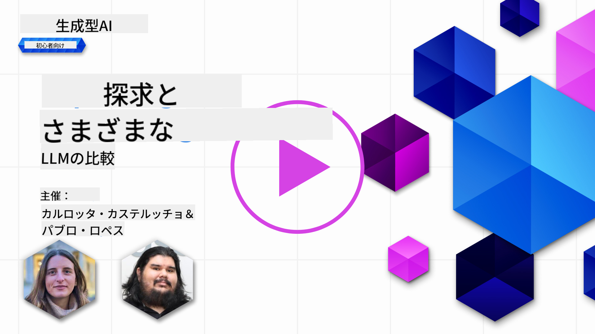
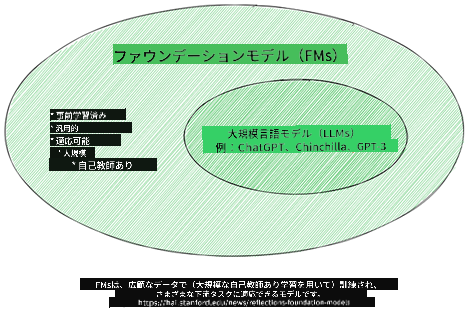
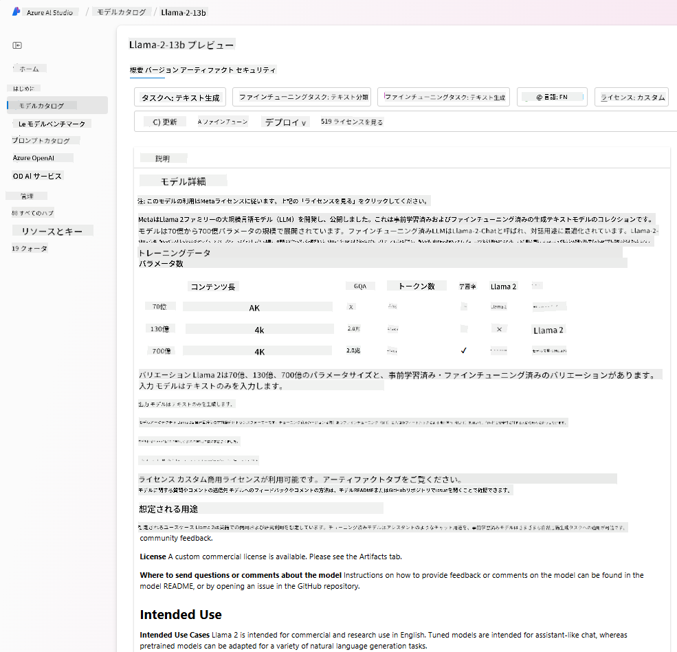
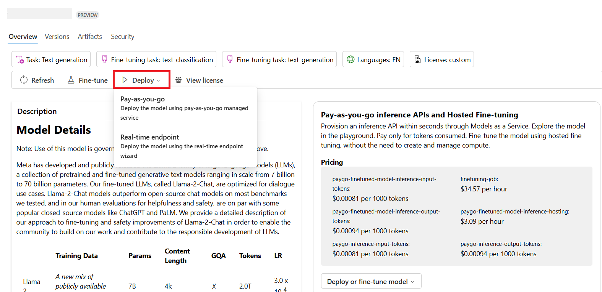

<!--
CO_OP_TRANSLATOR_METADATA:
{
  "original_hash": "6b7629b8ee4d7d874a27213e903d86a7",
  "translation_date": "2025-10-17T23:52:54+00:00",
  "source_file": "02-exploring-and-comparing-different-llms/README.md",
  "language_code": "ja"
}
-->
# 異なるLLMの探索と比較

> _上の画像をクリックして、このレッスンの動画をご覧ください_

前回のレッスンでは、生成AIが技術の風景をどのように変えているか、大規模言語モデル（LLM）がどのように機能するか、そして私たちのスタートアップのような企業がそれらをどのように活用して成長できるかを学びました。この章では、異なる種類の大規模言語モデル（LLM）を比較し、それぞれの利点と欠点を理解することを目指します。

私たちのスタートアップの次のステップは、現在のLLMの状況を探索し、どれが私たちのユースケースに適しているかを理解することです。

## はじめに

このレッスンでは以下を学びます：

- 現在のLLMの種類
- Azureでのユースケースに合わせたモデルのテスト、反復、比較
- LLMのデプロイ方法

## 学習目標

このレッスンを完了すると、以下ができるようになります：

- ユースケースに適したモデルを選択する
- モデルのテスト、反復、性能向上の方法を理解する
- 企業がモデルをデプロイする方法を知る

## 異なる種類のLLMを理解する

LLMはそのアーキテクチャ、トレーニングデータ、ユースケースに基づいて複数の分類が可能です。これらの違いを理解することで、私たちのスタートアップはシナリオに適したモデルを選択し、テスト、反復、性能向上の方法を理解することができます。

LLMには多くの種類があり、選択するモデルは使用目的、データ、予算などによって異なります。

モデルをテキスト、音声、動画、画像生成などに使用するかどうかによって、選択するモデルが異なる場合があります。

- **音声およびスピーチ認識**。この目的には、Whisperタイプのモデルが最適です。これらは汎用的でスピーチ認識を目的としています。多様な音声でトレーニングされており、多言語のスピーチ認識が可能です。[Whisperタイプのモデルについてはこちらをご覧ください](https://platform.openai.com/docs/models/whisper?WT.mc_id=academic-105485-koreyst)。

- **画像生成**。画像生成には、DALL-EやMidjourneyが非常に有名な選択肢です。DALL-EはAzure OpenAIで提供されています。[DALL-Eについてはこちらをご覧ください](https://platform.openai.com/docs/models/dall-e?WT.mc_id=academic-105485-koreyst)およびこのカリキュラムの第9章。

- **テキスト生成**。ほとんどのモデルはテキスト生成に特化しており、GPT-3.5からGPT-4まで幅広い選択肢があります。GPT-4は最も高価ですが、能力とコストの観点でどのモデルが最適かを評価するために[Azure OpenAIプレイグラウンド](https://oai.azure.com/portal/playground?WT.mc_id=academic-105485-koreyst)を利用する価値があります。

- **マルチモダリティ**。入力と出力で複数の種類のデータを扱いたい場合は、[gpt-4 turbo with visionやgpt-4o](https://learn.microsoft.com/azure/ai-services/openai/concepts/models#gpt-4-and-gpt-4-turbo-models?WT.mc_id=academic-105485-koreyst)のような最新のOpenAIモデルを検討することができます。これらは自然言語処理と視覚理解を組み合わせ、マルチモーダルインターフェースを通じたインタラクションを可能にします。

モデルを選択すると基本的な機能が得られますが、それだけでは十分でない場合があります。企業固有のデータをLLMに伝える必要がある場合もあります。その方法については次のセクションで詳しく説明します。

### 基盤モデルとLLMの違い

基盤モデルという用語は[スタンフォードの研究者によって提唱され](https://arxiv.org/abs/2108.07258?WT.mc_id=academic-105485-koreyst)、以下の基準を満たすAIモデルとして定義されています：

- **教師なし学習または自己教師あり学習でトレーニングされる**。つまり、ラベルのないマルチモーダルデータでトレーニングされ、人間によるデータの注釈やラベル付けを必要としません。
- **非常に大規模なモデル**。非常に深いニューラルネットワークで構成され、数十億のパラメータでトレーニングされています。
- **他のモデルの「基盤」として機能することを意図している**。つまり、他のモデルがその上に構築される出発点として使用されることができます。これには微調整が含まれます。

画像出典: [Essential Guide to Foundation Models and Large Language Models | by Babar M Bhatti | Medium
](https://thebabar.medium.com/essential-guide-to-foundation-models-and-large-language-models-27dab58f7404)

この違いをさらに明確にするために、ChatGPTを例にとりましょう。ChatGPTの最初のバージョンを構築するために、GPT-3.5というモデルが基盤モデルとして使用されました。これは、OpenAIがチャット特有のデータを使用して、会話シナリオ（チャットボットなど）で優れた性能を発揮するように特化したGPT-3.5のバージョンを作成したことを意味します。

画像出典: [2108.07258.pdf (arxiv.org)](https://arxiv.org/pdf/2108.07258.pdf?WT.mc_id=academic-105485-koreyst)

### オープンソースモデルとプロプライエタリモデル

LLMを分類するもう一つの方法は、それがオープンソースかプロプライエタリかです。

オープンソースモデルは、一般公開されており、誰でも使用できるモデルです。これらは、作成した企業や研究コミュニティによって公開されることが多いです。これらのモデルは、LLMのさまざまなユースケースに合わせて検査、変更、カスタマイズすることができます。ただし、必ずしも生産用途に最適化されているわけではなく、プロプライエタリモデルほど性能が高くない場合があります。また、オープンソースモデルの資金提供は限られていることがあり、長期的に維持されない場合や最新の研究で更新されない場合があります。人気のあるオープンソースモデルの例には、[Alpaca](https://crfm.stanford.edu/2023/03/13/alpaca.html?WT.mc_id=academic-105485-koreyst)、[Bloom](https://huggingface.co/bigscience/bloom)、[LLaMA](https://llama.meta.com)などがあります。

プロプライエタリモデルは、企業が所有しており、一般公開されていないモデルです。これらのモデルは、通常、生産用途に最適化されています。ただし、これらは検査、変更、または異なるユースケースに合わせてカスタマイズすることができません。また、必ずしも無料で利用できるわけではなく、使用するにはサブスクリプションや支払いが必要な場合があります。さらに、モデルのトレーニングに使用されるデータをユーザーが制御できないため、データプライバシーやAIの責任ある使用に関するコミットメントをモデル所有者に委ねる必要があります。人気のあるプロプライエタリモデルの例には、[OpenAIモデル](https://platform.openai.com/docs/models/overview?WT.mc_id=academic-105485-koreyst)、[Google Bard](https://sapling.ai/llm/bard?WT.mc_id=academic-105485-koreyst)、[Claude 2](https://www.anthropic.com/index/claude-2?WT.mc_id=academic-105485-koreyst)などがあります。

### 埋め込み、画像生成、テキストおよびコード生成

LLMは生成する出力によっても分類できます。

埋め込みは、テキストを数値形式（埋め込み）に変換できるモデルのセットです。埋め込みは、入力テキストの数値表現であり、機械が単語や文の関係を理解しやすくします。また、分類モデルやクラスタリングモデルなど、数値データで性能が向上する他のモデルの入力として使用できます。埋め込みモデルは、転移学習に頻繁に使用されます。転移学習では、データが豊富な代替タスク用にモデルが構築され、その後モデルの重み（埋め込み）が他の下流タスクに再利用されます。このカテゴリの例としては、[OpenAI埋め込み](https://platform.openai.com/docs/models/embeddings?WT.mc_id=academic-105485-koreyst)があります。

画像生成モデルは画像を生成するモデルです。これらのモデルは、画像編集、画像合成、画像翻訳に頻繁に使用されます。画像生成モデルは、[LAION-5B](https://laion.ai/blog/laion-5b/?WT.mc_id=academic-105485-koreyst)のような大規模な画像データセットでトレーニングされ、新しい画像を生成したり、既存の画像をインペインティング、超解像、色付け技術で編集したりするために使用できます。例としては、[DALL-E-3](https://openai.com/dall-e-3?WT.mc_id=academic-105485-koreyst)や[Stable Diffusionモデル](https://github.com/Stability-AI/StableDiffusion?WT.mc_id=academic-105485-koreyst)があります。

テキストおよびコード生成モデルは、テキストやコードを生成するモデルです。これらのモデルは、テキスト要約、翻訳、質問応答に頻繁に使用されます。テキスト生成モデルは、[BookCorpus](https://www.cv-foundation.org/openaccess/content_iccv_2015/html/Zhu_Aligning_Books_and_ICCV_2015_paper.html?WT.mc_id=academic-105485-koreyst)のような大規模なテキストデータセットでトレーニングされ、新しいテキストを生成したり、質問に答えたりするために使用できます。コード生成モデルは、[CodeParrot](https://huggingface.co/codeparrot?WT.mc_id=academic-105485-koreyst)のように、GitHubなどの大規模なコードデータセットでトレーニングされ、新しいコードを生成したり、既存のコードのバグを修正したりするために使用できます。

### エンコーダ-デコーダとデコーダのみ

LLMの異なるアーキテクチャについて話すために、例えを使って説明します。

あなたの上司が学生向けのクイズを作成するタスクを与えたとします。あなたには2人の同僚がいて、1人はコンテンツの作成を担当し、もう1人はレビューを担当しています。

コンテンツ作成者はデコーダのみのモデルのようなもので、トピックを見てあなたがすでに書いた内容を確認し、それに基づいてコースを作成することができます。彼らは魅力的で情報豊富なコンテンツを作成するのが得意ですが、トピックや学習目標を理解するのは得意ではありません。デコーダモデルの例としては、GPTファミリーのモデル（GPT-3など）があります。

レビュー担当者はエンコーダのみのモデルのようなもので、書かれたコースや回答を見て、それらの関係を理解し、文脈を把握しますが、コンテンツを生成するのは得意ではありません。エンコーダのみのモデルの例としては、BERTがあります。

また、クイズを作成しレビューすることができる人もいると想像してください。これがエンコーダ-デコーダモデルです。例としては、BARTやT5があります。

### サービスとモデルの違い

次に、サービスとモデルの違いについて説明します。サービスとは、クラウドサービスプロバイダーによって提供される製品であり、通常、モデル、データ、その他のコンポーネントの組み合わせです。モデルはサービスの中核となるコンポーネントであり、通常はLLMのような基盤モデルです。

サービスは通常、生産用途に最適化されており、グラフィカルユーザーインターフェースを介してモデルを使用するよりも簡単です。ただし、サービスは必ずしも無料で利用できるわけではなく、使用するにはサブスクリプションや支払いが必要な場合があります。これにより、サービス所有者の設備やリソースを活用し、費用を最適化し、簡単にスケールすることができます。サービスの例としては、[Azure OpenAI Service](https://learn.microsoft.com/azure/ai-services/openai/overview?WT.mc_id=academic-105485-koreyst)があります。このサービスは従量課金制の料金プランを提供しており、ユーザーはサービスの使用量に比例して課金されます。また、Azure OpenAI Serviceは、モデルの機能に加えて、エンタープライズグレードのセキュリティと責任あるAIフレームワークを提供します。

モデルはニューラルネットワークそのものであり、パラメータ、重みなどを含みます。企業がローカルで実行することが可能ですが、設備を購入し、スケールするための構造を構築し、ライセンスを購入するか、オープンソースモデルを使用する必要があります。LLaMAのようなモデルは使用可能であり、モデルを実行するための計算能力が必要です。

## Azureでの性能を理解するための異なるモデルのテストと反復方法

私たちのチームが現在のLLMの状況を探索し、シナリオに適した候補を特定したら、次のステップはデータとワークロードでそれらをテストすることです。これは実験と測定による反復的なプロセスです。
前の段落で述べたほとんどのモデル（OpenAIモデル、Llama2のようなオープンソースモデル、Hugging Face transformersなど）は、[Azure AI Studio](https://ai.azure.com/?WT.mc_id=academic-105485-koreyst)の[モデルカタログ](https://learn.microsoft.com/azure/ai-studio/how-to/model-catalog-overview?WT.mc_id=academic-105485-koreyst)で利用可能です。

[Azure AI Studio](https://learn.microsoft.com/azure/ai-studio/what-is-ai-studio?WT.mc_id=academic-105485-koreyst)は、開発者が生成AIアプリケーションを構築し、実験から評価までの開発ライフサイクル全体を管理するためのクラウドプラットフォームです。Azure AIサービスを1つのハブに統合し、使いやすいGUIを提供します。Azure AI Studioのモデルカタログでは、以下のことが可能です：

- カタログ内で興味のある基盤モデルを見つけることができます。プロプライエタリモデルやオープンソースモデルを、タスク、ライセンス、名前でフィルタリングして検索できます。検索性を向上させるために、モデルはAzure OpenAIコレクションやHugging Faceコレクションなどのコレクションに整理されています。

- モデルカードを確認し、使用目的やトレーニングデータの詳細な説明、コードサンプル、内部評価ライブラリでの評価結果を確認できます。

- 業界で利用可能なモデルやデータセット間のベンチマークを比較し、ビジネスシナリオに最適なものを評価するために[モデルベンチマーク](https://learn.microsoft.com/azure/ai-studio/how-to/model-benchmarks?WT.mc_id=academic-105485-koreyst)パネルを使用できます。

- カスタムトレーニングデータでモデルを微調整し、特定のワークロードでのモデル性能を向上させることができます。Azure AI Studioの実験とトラッキング機能を活用します。

- 元の事前トレーニング済みモデルまたは微調整済みバージョンを、リモートリアルタイム推論（管理されたコンピュート）またはサーバーレスAPIエンドポイント（[従量課金制](https://learn.microsoft.com/azure/ai-studio/how-to/model-catalog-overview#model-deployment-managed-compute-and-serverless-api-pay-as-you-go?WT.mc_id=academic-105485-koreyst)）にデプロイし、アプリケーションがそれを利用できるようにします。

> [!NOTE]
> カタログ内のすべてのモデルが微調整や従量課金制デプロイに対応しているわけではありません。モデルカードでモデルの機能や制限について詳細を確認してください。

## LLMの結果を改善する方法

私たちのスタートアップチームでは、さまざまな種類のLLMと、異なるモデルを比較し、テストデータで評価し、性能を向上させ、推論エンドポイントにデプロイできるクラウドプラットフォーム（Azure Machine Learning）を探求しました。

しかし、事前トレーニング済みモデルを使用するのではなく、モデルを微調整するべきタイミングはいつでしょうか？特定のワークロードでモデル性能を向上させるための他のアプローチはあるのでしょうか？

ビジネスがLLMから必要な結果を得るために使用できるいくつかのアプローチがあります。LLMを本番環境にデプロイする際には、異なるトレーニング度合いのモデルを選択することができ、複雑さ、コスト、品質のレベルが異なります。以下は異なるアプローチの例です：

- **コンテキストを伴うプロンプトエンジニアリング**。必要な応答を得るために、プロンプトに十分なコンテキストを提供することが重要です。

- **RAG（Retrieval Augmented Generation）**。データがデータベースやウェブエンドポイントに存在する場合、プロンプト時に関連するデータを取得し、それをユーザーのプロンプトに組み込むことができます。

- **微調整モデル**。モデルをさらに自分のデータでトレーニングすることで、より正確でニーズに応じた応答を得ることができますが、コストがかかる可能性があります。

画像出典: [Four Ways that Enterprises Deploy LLMs | Fiddler AI Blog](https://www.fiddler.ai/blog/four-ways-that-enterprises-deploy-llms?WT.mc_id=academic-105485-koreyst)

### コンテキストを伴うプロンプトエンジニアリング

事前トレーニング済みのLLMは、短いプロンプト（例えば、文章の補完や質問）を使用するだけでも、一般的な自然言語タスクで非常に良い結果を出します。これを「ゼロショット学習」と呼びます。

しかし、ユーザーが詳細なリクエストや例を含むプロンプトを提供することで、より正確で期待に近い応答を得ることができます。この場合、プロンプトに1つの例だけを含む場合は「ワンショット学習」、複数の例を含む場合は「少数ショット学習」と呼ばれます。コンテキストを伴うプロンプトエンジニアリングは、最もコスト効率の良いアプローチです。

### Retrieval Augmented Generation (RAG)

LLMは、トレーニング中に使用されたデータのみを使用して応答を生成するという制限があります。つまり、トレーニング後に発生した事実については何も知らず、非公開情報（例えば企業データ）にはアクセスできません。

これを克服するために、RAGという技術を使用します。この技術では、プロンプトの長さの制限を考慮しながら、外部データを文書の断片としてプロンプトに追加します。これは、[Azure Vector Search](https://learn.microsoft.com/azure/search/vector-search-overview?WT.mc_id=academic-105485-koreyst)のようなベクトルデータベースツールによってサポートされ、事前定義されたデータソースから有用な断片を取得し、それをプロンプトのコンテキストに追加します。

この技術は、ビジネスが十分なデータや時間、リソースを持っていない場合でも、特定のワークロードで性能を向上させ、現実の歪曲や有害なコンテンツのリスクを軽減するのに非常に役立ちます。

### 微調整モデル

微調整は、転移学習を活用してモデルを下流タスクに「適応」させたり、特定の問題を解決したりするプロセスです。少数ショット学習やRAGとは異なり、微調整では新しいモデルが生成され、重みやバイアスが更新されます。これには、単一の入力（プロンプト）とそれに関連する出力（補完）からなるトレーニング例のセットが必要です。
以下の場合、このアプローチが推奨されます：

- **微調整モデルの使用**。ビジネスが高性能モデルではなく、埋め込みモデルのような微調整された能力の低いモデルを使用したい場合、よりコスト効率が良く迅速なソリューションとなります。

- **レイテンシーの考慮**。特定のユースケースでレイテンシーが重要であり、非常に長いプロンプトを使用することができない場合や、モデルが学習すべき例の数がプロンプトの長さ制限に収まらない場合。

- **最新情報の維持**。ビジネスが高品質なデータと正解ラベルを大量に持っており、このデータを時間とともに最新の状態に保つためのリソースを持っている場合。

### トレーニング済みモデル

LLMをゼロからトレーニングすることは、間違いなく最も困難で複雑なアプローチであり、大量のデータ、熟練したリソース、適切な計算能力が必要です。このオプションは、ビジネスがドメイン固有のユースケースを持ち、大量のドメイン中心のデータを持っている場合にのみ検討されるべきです。

## 知識チェック

LLMの補完結果を改善するための良いアプローチは何でしょうか？

1. コンテキストを伴うプロンプトエンジニアリング  
1. RAG  
1. 微調整モデル  

A:3、時間とリソースがあり、高品質なデータがある場合、微調整が最新の状態を維持するための最良の選択肢です。しかし、改善を目指していて時間がない場合は、まずRAGを検討する価値があります。

## 🚀 チャレンジ

[RAGを使用する方法](https://learn.microsoft.com/azure/search/retrieval-augmented-generation-overview?WT.mc_id=academic-105485-koreyst)についてさらに学び、ビジネスに活用する方法を調べてみましょう。

## 素晴らしい仕事です、学びを続けましょう

このレッスンを完了した後は、[生成AI学習コレクション](https://aka.ms/genai-collection?WT.mc_id=academic-105485-koreyst)をチェックして、生成AIの知識をさらに深めてください！

次のレッスン3では、[生成AIを責任を持って活用する方法](../03-using-generative-ai-responsibly/README.md?WT.mc_id=academic-105485-koreyst)について学びます！

---

**免責事項**:  
この文書はAI翻訳サービス[Co-op Translator](https://github.com/Azure/co-op-translator)を使用して翻訳されています。正確性を追求しておりますが、自動翻訳には誤りや不正確な部分が含まれる可能性があります。元の言語で記載された文書を正式な情報源としてご参照ください。重要な情報については、専門の人間による翻訳を推奨します。この翻訳の使用に起因する誤解や誤認について、当社は一切の責任を負いません。