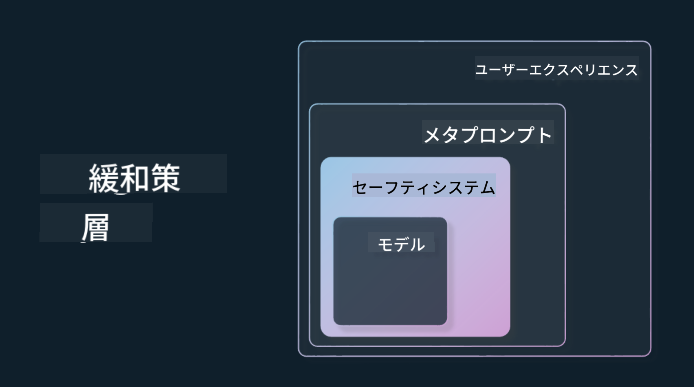

<!--
CO_OP_TRANSLATOR_METADATA:
{
  "original_hash": "7f8f4c11f8c1cb6e1794442dead414ea",
  "translation_date": "2025-07-09T08:50:24+00:00",
  "source_file": "03-using-generative-ai-responsibly/README.md",
  "language_code": "ja"
}
-->
# Generative AIを責任を持って使う

> _上の画像をクリックすると、このレッスンの動画が見られます_

AI、特に生成AIに魅了されるのは簡単ですが、責任を持って使う方法を考える必要があります。出力結果が公平で害を及ぼさないようにするにはどうすればよいかなど、さまざまな点を考慮しなければなりません。この章では、その背景や考慮すべきこと、そしてAIの利用を改善するために積極的に取るべきステップについて説明します。

## はじめに

このレッスンでは以下を扱います：

- 生成AIアプリケーションを構築する際に、なぜ責任あるAIを優先すべきか
- 責任あるAIの基本原則とそれが生成AIにどう関係するか
- これらの責任あるAIの原則を戦略やツールを通じて実践する方法

## 学習目標

このレッスンを終えた後、あなたは以下を理解できるようになります：

- 生成AIアプリケーションを構築する際の責任あるAIの重要性
- 生成AIアプリケーションを作る際に、いつ責任あるAIの基本原則を考え適用すべきか
- 責任あるAIの概念を実践するために利用できるツールや戦略

## 責任あるAIの原則

生成AIへの期待はかつてないほど高まっています。この期待は多くの新しい開発者や注目、資金をこの分野にもたらしました。生成AIを使って製品や企業を作ろうとする人にとっては非常に良いことですが、同時に責任を持って進めることも重要です。

このコースを通じて、私たちはスタートアップとAI教育製品の構築に注力しています。責任あるAIの原則である「公平性」「包摂性」「信頼性／安全性」「セキュリティとプライバシー」「透明性」「説明責任」を用いて、これらが生成AIの利用にどう関わるかを探っていきます。

## なぜ責任あるAIを優先すべきか

製品を作る際には、ユーザーの利益を第一に考える人間中心のアプローチが最良の結果をもたらします。

生成AIの特徴は、ユーザーに役立つ回答や情報、ガイダンス、コンテンツを多くの手作業なしに作り出せる力にあります。これにより非常に印象的な結果が得られますが、適切な計画や戦略がなければ、ユーザーや製品、社会全体に害を及ぼす結果を招くこともあります。

ここで、いくつか（すべてではありませんが）潜在的に有害な結果を見てみましょう。

### 幻覚（Hallucinations）

幻覚とは、LLMが全く意味不明な内容や、他の情報源から明らかに誤りであるとわかる内容を生成することを指します。

例えば、私たちのスタートアップで学生が歴史の質問をモデルに尋ねられる機能を作ったとします。学生が「タイタニック号の唯一の生存者は誰ですか？」と質問した場合、

モデルは以下のような回答を返すかもしれません：

> _(出典：[Flying bisons](https://flyingbisons.com?WT.mc_id=academic-105485-koreyst))_

これは非常に自信に満ちた詳細な回答ですが、残念ながら誤りです。少し調べれば、タイタニック号の生存者は一人ではなかったことがわかります。このトピックを調べ始めたばかりの学生にとって、この回答は疑問を持たれず事実として受け入れられてしまうかもしれません。これによりAIシステムの信頼性が損なわれ、私たちのスタートアップの評判にも悪影響を及ぼす可能性があります。

どのLLMでも繰り返しの改良で幻覚を減らす性能向上が見られますが、それでも私たち開発者やユーザーはこれらの限界を常に意識しておく必要があります。

### 有害なコンテンツ

前のセクションでは、LLMが誤ったり意味不明な回答をする場合について触れましたが、もう一つ注意すべきリスクはモデルが有害なコンテンツを返す場合です。

有害なコンテンツとは以下のようなものを指します：

- 自傷行為や特定のグループへの害を促す指示や助長
- 憎悪的または侮辱的な内容
- 攻撃や暴力行為の計画を助長する内容
- 違法コンテンツの探し方や違法行為の方法を教える内容
- 性的に露骨な内容

私たちのスタートアップでは、学生がこのようなコンテンツを目にしないよう、適切なツールや戦略を用意することが重要です。

### 公平性の欠如

公平性とは「AIシステムが偏見や差別から自由であり、すべての人を公平かつ平等に扱うこと」を意味します。生成AIの世界では、マイノリティや周縁化されたグループに対する排除的な世界観がモデルの出力によって強化されないようにすることが求められます。

このような出力は、ユーザーにとって良い製品体験を作る妨げになるだけでなく、社会的にも悪影響を及ぼします。アプリケーション開発者として、幅広く多様なユーザー層を常に念頭に置いて生成AIを使ったソリューションを作るべきです。

## 生成AIを責任を持って使う方法

責任ある生成AIの重要性を理解したところで、AIソリューションを責任を持って構築するための4つのステップを見てみましょう：

### 潜在的な害を測定する

ソフトウェアテストでは、ユーザーがアプリケーションで行うであろう動作をテストします。同様に、ユーザーが使いそうな多様なプロンプトをテストすることは潜在的な害を測る良い方法です。

私たちのスタートアップは教育製品を作っているので、教育に関連するプロンプトのリストを用意すると良いでしょう。特定の科目や歴史的事実、学生生活に関するプロンプトなどが考えられます。

### 潜在的な害を軽減する

次に、モデルやその応答によって引き起こされる潜在的な害を防止または制限する方法を探します。これには4つの層があります：

- **モデル**：適切なユースケースに合ったモデルを選ぶこと。GPT-4のような大規模で複雑なモデルは、小規模で特定の用途に使う場合、有害なコンテンツのリスクが高まることがあります。トレーニングデータを使ってファインチューニングすることも有害コンテンツのリスクを減らします。

- **セーフティシステム**：モデルを提供するプラットフォーム上のツールや設定のセットで、害を軽減します。例えばAzure OpenAIサービスのコンテンツフィルタリングシステムがこれにあたります。システムはまた、脱獄攻撃やボットからの不正なリクエストも検知すべきです。

- **メタプロンプト**：メタプロンプトやグラウンディングは、特定の行動や情報に基づいてモデルを制御・制限する方法です。システム入力を使ってモデルの制限を定義したり、システムの範囲やドメインにより関連性の高い出力を提供したりします。

また、Retrieval Augmented Generation（RAG）のような技術を使い、モデルが信頼できる情報源からのみ情報を引き出すようにすることもあります。このコースの後半には[検索アプリケーションの構築](../08-building-search-applications/README.md?WT.mc_id=academic-105485-koreyst)に関するレッスンがあります。

- **ユーザー体験**：最後の層は、ユーザーがアプリケーションのインターフェースを通じてモデルと直接やり取りする部分です。ここでUI/UXを設計し、ユーザーがモデルに送信できる入力の種類や表示されるテキストや画像を制限します。AIアプリケーションを展開する際には、生成AIができること・できないことを透明に伝えることも重要です。

[AIアプリケーションのUX設計](../12-designing-ux-for-ai-applications/README.md?WT.mc_id=academic-105485-koreyst)に関するレッスンも用意しています。

- **モデルの評価**：LLMを扱うのは難しく、モデルのトレーニングデータを完全にコントロールできないこともあります。それでもモデルの性能や出力を評価することは重要です。精度、類似度、根拠の有無、関連性を測ることで、ステークホルダーやユーザーに透明性と信頼を提供します。

### 責任ある生成AIソリューションを運用する

AIアプリケーションの運用体制を整えることが最後の段階です。法務やセキュリティなどスタートアップ内の他部門と連携し、規制ポリシーに準拠していることを確認します。リリース前には、配信計画やインシデント対応、ロールバックの計画も立て、ユーザーへの害が拡大しないように備えます。

## ツール

責任あるAIソリューションの開発は大変に思えるかもしれませんが、その価値は十分にあります。生成AIの分野が成長するにつれて、開発者が責任を持って統合できるよう支援するツールも充実してきます。例えば、[Azure AI Content Safety](https://learn.microsoft.com/azure/ai-services/content-safety/overview?WT.mc_id=academic-105485-koreyst)はAPIリクエストを通じて有害なコンテンツや画像を検出するのに役立ちます。

## 知識チェック

責任あるAIの利用を確保するために気をつけるべきことは何でしょうか？

1. 回答が正しいこと  
1. AIが犯罪目的に使われないようにすること  
1. AIが偏見や差別から自由であることを保証すること

A: 2と3が正解です。責任あるAIは、有害な影響やバイアスを軽減する方法を考慮するのに役立ちます。

## 🚀 チャレンジ

[Azure AI Content Safety](https://learn.microsoft.com/azure/ai-services/content-safety/overview?WT.mc_id=academic-105485-koreyst)について調べて、あなたの利用に取り入れられるものを探してみましょう。

## よくできました！学習を続けましょう

このレッスンを終えたら、[Generative AI Learning collection](https://aka.ms/genai-collection?WT.mc_id=academic-105485-koreyst)で生成AIの知識をさらに深めてください！

次のレッスン4では、[プロンプトエンジニアリングの基本](../04-prompt-engineering-fundamentals/README.md?WT.mc_id=academic-105485-koreyst)を学びます！

**免責事項**：  
本書類はAI翻訳サービス「[Co-op Translator](https://github.com/Azure/co-op-translator)」を使用して翻訳されました。正確性を期しておりますが、自動翻訳には誤りや不正確な部分が含まれる可能性があります。原文の言語によるオリジナル文書が正式な情報源とみなされるべきです。重要な情報については、専門の人間による翻訳を推奨します。本翻訳の利用により生じた誤解や誤訳について、当方は一切の責任を負いかねます。