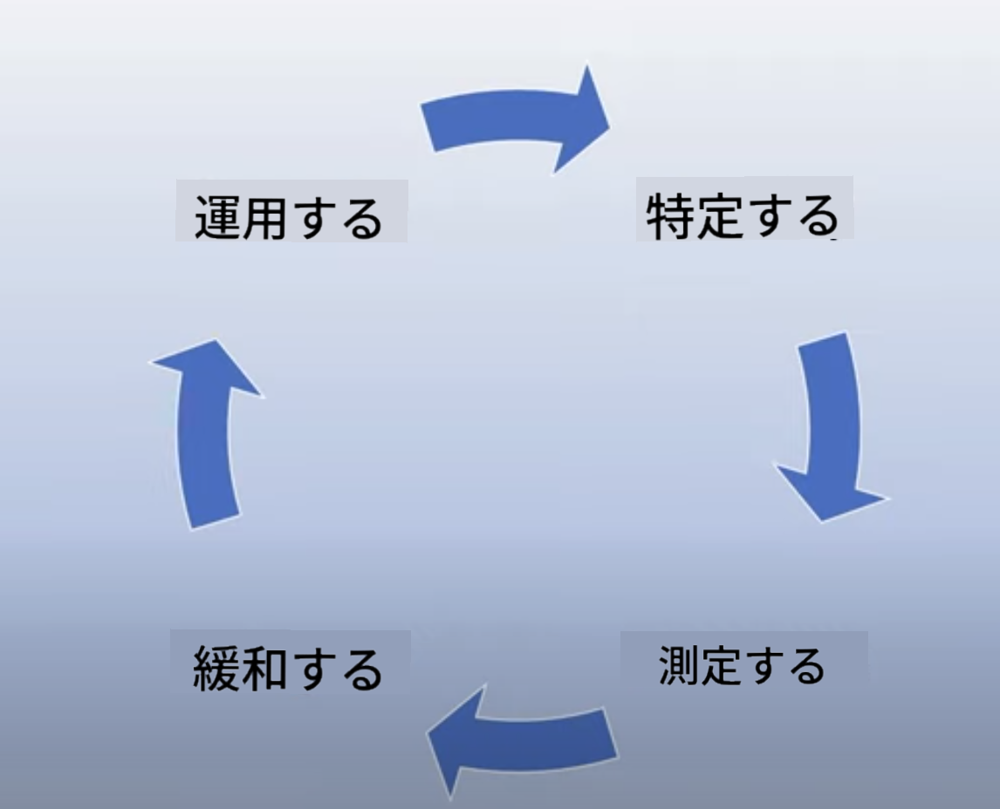

<!--
CO_OP_TRANSLATOR_METADATA:
{
  "original_hash": "4d57fad773cbeb69c5dd62e65c34200d",
  "translation_date": "2025-10-17T23:51:36+00:00",
  "source_file": "03-using-generative-ai-responsibly/README.md",
  "language_code": "ja"
}
-->
# 生成AIを責任を持って使用する

> _上の画像をクリックして、このレッスンの動画をご覧ください_

AI、特に生成AIに魅了されるのは簡単ですが、それを責任を持って使用する方法を考える必要があります。出力が公平であり、有害でないことをどのように保証するかなどを考慮する必要があります。この章では、これらの文脈、考慮すべき点、そしてAIの使用を改善するための積極的なステップを提供することを目的としています。

## はじめに

このレッスンでは以下を学びます：

- 生成AIアプリケーションを構築する際に責任あるAIを優先すべき理由
- 責任あるAIの基本原則とそれが生成AIにどのように関連するか
- 戦略とツールを通じてこれらの責任あるAIの原則を実践する方法

## 学習目標

このレッスンを完了すると以下を理解できます：

- 生成AIアプリケーションを構築する際の責任あるAIの重要性
- 生成AIアプリケーションを構築する際に責任あるAIの基本原則を考え、適用するタイミング
- 責任あるAIの概念を実践するために利用可能なツールと戦略

## 責任あるAIの原則

生成AIの興奮はこれまでになく高まっています。この興奮は、多くの新しい開発者、注目、資金をこの分野にもたらしました。これは生成AIを使用して製品や企業を構築しようとしている人々にとって非常にポジティブなことですが、責任を持って進めることも重要です。

このコース全体を通じて、私たちはスタートアップとAI教育製品の構築に焦点を当てています。責任あるAIの原則である公平性、包括性、信頼性/安全性、セキュリティとプライバシー、透明性、責任を使用します。これらの原則を使用して、生成AIを製品に使用する際の関連性を探ります。

## 責任あるAIを優先すべき理由

製品を構築する際には、ユーザーの最善の利益を念頭に置いた人間中心のアプローチを取ることが最良の結果につながります。

生成AIのユニークな点は、ユーザーに役立つ回答、情報、ガイダンス、コンテンツを作成する力です。これが多くの手動ステップを必要とせずに行われるため、非常に印象的な結果をもたらすことができます。しかし、適切な計画や戦略がなければ、残念ながらユーザー、製品、そして社会全体に有害な結果をもたらす可能性もあります。

これらの潜在的な有害な結果のいくつか（すべてではありません）を見てみましょう：

### 幻覚

幻覚とは、LLMが完全に意味不明な内容や、他の情報源に基づいて事実と異なる内容を生成することを指します。

例えば、私たちのスタートアップが学生がモデルに歴史的な質問をする機能を構築したとします。学生が「タイタニック号の唯一の生存者は誰ですか？」と質問したとします。

モデルが以下のような回答を生成したとします：

> _(出典: [Flying bisons](https://flyingbisons.com?WT.mc_id=academic-105485-koreyst))_

これは非常に自信に満ちた詳細な回答です。しかし、残念ながらこれは間違っています。少しの調査でも、タイタニック号の災害には複数の生存者がいたことがわかります。このトピックを初めて調査する学生にとって、この回答は十分に説得力があり、疑問を持たずに事実として扱われる可能性があります。この結果は、AIシステムが信頼性を欠き、私たちのスタートアップの評判に悪影響を与える可能性があります。

どのLLMの各バージョンでも、幻覚を最小化する性能の改善が見られています。この改善にもかかわらず、アプリケーションの構築者やユーザーとして、これらの制限を常に認識しておく必要があります。

### 有害なコンテンツ

前のセクションで、LLMが不正確または意味不明な回答を生成する場合について説明しました。もう一つのリスクは、モデルが有害なコンテンツを生成する場合です。

有害なコンテンツは以下のように定義されます：

- 自傷行為や特定のグループへの害を助長する指示を提供すること
- 憎悪的または侮辱的なコンテンツ
- 攻撃や暴力行為の計画を助長すること
- 違法なコンテンツを見つける方法や違法行為を行う方法を提供すること
- 性的に露骨なコンテンツを表示すること

私たちのスタートアップでは、学生がこのようなコンテンツを目にしないようにするための適切なツールと戦略を整備する必要があります。

### 公平性の欠如

公平性は「AIシステムが偏見や差別から解放され、すべての人を公平かつ平等に扱うことを保証すること」と定義されます。生成AIの世界では、モデルの出力によって社会的に疎外されたグループの排他的な世界観が強化されないようにする必要があります。

これらのタイプの出力は、ユーザーにとってポジティブな製品体験を構築する上で破壊的であるだけでなく、社会的な害をさらに引き起こします。アプリケーションの構築者として、生成AIを使用してソリューションを構築する際には、常に幅広く多様なユーザーベースを念頭に置くべきです。

## 生成AIを責任を持って使用する方法

責任ある生成AIの重要性を認識したところで、AIソリューションを責任を持って構築するために取るべき4つのステップを見てみましょう：

### 潜在的な害を測定する

ソフトウェアテストでは、アプリケーションに対するユーザーの予想される行動をテストします。同様に、ユーザーが最も使用する可能性が高い多様なプロンプトをテストすることは、潜在的な害を測定する良い方法です。

私たちのスタートアップが教育製品を構築しているので、教育関連のプロンプトのリストを準備するのが良いでしょう。これには特定の科目、歴史的事実、学生生活に関するプロンプトを含めることができます。

### 潜在的な害を軽減する

次に、モデルとその応答によって引き起こされる可能性のある害を防止または制限する方法を見つける時です。これを4つの異なる層で考えることができます：

- **モデル**. 適切なユースケースに適したモデルを選択すること。GPT-4のような大規模で複雑なモデルは、より小規模で特定のユースケースに適用すると有害なコンテンツのリスクが高まる可能性があります。トレーニングデータを使用して微調整することで、有害なコンテンツのリスクを軽減することができます。

- **安全システム**. 安全システムは、モデルを提供するプラットフォーム上のツールや設定のセットであり、害を軽減するのに役立ちます。例として、Azure OpenAIサービスのコンテンツフィルタリングシステムがあります。システムは、脱獄攻撃やボットからのリクエストなどの望ましくない活動を検出する必要があります。

- **メタプロンプト**. メタプロンプトやグラウンディングは、特定の行動や情報に基づいてモデルを指示または制限する方法です。これには、システム入力を使用してモデルの特定の制限を定義することが含まれます。また、システムの範囲やドメインにより関連性の高い出力を提供することも含まれます。

また、信頼できる情報源の選択からのみ情報を取得するようにモデルを設定するために、情報検索強化生成（RAG）のような技術を使用することもできます。このコースの後半には、[検索アプリケーションの構築](../08-building-search-applications/README.md?WT.mc_id=academic-105485-koreyst)に関するレッスンがあります。

- **ユーザーエクスペリエンス**. 最後の層は、ユーザーがアプリケーションのインターフェースを通じてモデルと直接対話する部分です。この方法では、UI/UXを設計して、モデルに送信できる入力の種類やユーザーに表示されるテキストや画像を制限することができます。AIアプリケーションを展開する際には、生成AIアプリケーションができることとできないことについて透明性を持つ必要もあります。

[AIアプリケーションのUX設計](../12-designing-ux-for-ai-applications/README.md?WT.mc_id=academic-105485-koreyst)に特化したレッスンがあります。

- **モデルの評価**. LLMを扱うことは困難な場合があります。なぜなら、モデルがトレーニングされたデータを常に制御できるわけではないからです。それでも、モデルの性能と出力を常に評価する必要があります。モデルの正確性、類似性、根拠性、出力の関連性を測定することは重要です。これにより、利害関係者やユーザーに透明性と信頼を提供することができます。

### 責任ある生成AIソリューションを運用する

AIアプリケーションに関する運用実践を構築することが最終段階です。これには、法務やセキュリティなどのスタートアップの他の部門と協力して、すべての規制ポリシーに準拠していることを確認することが含まれます。ローンチ前には、配信、インシデント対応、ロールバックに関する計画を構築し、ユーザーへの害が拡大するのを防ぐ必要があります。

## ツール

責任あるAIソリューションを開発する作業は多く感じるかもしれませんが、それは十分に価値のある努力です。生成AIの分野が成長するにつれて、開発者が責任を効率的にワークフローに統合するのを助けるツールが成熟していくでしょう。例えば、[Azure AI Content Safety](https://learn.microsoft.com/azure/ai-services/content-safety/overview?WT.mc_id=academic-105485-koreyst)は、APIリクエストを通じて有害なコンテンツや画像を検出するのに役立ちます。

## 知識チェック

責任あるAIの使用を確保するために気をつけるべきことは何ですか？

1. 回答が正しいこと。
1. 有害な使用、AIが犯罪目的で使用されないこと。
1. AIが偏見や差別から解放されていることを保証すること。

A: 2と3が正解です。責任あるAIは、有害な影響や偏見を軽減する方法などを考慮するのに役立ちます。

## 🚀 チャレンジ

[Azure AI Content Safety](https://learn.microsoft.com/azure/ai-services/content-safety/overview?WT.mc_id=academic-105485-koreyst)について調べて、自分の使用に採用できるものを確認してください。

## 素晴らしい仕事、学習を続けましょう

このレッスンを完了した後は、[生成AI学習コレクション](https://aka.ms/genai-collection?WT.mc_id=academic-105485-koreyst)をチェックして、生成AIの知識をさらに深めてください！

次のレッスン4では、[プロンプトエンジニアリングの基礎](../04-prompt-engineering-fundamentals/README.md?WT.mc_id=academic-105485-koreyst)について学びます！

---

**免責事項**:  
この文書はAI翻訳サービス[Co-op Translator](https://github.com/Azure/co-op-translator)を使用して翻訳されています。正確性を追求しておりますが、自動翻訳には誤りや不正確な部分が含まれる可能性があります。元の言語で記載された文書を正式な情報源としてご参照ください。重要な情報については、専門の人間による翻訳を推奨します。この翻訳の使用に起因する誤解や誤認について、当社は一切の責任を負いません。