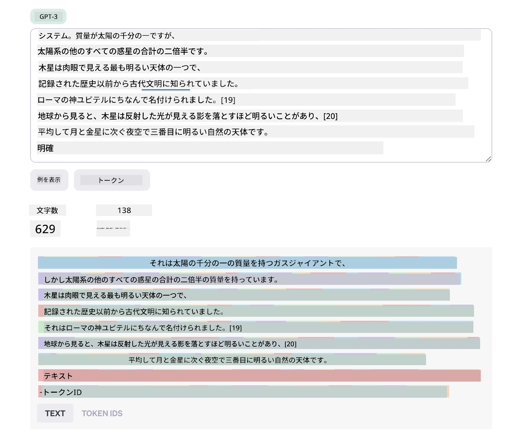
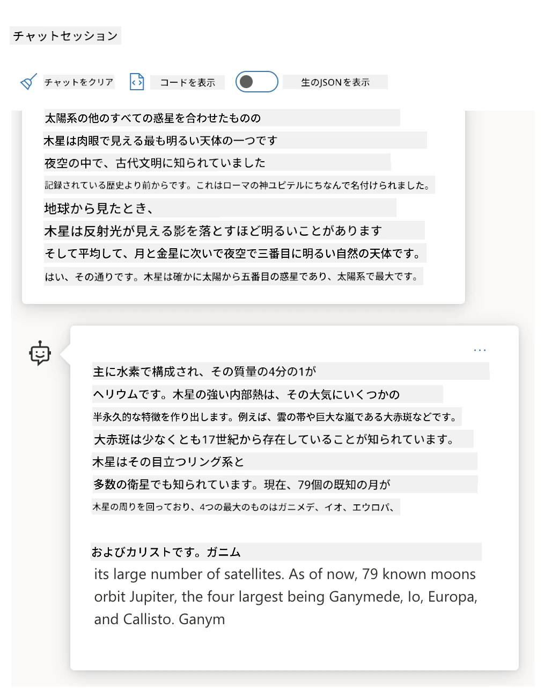
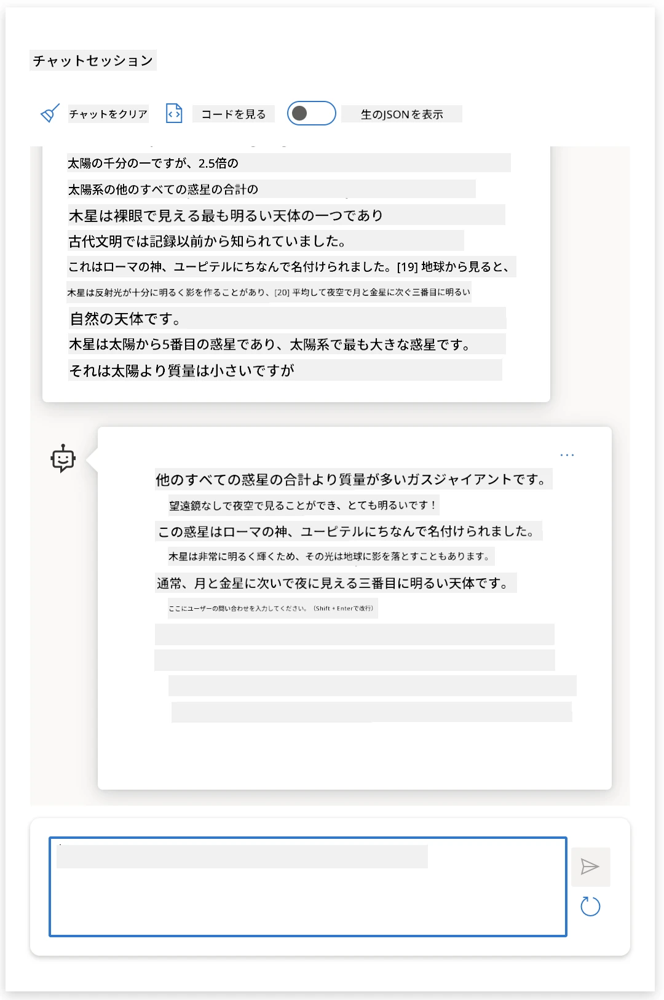
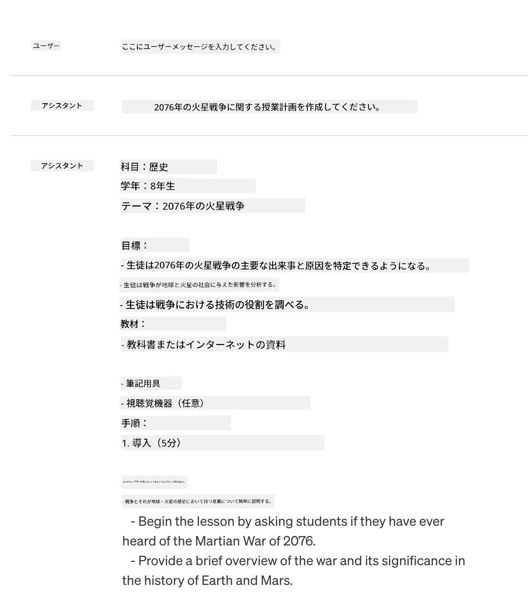
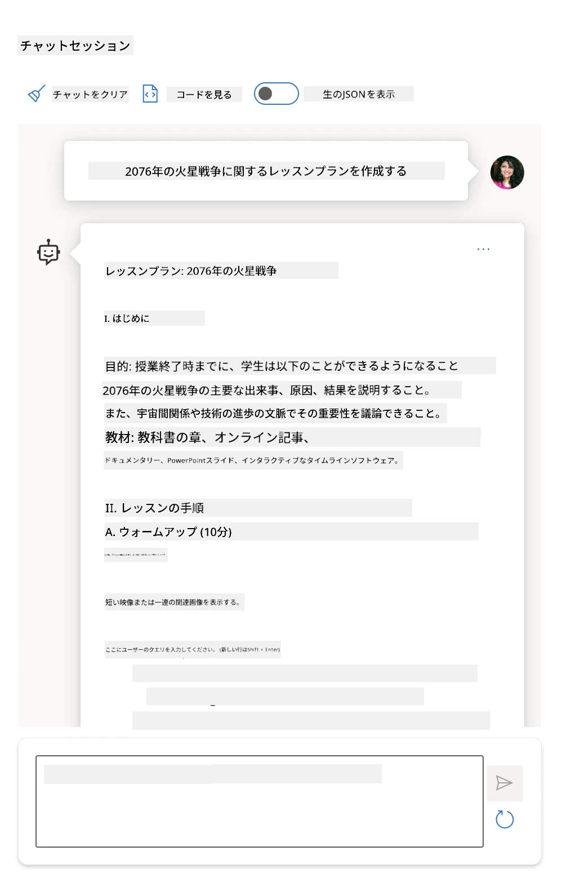
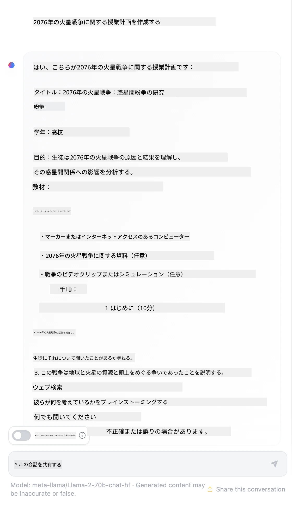

# プロンプトエンジニアリングの基礎

[](https://youtu.be/GElCu2kUlRs?si=qrXsBvXnCW12epb8)

## はじめに
このモジュールでは、生成AIモデルに効果的なプロンプトを作成するための基本的な概念と技法を扱います。LLMに対してどのようにプロンプトを書くかも重要です。注意深く作成されたプロンプトは、より高品質な応答を得ることができます。しかし、「プロンプト」や「プロンプトエンジニアリング」という用語は具体的に何を意味するのでしょうか？そして、LLMに送るプロンプトの「入力」をどのように改善すればよいのでしょうか？これらの疑問に、今章と次章で答えていきます。

_生成AI_は、ユーザーのリクエストに応じて新しいコンテンツ（例：テキスト、画像、音声、コードなど）を作り出す能力があります。これは、OpenAIのGPT（「Generative Pre-trained Transformer」）シリーズのような自然言語やコードの利用を想定してトレーニングされた_Large Language Models_（大規模言語モデル）を用いて実現されています。

ユーザーは今や、技術的な専門知識や訓練なしに、チャットのような馴染みのある手法でこれらのモデルと対話できます。モデルは_プロンプトベース_であり、ユーザーはテキスト入力（プロンプト）を送り、AIの応答（完了）を受け取ります。そして「AIとチャット」を繰り返し、多ターンの会話でプロンプトを洗練させて応答が期待に合うまで調整できます。

プロンプトは今や、生成AIアプリの主要な_プログラミングインターフェース_となり、モデルに何をさせるかを指示し、返される応答の質に影響を与えます。「プロンプトエンジニアリング」は、スケールで一貫して質の高い応答を提供するために、プロンプトの_設計と最適化_に注目する急速に成長している研究分野です。

## 学習目標

このレッスンでは、プロンプトエンジニアリングとは何か、その重要性、そして特定のモデルとアプリケーションの目的に合わせてより効果的なプロンプトを作成する方法について学びます。プロンプトエンジニアリングの基本概念とベストプラクティスを理解し、これらの概念を実例に応用できるインタラクティブなJupyterノートブック「サンドボックス」環境についても学びます。

このレッスンの終わりには、以下ができるようになります：

1. プロンプトエンジニアリングとは何か、なぜ重要か説明できる。
2. プロンプトの構成要素とその使い方を説明できる。
3. プロンプトエンジニアリングのベストプラクティスや手法を学ぶ。
4. 学んだ技術を実例に応用し、OpenAIエンドポイントを使える。

## 重要用語

プロンプトエンジニアリング：AIモデルが望ましい出力を生成するように入力を設計・洗練する実践。
トークナイゼーション：テキストをモデルが理解・処理可能な小さな単位（トークン）に変換する過程。
指示チューニング済みLLM：応答の正確性や関連性を向上させるために特定の指示で微調整された大規模言語モデル（LLM）。

## 学習サンドボックス

プロンプトエンジニアリングは現在、科学というよりは芸術に近いです。直感を鍛える最良の方法は、_繰り返し実践_し、応用ドメインの専門知識と推奨技法、モデル固有の最適化を組み合わせた試行錯誤のアプローチを採用することです。

このレッスンに付随するJupyterノートブックは、学んだことを実際に試せる_サンドボックス_環境を提供します。練習問題を実行するためには以下が必要です：

1. **Azure OpenAI APIキー** - 展開されたLLMのサービスエンドポイント。
2. **Pythonランタイム** - ノートブックを実行できる環境。
3. **ローカル環境変数** - 今すぐ[SETUP](./../00-course-setup/02-setup-local.md?WT.mc_id=academic-105485-koreyst)手順を完了し準備してください。

ノートブックには_スターター_練習問題が用意されていますが、より多くの例やアイデアを試すために独自の_マークダウン_（説明）や_コード_（プロンプトリクエスト）セクションを追加することが推奨され、プロンプト設計に対する直感を鍛えられます。

## イラスト付きガイド

このレッスンで扱う全体像を事前に把握したいですか？このイラスト付きガイドをご覧ください。主なトピックとそれぞれのキーテイクアウェイ（重要なポイント）を示し、コアコンセプトや課題の理解から、それらに対処する関連するプロンプトエンジニアリング技法とベストプラクティスまでのロードマップを示しています。このガイドの「高度な技法」セクションは、本カリキュラムの_次章_で扱う内容を指しています。


## 当社スタートアップについて

さて、本トピックが私たちのスタートアップのミッションである[教育にAIイノベーションをもたらす](https://educationblog.microsoft.com/2023/06/collaborating-to-bring-ai-innovation-to-education?WT.mc_id=academic-105485-koreyst)こととどう関連するか話しましょう。私たちは_AIを活用したパーソナライズ学習_アプリケーションの構築を目指しています。そこで、アプリの異なるユーザーがどのようにプロンプトを「設計」するか考えてみます：

- **管理者**は、AIに_カリキュラムデータを分析し、未カバー領域を特定_するよう依頼するかもしれません。AIは結果を要約したり、コードで可視化できます。
- **教育者**は、AIに_対象の学習者層とトピックに合わせたレッスンプランの生成_を依頼するかもしれません。AIは指定した形式でパーソナライズプランを作成します。
- **学生**は、AIに_難しい科目のチュータリング_を求めるかもしれません。AIは学習者のレベルに合わせたレッスンやヒント、例を提供します。

これは氷山の一角に過ぎません。教育専門家がキュレーションしたオープンソースのプロンプトライブラリ[Prompts For Education](https://github.com/microsoft/prompts-for-edu/tree/main?WT.mc_id=academic-105485-koreyst)をチェックして、可能性をさらに広く感じてみてください！_ぜひこれらのプロンプトをサンドボックスやOpenAI Playgroundで実行してみて、どんな結果が得られるか試してみましょう！_

<!--
LESSON TEMPLATE:
このユニットではコアコンセプト#1を扱います。
例や参考資料でコンセプトを強化します。

CONCEPT #1:
プロンプトエンジニアリング。
定義と必要性の説明。
-->

## プロンプトエンジニアリングとは？

このレッスンの冒頭で、**プロンプトエンジニアリング**を、特定のアプリケーション目的とモデルに対して、一貫性のある質の高い応答（完了）をもたらすテキスト入力（プロンプト）を_設計し最適化する_プロセスと定義しました。これは以下の2段階のプロセスと考えられます：

- 特定のモデルと目的に対して初期プロンプトを_設計_する
- 応答の質を向上させるためにプロンプトを反復的に_洗練_する

これは必然的に試行錯誤のプロセスであり、最適な結果を出すにはユーザーの直感と努力が必要です。では、なぜ重要なのでしょうか？その答えを理解するために、まず3つの概念を理解する必要があります：

- _トークナイゼーション_＝モデルがプロンプトを「どのように見るか」
- _基盤LLM_＝基礎モデルがプロンプトを「どのように処理するか」
- _指示チューニング済みLLM_＝モデルが「タスクをどう認識するか」

### トークナイゼーション

LLMはプロンプトを_トークンの連なり_として見ます。同じプロンプトを異なるモデル（または同一モデルの異なるバージョン）が異なる方法でトークナイズすることがあります。LLMはトークンで訓練されており（生テキストではないため）、プロンプトがどのようにトークナイズされるかが生成される応答の質に直接影響します。

トークナイゼーションの感覚を掴みたい場合は、以下のようなツールを試してください：[OpenAI Tokenizer](https://platform.openai.com/tokenizer?WT.mc_id=academic-105485-koreyst)。プロンプトをコピー＆ペーストして、どのようにトークンに変換されるか、ご注意いただきたいのは空白文字や句読点の扱いです。この例は古いLLM（GPT-3）を示しているため、新しいモデルでは異なる結果が出るかもしれません。



### コンセプト：基盤モデル

プロンプトがトークナイズされると、["基盤LLM"](https://blog.gopenai.com/an-introduction-to-base-and-instruction-tuned-large-language-models-8de102c785a6?WT.mc_id=academic-105485-koreyst)（ファンデーションモデル）の主な役割は、そのシーケンスの次のトークンを予測することです。LLMは膨大なテキストデータセットで訓練されており、トークン間の統計的関係を把握して、その予測をある程度の確信を持って行えます。プロンプトやトークンの_意味_を理解するわけではなく、次の予測で「埋める」ことができるパターンとして捉えています。ユーザーの介入や事前設定条件により終了するまで、予測は続行されます。

プロンプトベースの完了処理がどのように動くのか見たいですか？上記のプロンプトをAzure OpenAI Studioの[_Chat Playground_](https://oai.azure.com/playground?WT.mc_id=academic-105485-koreyst)にデフォルト設定で入力してみてください。システムはプロンプトを情報要求として扱う設定なので、この文脈に合った応答が得られるはずです。

しかし、ユーザーが特定の条件やタスク目的を満たす応答を求める場合はどうでしょうか？ここで_指示チューニング済み_LLMが登場します。



### コンセプト：指示チューニング済みLLM

[指示チューニング済みLLM](https://blog.gopenai.com/an-introduction-to-base-and-instruction-tuned-large-language-models-8de102c785a6?WT.mc_id=academic-105485-koreyst)は基盤モデルを土台にし、明確な指示が含まれる例や入出力ペア（例：多ターンの「メッセージ」）で微調整されています。AIの応答はその指示に従うことを試みます。

これは人間のフィードバックを使った強化学習（RLHF）などの技術を用い、モデルが_指示に従い_、_フィードバックから学習_し、実用的な用途により適した応答を生成できるよう訓練されています。

試してみましょう。先ほどのプロンプトに戻り、_システムメッセージ_を以下の指示を含むコンテキストに変えてください：

> _提供された内容を2年生の学生向けに要約してください。結果は3～5個の箇条書きで1段落にまとめてください。_

応答が望ましい目的と形式に合わせて調整されていることがわかります。教育者はこの応答を授業のスライドに直接使用できます。



## なぜプロンプトエンジニアリングが必要か？

プロンプトがLLMでどのように処理されるかを理解したところで、なぜプロンプトエンジニアリングが必要なのか話しましょう。その答えは、現在のLLMがいくつかの課題を抱えており、これによりプロンプト作成と最適化に努力を払わないと_信頼できて一貫した完了_を得にくいためです。例えば：

1. **モデルの応答は確率的です。** _同じプロンプト_でも異なるモデルやモデルバージョンで異なる応答を生成する可能性があります。同じモデルであっても、異なる時刻に異なる結果が出ることもあります。_プロンプトエンジニアリングはこうした変動を最小化するためのガードレールを提供します_。

1. **モデルは応答を捏造することがあります。** モデルは_大規模だが有限の_データセットで事前訓練されているため、その訓練範囲外の概念に関する知識が不足しています。その結果、不正確、架空、または既知の事実と矛盾する完了を作ることがあります。_プロンプトエンジニアリングにより、AIに引用箇所や理由付けを求めるなど、こうした捏造を特定し軽減できます_。

1. **モデルの性能は異なります。** 新しいモデルやモデル世代は豊かな能力を持ちますが、コストや複雑性で独特の特徴やトレードオフも伴います。_プロンプトエンジニアリングは、違いを抽象化し、モデル固有の要件に対応可能なベストプラクティスとワークフローを開発するのに役立ちます_。

これらをOpenAIやAzure OpenAI Playgroundで体験してみましょう：

- 同じプロンプトを異なるLLM展開（例：OpenAI, Azure OpenAI, Hugging Face）で使ってみて、変動を体験しましたか？
- 同じプロンプトを同じLLM展開（例：Azure OpenAI Playground）で繰り返し使って、どのように変動が違いましたか？

### 捏造の例

このコースでは「**捏造**」という用語を、LLMが事前訓練やその他の制約により時折事実に反する情報を生成してしまう現象を指す際に使います。この現象は一般的な記事や研究論文では「_幻覚_」とも呼ばれますが、機械の動作を人間の特性に見立てることを避けるため、_「捏造」_という用語の使用を強く推奨しています。これは[Responsible AI ガイドライン](https://www.microsoft.com/ai/responsible-ai?WT.mc_id=academic-105485-koreyst)の観点からも言葉の選択に配慮したものであり、一部の文脈で攻撃的または包含的でない用語と見なされ得る表現を除外します。

捏造がどのように働くかイメージしたいですか？AIに存在しないトピックのコンテンツ生成を指示するプロンプトを考えてください（それにより訓練データセットに存在しないことを保証します）。例えば、私が試したプロンプトは：

> **プロンプト:** 2076年の火星戦争に関するレッスンプランを生成してください。
ウェブ検索では、火星戦争に関する架空の物語（例：テレビシリーズや書籍）があることが示されましたが、2076年に関するものはありませんでした。常識的にも2076年は未来であり、実際の出来事と結びつけることはできません。

では、このプロンプトを異なるLLMプロバイダーで実行するとどうなるでしょうか？

> **回答1**: OpenAI Playground (GPT-35)



> **回答2**: Azure OpenAI Playground (GPT-35)



> **回答3**: : Hugging Face Chat Playground (LLama-2)



予想通り、各モデル（またはモデルバージョン）は、確率的な動作とモデル能力の違いにより、わずかに異なる応答を生成しました。例えば、一つのモデルは8年生向けを対象とし、もう一つは高校生を想定しています。しかし、3つのモデル全てが、事実に無知なユーザーを納得させ得る回答を生成しました。

_メタプロンプティング_や_温度設定_のようなプロンプト技術は、ある程度モデルの虚偽生成を抑制できます。新しいプロンプト設計の_アーキテクチャ_は、これらの効果を軽減または減らすために、新たなツールや技術をプロンプトフローにシームレスに組み込んでいます。

## ケーススタディ：GitHub Copilot

このセクションを締めくくるにあたり、実際のソリューションでどのようにプロンプトエンジニアリングが用いられているか、[GitHub Copilot](https://github.com/features/copilot?WT.mc_id=academic-105485-koreyst)のケーススタディを見てみましょう。

GitHub Copilotは「AIペアプログラマー」であり、テキストプロンプトをコード補完に変換し、開発環境（例：Visual Studio Code）に統合されてシームレスなユーザー体験を提供します。以下のブログシリーズで記述されている通り、最初期バージョンはOpenAI Codexモデルに基づいており、エンジニアはコード品質向上のためモデルのファインチューニングやプロンプト技術の改良の必要性を素早く認識しました。2023年7月には、[Codexを超える改良されたAIモデル](https://github.blog/2023-07-28-smarter-more-efficient-coding-github-copilot-goes-beyond-codex-with-improved-ai-model/?WT.mc_id=academic-105485-koreyst)が登場し、さらに高速な提案を可能にしました。

彼らの学びの軌跡を追うために、以下の投稿を順に読んでみてください。

- **2023年5月** | [GitHub Copilotはコードの理解がより良くなっています](https://github.blog/2023-05-17-how-github-copilot-is-getting-better-at-understanding-your-code/?WT.mc_id=academic-105485-koreyst)
- **2023年5月** | [Inside GitHub: GitHub Copilot背後のLLMと付き合う](https://github.blog/2023-05-17-inside-github-working-with-the-llms-behind-github-copilot/?WT.mc_id=academic-105485-koreyst)
- **2023年6月** | [GitHub Copilotのより良いプロンプトを書く方法](https://github.blog/2023-06-20-how-to-write-better-prompts-for-github-copilot/?WT.mc_id=academic-105485-koreyst)
- **2023年7月** | [GitHub Copilot、改良されたAIモデルでCodexを超える](https://github.blog/2023-07-28-smarter-more-efficient-coding-github-copilot-goes-beyond-codex-with-improved-ai-model/?WT.mc_id=academic-105485-koreyst)
- **2023年7月** | [開発者向けのプロンプトエンジニアリングとLLMガイド](https://github.blog/2023-07-17-prompt-engineering-guide-generative-ai-llms/?WT.mc_id=academic-105485-koreyst)
- **2023年9月** | [エンタープライズLLMアプリの構築法：GitHub Copilotからの教訓](https://github.blog/2023-09-06-how-to-build-an-enterprise-llm-application-lessons-from-github-copilot/?WT.mc_id=academic-105485-koreyst)

また、彼らの[エンジニアリングブログ](https://github.blog/category/engineering/?WT.mc_id=academic-105485-koreyst)も閲覧できます。こちらの[投稿](https://github.blog/2023-09-27-how-i-used-github-copilot-chat-to-build-a-reactjs-gallery-prototype/?WT.mc_id=academic-105485-koreyst)は、これらのモデルと技術が実際のアプリケーションを動かすためにどのように_応用_されているかを示しています。

---

## プロンプト構築

なぜプロンプトエンジニアリングが重要なのかを理解しました。次に、効果的なプロンプト設計を評価できるよう、プロンプトがどのように_構築される_かを理解しましょう。

### 基本的なプロンプト

まずは基本のプロンプト：モデルに送信される他の文脈なしのテキスト入力です。例えば、米国国歌の最初の数語をOpenAIの[Completion API](https://platform.openai.com/docs/api-reference/completions?WT.mc_id=academic-105485-koreyst)に送ると、次の数行で即座に応答を_補完_し、基本的な予測動作を示します。

| プロンプト（入力）    | 補完（出力）                                                                                                                                |
| :----------------- | :----------------------------------------------------------------------------------------------------------------------------------------- |
| Oh say can you see | あなたは「星条旗」の歌詞を始めているようですね。星条旗はアメリカ合衆国の国歌です。全文の歌詞は...                                                       |

### 複雑なプロンプト

次に基本プロンプトにコンテキストと指示を加えてみましょう。[チャット補完API](https://learn.microsoft.com/azure/ai-services/openai/how-to/chatgpt?WT.mc_id=academic-105485-koreyst)では、複雑なプロンプトとして以下のような_メッセージ_の集合を構築できます：

- 入力／出力ペアは_user_の入力と_assistant_の応答を反映。
- システムメッセージはアシスタントの動作や人格のコンテキストを設定。

リクエストは以下の形になり、_トークン化_はコンテキストや会話から関連情報を効果的に捉えます。システムの文脈を変えることは、ユーザーの入力と同じくらい補完の品質に影響します。

```python
response = openai.chat.completions.create(
    model="gpt-3.5-turbo",
    messages=[
        {"role": "system", "content": "You are a helpful assistant."},
        {"role": "user", "content": "Who won the world series in 2020?"},
        {"role": "assistant", "content": "The Los Angeles Dodgers won the World Series in 2020."},
        {"role": "user", "content": "Where was it played?"}
    ]
)
```


### 指示プロンプト

上の例では、ユーザープロンプトは情報要求として解釈できる単純なテキストクエリでした。_指示_プロンプトでは、そのテキストでタスクをより詳細に指定してAIへの指示を強化できます。例を示します：

| プロンプト（入力）                                                                                                                                                                                                                         | 補完（出力）                                                                                                        | 指示タイプ            |
| :------------------------------------------------------------------------------------------------------------------------------------------------------------------------------------------------------------------------------------- | :----------------------------------------------------------------------------------------------------------------- | :-------------------- |
| Write a description of the Civil War                                                                                                                                                                                                   | _短い段落を返した_                                                                                                | シンプル              |
| Write a description of the Civil War. Provide key dates and events and describe their significance                                                                                                                                     | _段落に続き、重要な日付のリストと説明を返した_                                                                   | 複雑                 |
| Write a description of the Civil War in 1 paragraph. Provide 3 bullet points with key dates and their significance. Provide 3 more bullet points with key historical figures and their contributions. Return the output as a JSON file | _より詳細な情報をテキストボックス内のJSON形式で返し、コピーしてファイルに貼り付け検証可能_                          | 複雑。フォーマット済み |

## プライマリーコンテンツ

上の例では、まだプロンプトが比較的自由形式であり、LLMがあらかじめ学習したデータセットのどの部分が関連するかを自由に決定できました。_プライマリーコンテンツ_の設計パターンでは、入力テキストを以下の2つに分割します：

- 指示（アクション）
- 関連コンテンツ（アクションに影響を与える）

例として、「これを2文で要約せよ」という指示のケースです。

| プロンプト（入力）                                                                                                                                                                                                                                                                                                                                                                                                                                                                                                                                                                                                                                                                                      | 補完（出力）                                                                                                                                                                                                                                                                             |
| :-------------------------------------------------------------------------------------------------------------------------------------------------------------------------------------------------------------------------------------------------------------------------------------------------------------------------------------------------------------------------------------------------------------------------------------------------------------------------------------------------------------------------------------------------------------------------------------------------------------------------------------------------------------------------------------------------- | :---------------------------------------------------------------------------------------------------------------------------------------------------------------------------------------------------------------------------------------------------------------------------------------------- |
| 木星は太陽から5番目の惑星であり、太陽系で最大の惑星です。これはガスジャイアントで、質量は太陽の千分の一ですが、太陽系の他のすべての惑星の合計の2.5倍に相当します。木星は夜空で肉眼で見える最も明るい天体の一つであり、古代文明時代から知られていました。ローマ神話の木星神に因んで名付けられました。[19] 地球から見ると、木星は反射光で影ができるほど明るく[20]、月と金星に次いで夜空で3番目に明るい自然天体です。<br/>**これを2文で要約せよ** | 木星は太陽から5番目の惑星で、太陽系最大の惑星として知られています。ローマ神の名を冠したこのガスジャイアントは、他の全惑星の合計質量の2.5倍に及びます。 |

プライマリーコンテンツはさまざまな方法で効果的な指示を促進します：

- **例示** - 明示的な指示を伝える代わりに、例を与えてモデルにパターンを推論させる。
- **キュー** - 指示に続いて、応答形式を示す「合図」を加え、モデルをより的確な回答に導く。
- **テンプレート** - プレースホルダー（変数）を備えた繰り返し可能なプロンプトの「レシピ」で、特定のデータでカスタマイズ可能。

これらを具体的に見ていきましょう。

### 例示の使用

これは、プライマリーコンテンツとしてタスクに対する出力例をモデルに「与え」、望ましい出力パターンを推論させる手法です。例の数によって、ゼロショット、ワンショット、フューショットのプロンプトが可能です。

プロンプトは次の3つの要素で構成されます：

- タスクの説明
- 望ましい出力のいくつかの例
- 新しい例の開始（暗黙のタスク説明となる）

| 学習タイプ   | プロンプト（入力）                                                                                                                                        | 補完（出力）              |
| :---------- | :------------------------------------------------------------------------------------------------------------------------------------------------------ | :------------------------- |
| ゼロショット | "The Sun is Shining". スペイン語に翻訳せよ                                                                                                             | "El Sol está brillando".   |
| ワンショット | "The Sun is Shining" => "El Sol está brillando"。<br>"It's a Cold and Windy Day" =>                                                                    | "Es un día frío y ventoso" |
| フューショット | The player ran the bases => Baseball <br/> The player hit an ace => Tennis <br/> The player hit a six => Cricket <br/> The player made a slam-dunk =>   | Basketball                 |
|             |                                                                                                                                                          |                           |

ゼロショットでは明示的な指示（「スペイン語に翻訳せよ」）が必要ですが、ワンショットでは例示によって指示が推論されます。フューショットでは複数例追加で、モデルが明示的な指示なしにさらに正確な推論を可能にしています。

### プロンプトキュー

プライマリーコンテンツを使う別の手法として、例ではなく_キュー_を与えるものがあります。この場合、望ましい応答形式を反映する一部の文字列で「開始」することでモデルにヒントを与えます。モデルはこのキューを受けて、その形式で続きを生成します。

| キュー数     | プロンプト（入力）                                                                                                                                                                                                                                                                                                                                                                                                                                               | 補完（出力）                                                                                                                                                                                                                                                                                       |
| :---------- | :----------------------------------------------------------------------------------------------------------------------------------------------------------------------------------------------------------------------------------------------------------------------------------------------------------------------------------------------------------------------------------------------------------------------------------------------------------- | :------------------------------------------------------------------------------------------------------------------------------------------------------------------------------------------------------------------------------------------------------------------------------------------------- |
| 0           | 木星は太陽から5番目の惑星であり、太陽系で最大の惑星です。これはガスジャイアントで、質量は太陽の千分の一ですが、太陽系の他のすべての惑星の合計の2.5倍に相当します。木星は夜空で肉眼で見える最も明るい天体の一つであり、古代文明時代から知られていました。<br/>**これを要約せよ**                                        | 木星は太陽系で最大の惑星で、太陽から5番目に位置します。質量は太陽の千分の一ですが、他の全惑星の合計質量を超えます。古代文明から知られ、夜空で明るく見えます。                                                                                                                                                                    |
| 1              | 木星は太陽から数えて5番目の惑星で、太陽系で最大の惑星です。質量は太陽の千分の一ですが、太陽系の他のすべての惑星の合計の2.5倍です。木星はガスジャイアントで、夜空で肉眼で見える最も明るい天体の一つであり、記録された歴史以前から古代文明に知られていました。<br/>**これを要約すると**<br/>私たちが学んだことは、木星は太陽から5番目の惑星であり、太陽系で最大の惑星であることです。これは太陽の千分の一の質量を持つガスジャイアントですが、他のすべての惑星の質量の合計の2.5倍です。肉眼で簡単に見ることができ、古代から知られていました。                        |
| 2              | 木星は太陽から数えて5番目の惑星で、太陽系で最大の惑星です。質量は太陽の千分の一ですが、太陽系の他のすべての惑星の合計の2.5倍です。木星はガスジャイアントで、夜空で肉眼で見える最も明るい天体の一つであり、記録された歴史以前から古代文明に知られていました。<br/>**これを要約すると**<br/>私たちが学んだトップ3の事実：         | 1. 木星は太陽から5番目の惑星で、太陽系で最大の惑星です。<br/> 2. それは太陽の千分の一の質量を持つガスジャイアントですが…<br/> 3. 木星は古代から肉眼で見えていました…                                                                       |
|                |                                                                                                                                                                                                                                                                                                                                                                                                                                                              |                                                                                                                                                                                                                                                                                                           |

### プロンプトテンプレート

プロンプトテンプレートとは、ユーザー体験の一貫性を拡大して促進するために保存して再利用できる、あらかじめ定義された「プロンプトのレシピ」です。最もシンプルな形では、[OpenAIのこれ](https://platform.openai.com/examples?WT.mc_id=academic-105485-koreyst)のように、対話型のプロンプト構成要素（ユーザーとシステムメッセージ）とAPIベースのリクエストフォーマットの両方を提供するプロンプト例のコレクションです。

より複雑な形では、[LangChainのこれ](https://python.langchain.com/docs/concepts/prompt_templates/?WT.mc_id=academic-105485-koreyst)のように、様々なソース（ユーザー入力、システムコンテキスト、外部データソースなど）からのデータで置き換えられる「プレースホルダー」を含んでおり、動的にプロンプトを生成可能です。これにより、プログラム的に一貫したユーザー体験をスケールして提供できる再利用可能なプロンプトのライブラリを作成できます。

最終的に、テンプレートの真価は、特定の垂直産業領域向けに作成・公開される「プロンプトライブラリ」にあります。ここでは、アプリケーション固有の文脈や例を反映し、対象ユーザーにより関連性が高く正確な応答をもたらすよう最適化されたプロンプトテンプレートとなります。[Prompts For Edu](https://github.com/microsoft/prompts-for-edu?WT.mc_id=academic-105485-koreyst)リポジトリは、教育分野向けにレッスンプランニング、カリキュラム設計、学生指導などの重要目標に重点を置いたプロンプトライブラリをキュレーションしている素晴らしい例です。

## 補助コンテンツ

プロンプト構築を「指示（タスク）」と「対象（主要コンテンツ）」だと考えると、「副次的コンテンツ」はアウトプットに何らかの形で影響を与える追加の文脈のようなものです。チューニングパラメーター、フォーマット指示、トピックの分類体系など、モデルが出力を調整して、望ましいユーザー目標や期待に合うようにするために役立ちます。

例えば、カリキュラム内のすべての利用可能なコースに関する詳細なメタデータ（名前、説明、レベル、メタタグ、講師など）があるコースカタログがあるとします。

- 「2023年秋学期のコースカタログを要約せよ」という指示を定義し、
- 望ましい出力の例をいくつか主要コンテンツとして提供し、
- 副次的コンテンツで上位5つの「タグ」を指定できます。

この場合、モデルは例で示されたフォーマットに沿った要約を提供できますが、タグが複数ある場合には副次的コンテンツで特定した5つのタグを優先的に扱えます。

---

<!--
LESSON TEMPLATE:
This unit should cover core concept #1.
Reinforce the concept with examples and references.

CONCEPT #3:
Prompt Engineering Techniques.
What are some basic techniques for prompt engineering?
Illustrate it with some exercises.
-->

## プロンプトのベストプラクティス

プロンプトの構築方法が分かったところで、次はそれを「設計」してベストプラクティスを反映する方法について考えましょう。考え方は大きく二つ、「正しいマインドセットを持つこと」と「適切な技法を適用すること」です。

### プロンプトエンジニアリングのマインドセット

プロンプトエンジニアリングは試行錯誤のプロセスです。以下の3つの広範な指針を念頭に置いてください。

1. **ドメイン理解が重要。** 応答の正確性と関連度は、アプリケーションやユーザーが動作するドメインに依存します。直感やドメイン専門知識を用いて**テクニックをカスタマイズ**しましょう。例えば、システムプロンプトにドメイン固有のパーソナリティを設定したり、ユーザープロンプトにドメイン特有のテンプレートを使用したり。副次的コンテンツでドメイン固有の文脈を反映させたり、ドメイン固有のキューや例を用いてモデルに馴染みのある表現パターンへ誘導したりします。

2. **モデル理解が重要。** モデルは確率的であることは分かっていますが、使用するトレーニングデータセット（事前学習知識）や、提供される機能（APIやSDKを介したものなど）、最適化されているコンテンツの種類（コード、画像、テキストなど）により実装が異なります。使用するモデルの強みと限界を理解し、その知識を活かして_タスクの優先順位付け_や_モデルの能力に特化したカスタムテンプレート_を作ります。

3. **反復と検証が重要。** モデルや技術は急速に進化しています。ドメイン専門家として、自分の特定のアプリケーションに固有の文脈や基準を持つかもしれません。プロンプトエンジニアリングのツールや技術を使ってプロンプト構築をスタートさせ、反復的に検証・改善しながら自分の直感と専門知識で調整してください。知見を記録し、他者が将来の反復をより速く行えるような**知識ベース**（例：プロンプトライブラリ）を構築しましょう。

## ベストプラクティス一覧

ここでは、[OpenAI](https://help.openai.com/en/articles/6654000-best-practices-for-prompt-engineering-with-openai-api?WT.mc_id=academic-105485-koreyst)と[Azure OpenAI](https://learn.microsoft.com/azure/ai-services/openai/concepts/prompt-engineering#best-practices?WT.mc_id=academic-105485-koreyst)の実務者が推奨する一般的なベストプラクティスを紹介します。

| 内容                              | 理由                                                                                                                                                                                                                                               |
| :-------------------------------- | :------------------------------------------------------------------------------------------------------------------------------------------------------------------------------------------------------------------------------------------------ |
| 最新モデルを評価する               | 新世代モデルは機能や品質が向上している可能性があり、コストは上がるかもしれません。有効性を評価して移行判断に活かしましょう。                                                                                                                |
| 指示と文脈を分ける                 | モデルやプロバイダーが指示、主要・副次的コンテンツの区切りを明確にする_区切り記号_を提供しているか確認してください。これにより、モデルがトークンの重要度をより正確に割り当てられます。                                                        |
| 具体的かつ明確に                   | 望ましい文脈、結果、長さ、フォーマット、スタイルについて詳細を指定しましょう。これにより応答の質と一貫性が改善されます。レシピを再利用可能なテンプレートに記録しましょう。                                                               |
| 説明的にし、例を使う               | モデルは「見て聞いて」方式の方が応答しやすいことがあります。最初は例なしの `zero-shot` 指示を与え、次に数例を使う `few-shot` を試すことで精度を上げられます。類推も活用しましょう。                                                      |
| キューで応答を促す                 | 反応を望ましい結果に向けて促すため、先導となる言葉やフレーズを与えて応答のスタートポイントにしましょう。                                                                                                                                    |
| 繰り返して強調する                 | 時にモデルに指示を繰り返す必要があります。主要コンテンツの前後に指示を入れたり、指示とキューを使うなど。何が効果的か繰り返し試して検証してください。                                                                                     |
| 順序は重要                       | モデルへの情報の提示順序は出力に影響します。学習例でも最新の情報ほど影響が強い「新近効果」があります。様々な順序で試して最良の結果を探しましょう。                                                                                      |
| モデルに「逃げ道」を与える         | タスクを完了できない場合に備え、モデルに_フォールバック_の応答を用意させましょう。偽や作り話の回答を減らせます。                                                                                                                               |
|                                   |                                                                                                                                                                                                                                                   |

ベストプラクティスは、モデル、タスク、ドメインによって効果が異なることを覚えておいてください。これらは出発点として使い、自分に合う方法を繰り返し見つけていきましょう。新しいモデルやツールが出るたびにプロンプトエンジニアリングのプロセスを再評価し、スケーラビリティと応答品質に注力してください。

<!--
LESSON TEMPLATE:
This unit should provide a code challenge if applicable

CHALLENGE:
Link to a Jupyter Notebook with only the code comments in the instructions (code sections are empty).

SOLUTION:
Link to a copy of that Notebook with the prompts filled in and run, showing what one example could be.
-->

## 課題

おめでとうございます！レッスンの最後まで進みました！ここで学んだ概念や技術を実際の例で試してみましょう。

課題にはJupyter Notebookを使います。対話的に演習を進められ、自分でMarkdownやコードセルを追加してアイデアや技術を探求することもできます。

### はじめに、リポジトリをフォークしてください

- （推奨）GitHub Codespacesを起動  
- （代替）リポジトリをローカルにクローンしDocker Desktopで使う  
- （代替）お好みのNotebook実行環境でNotebookを開く

### 次に環境変数を設定します

- リポジトリルートの `.env.copy` を `.env` にコピーし、`AZURE_OPENAI_API_KEY`、`AZURE_OPENAI_ENDPOINT`、`AZURE_OPENAI_DEPLOYMENT` を入力してください。[Learning Sandbox セクション](../../../04-prompt-engineering-fundamentals)に戻り設定方法を確認できます。

### そしてJupyter Notebookを開きます

- 実行カーネルを選択します。1または2の方法を使う場合は、開発コンテナが提供するデフォルトのPython 3.10.xカーネルを選べばOKです。

これで演習を始める準備ができました。ここでは正解や不正解はありません。試行錯誤しながら、モデルとアプリケーションドメインに適した直感を養いましょう。

_このため、本レッスンにはコードソリューションのセグメントはありません。代わりにNotebook内のMarkdownセル「My Solution:」で参考例が示されています。_

 <!--
LESSON TEMPLATE:
Wrap the section with a summary and resources for self-guided learning.
-->

## 知識チェック

以下のうち、妥当なベストプラクティスに沿った良いプロンプトはどれですか？

1. 赤い車の画像を見せて  
2. 崖のそばに停まって日没時の赤いボルボXC90の画像を見せて  
3. 赤いボルボXC90の画像を見せて

答え：2が最良のプロンプトです。何を求めているかを細かく示し、特定の車種や全体の設定も説明しています。3も次に良いですが、詳細を多く含んでいます。

## 🚀 チャレンジ

次のプロンプトに「キュー」技法を使えるか試してみましょう：Complete the sentence "Show me an image of red car of make Volvo and ". どんな応答が返り、どう改善できますか？

## 素晴らしい！学習を続けよう

プロンプトエンジニアリングのさまざまな概念をもっと学びたいなら、[継続学習ページ](https://aka.ms/genai-collection?WT.mc_id=academic-105485-koreyst)にアクセスして他の優れたリソースを探してみてください。

次はレッスン5で[高度なプロンプト技術](../05-advanced-prompts/README.md?WT.mc_id=academic-105485-koreyst)を紹介します！

---

<!-- CO-OP TRANSLATOR DISCLAIMER START -->
**免責事項**：  
本書類はAI翻訳サービス「[Co-op Translator](https://github.com/Azure/co-op-translator)」を使用して翻訳されました。正確さを期していますが、自動翻訳には誤りや不正確な箇所が含まれる場合があります。原文の言語によるオリジナル文書が正式な情報源として扱われるべきです。重要な情報に関しては、専門の人間による翻訳をおすすめします。本翻訳の使用に起因する誤解や誤訳について、一切の責任を負いかねます。
<!-- CO-OP TRANSLATOR DISCLAIMER END -->