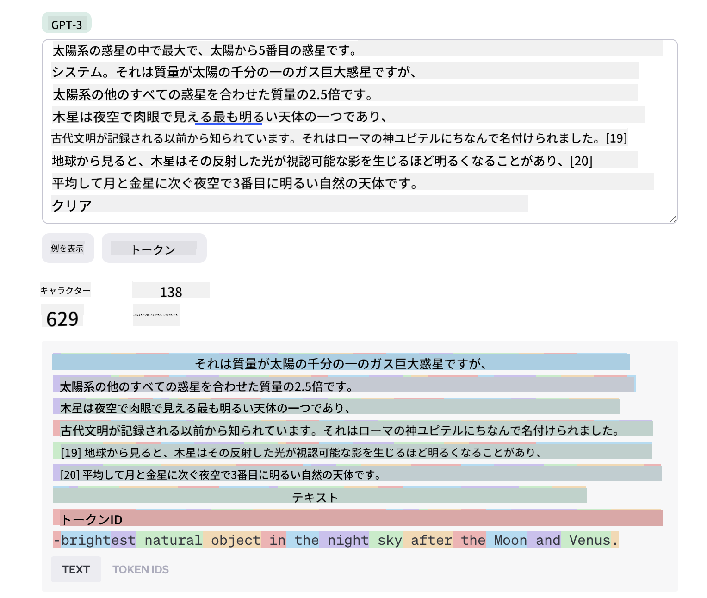
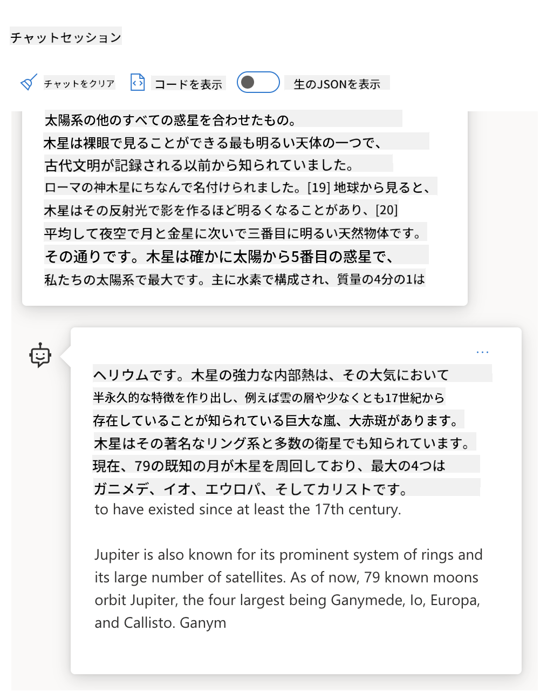
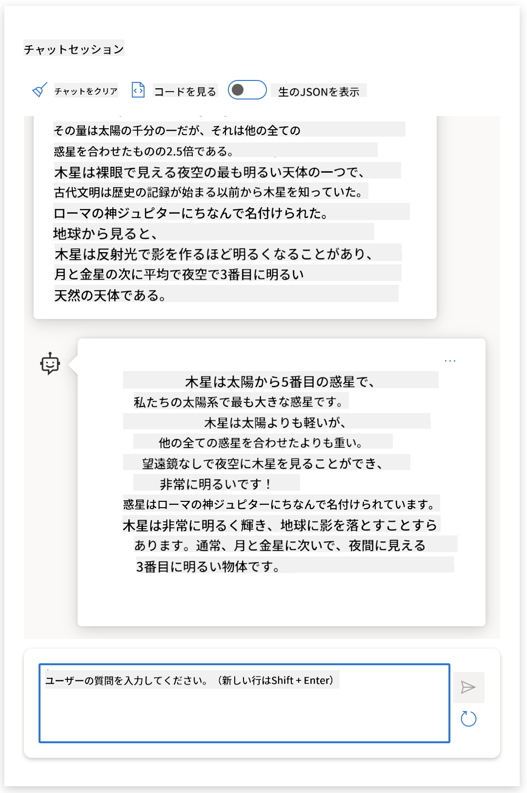
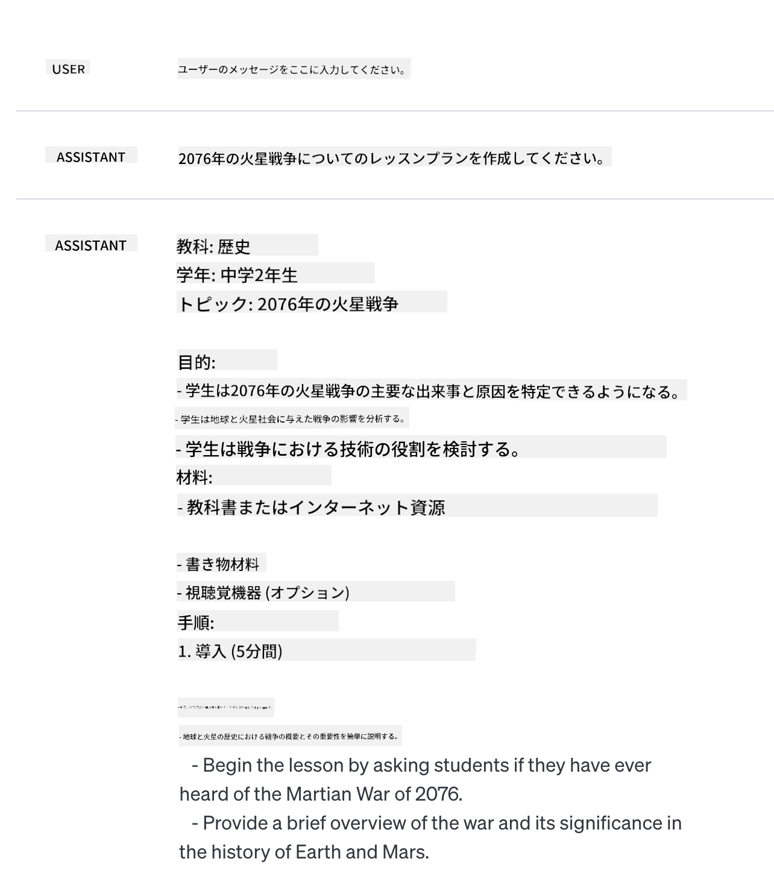
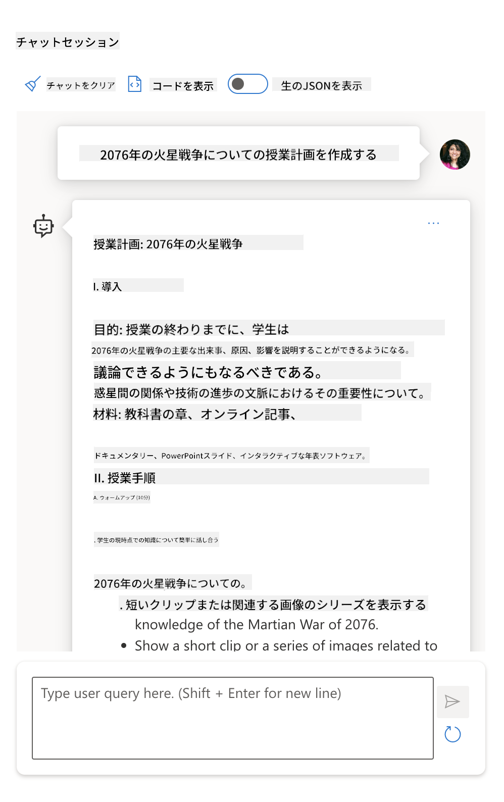
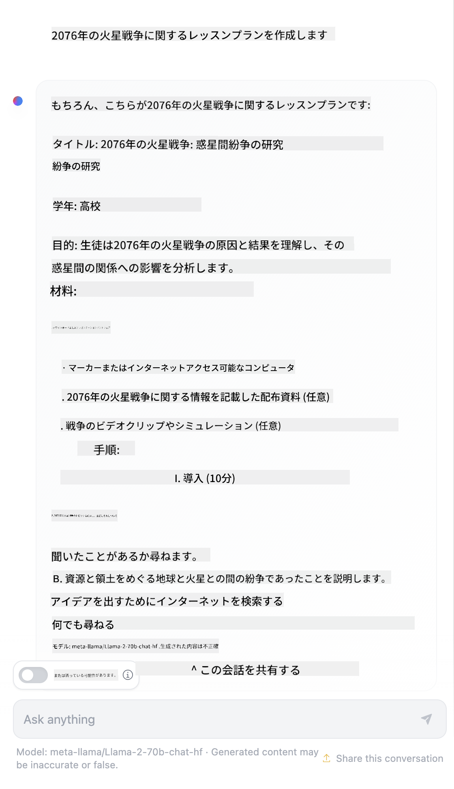

<!--
CO_OP_TRANSLATOR_METADATA:
{
  "original_hash": "dcbaaae026cb50fee071e690685b5843",
  "translation_date": "2025-08-26T15:09:32+00:00",
  "source_file": "04-prompt-engineering-fundamentals/README.md",
  "language_code": "ja"
}
-->
# プロンプトエンジニアリングの基礎

[](https://aka.ms/gen-ai-lesson4-gh?WT.mc_id=academic-105485-koreyst)

## はじめに
このモジュールでは、生成AIモデルで効果的なプロンプトを作成するための基本的な概念やテクニックを学びます。LLMに送るプロンプトの書き方も非常に重要です。丁寧に作られたプロンプトは、より質の高い応答を引き出すことができます。しかし、_プロンプト_ や _プロンプトエンジニアリング_ という言葉は具体的に何を意味するのでしょうか？また、LLMに送るプロンプト _入力_ をどう改善すればよいのでしょうか？この章と次の章で、これらの疑問に答えていきます。

_生成AI_ は、ユーザーのリクエストに応じて新しいコンテンツ（例：テキスト、画像、音声、コードなど）を作り出すことができます。これは、OpenAIのGPT（"Generative Pre-trained Transformer"）シリーズのような _大規模言語モデル_ を使い、自然言語やコードを扱うように訓練されています。

ユーザーは、チャットのような馴染みのあるインターフェースを使って、技術的な知識やトレーニングなしでこれらのモデルとやり取りできるようになりました。モデルは _プロンプトベース_ で動作し、ユーザーがテキスト入力（プロンプト）を送るとAIの応答（コンプリーション）が返ってきます。ユーザーはAIと何度もやり取りしながら、プロンプトを調整して期待通りの応答を得ることができます。

「プロンプト」は、生成AIアプリの主要な _プログラミングインターフェース_ となり、モデルに指示を与え、返ってくる応答の質に大きく影響します。「プロンプトエンジニアリング」は、プロンプトの _設計と最適化_ を通じて、一貫性のある高品質な応答を大規模に引き出すことを目指す、急成長中の分野です。

## 学習目標

このレッスンでは、プロンプトエンジニアリングとは何か、なぜ重要なのか、そして特定のモデルやアプリケーション目的に対してより効果的なプロンプトを作成する方法を学びます。プロンプトエンジニアリングの基本概念やベストプラクティスを理解し、実際の例にこれらの概念を適用できるインタラクティブなJupyter Notebook「サンドボックス」環境についても紹介します。

このレッスンの終わりには、次のことができるようになります：

1. プロンプトエンジニアリングとは何か、なぜ重要なのかを説明できる。
2. プロンプトの構成要素とその使い方を説明できる。
3. プロンプトエンジニアリングのベストプラクティスやテクニックを学ぶ。
4. 学んだテクニックをOpenAIエンドポイントを使って実例に適用できる。

## 重要用語

プロンプトエンジニアリング：AIモデルが望ましい出力を生成できるように入力を設計・改善する手法。
トークナイゼーション：テキストをモデルが理解・処理できる小さな単位（トークン）に分割するプロセス。
インストラクションチューニング済みLLM：特定の指示に従う精度や関連性を高めるために追加学習された大規模言語モデル。

## 学習サンドボックス

プロンプトエンジニアリングは、現時点では科学というよりもアートに近い分野です。直感を磨く最良の方法は、_たくさん練習する_ ことと、応用分野の知識と推奨テクニック、モデル固有の最適化を組み合わせた試行錯誤のアプローチを取ることです。

このレッスンに付属するJupyter Notebookは、学んだことをすぐに試せる _サンドボックス_ 環境を提供します。演習を実行するには、以下が必要です：

1. **Azure OpenAI APIキー** - デプロイ済みLLMのサービスエンドポイント
2. **Python実行環境** - Notebookを実行するため
3. **ローカル環境変数** - _[SETUP](./../00-course-setup/02-setup-local.md?WT.mc_id=academic-105485-koreyst) の手順を今すぐ完了して準備しましょう_

Notebookには _スターター_ 演習が用意されていますが、ぜひ自分自身で _Markdown_（説明）や _Code_（プロンプトリクエスト）のセクションを追加して、さらに多くの例やアイデアを試し、プロンプト設計の直感を養ってみてください。

## イラストで見るガイド

このレッスンの全体像を事前に把握したい方は、以下のイラストガイドをチェックしてみてください。主要なトピックや、それぞれで考えるべきポイントがまとめられています。レッスンのロードマップは、基本概念や課題の理解から、それらに対応するプロンプトエンジニアリングのテクニックやベストプラクティスの習得までをカバーしています。なお、このガイドの「高度なテクニック」セクションは、_次の章_ で扱う内容です。


## 私たちのスタートアップ

それでは、このトピックが私たちの「[教育にAIイノベーションをもたらす](https://educationblog.microsoft.com/2023/06/collaborating-to-bring-ai-innovation-to-education?WT.mc_id=academic-105485-koreyst)」というスタートアップのミッションとどう関係するか考えてみましょう。私たちは _パーソナライズ学習_ のためのAIアプリケーションを作りたいと考えています。では、アプリのさまざまなユーザーがどのようにプロンプトを「設計」するか想像してみましょう：

- **管理者** はAIに _カリキュラムデータを分析してカバー範囲のギャップを特定_ するよう依頼するかもしれません。AIは結果を要約したり、コードで可視化したりできます。
- **教育者** はAIに _特定の対象やトピック向けのレッスンプランを作成_ するよう依頼するかもしれません。AIは指定されたフォーマットでパーソナライズされたプランを作成できます。
- **生徒** はAIに _苦手な科目を教えてほしい_ と頼むかもしれません。AIは生徒のレベルに合わせてレッスンやヒント、例を提供できます。

これはほんの一例にすぎません。[Prompts For Education](https://github.com/microsoft/prompts-for-edu/tree/main?WT.mc_id=academic-105485-koreyst) という教育専門家が厳選したオープンソースのプロンプトライブラリもぜひご覧ください。_サンドボックスやOpenAI Playgroundでこれらのプロンプトを実際に試してみましょう！_

<!--
LESSON TEMPLATE:
This unit should cover core concept #1.
Reinforce the concept with examples and references.

CONCEPT #1:
Prompt Engineering.
Define it and explain why it is needed.
-->

## プロンプトエンジニアリングとは？

このレッスンの冒頭で、**プロンプトエンジニアリング** を、特定のアプリケーション目的やモデルに対して、一貫性のある高品質な応答（コンプリーション）を引き出すためにテキスト入力（プロンプト）を _設計・最適化_ するプロセスと定義しました。これは2つのステップに分けて考えることができます：

- モデルや目的に合わせて _初期プロンプトを設計_ する
- 応答の質を高めるために _プロンプトを繰り返し改善_ する

これは必然的に試行錯誤が必要なプロセスであり、最適な結果を得るにはユーザーの直感や工夫が求められます。では、なぜ重要なのでしょうか？その答えを知るには、まず次の3つの概念を理解する必要があります：

- _トークナイゼーション_ = モデルがプロンプトをどのように「見る」か
- _ベースLLM_ = 基盤モデルがプロンプトをどのように「処理」するか
- _インストラクションチューニング済みLLM_ = モデルが「タスク」をどのように認識できるか

### トークナイゼーション

LLMはプロンプトを _トークンの列_ として認識します。モデルやそのバージョンによって、同じプロンプトでもトークン化の方法が異なる場合があります。LLMはトークン（生のテキストではなく）で学習されているため、プロンプトがどのようにトークン化されるかが、生成される応答の質に直接影響します。

トークナイゼーションの仕組みを直感的に理解するには、[OpenAI Tokenizer](https://platform.openai.com/tokenizer?WT.mc_id=academic-105485-koreyst) のようなツールを試してみましょう。自分のプロンプトを入力して、どのようにトークンに変換されるか、空白や句読点がどのように扱われるかを確認してみてください。この例は古いLLM（GPT-3）を使っていますが、新しいモデルで試すと異なる結果になることもあります。



### 概念：基盤モデル

プロンプトがトークン化されると、["ベースLLM"](https://blog.gopenai.com/an-introduction-to-base-and-instruction-tuned-large-language-models-8de102c785a6?WT.mc_id=academic-105485-koreyst)（または基盤モデル）の主な役割は、そのトークン列の中で次に来るトークンを予測することです。LLMは膨大なテキストデータセットで学習されているため、トークン同士の統計的な関係を把握しており、ある程度自信を持って予測できます。ただし、プロンプトやトークンの _意味_ を理解しているわけではなく、あくまでパターンを見て「次に来るもの」を予測しているだけです。ユーザーの操作や事前に決められた条件で終了するまで、予測を続けることができます。

プロンプトベースのコンプリーションがどのように動作するか見てみたい場合は、上記のプロンプトをAzure OpenAI Studioの[_Chat Playground_](https://oai.azure.com/playground?WT.mc_id=academic-105485-koreyst)にデフォルト設定で入力してみてください。システムはプロンプトを情報リクエストとして扱うように設定されているので、その文脈に合ったコンプリーションが返ってくるはずです。

では、ユーザーが特定の条件やタスク目的を満たす内容を見たい場合はどうでしょうか？ここで _インストラクションチューニング済み_ LLMが登場します。



### 概念：インストラクションチューニング済みLLM

[インストラクションチューニング済みLLM](https://blog.gopenai.com/an-introduction-to-base-and-instruction-tuned-large-language-models-8de102c785a6?WT.mc_id=academic-105485-koreyst) は、基盤モデルを出発点に、明確な指示を含む例や入出力ペア（例：複数ターンの「メッセージ」）で追加学習を行い、AIがその指示に従うように調整されたモデルです。

これは、人間のフィードバックを活用した強化学習（RLHF）などの手法を使い、_指示に従う_、_フィードバックから学ぶ_ ことをモデルに学習させることで、より実用的でユーザーの目的に合った応答を生成できるようにします。

実際に試してみましょう。先ほどのプロンプトを使い、今度は _システムメッセージ_ を次のような指示に変更してみてください：

> _与えられた内容を小学2年生向けに要約してください。結果は1段落と3～5個の箇条書きでまとめてください。_

すると、結果が目的やフォーマットに合わせて調整されていることが分かります。教育者はこの応答をそのまま授業用スライドに使うこともできます。



## なぜプロンプトエンジニアリングが必要なのか？

プロンプトがLLMでどのように処理されるか分かったところで、_なぜ_ プロンプトエンジニアリングが必要なのかを考えてみましょう。その理由は、現在のLLMにはさまざまな課題があり、プロンプトの工夫や最適化なしでは _信頼性が高く一貫したコンプリーション_ を得るのが難しいためです。例えば：

1. **モデルの応答は確率的です。** _同じプロンプト_ でも、モデルやバージョンが違えば異なる応答が返ってくることが多いです。同じモデルでもタイミングによって結果が変わることもあります。_プロンプトエンジニアリングのテクニックを使えば、こうしたバラつきを抑えることができます。_

1. **モデルは事実を作り上げることがあります。** モデルは _大規模だが有限_ のデータセットで事前学習されているため、その範囲外の知識は持っていません。そのため、誤った内容や架空の情報、既知の事実と矛盾する内容を生成することがあります。_プロンプトエンジニアリングのテクニックを使えば、AIに出典や根拠を求めるなどして、こうした「作り話」を見抜き、抑制することができます。_

1. **モデルの能力には差があります。** 新しいモデルや世代はより多機能ですが、コストや複雑さなど独自の特徴やトレードオフもあります。_プロンプトエンジニアリングを活用すれば、モデルごとの差異を吸収し、スケーラブルかつシームレスにモデル固有の要件に適応するベストプラクティスやワークフローを構築できます。_

OpenAIやAzure OpenAI Playgroundで実際に試してみましょう：

- 同じプロンプトを異なるLLM（例：OpenAI、Azure OpenAI、Hugging Face）で使ってみてください。どんな違いがありましたか？
- 同じプロンプトを _同じ_ LLM（例：Azure OpenAI Playground）で何度も使ってみてください。どんなバラつきがありましたか？

### 作り話（ファブリケーション）の例

このコースでは、LLMが学習の限界やその他の制約により事実と異なる情報を生成する現象を **「作り話（ファブリケーション）」** と呼んでいます。一般的な記事や論文では _「幻覚（ハルシネーション）」_ という表現も使われますが、私たちは _「作り話」_ という用語を推奨しています。これは、機械的な現象に人間的な性質を当てはめてしまうことを避けるためです。また、[責任あるAIガイドライン](https://www.microsoft.com/ai/responsible-ai?WT.mc_id=academic-105485-koreyst) の観点からも、文脈によっては不適切または非包括的とされる用語
# 2076年の火星戦争についての授業計画

## 概要
この授業では、2076年に火星で起こった戦争の原因、経過、そしてその影響について学びます。生徒たちは、火星戦争が人類の歴史や科学技術、社会にどのような変化をもたらしたのかを考察します。

## 学習目標
- 火星戦争の主な原因と背景を説明できる
- 戦争の主要な出来事や転機を時系列で整理できる
- 戦争が火星と地球の社会、技術、政治に与えた影響を分析できる
- 異なる立場から戦争を考察し、意見を述べることができる

## 授業の流れ

### 1. 導入（10分）
- 火星戦争の概要を簡単に説明
- 生徒に「なぜ火星で戦争が起こったのか？」を問いかけ、意見を共有

### 2. 背景と原因（15分）
- 火星植民地の発展と地球との関係
- 資源争奪、政治的対立、技術格差などの要因を解説
- グループで原因について話し合い

### 3. 戦争の経過（20分）
- 主要な戦闘や事件を時系列で紹介
- @@INLINE_CODE_1@@を使って戦争の流れを図示
- 重要な人物や組織について説明

### 4. 影響と結果（15分）
- 火星社会の変化、地球との関係の変化
- 科学技術の進歩や倫理的課題
- 戦争後の復興と平和への取り組み

### 5. まとめとディスカッション（15分）
- 生徒に「火星戦争から学べることは何か？」を問いかける
- 異なる立場（火星側、地球側）からの意見交換
- 授業の振り返り

## 宿題・課題
- 火星戦争の影響についてレポートを書く
- @@CODE_BLOCK_1@@を参考に、戦争後の火星社会の未来を予想する

## 参考資料
- 2076年火星戦争に関する記事やドキュメンタリー
- 火星植民地の歴史に関する書籍
- 科学技術の進歩と戦争の関係についての論文

<!-- この授業計画は、架空の歴史イベントを題材にしています。生徒の創造力や批判的思考力を育てることを目的としています。 -->
ウェブ検索によると、火星戦争についてのフィクション（例えばテレビシリーズや本）は存在しますが、2076年を舞台にしたものはありません。また、常識的に考えても2076年は「未来」の話なので、実際の出来事と結びつけることはできません。

では、このプロンプトを異なるLLMプロバイダーで実行するとどうなるでしょうか？

> **レスポンス1**: OpenAI Playground (GPT-35)



> **レスポンス2**: Azure OpenAI Playground (GPT-35)



> **レスポンス3**: Hugging Face Chat Playground (LLama-2)



予想通り、各モデル（またはモデルバージョン）は、確率的な挙動やモデルの能力の違いにより、少しずつ異なる応答を生成します。例えば、あるモデルは中学生向けの内容を想定し、別のモデルは高校生向けの内容を想定しています。しかし、どのモデルも、何も知らないユーザーにはその出来事が本当にあったかのように思わせる応答を生成しました。

_メタプロンプト_ や _温度設定_ などのプロンプトエンジニアリング手法を使うことで、モデルの作り話をある程度減らすことができます。新しいプロンプトエンジニアリングの _アーキテクチャ_ では、こうした効果を抑えるために新しいツールや手法をプロンプトの流れにシームレスに組み込んでいます。

## ケーススタディ: GitHub Copilot

このセクションの締めくくりとして、プロンプトエンジニアリングが実際のソリューションでどのように使われているかを、[GitHub Copilot](https://github.com/features/copilot?WT.mc_id=academic-105485-koreyst)のケーススタディで見てみましょう。

GitHub Copilotは「AIペアプログラマー」として、テキストプロンプトをコード補完に変換し、Visual Studio Codeなどの開発環境に統合されてシームレスなユーザー体験を提供します。下記のブログシリーズに記載されている通り、最初のバージョンはOpenAI Codexモデルをベースにしていましたが、エンジニアたちはすぐにモデルの微調整やより良いプロンプトエンジニアリング手法の開発が必要だと気づき、コード品質の向上に取り組みました。7月には、[Codexを超える改良AIモデルを発表](https://github.blog/2023-07-28-smarter-more-efficient-coding-github-copilot-goes-beyond-codex-with-improved-ai-model/?WT.mc_id=academic-105485-koreyst)し、さらに高速な提案が可能になりました。

学びの過程を追うために、投稿を順番に読んでみてください。

- **2023年5月** | [GitHub Copilotはあなたのコード理解がさらに向上](https://github.blog/2023-05-17-how-github-copilot-is-getting-better-at-understanding-your-code/?WT.mc_id=academic-105485-koreyst)
- **2023年5月** | [Inside GitHub: GitHub Copilotの背後にあるLLMとの取り組み](https://github.blog/2023-05-17-inside-github-working-with-the-llms-behind-github-copilot/?WT.mc_id=academic-105485-koreyst)
- **2023年6月** | [GitHub Copilotのためのより良いプロンプトの書き方](https://github.blog/2023-06-20-how-to-write-better-prompts-for-github-copilot/?WT.mc_id=academic-105485-koreyst)
- **2023年7月** | [.. GitHub Copilotが改良AIモデルでCodexを超える](https://github.blog/2023-07-28-smarter-more-efficient-coding-github-copilot-goes-beyond-codex-with-improved-ai-model/?WT.mc_id=academic-105485-koreyst)
- **2023年7月** | [開発者のためのプロンプトエンジニアリングとLLMガイド](https://github.blog/2023-07-17-prompt-engineering-guide-generative-ai-llms/?WT.mc_id=academic-105485-koreyst)
- **2023年9月** | [エンタープライズLLMアプリの作り方: GitHub Copilotからの教訓](https://github.blog/2023-09-06-how-to-build-an-enterprise-llm-application-lessons-from-github-copilot/?WT.mc_id=academic-105485-koreyst)

また、[エンジニアリングブログ](https://github.blog/category/engineering/?WT.mc_id=academic-105485-koreyst)もチェックしてみてください。[この投稿](https://github.blog/2023-09-27-how-i-used-github-copilot-chat-to-build-a-reactjs-gallery-prototype/?WT.mc_id=academic-105485-koreyst)のように、これらのモデルや手法が実際のアプリケーション開発にどう活用されているかが紹介されています。

---

## プロンプトの構築

なぜプロンプトエンジニアリングが重要なのかを見てきましたが、ここからはプロンプトがどのように「構築」されるのかを理解し、より効果的なプロンプト設計のためのさまざまな手法を評価していきましょう。

### 基本的なプロンプト

まずは基本的なプロンプトから始めましょう。これは、他の文脈なしにモデルへ送信されるテキスト入力です。例えば、アメリカ国歌の冒頭の数語をOpenAIの[Completion API](https://platform.openai.com/docs/api-reference/completions?WT.mc_id=academic-105485-koreyst)に送ると、すぐに次の数行を「補完」して返してくれます。これは基本的な予測動作の例です。

| プロンプト（入力）     | 補完（出力）                                                                                                                        |
| :----------------- | :----------------------------------------------------------------------------------------------------------------------------------------- |
| Oh say can you see | あなたは「The Star-Spangled Banner」（アメリカ合衆国の国歌）の歌詞を始めているようですね。全文の歌詞は... |

### 複雑なプロンプト

次に、その基本プロンプトに文脈や指示を追加してみましょう。[Chat Completion API](https://learn.microsoft.com/azure/ai-services/openai/how-to/chatgpt?WT.mc_id=academic-105485-koreyst)では、_メッセージ_ の集まりとして複雑なプロンプトを構築できます。

- 入力/出力のペアで、_ユーザー_ の入力と _アシスタント_ の応答を表現
- システムメッセージでアシスタントの振る舞いや性格の文脈を設定

リクエストは下記のような形になり、_トークナイゼーション_ によって文脈や会話から関連情報が抽出されます。システムの文脈を変えるだけでも、ユーザー入力と同じくらい補完の質に影響を与えることがあります。

```python
response = openai.chat.completions.create(
    model="gpt-3.5-turbo",
    messages=[
        {"role": "system", "content": "You are a helpful assistant."},
        {"role": "user", "content": "Who won the world series in 2020?"},
        {"role": "assistant", "content": "The Los Angeles Dodgers won the World Series in 2020."},
        {"role": "user", "content": "Where was it played?"}
    ]
)
```

### インストラクションプロンプト

上記の例では、ユーザープロンプトは情報を求めるシンプルなテキストクエリでした。_インストラクション_ プロンプトでは、そのテキストでタスクをより詳細に指定し、AIにより良い指示を与えることができます。例を見てみましょう。

| プロンプト（入力）                                                                                                                                                                                                                         | 補完（出力）                                                                                                        | インストラクションタイプ    |
| :------------------------------------------------------------------------------------------------------------------------------------------------------------------------------------------------------------------------------------- | :------------------------------------------------------------------------------------------------------------------------- | :------------------ |
| Write a description of the Civil War                                                                                                                                                                                                   | _シンプルな段落が返される_                                                                                              | シンプル              |
| Write a description of the Civil War. Provide key dates and events and describe their significance                                                                                                                                     | _段落の後に、主要な出来事の日付と説明のリストが返される_                                             | 複雑             |
| Write a description of the Civil War in 1 paragraph. Provide 3 bullet points with key dates and their significance. Provide 3 more bullet points with key historical figures and their contributions. Return the output as a JSON file | _より詳細な内容がテキストボックスでJSON形式で返され、ファイルにコピペして検証できる_ | 複雑・フォーマット指定あり |

## プライマリコンテンツ

上記の例では、プロンプトはまだかなり自由度が高く、LLMがどの事前学習データセットを参照するかを自分で決めていました。_プライマリコンテンツ_ デザインパターンでは、入力テキストを2つの部分に分けます。

- インストラクション（指示）
- 関連するコンテンツ（指示に影響を与える内容）

例えば「これを2文で要約してください」という指示の場合は以下のようになります。

| プロンプト（入力）                                                                                                                                                                                                                                                                                                                                                                                                                                                                                                                                                                                                                                                                                      | 補完（出力）                                                                                                                                                                                                                                                                             |
| :-------------------------------------------------------------------------------------------------------------------------------------------------------------------------------------------------------------------------------------------------------------------------------------------------------------------------------------------------------------------------------------------------------------------------------------------------------------------------------------------------------------------------------------------------------------------------------------------------------------------------------------------------------------------------------------------------- | :---------------------------------------------------------------------------------------------------------------------------------------------------------------------------------------------------------------------------------------------------------------------------------------------- |
| Jupiter is the fifth planet from the Sun and the largest in the Solar System. It is a gas giant with a mass one-thousandth that of the Sun, but two-and-a-half times that of all the other planets in the Solar System combined. Jupiter is one of the brightest objects visible to the naked eye in the night sky, and has been known to ancient civilizations since before recorded history. It is named after the Roman god Jupiter.[19] When viewed from Earth, Jupiter can be bright enough for its reflected light to cast visible shadows,[20] and is on average the third-brightest natural object in the night sky after the Moon and Venus. <br/> **Summarize this in 2 short sentences** | Jupiterは太陽から5番目の惑星で、太陽系最大の惑星であり、夜空で最も明るい天体の一つとして知られています。ローマ神話の神ジュピターにちなんで名付けられたこのガス巨大惑星は、他の全惑星の合計質量の2.5倍の質量を持っています。 |

プライマリコンテンツのセグメントは、より効果的な指示を与えるためにさまざまな方法で活用できます。

- **例示** - 明示的な指示を与える代わりに、モデルに望ましい出力例をいくつか示し、パターンを推論させる
- **キュー** - 指示の後に「キュー」となる文を続け、補完を誘導し、より関連性の高い応答を引き出す
- **テンプレート** - プレースホルダー（変数）を含む繰り返し使える「レシピ」としてプロンプトを用意し、特定の用途に合わせてデータでカスタマイズする

実際にこれらを見ていきましょう。

### 例を使う

この手法では、プライマリコンテンツとして指示に対する望ましい出力例をいくつか「モデルに食べさせ」、そのパターンを推論させます。例の数に応じて、ゼロショット、ワンショット、フューショットプロンプティングなどがあります。

プロンプトは次の3つの要素で構成されます。

- タスクの説明
- 望ましい出力例をいくつか
- 新しい例の始まり（これが暗黙のタスク説明となる）

| 学習タイプ | プロンプト（入力）                                                                                                                                        | 補完（出力）         |
| :------------ | :---------------------------------------------------------------------------------------------------------------------------------------------------- | :-------------------------- |
| ゼロショット     | "The Sun is Shining". Translate to Spanish                                                                                                            | "El Sol está brillando".    |
| ワンショット      | "The Sun is Shining" => ""El Sol está brillando". <br> "It's a Cold and Windy Day" =>                                                                 | "Es un día frío y ventoso". |
| フューショット      | The player ran the bases => Baseball <br/> The player hit an ace => Tennis <br/> The player hit a six => Cricket <br/> The player made a slam-dunk => | Basketball                  |
|               |                                                                                                                                                       |                             |

ゼロショットプロンプティングでは明示的な指示（"Translate to Spanish"）が必要でしたが、ワンショットプロンプティングではそれが推論されている点に注目してください。フューショットの例では、例を増やすことで追加の指示なしでもモデルがより正確に推論できるようになります。

### プロンプトキュー

プライマリコンテンツを使うもう一つの手法は、例ではなく _キュー_ を与えることです。この場合、望ましい応答形式を反映したスニペットで「きっかけ」を与え、モデルがその流れを引き継ぐように促します。

| キューの数 | プロンプト（入力）                                                                                                                                                                                                                                                                                                                                                                                                                                               | 補完（出力）                                                                                                                                                                                                                                                                                       |
| :------------- | :----------------------------------------------------------------------------------------------------------------------------------------------------------------------------------------------------------------------------------------------------------------------------------------------------------------------------------------------------------------------------------------------------------------------------------------------------------- | :-------------------------------------------------------------------------------------------------------------------------------------------------------------------------------------------------------------------------------------------------------------------------------------------------------- |
| 0              | Jupiter is the fifth planet from the Sun and the largest in the Solar System. It is a gas giant with a mass one-thousandth that of the Sun, but two-and-a-half times that of all the other planets in the Solar System combined. Jupiter is one of the brightest objects visible to the naked eye in the night sky, and has been known to ancient civilizations since before recorded history.

**要約してみよう**                                       | 木星は太陽系で最大の惑星で、太陽から5番目に位置しています。ガスでできた巨大な惑星で、質量は太陽の1000分の1ですが、他のすべての惑星を合わせたよりも重いです。古代文明の時代から木星は知られており、夜空でも簡単に見つけることができます。 |
| 1              | 木星は太陽から5番目の惑星で、太陽系で最も大きい惑星です。ガスでできた巨大な惑星で、質量は太陽の1000分の1ですが、太陽系の他のすべての惑星を合わせた質量の2.5倍もあります。木星は夜空で肉眼でも見えるほど明るい天体のひとつで、記録が残る以前の古代文明から知られていました。 <br/>**要約してみよう** <br/> 学んだことは、木星が | 太陽から5番目の惑星で、太陽系で最大の惑星であることです。質量は太陽の1000分の1ですが、他のすべての惑星を合わせたよりも重いガスの巨大惑星です。肉眼でも簡単に見つけることができ、古代から知られていました。                        |
| 2              | 木星は太陽から5番目の惑星で、太陽系で最も大きい惑星です。ガスでできた巨大な惑星で、質量は太陽の1000分の1ですが、太陽系の他のすべての惑星を合わせた質量の2.5倍もあります。木星は夜空で肉眼でも見えるほど明るい天体のひとつで、記録が残る以前の古代文明から知られていました。 <br/>**要約してみよう** <br/> 学んだトップ3の事実:         | 1. 木星は太陽から5番目の惑星で、太陽系で最大の惑星です。 <br/> 2. 質量は太陽の1000分の1ですが、ガスでできた巨大な惑星です...<br/> 3. 木星は古代から肉眼で見えるほど明るい天体です ...                                                                       |
|                |                                                                                                                                                                                                                                                                                                                                                                                                                                                              |                                                                                                                                                                                                                                                                                                           |

### プロンプトテンプレート

プロンプトテンプレートとは、_あらかじめ定義されたプロンプトのレシピ_であり、必要に応じて保存・再利用することで、より一貫したユーザー体験を大規模に実現できます。最もシンプルな形では、[OpenAIのこの例](https://platform.openai.com/examples?WT.mc_id=academic-105485-koreyst)のように、プロンプト例（ユーザーとシステムのメッセージ）とAPIリクエスト形式をまとめたものです。これにより、再利用が可能になります。

より複雑な形では、[LangChainのこの例](https://python.langchain.com/docs/concepts/prompt_templates/?WT.mc_id=academic-105485-koreyst)のように、_プレースホルダー_を含み、ユーザー入力やシステムの状況、外部データなど様々な情報で置き換えて、動的にプロンプトを生成できます。これにより、再利用可能なプロンプトのライブラリを作成し、プログラム的に一貫したユーザー体験を大規模に提供できます。

さらに、テンプレートの本当の価値は、_プロンプトライブラリ_を特定の分野向けに作成・公開できる点にあります。プロンプトテンプレートをアプリケーション固有の文脈や例に最適化することで、対象ユーザーにとってより関連性が高く、正確な応答を得られます。[Prompts For Edu](https://github.com/microsoft/prompts-for-edu?WT.mc_id=academic-105485-koreyst)リポジトリはこのアプローチの良い例で、教育分野向けにレッスンプランやカリキュラム設計、個別指導などの目的に特化したプロンプトをまとめています。

## 補足コンテンツ

プロンプトの構成を「指示（タスク）」と「ターゲット（主な内容）」と考えるなら、_二次的なコンテンツ_は、**出力に何らかの影響を与える追加の文脈**です。例えば、調整パラメータやフォーマット指示、トピック分類など、モデルがユーザーの目的や期待に合わせて応答を調整できるようにします。

例：カリキュラム内のすべてのコースについて、名前・説明・レベル・タグ・担当者など豊富なメタデータがあるとします。

- 「2023年秋のコースカタログを要約してください」と指示を定義できます
- 主な内容として、望ましい出力例をいくつか示せます
- 二次的な内容として、注目すべき「タグ」上位5つを指定できます

この場合、モデルは例で示したフォーマットで要約を返しますが、複数のタグがある場合は、二次的な内容で指定した5つのタグを優先して表示できます。

---

<!--
レッスンテンプレート:
このユニットではコアコンセプト#1を扱います。
例や参考文献でコンセプトを強化しましょう。

コンセプト#3:
プロンプトエンジニアリングのテクニック。
基本的なテクニックにはどんなものがある？
演習で説明しましょう。
-->

## プロンプトのベストプラクティス

プロンプトの_構成方法_が分かったら、今度は_設計方法_についてベストプラクティスを考えてみましょう。これは大きく2つの観点、_マインドセット_と_テクニック_に分けて考えられます。

### プロンプトエンジニアリングのマインドセット

プロンプトエンジニアリングは試行錯誤のプロセスです。次の3つの大きな指針を意識しましょう。

1. **ドメイン理解が重要。** 応答の正確さや関連性は、そのアプリケーションやユーザーが属する_ドメイン_に左右されます。直感や専門知識を活かして、**テクニックをカスタマイズ**しましょう。例えば、システムプロンプトでドメイン固有の人格を定義したり、ユーザープロンプトでドメイン固有のテンプレートを使ったりします。二次的な内容もドメインに合わせて調整し、モデルが慣れた使い方に誘導できるようにします。

2. **モデル理解が重要。** モデルは本質的に確率的ですが、実装によって学習データ（事前知識）、提供機能（APIやSDK）、最適化されているコンテンツの種類（コード・画像・テキストなど）が異なります。使っているモデルの強みや制約を理解し、それに合わせて_タスクの優先順位_や_カスタムテンプレート_を作りましょう。

3. **反復と検証が重要。** モデルもプロンプトエンジニアリングの手法も急速に進化しています。専門家として、あなたのアプリケーション固有の文脈や基準が、一般的なものと異なる場合もあります。プロンプトエンジニアリングのツールや手法でプロンプト作成を「ジャンプスタート」し、直感や専門知識で反復・検証しましょう。知見を記録し、**ナレッジベース**（プロンプトライブラリなど）を作ることで、他の人がより速く反復できるようになります。

## ベストプラクティス

次に、[OpenAI](https://help.openai.com/en/articles/6654000-best-practices-for-prompt-engineering-with-openai-api?WT.mc_id=academic-105485-koreyst)や[Azure OpenAI](https://learn.microsoft.com/azure/ai-services/openai/concepts/prompt-engineering#best-practices?WT.mc_id=academic-105485-koreyst)の実践者が推奨する一般的なベストプラクティスを見てみましょう。

| 内容                              | 理由                                                                                                                                                                                                                                               |
| :-------------------------------- | :------------------------------------------------------------------------------------------------------------------------------------------------------------------------------------------------------------------------------------------------ |
| 最新モデルを評価する              | 新しい世代のモデルは機能や品質が向上している可能性がありますが、コストも高くなる場合があります。効果を評価し、移行を検討しましょう。                                                                                |
| 指示と文脈を分ける                | モデルやプロバイダーが_区切り_を定義しているか確認し、指示・主な内容・二次的な内容を明確に分けましょう。これにより、モデルがトークンに正しく重み付けしやすくなります。                                                         |
| 具体的かつ明確に                  | 望ましい文脈・結果・長さ・フォーマット・スタイルなどを詳しく伝えましょう。応答の品質と一貫性が向上します。レシピは再利用可能なテンプレートにまとめましょう。                                                          |
| 説明的に、例を使う                | モデルは「見せて説明する」アプローチに反応しやすいです。まず`ゼロショット`（指示のみ、例なし）で試し、次に`少数ショット`（望ましい出力例をいくつか示す）で精度を高めましょう。類推も活用しましょう。 |
| キューで補完を促す                | 望ましい結果に誘導するため、先頭の単語やフレーズを与えて、モデルがそこから応答を始められるようにしましょう。                                                                                                               |
| ダブルダウン                      | 時にはモデルに繰り返し指示する必要があります。主な内容の前後に指示を入れたり、指示とキューを組み合わせたりします。反復・検証して効果を確かめましょう。                                                         |
| 順序が重要                        | モデルへの情報提示順序は、出力に影響する場合があります（例示でも直近バイアスが働く）。様々な順序で試して、最適な方法を探しましょう。                                                               |
| モデルに「逃げ道」を与える        | モデルが何らかの理由でタスクを完了できない場合、_フォールバック_の応答を用意しましょう。これにより、誤ったり作り話の応答が減ります。                                                         |
|                                   |                                                                                                                                                                                                                                                   |

どんなベストプラクティスも、モデル・タスク・ドメインによって効果が異なることを忘れずに。まずはこれらを参考に、反復しながら自分に合った方法を見つけましょう。新しいモデルやツールが登場したら、プロセスの拡張性や応答品質に注目して、プロンプトエンジニアリングの手法を常に見直しましょう。

<!--
レッスンテンプレート:
このユニットでは、該当する場合はコードチャレンジを提供しましょう

チャレンジ:
Jupyter Notebookへのリンク（コードコメントのみ、コード部分は空欄）

解答例:
そのNotebookのコピーへのリンク（プロンプトを記入し実行した例を表示）
-->

## 課題

おめでとうございます！レッスンの最後まで到達しました。ここで学んだコンセプトやテクニックを、実際の例で試してみましょう！

今回の課題では、Jupyter Notebookを使って演習に取り組みます。自分でMarkdownやコードセルを追加して、アイデアやテクニックを自由に探求することもできます。

### 始め方

- （推奨）GitHub Codespacesを起動
- （代替）リポジトリをローカルにクローンしてDocker Desktopで利用
- （代替）お好みのNotebook実行環境でNotebookを開く

### 次に、環境変数を設定しましょう

- リポジトリのルートにある`.env.copy`ファイルを`.env`にコピーし、`AZURE_OPENAI_API_KEY`、`AZURE_OPENAI_ENDPOINT`、`AZURE_OPENAI_DEPLOYMENT`の値を記入します。[Learning Sandboxセクション](../../../04-prompt-engineering-fundamentals/04-prompt-engineering-fundamentals)で詳しく学べます。

### 次に、Jupyter Notebookを開きます

- 実行カーネルを選択します。1または2の方法なら、devコンテナのデフォルトPython 3.10.xカーネルを選べばOKです。

これで演習の準備は完了です。ここでは_正解・不正解_はありません。モデルやアプリケーション分野ごとに、試行錯誤しながら何が効果的か直感を養いましょう。

_このため、このレッスンにはコード解答セグメントはありません。Notebookには「My Solution:」というMarkdownセルがあり、参考例を1つ示しています。_

 <!--
レッスンテンプレート:
セクションをまとめ、自己学習用のリソースを紹介しましょう。
-->

## 確認テスト

次のうち、ベストプラクティスに沿った良いプロンプトはどれでしょう？

1. 赤い車の画像を見せて
2. 赤い車で、メーカーがVolvo、モデルがXC90、崖のそばに停まっていて夕日が沈んでいる画像を見せて
3. 赤い車で、メーカーがVolvo、モデルがXC90の画像を見せて

A: 2です。「何を」だけでなく、具体的なメーカーやモデル、全体のシチュエーションまで詳細に記述されているため最適です。3も詳細な説明が含まれているので次点です。

## 🚀 チャレンジ

「キュー」テクニックを使って、次のプロンプトを試してみましょう：Complete the sentence "Show me an image of red car of make Volvo and "。どんな応答が返ってきますか？どう改善しますか？

## 素晴らしい！さらに学びを続けよう

他のプロンプトエンジニアリングのコンセプトも学びたいですか？[学習継続ページ](https://aka.ms/genai-collection?WT.mc_id=academic-105485-koreyst)で、このトピックに関する他の優れたリソースを見つけられます。

次はレッスン5で、[高度なプロンプト技術](../05-advanced-prompts/README.md?WT.mc_id=academic-105485-koreyst)を学びましょう！

---

**免責事項**：  
本書類はAI翻訳サービス [Co-op Translator](https://github.com/Azure/co-op-translator) を使用して翻訳されています。正確性には努めておりますが、自動翻訳には誤りや不正確な表現が含まれる場合があります。原文（元の言語の文書）が正式な情報源とみなされるべきです。重要な情報については、専門の人間による翻訳を推奨します。本翻訳の利用によって生じたいかなる誤解や誤認についても、当方は責任を負いかねます。