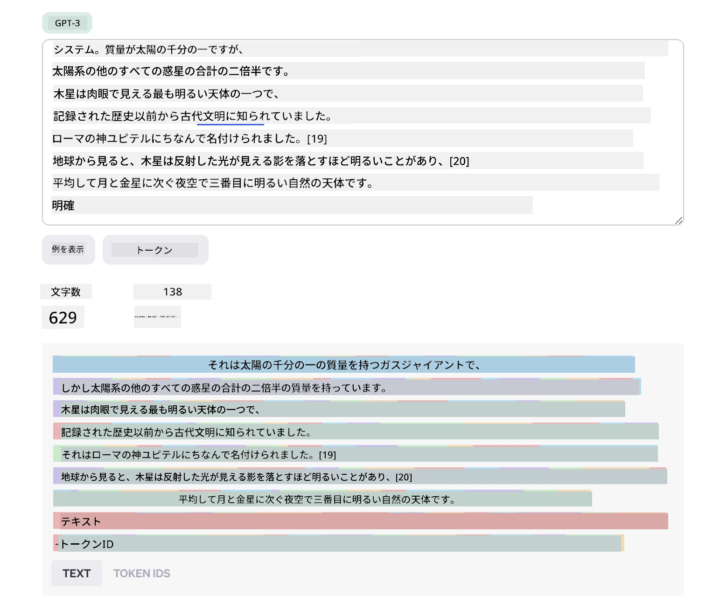
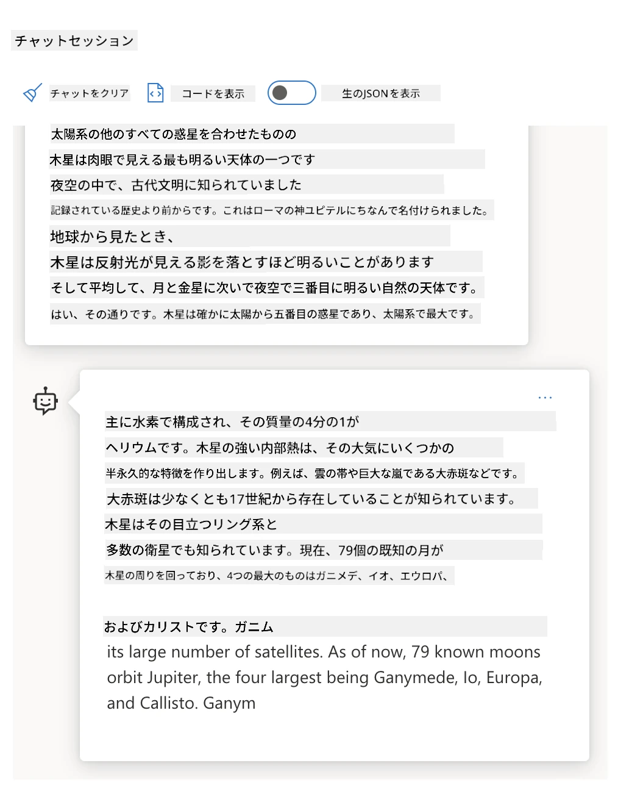
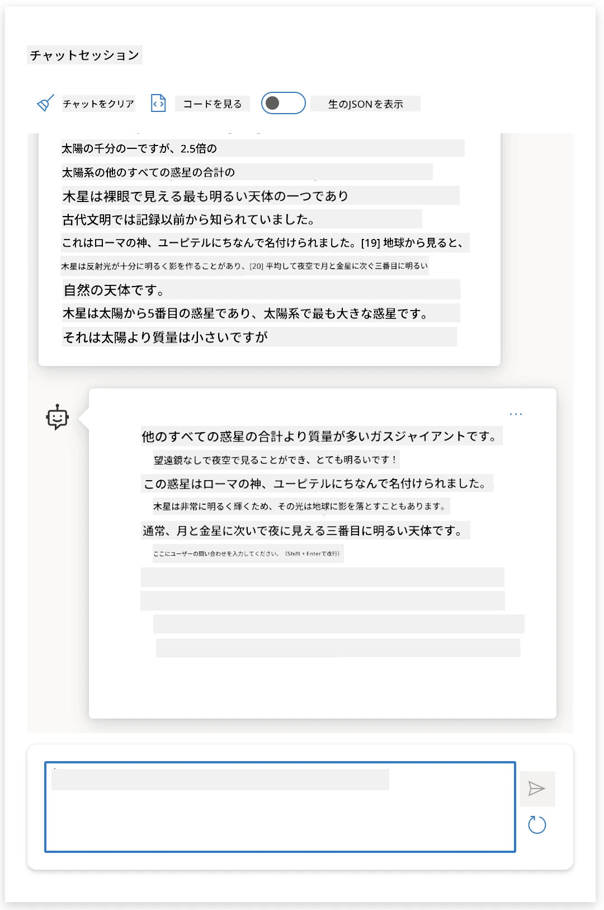
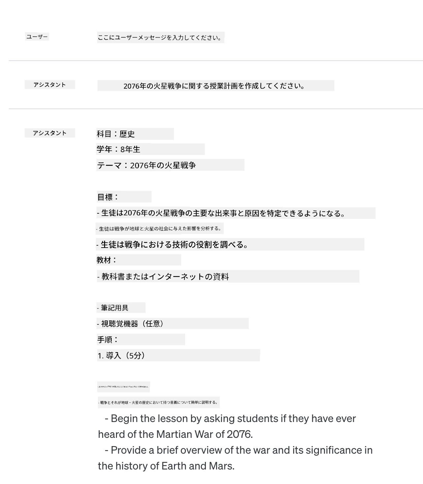
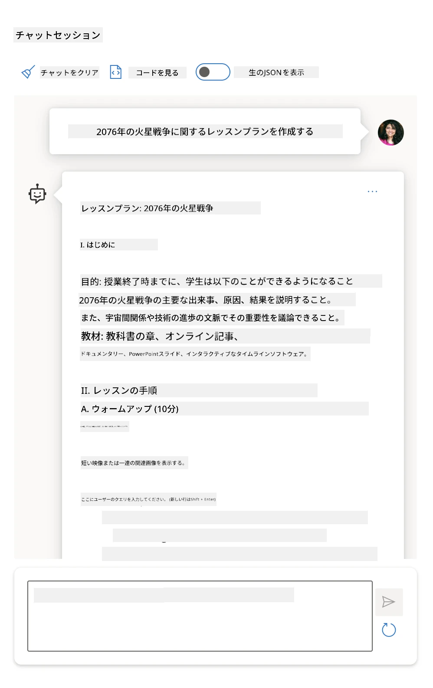
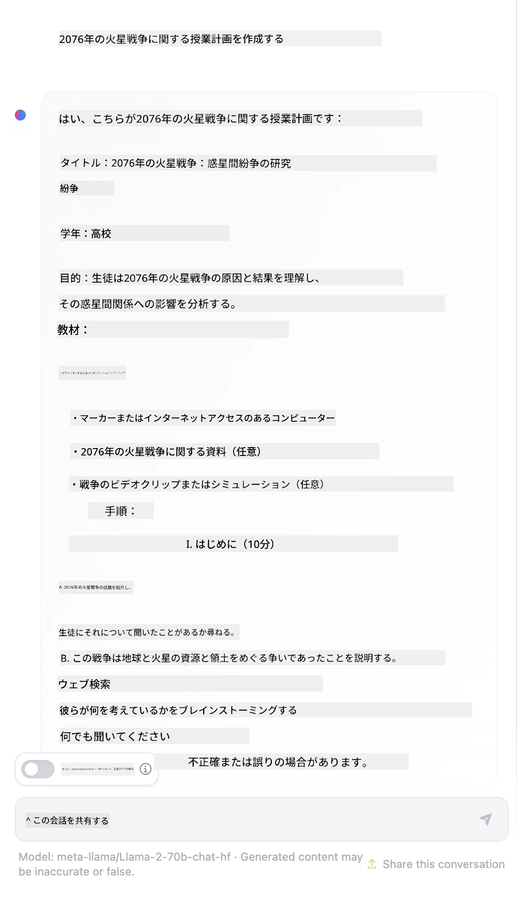

# プロンプトエンジニアリング基礎

[](https://youtu.be/GElCu2kUlRs?si=qrXsBvXnCW12epb8)

## はじめに
このモジュールでは、生成AIモデルにおける効果的なプロンプトを作成するための基本的な概念と手法について説明します。LLMに対してどのようにプロンプトを書くかも重要です。注意深く作成されたプロンプトは、より良質な応答を得ることができます。しかし、「プロンプト」や「プロンプトエンジニアリング」といった用語は具体的に何を意味するのでしょうか？また、LLMに送るプロンプトの _入力_ をどのように改善すればよいのでしょうか？これらが本章および次章で解決を目指す疑問です。

_生成AI_ は、ユーザーのリクエストに応じて新しいコンテンツ（例：テキスト、画像、音声、コードなど）を作成できます。これは、OpenAIのGPT（「Generative Pre-trained Transformer」）シリーズのような、自然言語とコードを使用するために訓練された _大規模言語モデル_ を用いて実現されています。

ユーザーは今、チャットのような馴染みある方法で専門的な知識や訓練を必要とせずにこれらのモデルと対話できます。モデルは _プロンプトベース_ で、ユーザーはテキスト入力（プロンプト）を送り、AIの応答（補完）を受け取ります。ユーザーは多段階の対話で「AIとチャット」しながら、プロンプトを調整して応答が期待に合うまで繰り返すことが可能です。

「プロンプト」は今や生成AIアプリケーションの主要な _プログラミングインターフェース_ となっており、モデルに何をさせるか指示し、返される応答の品質に影響を与えます。「プロンプトエンジニアリング」は、プロンプトの _設計と最適化_ に焦点を当て、スケールで一貫性と品質を持つ応答を提供することを目指す急成長中の分野です。

## 学習目標

このレッスンでは、プロンプトエンジニアリングとは何か、なぜ重要か、与えられたモデルとアプリケーションの目標のためにより効果的なプロンプトを作成する方法について学びます。プロンプトエンジニアリングのコア概念とベストプラクティス、そして実例に適用できるインタラクティブなJupyter Notebookの「サンドボックス」環境について理解します。

レッスンの終わりには以下ができるようになります：

1. プロンプトエンジニアリングとは何か、なぜ重要かを説明する。
2. プロンプトの構成要素とその利用方法を述べる。
3. プロンプトエンジニアリングのベストプラクティスと手法を学ぶ。
4. 習得した手法を使い、OpenAIエンドポイントで実例に適用する。

## 重要用語

プロンプトエンジニアリング: AIモデルを望ましい出力に導くために入力を設計・洗練する実践。
トークナイゼーション: テキストをモデルが理解し処理できる小さな単位（トークン）に変換する過程。
インストラクションチューンドLLM: 反応精度と関連性を向上させるために特定の指示で微調整された大規模言語モデル（LLM）。

## 学習用サンドボックス

プロンプトエンジニアリングは現時点で科学というよりは芸術です。直感を高める最良の方法は _練習を重ねる_ ことで、応用領域の専門知識と推奨活動、モデル固有の最適化と組み合わせたトライアンドエラー手法を採用することです。

このレッスンに付属するJupyter Notebookには、学んだことを試せる _サンドボックス_ 環境が用意されています。課題を実行するには次が必要です：

1. **Azure OpenAI APIキー** - 配備されたLLMのサービスエンドポイント。
2. **Python実行環境** - Notebookを実行するための環境。
3. <strong>ローカル環境変数</strong> - _今すぐ[SETUP](./../00-course-setup/02-setup-local.md?WT.mc_id=academic-105485-koreyst)の手順を完了してください_。

Notebookには _スターター_ 課題が含まれていますが、ご自身で _Markdown_ （説明）や _Code_ （プロンプトリクエスト）セクションを追加して例やアイデアを自由に試し、プロンプト設計の直感を養うことを推奨します。

## 図解ガイド

レッスンの全体像を掴んでから始めたいですか？この図解ガイドをチェックしてください。主要トピックの概要と各トピックで考慮すべき重要点が示されています。レッスンのロードマップはコア概念と課題の理解から始まり、関連するプロンプトエンジニアリング技法やベストプラクティスで対処していきます。このガイドの「高度な技法」セクションは、本カリキュラムの_次の_章で扱う内容を指しています。


## 私たちのスタートアップ

さて、_このテーマ_ が私たちのスタートアップミッションである [教育にAIイノベーションをもたらす](https://educationblog.microsoft.com/2023/06/collaborating-to-bring-ai-innovation-to-education?WT.mc_id=academic-105485-koreyst) とどう関係するか話しましょう。私たちは _パーソナライズ学習_ のAI駆動アプリを構築したいと考えており、異なるユーザーがアプリでどのようにプロンプトを「設計」するか考えてみます：

- <strong>管理者</strong> はAIに _カリキュラムデータの欠落部分の分析_ を依頼するかもしれません。AIは結果を要約したり、コードで可視化したりできます。
- <strong>教育者</strong> はAIに _対象の受講者とトピックに応じたレッスンプランの生成_ を求めることができます。AIは指定された形式で個別化プランを作成可能です。
- <strong>学生</strong> はAIに _難しい科目の個別指導_ をお願いするかもしれません。AIは学生のレベルに合わせたレッスン、ヒント、例を提供できます。

これは氷山の一角に過ぎません。教育専門家がキュレートしたオープンソースのプロンプトライブラリ [Prompts For Education](https://github.com/microsoft/prompts-for-edu/tree/main?WT.mc_id=academic-105485-koreyst) をぜひご覧ください！_その中のいくつかのプロンプトをサンドボックスやOpenAI Playgroundで動かしてみてください！_

<!--
LESSON TEMPLATE:
This unit should cover core concept #1.
Reinforce the concept with examples and references.

CONCEPT #1:
Prompt Engineering.
Define it and explain why it is needed.
-->

## プロンプトエンジニアリングとは？

このレッスンは、<strong>プロンプトエンジニアリング</strong> を、与えられたアプリケーションの目的とモデルに対して一貫性があり品質の高い応答（補完）を届けるために、テキスト入力（プロンプト）を _設計・最適化_ するプロセスとして定義しました。これを2段階のプロセスとして考えられます：

- あるモデルと目的に対して初期プロンプトを _設計_ する
- プロンプトを繰り返し _洗練_ して応答品質を向上させる

これは最適な結果を得るためにユーザーの直感と努力を要するトライアンドエラーの過程です。なぜ重要なのか、その答えを得るためにまず3つの概念を理解しましょう：

- _トークナイゼーション_ ＝ モデルがプロンプトを「どのように見るか」
- _ベースLLM_ ＝ 基礎モデルがプロンプトを「どのように処理するか」
- _インストラクションチューンドLLM_ ＝ モデルが「タスク」としてプロンプトを認識する方法

### トークナイゼーション

LLMはプロンプトを _トークンの列_ として認識します。異なるモデル（または同じモデルの異バージョン）が同じプロンプトを異なる方法でトークン化する場合があります。LLMはトークン単位で訓練されているため（生テキストではなく）、プロンプトのトークン化の仕方は生成される応答の品質に直接影響します。

トークナイゼーションの仕組みを直感的に理解するために、下図のような [OpenAI Tokenizer](https://platform.openai.com/tokenizer?WT.mc_id=academic-105485-koreyst) ツールを試してください。プロンプトをコピーし、空白文字や句読点の扱われ方に注目してどのようにトークンに変換されるか見てみましょう。この例は古いLLM（GPT-3）なので、新しいモデルで試すと結果が異なるかもしれません。



### 概念：基礎モデル

プロンプトがトークン化されると、["ベースLLM"](https://blog.gopenai.com/an-introduction-to-base-and-instruction-tuned-large-language-models-8de102c785a6?WT.mc_id=academic-105485-koreyst)（基礎モデル）の主な役割は、そのトークン列の次のトークンを予測することです。LLMは大量のテキストデータを使って訓練されており、トークン間の統計的な関連性をよく把握しているため、ある程度確信を持って予測できます。ただしプロンプトやトークンの _意味_ を理解しているわけではなく、単に「次に来るもの」のパターンを完成させているだけです。ユーザーが介入したり、あらかじめ定めた条件で終了するまでこの予測を続けられます。

プロンプトベースの補完がどのように動くか試したいですか？上記のプロンプトを既定設定のままで [Microsoft Foundry playground](https://ai.azure.com?WT.mc_id=academic-105485-koreyst) に入力してください。このシステムはプロンプトを情報要求とみなすよう設定されているため、状況に合う補完が得られるはずです。

しかし、ユーザーが特定の条件やタスク目標を満たすものを望んだ場合はどうでしょうか？ここで _インストラクションチューンド_ LLMが登場します。



### 概念：インストラクションチューンドLLM

[インストラクションチューンドLLM](https://blog.gopenai.com/an-introduction-to-base-and-instruction-tuned-large-language-models-8de102c785a6?WT.mc_id=academic-105485-koreyst) は基礎モデルをベースに、明確な指示を含む入出力ペア（例：多段階の「メッセージ」）で微調整されており、AIの応答がその指示に従おうとします。

これは、強化学習と人間のフィードバック（RLHF）などの手法を用いてモデルに _指示に従うこと_ や _フィードバックから学ぶこと_ をさせ、実用性が高く、ユーザーの目的により合った応答を生成できるよう訓練します。

試してみましょう。先のプロンプトの _システムメッセージ_ を以下の指示に変更してください：

> _提供された内容を2年生の学生向けに要約してください。結果は1段落にまとめ、3〜5つの箇条書きポイントを含めてください。_

結果が目標と形式に合わせて調整されているのが分かりますか？教育者はこの応答を直接授業資料に利用できます。



## なぜプロンプトエンジニアリングが必要なのか？

プロンプトがLLMによってどのように処理されるかが分かったところで、なぜプロンプトエンジニアリングが必要なのか説明しましょう。答えは、現在のLLMが抱える多くの課題に起因しており、適切なプロンプト設計と最適化をしなければ _信頼性と一貫性のある補完_ を達成しにくいことにあります。例えば：

1. **モデル応答は確率的である。** _同じプロンプト_ でも異なるモデルやバージョンで異なる結果を出す可能性があり、_同じモデル_ でも異なるタイミングで結果が変わることがあります。_プロンプトエンジニアリングの技術はこうした変動を最小限に抑え、より良い安全策を提供します_。

2. **モデルは誤った応答を作り出すことがある。** モデルは _大きいが有限な_ 訓練データで訓練されているため、その範囲外の概念に関しては知識が不足しています。そのため、不正確だったり、架空の、あるいは既知の事実と矛盾する補完を作成する可能性があります。_プロンプトエンジニアリング技術はユーザーがこうした誤情報を識別し軽減する手助けをします（例：AIに出典や根拠の提示を求めるなど）_。

3. **モデルの能力は異なる。** 新しいモデルや世代はより豊かな機能を持ちますが、コストや複雑さ、独自のクセも伴います。_プロンプトエンジニアリングにより、これらの違いを抽象化しモデル固有の要件に合わせてスケーラブルかつシームレスに適応するベストプラクティスやワークフローを作り出せます_。

これをOpenAIやAzure OpenAI Playgroundで実際に見てみましょう：

- 同じプロンプトを異なるLLM環境（例：OpenAI、Azure OpenAI、Hugging Face）で使ったら違いが見えましたか？
- 同じプロンプトを_同一の_ LLM環境（例：Azure OpenAI playground）で繰り返し試したら、その変動はどのように異なりましたか？

### 誤情報（ファブリケーション）例

このコースでは、LLMが訓練や制約の限界のために事実と異なる情報を生成する現象を **「誤情報（ファブリケーション）」** と呼びます。一般的な記事や研究論文では _「幻覚（ハルシネーション）」_ と呼ばれることもありますが、機械的な結果に人間的な特性を誤って付与しないために、本コースでは _「誤情報」_ という用語を推奨しています。これは [責任あるAIガイドライン](https://www.microsoft.com/ai/responsible-ai?WT.mc_id=academic-105485-koreyst) の用語的側面も強化し、文脈によっては攻撃的または非包括的と見なされる用語を排除する働きもあります。

誤情報の動きを体感したいですか？AIに存在しないトピックに関するコンテンツを生成するよう指示するプロンプトを考えてみてください（訓練に使われたデータセットになかったことを保証するため）。例えば、私は以下のプロンプトを試しました：

> **プロンプト：** 2076年の火星戦争に関するレッスンプランを作成してください。

ウェブ検索で2076年の火星戦争に関する架空の作品（テレビシリーズや書籍など）は見つかりましたが、2076年の実際の戦争はありません。常識的に見ても2076年は _未来_ であり、実際の出来事と結びつけられません。


それでは、異なるLLMプロバイダーでこのプロンプトを実行すると何が起こるでしょうか？

> **レスポンス1**: OpenAI Playground (GPT-35)



> **レスポンス2**: Azure OpenAI Playground (GPT-35)



> **レスポンス3**: : Hugging Face Chat Playground (LLama-2)



予想通り、各モデル（またはモデルバージョン）は確率的な挙動やモデル能力の違いにより、わずかに異なる応答を生成します。例えば、あるモデルは中学2年生の対象者を念頭に置き、もう一方は高校生を想定しています。しかし、3つのモデルすべてが、情報を持たないユーザーに対してその出来事が本当だと納得させる応答を生成しました。

_メタプロンプト_や_温度設定_のようなプロンプトエンジニアリング技術は、モデルの虚偽生成をある程度減らすことができます。新しいプロンプトエンジニアリング_アーキテクチャ_も、これらの影響を軽減または削減するために、新しいツールや技術をスムーズにプロンプトフローに組み込んでいます。

## ケーススタディ: GitHub Copilot

このセクションを締めくくるにあたり、実際のソリューションでプロンプトエンジニアリングがどのように使われているかを把握するために、ケーススタディの一つである[GitHub Copilot](https://github.com/features/copilot?WT.mc_id=academic-105485-koreyst)を見てみましょう。

GitHub Copilotはあなたの「AIペアプログラマー」であり、テキストプロンプトをコード補完に変換し、開発環境（例えばVisual Studio Code）に統合されてシームレスなユーザー体験を提供します。下記の一連のブログに記録されているように、最初のバージョンはOpenAI Codexモデルに基づいており、エンジニアはすぐにモデルの微調整とより良いプロンプトエンジニアリング技術の開発がコード品質向上に必要だと気づきました。今年7月には[Codexを超えた改良AIモデルを発表](https://github.blog/2023-07-28-smarter-more-efficient-coding-github-copilot-goes-beyond-codex-with-improved-ai-model/?WT.mc_id=academic-105485-koreyst)し、さらに高速な提案を実現しています。

彼らの学習の旅路を追うために投稿を順に読んでください。

- **2023年5月** | [GitHub Copilotがコード理解力を向上させている](https://github.blog/2023-05-17-how-github-copilot-is-getting-better-at-understanding-your-code/?WT.mc_id=academic-105485-koreyst)
- **2023年5月** | [内部から見るGitHub: GitHub Copilotを支えるLLMとの作業](https://github.blog/2023-05-17-inside-github-working-with-the-llms-behind-github-copilot/?WT.mc_id=academic-105485-koreyst)
- **2023年6月** | [GitHub Copilotのためのより良いプロンプトの書き方](https://github.blog/2023-06-20-how-to-write-better-prompts-for-github-copilot/?WT.mc_id=academic-105485-koreyst)
- **2023年7月** | [GitHub Copilot、改良AIモデルでCodexを超える](https://github.blog/2023-07-28-smarter-more-efficient-coding-github-copilot-goes-beyond-codex-with-improved-ai-model/?WT.mc_id=academic-105485-koreyst)
- **2023年7月** | [開発者のためのプロンプトエンジニアリングとLLMガイド](https://github.blog/2023-07-17-prompt-engineering-guide-generative-ai-llms/?WT.mc_id=academic-105485-koreyst)
- **2023年9月** | [企業向けLLMアプリ構築の教訓: GitHub Copilotから学ぶ](https://github.blog/2023-09-06-how-to-build-an-enterprise-llm-application-lessons-from-github-copilot/?WT.mc_id=academic-105485-koreyst)

また、[エンジニアリングブログ](https://github.blog/category/engineering/?WT.mc_id=academic-105485-koreyst)では、これらのモデルや技術が現実世界のアプリケーションにどのように_適用_されているかを示す[こちらの投稿](https://github.blog/2023-09-27-how-i-used-github-copilot-chat-to-build-a-reactjs-gallery-prototype/?WT.mc_id=academic-105485-koreyst)のような記事も閲覧できます。

---

<!--
LESSON TEMPLATE:
このユニットではコアコンセプト＃2をカバーします。
コンセプトを例と参考文献で強化してください。

CONCEPT #2:
プロンプト設計。
例を用いて説明します。
-->

## プロンプト構築

プロンプトエンジニアリングが重要である理由を見てきました。次に、プロンプトがどのように_構築_されているかを理解し、より効果的なプロンプト設計のためのさまざまな技法を評価しましょう。

### 基本プロンプト

モデルへ他の文脈なしでテキスト入力を送る基本プロンプトから始めましょう。例として、米国国歌の最初の数語をOpenAIの[Completion API](https://platform.openai.com/docs/api-reference/completions?WT.mc_id=academic-105485-koreyst)に送ると、即座に次の数行を_補完_して応答します。これが基本的な予測動作を示しています。

| プロンプト（入力）     | 補完（出力）                                                                                                                        |
| :----------------- | :----------------------------------------------------------------------------------------------------------------------------------------- |
| Oh say can you see | これは米国の国歌「ザ・スター・スパングルド・バナー」の歌詞の始まりのようです。全文は… |

### 複雑なプロンプト

では、基本プロンプトに文脈と指示を加えましょう。[Chat Completion API](https://learn.microsoft.com/azure/ai-services/openai/how-to/chatgpt?WT.mc_id=academic-105485-koreyst)では、_メッセージ_の集合として複雑なプロンプトを構築できます:

- ユーザーの入力とアシスタントの応答を反映した入出力ペア。
- アシスタントの振る舞いや性格の文脈を設定するシステムメッセージ。

リクエストは下記の形になり、_トークン化_により文脈と会話から関連情報を効果的に捉えています。システムの文脈を変えることは、ユーザー入力と同じくらい補完の質に影響を及ぼします。

```python
response = client.responses.create(
    model="gpt-4o-mini",
    input=[
        {"role": "system", "content": "You are a helpful assistant."},
        {"role": "user", "content": "Who won the world series in 2020?"},
        {"role": "assistant", "content": "The Los Angeles Dodgers won the World Series in 2020."},
        {"role": "user", "content": "Where was it played?"}
    ]
)
```

### 指示型プロンプト

上の例では、ユーザープロンプトは単純なテキストクエリで情報要求として解釈されます。_指示_プロンプトでは、そのテキストを使ってタスクをより詳細に指定し、AIへのより良いガイダンスを提供できます。例を示します：

| プロンプト（入力）                                                                                                                                                                                                                         | 補完（出力）                                                                                                        | 指示タイプ          |
| :------------------------------------------------------------------------------------------------------------------------------------------------------------------------------------------------------------------------------------- | :------------------------------------------------------------------------------------------------------------------------- | :------------------ |
| 南北戦争の説明を書きなさい                                                                                                                                                                                                   | _簡単な段落を返した_                                                                                              | 単純              |
| 南北戦争の説明を書きなさい。重要な日付や出来事とその意義も記述しなさい                                                                                                                                     | _段落と重要な出来事のリストを返した_                                             | 複雑             |
| 1段落で南北戦争を説明しなさい。3つの重要な日付とその意義について箇条書きを提供しなさい。さらに3つの重要な歴史的人物とその貢献を箇条書きで記述しなさい。出力はJSONファイルとして返してください。 | _テキストボックスで詳細をJSON形式で返し、コピーしてファイルに保存や検証が可能_ | 複雑。フォーマット済み。 |

## プライマリコンテンツ（主たる内容）

上の例でもプロンプトはまだかなりオープンエンドで、LLMが事前学習データセットのどの部分が関連するかを判断します。_プライマリコンテンツ_設計パターンでは、入力テキストを2つの部分に分けます：

- 指示（アクション）
- アクションに影響を与える関連コンテンツ

指示が「これを2文で要約しなさい」である例を示します。

| プロンプト（入力）                                                                                                                                                                                                                                                                                                                                                                                                                                                                                                                                                                                                                                                                                      | 補完（出力）                                                                                                                                                                                                                                                                             |
| :-------------------------------------------------------------------------------------------------------------------------------------------------------------------------------------------------------------------------------------------------------------------------------------------------------------------------------------------------------------------------------------------------------------------------------------------------------------------------------------------------------------------------------------------------------------------------------------------------------------------------------------------------------------------------------------------------- | :---------------------------------------------------------------------------------------------------------------------------------------------------------------------------------------------------------------------------------------------------------------------------------------------- |
| 木星は太陽から5番目の惑星で、太陽系最大の惑星です。木星は太陽の質量の千分の一に過ぎませんが、太陽系の他のすべての惑星の質量の2.5倍に相当するガス惑星です。木星は肉眼で見える最も明るい天体の一つであり、古代文明から知られてきました。ローマ神の木星にちなんで名付けられています。[19] 地球から見ると、木星は反射光が可視の影を落とすほど明るく、平均して月と金星に次ぐ夜空で3番目に明るい自然天体です。 <br/> **これを2文で要約しなさい** | 木星は太陽から5番目の惑星で、太陽系最大の惑星であり夜空で最も明るい天体の一つです。ローマ神の木星にちなんで名付けられたこのガス惑星は、太陽系の他の惑星全ての2.5倍の質量を持ちます。 |

プライマリコンテンツ部分は、より効果的な指示を行うために様々な方法で使えます：

- <strong>例</strong> - 明確な指示でモデルに何をすべきか伝える代わりに、例を示してパターンを推論させる。
- <strong>キュー</strong> - 指示の後に「キュー」を置いて補完を促し、より関連した応答を導く。
- <strong>テンプレート</strong> - プレースホルダー（変数）を含む繰り返し可能なレシピで、特定用途にカスタマイズ可能。

これらを実際に見てみましょう。

### 例を使う

プライマリコンテンツを使い、タスクに対する望ましい出力の例をモデルに「与え」、望ましい出力のパターンを推論させる方法です。例の数によりゼロショット、ワンショット、数ショットプロンプトなどがあります。

プロンプトは次の3つの要素から成ります：

- タスクの説明
- 望ましい出力のいくつかの例
- 新しい例の開始（暗黙のタスク説明となる）

| 学習タイプ | プロンプト（入力）                                                                                                                                        | 補完（出力）         |
| :------------ | :---------------------------------------------------------------------------------------------------------------------------------------------------- | :-------------------------- |
| ゼロショット     | "The Sun is Shining". スペイン語に翻訳                                                                                                            | "El Sol está brillando".    |
| ワンショット      | "The Sun is Shining" => ""El Sol está brillando". <br> "It's a Cold and Windy Day" =>                                                                 | "Es un día frío y ventoso". |
| 数ショット      | The player ran the bases => Baseball <br/> The player hit an ace => Tennis <br/> The player hit a six => Cricket <br/> The player made a slam-dunk => | Basketball                  |
|               |                                                                                                                                                       |                             |

ゼロショットでは明示的な指示（「スペイン語に翻訳」）を与えなければなりませんが、ワンショットでは例から推論されています。数ショットの例は、例を増やすことで追加指示なしにモデルがより正確に推論できることを示しています。

### プロンプトキュー

プライマリコンテンツの別の使い方は、例ではなく_キュー_を与えることです。この場合、望ましい応答形式を反映した断片からモデルを_始動_させ、モデルはそのキューに従って続行します。

| キューの数 | プロンプト（入力）                                                                                                                                                                                                                                                                                                                                                                                                                                               | 補完（出力）                                                                                                                                                                                                                                                                                       |
| :------------- | :----------------------------------------------------------------------------------------------------------------------------------------------------------------------------------------------------------------------------------------------------------------------------------------------------------------------------------------------------------------------------------------------------------------------------------------------------------- | :-------------------------------------------------------------------------------------------------------------------------------------------------------------------------------------------------------------------------------------------------------------------------------------------------------- |
| 0              | 木星は太陽から5番目の惑星で、太陽系最大の惑星です。木星は太陽の質量の千分の一に過ぎませんが、太陽系の他のすべての惑星の質量の2.5倍に相当するガス惑星です。木星は肉眼で見える最も明るい天体の一つであり、古代文明から知られてきました。 <br/><strong>これを要約しなさい</strong>                                       | 木星は太陽系最大の惑星で太陽から5番目の位置にあります。質量は太陽の千分の一ですが他の惑星を合わせたより重く、古代文明から知られている夜空で明るい天体です。 |
| 1              | 木星は太陽から5番目の惑星で、太陽系最大の惑星です。木星は太陽の質量の千分の一に過ぎませんが、太陽系の他のすべての惑星の質量の2.5倍に相当するガス惑星です。木星は肉眼で見える最も明るい天体の一つであり、古代文明から知られてきました。 <br/><strong>これを要約しなさい</strong> <br/> 私たちが学んだのは木星は | 太陽から5番目で太陽系最大の惑星であるということです。木星は太陽の千分の一の質量ですが、他のすべての惑星の2.5倍の質量を持っています。肉眼で容易に見え、古代から知られています。                        |

| 2              | 木星は太陽から5番目の惑星で、太陽系で最大の惑星です。木星は太陽の質量の千分の一ですが、太陽系の他の全惑星の合計の2.5倍の質量を持つガス巨大惑星です。木星は夜空で肉眼で見える最も明るい天体の一つであり、記録されている歴史よりも前から古代文明に知られていました。<br/><strong>まとめ</strong><br/>学んだトップ3の事実：         | 1. 木星は太陽から5番目の惑星で、太陽系で最大の惑星です。<br/>2. それは太陽の質量の千分の一のガス巨大惑星ですが...<br/>3. 木星は古代から肉眼で見られてきました...                                                                       |
|                |                                                                                                                                                                                                                                                                                                                                                                                                                                                              |                                                                                                                                                                                                                                                                                                           |

### プロンプトテンプレート

プロンプトテンプレートとは、_あらかじめ定義されたプロンプトのレシピ_であり、必要に応じて保存および再利用可能で、大規模により一貫したユーザー体験を促進します。最も単純な形では、[OpenAIのこちらの例](https://cookbook.openai.com/examples/gpt4-1_prompting_guide?WT.mc_id=academic-105485-koreyst)のように、対話型プロンプト要素（ユーザーおよびシステムメッセージ）とAPI駆動のリクエスト形式の両方を提供し、再利用をサポートするプロンプト例の集合です。

より複雑な形では、[LangChainのこちらの例](https://python.langchain.com/docs/concepts/prompt_templates/?WT.mc_id=academic-105485-koreyst)のように、_プレースホルダー_を含み、ユーザー入力、システムコンテキスト、外部データソースなど多様なソースからのデータに置き換えてプロンプトを動的に生成できます。これにより、再利用可能なプロンプトライブラリを<strong>プログラム的に</strong>大規模に作成し、一貫したユーザー体験を促進できます。

最終的に、テンプレートの真価は、垂直的なアプリケーションドメイン向けに作成・公開される_プロンプトライブラリ_にあり、プロンプトテンプレートはアプリケーション固有の文脈や例に_最適化_され、対象ユーザーにより関連性と精度の高い応答を提供します。教育ドメインのプロンプトをまとめた[Prompts For Edu](https://github.com/microsoft/prompts-for-edu?WT.mc_id=academic-105485-koreyst)リポジトリは、授業計画、カリキュラム設計、学生指導などの重要な目的に重点を置いたこのアプローチの優れた例です。

## 補助コンテンツ

プロンプト構築を指示（タスク）と対象（主なコンテンツ）があるものとすると、_二次コンテンツ_は出力に何らかの影響を与えるために提供する追加の文脈のようなものです。これはモデルが応答をユーザーの目的や期待に合うように_調整_するのに役立つ調整パラメーターやフォーマット指示、トピック分類などが含まれます。

例えば、カリキュラムにある全履修科目の詳細メタデータ（名称、説明、レベル、メタデータタグ、講師など）を収録した講座カタログがある場合：

- 「2023年秋学期の講座カタログを要約せよ」という指示を定義できる
- 主なコンテンツに望ましい出力の例をいくつか提供できる
- 二次コンテンツに興味ある上位5つの「タグ」を特定できる

このように、モデルは例示されたフォーマットで要約を提供でき、もし結果に複数のタグがあれば、二次コンテンツで特定した上位5つのタグを優先できます。

---

<!--
レッスンテンプレート：
このユニットではコア概念#1を扱います。
例や参考文献で概念を補強してください。

概念#3：
プロンプトエンジニアリング技法。
プロンプトエンジニアリングの基本技法は何ですか？
いくつかの演習で説明してください。
-->

## プロンプトのベストプラクティス

プロンプトの_構築方法_がわかったので、次はベストプラクティスを反映した_設計方法_について考えましょう。これには2つの側面があります。適切な_マインドセット_を持つことと、適切な_技法_を適用することです。

### プロンプトエンジニアリングのマインドセット

プロンプトエンジニアリングは試行錯誤のプロセスであり、広範な3つの指針を念頭に置いてください：

1. **ドメイン理解が重要。** 応答の精度と関連性はアプリケーションやユーザーが属する_ドメイン_に依存します。直感や専門知識を用いて<strong>技法をカスタマイズ</strong>してください。例えば、システムプロンプトで_ドメイン固有の性格_を定義したり、ユーザープロンプトで_ドメイン固有のテンプレート_を使ったり、二次コンテンツにドメイン固有の文脈を反映したり、_ドメイン固有のキューや例_でモデルを馴染みのある使い方に誘導します。

2. **モデル理解が重要。** モデルは本質的に確率的ですが、使用するトレーニングデータセット（事前学習知識）、提供する機能（APIやSDK経由）、最適化されたコンテンツタイプ（コード、画像、テキストなど）は実装により異なります。使うモデルの強みと限界を理解し、それに基づいてタスクの優先順位を決めたり、モデルの能力に最適化された_カスタムテンプレート_を構築してください。

3. **反復と検証が重要。** モデルやプロンプトエンジニアリング技法は急速に進化しています。ドメイン専門家として、あなたの固有のアプリケーションにのみ適用される文脈や基準を持つかもしれません。プロンプト構築を「早期スタート」させるツールと技法を使い、結果を自身の直感や専門知識で反復的に検証してください。洞察を記録し、他者がより早く反復を進められるような<strong>知識ベース</strong>（例：プロンプトライブラリ）を作成しましょう。

## ベストプラクティス

今度は、[OpenAI](https://help.openai.com/en/articles/6654000-best-practices-for-prompt-engineering-with-openai-api?WT.mc_id=academic-105485-koreyst)や[Azure OpenAI](https://learn.microsoft.com/azure/ai-services/openai/concepts/prompt-engineering#best-practices?WT.mc_id=academic-105485-koreyst)の専門家が推奨する一般的なベストプラクティスを見てみましょう。

| 何をするか                              | なぜ                                                                                                                                                                                                                                               |
| :-------------------------------- | :------------------------------------------------------------------------------------------------------------------------------------------------------------------------------------------------------------------------------------------------ |
| 最新モデルを評価する       | 新しいモデル世代は機能や品質が向上している可能性が高いですが、コストが増加することもあります。影響を評価し、移行の判断を行いましょう。                                                                                |
| 指示と文脈を分ける   | モデルやプロバイダーが_区切り記号_を定義しているか確認し、指示、主なコンテンツ、二次コンテンツを明確に区別しましょう。これによりモデルがトークンにより正確に重みを付けられます。                                                         |
| 具体的かつ明確に             | 望む文脈、結果、長さ、フォーマット、スタイルなど詳細を多く与えましょう。これにより応答の質と一貫性が向上します。レシピを再利用可能なテンプレートに記録してください。                                                          |
| 説明的に、例を使う      | モデルは「見せて話す」アプローチにより良く応える場合があります。まずは`ゼロショット`（指示のみ、例なし）で始め、次に望ましい出力の例をいくつか示す`数ショット`で洗練させましょう。類似例を使うのも効果的です。 |
| 応答を促すキューを使う | モデルの応答の出発点となる先導的な語句やフレーズを与え、望ましい結果に向かわせましょう。                                                                                                               |
| 繰り返して強調する                       | 時に指示を何度か繰り返す必要があるかもしれません。主なコンテンツの前後に指示を与えたり、指示とキューを使うなど、試行錯誤して効果を検証してください。                                                         |
| 順序が重要                     | 情報をモデルに提示する順序は応答に影響を与えることがあります。特に学習例の順番は直近のものを優先しやすいバイアスがあります。いくつか試して最適解を探りましょう。                                                               |
| モデルに「逃げ道」を与える           | モデルが何らかの理由でタスクを完了できない場合に返せる_フォールバック_応答を用意しましょう。これにより誤情報や作り話の応答を減らせます。                                                         |
|                                   |                                                                                                                                                                                                                                                   |

ベストプラクティスは、モデルやタスク、ドメインによって効果が異なることに注意してください。これらを出発点として使い、最適な方法を見つけるために反復し続けましょう。新しいモデルやツールが登場するたびに、プロンプトエンジニアリングのプロセスを見直し、スケール可能性と応答品質に焦点を当ててください。

<!--
レッスンテンプレート：
可能であればこの単元にコードチャレンジを含めてください。

チャレンジ：
指示にコードコメントだけを入れたJupyter Notebookへのリンク（コード部分は空）。

解答：
プロンプトを埋めて実行したNotebookのコピーへのリンク。一例の出力を示します。
-->

## 課題

おめでとうございます！レッスンの最後まで来ました！今までの概念と技法を実際の例で試す時です！

課題では、インタラクティブに実行できる演習付きのJupyter Notebookを使用します。さらに自分でMarkdownやコードセルを追加し、アイデアや技法を自主的に探索できます。

### 始めるには、リポジトリをフォークしてから

- （推奨）GitHub Codespacesを起動
- （代替）リポジトリをローカルにクローンしDocker Desktopで使用
- （代替）好みのNotebook実行環境でNotebookを開く

### 次に環境変数を設定

- リポジトリのルートの`.env.copy`ファイルを`.env`にコピーし、`AZURE_OPENAI_API_KEY`、`AZURE_OPENAI_ENDPOINT`、`AZURE_OPENAI_DEPLOYMENT`の値を入力します。[Learning Sandboxセクション](#学習用サンドボックス)に戻って設定方法を学びましょう。

### 次にJupyter Notebookを開く

- 実行カーネルを選択します。オプション1または2を使う場合は、開発用コンテナに標準搭載されているPython 3.10.xカーネルを選択してください。

これで演習を実行できます。ここには_正解や不正解_はありません。試行錯誤を通じてどんなモデルやアプリケーションドメインに適するかの直感を養います。

_この理由で、本レッスンではコードの解答セグメントはありません。その代わりNotebookには「My Solution:」というタイトルのMarkdownセルがあり、参照用の一例の出力を示します。_

 <!--
レッスンテンプレート：
セクションをまとめや自己学習リソースで締めくくる。
-->

## 知識確認

以下のうち、妥当なベストプラクティスを踏まえた良いプロンプトはどれですか？

1. 赤い車の画像を見せて
2. 崖のそばに停車した太陽が沈む中、ボルボのXC90モデルの赤い車の画像を見せて
3. ボルボのXC90モデルの赤い車の画像を見せて

A: 2が最高のプロンプトです。「何を見せるか」だけでなく具体的な詳細（特定のメーカーとモデル）に加え、全体の設定も説明しているためです。3は次に良く、多くの説明を含んでいます。

## 🚀 チャレンジ

プロンプト「Show me an image of red car of make Volvo and 」に「キュー」技法を使ってみましょう。どう応答するか、どう改善するか考えてみてください。

## 素晴らしい！学習を続けましょう

プロンプトエンジニアリングの様々な概念についてさらに学びたいですか？[継続学習ページ](https://aka.ms/genai-collection?WT.mc_id=academic-105485-koreyst)でこのトピックの優れたリソースを見つけられます。

レッスン5へ進み、[高度なプロンプトテクニック](../05-advanced-prompts/README.md?WT.mc_id=academic-105485-koreyst)を学びましょう！

---

<!-- CO-OP TRANSLATOR DISCLAIMER START -->
**免責事項**：
本書類は AI 翻訳サービス [Co-op Translator](https://github.com/Azure/co-op-translator) を使用して翻訳されています。正確性を期していますが、自動翻訳には誤りや不正確な部分が含まれる可能性があることをご承知おきください。原文の原語版が正式な情報源とみなされるべきです。重要な情報については、専門の人間による翻訳を推奨します。本翻訳の利用により生じたいかなる誤解や解釈違いについても、当方は責任を負いかねます。
<!-- CO-OP TRANSLATOR DISCLAIMER END -->