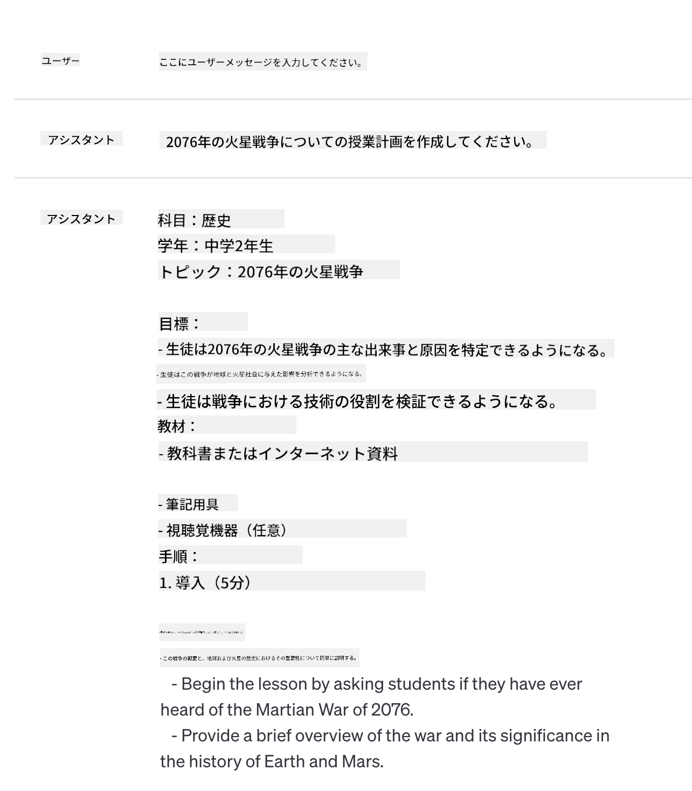
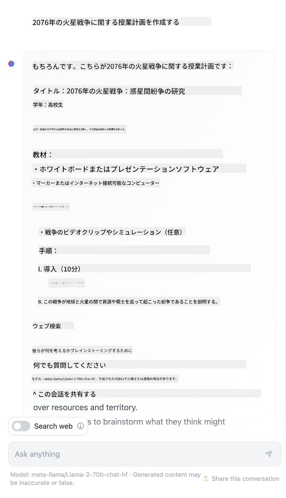

<!--
CO_OP_TRANSLATOR_METADATA:
{
  "original_hash": "0135e6c271f3ece8699050d4debbce88",
  "translation_date": "2025-10-17T23:56:45+00:00",
  "source_file": "04-prompt-engineering-fundamentals/README.md",
  "language_code": "ja"
}
-->
# プロンプトエンジニアリングの基礎

[](https://youtu.be/GElCu2kUlRs?si=qrXsBvXnCW12epb8)

## はじめに
このモジュールでは、生成AIモデルで効果的なプロンプトを作成するための基本的な概念と技術について説明します。LLMに送るプロンプトの書き方は非常に重要です。慎重に作成されたプロンプトは、より質の高い応答を得ることができます。しかし、そもそも「プロンプト」や「プロンプトエンジニアリング」とは何を意味するのでしょうか？また、LLMに送るプロンプトの「入力」をどのように改善すればよいのでしょうか？これらの質問に、この章と次の章で答えていきます。

生成AIは、ユーザーのリクエストに応じて新しいコンテンツ（例：テキスト、画像、音声、コードなど）を作成することができます。これは、自然言語やコードを使用するように訓練されたOpenAIのGPT（Generative Pre-trained Transformer）シリーズのような大規模言語モデル（LLM）を使用して実現されています。

ユーザーは、技術的な専門知識やトレーニングを必要とせずに、チャットのような馴染みのある方法でこれらのモデルと対話することができます。これらのモデルはプロンプトベースで動作し、ユーザーがテキスト入力（プロンプト）を送信すると、AIの応答（完成）が返されます。その後、ユーザーは「AIとのチャット」を繰り返し行い、プロンプトを洗練させて応答が期待に合うように調整します。

「プロンプト」は、生成AIアプリの主要な「プログラミングインターフェース」となり、モデルに何をするべきかを指示し、返される応答の質に影響を与えます。「プロンプトエンジニアリング」は、プロンプトを設計し最適化して、スケールで一貫性のある質の高い応答を提供することに焦点を当てた急成長中の研究分野です。

## 学習目標

このレッスンでは、プロンプトエンジニアリングとは何か、なぜ重要なのか、そして特定のモデルやアプリケーション目標に対してより効果的なプロンプトを作成する方法を学びます。プロンプトエンジニアリングの基本的な概念とベストプラクティスを理解し、これらの概念が実際の例に適用されるインタラクティブなJupyter Notebookの「サンドボックス」環境について学びます。

このレッスンの終わりまでに、以下のことができるようになります：

1. プロンプトエンジニアリングとは何か、なぜ重要なのかを説明する。
2. プロンプトの構成要素とその使用方法を説明する。
3. プロンプトエンジニアリングのベストプラクティスと技術を学ぶ。
4. 学んだ技術を実際の例に適用し、OpenAIエンドポイントを使用する。

## キーワード

プロンプトエンジニアリング: AIモデルが望ましい出力を生成するように導くための入力を設計し、洗練する実践。
トークン化: テキストをモデルが理解し処理できる小さな単位（トークン）に変換するプロセス。
指示調整済みLLM: 応答の正確性と関連性を向上させるために特定の指示で微調整された大規模言語モデル（LLM）。

## 学習サンドボックス

プロンプトエンジニアリングは現在、科学というよりも芸術に近いものです。その直感を磨く最善の方法は、実際に練習を重ね、推奨される技術やモデル固有の最適化を組み合わせた試行錯誤のアプローチを採用することです。

このレッスンに付属するJupyter Notebookは、学んだことを試すことができる「サンドボックス」環境を提供します。これを使って、学習を進めたり、最後のコードチャレンジの一環として実行したりすることができます。演習を実行するには以下が必要です：

1. **Azure OpenAI APIキー** - デプロイされたLLMのサービスエンドポイント。
2. **Pythonランタイム** - Notebookを実行するための環境。
3. **ローカル環境変数** - _[SETUP](./../00-course-setup/02-setup-local.md?WT.mc_id=academic-105485-koreyst)の手順を今すぐ完了してください_。

Notebookには「スターター」演習が含まれていますが、独自のMarkdown（説明）やコード（プロンプトリクエスト）セクションを追加して、さらに多くの例やアイデアを試し、プロンプト設計の直感を磨くことをお勧めします。

## イラスト付きガイド

このレッスンがカバーする内容の全体像を掴みたいですか？このイラスト付きガイドをチェックしてみてください。主要なトピックと各トピックで考えるべき重要なポイントを示しています。このレッスンのロードマップは、基本的な概念と課題を理解するところから始まり、それらに関連するプロンプトエンジニアリングの技術とベストプラクティスで対処する方法へと進みます。このガイドの「高度な技術」セクションは、このカリキュラムの次の章でカバーされる内容を指しています。


## 私たちのスタートアップ

さて、このトピックが私たちのスタートアップの使命である[教育へのAIイノベーションの導入](https://educationblog.microsoft.com/2023/06/collaborating-to-bring-ai-innovation-to-education?WT.mc_id=academic-105485-koreyst)にどのように関連しているかについて話しましょう。私たちは、個別学習のAI駆動型アプリケーションを構築したいと考えています。では、私たちのアプリケーションの異なるユーザーがどのようにプロンプトを「設計」するかを考えてみましょう：

- **管理者**は、AIに_カリキュラムデータを分析してカバー範囲のギャップを特定する_ように依頼するかもしれません。AIは結果を要約したり、コードで視覚化したりできます。
- **教育者**は、AIに_対象の受講者とトピックに合わせたレッスンプランを作成する_ように依頼するかもしれません。AIは指定された形式で個別化されたプランを作成できます。
- **学生**は、AIに_難しい科目を教えてもらう_ように依頼するかもしれません。AIは、学生のレベルに合わせたレッスン、ヒント、例を提供することができます。

これはほんの一例に過ぎません。[教育向けプロンプト](https://github.com/microsoft/prompts-for-edu/tree/main?WT.mc_id=academic-105485-koreyst)をご覧ください。教育の専門家によってキュレーションされたオープンソースのプロンプトライブラリで、可能性の広がりをより深く理解できます！_サンドボックスやOpenAI Playgroundでこれらのプロンプトを実行して、どのような結果が得られるか試してみてください！_

<!--
レッスンテンプレート：
このユニットでは、コアコンセプト#1をカバーする必要があります。
例や参考資料を使ってコンセプトを強化してください。

コンセプト#1：
プロンプトエンジニアリング。
それを定義し、なぜ必要なのかを説明してください。
-->

## プロンプトエンジニアリングとは？

このレッスンの冒頭で、**プロンプトエンジニアリング**を、特定のアプリケーション目標とモデルに対して一貫性のある質の高い応答（完成）を提供するために、テキスト入力（プロンプト）を設計し最適化するプロセスとして定義しました。これを2ステップのプロセスとして考えることができます：

- モデルと目標に合わせた初期プロンプトを_設計する_
- 応答の質を向上させるためにプロンプトを_反復的に洗練する_

これは必然的に試行錯誤を伴うプロセスであり、最適な結果を得るためにはユーザーの直感と努力が必要です。では、なぜこれが重要なのでしょうか？その質問に答えるためには、まず以下の3つの概念を理解する必要があります：

- _トークン化_ = モデルがプロンプトを「見る」方法
- _ベースLLM_ = 基盤モデルがプロンプトを「処理」する方法
- _指示調整済みLLM_ = モデルが「タスク」を見る方法

### トークン化

LLMはプロンプトを_トークンのシーケンス_として認識します。異なるモデル（またはモデルのバージョン）は、同じプロンプトを異なる方法でトークン化することがあります。LLMはトークンで訓練されており（生のテキストではなく）、プロンプトがトークン化される方法は生成される応答の質に直接影響を与えます。

トークン化がどのように機能するかを理解するには、以下に示す[OpenAI Tokenizer](https://platform.openai.com/tokenizer?WT.mc_id=academic-105485-koreyst)のようなツールを試してみてください。プロンプトをコピーして貼り付けると、それがどのようにトークンに変換されるかを見ることができます。空白文字や句読点がどのように処理されるかに注目してください。この例は古いLLM（GPT-3）を示していますので、新しいモデルで試すと異なる結果が得られるかもしれません。


### 概念：基盤モデル

プロンプトがトークン化されると、["ベースLLM"](https://blog.gopenai.com/an-introduction-to-base-and-instruction-tuned-large-language-models-8de102c785a6?WT.mc_id=academic-105485-koreyst)（または基盤モデル）の主な機能は、そのシーケンス内の次のトークンを予測することです。LLMは膨大なテキストデータセットで訓練されているため、トークン間の統計的な関係をよく理解しており、ある程度の確信を持って予測を行うことができます。ただし、プロンプトやトークン内の単語の「意味」を理解しているわけではなく、次の予測を「完成」するパターンを認識しているだけです。ユーザーの介入や事前に設定された条件によって終了されるまで、シーケンスの予測を続けることができます。

プロンプトベースの完成がどのように機能するかを見てみたいですか？上記のプロンプトをAzure OpenAI Studioの[_Chat Playground_](https://oai.azure.com/playground?WT.mc_id=academic-105485-koreyst)にデフォルト設定で入力してみてください。システムはプロンプトを情報要求として扱うように設定されているため、このコンテキストを満たす完成が表示されるはずです。

しかし、ユーザーが特定の基準やタスク目標を満たす何かを見たいと思った場合はどうでしょうか？ここで_指示調整済み_ LLMが登場します。


### 概念：指示調整済みLLM

[指示調整済みLLM](https://blog.gopenai.com/an-introduction-to-base-and-instruction-tuned-large-language-models-8de102c785a6?WT.mc_id=academic-105485-koreyst)は、基盤モデルを出発点とし、明確な指示を含む例や入力/出力ペア（例：マルチターンの「メッセージ」）で微調整します。そして、AIの応答はその指示に従おうとします。

これには、人間のフィードバックを伴う強化学習（RLHF）などの技術が使用され、モデルが_指示に従う_ことや_フィードバックから学ぶ_ことができるように訓練されます。その結果、実用的なアプリケーションにより適した、ユーザーの目標に関連する応答を生成することができます。

試してみましょう - 上記のプロンプトに戻り、今度は_システムメッセージ_を以下の指示としてコンテキストに変更してください：

> _提供された内容を2年生の生徒向けに要約してください。結果を3〜5つの箇条書きで1段落にまとめてください。_

結果がどのように目標や形式に合わせて調整されるかを確認してください。教育者はこの応答をそのクラスのスライドに直接使用することができます。


## なぜプロンプトエンジニアリングが必要なのか？

LLMがプロンプトをどのように処理するかを理解したところで、_なぜ_プロンプトエンジニアリングが必要なのかについて話しましょう。その答えは、現在のLLMがいくつかの課題を抱えており、プロンプトの構築と最適化に努力を注がなければ、_信頼性が高く一貫性のある完成_を達成することが難しいという点にあります。例えば：

1. **モデルの応答は確率的です。** _同じプロンプト_でも、異なるモデルやモデルバージョンでは異なる応答が生成される可能性があります。また、_同じモデル_でも異なる時期に異なる結果を生成することがあります。_プロンプトエンジニアリングの技術を使用することで、これらの変動を最小限に抑えるためのガードレールを提供できます_。

1. **モデルは応答を捏造することがあります。** モデルは_大規模だが有限の_データセットで事前に訓練されているため、その訓練範囲外の概念についての知識が不足しています。その結果、正確でない、架空の、または既知の事実と矛盾する完成を生成することがあります。_プロンプトエンジニアリングの技術を使用して、AIに引用や推論を求めることで、こうした捏造を特定し軽減することができます_。

1. **モデルの能力は異なります。** 新しいモデルやモデル世代はより豊富な能力を持つ一方で、コストや複雑さにおいて独自の癖やトレードオフをもたらします。_プロンプトエンジニアリングは、モデル固有の要件にスケーラブルでシームレスに適応するベストプラクティスやワークフローを開発するのに役立ちます_。

OpenAIまたはAzure OpenAI Playgroundでこれを実際に見てみましょう：

- 同じプロンプトを異なるLLMデプロイメント（例：OpenAI、Azure OpenAI、Hugging Face）で使用してみてください - 変動が見られましたか？
- 同じプロンプトを_同じ_ LLMデプロイメント（例：Azure OpenAI Playground）で繰り返し使用してみてください - これらの変動はどのように異なりましたか？

### 捏造の例

このコースでは、LLMが訓練の限界やその他の制約のために事実と異なる情報を生成する現象を**「捏造」**と呼びます。これ
ウェブ検索によると、火星戦争に関する架空の物語（例えば、テレビシリーズや本）は存在していましたが、2076年のものはありませんでした。常識的に考えても、2076年は未来の話であり、実際の出来事と関連付けることはできません。

では、このプロンプトを異なるLLMプロバイダーで実行するとどうなるでしょうか？

> **レスポンス1**: OpenAI Playground (GPT-35)



> **レスポンス2**: Azure OpenAI Playground (GPT-35)


> **レスポンス3**: Hugging Face Chat Playground (LLama-2)



予想通り、各モデル（またはモデルバージョン）は、確率的な挙動やモデル能力の違いにより、少し異なるレスポンスを生成します。例えば、あるモデルは中学生向けの内容を目指し、別のモデルは高校生向けの内容を想定しています。しかし、3つのモデルすべてが、情報に疎いユーザーに対してその出来事が実際にあったかのように信じ込ませるレスポンスを生成しました。

プロンプトエンジニアリングの技術、例えば _メタプロンプティング_ や _温度設定_ は、モデルの誤情報生成をある程度減少させる可能性があります。新しいプロンプトエンジニアリングの _アーキテクチャ_ では、これらの効果を軽減または削減するために、新しいツールや技術をプロンプトフローにシームレスに組み込んでいます。

## ケーススタディ: GitHub Copilot

このセクションを締めくくるにあたり、プロンプトエンジニアリングが実際のソリューションでどのように使用されているかを理解するために、1つのケーススタディを見てみましょう: [GitHub Copilot](https://github.com/features/copilot?WT.mc_id=academic-105485-koreyst)。

GitHub Copilotは「AIペアプログラマー」であり、テキストプロンプトをコード補完に変換し、開発環境（例: Visual Studio Code）に統合されてシームレスなユーザー体験を提供します。以下のブログシリーズに記載されているように、最初のバージョンはOpenAI Codexモデルに基づいていましたが、エンジニアたちは迅速にモデルを微調整し、コード品質を向上させるためのより良いプロンプトエンジニアリング技術を開発する必要性を認識しました。7月には、[Codexを超える改良されたAIモデルを発表](https://github.blog/2023-07-28-smarter-more-efficient-coding-github-copilot-goes-beyond-codex-with-improved-ai-model/?WT.mc_id=academic-105485-koreyst)し、さらに迅速な提案を可能にしました。

以下の投稿を順番に読むことで、彼らの学びの過程を追うことができます。

- **2023年5月** | [GitHub Copilotはコードの理解がさらに向上](https://github.blog/2023-05-17-how-github-copilot-is-getting-better-at-understanding-your-code/?WT.mc_id=academic-105485-koreyst)
- **2023年5月** | [GitHub内部: GitHub Copilotの背後にあるLLMとの連携](https://github.blog/2023-05-17-inside-github-working-with-the-llms-behind-github-copilot/?WT.mc_id=academic-105485-koreyst)
- **2023年6月** | [GitHub Copilotのためのより良いプロンプトの書き方](https://github.blog/2023-06-20-how-to-write-better-prompts-for-github-copilot/?WT.mc_id=academic-105485-koreyst)
- **2023年7月** | [GitHub CopilotがCodexを超える改良されたAIモデルで進化](https://github.blog/2023-07-28-smarter-more-efficient-coding-github-copilot-goes-beyond-codex-with-improved-ai-model/?WT.mc_id=academic-105485-koreyst)
- **2023年7月** | [開発者向けプロンプトエンジニアリングとLLMガイド](https://github.blog/2023-07-17-prompt-engineering-guide-generative-ai-llms/?WT.mc_id=academic-105485-koreyst)
- **2023年9月** | [エンタープライズLLMアプリの構築方法: GitHub Copilotの教訓](https://github.blog/2023-09-06-how-to-build-an-enterprise-llm-application-lessons-from-github-copilot/?WT.mc_id=academic-105485-koreyst)

また、[エンジニアリングブログ](https://github.blog/category/engineering/?WT.mc_id=academic-105485-koreyst)を閲覧して、[この投稿](https://github.blog/2023-09-27-how-i-used-github-copilot-chat-to-build-a-reactjs-gallery-prototype/?WT.mc_id=academic-105485-koreyst)のように、これらのモデルや技術が実際のアプリケーションを推進するためにどのように _適用_ されているかを示す記事を探すこともできます。

---

## プロンプト構築

プロンプトエンジニアリングが重要である理由を見てきましたが、次にプロンプトがどのように _構築_ されるかを理解し、より効果的なプロンプト設計のためのさまざまな技術を評価してみましょう。

### 基本的なプロンプト

まずは基本的なプロンプトから始めましょう。これは、モデルに送信されるコンテキストなしのテキスト入力です。例えば、OpenAIの[Completion API](https://platform.openai.com/docs/api-reference/completions?WT.mc_id=academic-105485-koreyst)にアメリカ国歌の最初の数語を送信すると、次の数行を即座に _補完_ してくれます。この基本的な予測挙動を示す例です。

| プロンプト（入力） | 補完（出力）                                                                                                                        |
| :----------------- | :--------------------------------------------------------------------------------------------------------------------------------- |
| Oh say can you see | 「The Star-Spangled Banner」（星条旗）の歌詞の冒頭のようですね。アメリカ合衆国の国歌の完全な歌詞は... |

### 複雑なプロンプト

次に、基本的なプロンプトにコンテキストと指示を追加してみましょう。[Chat Completion API](https://learn.microsoft.com/azure/ai-services/openai/how-to/chatgpt?WT.mc_id=academic-105485-koreyst)を使用すると、以下のような形式でプロンプトを構築できます。

- _ユーザー_ の入力と _アシスタント_ の応答を反映した入力/出力ペア。
- アシスタントの振る舞いや性格のコンテキストを設定するシステムメッセージ。

リクエストは以下の形式になります。この形式では、_トークン化_ により、コンテキストや会話から関連情報が効果的にキャプチャされます。システムコンテキストを変更することで、ユーザーが提供する入力と同じくらい補完の質に影響を与えることができます。

```python
response = openai.chat.completions.create(
    model="gpt-3.5-turbo",
    messages=[
        {"role": "system", "content": "You are a helpful assistant."},
        {"role": "user", "content": "Who won the world series in 2020?"},
        {"role": "assistant", "content": "The Los Angeles Dodgers won the World Series in 2020."},
        {"role": "user", "content": "Where was it played?"}
    ]
)
```


### 指示プロンプト

上記の例では、ユーザープロンプトは情報を求める単純なテキストクエリでした。_指示_ プロンプトでは、そのテキストを使用してタスクをより詳細に指定し、AIに対してより良いガイダンスを提供することができます。以下はその例です。

| プロンプト（入力）                                                                                                                                                                                                                         | 補完（出力）                                                                                                        | 指示タイプ          |
| :------------------------------------------------------------------------------------------------------------------------------------------------------------------------------------------------------------------------------------- | :----------------------------------------------------------------------------------------------------------------- | :------------------ |
| 南北戦争について説明してください                                                                                                                                                                                                   | _簡単な段落を返す_                                                                                              | 単純                |
| 南北戦争について説明してください。重要な日付と出来事を挙げ、それらの重要性を説明してください                                                                                                                                     | _段落とともに重要な出来事の日付と説明のリストを返す_                                                             | 複雑                |
| 南北戦争について1段落で説明してください。重要な日付とその重要性を3つの箇条書きで提供してください。さらに、重要な歴史的人物とその貢献を3つの箇条書きで提供してください。出力をJSONファイルとして返してください。 | _より詳細な情報をテキストボックスで返し、JSON形式でフォーマットされており、コピーしてファイルに貼り付けて検証可能_ | 複雑。フォーマット済 |

## プライマリコンテンツ

上記の例では、プロンプトはまだかなりオープンエンドであり、LLMがその事前学習データセットのどの部分が関連しているかを決定することができました。_プライマリコンテンツ_ デザインパターンでは、入力テキストが以下の2つの部分に分けられます。

- 指示（アクション）
- 関連するコンテンツ（アクションに影響を与えるもの）

以下は、「これを2文で要約してください」という指示の例です。

| プロンプト（入力）                                                                                                                                                                                                                                                                                                                                                                                                                                                                                                                                                                                                                                                                                      | 補完（出力）                                                                                                                                                                                                                                                                             |
| :-------------------------------------------------------------------------------------------------------------------------------------------------------------------------------------------------------------------------------------------------------------------------------------------------------------------------------------------------------------------------------------------------------------------------------------------------------------------------------------------------------------------------------------------------------------------------------------------------------------------------------------------------------------------------------------------------- | :---------------------------------------------------------------------------------------------------------------------------------------------------------------------------------------------------------------------------------------------------------------------------------------------- |
| 木星は太陽から5番目の惑星であり、太陽系で最大の惑星です。ガスの巨星であり、その質量は太陽の千分の一ですが、太陽系の他のすべての惑星の合計の2.5倍です。木星は肉眼で夜空に見える最も明るい天体の1つであり、記録が残る以前から古代文明に知られていました。ローマ神ジュピターにちなんで名付けられています。[19] 地球から見ると、木星は反射光が目に見える影を投げるほど明るくなることがあり、平均して月と金星に次いで夜空で3番目に明るい自然天体です。 <br/> **これを2文で要約してください** | 木星は太陽系で最大の惑星で、夜空で最も明るい天体の1つとして知られています。ローマ神ジュピターにちなんで名付けられたこのガスの巨星は、太陽系の他のすべての惑星の合計の2.5倍の質量を持っています。 |

プライマリコンテンツセグメントは、より効果的な指示を促すためにさまざまな方法で使用できます。

- **例** - 明示的な指示でモデルに何をすべきかを伝える代わりに、望ましい出力の例を提示し、パターンを推測させます。
- **キュー** - 指示の後に「キュー」を追加し、補完を促進し、より関連性の高い応答を導きます。
- **テンプレート** - プレースホルダー（変数）を含む繰り返し可能な「レシピ」で、特定のユースケースに合わせてデータをカスタマイズできます。

これらを実際に見てみましょう。

### 例を使用する

これは、プライマリコンテンツを使用して、特定の指示に対する望ましい出力の例をモデルに「与える」アプローチです。モデルにパターンを推測させることで、望ましい出力を得ることができます。提供する例の数に応じて、ゼロショットプロンプティング、ワンショットプロンプティング、少数ショットプロンプティングなどがあります。

プロンプトは以下の3つのコンポーネントで構成されます。

- タスクの説明
- 望ましい出力のいくつかの例
- 新しい例の開始（暗黙のタスク説明となる）

| 学習タイプ | プロンプト（入力）                                                                                                                                        | 補完（出力）         |
| :------------ | :---------------------------------------------------------------------------------------------------------------------------------------------------- | :-------------------------- |
| ゼロショット     | "The Sun is Shining". Translate to Spanish                                                                                                            | "El Sol está brillando".    |
| ワンショット      | "The Sun is Shining" => ""El Sol está brillando". <br> "It's a Cold and Windy Day" =>                                                                 | "Es un día frío y ventoso". |
| 少数ショット      | The player ran the bases => Baseball <br/> The player hit an ace => Tennis <br/> The player hit a six => Cricket <br/> The player made a slam-dunk => | Basketball                  |
|               |                                                                                                                                                       |                             |

ゼロショットプロンプティングでは明示的な指示（"Translate to Spanish"）を提供する必要がありましたが、ワンショットプロンプティングではそれが推測されます。少数ショットの例では、より多くの例を追加することで、追加の指示なしでモデルがより正確な推測を行えるようになります。

### プロンプトキュー

プライマリコンテンツを使用するもう1つの技術は、例ではなく _キュー_ を提供することです。この場合、望ましい応答形式を反映したスニペットを _開始点_ としてモデルに与えます。モデルはその「キュー」を受け取り、その形式で続けます。

| キューの数 | プロンプト（入力）                                                                                                                                                                                                                                                                                                                                                                                                                                               | 補完（出力）                                                                                                                                                                                                                                                                                       |
| :------------- | :----------------------------------------------------------------------------------------------------------------------------------------------------------------------------------------------------------------------------------------------------------------------------------------------------------------------------------------------------------------------------------------------------------------------------------------------------------- | :-------------------------------------------------------------------------------------------------------------------------------------------------------------------------------------------------------------------------------------------------------------------------------------------------------- |
| 0              | 木星は太陽から5番目の惑星であり、太陽系で最大の惑星です。ガスの巨星であり、その質量は太陽の千分の一ですが、太陽系の他のすべての惑星の合計の2.5倍です。木星は肉眼で夜空に見える最も明るい天体の1つであり、記録が残る以前から古代文明に知られていました。 <br/>**これを要約してください**                                       | 木星は太陽系で最大の惑星であり、太陽から5番目の位置にあります。その質量は太陽の千分の一ですが、他の惑星の合計よりも重いです。古代文明に知られており、夜空で簡単に見つけることができます。 |
| 1              | 木星は太陽から5番目の惑星で、太陽系で最大の惑星です。質量は太陽の1000分の1ですが、太陽系の他のすべての惑星を合わせた質量の2.5倍です。木星は夜空で肉眼で見える最も明るい天体の一つであり、記録が残る以前から古代文明に知られていました。<br/>**要約** <br/> 学んだことは、木星が | 太陽から5番目の惑星であり、太陽系で最大の惑星であるということです。質量は太陽の1000分の1ですが、他のすべての惑星を合わせた質量の2.5倍です。肉眼で簡単に見える天体であり、古代から知られていました。                        |
| 2              | 木星は太陽から5番目の惑星で、太陽系で最大の惑星です。質量は太陽の1000分の1ですが、太陽系の他のすべての惑星を合わせた質量の2.5倍です。木星は夜空で肉眼で見える最も明るい天体の一つであり、記録が残る以前から古代文明に知られていました。<br/>**要約** <br/> 学んだトップ3の事実:         | 1. 木星は太陽から5番目の惑星であり、太陽系で最大の惑星です。<br/> 2. 質量は太陽の1000分の1ですが、他のすべての惑星を合わせた質量の2.5倍です。<br/> 3. 木星は古代から肉眼で見える天体として知られています。                                                                       |
|                |                                                                                                                                                                                                                                                                                                                                                                                                                                                              |                                                                                                                                                                                                                                                                                                           |

### プロンプトテンプレート

プロンプトテンプレートとは、スケールでより一貫したユーザー体験を促進するために必要に応じて保存および再利用できる、プロンプトの事前定義されたレシピです。最も簡単な形では、[OpenAIのこの例](https://platform.openai.com/examples?WT.mc_id=academic-105485-koreyst)のように、インタラクティブなプロンプトコンポーネント（ユーザーとシステムメッセージ）とAPI駆動のリクエスト形式を提供するプロンプト例のコレクションにすぎません。

より複雑な形では、[LangChainのこの例](https://python.langchain.com/docs/concepts/prompt_templates/?WT.mc_id=academic-105485-koreyst)のように、ユーザー入力、システムコンテキスト、外部データソースなど、さまざまなソースからデータを使用してプロンプトを動的に生成できるプレースホルダーを含みます。これにより、スケールで一貫したユーザー体験をプログラム的に促進するために使用できる再利用可能なプロンプトのライブラリを作成することができます。

最後に、テンプレートの真の価値は、垂直的なアプリケーションドメインのためにプロンプトライブラリを作成および公開する能力にあります。この場合、プロンプトテンプレートは、ターゲットユーザーにとってより関連性があり正確な応答を提供するために、アプリケーション固有のコンテキストや例を反映するように最適化されています。[Prompts For Edu](https://github.com/microsoft/prompts-for-edu?WT.mc_id=academic-105485-koreyst)リポジトリは、このアプローチの素晴らしい例であり、レッスンプランニング、カリキュラムデザイン、学生指導などの主要な目的に重点を置いた教育分野のプロンプトライブラリをキュレーションしています。

## サポートコンテンツ

プロンプトの構築を指示（タスク）とターゲット（主なコンテンツ）を持つものと考えると、_二次的なコンテンツ_は、出力に何らかの影響を与えるために提供する追加のコンテキストのようなものです。これには、チューニングパラメータ、フォーマット指示、トピック分類などが含まれ、モデルが応答をユーザーの目的や期待に合わせて調整するのを助けることができます。

例えば、カリキュラム内のすべての利用可能なコースに関する広範なメタデータ（名前、説明、レベル、メタデータタグ、講師など）を持つコースカタログがある場合：

- 「2023年秋学期のコースカタログを要約する」という指示を定義できます。
- 主なコンテンツを使用して、望ましい出力の例をいくつか提供できます。
- 二次的なコンテンツを使用して、関心のあるトップ5の「タグ」を特定できます。

これにより、モデルは提供された例の形式で要約を提供できますが、結果に複数のタグがある場合、二次的なコンテンツで特定された5つのタグを優先することができます。

---

<!--
レッスンテンプレート:
このユニットでは、コアコンセプト#1をカバーする必要があります。
例や参考資料を使ってコンセプトを強化してください。
-->

## プロンプト設計のベストプラクティス

プロンプトがどのように構築されるかを理解したので、ベストプラクティスを反映するように設計する方法を考え始めることができます。これを2つの部分に分けて考えることができます。正しい_マインドセット_を持つことと、正しい_テクニック_を適用することです。

### プロンプトエンジニアリングのマインドセット

プロンプトエンジニアリングは試行錯誤のプロセスなので、以下の3つの広範な指針を念頭に置いてください：

1. **ドメイン理解が重要です。** 応答の正確性と関連性は、そのアプリケーションやユーザーが操作する_ドメイン_の関数です。直感とドメインの専門知識を活用して、テクニックをさらに**カスタマイズ**してください。例えば、システムプロンプトで_ドメイン固有の人格_を定義したり、ユーザープロンプトで_ドメイン固有のテンプレート_を使用したりします。ドメイン固有のコンテキストを反映する二次的なコンテンツを提供したり、モデルを馴染みのある使用パターンに導くために_ドメイン固有のキューや例_を使用したりします。

2. **モデル理解が重要です。** モデルは本質的に確率的ですが、モデルの実装は使用するトレーニングデータセット（事前学習知識）、提供する機能（例：APIやSDK経由）、最適化されているコンテンツの種類（例：コード、画像、テキスト）によっても異なります。使用しているモデルの強みと限界を理解し、その知識を活用して_タスクを優先_したり、モデルの能力に最適化された_カスタマイズされたテンプレート_を構築してください。

3. **反復と検証が重要です。** モデルは急速に進化しており、プロンプトエンジニアリングのテクニックも進化しています。ドメインの専門家として、あなたの特定のアプリケーションに適用される他のコンテキストや基準があるかもしれません。それが広範なコミュニティには適用されない場合でも、プロンプトエンジニアリングツールとテクニックを使用してプロンプト構築を「ジャンプスタート」し、直感とドメインの専門知識を使用して結果を反復し検証してください。洞察を記録し、他の人が将来の迅速な反復のための新しい基準として使用できる_知識ベース_（例：プロンプトライブラリ）を作成してください。

## ベストプラクティス

次に、[OpenAI](https://help.openai.com/en/articles/6654000-best-practices-for-prompt-engineering-with-openai-api?WT.mc_id=academic-105485-koreyst)と[Azure OpenAI](https://learn.microsoft.com/azure/ai-services/openai/concepts/prompt-engineering#best-practices?WT.mc_id=academic-105485-koreyst)の実践者によって推奨される一般的なベストプラクティスを見てみましょう。

| 内容                              | 理由                                                                                                                                                                                                                                               |
| :-------------------------------- | :------------------------------------------------------------------------------------------------------------------------------------------------------------------------------------------------------------------------------------------------ |
| 最新のモデルを評価する            | 新しいモデル世代は改善された機能と品質を持つ可能性がありますが、コストが高くなる場合もあります。影響を評価し、移行の決定を行います。                                                                                                        |
| 指示とコンテキストを分離する      | モデル/プロバイダーが指示、主なコンテンツ、二次的なコンテンツをより明確に区別するための_区切り記号_を定義しているか確認してください。これにより、モデルがトークンに正確に重みを割り当てるのを助けることができます。                                                         |
| 明確で具体的にする                | 望ましいコンテキスト、結果、長さ、形式、スタイルなどについて詳細を提供してください。これにより、応答の品質と一貫性が向上します。再利用可能なテンプレートにレシピをキャプチャしてください。                                                          |
| 説明的で例を使用する              | モデルは「見せて説明する」アプローチにより良く反応する可能性があります。`ゼロショット`アプローチから始めて、指示を与え（例はなし）、次に`少数ショット`として改良し、望ましい出力の例をいくつか提供してください。類推を使用してください。 |
| キューを使用して完了を促進する    | 応答の出発点として使用できるいくつかの先導的な言葉やフレーズを与えることで、望ましい結果に向けてモデルを促します。                                                                                                               |
| 繰り返し強調する                  | モデルに対して繰り返し指示を与える必要がある場合があります。主なコンテンツの前後に指示を与えたり、指示とキューを使用したりします。反復と検証を行い、何が効果的かを確認してください。                                                         |
| 順序が重要                       | モデルに情報を提示する順序は、学習例でも出力に影響を与える可能性があります。最近性バイアスのためです。何が最適かを確認するために異なるオプションを試してください。                                                               |
| モデルに「逃げ道」を与える        | タスクを完了できない場合に提供できる_フォールバック_応答をモデルに与えます。これにより、モデルが誤った情報や捏造された応答を生成する可能性を減らすことができます。                                                         |
|                                   |                                                                                                                                                                                                                                                   |

どのベストプラクティスでもそうですが、モデル、タスク、ドメインに基づいて_結果は異なる場合があります_。これらを出発点として使用し、何が最適かを見つけるために反復してください。新しいモデルやツールが利用可能になるたびにプロンプトエンジニアリングプロセスを再評価し、プロセスのスケーラビリティと応答の品質に焦点を当ててください。

<!--
レッスンテンプレート:
このユニットでは、適用可能な場合はコードチャレンジを提供する必要があります。

チャレンジ:
指示のみが記載されたJupyter Notebookへのリンク（コードセクションは空白）。

解決策:
プロンプトが記入され実行されたNotebookのコピーへのリンク。例として何が可能かを示します。
-->

## 課題

おめでとうございます！レッスンの最後まで到達しました！これらの概念やテクニックを実際の例で試してみましょう！

課題では、インタラクティブに完了できる演習を含むJupyter Notebookを使用します。また、自分のアイデアやテクニックを探求するためにMarkdownやコードセルを追加してNotebookを拡張することもできます。

### 始めるには、リポジトリをフォークしてください

- （推奨）GitHub Codespacesを起動
- （代替）リポジトリをローカルデバイスにクローンし、Docker Desktopで使用
- （代替）お好みのNotebookランタイム環境でNotebookを開く

### 次に、環境変数を設定してください

- リポジトリのルートにある`.env.copy`ファイルを`.env`にコピーし、`AZURE_OPENAI_API_KEY`、`AZURE_OPENAI_ENDPOINT`、`AZURE_OPENAI_DEPLOYMENT`の値を記入してください。[学習サンドボックスセクション](../../../04-prompt-engineering-fundamentals/04-prompt-engineering-fundamentals)に戻って学び方を確認してください。

### 次に、Jupyter Notebookを開いてください

- ランタイムカーネルを選択します。オプション1または2を使用する場合、開発コンテナが提供するデフォルトのPython 3.10.xカーネルを選択してください。

これで演習を実行する準備が整いました。ここでは_正解と不正解_はありません。試行錯誤を通じてオプションを探求し、特定のモデルやアプリケーションドメインに何が効果的かを直感的に理解することが目的です。

_この理由から、このレッスンにはコード解決セグメントはありません。代わりに、Notebookには「My Solution:」というタイトルのMarkdownセルがあり、参考として1つの例の出力を示します。_

 <!--
レッスンテンプレート:
セクションを要約と自己学習のためのリソースで締めくくります。
-->

## 知識チェック

以下のうち、合理的なベストプラクティスに従った良いプロンプトはどれですか？

1. 赤い車の画像を見せてください
2. 赤い車で、メーカーがVolvo、モデルがXC90、崖のそばに停車していて夕日が見える画像を見せてください
3. 赤い車で、メーカーがVolvo、モデルがXC90の画像を見せてください

A: 2が最良のプロンプトです。「何を」という詳細を提供し、具体的に説明しています（単なる車ではなく特定のメーカーとモデル）。また、全体的な設定も記述しています。次に良いのは3で、これも多くの説明を含んでいます。

## 🚀 チャレンジ

「赤い車で、メーカーがVolvo、モデルが」という文を完成させるプロンプトを使って「キュー」テクニックを活用してみてください。モデルは何と応答しますか？また、どのように改善しますか？

## 素晴らしい仕事！学習を続けましょう

異なるプロンプトエンジニアリングの概念についてもっと学びたいですか？このトピックに関する他の素晴らしいリソースを見つけるために[学習継続ページ](https://aka.ms/genai-collection?WT.mc_id=academic-105485-koreyst)にアクセスしてください。

次のレッスン5では、[高度なプロンプト技術](../05-advanced-prompts/README.md?WT.mc_id=academic-105485-koreyst)を見ていきます！

---

**免責事項**:  
この文書はAI翻訳サービス[Co-op Translator](https://github.com/Azure/co-op-translator)を使用して翻訳されています。正確性を追求しておりますが、自動翻訳には誤りや不正確な部分が含まれる可能性があります。元の言語で記載された文書を正式な情報源としてお考えください。重要な情報については、専門の人間による翻訳を推奨します。この翻訳の使用に起因する誤解や誤認について、当社は一切の責任を負いません。