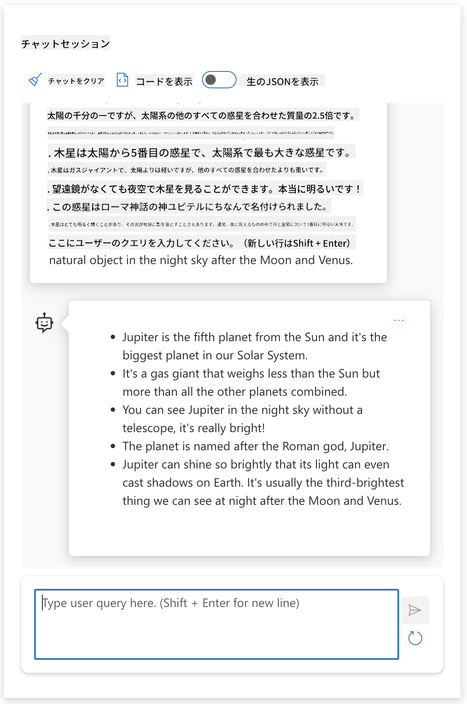
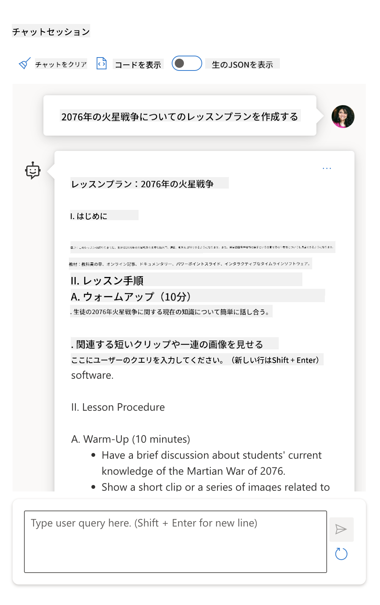

<!--
CO_OP_TRANSLATOR_METADATA:
{
  "original_hash": "a45c318dc6ebc2604f35b8b829f93af2",
  "translation_date": "2025-07-09T09:40:34+00:00",
  "source_file": "04-prompt-engineering-fundamentals/README.md",
  "language_code": "ja"
}
-->
# プロンプトエンジニアリングの基礎

[](https://aka.ms/gen-ai-lesson4-gh?WT.mc_id=academic-105485-koreyst)

## はじめに
このモジュールでは、生成AIモデルで効果的なプロンプトを作成するための基本的な概念と技術を扱います。LLMに対してどのようにプロンプトを書くかも重要です。慎重に作成されたプロンプトは、より質の高い応答を得ることができます。しかし、「プロンプト」や「プロンプトエンジニアリング」とは具体的に何を指すのでしょうか？また、LLMに送るプロンプトの入力をどのように改善すればよいのでしょうか？これらの疑問に、この章と次の章で答えていきます。

_生成AI_は、ユーザーのリクエストに応じて新しいコンテンツ（例：テキスト、画像、音声、コードなど）を作り出すことができます。これは、OpenAIのGPT（「Generative Pre-trained Transformer」）シリーズのような自然言語やコードの使用に特化して訓練された_Large Language Models_（大規模言語モデル）を用いて実現しています。

ユーザーは今や、技術的な専門知識やトレーニングなしで、チャットのような馴染みのある方法でこれらのモデルと対話できます。モデルは_プロンプトベース_で、ユーザーはテキスト入力（プロンプト）を送り、AIの応答（完了）を受け取ります。その後、期待する応答が得られるまで、複数回のやり取りでプロンプトを洗練させながら「AIとチャット」することができます。

「プロンプト」は、生成AIアプリの主要な_プログラミングインターフェース_となり、モデルに何をさせるかを指示し、返される応答の質に影響を与えます。「プロンプトエンジニアリング」は、スケールに応じて一貫性のある質の高い応答を提供するために、プロンプトの_設計と最適化_に焦点を当てた急成長中の分野です。

## 学習目標

このレッスンでは、プロンプトエンジニアリングとは何か、なぜ重要なのか、そして特定のモデルやアプリケーションの目的に合わせてより効果的なプロンプトを作成する方法を学びます。プロンプトエンジニアリングの基本概念とベストプラクティスを理解し、実際の例に適用できるインタラクティブなJupyterノートブックの「サンドボックス」環境についても学びます。

このレッスンの終わりには、以下ができるようになります：

1. プロンプトエンジニアリングとは何か、なぜ重要かを説明できる。
2. プロンプトの構成要素とその使い方を説明できる。
3. プロンプトエンジニアリングのベストプラクティスと技術を学ぶ。
4. 学んだ技術を実際の例に適用し、OpenAIエンドポイントを使って試せる。

## 重要用語

プロンプトエンジニアリング：AIモデルが望ましい出力を生成するように入力を設計・洗練する実践。
トークン化：テキストをモデルが理解・処理できる小さな単位（トークン）に変換するプロセス。
Instruction-Tuned LLMs：特定の指示に基づいて応答の精度や関連性を高めるために微調整された大規模言語モデル。

## 学習サンドボックス

プロンプトエンジニアリングは現在、科学というよりは芸術に近いものです。直感を磨く最良の方法は、_実践を重ねる_ことであり、応用分野の専門知識と推奨される技術、モデル固有の最適化を組み合わせた試行錯誤のアプローチを取ることです。

このレッスンに付属するJupyterノートブックは、学んだことを試せる_サンドボックス_環境を提供します。演習を実行するには以下が必要です：

1. **Azure OpenAI APIキー** - 展開されたLLMのサービスエンドポイント。
2. **Pythonランタイム** - ノートブックを実行する環境。
3. **ローカル環境変数** - _今すぐ[SETUP](./../00-course-setup/SETUP.md?WT.mc_id=academic-105485-koreyst)の手順を完了して準備を整えましょう_。

ノートブックには_スターター_演習が用意されていますが、より多くの例やアイデアを試すために、自分で_マークダウン_（説明）や_コード_（プロンプトリクエスト）セクションを追加して、プロンプト設計の直感を養うことを推奨します。

## イラスト付きガイド

このレッスンの全体像を掴みたいですか？このイラスト付きガイドをチェックしてください。主なトピックと、それぞれで考えるべき重要なポイントが示されています。レッスンのロードマップは、基本概念と課題の理解から始まり、関連するプロンプトエンジニアリング技術やベストプラクティスでそれらに対処する流れになっています。このガイドの「高度な技術」セクションは、このカリキュラムの_次の_章で扱う内容を指しています。


## 私たちのスタートアップ

さて、_このトピック_が私たちのスタートアップのミッションである[教育にAIイノベーションをもたらす](https://educationblog.microsoft.com/2023/06/collaborating-to-bring-ai-innovation-to-education?WT.mc_id=academic-105485-koreyst)ことにどう関係しているか話しましょう。私たちは_AIを活用したパーソナライズ学習_のアプリケーションを作りたいと考えています。そこで、アプリの異なるユーザーがどのようにプロンプトを「設計」するかを考えてみましょう：

- **管理者**はAIに_カリキュラムデータを分析してカバー範囲のギャップを特定する_よう依頼するかもしれません。AIは結果を要約したり、コードで可視化したりできます。
- **教育者**はAIに_対象の受講者とトピックに合わせたレッスンプランを作成する_よう依頼するかもしれません。AIは指定されたフォーマットでパーソナライズされたプランを作成します。
- **学生**はAIに_難しい科目のチューターをしてもらう_よう依頼するかもしれません。AIは学生のレベルに合わせたレッスンやヒント、例を提供して指導します。

これは氷山の一角に過ぎません。教育専門家がキュレーションしたオープンソースのプロンプトライブラリ[Prompts For Education](https://github.com/microsoft/prompts-for-edu/tree/main?WT.mc_id=academic-105485-koreyst)をチェックして、可能性の幅を広げてみてください！_サンドボックスやOpenAI Playgroundでこれらのプロンプトを実際に動かしてみるのもおすすめです！_

<!--
LESSON TEMPLATE:
This unit should cover core concept #1.
Reinforce the concept with examples and references.

CONCEPT #1:
Prompt Engineering.
Define it and explain why it is needed.
-->

## プロンプトエンジニアリングとは？

このレッスンは、**プロンプトエンジニアリング**を、特定のアプリケーション目的とモデルに対して一貫性のある質の高い応答（完了）を提供するために、テキスト入力（プロンプト）を_設計し最適化する_プロセスとして定義しました。これは大きく2段階のプロセスと考えられます：

- 特定のモデルと目的に合わせて初期プロンプトを_設計_する
- 応答の質を高めるためにプロンプトを繰り返し_洗練_する

これは最適な結果を得るためにユーザーの直感と努力を要する試行錯誤のプロセスです。では、なぜ重要なのでしょうか？その答えを探るために、まず3つの概念を理解する必要があります：

- _トークン化_ = モデルがプロンプトを「どのように見るか」
- _基盤LLM_ = 基礎モデルがプロンプトを「どのように処理するか」
- _Instruction-Tuned LLM_ = モデルが「タスク」をどのように認識できるか

### トークン化

LLMはプロンプトを_トークンの連なり_として認識します。異なるモデル（または同じモデルのバージョン違い）では、同じプロンプトでもトークン化の仕方が異なることがあります。LLMはトークン単位で訓練されているため、プロンプトのトークン化の仕方が生成される応答の質に直接影響します。

トークン化の仕組みを直感的に理解するには、以下のような[OpenAI Tokenizer](https://platform.openai.com/tokenizer?WT.mc_id=academic-105485-koreyst)ツールを試してみてください。プロンプトをコピーして貼り付けると、どのようにトークンに変換されるかがわかります。空白文字や句読点の扱いに注目しましょう。この例は古いLLM（GPT-3）を示しているため、新しいモデルで試すと結果が異なるかもしれません。


### 概念：基盤モデル

プロンプトがトークン化されると、["Base LLM"](https://blog.gopenai.com/an-introduction-to-base-and-instruction-tuned-large-language-models-8de102c785a6?WT.mc_id=academic-105485-koreyst)（基盤モデル）の主な役割は、そのトークン列の次のトークンを予測することです。LLMは膨大なテキストデータセットで訓練されているため、トークン間の統計的な関係をよく把握しており、ある程度の確信を持って予測できます。プロンプトやトークンの_意味_を理解しているわけではなく、単に「次に続くパターン」を予測しているだけです。ユーザーの介入や事前に設定された条件で終了するまで、予測を続けることができます。

プロンプトベースの完了がどのように機能するか見てみたいですか？上記のプロンプトをAzure OpenAI Studioの[_Chat Playground_](https://oai.azure.com/playground?WT.mc_id=academic-105485-koreyst)にデフォルト設定で入力してみてください。システムはプロンプトを情報要求として扱うよう設定されているため、この文脈に合った完了が得られるはずです。

しかし、ユーザーが特定の条件やタスク目的を満たすものを見たい場合はどうでしょう？ここで_instruction-tuned_ LLMが登場します。


### 概念：Instruction Tuned LLM

[Instruction Tuned LLM](https://blog.gopenai.com/an-introduction-to-base-and-instruction-tuned-large-language-models-8de102c785a6?WT.mc_id=academic-105485-koreyst)は基盤モデルをベースに、明確な指示を含む例や入出力ペア（例：複数ターンの「メッセージ」）で微調整されています。AIの応答はその指示に従おうとします。

これは、強化学習と人間のフィードバック（RLHF）などの技術を用いて、モデルが_指示に従い_、_フィードバックから学習_できるように訓練し、実用的なアプリケーションにより適した、ユーザーの目的に合った応答を生成できるようにしています。

試してみましょう。上記のプロンプトに戻り、_システムメッセージ_を以下の指示に変更してみてください：

> _提供された内容を小学校2年生向けに要約してください。結果は1段落で、3～5の箇条書きにまとめてください。_

結果が望ましい目的と形式に調整されているのがわかりますか？教育者はこの応答をそのまま授業用スライドに使うことができます。



## なぜプロンプトエンジニアリングが必要なのか？

プロンプトがLLMでどのように処理されるかがわかったところで、なぜプロンプトエンジニアリングが必要なのかを説明しましょう。その答えは、現在のLLMがいくつかの課題を抱えており、プロンプトの構築や最適化に努力を払わなければ、_信頼性が高く一貫した完了_を得るのが難しいという事実にあります。例えば：

1. **モデルの応答は確率的である。** _同じプロンプト_でも、異なるモデルやモデルのバージョンで異なる応答が返される可能性があります。また、_同じモデル_でも時間によって異なる結果が出ることがあります。_プロンプトエンジニアリングの技術は、こうした変動を最小限に抑えるためのガードレールを提供します_。

1. **モデルは虚偽の応答を生成することがある。** モデルは_大規模だが有限の_データセットで事前訓練されているため、その訓練範囲外の概念については知識がありません。その結果、不正確、架空、あるいは既知の事実と矛盾する完了を生成することがあります。_プロンプトエンジニアリングは、AIに出典や根拠を求めるなど、こうした虚偽を特定・軽減する手助けをします_。

1. **モデルの能力は異なる。** 新しいモデルや世代はより豊かな能力を持ちますが、コストや複雑さの面で独自の特徴やトレードオフもあります。_プロンプトエンジニアリングは、違いを抽象化し、モデル固有の要件に適応するベストプラクティスやワークフローをスケーラブルかつシームレスに開発するのに役立ちます_。

OpenAIやAzure OpenAI Playgroundで実際に試してみましょう：

- 同じプロンプトを異なるLLM展開（例：OpenAI、Azure OpenAI、Hugging Face）で使ってみて、違いはありましたか？
- 同じプロンプトを_同じ_LLM展開（例：Azure OpenAI Playground）で繰り返し使ってみて、変動はどのように異なりましたか？

### 虚偽の例

このコースでは、LLMが訓練の制約やその他の理由で事実と異なる情報を生成する現象を**「虚偽」**と呼んでいます。一般的な記事や研究論文では_「幻覚」_（hallucinations）と呼ばれることもありますが、機械の結果に人間の特性を誤って付与しないように、_「虚偽」_という用語の使用を強く推奨します。これは、[責任あるAIガイドライン](https://www.microsoft.com/ai/responsible-ai?WT.mc_id=academic-105485-koreyst)の観点からも、攻撃的または非包括的とみなされる可能性のある用語を避ける意味で重要です。

虚偽がどのように起こるかを理解したいですか？AIに存在しないトピックのコンテンツを生成するよう指示するプロンプトを考えてみてください（訓練データセットに含まれていないことを保証する
# 2076年の火星戦争に関するレッスンプラン

## レッスン概要
このレッスンでは、2076年に起こった火星戦争の背景、主要な出来事、影響について学びます。歴史的な視点から戦争の原因と結果を分析し、現代社会への教訓を考察します。

## 目標
- 2076年の火星戦争の主要な出来事を理解する
- 戦争の原因と影響を分析する
- 歴史的な出来事が現代に与える影響を考察する

## レッスンの流れ

### 1. 導入（10分）
- 火星戦争とは何かを簡単に説明
- 戦争が起こった背景についての概要を紹介

### 2. 背景説明（15分）
- 火星植民地の歴史と発展
- 地球と火星間の政治的緊張
- 資源争奪の問題

### 3. 主要な出来事（20分）
- 戦争の勃発と初期の戦闘
- 重要な戦闘と戦略
- 戦争の転換点

### 4. 戦争の影響（15分）
- 火星社会への影響
- 地球との関係の変化
- 技術的・社会的な進歩

### 5. ディスカッション（20分）
- 戦争の原因は避けられなかったのか？
- 現代における類似の問題とその解決策
- 平和維持のために学べる教訓

### 6. まとめと振り返り（10分）
- レッスンのポイントを復習
- 質疑応答

## 使用教材
- 戦争の年表
- 主要な登場人物のプロフィール
- 戦闘地図と戦略図
- 関連する映像資料

## 宿題
- 火星戦争に関する短いエッセイを書く
- 戦争の影響を現代社会に当てはめて考察する

---

このレッスンプランを通じて、学生は2076年の火星戦争を深く理解し、歴史から学ぶ重要性を実感できるようになります。
ウェブ検索を行ったところ、火星戦争に関する架空の物語（例：テレビシリーズや書籍）は存在しましたが、2076年を舞台にしたものはありませんでした。常識的に考えても、2076年は_未来_であり、実際の出来事と結びつけることはできません。

では、異なるLLMプロバイダーでこのプロンプトを実行するとどうなるでしょうか？

> **Response 1**: OpenAI Playground (GPT-35)


> **Response 2**: Azure OpenAI Playground (GPT-35)



> **Response 3**: : Hugging Face Chat Playground (LLama-2)


予想通り、各モデル（またはモデルのバージョン）は確率的な挙動やモデルの能力の違いにより、わずかに異なる応答を生成します。例えば、あるモデルは中学2年生向けの表現を使い、別のモデルは高校生を想定しています。しかし、3つのモデルすべてが、情報に乏しいユーザーに対してその出来事が実際にあったかのように納得させる応答を生成しました。

_metaprompting_や_temperature設定_といったプロンプトエンジニアリングの手法は、モデルの虚偽生成をある程度抑制することができます。新しいプロンプトエンジニアリングの_アーキテクチャ_は、これらの効果を軽減または削減するために、新しいツールや技術をプロンプトの流れにシームレスに組み込んでいます。

## ケーススタディ：GitHub Copilot

このセクションを締めくくるにあたり、実際のソリューションでプロンプトエンジニアリングがどのように使われているかを理解するために、ケーススタディの一つである[GitHub Copilot](https://github.com/features/copilot?WT.mc_id=academic-105485-koreyst)を見てみましょう。

GitHub Copilotは「AIペアプログラマー」です。テキストプロンプトをコード補完に変換し、開発環境（例：Visual Studio Code）に統合されているため、シームレスなユーザー体験を提供します。以下のブログシリーズに記載されているように、最初のバージョンはOpenAI Codexモデルに基づいており、エンジニアたちはコード品質向上のためにモデルのファインチューニングやより良いプロンプトエンジニアリング技術の開発が必要であることにすぐに気づきました。7月には、[Codexを超える改良されたAIモデル](https://github.blog/2023-07-28-smarter-more-efficient-coding-github-copilot-goes-beyond-codex-with-improved-ai-model/?WT.mc_id=academic-105485-koreyst)を発表し、さらに高速な提案が可能になりました。

彼らの学習の軌跡を追うために、投稿を順番に読んでみてください。

- **2023年5月** | [GitHub Copilotがコード理解力を向上させている](https://github.blog/2023-05-17-how-github-copilot-is-getting-better-at-understanding-your-code/?WT.mc_id=academic-105485-koreyst)
- **2023年5月** | [GitHubの内部：GitHub Copilotの背後にあるLLMとの連携](https://github.blog/2023-05-17-inside-github-working-with-the-llms-behind-github-copilot/?WT.mc_id=academic-105485-koreyst)
- **2023年6月** | [GitHub Copilotのためのより良いプロンプトの書き方](https://github.blog/2023-06-20-how-to-write-better-prompts-for-github-copilot/?WT.mc_id=academic-105485-koreyst)
- **2023年7月** | [GitHub Copilotが改良されたAIモデルでCodexを超える](https://github.blog/2023-07-28-smarter-more-efficient-coding-github-copilot-goes-beyond-codex-with-improved-ai-model/?WT.mc_id=academic-105485-koreyst)
- **2023年7月** | [開発者のためのプロンプトエンジニアリングとLLMガイド](https://github.blog/2023-07-17-prompt-engineering-guide-generative-ai-llms/?WT.mc_id=academic-105485-koreyst)
- **2023年9月** | [エンタープライズLLMアプリの構築方法：GitHub Copilotからの教訓](https://github.blog/2023-09-06-how-to-build-an-enterprise-llm-application-lessons-from-github-copilot/?WT.mc_id=academic-105485-koreyst)

また、[エンジニアリングブログ](https://github.blog/category/engineering/?WT.mc_id=academic-105485-koreyst)もご覧いただけます。例えば、[こちらの記事](https://github.blog/2023-09-27-how-i-used-github-copilot-chat-to-build-a-reactjs-gallery-prototype/?WT.mc_id=academic-105485-koreyst)では、これらのモデルや技術が実際のアプリケーション開発にどのように_応用_されているかが紹介されています。

---

<!--
LESSON TEMPLATE:
このユニットではコアコンセプト#2を扱います。
例や参考文献でコンセプトを強化します。

CONCEPT #2:
プロンプト設計。
例を用いて説明。
-->

## プロンプト構築

プロンプトエンジニアリングが重要な理由は理解できました。次に、プロンプトがどのように_構築_されるかを理解し、より効果的なプロンプト設計のためのさまざまな手法を評価しましょう。

### 基本プロンプト

まずは基本的なプロンプトから始めましょう。これは他の文脈なしにモデルに送られるテキスト入力です。例として、アメリカ国歌の最初の数語をOpenAIの[Completion API](https://platform.openai.com/docs/api-reference/completions?WT.mc_id=academic-105485-koreyst)に送ると、次の数行を即座に_補完_して返してくれます。これは基本的な予測動作の例です。

| プロンプト（入力）     | 補完（出力）                                                                                                                        |
| :----------------- | :----------------------------------------------------------------------------------------------------------------------------------------- |
| Oh say can you see | 「The Star-Spangled Banner」（星条旗）の歌詞の始まりのようですね。アメリカ合衆国の国歌です。全文は... |

### 複雑なプロンプト

次に、基本プロンプトに文脈や指示を加えてみましょう。[Chat Completion API](https://learn.microsoft.com/azure/ai-services/openai/how-to/chatgpt?WT.mc_id=academic-105485-koreyst)では、複雑なプロンプトを複数の_メッセージ_の集合として構築できます。

- ユーザー入力とアシスタント応答の入出力ペア
- アシスタントの振る舞いや性格を設定するシステムメッセージ

リクエストは以下の形式になり、_トークン化_によって文脈や会話から関連情報が効果的に抽出されます。システムの文脈を変えることは、ユーザー入力と同じくらい補完の質に大きな影響を与えます。

```python
response = openai.chat.completions.create(
    model="gpt-3.5-turbo",
    messages=[
        {"role": "system", "content": "You are a helpful assistant."},
        {"role": "user", "content": "Who won the world series in 2020?"},
        {"role": "assistant", "content": "The Los Angeles Dodgers won the World Series in 2020."},
        {"role": "user", "content": "Where was it played?"}
    ]
)
```

### 指示プロンプト

上記の例では、ユーザープロンプトは単純なテキストクエリで、情報要求として解釈されます。_指示_プロンプトでは、そのテキストを使ってタスクをより詳細に指定し、AIにより良い指示を与えられます。例を示します。

| プロンプト（入力）                                                                                                                                                                                                                         | 補完（出力）                                                                                                        | 指示タイプ          |
| :------------------------------------------------------------------------------------------------------------------------------------------------------------------------------------------------------------------------------------- | :------------------------------------------------------------------------------------------------------------------------- | :------------------ |
| Write a description of the Civil War                                                                                                                                                                                                   | _簡単な段落を返す_                                                                                              | シンプル            |
| Write a description of the Civil War. Provide key dates and events and describe their significance                                                                                                                                     | _段落の後に重要な出来事の日付と説明のリストを返す_                                             | 複雑                |
| Write a description of the Civil War in 1 paragraph. Provide 3 bullet points with key dates and their significance. Provide 3 more bullet points with key historical figures and their contributions. Return the output as a JSON file | _より詳細な内容をJSON形式でテキストボックスに返し、コピーしてファイルに貼り付けて検証可能_ | 複雑。フォーマットあり |

## プライマリーコンテンツ

上記の例では、プロンプトはまだかなり自由形式で、LLMが事前学習データのどの部分を関連付けるかを決めていました。_プライマリーコンテンツ_設計パターンでは、入力テキストを以下の2つに分けます。

- 指示（アクション）
- 関連コンテンツ（アクションに影響を与える内容）

例として、「これを2文で要約せよ」という指示があります。

| プロンプト（入力）                                                                                                                                                                                                                                                                                                                                                                                                                                                                                                                                                                                                                                                                                      | 補完（出力）                                                                                                                                                                                                                                                                             |
| :-------------------------------------------------------------------------------------------------------------------------------------------------------------------------------------------------------------------------------------------------------------------------------------------------------------------------------------------------------------------------------------------------------------------------------------------------------------------------------------------------------------------------------------------------------------------------------------------------------------------------------------------------------------------------------------------------- | :---------------------------------------------------------------------------------------------------------------------------------------------------------------------------------------------------------------------------------------------------------------------------------------------- |
| 木星は太陽から5番目の惑星で、太陽系で最大の惑星です。ガスジャイアントであり、質量は太陽の千分の一ですが、太陽系の他のすべての惑星の合計の2.5倍です。肉眼で見える最も明るい天体の一つであり、古代文明の記録以前から知られていました。ローマ神話の神ジュピターにちなんで名付けられています。[19] 地球から見ると、反射光が影を作るほど明るく、[20] 月と金星に次いで夜空で3番目に明るい自然天体です。<br/> **これを2文で短く要約してください** | 木星は太陽から5番目の惑星で、太陽系最大の惑星であり、夜空で最も明るい天体の一つです。ローマ神話の神ジュピターにちなんで名付けられたこのガスジャイアントは、太陽系の他の惑星の合計質量の2.5倍の質量を持っています。 |

プライマリーコンテンツのセグメントは、より効果的な指示を促すためにさまざまな方法で使えます。

- **例示** - 明示的な指示を与える代わりに、モデルに望ましい出力の例を示し、パターンを推測させる。
- **キュー** - 指示の後に「キュー」を置き、補完の方向性を示してモデルを誘導する。
- **テンプレート** - プレースホルダー（変数）を含む繰り返し使えるプロンプトの「レシピ」で、特定のデータに合わせてカスタマイズ可能。

これらを実際に見てみましょう。

### 例示の利用

これは、プライマリーコンテンツを使って、ある指示に対する望ましい出力の例をモデルに「与え」、パターンを推測させる手法です。例の数に応じて、ゼロショット、ワンショット、フューショットプロンプティングなどがあります。

プロンプトは以下の3つの要素で構成されます。

- タスクの説明
- 望ましい出力のいくつかの例
- 新しい例の開始（暗黙のタスク説明となる）

| 学習タイプ | プロンプト（入力）                                                                                                                                        | 補完（出力）         |
| :------------ | :---------------------------------------------------------------------------------------------------------------------------------------------------- | :-------------------------- |
| ゼロショット     | "The Sun is Shining". スペイン語に翻訳してください                                                                                                            | "El Sol está brillando".    |
| ワンショット      | "The Sun is Shining" => ""El Sol está brillando". <br> "It's a Cold and Windy Day" =>                                                                 | "Es un día frío y ventoso". |
| フューショット      | The player ran the bases => Baseball <br/> The player hit an ace => Tennis <br/> The player hit a six => Cricket <br/> The player made a slam-dunk => | Basketball                  |
|               |                                                                                                                                                       |                             |

ゼロショットでは明示的に「スペイン語に翻訳してください」と指示する必要がありますが、ワンショットでは例から推測されます。フューショットでは例を増やすことで、追加の指示なしにより正確な推測が可能になります。

### プロンプトキュー

プライマリーコンテンツを使う別の手法は、例示ではなく_キュー_を与えることです。この場合、望ましい応答形式を反映した断片を最初に与え、モデルに「キューを受け取らせて」その形式で続けさせます。

| キューの数 | プロンプト（入力）                                                                                                                                                                                                                                                                                                                                                                                                                                               | 補完（出力）                                                                                                                                                                                                                                                                                       |
| :------------- | :----------------------------------------------------------------------------------------------------------------------------------------------------------------------------------------------------------------------------------------------------------------------------------------------------------------------------------------------------------------------------------------------------------------------------------------------------------- | :-------------------------------------------------------------------------------------------------------------------------------------------------------------------------------------------------------------------------------------------------------------------------------------------------------- |
| 0              | 木星は太陽から5番目の惑星で、太陽系で最大の惑星です。ガスジャイアントであり、質量は太陽の千分の一ですが、太陽系の他のすべての惑星の合計の2.5倍です。木星は肉眼で見える最も明るい天体の一つであり、古代文明の記録以前から知られていました。

**Summarize This**                                       | 木星は太陽系で最大の惑星であり、太陽から5番目の惑星です。ガスジャイアントで、質量は太陽の1/1000ですが、他のすべての惑星の合計よりも重いです。古代文明から長く知られており、夜空で簡単に見ることができます。 |
| 1              | 木星は太陽から5番目の惑星で、太陽系で最大の惑星です。ガスジャイアントで、質量は太陽の千分の一ですが、太陽系の他のすべての惑星の合計の2.5倍の重さがあります。木星は肉眼で見える最も明るい天体の一つであり、記録される以前の古代文明から知られてきました。<br/>**Summarize This** <br/> 私たちが学んだことは、木星は | 太陽から5番目の惑星で、太陽系で最大の惑星であるということです。ガスジャイアントで、質量は太陽の千分の一ですが、他のすべての惑星の合計の2.5倍の重さがあります。肉眼で簡単に見ることができ、古代から知られている惑星です。                        |
| 2              | 木星は太陽から5番目の惑星で、太陽系で最大の惑星です。ガスジャイアントで、質量は太陽の千分の一ですが、太陽系の他のすべての惑星の合計の2.5倍の重さがあります。木星は肉眼で見える最も明るい天体の一つであり、記録される以前の古代文明から知られてきました。<br/>**Summarize This** <br/> 私たちが学んだトップ3の事実:         | 1. 木星は太陽から5番目の惑星で、太陽系で最大の惑星です。<br/> 2. ガスジャイアントで、質量は太陽の千分の一ですが…<br/> 3. 木星は古代から肉眼で見えてきた惑星です…                                                                       |
|                |                                                                                                                                                                                                                                                                                                                                                                                                                                                              |                                                                                                                                                                                                                                                                                                           |

### Prompt Templates

プロンプトテンプレートとは、_あらかじめ定義されたプロンプトのレシピ_であり、必要に応じて保存・再利用できるものです。これにより、大規模で一貫したユーザー体験を実現できます。最も単純な形では、[OpenAIのこちらの例](https://platform.openai.com/examples?WT.mc_id=academic-105485-koreyst)のように、対話型のプロンプト要素（ユーザーとシステムのメッセージ）とAPIリクエスト形式の両方を含むプロンプト例のコレクションです。

より複雑な形では、[LangChainの例](https://python.langchain.com/docs/concepts/prompt_templates/?WT.mc_id=academic-105485-koreyst)のように、_プレースホルダー_を含み、ユーザー入力やシステムコンテキスト、外部データなど様々なソースからデータを差し替えて動的にプロンプトを生成できます。これにより、プログラム的に一貫したユーザー体験を大規模に提供できる再利用可能なプロンプトライブラリを作成できます。

最終的に、テンプレートの真価は、特定のアプリケーションドメイン向けに最適化された_プロンプトライブラリ_を作成・公開できる点にあります。これにより、対象ユーザーにより関連性が高く正確な応答を提供できます。[Prompts For Edu](https://github.com/microsoft/prompts-for-edu?WT.mc_id=academic-105485-koreyst)リポジトリは、教育分野向けにレッスンプラン作成やカリキュラム設計、学生指導などの主要目的に重点を置いたプロンプトライブラリをキュレーションした優れた例です。

## Supporting Content

プロンプト構築を「指示（タスク）」と「対象（主なコンテンツ）」で考えると、_二次的コンテンツ_は**出力に何らかの影響を与えるための追加コンテキスト**のようなものです。これは、チューニングパラメータ、フォーマット指示、トピック分類などで、モデルが望ましいユーザーの目的や期待に合わせて応答を_調整_するのに役立ちます。

例えば、カリキュラム内のすべてのコースに関する豊富なメタデータ（名前、説明、レベル、タグ、講師など）がある場合：

- 「2023年秋学期のコースカタログを要約する」という指示を定義できる
- 主なコンテンツとして望ましい出力の例をいくつか提供できる
- 二次的コンテンツとして関心の高い上位5つの「タグ」を特定できる

こうして、モデルは例に示された形式で要約を提供できますが、複数のタグがある場合は二次的コンテンツで特定した5つのタグを優先して扱うことができます。

---

<!--
LESSON TEMPLATE:
このユニットではコアコンセプト#1を扱います。
例や参考文献でコンセプトを強化します。

CONCEPT #3:
プロンプトエンジニアリングの技術。
基本的な技術にはどんなものがあるか？
演習で示します。
-->

## Prompting Best Practices

プロンプトの_構築方法_がわかったので、次はベストプラクティスを反映するように_設計_することを考えましょう。これは大きく分けて、正しい_マインドセット_を持つことと、適切な_技術_を適用することの2つに分けられます。

### Prompt Engineering Mindset

プロンプトエンジニアリングは試行錯誤のプロセスです。以下の3つの大まかな指針を心に留めておきましょう。

1. **ドメイン理解が重要。** 応答の正確さや関連性は、そのアプリケーションやユーザーが属する_ドメイン_に依存します。直感やドメイン知識を活かして**技術をカスタマイズ**しましょう。例えば、システムプロンプトに_ドメイン固有の人格_を定義したり、ユーザープロンプトに_ドメイン固有のテンプレート_を使ったりします。ドメイン固有の文脈を反映した二次的コンテンツを提供したり、_ドメイン固有のキューや例_を使ってモデルを馴染みのあるパターンに誘導したりします。

2. **モデル理解が重要。** モデルは確率的であることはわかっていますが、トレーニングデータセット（事前学習知識）、提供される機能（APIやSDK経由など）、最適化されているコンテンツの種類（コード、画像、テキストなど）によっても異なります。使っているモデルの強みと限界を理解し、その知識を活かして_タスクの優先順位付け_や_モデルの能力に最適化されたカスタムテンプレート_を作成しましょう。

3. **反復と検証が重要。** モデルもプロンプトエンジニアリングの技術も急速に進化しています。ドメイン専門家として、あなたの特定のアプリケーションに固有の文脈や基準があるかもしれません。プロンプトエンジニアリングのツールや技術を使って「プロンプト構築のスタート地点」を作り、直感やドメイン知識で反復・検証しましょう。洞察を記録し、他者がより速く反復できるような**知識ベース**（例：プロンプトライブラリ）を作成しましょう。

## Best Practices

ここでは、[OpenAI](https://help.openai.com/en/articles/6654000-best-practices-for-prompt-engineering-with-openai-api?WT.mc_id=academic-105485-koreyst)や[Azure OpenAI](https://learn.microsoft.com/azure/ai-services/openai/concepts/prompt-engineering#best-practices?WT.mc_id=academic-105485-koreyst)の実務者が推奨する一般的なベストプラクティスを見てみましょう。

| 何をするか                         | なぜ                                                                                                                                                                                                                                               |
| :-------------------------------- | :------------------------------------------------------------------------------------------------------------------------------------------------------------------------------------------------------------------------------------------------ |
| 最新モデルを評価する               | 新しいモデル世代は機能や品質が向上している可能性がありますが、コストが高くなることもあります。影響を評価し、移行の判断をしましょう。                                                                                                         |
| 指示とコンテキストを分ける         | モデルやプロバイダーが指示、主コンテンツ、二次コンテンツを区別する_区切り文字_を定義しているか確認しましょう。これによりモデルがトークンに対してより正確に重み付けできます。                                                             |
| 具体的かつ明確にする               | 望むコンテキスト、結果、長さ、フォーマット、スタイルなどの詳細を伝えましょう。これにより応答の質と一貫性が向上します。レシピを再利用可能なテンプレートにまとめましょう。                                                               |
| 説明的にし、例を使う               | モデルは「見せて説明する」アプローチに反応しやすいことがあります。最初は`zero-shot`（例なしの指示）で試し、次に`few-shot`（例をいくつか示す）で精緻化しましょう。類推も活用しましょう。                                                     |
| キューを使って応答を促す           | 先頭の言葉やフレーズを与えて、望む結果に向けてモデルを誘導しましょう。                                                                                                                               |
| 繰り返し強調する                   | 時にはモデルに繰り返し指示を与える必要があります。主コンテンツの前後に指示を置いたり、指示とキューを組み合わせたりしましょう。反復と検証で効果的な方法を見つけましょう。                                                               |
| 順序が重要                       | モデルに情報を提示する順序は出力に影響を与えることがあります。特に学習例では直近の情報が優先されやすいです。いくつかのパターンを試して最適なものを見つけましょう。                                                                     |
| モデルに「逃げ道」を与える         | モデルが何らかの理由でタスクを完了できない場合に備え、_フォールバック_の応答を用意しましょう。これにより誤った情報や作り話の生成を減らせます。                                                                                             |
|                                   |                                                                                                                                                                                                                                                   |

どのベストプラクティスも、モデルやタスク、ドメインによって効果は異なります。これらを出発点として使い、最適な方法を見つけるために反復しましょう。新しいモデルやツールが登場するたびにプロンプトエンジニアリングのプロセスを見直し、スケーラビリティと応答品質に注力してください。

<!--
LESSON TEMPLATE:
このユニットではコードチャレンジを提供します（該当する場合）

CHALLENGE:
指示はコードコメントのみのJupyter Notebookへのリンク（コード部分は空）。

SOLUTION:
プロンプトが埋められ実行されたNotebookのコピーへのリンク。例示としての出力を示す。
-->

## Assignment

おめでとうございます！レッスンの最後まで来ました！ここで学んだコンセプトや技術を実際の例で試してみましょう！

課題では、インタラクティブに取り組めるJupyter Notebookを使います。自分でMarkdownやコードセルを追加して、アイデアや技術を自由に探求することも可能です。

### 始めるには、リポジトリをフォークしてから

- （推奨）GitHub Codespacesを起動
- （代替）リポジトリをローカルにクローンし、Docker Desktopで使用
- （代替）お好みのNotebook実行環境でNotebookを開く

### 次に、環境変数を設定

- リポジトリのルートにある`.env.copy`を`.env`にコピーし、`AZURE_OPENAI_API_KEY`、`AZURE_OPENAI_ENDPOINT`、`AZURE_OPENAI_DEPLOYMENT`の値を入力します。[Learning Sandboxセクション](../../../04-prompt-engineering-fundamentals/04-prompt-engineering-fundamentals)に戻って設定方法を確認してください。

### 次に、Jupyter Notebookを開く

- 実行カーネルを選択します。オプション1または2を使う場合は、開発コンテナに用意されたデフォルトのPython 3.10.xカーネルを選択してください。

これで演習を実行する準備が整いました。ここには「正解・不正解」はありません。試行錯誤しながら、特定のモデルやアプリケーションドメインに合う直感を養うことが目的です。

_このため、このレッスンにはコードソリューションのセグメントはありません。代わりにNotebook内に「My Solution:」というタイトルのMarkdownセルがあり、参考例の出力を示しています。_

<!--
LESSON TEMPLATE:
セクションのまとめと自己学習用リソースを添えて終了。
-->

## Knowledge check

以下のうち、妥当なベストプラクティスに沿った良いプロンプトはどれでしょう？

1. 赤い車の画像を見せて
2. 赤い車で、ボルボのXC90という車種が崖のそばに停まっていて、夕日が沈む様子の画像を見せて
3. 赤い車で、ボルボのXC90という車種の画像を見せて

答え：2が最良のプロンプトです。「何を」示すか詳細に述べており、特定の車種だけでなく全体の状況も説明しています。3は次に良く、多くの説明が含まれています。

## 🚀 Challenge

「cue」技術を使って、次のプロンプトを試してみましょう：「Show me an image of red car of make Volvo and 」で文を完成させてください。どんな応答が返ってきますか？どう改善しますか？

## Great Work! Continue Your Learning

プロンプトエンジニアリングのさまざまな概念についてもっと学びたいですか？[継続学習ページ](https://aka.ms/genai-collection?WT.mc_id=academic-105485-koreyst)でこのトピックに関する他の優れたリソースを見つけましょう。

次のレッスン5では、[高度なプロンプト技術](../05-advanced-prompts/README.md?WT.mc_id=academic-105485-koreyst)を学びます！

**免責事項**：  
本書類はAI翻訳サービス「[Co-op Translator](https://github.com/Azure/co-op-translator)」を使用して翻訳されました。正確性を期しておりますが、自動翻訳には誤りや不正確な部分が含まれる可能性があります。原文の言語による文書が正式な情報源とみなされるべきです。重要な情報については、専門の人間による翻訳を推奨します。本翻訳の利用により生じた誤解や誤訳について、当方は一切の責任を負いかねます。