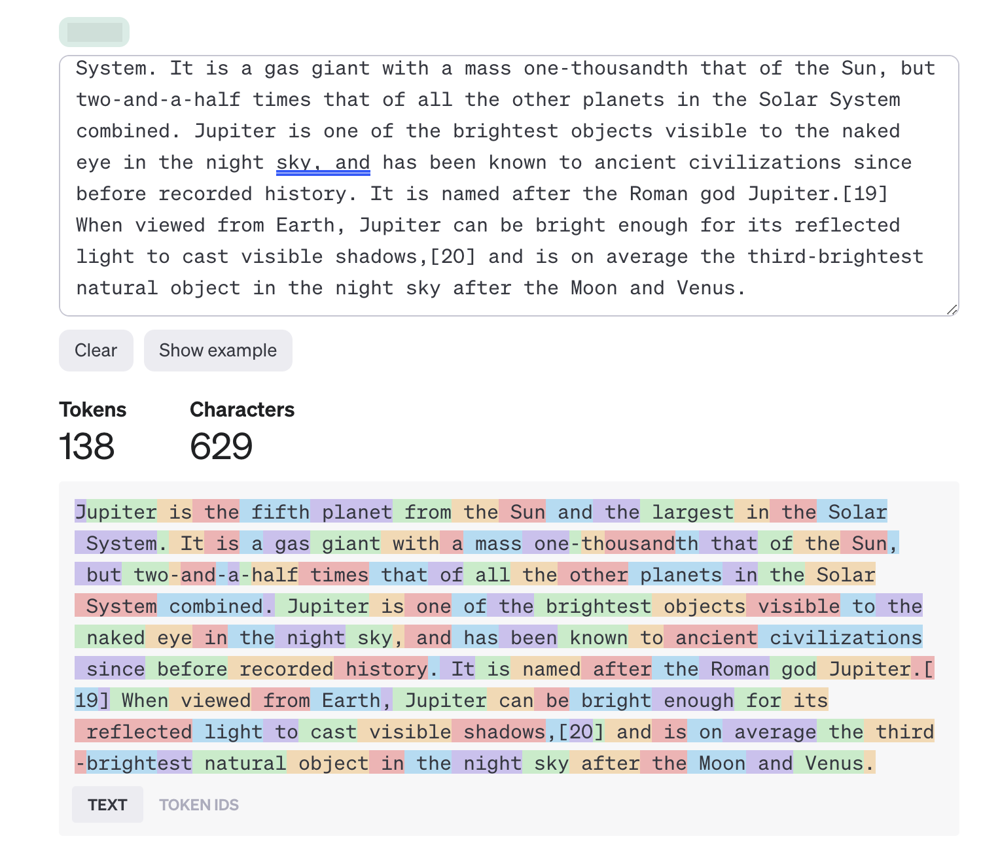
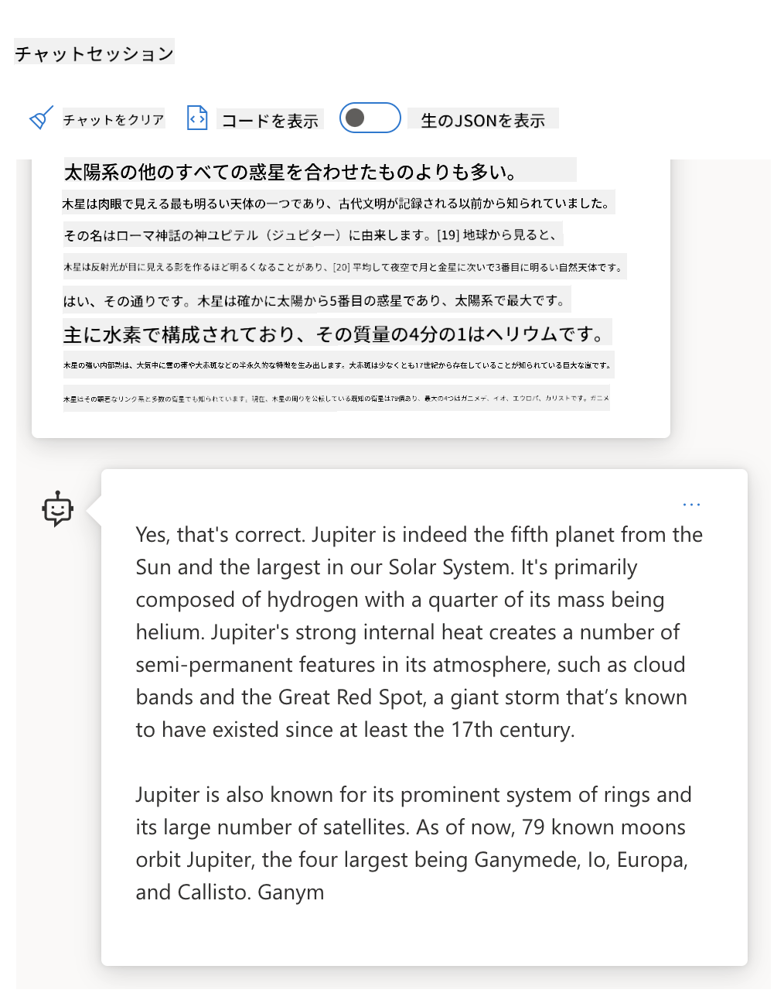

<!--
CO_OP_TRANSLATOR_METADATA:
{
  "original_hash": "8b3cb38518cf4fe7714d2f5e74dfa3eb",
  "translation_date": "2025-10-03T08:41:23+00:00",
  "source_file": "04-prompt-engineering-fundamentals/README.md",
  "language_code": "ja"
}
-->
# プロンプトエンジニアリングの基礎

[](https://aka.ms/gen-ai-lesson4-gh?WT.mc_id=academic-105485-koreyst)

## はじめに
このモジュールでは、生成AIモデルで効果的なプロンプトを作成するための基本的な概念と技術について説明します。LLMに送るプロンプトの書き方は非常に重要です。慎重に作成されたプロンプトは、より質の高い応答を得ることができます。しかし、「プロンプト」や「プロンプトエンジニアリング」といった用語は具体的に何を意味するのでしょうか？また、LLMに送るプロンプトの入力をどのように改善すればよいのでしょうか？これらの質問に、この章と次の章で答えていきます。

_生成AI_ は、ユーザーのリクエストに応じて新しいコンテンツ（例：テキスト、画像、音声、コードなど）を作成する能力を持っています。これは、自然言語やコードを使用するように訓練されたOpenAIのGPT（"Generative Pre-trained Transformer"）シリーズのような_大規模言語モデル_を使用して実現されています。

ユーザーは、技術的な専門知識や訓練を必要とせず、チャットのような馴染みのある方法でこれらのモデルと対話することができます。これらのモデルは_プロンプトベース_で動作します。つまり、ユーザーがテキスト入力（プロンプト）を送信し、AIの応答（コンプリート）を受け取ります。その後、ユーザーは「AIとチャット」しながら、期待する応答に近づくまでプロンプトを繰り返し調整することができます。

「プロンプト」は、生成AIアプリの主要な_プログラミングインターフェース_となり、モデルに何をするべきかを指示し、返される応答の質に影響を与えます。「プロンプトエンジニアリング」は、プロンプトを設計し最適化して、一貫性のある質の高い応答をスケールで提供することに焦点を当てた急成長中の研究分野です。

## 学習目標

このレッスンでは、プロンプトエンジニアリングとは何か、なぜ重要なのか、そして特定のモデルやアプリケーション目標に対してより効果的なプロンプトを作成する方法を学びます。プロンプトエンジニアリングの基本的な概念とベストプラクティスを理解し、これらの概念を実際の例に適用するインタラクティブなJupyter Notebookの「サンドボックス」環境について学びます。

このレッスンの終了時には以下ができるようになります：

1. プロンプトエンジニアリングとは何か、なぜ重要なのかを説明する。
2. プロンプトの構成要素とその使用方法を説明する。
3. プロンプトエンジニアリングのベストプラクティスと技術を学ぶ。
4. 学んだ技術を実際の例に適用し、OpenAIエンドポイントを使用する。

## 重要な用語

プロンプトエンジニアリング: AIモデルが望ましい出力を生成するように入力を設計・改良する技術。
トークン化: テキストをモデルが理解し処理できる小さな単位（トークン）に変換するプロセス。
指示調整済みLLM: 特定の指示で微調整され、応答の正確性と関連性を向上させた大規模言語モデル（LLM）。

## 学習サンドボックス

プロンプトエンジニアリングは現在、科学というよりも芸術に近いものです。その直感を磨く最善の方法は、_実践を重ねる_ことと、アプリケーション分野の専門知識を推奨される技術やモデル固有の最適化と組み合わせた試行錯誤のアプローチを採用することです。

このレッスンに付属するJupyter Notebookは、学んだことを試すことができる_サンドボックス_環境を提供します。これを使って、学習中やコードチャレンジの一環として演習を実行できます。演習を実行するには以下が必要です：

1. **Azure OpenAI APIキー** - デプロイされたLLMのサービスエンドポイント。
2. **Pythonランタイム** - Notebookを実行する環境。
3. **ローカル環境変数** - _[SETUP](./../00-course-setup/02-setup-local.md?WT.mc_id=academic-105485-koreyst)の手順を今すぐ完了して準備してください_。

Notebookには_スターター_演習が含まれていますが、自分自身で_Markdown_（説明）や_コード_（プロンプトリクエスト）のセクションを追加して、さらに多くの例やアイデアを試し、プロンプト設計の直感を磨くことをお勧めします。

## イラスト付きガイド

このレッスンがカバーする内容を深く学ぶ前に、大まかな概要をつかみたいですか？このイラスト付きガイドをチェックしてみてください。主要なトピックと各トピックで考えるべき重要なポイントを示しています。このレッスンのロードマップは、基本的な概念と課題を理解するところから始まり、それらに関連するプロンプトエンジニアリング技術とベストプラクティスで対処する方法へと進みます。なお、このガイドの「高度な技術」セクションは、このカリキュラムの_次の章_で扱う内容を指しています。


## 私たちのスタートアップ

では、このトピックが私たちのスタートアップの使命である[教育にAIイノベーションをもたらす](https://educationblog.microsoft.com/2023/06/collaborating-to-bring-ai-innovation-to-education?WT.mc_id=academic-105485-koreyst)ことにどのように関連しているかを考えてみましょう。私たちは_個別学習_を実現するAI駆動型アプリケーションを構築したいと考えています。では、私たちのアプリケーションの異なるユーザーがどのようにプロンプトを「設計」するかを考えてみましょう：

- **管理者**は、AIに_カリキュラムデータを分析してカバー範囲のギャップを特定する_ように依頼するかもしれません。AIは結果を要約したり、コードを使って視覚化したりできます。
- **教育者**は、AIに_対象の受講者とトピックに合わせたレッスンプランを作成する_ように依頼するかもしれません。AIは指定された形式で個別化されたプランを作成できます。
- **学生**は、AIに_難しい科目を教えてもらう_ように依頼するかもしれません。AIは学生のレベルに合わせたレッスン、ヒント、例を提供して指導することができます。

これはほんの一例に過ぎません。[教育向けプロンプト](https://github.com/microsoft/prompts-for-edu/tree/main?WT.mc_id=academic-105485-koreyst)をチェックしてみてください。教育の専門家によってキュレーションされたオープンソースのプロンプトライブラリで、可能性の幅広さを感じることができます！_サンドボックスやOpenAI Playgroundでこれらのプロンプトを実行して、どのような結果が得られるか試してみてください！_

<!--
LESSON TEMPLATE:
このユニットでは、コアコンセプト#1をカバーする必要があります。
概念を例や参考資料で強化してください。

CONCEPT #1:
プロンプトエンジニアリング。
定義し、なぜ必要なのかを説明してください。
-->

## プロンプトエンジニアリングとは？

このレッスンでは、**プロンプトエンジニアリング**を、特定のアプリケーション目標とモデルに対して一貫性のある質の高い応答（コンプリート）を提供するために、テキスト入力（プロンプト）を_設計し最適化する_プロセスとして定義しました。これを2段階のプロセスとして考えることができます：

- 特定のモデルと目標に対して初期プロンプトを_設計する_
- 応答の質を向上させるためにプロンプトを反復的に_改良する_

これは必然的に試行錯誤のプロセスであり、最適な結果を得るためにはユーザーの直感と努力が必要です。では、なぜこれが重要なのでしょうか？その質問に答えるためには、まず以下の3つの概念を理解する必要があります：

- _トークン化_ = モデルがプロンプトを「見る」方法
- _ベースLLM_ = 基盤モデルがプロンプトを「処理」する方法
- _指示調整済みLLM_ = モデルが「タスク」を認識する方法

### トークン化

LLMはプロンプトを_トークンのシーケンス_として認識します。異なるモデル（またはモデルのバージョン）は、同じプロンプトを異なる方法でトークン化することがあります。LLMはトークンで訓練されており（生のテキストではなく）、プロンプトがトークン化される方法は生成される応答の質に直接影響を与えます。

トークン化の仕組みを直感的に理解するには、以下のようなツールを試してみてください：[OpenAI Tokenizer](https://platform.openai.com/tokenizer?WT.mc_id=academic-105485-koreyst)。プロンプトをコピーして貼り付けると、それがどのようにトークンに変換されるかを見ることができます。空白文字や句読点がどのように処理されるかに注目してください。この例は古いLLM（GPT-3）を示していますので、新しいモデルで試すと異なる結果が得られるかもしれません。



### 概念: 基盤モデル

プロンプトがトークン化されると、["ベースLLM"](https://blog.gopenai.com/an-introduction-to-base-and-instruction-tuned-large-language-models-8de102c785a6?WT.mc_id=academic-105485-koreyst)（または基盤モデル）の主な機能は、そのシーケンス内の次のトークンを予測することです。LLMは膨大なテキストデータセットで訓練されているため、トークン間の統計的な関係をよく理解しており、ある程度の信頼性を持って予測を行うことができます。ただし、プロンプトやトークン内の単語の_意味_を理解しているわけではありません。彼らは単に「次の予測」を行うパターンを見ているだけです。ユーザーの介入や事前に設定された条件によって終了するまで、シーケンスの予測を続けることができます。

プロンプトベースのコンプリートがどのように機能するかを見てみたいですか？上記のプロンプトをAzure OpenAI Studioの[_Chat Playground_](https://oai.azure.com/playground?WT.mc_id=academic-105485-koreyst)にデフォルト設定で入力してみてください。システムはプロンプトを情報要求として扱うように設定されているため、このコンテキストを満たすコンプリートが表示されるはずです。

しかし、ユーザーが特定の基準やタスク目標を満たす何かを見たい場合はどうでしょうか？ここで_指示調整済み_LLMが登場します。



### 概念: 指示調整済みLLM

[指示調整済みLLM](https://blog.gopenai.com/an-introduction-to-base-and-instruction-tuned-large-language-models-8de102c785a6?WT.mc_id=academic-105485-koreyst)は、基盤モデルを出発点とし、明確な指示を含む例や入力/出力ペア（例：マルチターンの「メッセージ」）で微調整します。これにより、AIの応答がその指示に従おうとするようになります。

これには、指示に従う能力やフィードバックから学ぶ能力を向上させるための強化学習（RLHF）などの技術が使用されます。その結果、実用的なアプリケーションに適した応答を生成し、ユーザーの目標により関連性のある結果を提供します。

試してみましょう。上記のプロンプトを再度使用しますが、今回は_システムメッセージ_を以下の指示として変更してください：

> _提供された内容を2年生向けに要約してください。結果を1段落にまとめ、3～5の箇条書きにしてください。_

結果が目標や形式に合わせて調整されていることがわかりますか？教育者はこの応答をそのクラスのスライドに直接使用することができます。


## なぜプロンプトエンジニアリングが必要なのか？

プロンプトがLLMによってどのように処理されるかを理解したところで、次に_なぜ_プロンプトエンジニアリングが必要なのかを考えてみましょう。その答えは、現在のLLMがいくつかの課題を抱えており、プロンプトの構築と最適化に努力を注がなければ、_信頼性のある一貫したコンプリート_を得ることが難しいという点にあります。例えば：

1. **モデルの応答は確率的です。** _同じプロンプト_でも、異なるモデルやモデルバージョンでは異なる応答が生成される可能性があります。また、_同じモデル_でも異なるタイミングで異なる結果を生成することがあります。_プロンプトエンジニアリング技術は、より良いガードレールを提供することでこれらの変動を最小化するのに役立ちます_。

1. **モデルは応答を捏造することがあります。** モデルは_大規模だが有限_のデータセットで事前訓練されているため、その訓練範囲外の概念についての知識を欠いています。その結果、正確でない、架空の、または既知の事実と矛盾するコンプリートを生成することがあります。_プロンプトエンジニアリング技術は、AIに引用や推論を求めることで、こうした捏造を特定し軽減するのに役立ちます_。

1. **モデルの能力は異なります。** 新しいモデルやモデル世代はより豊富な能力を持っていますが、コストや複雑さにおいて独自の癖やトレードオフをもたらします。_プロンプトエンジニアリングは、モデル固有の要件に適応し、スケーラブルでシームレスな方法で違いを抽象化するベストプラクティスやワークフローを開発するのに役立ちます_。

OpenAIまたはAzure OpenAI Playgroundでこれを実際に見てみましょう：

- 同じプロンプトを異なるLLMデプロイメント（例：OpenAI、Azure OpenAI、Hugging Face）で使用してみてください。変動が見られましたか？
- 同じプロンプトを_同じ_LLMデプロイメント（例：Azure OpenAI Playground）で繰り返し使用してみてください。これらの変動はどのように異なりましたか？

### 捏造の例

このコースでは、LLMが訓練の限界やその他の制約により事実と異なる情報を生成
ウェブ検索によると、火星戦争に関する架空の物語（例えば、テレビシリーズや書籍）は存在していましたが、2076年のものはありませんでした。常識的に考えても、2076年は未来のことであり、実際の出来事と関連付けることはできません。

では、このプロンプトを異なるLLMプロバイダーで実行するとどうなるでしょうか？

> **レスポンス1**: OpenAI Playground (GPT-35)


> **レスポンス2**: Azure OpenAI Playground (GPT-35)


> **レスポンス3**: Hugging Face Chat Playground (LLama-2)


予想通り、各モデル（またはモデルバージョン）は、確率的な挙動やモデル能力の違いにより、わずかに異なるレスポンスを生成します。例えば、あるモデルは中学生向けの内容を目指し、別のモデルは高校生向けの内容を想定しています。しかし、3つのモデルすべてが、情報に疎いユーザーに対してその出来事が実際にあったかのように信じ込ませるレスポンスを生成しました。

プロンプトエンジニアリングの技術、例えば「メタプロンプティング」や「温度設定の調整」によって、モデルの誤情報生成をある程度減らすことができます。また、新しいプロンプトエンジニアリングの「アーキテクチャ」では、これらの効果を軽減または削減するために、新しいツールや技術をプロンプトフローにシームレスに組み込んでいます。

## ケーススタディ: GitHub Copilot

このセクションを締めくくるにあたり、プロンプトエンジニアリングが実際のソリューションでどのように使用されているかを理解するために、GitHub Copilotのケーススタディを見てみましょう。[GitHub Copilot](https://github.com/features/copilot?WT.mc_id=academic-105485-koreyst)は「AIペアプログラマー」であり、テキストプロンプトをコード補完に変換し、Visual Studio Codeなどの開発環境に統合されて、シームレスなユーザー体験を提供します。

以下のブログシリーズに記載されているように、最初のバージョンはOpenAI Codexモデルに基づいていましたが、エンジニアたちは迅速にモデルを微調整し、コード品質を向上させるためのより良いプロンプトエンジニアリング技術を開発する必要性を認識しました。そして7月には、[Codexを超える改良されたAIモデル](https://github.blog/2023-07-28-smarter-more-efficient-coding-github-copilot-goes-beyond-codex-with-improved-ai-model/?WT.mc_id=academic-105485-koreyst)を発表し、さらに迅速な提案を可能にしました。

以下の投稿を順番に読むことで、彼らの学習の旅を追うことができます。

- **2023年5月** | [GitHub Copilotはコード理解能力が向上しています](https://github.blog/2023-05-17-how-github-copilot-is-getting-better-at-understanding-your-code/?WT.mc_id=academic-105485-koreyst)
- **2023年5月** | [GitHubの内部: GitHub Copilotの背後にあるLLMとの連携](https://github.blog/2023-05-17-inside-github-working-with-the-llms-behind-github-copilot/?WT.mc_id=academic-105485-koreyst)
- **2023年6月** | [GitHub Copilotのためのより良いプロンプトを書く方法](https://github.blog/2023-06-20-how-to-write-better-prompts-for-github-copilot/?WT.mc_id=academic-105485-koreyst)
- **2023年7月** | [GitHub CopilotがCodexを超える改良されたAIモデルで進化](https://github.blog/2023-07-28-smarter-more-efficient-coding-github-copilot-goes-beyond-codex-with-improved-ai-model/?WT.mc_id=academic-105485-koreyst)
- **2023年7月** | [開発者向けプロンプトエンジニアリングとLLMのガイド](https://github.blog/2023-07-17-prompt-engineering-guide-generative-ai-llms/?WT.mc_id=academic-105485-koreyst)
- **2023年9月** | [エンタープライズLLMアプリを構築する方法: GitHub Copilotの教訓](https://github.blog/2023-09-06-how-to-build-an-enterprise-llm-application-lessons-from-github-copilot/?WT.mc_id=academic-105485-koreyst)

また、[エンジニアリングブログ](https://github.blog/category/engineering/?WT.mc_id=academic-105485-koreyst)を閲覧して、[この投稿](https://github.blog/2023-09-27-how-i-used-github-copilot-chat-to-build-a-reactjs-gallery-prototype/?WT.mc_id=academic-105485-koreyst)のように、これらのモデルや技術が実際のアプリケーションを推進するためにどのように「適用」されているかを示す記事を探すこともできます。

---

## プロンプト構築

プロンプトエンジニアリングが重要である理由を見てきましたが、次にプロンプトがどのように「構築」されるかを理解し、より効果的なプロンプト設計のためのさまざまな技術を評価してみましょう。

### 基本的なプロンプト

まずは基本的なプロンプトから始めましょう。これは、モデルに送信されるテキスト入力で、他のコンテキストはありません。以下は例です。米国国歌の最初の数語をOpenAIの[Completion API](https://platform.openai.com/docs/api-reference/completions?WT.mc_id=academic-105485-koreyst)に送信すると、次の数行が即座に「補完」され、基本的な予測動作が示されます。

| プロンプト（入力）     | 補完（出力）                                                                                                                        |
| :----------------- | :----------------------------------------------------------------------------------------------------------------------------------------- |
| Oh say can you see | 「The Star-Spangled Banner」（星条旗）の歌詞を始めているようですね。これは米国の国歌です。完全な歌詞は... |

### 複雑なプロンプト

次に、基本的なプロンプトにコンテキストと指示を追加してみましょう。[Chat Completion API](https://learn.microsoft.com/azure/ai-services/openai/how-to/chatgpt?WT.mc_id=academic-105485-koreyst)を使用すると、以下のような形式で複雑なプロンプトを構築できます。

- ユーザー入力とアシスタントの応答を反映する入力/出力ペア。
- アシスタントの行動や性格のコンテキストを設定するシステムメッセージ。

リクエストは以下の形式になります。この形式では、トークン化によってコンテキストや会話から関連情報が効果的にキャプチャされます。システムコンテキストを変更することで、ユーザー入力と同じくらい補完の品質に影響を与えることができます。

```python
response = openai.chat.completions.create(
    model="gpt-3.5-turbo",
    messages=[
        {"role": "system", "content": "You are a helpful assistant."},
        {"role": "user", "content": "Who won the world series in 2020?"},
        {"role": "assistant", "content": "The Los Angeles Dodgers won the World Series in 2020."},
        {"role": "user", "content": "Where was it played?"}
    ]
)
```


### 指示プロンプト

上記の例では、ユーザープロンプトは情報を求める単純なテキストクエリでした。指示プロンプトでは、そのテキストを使用してタスクをより詳細に指定し、AIに対してより良いガイダンスを提供できます。以下は例です。

| プロンプト（入力）                                                                                                                                                                                                                         | 補完（出力）                                                                                                        | 指示タイプ          |
| :------------------------------------------------------------------------------------------------------------------------------------------------------------------------------------------------------------------------------------- | :------------------------------------------------------------------------------------------------------------------------- | :------------------ |
| 南北戦争について説明してください                                                                                                                                                                                                   | _簡単な段落を返す_                                                                                              | シンプル              |
| 南北戦争について説明してください。重要な日付と出来事を挙げ、それらの重要性を説明してください                                                                                                                                     | _段落とともに重要な出来事の日付と説明のリストを返す_                                             | 複雑             |
| 南北戦争について1段落で説明してください。重要な日付とその重要性を3つの箇条書きで提供してください。さらに、重要な歴史的人物とその貢献を3つの箇条書きで提供してください。出力をJSONファイルとして返してください | _より詳細な情報をテキストボックスで返し、必要に応じてコピー＆ペーストしてファイルに保存できるJSON形式で提供_ | 複雑。フォーマット済み。 |

## 主なコンテンツ

上記の例では、プロンプトはまだかなりオープンエンドであり、LLMがその事前学習データセットのどの部分が関連しているかを決定することができました。「主なコンテンツ」設計パターンでは、入力テキストを以下の2つの部分に分けます。

- 指示（アクション）
- 関連するコンテンツ（アクションに影響を与えるもの）

以下は「これを2文で要約してください」という指示の例です。

| プロンプト（入力）                                                                                                                                                                                                                                                                                                                                                                                                                                                                                                                                                                                                                                                                                      | 補完（出力）                                                                                                                                                                                                                                                                             |
| :-------------------------------------------------------------------------------------------------------------------------------------------------------------------------------------------------------------------------------------------------------------------------------------------------------------------------------------------------------------------------------------------------------------------------------------------------------------------------------------------------------------------------------------------------------------------------------------------------------------------------------------------------------------------------------------------------- | :---------------------------------------------------------------------------------------------------------------------------------------------------------------------------------------------------------------------------------------------------------------------------------------------- |
| 木星は太陽から5番目の惑星であり、太陽系で最大の惑星です。ガス巨星であり、その質量は太陽の1/1000ですが、太陽系の他のすべての惑星を合わせた質量の2.5倍です。木星は肉眼で夜空に見える最も明るい天体の1つであり、記録される以前の古代文明から知られていました。ローマ神話の神ジュピターにちなんで名付けられています。[19] 地球から見ると、木星は反射光が目に見える影を投げるほど明るくなることがあり、平均して月と金星に次いで夜空で3番目に明るい自然天体です。 <br/> **これを2文で要約してください** | 木星は太陽系で最大の惑星であり、夜空で最も明るい天体の1つとして知られています。ローマ神話の神ジュピターにちなんで名付けられたこのガス巨星は、太陽系の他の惑星を合わせた質量の2.5倍の質量を持っています。 |

主なコンテンツセグメントは、より効果的な指示を促進するためにさまざまな方法で使用できます。

- **例** - 明示的な指示でモデルに何をすべきかを伝える代わりに、例を提示してパターンを推測させる。
- **キュー** - 指示の後に「キュー」を追加し、補完を促進し、より関連性の高い応答を導く。
- **テンプレート** - プレースホルダー（変数）を含む繰り返し可能な「レシピ」で、特定のユースケースに合わせてデータをカスタマイズ可能。

これらを実際に見てみましょう。

### 例を使用する

これは、主なコンテンツを使用して、特定の指示に対する望ましい出力の例をモデルに「提供」し、その出力パターンを推測させるアプローチです。提供する例の数に応じて、ゼロショットプロンプティング、ワンショットプロンプティング、少数ショットプロンプティングなどがあります。

プロンプトは以下の3つのコンポーネントで構成されます。

- タスクの説明
- 望ましい出力の例
- 新しい例の開始（暗黙のタスク説明となる）

| 学習タイプ | プロンプト（入力）                                                                                                                                        | 補完（出力）         |
| :------------ | :---------------------------------------------------------------------------------------------------------------------------------------------------- | :-------------------------- |
| ゼロショット     | "The Sun is Shining". Translate to Spanish                                                                                                            | "El Sol está brillando".    |
| ワンショット      | "The Sun is Shining" => ""El Sol está brillando". <br> "It's a Cold and Windy Day" =>                                                                 | "Es un día frío y ventoso". |
| 少数ショット      | The player ran the bases => Baseball <br/> The player hit an ace => Tennis <br/> The player hit a six => Cricket <br/> The player made a slam-dunk => | Basketball                  |
|               |                                                                                                                                                       |                             |

ゼロショットプロンプティングでは明示的な指示（"Translate to Spanish"）を提供する必要がありましたが、ワンショットプロンプティングの例ではそれが推測されます。少数ショットの例では、より多くの例を追加することで、追加の指示なしでモデルがより正確な推測を行えるようになります。

### プロンプトキュー

主なコンテンツを使用するもう1つの技術は、例ではなく「キュー」を提供することです。この場合、望ましい応答形式を反映するスニペットを「開始点」としてモデルに与えます。モデルはその「キュー」を受け取り、その形式で続けます。

| キューの数 | プロンプト（入力）                                                                                                                                                                                                                                                                                                                                                                                                                                               | 補完（出力）                                                                                                                                                                                                                                                                                       |
| :------------- | :----------------------------------------------------------------------------------------------------------------------------------------------------------------------------------------------------------------------------------------------------------------------------------------------------------------------------------------------------------------------------------------------------------------------------------------------------------- | :-------------------------------------------------------------------------------------------------------------------------------------------------------------------------------------------------------------------------------------------------------------------------------------------------------- |
| 0              | 木星は太陽から5番目の惑星であり、太陽系で最大の惑星です。ガス巨星であり、その質量は太陽の1/1000ですが、太陽系の他のすべての惑星を合わせた質量の2.5倍です。木星は肉眼で夜空に見える最も明るい天体の1つであり、記録される以前の古代文明から知られていました。 <br/>**これを要約してください**                                       | 木星は太陽系で最大の惑星であり、太陽から5番目の位置にあります。その質量は太陽の1/1000ですが、他の惑星を合わせた質量の2.5倍です。古代文明から知られており、夜空で簡単に見える明るい天体です。 |
| 1              | 木星は太陽から5番目の惑星で、太陽系で最大の惑星です。質量は太陽の1000分の1ですが、太陽系の他のすべての惑星を合わせた質量の2.5倍です。木星は夜空で肉眼で見える最も明るい天体の一つであり、記録が残る以前の古代文明から知られていました。<br/>**これを要約してください** <br/> 学んだことは、木星が | 太陽から5番目の惑星であり、太陽系で最大の惑星であるということです。質量は太陽の1000分の1ですが、他のすべての惑星を合わせた質量の2.5倍です。肉眼で簡単に見える天体であり、古代から知られていました。                        |
| 2              | 木星は太陽から5番目の惑星で、太陽系で最大の惑星です。質量は太陽の1000分の1ですが、太陽系の他のすべての惑星を合わせた質量の2.5倍です。木星は夜空で肉眼で見える最も明るい天体の一つであり、記録が残る以前の古代文明から知られていました。<br/>**これを要約してください** <br/> 学んだトップ3の事実:         | 1. 木星は太陽から5番目の惑星であり、太陽系で最大の惑星です。<br/> 2. 質量は太陽の1000分の1ですが、他のすべての惑星を合わせた質量の2.5倍です。<br/> 3. 木星は古代から肉眼で見える天体として知られています。                                                                       |
|                |                                                                                                                                                                                                                                                                                                                                                                                                                                                              |                                                                                                                                                                                                                                                                                                           |

### プロンプトテンプレート

プロンプトテンプレートとは、プロンプトの事前定義されたレシピであり、必要に応じて保存して再利用することで、スケールで一貫したユーザー体験を促進するものです。最も単純な形では、[OpenAIの例](https://platform.openai.com/examples?WT.mc_id=academic-105485-koreyst)のように、インタラクティブなプロンプトコンポーネント（ユーザーとシステムメッセージ）とAPI駆動のリクエスト形式を提供し、再利用をサポートします。

より複雑な形では、[LangChainの例](https://python.langchain.com/docs/concepts/prompt_templates/?WT.mc_id=academic-105485-koreyst)のように、プレースホルダーを含み、ユーザー入力、システムコンテキスト、外部データソースなどのさまざまなソースからデータを置き換えてプロンプトを動的に生成できます。これにより、再利用可能なプロンプトのライブラリを作成し、スケールで一貫したユーザー体験を**プログラム的に**促進することが可能になります。

最後に、テンプレートの真の価値は、垂直的なアプリケーションドメイン向けにプロンプトライブラリを作成して公開する能力にあります。この場合、プロンプトテンプレートは、ターゲットユーザーにとってより関連性が高く正確な応答を提供するために、アプリケーション固有のコンテキストや例を反映するように**最適化**されます。[Prompts For Edu](https://github.com/microsoft/prompts-for-edu?WT.mc_id=academic-105485-koreyst)リポジトリはこのアプローチの素晴らしい例であり、教育分野向けのプロンプトライブラリをカリキュラム設計、レッスンプランニング、学生指導などの重要な目的に重点を置いてキュレーションしています。

## 補足コンテンツ

プロンプト構築を指示（タスク）とターゲット（主要コンテンツ）を持つものと考えると、_補足コンテンツ_は、**出力に何らかの影響を与える**ために提供する追加のコンテキストのようなものです。これは、チューニングパラメータ、フォーマット指示、トピック分類など、モデルが応答を**ユーザーの目的や期待に合わせて調整**するのに役立つものです。

例えば、カリキュラム内のすべての利用可能なコースに関する広範なメタデータ（名前、説明、レベル、メタデータタグ、講師など）を持つコースカタログを考えてみましょう：

- 「2023年秋のコースカタログを要約してください」という指示を定義できます。
- いくつかの例を提供して望ましい出力を示す主要コンテンツを使用できます。
- 補足コンテンツを使用して、関心のあるトップ5の「タグ」を特定できます。

これにより、モデルはいくつかの例で示された形式で要約を提供できますが、結果に複数のタグが含まれる場合、補足コンテンツで特定された5つのタグを優先することができます。

---

<!--
レッスンテンプレート:
このユニットではコアコンセプト#1をカバーする必要があります。
例や参考資料を使ってコンセプトを強化してください。

コンセプト#3:
プロンプトエンジニアリング技術。
プロンプトエンジニアリングの基本的な技術は何ですか？
いくつかの演習を使って説明してください。
-->

## プロンプトのベストプラクティス

プロンプトがどのように_構築_されるかを理解したので、次にそれを_設計_してベストプラクティスを反映させる方法を考え始めましょう。このプロセスは、適切な_マインドセット_を持つことと、適切な_技術_を適用することの2つの部分に分けて考えることができます。

### プロンプトエンジニアリングのマインドセット

プロンプトエンジニアリングは試行錯誤のプロセスであるため、以下の3つの広範な指針を念頭に置いてください：

1. **ドメイン理解が重要です。** 応答の正確性と関連性は、そのアプリケーションやユーザーが操作する_ドメイン_の関数です。直感とドメインの専門知識を活用して、技術をさらに**カスタマイズ**してください。例えば、システムプロンプトで_ドメイン固有の人格_を定義したり、ユーザープロンプトで_ドメイン固有のテンプレート_を使用したりします。ドメイン固有のコンテキストを反映する補足コンテンツを提供したり、モデルを馴染みのある使用パターンに導くために_ドメイン固有の手がかりや例_を使用したりします。

2. **モデル理解が重要です。** モデルは本質的に確率的ですが、モデルの実装は使用するトレーニングデータセット（事前学習知識）、提供する機能（例：APIやSDK経由）、最適化されているコンテンツの種類（例：コード、画像、テキスト）によっても異なります。使用しているモデルの強みと制限を理解し、その知識を活用して_タスクを優先_したり、モデルの機能に最適化された_カスタマイズされたテンプレート_を構築してください。

3. **反復と検証が重要です。** モデルは急速に進化しており、プロンプトエンジニアリングの技術も進化しています。ドメインの専門家として、あなたの特定のアプリケーションに適用される他のコンテキストや基準があるかもしれません。それが広範なコミュニティには適用されない場合でも、プロンプトエンジニアリングツールと技術を使用してプロンプト構築を「ジャンプスタート」し、結果を直感とドメインの専門知識を使用して反復し検証してください。洞察を記録し、他の人が将来の迅速な反復のための新しい基準として使用できるようにする**知識ベース**（例：プロンプトライブラリ）を作成してください。

## ベストプラクティス

次に、[OpenAI](https://help.openai.com/en/articles/6654000-best-practices-for-prompt-engineering-with-openai-api?WT.mc_id=academic-105485-koreyst)と[Azure OpenAI](https://learn.microsoft.com/azure/ai-services/openai/concepts/prompt-engineering#best-practices?WT.mc_id=academic-105485-koreyst)の実践者によって推奨される一般的なベストプラクティスを見てみましょう。

| 内容                              | 理由                                                                                                                                                                                                                                               |
| :-------------------------------- | :------------------------------------------------------------------------------------------------------------------------------------------------------------------------------------------------------------------------------------------------ |
| 最新のモデルを評価する            | 新しいモデル世代は、機能と品質が向上している可能性がありますが、コストが高くなる場合もあります。影響を評価し、移行の決定を行います。                                                                                                        |
| 指示とコンテキストを分離する      | モデル/プロバイダーが指示、主要コンテンツ、補足コンテンツをより明確に区別するための_区切り記号_を定義しているか確認してください。これにより、モデルがトークンに正確に重みを割り当てるのに役立ちます。                                                         |
| 明確かつ具体的にする              | 望ましいコンテキスト、結果、長さ、形式、スタイルなどについて詳細を提供してください。これにより、応答の品質と一貫性が向上します。レシピを再利用可能なテンプレートにキャプチャしてください。                                                          |
| 説明的で例を使用する              | モデルは「見せて説明する」アプローチにより良い反応を示す場合があります。`ゼロショット`アプローチで指示を与え（例を提供しない）、次に`少数ショット`で望ましい出力の例をいくつか提供して精緻化を試みます。類似性を使用してください。 |
| 手がかりを使って完了を促進する    | 応答の出発点として使用できるいくつかの先導的な単語やフレーズを与えることで、望ましい結果に向けてモデルを促します。                                                                                                               |
| 繰り返し強調する                  | モデルに対して繰り返し指示を与える必要がある場合があります。主要コンテンツの前後に指示を与えたり、指示と手がかりを使用したりします。反復と検証を行い、何が効果的かを確認してください。                                                         |
| 順序が重要                       | モデルに情報を提示する順序は、学習例でも出力に影響を与える可能性があります。これは最近性バイアスによるものです。何が最適かを確認するために異なるオプションを試してください。                                                               |
| モデルに「逃げ道」を与える        | 何らかの理由でタスクを完了できない場合に提供できる_フォールバック_応答をモデルに与えます。これにより、モデルが誤った応答や捏造された応答を生成する可能性を減らすことができます。                                                         |
|                                   |                                                                                                                                                                                                                                                   |

どのベストプラクティスでもそうですが、モデル、タスク、ドメインに基づいて_結果は異なる場合があります_。これらを出発点として使用し、何が最適かを見つけるために反復してください。新しいモデルやツールが利用可能になるたびにプロンプトエンジニアリングプロセスを再評価し、プロセスのスケーラビリティと応答の品質に焦点を当ててください。

<!--
レッスンテンプレート:
このセクションを要約と自己学習用のリソースで締めくくります。
-->

## 課題

おめでとうございます！レッスンの最後まで到達しました！これまでの概念や技術を実際の例で試してみましょう！

課題では、インタラクティブに演習を完了できるJupyter Notebookを使用します。また、独自のMarkdownやコードセルを追加してアイデアや技術を自由に探求することもできます。

### 始めるには、リポジトリをフォークして

- （推奨）GitHub Codespacesを起動
- （代替）リポジトリをローカルデバイスにクローンしてDocker Desktopで使用
- （代替）お好みのNotebook実行環境でNotebookを開く

### 次に、環境変数を設定します

- リポジトリルートにある`.env.copy`ファイルを`.env`にコピーし、`AZURE_OPENAI_API_KEY`、`AZURE_OPENAI_ENDPOINT`、`AZURE_OPENAI_DEPLOYMENT`の値を入力します。[学習サンドボックスセクション](../../../04-prompt-engineering-fundamentals/04-prompt-engineering-fundamentals)に戻って学び方を確認してください。

### 次に、Jupyter Notebookを開きます

- 実行環境のカーネルを選択します。オプション1または2を使用している場合は、開発コンテナが提供するデフォルトのPython 3.10.xカーネルを選択してください。

これで演習を実行する準備が整いました。ここでは_正解と不正解_はありません。試行錯誤を通じてオプションを探求し、特定のモデルとアプリケーションドメインに適したものを構築する直感を養うことが目的です。

_この理由から、このレッスンにはコードソリューションセグメントはありません。代わりに、Notebookには「My Solution:」というタイトルのMarkdownセルがあり、参考として1つの例の出力を示します。_

 <!--
レッスンテンプレート:
セクションを要約と自己学習用のリソースで締めくくります。
-->

## 知識チェック

以下のうち、合理的なベストプラクティスに従った良いプロンプトはどれですか？

1. 赤い車の画像を見せてください
2. 赤い車で、メーカーがVolvo、モデルがXC90、崖のそばに停車していて夕日が沈む画像を見せてください
3. 赤い車で、メーカーがVolvo、モデルがXC90の画像を見せてください

A: 2が最良のプロンプトです。「何を」という詳細を提供し、具体的に説明しています（単なる車ではなく特定のメーカーとモデル）。また、全体的な設定も記述しています。次に良いのは3で、これも多くの説明を含んでいます。

## 🚀 チャレンジ

「手がかり」技術を活用して、次のプロンプトを完成させてみてください：「赤い車で、メーカーがVolvo、そして」の文を完成させてください。モデルは何と応答しますか？また、それをどのように改善しますか？

## 素晴らしい仕事！学習を続けましょう

異なるプロンプトエンジニアリングの概念についてもっと学びたいですか？[学習継続ページ](https://aka.ms/genai-collection?WT.mc_id=academic-105485-koreyst)にアクセスして、このトピックに関する他の素晴らしいリソースを見つけてください。

次のレッスン5では、[高度なプロンプト技術](../05-advanced-prompts/README.md?WT.mc_id=academic-105485-koreyst)について学びます！

---

**免責事項**:  
この文書は、AI翻訳サービス[Co-op Translator](https://github.com/Azure/co-op-translator)を使用して翻訳されています。正確性を追求しておりますが、自動翻訳には誤りや不正確な部分が含まれる可能性があることをご承知ください。元の言語で記載された文書が正式な情報源とみなされるべきです。重要な情報については、専門の人間による翻訳を推奨します。この翻訳の使用に起因する誤解や誤解釈について、当方は責任を負いません。