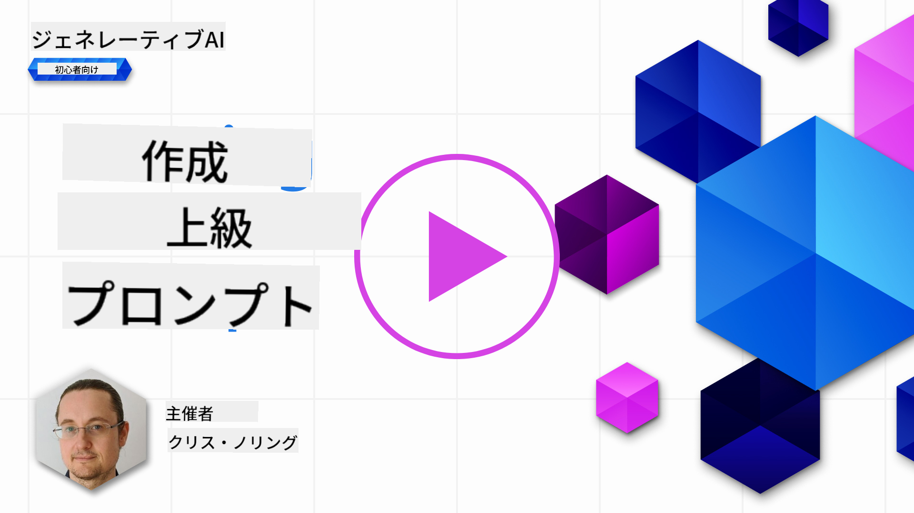

<!--
CO_OP_TRANSLATOR_METADATA:
{
  "original_hash": "b2651fb16bcfbc62b8e518751ed90fdb",
  "translation_date": "2025-10-17T23:48:25+00:00",
  "source_file": "05-advanced-prompts/README.md",
  "language_code": "ja"
}
-->
# 高度なプロンプトの作成

[](https://youtu.be/BAjzkaCdRok?si=NmUIyRf7-cDgbjtt)

前の章で学んだ内容を振り返りましょう：

> プロンプトエンジニアリングとは、**モデルにより関連性の高い応答を導く**ために、より有用な指示やコンテキストを提供するプロセスです。

プロンプトを書くには2つのステップがあります。関連するコンテキストを提供してプロンプトを構築することと、プロンプトを徐々に改善するための**最適化**です。

現時点で、プロンプトの書き方について基本的な理解は得られていますが、さらに深く掘り下げる必要があります。この章では、さまざまなプロンプトを試す段階から、なぜあるプロンプトが他のプロンプトよりも優れているのかを理解する段階へ進みます。また、どのLLMにも適用できる基本的な技術に従ってプロンプトを構築する方法を学びます。

## はじめに

この章では以下のトピックを取り上げます：

- さまざまな技術をプロンプトに適用してプロンプトエンジニアリングの知識を拡張する。
- 出力を変化させるようにプロンプトを設定する。

## 学習目標

このレッスンを完了すると、以下ができるようになります：

- プロンプトの結果を改善するプロンプトエンジニアリング技術を適用する。
- 出力が多様性を持つもの、または決定論的なものを実行する。

## プロンプトエンジニアリング

プロンプトエンジニアリングとは、望む結果を生み出すプロンプトを作成するプロセスです。プロンプトエンジニアリングは単にテキストプロンプトを書くこと以上のものです。これは工学的な学問ではなく、望む結果を得るために適用できる技術の集合です。

### プロンプトの例

以下のような基本的なプロンプトを考えてみましょう：

> 地理に関する質問を10個生成してください。

このプロンプトでは、実際にはさまざまなプロンプト技術を適用しています。

これを分解してみましょう。

- **コンテキスト**: 「地理」に関するものであることを指定しています。
- **出力の制限**: 質問は10個までと指定しています。

### シンプルなプロンプトの限界

望む結果が得られるかどうかは分かりません。質問は生成されますが、地理は広いテーマであり、以下の理由で望む結果が得られない可能性があります：

- **広範なテーマ**: 国、首都、川など、どのトピックについての質問になるか分かりません。
- **フォーマット**: 質問を特定の形式で作成したい場合はどうでしょう？

このように、プロンプトを作成する際には多くのことを考慮する必要があります。

これまでにシンプルなプロンプトの例を見てきましたが、生成AIはさまざまな役割や業界で人々を助けるためにもっと多くのことが可能です。次に基本的な技術を探ってみましょう。

### プロンプトの技術

まず、プロンプトがLLMの**発現的**な特性であることを理解する必要があります。これはモデルに組み込まれた機能ではなく、モデルを使用する中で発見されるものです。

LLMをプロンプトするために使用できる基本的な技術がいくつかあります。それらを見ていきましょう。

- **ゼロショットプロンプト**: これは最も基本的なプロンプト形式です。モデルの学習データに基づいて応答を要求する単一のプロンプトです。
- **少数ショットプロンプト**: 1つ以上の例を提供してモデルを導くプロンプト形式です。
- **思考の連鎖**: 問題をステップに分解する方法をモデルに指示するプロンプト形式です。
- **生成された知識**: プロンプトの応答を改善するために、生成された事実や知識を追加で提供します。
- **最小から最大へ**: 思考の連鎖のように、問題を一連のステップに分解し、それらのステップを順番に実行するように指示します。
- **自己改善**: モデルの出力を批評し、それを改善するように指示します。
- **産婆的プロンプト**: モデルの応答が正しいことを確認するために、応答のさまざまな部分を説明させます。これは自己改善の一形態です。

### ゼロショットプロンプト

このプロンプト形式は非常にシンプルで、単一のプロンプトで構成されています。この技術は、LLMについて学び始めた際におそらく使用しているものです。以下は例です：

- プロンプト: 「代数とは何ですか？」
- 応答: 「代数は数学の一分野で、数学記号とその記号を操作する規則を研究するものです。」

### 少数ショットプロンプト

このプロンプト形式は、リクエストとともにいくつかの例を提供することでモデルを助けます。単一のプロンプトに追加のタスク固有のデータを含めます。以下は例です：

- プロンプト: 「シェイクスピア風の詩を書いてください。以下はシェイクスピアのソネットのいくつかの例です：
  ソネット18: 『夏の日に君を例えようか？君はもっと美しく穏やかだ...』
  ソネット116: 『真の心の結婚に障害を認めるな。愛は愛ではない、それが変化を見つけたときに変わるもの...』
  ソネット132: 『君の目を愛している、それは私を憐れんでいるようだ、君の心が私を軽蔑で苦しめているのを知っている...』
  では、月の美しさについてのソネットを書いてください。」
- 応答: 「空に、月は静かに輝き、銀色の光がその優雅さを優しく投げかける...」

例は、モデルに望む出力のコンテキスト、形式、またはスタイルを提供します。これにより、モデルは特定のタスクを理解し、より正確で関連性の高い応答を生成することができます。

### 思考の連鎖

思考の連鎖は非常に興味深い技術で、モデルを一連のステップに導くことを目的としています。モデルに何かを正しく行う方法を理解させるよう指示するアイデアです。以下の例を考えてみましょう。思考の連鎖を使用しない場合と使用する場合：

    - プロンプト: 「アリスはリンゴを5個持っています。3個投げて、2個をボブに渡し、ボブが1個返しました。アリスはリンゴを何個持っていますか？」
    - 応答: 5

モデルは5と答えますが、これは間違っています。正しい答えは1個です。計算は (5 - 3 - 2 + 1 = 1) です。

では、モデルにこれを正しく行う方法を教えるにはどうすればよいでしょうか？

思考の連鎖を試してみましょう。思考の連鎖を適用するには：

1. モデルに類似の例を与える。
1. 計算方法を示し、正しく計算する方法を教える。
1. 元のプロンプトを提供する。

以下のようになります：

- プロンプト: 「リサはリンゴを7個持っています。1個投げて、4個をバートに渡し、バートが1個返しました：
  7 - 1 = 6
  6 - 4 = 2
  2 + 1 = 3  
  アリスはリンゴを5個持っています。3個投げて、2個をボブに渡し、ボブが1個返しました。アリスはリンゴを何個持っていますか？」
  応答: 1

このように、別の例、計算方法、元のプロンプトを含むかなり長いプロンプトを書き、正しい答え1に到達します。

思考の連鎖が非常に強力な技術であることが分かります。

### 生成された知識

プロンプトを構築する際に、自社のデータを使用したい場合がよくあります。プロンプトの一部を会社のデータから取得し、残りの部分を実際に興味のあるプロンプトにすることができます。

例えば、保険業界にいる場合、プロンプトは以下のように構築される可能性があります：

```text
{{company}}: {{company_name}}
{{products}}:
{{products_list}}
Please suggest an insurance given the following budget and requirements:
Budget: {{budget}}
Requirements: {{requirements}}
```

上記では、プロンプトがテンプレートを使用して構築されていることが分かります。テンプレートには`{{variable}}`で示されるいくつかの変数があり、会社のAPIからの実際の値で置き換えられます。

変数が会社のコンテンツで置き換えられた後のプロンプトの例は以下の通りです：

```text
Insurance company: ACME Insurance
Insurance products (cost per month):
- Car, cheap, 500 USD
- Car, expensive, 1100 USD
- Home, cheap, 600 USD
- Home, expensive, 1200 USD
- Life, cheap, 100 USD

Please suggest an insurance given the following budget and requirements:
Budget: $1000
Requirements: Car, Home, and Life insurance
```

このプロンプトをLLMに通すと、以下のような応答が生成されます：

```output
Given the budget and requirements, we suggest the following insurance package from ACME Insurance:
- Car, cheap, 500 USD
- Home, cheap, 600 USD
- Life, cheap, 100 USD
Total cost: $1,200 USD
```

この応答では、生命保険も提案されていますが、これは望ましくありません。この結果は、プロンプトをより明確にして何を許可するかを指定する必要があることを示しています。いくつかの**試行錯誤**の後、以下のプロンプトに到達します：

```text
Insurance company: ACME Insurance
Insurance products (cost per month):
- type: Car, cheap, cost: 500 USD
- type: Car, expensive, cost: 1100 USD
- type: Home, cheap, cost: 600 USD
- type: Home, expensive, cost: 1200 USD
- type: Life, cheap, cost: 100 USD

Please suggest an insurance given the following budget and requirements:
Budget: $1000 restrict choice to types: Car, Home
```

**タイプ**や**コスト**を追加し、さらに**制限**というキーワードを使用することで、モデルが何を求めているかを理解する助けになります。

これで以下の応答が得られます：

```output
Given the budget and requirements, we suggest the Car, Cheap insurance product which costs 500 USD per month.
```

この例のポイントは、基本的な技術である**生成された知識**を使用していても、望む結果を得るためにプロンプトを最適化する必要がある場合がほとんどであることを示すことです。

### 最小から最大へ

最小から最大へのプロンプトのアイデアは、大きな問題を小さな問題に分解することです。これにより、LLMが大きな問題を「攻略」する方法を導くことができます。データサイエンスの良い例として、以下のように問題を分割するようにモデルに指示することができます：

> プロンプト: データサイエンスを5つのステップで実行する方法は？

AIアシスタントの応答：

1. データを収集する
1. データをクリーンアップする
1. データを分析する
1. データをプロットする
1. データを提示する

### 自己改善、結果を批評する

生成AIやLLMでは、出力を信頼することはできません。検証が必要です。結局のところ、LLMは次に言うべき最も可能性の高いことを提示しているだけであり、正しいことを提示しているわけではありません。そのため、LLMに自己批評を求めることが良いアイデアであり、これが自己改善技術につながります。

この技術の仕組みは以下の通りです：

1. LLMに問題を解決するよう求める初期プロンプト
1. LLMが応答する
1. 応答を批評し、AIに改善を求める
1. LLMが再度応答し、批評を考慮して改善案を提案する

このプロセスは何度でも繰り返すことができます。

以下はこの技術を使用した例です：

> プロンプト: 「ルートがproductsとcustomersのPython Web APIを作成してください」

AI応答：

```python
import flask
app = Flask(__name__)

@app.route('/products')
def products():
    return 'Products'

@app.route('/customers')
def customers():
    return 'Customers'
```

> プロンプト: 上記のコードの改善点を3つ提案してください

AI応答：

```text
Sure, here are three suggestions to improve the code:

Import the correct module: The first line should import Flask instead of flask. The correct import statement should be from flask import Flask.

Add a main function: Add a if __name__ == '__main__': block to the end of the file to run the application when the file is executed.

Use f-strings: Use f-strings to format the return statements in the route functions. For example, return 'Products' can be changed to return f'This is the {request.path} page'.
```

```python
from flask import Flask, request

app = Flask(__name__)

@app.route('/products')
def products():
    return f'This is the {request.path} page'

@app.route('/customers')
def customers():
    return f'This is the {request.path} page'

if __name__ == '__main__':
    app.run()
```

上記のAI応答は、最初の提案されたコードを批評することで改善されています。

### 産婆的プロンプト

産婆的プロンプトは自己改善に似ていますが、モデルに自分自身を説明させることに重点を置いています。目的は、モデルの出力の矛盾を減らし、正しい答えに到達することです。以下のワークフローに従います：

1. LLMに質問に答えるよう求める
1. 応答の各部分について、より詳細に説明するよう求める
1. 矛盾がある場合は、矛盾している部分を破棄する

2と3を繰り返し、すべての部分を確認し、答えに満足するまで続けます。

以下はプロンプトの例です：

> プロンプト: パンデミックを軽減するための危機計画を5つのステップで作成するにはどうすればよいですか？
> LLM応答：

```text
1. Identify the risks
1. Identify the stakeholders
1. Identify the resources
1. Identify the actions
1. Identify the communication channels
```

5つのステップが特定されていますが、これが正しいかどうかを判断できますか？各ステップをより詳細に説明するようモデルに求めてみましょう：

> プロンプト: 最初のステップをより詳細に説明してください。パンデミックにおけるリスクを詳細に教えてください。

```text
The risks are the following:

- Loss of life
- Loss of business
- Loss of reputation
- Loss of customers
- Loss of employees
```

この時点で、モデルが正しいことを確認するために、最初のリスクをより詳細に説明するよう求め、上記の応答と一致することを期待します：

> プロンプト: パンデミックでは、最大のリスクは何であり、なぜですか？

```text
The biggest risk is loss of life because it's the most important thing to protect.
```

> パンデミックでの最大のリスクは何ですか？

```text
The two biggest risks are loss of life and loss of business.
```

この時点で、モデルは一貫しており、「生命」と「ビジネス」をパンデミックの2つの最大のリスクとして挙げています。次のステップに進むことができ、かなり自信を持つことができます。ただし、モデルを盲目的に信頼するべきではなく、常に出力を検証する必要があります。

## 出力を変化させる

LLMは本質的に非決定論的であり、同じプロンプトを実行するたびに異なる結果が得られます。以下のプロンプトを試してみてください：

> 「Python Web APIのコードを生成してください」

```python
# Import necessary modules
import flask
from flask import request, jsonify

# Create a Flask app
app = flask.Flask(__name__)

# Create a route for the API
@app.route('/api', methods=['GET'])
def api():
    # Get the data from the request
    data = request.args

    # Process the data
    result = process_data(data)

    # Return the result as JSON
    return jsonify(result)

# Function to process the data
def process_data(data):
    # Do something with the data
    result = data + 1

    # Return the result
    return result

# Run the app
if __name__ == '__main__':
    app.run()

```

同じプロンプトを再度実行すると、少し異なる応答が生成されます：

```python
#import necessary packages
import flask
from flask import request, jsonify

#create the Flask application
app = flask.Flask(__name__)
app.config["DEBUG"] = True

#create a list of books
books = [
    {'id': 0,
     'title': 'A Fire Upon the Deep',
     'author': 'Vernor Vinge',
     'first_sentence': 'The coldsleep itself was dreamless.',
     'year_published': '1992'},
    {'id': 1,
     'title': 'The Ones Who Walk Away From Omelas',
     'author': 'Ursula K. Le Guin',
     'first_sentence': 'With a clamor of bells that set the swallows soaring, the Festival of Summer came to the city Omelas, bright-towered by the sea.',
     'published': '1973'},
    {'id': 2,
     'title': 'Dhalgren',
     'author': 'Samuel R. Delany',
     'first_sentence': 'to wound the autumnal city.',
     'published': '1975'}
]

#create an endpoint for the API
@app.route('/', methods=['GET'])
def home():
    return '''<h1>Books API</h1>
<p>A prototype API for retrieving books.</p>'''

#create an endpoint to return all books
@app.route('/api/v1/resources/books/all', methods=['GET'])
def api_all():
    return jsonify(books)

#create an endpoint to return a single book
@app.route('/api/v1/resources/books', methods=['GET'])
def api_id():
    #check if an ID was provided as part of the URL
    #if ID is provided, assign it to a variable
    #if no ID is provided, display an error
    if 'id' in request.args:
        id = int(request.args['id'])
    else:
        return "Error: No id field provided. Please specify an id."

    #create an empty list for our results
    results = []

    #loop through the data and match results that fit the requested ID
    #IDs are unique, but other fields might return many results
    for book in books:
        if book['id'] == id:
            results.append(book)

    #use the jsonify function from Flask to convert our list of
    #Python dictionaries to the JSON format
    return jsonify(results)

app.run()
```

> では、出力の変化は問題でしょうか？

それは、あなたが何をしようとしているかによります。特定の応答が必要な場合は問題です。「地理に関する質問を3つ生成してください」のように出力の変化が許容される場合は問題ではありません。

### 温度を使用して出力を変化させる

さて、出力をより予測可能に、つまりより決定論的に制限したいと決めました。それをどうすればよいでしょうか？

温度は0から1の間の値で、0が最も決定論的で、1が最も変化に富んだ状態を示します。デフォルト値は0.7です。温度を0.1に設定して同じプロンプトを2回実行した場合に何が起こるか見てみましょう：

> 「Python Web APIのコードを生成してください」

```python
#import necessary libraries
import flask
from flask import request, jsonify

#create an instance of the Flask class
app = flask.Flask(__name__)

#create an endpoint for the API
@app.route('/api/v1/endpoint', methods=['GET'])
def api_endpoint():
    #get the request data
    data = request.get_json()

    #process the data
    result = process_data(data)

    #return the result
    return jsonify(result)

#function to process the data
def process_data(data):
    #process the data
    result = {'result': 'success'}

    #return the result
    return result

#run the Flask app
if __name__ == '__main__':
    app.run()

```

プロンプトを再度実行すると、次の結果が得られます：

```python
#import necessary libraries
import flask
from flask import request, jsonify

#create a Flask app
app = flask.Flask(__name__)

#create a route for the API
@app.route('/api', methods=['GET'])
def api_call():
    #get the data from the request
    data = request.get_json()

    #process the data
    result = process_data(data)

    #return the result
    return jsonify(result)

#define the process_data function
def process_data(data):
    #do something with the data
    result = data + 1

    #return the result
    return result

#run the app
if __name__ == '__main__':
    app.run()

```

これら2つの出力の間にはわずかな違いしかありません。今回は逆にして、温度を0.9に設定してみましょう：

```python
# Import necessary libraries
import flask
from flask import request, jsonify

# Create a Flask app
app = flask.Flask(__name__)

# Create a route for the API
@app.route('/api', methods=['GET'])
def api_call():
    # Get the data from the request
    data = request.args

    # Process the data
    result = process_data(data)

    # Return the result
    return jsonify(result)

# Function to process the data
def process_data(data):
    # Do something with the data
    result = data + 1

    # Return the result
    return result

# Run the app
if __name__ == '__main__':
    app.run()

```

温度値を0.9に設定して2回目の試行：

```python
import flask
from flask import request, jsonify

# create the Flask app
app = flask.Flask(__name__)
app.config['DEBUG'] = True

# create some test data
books = [
    {'id': 0, 'title': 'A Fire Upon The Deep', 'author': 'Vernor Vinge', 'first_sentence': 'The coldsleep itself was dreamless.', 'year_published': '1992'},
    {'id': 1, 'title': 'The Ones Who Walk Away From Omelas', 'author': 'Ursula K. Le Guin', 'first_sentence': 'With a clamor of bells that set the swallows soaring, the Festival of Summer came to the city Omelas, bright-towered by the sea.', 'published': '1973'},
    {'id': 2, 'title': 'Dhalgren', 'author': 'Samuel R. Delany', 'first_sentence': 'to wound the autumnal city.', 'published': '1975'}
]

# create an endpoint
@app.route('/', methods=['GET'])
def home():
    return '''<h1>Welcome to our book API!</h1>'''

@app.route('/api/v1/resources/books

```

ご覧の通り、結果は非常に多様です。

> Note, 出力を変化させるために変更できるパラメータは他にもあります。例えば、top-k、top-p、repetition penalty、length penalty、diversity penaltyなどですが、これらはこのカリキュラムの範囲外です。

## 良い実践方法

目的を達成するために適用できる多くの実践方法があります。プロンプトを使い続けることで、自分自身のスタイルを見つけることができるでしょう。

これまでに紹介したテクニックに加えて、LLMにプロンプトを与える際に考慮すべき良い実践方法があります。

以下は考慮すべき良い実践方法です：

- **コンテキストを明確にする**。コンテキストは重要です。ドメインやトピックなど、できるだけ具体的に指定するほど良い結果が得られます。
- 出力を制限する。特定の項目数や特定の長さを求める場合は、それを指定してください。
- **何を、そしてどのように**。何を求めているか、そしてどのようにそれを求めているかを両方明記することを忘れないでください。例えば、「製品と顧客のルートを持つPython Web APIを作成し、それを3つのファイルに分割してください」といった具合です。
- **テンプレートを使用する**。しばしば、プロンプトを会社のデータで充実させたい場合があります。テンプレートを使用してこれを行いましょう。テンプレートには、実際のデータで置き換える変数を含めることができます。
- **正確にスペルを書く**。LLMは正しい回答を提供するかもしれませんが、正確にスペルを書くことでより良い回答を得ることができます。

## 課題

以下はFlaskを使用してシンプルなAPIを構築する方法を示すPythonコードです：

```python
from flask import Flask, request

app = Flask(__name__)

@app.route('/')
def hello():
    name = request.args.get('name', 'World')
    return f'Hello, {name}!'

if __name__ == '__main__':
    app.run()
```

GitHub CopilotやChatGPTのようなAIアシスタントを使用し、「自己改善」技術を適用してコードを改善してください。

## 解答

コードに適切なプロンプトを追加して課題を解決してください。

> [!TIP]
> 改善を求めるプロンプトを作成する際には、改善の数を制限するのが良いアイデアです。また、アーキテクチャ、パフォーマンス、セキュリティなど、特定の方法で改善を求めることもできます。

[解答](../../../05-advanced-prompts/python/aoai-solution.py)

## 知識チェック

なぜchain-of-thoughtプロンプティングを使用するのでしょうか？正しい回答1つと間違った回答2つを示してください。

1. LLMに問題の解き方を教えるため。
1. B、LLMにコードのエラーを見つける方法を教えるため。
1. C、LLMに異なる解決策を考えさせるため。

A: 1、なぜならchain-of-thoughtは、類似の問題とその解決方法を示しながら、LLMに問題の解き方を教えることに関するものだからです。

## 🚀 チャレンジ

課題で自己改善技術を使用しました。作成したプログラムを選び、それに適用したい改善点を考えてください。そして、自己改善技術を使用して提案された変更を適用してください。結果はどうでしたか？良くなりましたか、それとも悪くなりましたか？

## 素晴らしい仕事！学習を続けましょう

このレッスンを完了した後は、[Generative AI Learning collection](https://aka.ms/genai-collection?WT.mc_id=academic-105485-koreyst)をチェックして、生成AIの知識をさらに深めてください！

次のレッスン6では、プロンプトエンジニアリングの知識を活用して[テキスト生成アプリを構築](../06-text-generation-apps/README.md?WT.mc_id=academic-105485-koreyst)します。

---

**免責事項**:  
この文書はAI翻訳サービス[Co-op Translator](https://github.com/Azure/co-op-translator)を使用して翻訳されています。正確性を追求しておりますが、自動翻訳には誤りや不正確な部分が含まれる可能性があります。元の言語で記載された文書を正式な情報源としてお考えください。重要な情報については、専門の人間による翻訳を推奨します。この翻訳の使用に起因する誤解や誤解について、当社は責任を負いません。