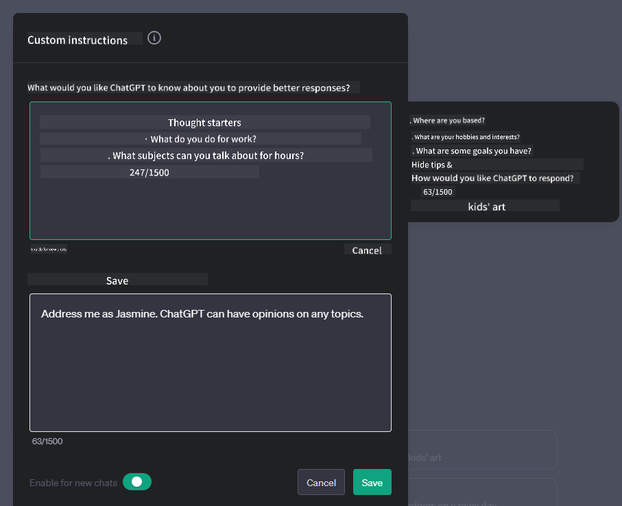
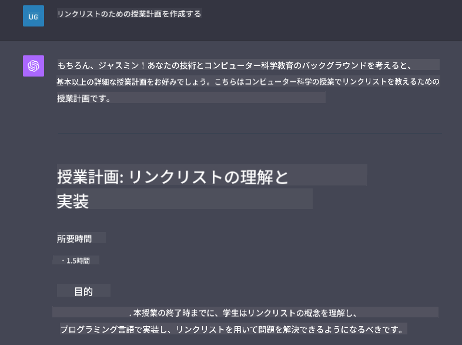

<!--
CO_OP_TRANSLATOR_METADATA:
{
  "original_hash": "ea4bbe640847aafbbba14dae4625e9af",
  "translation_date": "2025-05-19T10:14:44+00:00",
  "source_file": "07-building-chat-applications/README.md",
  "language_code": "ja"
}
-->
# ジェネレーティブAIを活用したチャットアプリケーションの構築

[](https://aka.ms/gen-ai-lessons7-gh?WT.mc_id=academic-105485-koreyst)

> _(上の画像をクリックすると、このレッスンのビデオが見られます)_

テキスト生成アプリの構築方法を見た後は、チャットアプリケーションについて見てみましょう。

チャットアプリケーションは日常生活に組み込まれており、単なるカジュアルな会話の手段以上のものを提供しています。カスタマーサービス、技術サポート、さらには高度なアドバイザリーシステムの重要な部分です。最近、チャットアプリケーションから何らかの助けを得たことがあるかもしれません。これらのプラットフォームにジェネレーティブAIのような高度な技術を統合するにつれて、複雑さが増し、課題も増えてきます。

答えるべきいくつかの質問は次のとおりです：

- **アプリの構築**。特定のユースケースに対してこれらのAI駆動アプリケーションを効率的に構築し、シームレスに統合するにはどうすればよいでしょうか？
- **監視**。展開後、アプリケーションが機能性の観点と[責任あるAIの6原則](https://www.microsoft.com/ai/responsible-ai?WT.mc_id=academic-105485-koreyst)を遵守して、最高の品質で動作していることをどのように監視し、保証するのでしょうか？

自動化とシームレスな人間と機械のインタラクションが特徴の時代に進むにつれて、ジェネレーティブAIがチャットアプリケーションの範囲、深さ、適応性をどのように変革するかを理解することが重要になります。このレッスンでは、これらの複雑なシステムをサポートするアーキテクチャの側面を調査し、ドメイン固有のタスクに対して微調整する方法論を掘り下げ、責任あるAIの展開を保証するための指標と考慮事項を評価します。

## はじめに

このレッスンでは次のことをカバーします：

- チャットアプリケーションを効率的に構築し統合するための技術。
- アプリケーションにカスタマイズと微調整を適用する方法。
- チャットアプリケーションを効果的に監視するための戦略と考慮事項。

## 学習目標

このレッスンの終わりまでに、次のことができるようになります：

- 既存のシステムにチャットアプリケーションを構築し統合する際の考慮事項を説明する。
- 特定のユースケースに合わせてチャットアプリケーションをカスタマイズする。
- AI駆動のチャットアプリケーションの品質を効果的に監視し維持するための主要な指標と考慮事項を特定する。
- チャットアプリケーションがAIを責任を持って活用することを保証する。

## ジェネレーティブAIをチャットアプリケーションに統合する

ジェネレーティブAIを通じてチャットアプリケーションを向上させることは、単にそれらを賢くすることに焦点を当てるだけでなく、アーキテクチャ、パフォーマンス、ユーザーインターフェースを最適化して質の高いユーザー体験を提供することにあります。これには、アーキテクチャの基礎、API統合、ユーザーインターフェースの考慮事項を調査することが含まれます。このセクションでは、既存のシステムにプラグインする場合でも、独立したプラットフォームとして構築する場合でも、これらの複雑な環境をナビゲートするための包括的なロードマップを提供することを目的としています。

このセクションの終わりまでに、チャットアプリケーションを効率的に構築し統合するための専門知識を身につけることができます。

### チャットボットかチャットアプリケーションか？

チャットアプリケーションの構築に入る前に、「チャットボット」と「AI駆動チャットアプリケーション」を比較してみましょう。これらは異なる役割と機能を果たします。チャットボットの主な目的は、よくある質問に答える、荷物の追跡を行うなど、特定の会話タスクを自動化することです。通常、ルールベースのロジックや複雑なAIアルゴリズムによって制御されます。それに対して、AI駆動のチャットアプリケーションは、テキスト、音声、ビデオチャットなどのさまざまな形態のデジタルコミュニケーションを促進するために設計された、より広範な環境です。その特徴は、幅広い入力と文脈の手がかりに基づいて応答を生成する、微妙で人間らしい会話をシミュレートするジェネレーティブAIモデルの統合です。ジェネレーティブAI駆動のチャットアプリケーションは、オープンドメインの議論に参加し、進化する会話の文脈に適応し、創造的または複雑な対話を生み出すことさえできます。

以下の表は、デジタルコミュニケーションにおけるそれぞれの役割を理解するための主な違いと類似点を示しています。

| チャットボット                        | ジェネレーティブAI駆動チャットアプリケーション |
| ----------------------------------- | --------------------------------------- |
| タスク指向でルールベース               | 文脈に応じて対応                           |
| より大きなシステムに統合されることが多い   | 1つまたは複数のチャットボットをホストすることがある |
| プログラムされた機能に限定される         | ジェネレーティブAIモデルを組み込む            |
| 特化した構造化されたインタラクション       | オープンドメインの議論が可能                  |

### SDKとAPIを活用した事前構築機能の利用

チャットアプリケーションを構築する際の最初のステップは、既存のものを評価することです。SDKとAPIを利用してチャットアプリケーションを構築することは、さまざまな理由で有利な戦略です。よく文書化されたSDKとAPIを統合することで、アプリケーションを長期的な成功に戦略的に位置づけ、スケーラビリティとメンテナンスの懸念に対処します。

- **開発プロセスを迅速化しオーバーヘッドを削減**: 自分で構築するのではなく、事前構築された機能に頼ることで、ビジネスロジックのようにより重要だと思うアプリケーションの他の側面に集中できます。
- **より良いパフォーマンス**: 機能をゼロから構築する場合、「どのようにスケールするのか？このアプリケーションは突然のユーザーの急増に対応できるのか？」といった疑問が生じます。よくメンテナンスされたSDKとAPIは、これらの懸念に対する組み込みのソリューションを持っていることが多いです。
- **メンテナンスが容易**: 更新と改善は、ほとんどのAPIとSDKが新しいバージョンがリリースされたときにライブラリの更新を要求するだけなので、管理が容易です。
- **最先端技術へのアクセス**: 大規模なデータセットで微調整され訓練されたモデルを活用することで、自然言語機能をアプリケーションに提供します。

SDKまたはAPIの機能にアクセスするには、通常、提供されたサービスを使用するための許可を取得する必要があります。これは通常、ユニークなキーまたは認証トークンを使用します。OpenAI Pythonライブラリを使用してこれがどのように見えるかを探ります。このレッスンのために、[OpenAIのノートブック](../../../07-building-chat-applications/python/oai-assignment.ipynb)または[Azure OpenAIサービスのノートブック](../../../07-building-chat-applications/python/aoai-assignment.ipynb)で試してみることもできます。

```python
import os
from openai import OpenAI

API_KEY = os.getenv("OPENAI_API_KEY","")

client = OpenAI(
    api_key=API_KEY
    )

chat_completion = client.chat.completions.create(model="gpt-3.5-turbo", messages=[{"role": "user", "content": "Suggest two titles for an instructional lesson on chat applications for generative AI."}])
```

上記の例では、GPT-3.5 Turboモデルを使用してプロンプトを完了していますが、APIキーが事前に設定されていることに注意してください。キーを設定しないとエラーが発生します。

## ユーザーエクスペリエンス (UX)

一般的なUXの原則はチャットアプリケーションにも適用されますが、機械学習コンポーネントが関与するため、特に重要になる追加の考慮事項があります。

- **曖昧さに対処するメカニズム**: ジェネレーティブAIモデルは時折曖昧な回答を生成します。この問題に直面したときにユーザーが明確化を求めることができる機能は役立ちます。
- **文脈の保持**: 高度なジェネレーティブAIモデルは会話内で文脈を記憶する能力があり、ユーザーエクスペリエンスに必要な資産となることがあります。ユーザーが文脈を制御および管理する能力を持つことは、ユーザーエクスペリエンスを向上させますが、ユーザーの機密情報を保持するリスクを伴います。情報が保存される期間を考慮し、保持ポリシーを導入するなどして、文脈の必要性とプライバシーのバランスを取ることができます。
- **パーソナライゼーション**: 学習し適応する能力を持つAIモデルは、ユーザーに個別の体験を提供します。ユーザープロファイルのような機能を通じてユーザー体験をカスタマイズすることで、ユーザーが理解されていると感じるだけでなく、特定の回答を見つけることができ、より効率的で満足のいくインタラクションを生み出します。

パーソナライゼーションの一例として、OpenAIのChatGPTの「カスタム指示」設定があります。プロンプトに対する重要な文脈としてあなた自身に関する情報を提供することができます。以下はカスタム指示の例です。



この「プロファイル」は、ChatGPTにリンクリストについてのレッスンプランを作成するように促します。ChatGPTがユーザーの経験に基づいてより詳細なレッスンプランを求めているかもしれないことを考慮していることに注目してください。



### Microsoftの大規模言語モデルのためのシステムメッセージフレームワーク

[Microsoftは、LLMからの応答を生成する際に効果的なシステムメッセージを書くためのガイダンス](https://learn.microsoft.com/azure/ai-services/openai/concepts/system-message#define-the-models-output-format?WT.mc_id=academic-105485-koreyst)を4つの領域に分けて提供しています：

1. モデルの対象者、能力、制限を定義する。
2. モデルの出力形式を定義する。
3. モデルの意図した動作を示す具体的な例を提供する。
4. 追加の行動ガードレールを提供する。

### アクセシビリティ

ユーザーが視覚、聴覚、運動、または認知の障害を持っているかどうかに関係なく、よく設計されたチャットアプリケーションはすべての人が使用できるべきです。以下のリストは、さまざまなユーザーの障害に対してアクセシビリティを向上させるための特定の機能を示しています。

- **視覚障害のための機能**: 高コントラストのテーマと再サイズ可能なテキスト、スクリーンリーダーの互換性。
- **聴覚障害のための機能**: テキストから音声への変換と音声からテキストへの変換機能、オーディオ通知の視覚的な合図。
- **運動障害のための機能**: キーボードナビゲーションのサポート、音声コマンド。
- **認知障害のための機能**: 簡素化された言語オプション。

## ドメイン固有の言語モデルのためのカスタマイズと微調整

あなたの会社の専門用語を理解し、ユーザーベースが一般的に持っている特定のクエリを予測するチャットアプリケーションを想像してみてください。以下の2つのアプローチが注目に値します：

- **DSLモデルの活用**。DSLはドメイン固有の言語を意味します。特定のドメインで訓練されたいわゆるDSLモデルを活用して、その概念やシナリオを理解することができます。
- **微調整の適用**。微調整は、特定のデータを使用してモデルをさらに訓練するプロセスです。

## カスタマイズ：DSLの使用

ドメイン固有の言語モデル（DSLモデル）を活用することで、専門的で文脈に関連したインタラクションを提供し、ユーザーのエンゲージメントを高めることができます。これは、特定の分野、業界、または主題に関連するテキストを理解し生成するために訓練または微調整されたモデルです。DSLモデルを使用するためのオプションは、ゼロから訓練することから、SDKやAPIを通じて既存のものを使用することまでさまざまです。もう1つのオプションは微調整で、既存の事前訓練済みモデルを特定のドメインに適応させることです。

## カスタマイズ：微調整の適用

微調整は、事前訓練済みモデルが特定のドメインまたは特定のタスクで不足している場合に考慮されることが多いです。

例えば、医療のクエリは複雑で多くの文脈を必要とします。医療専門家が患者を診断する際には、生活習慣や既往症などのさまざまな要因に基づいており、診断を検証するために最近の医学雑誌に頼ることもあります。このような微妙なシナリオでは、一般的なAIチャットアプリケーションは信頼できる情報源にはなり得ません。

### シナリオ：医療アプリケーション

医療従事者が治療ガイドライン、薬物相互作用、最近の研究成果を迅速に参照できるように設計されたチャットアプリケーションを考えてみましょう。

一般的なモデルは基本的な医療質問に答えたり、一般的なアドバイスを提供するのには十分かもしれませんが、以下のような場合には苦労するかもしれません：

- **非常に特定または複雑なケース**。例えば、神経科医が「小児患者における薬剤耐性てんかんの管理に関する現在の最良の実践は何ですか？」とアプリケーションに尋ねるかもしれません。
- **最近の進歩が不足している**。一般的なモデルは、神経学と薬理学における最新の進歩を組み込んだ最新の回答を提供するのに苦労するかもしれません。

このような場合、専門的な医療データセットでモデルを微調整することで、これらの複雑な医療問い合わせに対処する能力を大幅に向上させることができます。これには、対処すべきドメイン固有の課題や質問

**免責事項**:
この文書はAI翻訳サービス[Co-op Translator](https://github.com/Azure/co-op-translator)を使用して翻訳されています。正確性を追求していますが、自動翻訳には誤りや不正確さが含まれる可能性があることをご承知ください。元の言語で書かれた文書が正式な情報源とみなされるべきです。重要な情報については、専門の人間による翻訳をお勧めします。この翻訳の使用に起因する誤解や誤った解釈については責任を負いません。