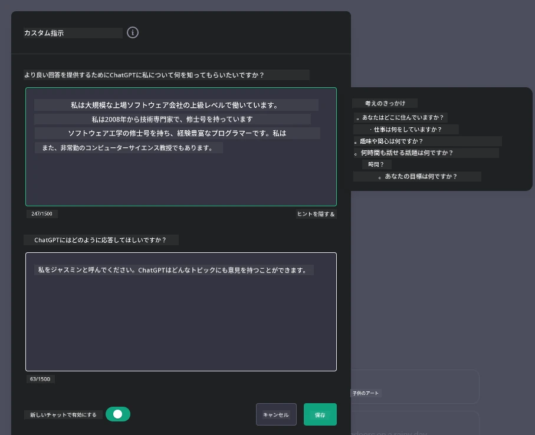
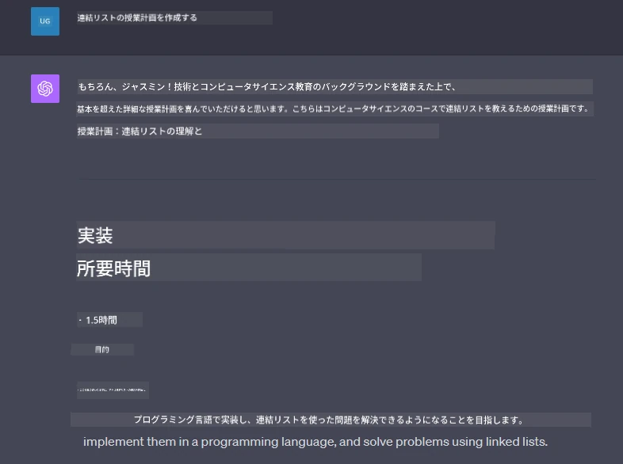

# 生成AI搭載チャットアプリケーションの構築

[](https://youtu.be/R9V0ZY1BEQo?si=IHuU-fS9YWT8s4sA)

> _(上の画像をクリックすると、このレッスンのビデオが視聴できます)_

テキスト生成アプリの構築方法を見てきたので、次はチャットアプリケーションについて見ていきましょう。

チャットアプリケーションは私たちの日常生活に統合されており、単なる雑談の手段以上の役割を持っています。顧客サービス、技術サポート、さらには高度なアドバイザリーシステムの重要な一部です。最近、チャットアプリケーションから何かしらの助けを受けたことがあるかもしれません。こうしたプラットフォームに生成AIのような高度な技術を組み込むにあたり、その複雑さや課題は増大しています。

解決すべきいくつかの疑問は次の通りです：

- <strong>アプリの構築方法</strong>。特定のユースケースに合わせて、どのように効率的にAI搭載アプリを構築し、シームレスに統合するか？
- <strong>監視方法</strong>。展開後、機能面と[責任あるAIの6原則](https://www.microsoft.com/ai/responsible-ai?WT.mc_id=academic-105485-koreyst)の両方を遵守しつつ、如何に最高レベルの品質でアプリが動作しているかを監視するか？

自動化とシームレスな人-機械インタラクションが定義する時代に進む中で、生成AIがチャットアプリケーションの範囲、深さ、適応性をどのように変革するかを理解することが重要になっています。本レッスンでは、これらの複雑なシステムを支えるアーキテクチャの要素、ドメイン別のタスクに対するファインチューニングの手法、責任あるAI展開を確保するための指標や考慮事項について検証します。

## はじめに

このレッスンでは以下を取り扱います：

- 効率的にチャットアプリケーションを構築し統合する技術。
- アプリケーションのカスタマイズやファインチューニングの適用方法。
- チャットアプリケーションを効果的に監視するための戦略と考慮事項。

## 学習目標

このレッスン終了時には、以下ができるようになります：

- チャットアプリケーションの構築と既存システムへの統合に関する考慮事項を説明する。
- 特定のユースケースに合わせてチャットアプリケーションをカスタマイズする。
- AI搭載チャットアプリケーションの品質を効果的に監視し維持するための主要な指標や考慮事項を特定する。
- チャットアプリケーションが責任あるAIを活用するようにする。

## 生成AIのチャットアプリへの統合

生成AIによってチャットアプリケーションを高度化することは、単に賢くすることだけでなく、アーキテクチャ、パフォーマンス、ユーザーインターフェイスを最適化して質の高いユーザー体験を提供することにあります。これには、アーキテクチャの基盤、API統合、ユーザーインターフェースの考慮点の検証が含まれます。本セクションでは、既存システムに組み込む場合でも、単独のプラットフォームとして構築する場合でも、これらの複雑な課題をナビゲートするための包括的なロードマップを提供することを目指します。

このセクションの終わりまでに、効率的にチャットアプリケーションを構築し統合するための専門知識を身に付けられるでしょう。

### チャットボットとチャットアプリケーションの違い

チャットアプリケーションの構築に入る前に、'チャットボット' と 'AI搭載チャットアプリケーション' の役割と機能の違いを比較しましょう。チャットボットは、よくある質問への回答や荷物の追跡など、特定の会話タスクを自動化することが主な目的です。通常、ルールベースのロジックや複雑なAIアルゴリズムによって制御されます。一方、AI搭載チャットアプリケーションは、テキスト、音声、ビデオチャットなど人間同士の多様なデジタルコミュニケーションを支援するはるかに広範な環境です。その特徴は、入力や文脈に基づき、微妙で人間のような会話をシミュレートする生成AIモデルを統合している点です。生成AI搭載チャットアプリケーションは、オープンドメインの議論に対応し、進化する会話の文脈に適応し、創造的または複雑な対話も生成できます。

以下の表は、それらの独自の役割を理解するための主要な相違点と類似点を示しています。

| チャットボット                          | 生成AI搭載チャットアプリケーション               |
| ------------------------------------- | -------------------------------------------- |
| タスク中心でルールベース              | 文脈認識型                                   |
| 大規模システムに統合されることが多い | 一つまたは複数のチャットボットをホスト可能     |
| プログラムされた機能に限定            | 生成AIモデルを組み込む                         |
| 専門的かつ構造化された対話             | オープンドメインの議論が可能                    |

### SDKやAPIによる既成機能の活用

チャットアプリを構築する際、まず既存のものを評価することは良いステップです。SDKやAPIを利用してチャットアプリケーションを作ることは、多くの理由で有利な戦略です。よくドキュメント化されたSDKやAPIを統合することで、スケーラビリティとメンテナンスの課題に対応しつつ、長期的な成功に向けて戦略的にアプリケーションを位置付けられます。

- <strong>開発プロセスを迅速化しオーバーヘッドを削減</strong>：自分で高コストの機能を構築する代わりに、既成機能に頼ることで、ビジネスロジックなど、より重要だと思うアプリの他の面に集中できます。
- <strong>パフォーマンスの向上</strong>：機能をゼロから作ると、「スケールするか？このアプリは急激なユーザー増加に耐えられるか？」という課題に直面します。メンテナンスが行き届いたSDKやAPIはこれらの問題に対する組み込みの解決策がよくあります。
- <strong>メンテナンスが容易</strong>：多くのAPIやSDKは新しいバージョンがリリースされたときにライブラリを更新するだけで済み、アップデートと改善を管理しやすいです。
- <strong>最先端技術へのアクセス</strong>：大規模なデータセットで微調整・学習されたモデルを活用することで、自然言語処理能力をアプリに提供します。

SDKやAPIの機能にアクセスするには、通常、サービス利用許可を得る必要があり、これは固有のキーや認証トークンを使うことが多いです。OpenAI Python Libraryを使って、これがどのようなものかを探ります。以下の[OpenAI用ノートブック](./python/oai-assignment.ipynb?WT.mc_id=academic-105485-koreyst)やAzure OpenAIサービス用の[ノートブック](./python/aoai-assignment.ipynb?WT.mc_id=academic-105485-koreys)でも試せます。

```python
import os
from openai import OpenAI

API_KEY = os.getenv("OPENAI_API_KEY","")

client = OpenAI(
    api_key=API_KEY
    )

response = client.responses.create(model="gpt-4o-mini", input="Suggest two titles for an instructional lesson on chat applications for generative AI.", store=False)
print(response.output_text)
```

上記の例では、Responses APIでGPT-4o miniモデルを使ってプロンプトを完了していますが、その前にAPIキーを設定していることにご注意ください。キーを設定しないとエラーになります。

## ユーザーエクスペリエンス（UX）

一般的なUX原則はチャットアプリにも適用されますが、機械学習要素が関わるため特に重要になるいくつかの追加的考慮点があります。

- <strong>曖昧さへの対処メカニズム</strong>：生成AIモデルは時折曖昧な回答を生成します。この問題に遭遇した際にユーザーが説明を求める機能が役立ちます。
- <strong>コンテキスト保持</strong>：高度な生成AIモデルは会話内のコンテキストを記憶する能力があります。これがユーザー体験の資産になることがあります。ユーザーがコンテキストを管理できるようにすることは良いですが、敏感なユーザー情報を保持するリスクも伴います。保持期間の導入などのポリシーを設け、プライバシーとコンテキストのバランスを取ることが重要です。
- <strong>パーソナライズ</strong>：学習・適応能力を持つAIモデルは個別化された体験を提供します。ユーザープロファイルなどの機能で体験をカスタマイズすると、ユーザーが理解されていると感じるだけでなく、特定の回答を見つけるのが効率的で満足度の高い相互作用になります。

そのようなパーソナライズの例として、OpenAIのChatGPTの「Custom instructions」設定があります。ここではプロンプトの重要なコンテキストとなる自分の情報を提供できます。以下はカスタム命令の例です。



この「プロフィール」はChatGPTにリンクリストのレッスンプランを作成させるものです。ユーザーの経験に基づき、より詳細なレッスンプランを希望している可能性を考慮していることに注目してください。



### Microsoftの大規模言語モデル向けシステムメッセージフレームワーク

[Microsoftは大規模言語モデルからの応答生成時に効果的なシステムメッセージの書き方について指針を提供しています](https://learn.microsoft.com/azure/ai-services/openai/concepts/system-message#define-the-models-output-format?WT.mc_id=academic-105485-koreyst)が、それは以下の4つの領域に分かれています：

1. モデルの対象者、能力、制限の定義。
2. モデルの出力フォーマットの定義。
3. モデルの意図した振る舞いを示す具体的な例の提供。
4. 追加の振る舞いに関するガードレールの提供。

### アクセシビリティ

ユーザーが視覚、聴覚、運動、認知に障害を持つかどうかにかかわらず、よく設計されたチャットアプリケーションは誰でも使えるべきです。次のリストは、さまざまなユーザーの障害に対応するためのアクセシビリティ強化機能を示します。

- <strong>視覚障害向け機能</strong>：高コントラストテーマやリサイズ可能なテキスト、スクリーンリーダー対応。
- <strong>聴覚障害向け機能</strong>：テキスト読み上げ・音声入力機能、音声通知の視覚的合図。
- <strong>運動障害向け機能</strong>：キーボードナビゲーション対応、音声コマンド。
- <strong>認知障害向け機能</strong>：簡素化された言語オプション。

## ドメイン特化型言語モデルのカスタマイズとファインチューニング

あなたの会社の専門用語を理解し、ユーザーが一般的に抱く特定の問い合わせを見越すチャットアプリケーションを想像してください。いくつかのアプローチがあります：

- **DSLモデルの活用**。DSLはドメイン特化言語の略です。特定ドメインで学習されたDSLモデルを活用して、その概念やシナリオを理解させることができます。
- <strong>ファインチューニングの適用</strong>。ファインチューニングは、特定のデータで既存のモデルをさらに学習させるプロセスです。

## カスタマイズ：DSLの利用

ドメイン特化型言語モデル（DSLモデル）を活用すると、専門的かつ文脈に即した対話を提供し、ユーザーの関心を高められます。これは特定分野や業界、テーマに関連する文章を理解・生成するために訓練された、あるいはファインチューニングされたモデルです。DSLモデルの利用方法には、ゼロからの訓練、SDKやAPIを通じた既存モデルの利用などさまざまな選択肢があります。もう一つの選択肢はファインチューニングで、既存の事前学習済みモデルを特定ドメインに適応させるものです。

## カスタマイズ：ファインチューニングの適用

ファインチューニングは、事前学習済みモデルが専門分野や特定タスクで不足を感じる場合に用いられます。

例えば、医療関連の質問は複雑で多くの文脈を必要とします。医療専門家が患者を診断する場合、生活習慣や既往症、最新の医学論文を参照して診断を裏付けることもあります。このように微妙なケースでは、汎用AIチャットアプリは信頼性ある情報源になりません。

### シナリオ：医療アプリケーション

医療従事者が治療指針、薬物相互作用、最新研究結果などに迅速にアクセスできるよう支援するチャットアプリを考えてみましょう。

汎用モデルは基本的な医療質問や一般的なアドバイスには対応できますが、以下の点で苦戦するかもしれません：

- <strong>非常に特異的または複雑な事例</strong>。例えば、小児患者の難治性てんかんの管理に関する最新の最良実践を神経科医がアプリに尋ねる場合など。
- <strong>最新の進歩を反映していない</strong>。汎用モデルは神経学や薬理学の最新の進歩を取り入れた回答を示すのが難しいことがあります。

このようなケースでは、専門の医療データセットを用いてモデルをファインチューニングすると、これら複雑な医療質問により正確かつ信頼性高く対応できるようになります。そのためにはドメイン特有の課題や質問を表す大規模で関連性の高いデータセットへのアクセスが必要です。

## 高品質なAI駆動チャット体験のための考慮事項

ここでは「高品質」なチャットアプリケーションの基準を説明し、アクション可能な指標の取得と責任を持ったAI技術の活用フレームワークへの準拠を含みます。

### 主要指標

高品質なパフォーマンスを維持するためには、主要な指標や考慮点を追跡することが不可欠です。これらの指標はアプリケーションの機能性だけでなく、AIモデルやユーザー体験の質についても評価します。以下は基本的な指標、AI指標、ユーザー体験指標を網羅した一覧です。

| 指標                          | 定義                                                                                                                | チャット開発者への考慮点                                            |
| ----------------------------- | ------------------------------------------------------------------------------------------------------------------- | ------------------------------------------------------------------ |
| <strong>稼働時間</strong>                  | アプリケーションが稼働しユーザーがアクセス可能な時間を測定                                                       | ダウンタイムをどう最小化しますか？                                      |
| <strong>応答時間</strong>                  | ユーザーの問い合わせにアプリが応答するまでの時間                                                                 | 問い合わせ処理を最適化して応答時間をどう短縮しますか？                    |
| <strong>精度</strong>                      | 正の予測のうち正解の割合                                                                                            | モデルの精度をどう検証しますか？                                        |
| **再現率（感度）**            | 実際に正解となる数のうち正しく予測された割合                                                                        | 再現率をどう測定し改善しますか？                                        |
| **F1スコア**                  | 精度と再現率の調和平均で、両者のトレードオフをバランス                                                            | 目標とするF1スコアは？ 精度と再現率のバランスをどう取りますか？            |
| <strong>困惑度</strong>                    | モデルが予測する確率分布がデータの実際の分布にどれだけ合っているかを測定                                         | 困惑度をどう最小化しますか？                                          |
| <strong>ユーザー満足度指標</strong>        | アプリケーションに対するユーザーの評価。調査を通じて取得されることが多い                                            | どのくらいの頻度でユーザーフィードバックを収集しますか？ またそれに基づきどう対応しますか？  |
| <strong>エラー率</strong>                  | モデルが理解や出力で誤りを犯す割合                                                                                 | エラー率削減のための戦略は何ですか？                                    |
| <strong>再訓練サイクル</strong>            | 新しいデータや洞察を取り入れるためにモデルが更新される頻度                                                         | どのくらいの頻度でモデルを再訓練しますか？ 再訓練のきっかけは何ですか？          |

| <strong>異常検知</strong>               | 予想される動作に合わない異常なパターンを識別するためのツールと技術。                                | 異常にどのように対応しますか？                                            |

### チャットアプリケーションにおける責任あるAIの実践

マイクロソフトの責任あるAIへのアプローチは、AIの開発と利用を導くべき6つの原則を特定しています。以下は、その原則と定義、チャット開発者が考慮すべき点、そしてなぜ真剣に取り組む必要があるのかです。

| 原則                   | マイクロソフトの定義                                    | チャット開発者が考慮すべき点                                         | なぜ重要か                                                                        |
| ---------------------- | ----------------------------------------------------- | ---------------------------------------------------------------------- | ---------------------------------------------------------------------------------- |
| 公平性                 | AIシステムはすべての人を公平に扱うべきです。          | チャットアプリがユーザーデータに基づき差別しないようにする。          | ユーザー間の信頼と包摂性を築き、法的問題を回避するため。                        |
| 信頼性と安全性         | AIシステムは信頼でき安全に動作すべきです。            | エラーやリスクを最小化するテストとフェイルセーフを実装する。          | ユーザー満足を保証し、潜在的な害を防止するため。                                 |
| プライバシーとセキュリティ | AIシステムは安全でプライバシーを尊重すべきです。       | 強力な暗号化とデータ保護対策を実施する。                              | 敏感なユーザーデータを保護し、プライバシー法に準拠するため。                    |
| 包括性                 | AIシステムはすべての人々を支援し参加を促すべきです。   | 多様なユーザーにとってアクセスしやすく使いやすいUI/UXを設計する。    | より多くの人が効果的にアプリケーションを利用できるようにするため。              |
| 透明性                 | AIシステムは理解可能であるべきです。                   | AIの応答に関する明確な文書化と説明を提供する。                        | ユーザーは意思決定の過程を理解できるとシステムをより信頼しやすくなるため。     |
| 責任                   | 人はAIシステムに対して責任を持つべきです。             | AIの決定を監査し改善するための明確なプロセスを確立する。              | ミスがあった場合の継続的な改善と是正措置を可能にするため。                     |

## 課題

[assignment](../../../07-building-chat-applications/python)を参照してください。最初のチャットプロンプトを実行することから、テキストの分類や要約など、一連の演習を体験できます。課題は異なるプログラミング言語で利用可能なことに注意してください！

## 素晴らしい仕事です！旅を続けましょう

このレッスンを修了したら、[Generative AI Learning collection](https://aka.ms/genai-collection?WT.mc_id=academic-105485-koreyst)をチェックして、ジェネレーティブAIの知識をさらに高めましょう！

レッスン8に進んで、[検索アプリケーションの構築](../08-building-search-applications/README.md?WT.mc_id=academic-105485-koreyst)の始め方を見てみましょう！

---

<!-- CO-OP TRANSLATOR DISCLAIMER START -->
**免責事項**：
本書類は AI 翻訳サービス [Co-op Translator](https://github.com/Azure/co-op-translator) を使用して翻訳されています。正確性を期していますが、自動翻訳には誤りや不正確な部分が含まれる可能性があることをご承知おきください。原文の原語版が正式な情報源とみなされるべきです。重要な情報については、専門の人間による翻訳を推奨します。本翻訳の利用により生じたいかなる誤解や解釈違いについても、当方は責任を負いかねます。
<!-- CO-OP TRANSLATOR DISCLAIMER END -->