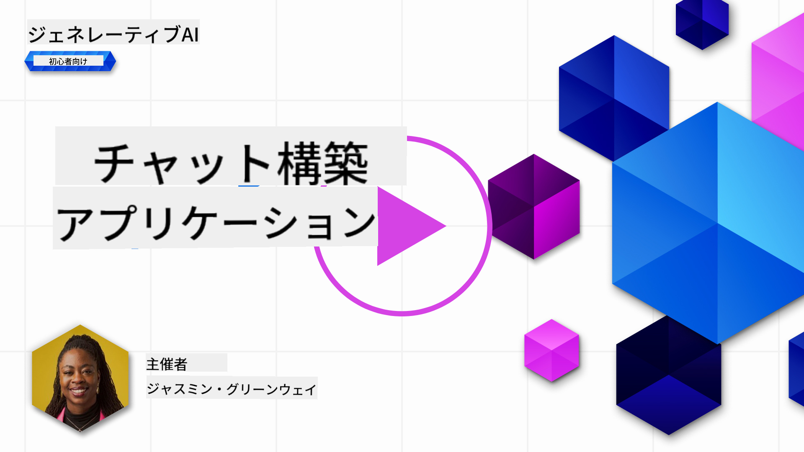
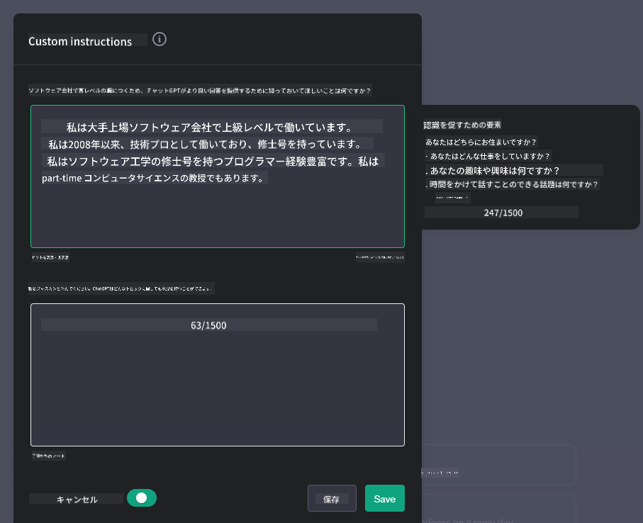
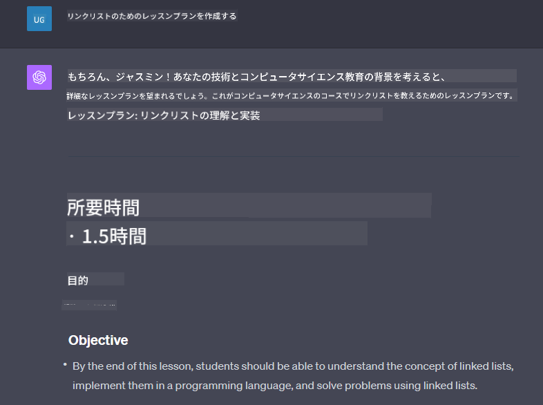

<!--
CO_OP_TRANSLATOR_METADATA:
{
  "original_hash": "ea4bbe640847aafbbba14dae4625e9af",
  "translation_date": "2025-06-25T15:15:20+00:00",
  "source_file": "07-building-chat-applications/README.md",
  "language_code": "ja"
}
-->
# ジェネレーティブAI搭載チャットアプリケーションの構築

[](https://aka.ms/gen-ai-lessons7-gh?WT.mc_id=academic-105485-koreyst)

> _(上の画像をクリックすると、このレッスンのビデオが表示されます)_

テキスト生成アプリの構築方法を見てきたので、次はチャットアプリケーションについて見ていきましょう。

チャットアプリケーションは日常生活に溶け込み、単なるカジュアルな会話手段以上のものを提供しています。顧客サービス、技術サポート、さらには高度なアドバイザリーシステムの重要な部分です。最近、チャットアプリケーションから何かしらのサポートを受けたことがあるかもしれません。これらのプラットフォームにジェネレーティブAIのような高度な技術を統合するにつれて、複雑さと課題が増していきます。

解決すべきいくつかの質問は次のとおりです：

- **アプリの構築**。特定のユースケースに合わせてこれらのAI搭載アプリケーションを効率的に構築し、シームレスに統合するにはどうすればよいでしょうか？
- **モニタリング**。デプロイ後、アプリケーションが機能面と[責任あるAIの6つの原則](https://www.microsoft.com/ai/responsible-ai?WT.mc_id=academic-105485-koreyst)の順守の両方で最高レベルの品質で動作していることをどのように監視し、保証することができるでしょうか？

自動化とシームレスな人間と機械の相互作用が特徴となる時代に移行する中で、ジェネレーティブAIがチャットアプリケーションの範囲、深さ、適応性をどのように変革するかを理解することが重要です。このレッスンでは、これらの複雑なシステムをサポートするアーキテクチャの側面を調査し、ドメイン固有のタスクに微調整するための方法論を掘り下げ、責任あるAIの導入を確保するための指標と考慮事項を評価します。

## はじめに

このレッスンでは次のことをカバーします：

- チャットアプリケーションを効率的に構築し統合するための技術。
- アプリケーションへのカスタマイズと微調整の適用方法。
- チャットアプリケーションを効果的に監視するための戦略と考慮事項。

## 学習目標

このレッスンの終わりには、次のことができるようになります：

- 既存のシステムにチャットアプリケーションを構築し統合する際の考慮事項を説明する。
- 特定のユースケースに合わせてチャットアプリケーションをカスタマイズする。
- AI搭載チャットアプリケーションの品質を効果的に監視し維持するための主要な指標と考慮事項を特定する。
- チャットアプリケーションがAIを責任を持って活用することを確保する。

## ジェネレーティブAIをチャットアプリケーションに統合する

ジェネレーティブAIによってチャットアプリケーションを向上させることは、単にそれらを賢くすることに限りません。アーキテクチャ、パフォーマンス、ユーザーインターフェースを最適化して、質の高いユーザー体験を提供することです。これは、アーキテクチャの基盤、API統合、ユーザーインターフェースの考慮事項を調査することを含みます。このセクションでは、これらの複雑な領域をナビゲートするための包括的なロードマップを提供することを目的としています。既存のシステムに統合する場合でも、独立したプラットフォームとして構築する場合でも、です。

このセクションの終わりまでに、チャットアプリケーションを効率的に構築し組み込むために必要な専門知識を身につけることができます。

### チャットボットまたはチャットアプリケーション？

チャットアプリケーションを構築する前に、「チャットボット」と「AI搭載チャットアプリケーション」を比較して、それぞれが果たす役割と機能の違いを理解しましょう。チャットボットの主な目的は、よくある質問に答える、荷物を追跡するなど、特定の会話タスクを自動化することです。通常、ルールベースのロジックまたは複雑なAIアルゴリズムによって管理されます。それに対して、AI搭載チャットアプリケーションは、テキスト、音声、ビデオチャットなどのさまざまなデジタルコミュニケーションを促進するために設計された、より広範な環境です。その特徴的な機能は、幅広い入力とコンテキストキューに基づいて反応を生成する、ニュアンスのある人間のような会話をシミュレートするジェネレーティブAIモデルの統合です。ジェネレーティブAI搭載チャットアプリケーションは、オープンドメインのディスカッションに参加し、進化する会話のコンテキストに適応し、創造的または複雑な対話を生成することさえできます。

以下の表は、デジタルコミュニケーションにおけるそれぞれのユニークな役割を理解するための重要な違いと類似点を示しています。

| チャットボット                      | ジェネレーティブAI搭載チャットアプリケーション |
| --------------------------------- | ---------------------------------------- |
| タスクに特化しルールベース        | コンテキストを認識                        |
| 大規模なシステムに統合されることが多い | 1つまたは複数のチャットボットをホストすることがある |
| プログラムされた機能に限定        | ジェネレーティブAIモデルを組み込む        |
| 専門的で構造化された対話          | オープンドメインのディスカッションが可能    |

### SDKとAPIを活用して事前構築された機能を利用する

チャットアプリケーションを構築する際、まず最初に既存のものを評価することが重要です。SDKとAPIを活用してチャットアプリケーションを構築することは、多くの理由で有利な戦略です。よく文書化されたSDKとAPIを統合することで、スケーラビリティとメンテナンスの懸念に対応し、アプリケーションを長期的な成功に向けて戦略的に位置付けます。

- **開発プロセスを迅速化し、オーバーヘッドを削減**：自分で構築するのに高価なプロセスを行う代わりに、事前に構築された機能に依存することで、ビジネスロジックなど、より重要と感じるアプリケーションの他の側面に集中できます。
- **より良いパフォーマンス**：機能をゼロから構築する場合、最終的に「どのようにスケールするのか？このアプリケーションは突然のユーザーの増加に対応できるのか？」と自問することになります。よくメンテナンスされたSDKとAPIには、これらの懸念に対する解決策が組み込まれていることがよくあります。
- **メンテナンスが容易**：ほとんどのAPIとSDKは、新しいバージョンがリリースされるとライブラリの更新が必要なだけであるため、更新と改善が容易です。
- **最先端技術へのアクセス**：大規模なデータセットで微調整およびトレーニングされたモデルを活用することで、アプリケーションに自然言語機能を提供します。

SDKまたはAPIの機能にアクセスするには、通常、提供されたサービスを使用する許可を得る必要があり、これは通常、ユニークなキーまたは認証トークンを使用します。OpenAI Pythonライブラリを使用してこれがどのように見えるかを探ります。また、このレッスンのために[OpenAIのノートブック](../../../07-building-chat-applications/python/oai-assignment.ipynb)または[Azure OpenAI Servicesのノートブック](../../../07-building-chat-applications/python/aoai-assignment.ipynb)で試してみることもできます。

```python
import os
from openai import OpenAI

API_KEY = os.getenv("OPENAI_API_KEY","")

client = OpenAI(
    api_key=API_KEY
    )

chat_completion = client.chat.completions.create(model="gpt-3.5-turbo", messages=[{"role": "user", "content": "Suggest two titles for an instructional lesson on chat applications for generative AI."}])
```

上記の例では、GPT-3.5 Turboモデルを使用してプロンプトを完了しますが、APIキーが事前に設定されていることに注意してください。キーを設定しないとエラーが発生します。

## ユーザーエクスペリエンス（UX）

一般的なUXの原則はチャットアプリケーションにも適用されますが、機械学習コンポーネントが関与するため、特に重要となる追加の考慮事項があります。

- **曖昧さに対処するメカニズム**：ジェネレーティブAIモデルは時折曖昧な回答を生成します。この問題に遭遇した場合にユーザーが明確化を求めることができる機能は役立ちます。
- **コンテキスト保持**：高度なジェネレーティブAIモデルは会話内のコンテキストを記憶する能力を持ち、ユーザーエクスペリエンスにとって必要な資産となります。ユーザーにコンテキストを制御および管理する能力を与えることはユーザーエクスペリエンスを向上させますが、機密情報の保持のリスクをもたらします。情報がどのくらいの期間保存されるかを考慮し、保持ポリシーを導入することで、コンテキストの必要性とプライバシーのバランスを取ることができます。
- **パーソナライゼーション**：学習と適応の能力を持つAIモデルは、ユーザーに個別の体験を提供します。ユーザープロファイルのような機能を通じてユーザーエクスペリエンスをカスタマイズすることで、ユーザーが理解されていると感じるだけでなく、特定の回答を見つける追求を助け、より効率的で満足のいく対話を生み出します。

OpenAIのChatGPTの「カスタム指示」設定は、パーソナライゼーションの一例です。プロンプトにとって重要なコンテキストである可能性のある情報を提供することができます。以下はカスタム指示の例です。



この「プロファイル」は、ChatGPTにリンクリストについてのレッスンプランを作成するよう促します。ユーザーの経験に基づいて、より詳細なレッスンプランを望むかもしれないことをChatGPTが考慮していることに注目してください。



### 大規模言語モデル向けのMicrosoftのシステムメッセージフレームワーク

[Microsoftは](https://learn.microsoft.com/azure/ai-services/openai/concepts/system-message#define-the-models-output-format?WT.mc_id=academic-105485-koreyst)、LLMからの応答を生成する際の効果的なシステムメッセージの作成に関するガイダンスを4つの分野に分けて提供しています：

1. モデルが誰のためのものであるか、その能力と制限を定義する。
2. モデルの出力形式を定義する。
3. モデルの意図された動作を示す具体的な例を提供する。
4. 追加の行動ガードレールを提供する。

### アクセシビリティ

ユーザーが視覚、聴覚、運動、または認知の障害を持っているかどうかにかかわらず、よく設計されたチャットアプリケーションはすべての人が使用できるべきです。以下のリストは、さまざまなユーザーの障害に対するアクセシビリティを向上させるための具体的な機能を分解しています。

- **視覚障害者向け機能**：高コントラストテーマとリサイズ可能なテキスト、スクリーンリーダーとの互換性。
- **聴覚障害者向け機能**：テキスト読み上げと音声認識機能、音声通知の視覚的な手がかり。
- **運動障害者向け機能**：キーボードナビゲーションのサポート、音声コマンド。
- **認知障害者向け機能**：簡略化された言語オプション。

## ドメイン固有の言語モデルのカスタマイズと微調整

あなたの会社の専門用語を理解し、ユーザーベースが一般的に持つ特定のクエリを予測するチャットアプリケーションを想像してみてください。考慮すべきアプローチがいくつかあります：

- **DSLモデルの活用**。DSLはドメイン固有言語の略です。特定のドメインでトレーニングされたDSLモデルを活用して、その概念やシナリオを理解することができます。
- **微調整の適用**。微調整は、特定のデータでモデルをさらにトレーニングするプロセスです。

## カスタマイズ：DSLの利用

ドメイン固有の言語モデル（DSLモデル）を活用することで、専門的で文脈に関連する対話を提供し、ユーザーの関与を高めることができます。これは、特定の分野、業界、または主題に関連するテキストを理解し生成するようにトレーニングまたは微調整されたモデルです。DSLモデルの利用オプションは、ゼロからトレーニングすることから、SDKとAPIを通じて既存のものを利用することまでさまざまです。もう一つのオプションは微調整で、既存の事前トレーニング済みモデルを特定のドメインに適応させることです。

## カスタマイズ：微調整の適用

微調整は、事前トレーニング済みモデルが特定のドメインや特定のタスクで不足している場合に考慮されることが多いです。

たとえば、医療のクエリは複雑で多くのコンテキストを必要とします。医療専門家が患者を診断する際には、ライフスタイルや既存の条件などのさまざまな要因に基づいており、診断を検証するために最近の医療ジャーナルに依存することさえあります。このような微妙なシナリオでは、汎用AIチャットアプリケーションは信頼できる情報源にはなり得ません。

### シナリオ：医療アプリケーション

医療従事者を支援するために設計されたチャットアプリケーションを考えてみましょう。治療ガイドライン、薬物相互作用、最近の研究成果への迅速な参照を提供します。

汎用モデルは基本的な医療質問に答えたり、一般的なアドバイスを提供するのに適しているかもしれませんが、次の点で苦労するかもしれません：

- **非常に具体的または複雑なケース**。たとえば、神経科医が「小児患者の薬剤耐性てんかんの管理に関する現在のベストプラクティスは何か？」とアプリケーションに尋ねるかもしれません。
- **最近の進展の欠如**。汎用モデルは、神経学と薬理学の最新の進展を取り入れた現在の回答を提供するのに苦労するかもしれません。

このような場合、特化した医療データセットでモデルを微調整することで、これらの複雑な医療問い合わせに対してより正確で信頼性のある対応を行う能力を大幅に向上させることが

**免責事項**:  
このドキュメントは、AI翻訳サービス[Co-op Translator](https://github.com/Azure/co-op-translator)を使用して翻訳されています。正確性を期すよう努めていますが、自動翻訳には誤りや不正確さが含まれる場合があります。原文はその言語での権威ある情報源と見なされるべきです。重要な情報については、専門の人間による翻訳をお勧めします。この翻訳の使用から生じる誤解や誤った解釈について、当社は責任を負いません。