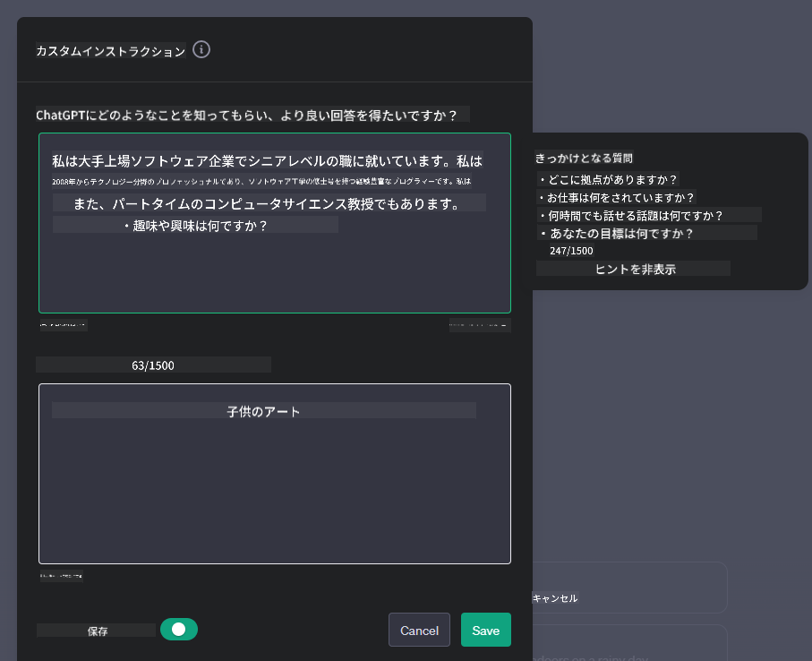

<!--
CO_OP_TRANSLATOR_METADATA:
{
  "original_hash": "ea4bbe640847aafbbba14dae4625e9af",
  "translation_date": "2025-07-09T12:20:13+00:00",
  "source_file": "07-building-chat-applications/README.md",
  "language_code": "ja"
}
-->
# ジェネレーティブAI搭載チャットアプリケーションの構築

[](https://aka.ms/gen-ai-lessons7-gh?WT.mc_id=academic-105485-koreyst)

> _(上の画像をクリックすると、このレッスンの動画がご覧いただけます)_

テキスト生成アプリの作り方を見てきたので、次はチャットアプリケーションについて見ていきましょう。

チャットアプリは日常生活に深く浸透し、単なる気軽な会話の手段以上の役割を果たしています。カスタマーサービスや技術サポート、さらには高度なアドバイザリーシステムの重要な一部となっています。最近、チャットアプリから助けを得た経験があるかもしれません。こうしたプラットフォームにジェネレーティブAIのような先進技術を組み込むことで、複雑さが増し、それに伴う課題も大きくなっています。

ここで答えるべき主な問いは次の通りです：

- **アプリの構築**：特定のユースケースに対して、AI搭載アプリを効率的に構築し、シームレスに統合するにはどうすればよいか？
- **モニタリング**：展開後、機能面だけでなく[責任あるAIの6原則](https://www.microsoft.com/ai/responsible-ai?WT.mc_id=academic-105485-koreyst)に準拠しながら、最高の品質で動作しているかどうかをどう監視するか？

自動化と人間と機械のシームレスな対話が進む時代において、ジェネレーティブAIがチャットアプリの範囲、深さ、適応性をどのように変革するかを理解することが不可欠です。本レッスンでは、これら複雑なシステムを支えるアーキテクチャの側面を探り、ドメイン固有のタスクに合わせたファインチューニングの手法を学び、責任あるAI展開に必要な指標や考慮点を評価します。

## はじめに

このレッスンで扱う内容：

- チャットアプリを効率的に構築・統合する技術
- アプリケーションへのカスタマイズとファインチューニングの適用方法
- チャットアプリを効果的に監視するための戦略と考慮点

## 学習目標

このレッスンを終える頃には、以下ができるようになります：

- チャットアプリを既存システムに構築・統合する際の考慮点を説明できる
- 特定のユースケースに合わせてチャットアプリをカスタマイズできる
- AI搭載チャットアプリの品質を効果的に監視・維持するための主要な指標や考慮点を特定できる
- チャットアプリが責任あるAIを活用していることを保証できる

## ジェネレーティブAIをチャットアプリに統合する

チャットアプリをジェネレーティブAIで強化することは、単に賢くするだけでなく、アーキテクチャ、パフォーマンス、ユーザーインターフェースを最適化し、質の高いユーザー体験を提供することにあります。これにはアーキテクチャの基盤、API統合、UIの考慮が含まれます。このセクションでは、既存システムに組み込む場合でも、単独のプラットフォームとして構築する場合でも、複雑な領域をナビゲートするための包括的なロードマップを提供します。

このセクションを終える頃には、チャットアプリを効率的に構築・統合するための専門知識が身につきます。

### チャットボットとチャットアプリケーションの違い

チャットアプリの構築に入る前に、「チャットボット」と「AI搭載チャットアプリケーション」の違いを比較してみましょう。両者は役割や機能が異なります。チャットボットは、よくある質問への回答や荷物追跡など、特定の会話タスクを自動化することが主な目的です。通常はルールベースのロジックや複雑なAIアルゴリズムで制御されます。一方、AI搭載チャットアプリは、テキスト、音声、ビデオチャットなど、人間同士の多様なデジタルコミュニケーションを促進するためのより広範な環境です。特徴は、ジェネレーティブAIモデルを統合し、多様な入力や文脈に基づいて人間らしい会話をシミュレートし、応答を生成することにあります。ジェネレーティブAI搭載チャットアプリは、オープンドメインの対話に対応し、会話の文脈に適応し、創造的または複雑な対話も可能です。

以下の表は、それぞれの特徴と共通点を示し、デジタルコミュニケーションにおける役割の違いを理解する助けとなります。

| チャットボット                         | ジェネレーティブAI搭載チャットアプリケーション           |
| ------------------------------------- | -------------------------------------- |
| タスク指向でルールベース               | 文脈を理解する                           |
| 大規模システムに組み込まれることが多い | 1つまたは複数のチャットボットをホスト可能               |
| プログラムされた機能に限定される       | ジェネレーティブAIモデルを組み込む                       |
| 専門的かつ構造化された対話             | オープンドメインの対話が可能                             |

### SDKやAPIを活用した既存機能の利用

チャットアプリを構築する際、まず既存のものを評価することが重要です。SDKやAPIを使ってチャットアプリを作るのは、多くの理由で有利な戦略です。よくドキュメント化されたSDKやAPIを統合することで、スケーラビリティやメンテナンスの課題に対応しつつ、長期的な成功を見据えたアプリケーション設計が可能になります。

- **開発プロセスの迅速化と負担軽減**：自分で一から機能を作る高コストな作業を避け、ビジネスロジックなど他の重要な部分に集中できる。
- **パフォーマンスの向上**：自作機能のスケール対応に悩む代わりに、よく管理されたSDKやAPIはスケーラビリティの問題に対処済みの場合が多い。
- **メンテナンスの容易さ**：新バージョンが出た際はライブラリの更新だけで済むことが多く、改善やアップデートが簡単。
- **最先端技術へのアクセス**：大規模データセットでファインチューニングされたモデルを活用でき、自然言語処理能力をアプリに付与できる。

SDKやAPIの機能を利用するには、通常はユニークなキーや認証トークンを使ってサービス利用の許可を得る必要があります。ここではOpenAI Pythonライブラリを使ってその例を見ていきます。以下の[OpenAI用ノートブック](../../../07-building-chat-applications/python/oai-assignment.ipynb)や[Azure OpenAIサービス用ノートブック](../../../07-building-chat-applications/python/aoai-assignment.ipynb)でも試せます。

```python
import os
from openai import OpenAI

API_KEY = os.getenv("OPENAI_API_KEY","")

client = OpenAI(
    api_key=API_KEY
    )

chat_completion = client.chat.completions.create(model="gpt-3.5-turbo", messages=[{"role": "user", "content": "Suggest two titles for an instructional lesson on chat applications for generative AI."}])
```

上記の例ではGPT-3.5 Turboモデルを使ってプロンプトを完了していますが、APIキーが事前に設定されていることに注意してください。キーを設定しないとエラーになります。

## ユーザーエクスペリエンス（UX）

一般的なUXの原則はチャットアプリにも当てはまりますが、機械学習コンポーネントが関わるため、特に重要になる追加の考慮点があります。

- **曖昧さへの対応機能**：ジェネレーティブAIモデルは時折曖昧な回答を生成します。ユーザーが説明を求められる機能があると便利です。
- **文脈の保持**：高度なジェネレーティブAIモデルは会話の文脈を記憶できます。文脈管理をユーザーに任せることで体験が向上しますが、個人情報の保持リスクも伴います。情報の保存期間を定めるポリシーなど、プライバシーと文脈保持のバランスを考慮しましょう。
- **パーソナライズ**：学習・適応能力により、ユーザーごとに個別化された体験を提供できます。ユーザープロファイルなどの機能で体験をカスタマイズすると、ユーザーは理解されていると感じ、効率的で満足度の高い対話が可能になります。

パーソナライズの一例がOpenAIのChatGPTにある「Custom instructions」設定です。ここで自分に関する情報を入力すると、プロンプトの重要な文脈として活用されます。以下はカスタム指示の例です。



この「プロフィール」はChatGPTにリンクリストのレッスンプランを作成させています。ユーザーの経験に基づき、より深い内容のレッスンプランを求めていることを考慮している点に注目してください。


### Microsoftの大規模言語モデル向けシステムメッセージフレームワーク

[MicrosoftはLLMからの応答生成における効果的なシステムメッセージ作成のガイドライン](https://learn.microsoft.com/azure/ai-services/openai/concepts/system-message#define-the-models-output-format?WT.mc_id=academic-105485-koreyst)を4つの領域に分けて提供しています：

1. モデルの対象ユーザー、能力、制限の定義
2. モデルの出力フォーマットの定義
3. モデルの意図した動作を示す具体例の提示
4. 追加の行動ガードレールの提供

### アクセシビリティ

視覚、聴覚、運動、認知に障害があるユーザーでも使いやすいチャットアプリを設計することが重要です。以下は各種障害に対応するための具体的な機能例です。

- **視覚障害向け機能**：高コントラストテーマ、テキストサイズ変更、スクリーンリーダー対応
- **聴覚障害向け機能**：テキスト読み上げ・音声入力機能、音声通知の視覚的表示
- **運動障害向け機能**：キーボード操作サポート、音声コマンド
- **認知障害向け機能**：簡易言語オプション

## ドメイン固有言語モデルのカスタマイズとファインチューニング

自社の専門用語を理解し、ユーザーがよくする質問を予測できるチャットアプリを想像してみてください。ここではいくつかのアプローチを紹介します：

- **DSLモデルの活用**：DSLはドメイン固有言語の略で、特定の分野に特化して訓練されたモデルを活用し、その分野の概念やシナリオを理解させる方法です。
- **ファインチューニングの適用**：特定のデータでモデルを追加学習させ、性能を向上させるプロセスです。

## カスタマイズ：DSLの利用

ドメイン固有言語モデル（DSLモデル）を活用すると、専門的で文脈に即した対話を提供し、ユーザーの関与を高められます。これは特定の分野や業界、テーマに関連するテキストを理解・生成するよう訓練またはファインチューニングされたモデルです。DSLモデルの利用方法は、ゼロから訓練する方法から、SDKやAPIを通じて既存のモデルを使う方法まで様々です。もう一つの選択肢は、既存の事前学習済みモデルを特定ドメイン向けにファインチューニングすることです。

## カスタマイズ：ファインチューニングの適用

ファインチューニングは、事前学習済みモデルが専門分野や特定タスクで十分な性能を発揮しない場合に検討されます。

例えば医療分野の質問は複雑で多くの文脈を必要とします。医師が患者を診断する際は、生活習慣や既往症、最新の医学論文など多様な要素を考慮します。こうした繊細な状況では、汎用AIチャットアプリは信頼できる情報源とは言えません。

### シナリオ：医療アプリケーション

医療従事者を支援し、治療ガイドラインや薬物相互作用、最新の研究成果を迅速に参照できるチャットアプリを考えてみましょう。

汎用モデルは基本的な医療質問や一般的なアドバイスには対応できますが、以下のような場合は苦戦するかもしれません：

- **高度に専門的・複雑なケース**：例えば神経科医が「小児の薬剤抵抗性てんかん管理の最新のベストプラクティスは？」と尋ねる場合
- **最新の進展を反映できない場合**：汎用モデルは神経学や薬理学の最新の進歩を取り入れた回答が難しいことがあります

こうした場合、専門的な医療データセットでモデルをファインチューニングすることで、複雑な医療質問に対する正確かつ信頼性の高い対応力が大幅に向上します。これには、ドメイン固有の課題や質問を代表する大規模かつ関連性の高いデータセットへのアクセスが必要です。

## 高品質なAI駆動チャット体験のための考慮点

このセクションでは、「高品質」なチャットアプリの基準を示し、実用的な指標の取得と責任あるAI技術の活用フレームワークの遵守を含みます。

### 主要指標

アプリの高品質なパフォーマンスを維持するには、主要な指標や考慮点を継続的に追跡することが不可欠です。これらの指標はアプリの機能性だけでなく、AIモデルやユーザー体験の質を評価します。以下は基本的な指標、AI関連指標、UX指標の一覧です。

| 指標                          | 定義                                                                                                               | チャット開発者への考慮点                                               |
| ----------------------------- | ------------------------------------------------------------------------------------------------------------------ | --------------------------------------------------------------------- |
| **稼働時間（Uptime）**         | アプリケーションが稼働し、ユーザーがアクセス可能な時間の割合                                                       | ダウンタイムをどう最小化するか？                                       |
| **応答時間（Response Time）** | ユーザーの問い合わせに対してアプリが応答するまでの時間                                                             | クエリ処理をどう最適化して応答時間を短縮するか？                       |
| **適合率（Precision）**       | 正と予測されたうち、実際に正であった割合                                                                             | モデルの適合率をどう検証するか？                                       |
| **再現率（Recall）**           | 実際に正であるもののうち、正と予測された割合                                                                         | 再現率をどう測定し、改善するか？                                       |
| **F1スコア**                  | 適合率と再現率の調和平均で、両者のバランスを評価                                                                   | 目標とするF1スコアは？適合率と再現率のバランスをどう取るか？           |
| **パープレキシティ（Perplexity）** | モデルが予測する確率分布が実際のデータ分布にどれだけ合っているかを測る指標                                         | パープレキシティをどう最小化するか？                                   |
| **ユーザー満足度指標**         | ユーザーのアプリに
| **異常検知**               | 期待される動作に合わない異常なパターンを特定するためのツールと技術。                                      | 異常にどのように対応しますか？                                              |

### チャットアプリケーションにおける責任あるAIの実践

Microsoftの責任あるAIへの取り組みでは、AIの開発と利用を導くべき6つの原則を定めています。以下に原則、その定義、チャット開発者が考慮すべき点と、それを真剣に受け止める理由を示します。

| 原則                   | Microsoftの定義                                      | チャット開発者が考慮すべき点                                         | なぜ重要なのか                                                                       |
| ---------------------- | --------------------------------------------------- | ------------------------------------------------------------------- | ------------------------------------------------------------------------------------ |
| 公平性                 | AIシステムはすべての人を公平に扱うべきである。       | チャットアプリがユーザーデータに基づいて差別しないようにする。       | ユーザー間の信頼と包摂性を築き、法的問題を回避するため。                           |
| 信頼性と安全性         | AIシステムは信頼性が高く安全に動作すべきである。     | エラーやリスクを最小限に抑えるためのテストとフェイルセーフを実装する。 | ユーザー満足度を確保し、潜在的な危害を防ぐため。                                   |
| プライバシーとセキュリティ | AIシステムは安全でプライバシーを尊重すべきである。   | 強力な暗号化とデータ保護対策を実施する。                             | 敏感なユーザーデータを守り、プライバシー法に準拠するため。                         |
| 包摂性                   | AIシステムはすべての人を支援し、関与させるべきである。 | 多様なユーザーが使いやすいUI/UXを設計する。                         | より多くの人が効果的にアプリを利用できるようにするため。                           |
| 透明性                   | AIシステムは理解可能であるべきである。               | AIの応答に関する明確なドキュメントと説明を提供する。                 | ユーザーは意思決定の仕組みが理解できれば、システムをより信頼しやすくなる。         |
| 責任                     | AIシステムに対して人が責任を持つべきである。         | AIの判断を監査し改善するための明確なプロセスを確立する。             | 継続的な改善と誤りがあった場合の是正措置を可能にするため。                         |

## 課題

[assignment](../../../07-building-chat-applications/python) をご覧ください。最初のチャットプロンプトの実行から、テキストの分類や要約など一連の演習を体験できます。課題は複数のプログラミング言語で利用可能なことにご注意ください！

## 素晴らしい！学びを続けましょう

このレッスンを終えたら、[Generative AI Learning collection](https://aka.ms/genai-collection?WT.mc_id=academic-105485-koreyst) をチェックして、生成AIの知識をさらに深めましょう！

レッスン8では、[検索アプリケーションの構築](../08-building-search-applications/README.md?WT.mc_id=academic-105485-koreyst)を始める方法をご紹介しています！

**免責事項**：  
本書類はAI翻訳サービス「[Co-op Translator](https://github.com/Azure/co-op-translator)」を使用して翻訳されました。正確性の向上に努めておりますが、自動翻訳には誤りや不正確な部分が含まれる可能性があります。原文の言語によるオリジナル文書が正式な情報源とみなされるべきです。重要な情報については、専門の人間による翻訳を推奨します。本翻訳の利用により生じたいかなる誤解や誤訳についても、当方は責任を負いかねます。