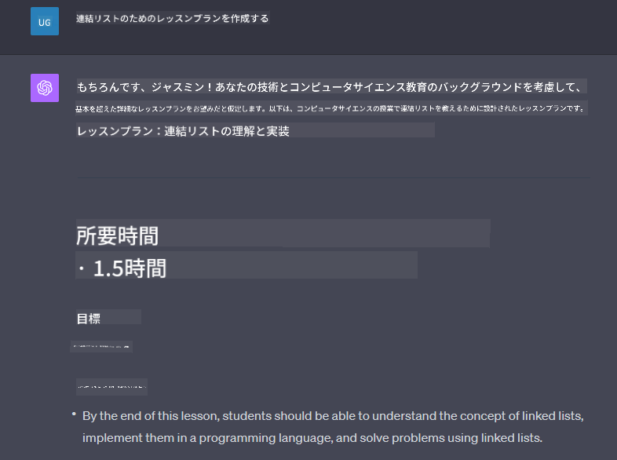

<!--
CO_OP_TRANSLATOR_METADATA:
{
  "original_hash": "a5308963a56cfbad2d73b0fa99fe84b3",
  "translation_date": "2025-10-17T23:55:32+00:00",
  "source_file": "07-building-chat-applications/README.md",
  "language_code": "ja"
}
-->
# ジェネレーティブAIを活用したチャットアプリケーションの構築

[](https://youtu.be/R9V0ZY1BEQo?si=IHuU-fS9YWT8s4sA)

> _(上の画像をクリックして、このレッスンの動画をご覧ください)_

テキスト生成アプリの構築方法を学んだところで、次はチャットアプリケーションについて見ていきましょう。

チャットアプリケーションは日常生活に欠かせない存在となり、単なるカジュアルな会話の手段を超えた役割を果たしています。これらは顧客サービス、技術サポート、さらには高度なアドバイザリーシステムの重要な部分です。最近、チャットアプリケーションから何らかの助けを得たことがあるかもしれません。ジェネレーティブAIのような高度な技術をこれらのプラットフォームに統合するにつれて、複雑さが増し、それに伴い課題も増加します。

解決すべきいくつかの質問は以下の通りです：

- **アプリの構築**。これらのAIを活用したアプリケーションを特定のユースケースに効率的に構築し、シームレスに統合するにはどうすればよいか？
- **モニタリング**。展開後、アプリケーションが機能性や[責任あるAIの6つの原則](https://www.microsoft.com/ai/responsible-ai?WT.mc_id=academic-105485-koreyst)に準拠して最高品質で動作していることをどのように監視し、保証するか？

自動化と人間と機械のシームレスな相互作用が特徴となる時代が進むにつれて、ジェネレーティブAIがチャットアプリケーションの範囲、深さ、適応性をどのように変革するかを理解することが重要になります。このレッスンでは、これらの複雑なシステムを支えるアーキテクチャの側面を調査し、ドメイン固有のタスクに合わせて微調整する方法論を掘り下げ、責任あるAIの展開を保証するための指標と考慮事項を評価します。

## はじめに

このレッスンでは以下を取り上げます：

- チャットアプリケーションを効率的に構築し統合するための技術。
- アプリケーションにカスタマイズと微調整を適用する方法。
- チャットアプリケーションを効果的に監視するための戦略と考慮事項。

## 学習目標

このレッスンの終わりまでに、以下ができるようになります：

- チャットアプリケーションを既存のシステムに統合する際の考慮事項を説明する。
- 特定のユースケースに合わせてチャットアプリケーションをカスタマイズする。
- AIを活用したチャットアプリケーションの品質を効果的に監視・維持するための主要な指標と考慮事項を特定する。
- チャットアプリケーションが責任あるAIを活用することを保証する。

## ジェネレーティブAIをチャットアプリケーションに統合する

ジェネレーティブAIを活用してチャットアプリケーションを向上させることは、単に賢くすることだけではありません。アーキテクチャ、パフォーマンス、ユーザーインターフェースを最適化して、質の高いユーザー体験を提供することが重要です。これには、アーキテクチャの基盤、API統合、ユーザーインターフェースの考慮事項を調査することが含まれます。このセクションでは、既存のシステムに統合する場合でも、スタンドアロンのプラットフォームとして構築する場合でも、これらの複雑な領域をナビゲートするための包括的なロードマップを提供することを目指します。

このセクションの終わりまでに、チャットアプリケーションを効率的に構築し、統合するために必要な専門知識を身につけることができます。

### チャットボットとチャットアプリケーションの違い

チャットアプリケーションを構築する前に、「チャットボット」と「AIを活用したチャットアプリケーション」を比較して、それぞれの役割と機能の違いを理解しましょう。チャットボットの主な目的は、よくある質問に答えたり、荷物の追跡をしたりするなど、特定の会話タスクを自動化することです。通常、ルールベースのロジックや複雑なAIアルゴリズムによって制御されています。一方、AIを活用したチャットアプリケーションは、テキスト、音声、ビデオチャットなど、さまざまな形式のデジタルコミュニケーションを促進するために設計された、より広範な環境です。その特徴は、ジェネレーティブAIモデルを統合し、幅広い入力や文脈的な手がかりに基づいて人間のような会話をシミュレートし、応答を生成することです。ジェネレーティブAIを活用したチャットアプリケーションは、オープンドメインの議論に参加し、進化する会話の文脈に適応し、創造的または複雑な対話を生成することができます。

以下の表は、デジタルコミュニケーションにおけるそれぞれの役割を理解するための主な違いと類似点を示しています。

| チャットボット                        | ジェネレーティブAIを活用したチャットアプリケーション |
| ------------------------------------- | -------------------------------------- |
| タスクに特化し、ルールベース          | 文脈を理解する                         |
| より大きなシステムに統合されることが多い | 1つまたは複数のチャットボットをホストする可能性 |
| プログラムされた機能に限定される       | ジェネレーティブAIモデルを統合         |
| 特化した構造化された対話              | オープンドメインの議論が可能           |

### SDKとAPIを活用した既存機能の利用

チャットアプリケーションを構築する際の最初のステップとして、既存のリソースを評価することが重要です。SDKやAPIを活用してチャットアプリケーションを構築することは、さまざまな理由で有利な戦略です。よく文書化されたSDKやAPIを統合することで、スケーラビリティやメンテナンスの懸念に対応しながら、アプリケーションを長期的な成功に向けて戦略的に位置付けることができます。

- **開発プロセスを迅速化し、オーバーヘッドを削減**：既存の機能を利用することで、ビジネスロジックなど、アプリケーションの他の重要な側面に集中することができます。
- **パフォーマンスの向上**：機能をゼロから構築する場合、最終的に「スケールするか？突然のユーザー増加に対応できるか？」という疑問が生じます。よく管理されたSDKやAPIには、これらの懸念に対する解決策が組み込まれていることが多いです。
- **メンテナンスが容易**：ほとんどのAPIやSDKは、新しいバージョンがリリースされた際にライブラリを更新するだけで、更新や改善が容易です。
- **最先端技術へのアクセス**：広範なデータセットで微調整され、トレーニングされたモデルを活用することで、自然言語機能をアプリケーションに提供できます。

SDKやAPIの機能にアクセスするには、通常、提供されるサービスを使用する許可を取得する必要があり、これは通常、ユニークなキーや認証トークンを使用して行われます。OpenAI Pythonライブラリを使用してその例を見てみましょう。このレッスンの[OpenAI用ノートブック](./python/oai-assignment.ipynb?WT.mc_id=academic-105485-koreyst)または[Azure OpenAI Services用ノートブック](./python/aoai-assignment.ipynb?WT.mc_id=academic-105485-koreys)で試してみることもできます。

```python
import os
from openai import OpenAI

API_KEY = os.getenv("OPENAI_API_KEY","")

client = OpenAI(
    api_key=API_KEY
    )

chat_completion = client.chat.completions.create(model="gpt-3.5-turbo", messages=[{"role": "user", "content": "Suggest two titles for an instructional lesson on chat applications for generative AI."}])
```

上記の例では、GPT-3.5 Turboモデルを使用してプロンプトを完了していますが、APIキーが事前に設定されていることに注意してください。キーを設定しないとエラーが発生します。

## ユーザーエクスペリエンス (UX)

一般的なUXの原則はチャットアプリケーションにも適用されますが、機械学習コンポーネントが関与するため、特に重要となる追加の考慮事項があります。

- **曖昧さに対処する仕組み**：ジェネレーティブAIモデルは時折曖昧な回答を生成することがあります。この問題に直面した場合、ユーザーが明確化を求める機能が役立ちます。
- **文脈の保持**：高度なジェネレーティブAIモデルは会話の文脈を記憶する能力を持っており、ユーザーエクスペリエンスにとって必要な資産となる可能性があります。ユーザーが文脈を管理する能力を持つことはエクスペリエンスを向上させますが、敏感なユーザー情報を保持するリスクを伴います。この情報がどのくらいの期間保存されるかを考慮し、保持ポリシーを導入することで、文脈の必要性とプライバシーのバランスを取ることができます。
- **パーソナライズ**：学習と適応の能力を持つAIモデルは、ユーザーに個別化された体験を提供します。ユーザープロファイルなどの機能を通じてユーザーエクスペリエンスを調整することで、ユーザーが理解されていると感じるだけでなく、特定の回答を見つける追求を助け、より効率的で満足のいく対話を生み出します。

OpenAIのChatGPTにおける「カスタム指示」設定は、プロンプトに重要な文脈となる情報を提供することができます。以下はカスタム指示の例です。


この「プロファイル」は、ChatGPTにリンクリストに関するレッスンプランを作成するよう促します。ChatGPTは、ユーザーの経験に基づいてより詳細なレッスンプランを求めている可能性を考慮しています。



### Microsoftの大規模言語モデル向けシステムメッセージフレームワーク

[Microsoftはガイダンスを提供しています](https://learn.microsoft.com/azure/ai-services/openai/concepts/system-message#define-the-models-output-format?WT.mc_id=academic-105485-koreyst)。LLMからの応答を生成する際に効果的なシステムメッセージを書くための4つの領域に分けられています：

1. モデルが誰のためのものか、その能力と制限を定義する。
2. モデルの出力形式を定義する。
3. モデルの意図した動作を示す具体的な例を提供する。
4. 追加の行動ガードレールを提供する。

### アクセシビリティ

ユーザーが視覚、聴覚、運動、または認知障害を持っているかどうかにかかわらず、よく設計されたチャットアプリケーションはすべての人が利用できるべきです。以下のリストは、さまざまなユーザーの障害に対応するアクセシビリティを向上させるための具体的な機能を示しています。

- **視覚障害者向けの機能**：高コントラストテーマとテキストのサイズ変更、スクリーンリーダーとの互換性。
- **聴覚障害者向けの機能**：テキスト読み上げと音声認識機能、音声通知の視覚的なキュー。
- **運動障害者向けの機能**：キーボードナビゲーションのサポート、音声コマンド。
- **認知障害者向けの機能**：簡易言語オプション。

## ドメイン固有の言語モデルのカスタマイズと微調整

あなたの会社の専門用語を理解し、ユーザー層がよく持つ特定の質問を予測するチャットアプリケーションを想像してください。ここで言及する価値のあるアプローチがいくつかあります：

- **DSLモデルの活用**。DSLはドメイン固有言語を指します。特定のドメインでの概念やシナリオを理解するためにトレーニングされたDSLモデルを活用することができます。
- **微調整の適用**。微調整は、特定のデータでモデルをさらにトレーニングするプロセスです。

## カスタマイズ：DSLの活用

ドメイン固有言語モデル（DSLモデル）を活用することで、専門的で文脈に即した対話を提供し、ユーザーエンゲージメントを向上させることができます。これは、特定の分野、業界、またはテーマに関連するテキストを理解し生成するようにトレーニングされたモデルです。DSLモデルを使用するオプションは、ゼロからトレーニングすることから、SDKやAPIを通じて既存のものを使用することまでさまざまです。もう一つのオプションは微調整で、既存の事前トレーニング済みモデルを特定のドメインに適応させることです。

## カスタマイズ：微調整の適用

事前トレーニング済みモデルが特定のドメインやタスクで不足している場合、微調整が検討されます。

例えば、医療に関する質問は複雑で多くの文脈を必要とします。医療専門家が患者を診断する際には、ライフスタイルや既往症などのさまざまな要因に基づいており、最近の医学雑誌を参照して診断を検証することもあります。このような微妙なシナリオでは、汎用AIチャットアプリケーションは信頼できる情報源にはなり得ません。

### シナリオ：医療アプリケーション

医療従事者が治療ガイドライン、薬物相互作用、または最近の研究結果を迅速に参照するためのチャットアプリケーションを設計することを考えてみましょう。

汎用モデルは基本的な医療質問に答えたり、一般的なアドバイスを提供するには十分かもしれませんが、以下の点で苦労する可能性があります：

- **非常に特定または複雑なケース**。例えば、神経科医が「小児患者における薬剤耐性てんかんの管理における現在のベストプラクティスは何ですか？」と尋ねる場合。
- **最近の進展の欠如**。汎用モデルは、神経学や薬理学における最新の進展を取り入れた現在の回答を提供するのに苦労する可能性があります。

このような場合、専門的な医療データセットでモデルを微調整することで、これらの複雑な医療質問に対処する能力を大幅に向上させることができます。これには、ドメイン固有の課題や質問を表す大規模で関連性のあるデータセットへのアクセスが必要です。

## 高品質なAI駆動型チャット体験のための考慮事項

このセクションでは、「高品質」なチャットアプリケーションの基準を概説します。これには、実用的な指標の収集とAI技術を責任を持って活用するためのフレームワークの遵守が含まれます。

### 主要指標

アプリケーションの高品質なパフォーマンス
| **異常検知**                 | 期待される行動に一致しない異常なパターンを特定するためのツールと技術。                        | 異常にどのように対応しますか？                                        |

### チャットアプリケーションにおける責任あるAIの実践

Microsoftの責任あるAIへの取り組みでは、AIの開発と利用を導くべき6つの原則が特定されています。以下にその原則、定義、チャット開発者が考慮すべき点、そしてそれを真剣に受け止めるべき理由を示します。

| 原則                     | Microsoftの定義                                      | チャット開発者が考慮すべき点                                      | 重要性                                                                                 |
| ------------------------ | --------------------------------------------------- | ---------------------------------------------------------------- | -------------------------------------------------------------------------------------- |
| 公平性                   | AIシステムはすべての人々を公平に扱うべきです。         | チャットアプリケーションがユーザーデータに基づいて差別しないことを確認する。 | ユーザー間の信頼と包括性を構築するため。法的な問題を回避するため。                     |
| 信頼性と安全性           | AIシステムは信頼性があり安全に動作するべきです。       | エラーやリスクを最小限に抑えるためのテストとフェイルセーフを実装する。 | ユーザー満足度を確保し、潜在的な害を防ぐため。                                         |
| プライバシーとセキュリティ | AIシステムは安全であり、プライバシーを尊重するべきです。 | 強力な暗号化とデータ保護対策を実施する。                          | 敏感なユーザーデータを保護し、プライバシー法を遵守するため。                           |
| 包括性                   | AIシステムはすべての人々を支援し、関与させるべきです。 | 多様なユーザーが効果的にアプリケーションを利用できるよう、UI/UXを設計する。 | より広範な人々がアプリケーションを利用できるようにするため。                           |
| 透明性                   | AIシステムは理解可能であるべきです。                   | AIの応答に関する明確なドキュメントと理由を提供する。              | ユーザーが意思決定の仕組みを理解できると、システムへの信頼が高まるため。               |
| 責任                     | AIシステムに対して人々が責任を持つべきです。           | AIの意思決定を監査し改善するための明確なプロセスを確立する。      | 間違いがあった場合に継続的な改善と是正措置を可能にするため。                           |

## 課題

[課題](../../../07-building-chat-applications/python)を確認してください。この課題では、最初のチャットプロンプトの実行から、テキストの分類や要約などの一連の演習を行います。課題はさまざまなプログラミング言語で利用可能です！

## 素晴らしい仕事です！次のステップへ進みましょう

このレッスンを完了した後は、[生成AI学習コレクション](https://aka.ms/genai-collection?WT.mc_id=academic-105485-koreyst)をチェックして、生成AIの知識をさらに深めてください！

Lesson 8に進んで、[検索アプリケーションの構築](../08-building-search-applications/README.md?WT.mc_id=academic-105485-koreyst)を始めましょう！

---

**免責事項**:  
この文書はAI翻訳サービス[Co-op Translator](https://github.com/Azure/co-op-translator)を使用して翻訳されています。正確性を追求していますが、自動翻訳には誤りや不正確な部分が含まれる可能性があります。元の言語で記載された文書を正式な情報源としてお考えください。重要な情報については、専門の人間による翻訳を推奨します。この翻訳の使用に起因する誤解や誤解について、当社は責任を負いません。