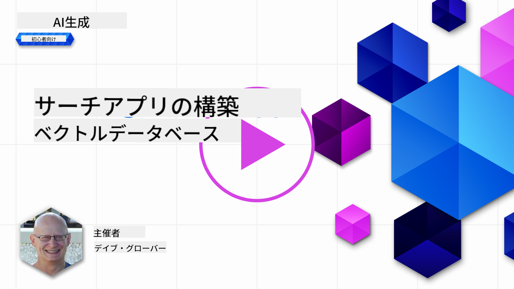
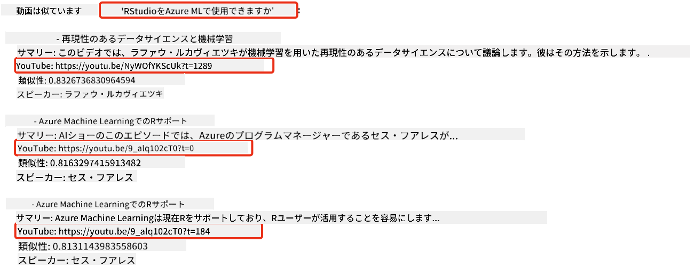
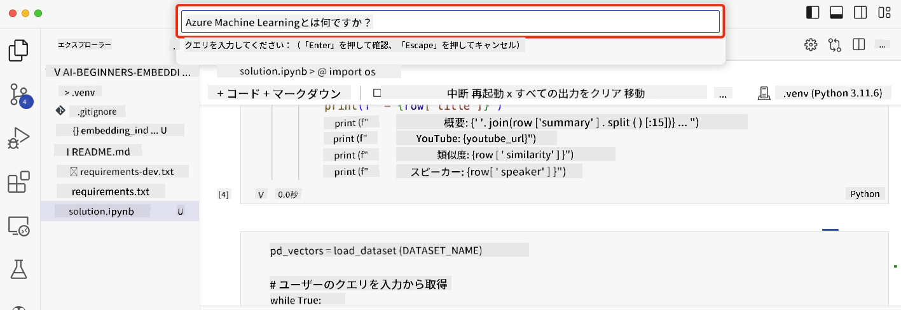

<!--
CO_OP_TRANSLATOR_METADATA:
{
  "original_hash": "d46aad0917a1a342d613e2c13d457da5",
  "translation_date": "2025-05-19T10:22:22+00:00",
  "source_file": "08-building-search-applications/README.md",
  "language_code": "ja"
}
-->
# 検索アプリケーションの構築

[](https://aka.ms/gen-ai-lesson8-gh?WT.mc_id=academic-105485-koreyst)

> > _上の画像をクリックしてこのレッスンのビデオを視聴してください_

LLMはチャットボットやテキスト生成だけではありません。埋め込みを使用して検索アプリケーションを構築することも可能です。埋め込みはデータの数値表現であり、ベクトルとも呼ばれ、データの意味検索に使用できます。

このレッスンでは、私たちの教育スタートアップのために検索アプリケーションを構築します。私たちのスタートアップは、発展途上国の学生に無料で教育を提供する非営利団体です。私たちのスタートアップは、学生がAIについて学ぶために利用できる多数のYouTube動画を持っています。私たちのスタートアップは、学生が質問を入力してYouTube動画を検索できる検索アプリケーションを構築したいと考えています。

例えば、学生が「Jupyter Notebookとは何ですか？」や「Azure MLとは何ですか？」と入力すると、検索アプリケーションはその質問に関連するYouTube動画のリストを返し、さらに質問の答えがある動画の場所へのリンクも返します。

## はじめに

このレッスンでは以下の内容を取り扱います：

- 意味検索とキーワード検索の違い
- テキスト埋め込みとは何か
- テキスト埋め込みインデックスの作成
- テキスト埋め込みインデックスの検索

## 学習目標

このレッスンを完了すると、以下ができるようになります：

- 意味検索とキーワード検索の違いを説明する
- テキスト埋め込みとは何かを説明する
- 埋め込みを使用してデータを検索するアプリケーションを作成する

## なぜ検索アプリケーションを構築するのか？

検索アプリケーションを作成することで、埋め込みを使用してデータを検索する方法を理解するのに役立ちます。また、学生が情報を迅速に見つけるために使用できる検索アプリケーションを構築する方法も学びます。

このレッスンには、Microsoft [AI Show](https://www.youtube.com/playlist?list=PLlrxD0HtieHi0mwteKBOfEeOYf0LJU4O1) YouTubeチャンネルのYouTubeトランスクリプトの埋め込みインデックスが含まれています。AI ShowはAIと機械学習について教えるYouTubeチャンネルです。埋め込みインデックスには2023年10月までの各YouTubeトランスクリプトの埋め込みが含まれています。埋め込みインデックスを使用して、私たちのスタートアップのために検索アプリケーションを構築します。検索アプリケーションは質問の答えがある動画の場所へのリンクを返します。これは学生が必要な情報を迅速に見つけるのに非常に役立ちます。

以下は「Azure MLでrstudioを使用できますか？」という質問に対する意味検索の例です。YouTubeのURLを確認すると、質問の答えがある動画の場所へのタイムスタンプが含まれていることがわかります。



## 意味検索とは何ですか？

さて、意味検索とは何か疑問に思うかもしれません。意味検索は、クエリ内の単語の意味を使用して関連する結果を返す検索技術です。

ここに意味検索の例があります。車を購入しようとしているとしましょう。「夢の車」と検索すると、意味検索はあなたが車について`dreaming`しているのではなく、むしろあなたの`ideal`車を購入しようとしていることを理解します。意味検索はあなたの意図を理解し、関連する結果を返します。代替手段は`keyword search`で、車についての夢を文字通り検索し、しばしば関連性のない結果を返します。

## テキスト埋め込みとは何ですか？

[テキスト埋め込み](https://en.wikipedia.org/wiki/Word_embedding?WT.mc_id=academic-105485-koreyst)は、[自然言語処理](https://en.wikipedia.org/wiki/Natural_language_processing?WT.mc_id=academic-105485-koreyst)で使用されるテキスト表現技術です。テキスト埋め込みは、テキストの意味的な数値表現です。埋め込みは、機械が理解しやすい方法でデータを表現するために使用されます。テキスト埋め込みを構築するための多くのモデルがありますが、このレッスンではOpenAI埋め込みモデルを使用して埋め込みを生成することに焦点を当てます。

ここに例があります。AI Show YouTubeチャンネルのエピソードのトランスクリプトに次のテキストが含まれていると想像してください：

```text
Today we are going to learn about Azure Machine Learning.
```

このテキストをOpenAI埋め込みAPIに渡すと、1536の数値、すなわちベクトルを含む埋め込みが返されます。ベクトルの各数値はテキストの異なる側面を表します。簡潔にするために、ベクトルの最初の10個の数値を以下に示します。

```python
[-0.006655829958617687, 0.0026128944009542465, 0.008792596869170666, -0.02446001023054123, -0.008540431968867779, 0.022071078419685364, -0.010703742504119873, 0.003311325330287218, -0.011632772162556648, -0.02187200076878071, ...]
```

## 埋め込みインデックスはどのように作成されるのか？

このレッスンの埋め込みインデックスは、一連のPythonスクリプトで作成されました。スクリプトと手順は、'scripts'フォルダ内の[README](./scripts/README.md?WT.mc_id=academic-105485-koreyst)にあります。このレッスンを完了するためにこれらのスクリプトを実行する必要はありません。埋め込みインデックスは提供されています。

スクリプトは以下の操作を行います：

1. [AI Show](https://www.youtube.com/playlist?list=PLlrxD0HtieHi0mwteKBOfEeOYf0LJU4O1)プレイリスト内の各YouTube動画のトランスクリプトがダウンロードされます。
2. [OpenAI Functions](https://learn.microsoft.com/azure/ai-services/openai/how-to/function-calling?WT.mc_id=academic-105485-koreyst)を使用して、YouTubeトランスクリプトの最初の3分間からスピーカー名を抽出しようとします。各動画のスピーカー名は`embedding_index_3m.json`という埋め込みインデックスに保存されます。
3. トランスクリプトテキストは**3分間のテキストセグメント**に分割されます。セグメントは、次のセグメントから約20単語が重複して含まれ、セグメントの埋め込みが切り取られないようにし、より良い検索コンテキストを提供します。
4. 各テキストセグメントはOpenAIチャットAPIに渡され、60語に要約されます。要約も`embedding_index_3m.json`という埋め込みインデックスに保存されます。
5. 最後に、セグメントテキストはOpenAI埋め込みAPIに渡されます。埋め込みAPIはセグメントの意味的な意味を表す1536の数値のベクトルを返します。セグメントとOpenAI埋め込みベクトルは`embedding_index_3m.json`という埋め込みインデックスに保存されます。

### ベクトルデータベース

レッスンの簡潔さのために、埋め込みインデックスは`embedding_index_3m.json`という名前のJSONファイルに保存され、Pandas DataFrameに読み込まれます。しかし、実際の運用では、埋め込みインデックスは[A]Azure Cognitive Search](https://learn.microsoft.com/training/modules/improve-search-results-vector-search?WT.mc_id=academic-105485-koreyst)、[Redis](https://cookbook.openai.com/examples/vector_databases/redis/readme?WT.mc_id=academic-105485-koreyst)、[Pinecone](https://cookbook.openai.com/examples/vector_databases/pinecone/readme?WT.mc_id=academic-105485-koreyst)、[Weaviate](https://cookbook.openai.com/examples/vector_databases/weaviate/readme?WT.mc_id=academic-105485-koreyst)などのベクトルデータベースに保存されます。

## コサイン類似度の理解

テキスト埋め込みについて学びましたので、次のステップはテキスト埋め込みを使用してデータを検索し、特にコサイン類似度を使用して与えられたクエリに最も類似した埋め込みを見つける方法を学ぶことです。

### コサイン類似度とは何ですか？

コサイン類似度は、2つのベクトル間の類似度の測定です。これを`nearest neighbor search`とも呼ばれることがあります。コサイン類似度検索を行うには、OpenAI埋め込みAPIを使用してクエリテキストをベクトル化する必要があります。そして、クエリベクトルと埋め込みインデックス内の各ベクトルとのコサイン類似度を計算します。埋め込みインデックスには各YouTubeトランスクリプトテキストセグメントのベクトルがあります。最後に、コサイン類似度で結果をソートし、コサイン類似度が最も高いテキストセグメントがクエリに最も類似しています。

数学的な観点から見ると、コサイン類似度は多次元空間に投影された2つのベクトル間の角度のコサインを測定します。この測定は有益です。なぜなら、サイズのためにユークリッド距離が遠い場合でも、2つの文書がそれでも小さな角度を持ち、したがって高いコサイン類似度を持つ可能性があるからです。コサイン類似度方程式の詳細については、[コサイン類似度](https://en.wikipedia.org/wiki/Cosine_similarity?WT.mc_id=academic-105485-koreyst)を参照してください。

## 初めての検索アプリケーションの構築

次に、埋め込みを使用して検索アプリケーションを構築する方法を学びます。検索アプリケーションは、学生が質問を入力して動画を検索することを可能にします。検索アプリケーションは質問に関連する動画のリストを返します。さらに、質問の答えがある動画の場所へのリンクも返します。

このソリューションは、Windows 11、macOS、Ubuntu 22.04でPython 3.10以降を使用して構築およびテストされました。Pythonは[python.org](https://www.python.org/downloads/?WT.mc_id=academic-105485-koreyst)からダウンロードできます。

## 課題 - 学生を支援するための検索アプリケーションの構築

このレッスンの冒頭で私たちのスタートアップを紹介しました。今度は学生が評価のための検索アプリケーションを構築できるようにする時です。

この課題では、検索アプリケーションを構築するために使用されるAzure OpenAIサービスを作成します。以下のAzure OpenAIサービスを作成します。この課題を完了するにはAzureサブスクリプションが必要です。

### Azure Cloud Shellを開始する

1. [Azureポータル](https://portal.azure.com/?WT.mc_id=academic-105485-koreyst)にサインインします。
2. Azureポータルの右上隅にあるCloud Shellアイコンを選択します。
3. 環境タイプとして**Bash**を選択します。

#### リソースグループを作成する

> これらの手順では、East USにある"semantic-video-search"という名前のリソースグループを使用しています。
> リソースグループの名前を変更することはできますが、リソースの場所を変更する際には、
> [モデルの利用可能性表](https://aka.ms/oai/models?WT.mc_id=academic-105485-koreyst)を確認してください。

```shell
az group create --name semantic-video-search --location eastus
```

#### Azure OpenAIサービスリソースを作成する

Azure Cloud Shellから、次のコマンドを実行してAzure OpenAIサービスリソースを作成します。

```shell
az cognitiveservices account create --name semantic-video-openai --resource-group semantic-video-search \
    --location eastus --kind OpenAI --sku s0
```

#### このアプリケーションで使用するエンドポイントとキーを取得する

Azure Cloud Shellから、次のコマンドを実行してAzure OpenAIサービスリソースのエンドポイントとキーを取得します。

```shell
az cognitiveservices account show --name semantic-video-openai \
   --resource-group  semantic-video-search | jq -r .properties.endpoint
az cognitiveservices account keys list --name semantic-video-openai \
   --resource-group semantic-video-search | jq -r .key1
```

#### OpenAI埋め込みモデルをデプロイする

Azure Cloud Shellから、次のコマンドを実行してOpenAI埋め込みモデルをデプロイします。

```shell
az cognitiveservices account deployment create \
    --name semantic-video-openai \
    --resource-group  semantic-video-search \
    --deployment-name text-embedding-ada-002 \
    --model-name text-embedding-ada-002 \
    --model-version "2"  \
    --model-format OpenAI \
    --sku-capacity 100 --sku-name "Standard"
```

## ソリューション

GitHub Codespacesで[ソリューションノートブック](../../../08-building-search-applications/python/aoai-solution.ipynb)を開き、Jupyter Notebookの指示に従ってください。

ノートブックを実行すると、クエリを入力するように促されます。入力ボックスは次のようになります：



## よくやりました！学習を続けましょう

このレッスンを完了した後は、[生成AI学習コレクション](https://aka.ms/genai-collection?WT.mc_id=academic-105485-koreyst)をチェックして、生成AIの知識をさらに深めてください！

次のレッスン9では、[画像生成アプリケーションを構築する方法](../09-building-image-applications/README.md?WT.mc_id=academic-105485-koreyst)を見ていきます！

**免責事項**:
この文書はAI翻訳サービス[Co-op Translator](https://github.com/Azure/co-op-translator)を使用して翻訳されています。正確さを追求していますが、自動翻訳には誤りや不正確さが含まれる可能性があることをご了承ください。元の言語の文書が権威ある情報源と見なされるべきです。重要な情報については、プロの人間による翻訳をお勧めします。この翻訳の使用に起因する誤解や誤解釈について、当社は責任を負いません。