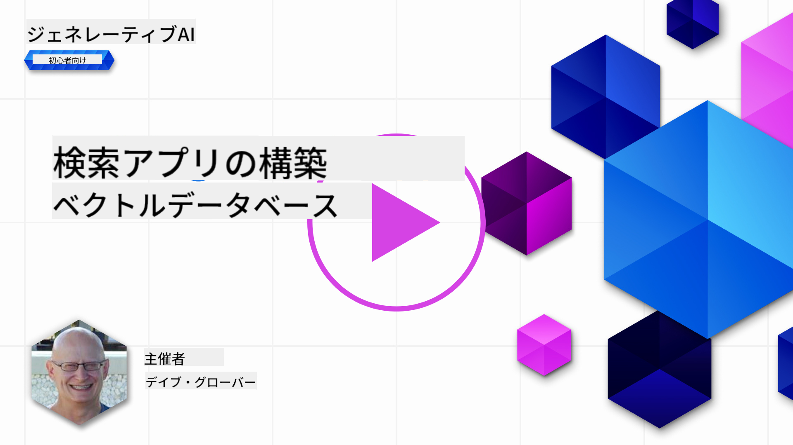
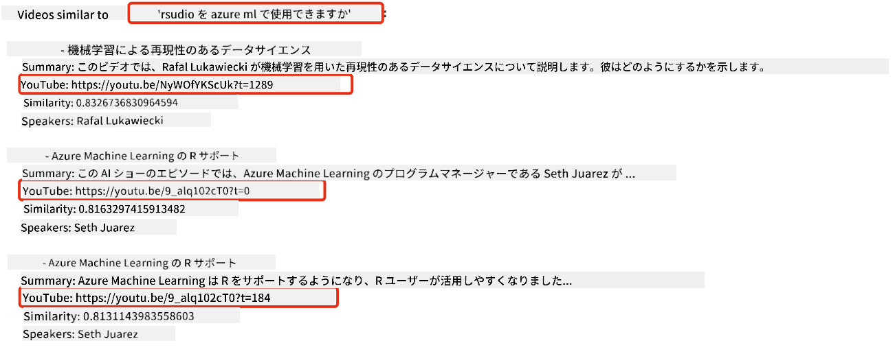
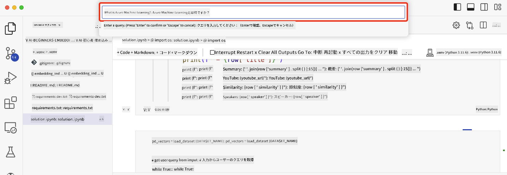

<!--
CO_OP_TRANSLATOR_METADATA:
{
  "original_hash": "d46aad0917a1a342d613e2c13d457da5",
  "translation_date": "2025-07-09T12:49:56+00:00",
  "source_file": "08-building-search-applications/README.md",
  "language_code": "ja"
}
-->
# 検索アプリケーションの構築

[](https://aka.ms/gen-ai-lesson8-gh?WT.mc_id=academic-105485-koreyst)

> > _上の画像をクリックすると、このレッスンの動画が視聴できます_

LLMはチャットボットやテキスト生成だけではありません。Embeddingsを使って検索アプリケーションを作ることも可能です。Embeddingsはベクトルとも呼ばれるデータの数値表現で、データの意味的検索に利用できます。

このレッスンでは、教育系スタートアップ向けの検索アプリケーションを作成します。私たちのスタートアップは、発展途上国の学生に無料で教育を提供する非営利団体です。AIについて学べるYouTube動画を多数保有しており、学生が質問を入力してYouTube動画を検索できるアプリケーションを作りたいと考えています。

例えば、学生が「Jupyter Notebooksとは？」や「Azure MLとは？」と入力すると、質問に関連するYouTube動画のリストが返され、さらに質問の答えがある動画の該当箇所へのリンクも返されます。

## はじめに

このレッスンで扱う内容は以下の通りです：

- セマンティック検索とキーワード検索の違い
- テキストEmbeddingsとは何か
- テキストEmbeddingsインデックスの作成
- テキストEmbeddingsインデックスの検索方法

## 学習目標

このレッスンを終えた後、あなたは以下のことができるようになります：

- セマンティック検索とキーワード検索の違いを説明できる
- テキストEmbeddingsについて説明できる
- Embeddingsを使ってデータを検索するアプリケーションを作成できる

## なぜ検索アプリケーションを作るのか？

検索アプリケーションを作ることで、Embeddingsを使ったデータ検索の仕組みを理解できます。また、学生が情報を素早く見つけられる検索アプリケーションの構築方法も学べます。

このレッスンでは、Microsoftの[AI Show](https://www.youtube.com/playlist?list=PLlrxD0HtieHi0mwteKBOfEeOYf0LJU4O1) YouTubeチャンネルの動画の文字起こしを元にしたEmbeddingインデックスを使います。AI ShowはAIや機械学習を教えるYouTubeチャンネルです。Embeddingインデックスには2023年10月までの動画文字起こしのEmbeddingsが含まれています。このインデックスを使ってスタートアップ向けの検索アプリケーションを作成します。検索アプリは質問の答えがある動画の該当箇所へのリンクも返すため、学生が必要な情報を素早く見つけるのに役立ちます。

以下は「can you use rstudio with azure ml?」という質問に対するセマンティッククエリの例です。YouTubeのURLにはタイムスタンプが含まれており、質問の答えがある動画の箇所に直接アクセスできます。



## セマンティック検索とは？

セマンティック検索とは何か気になるかもしれません。セマンティック検索は、クエリ内の単語の意味（セマンティクス）を利用して関連性の高い結果を返す検索手法です。

例えば、車を買いたいときに「my dream car」と検索したとします。セマンティック検索は「車について夢を見ている」のではなく「理想の車を探している」と理解し、意図に合った結果を返します。一方、キーワード検索は文字通り「車の夢」を検索するため、関連性の低い結果が返されることがあります。

## テキストEmbeddingsとは？

[テキストEmbeddings](https://en.wikipedia.org/wiki/Word_embedding?WT.mc_id=academic-105485-koreyst)は、[自然言語処理](https://en.wikipedia.org/wiki/Natural_language_processing?WT.mc_id=academic-105485-koreyst)で使われるテキストの表現技術です。テキストEmbeddingsはテキストの意味を数値で表現したもので、機械が理解しやすい形にデータを変換します。Embeddingsを作るモデルは多数ありますが、このレッスンではOpenAI Embedding Modelを使った生成に焦点を当てます。

例として、AI Showのエピソードの文字起こしに以下のテキストがあったとします：

```text
Today we are going to learn about Azure Machine Learning.
```

このテキストをOpenAI Embedding APIに渡すと、1536個の数値（ベクトル）が返されます。ベクトルの各数値はテキストの異なる側面を表しています。簡潔にするため、最初の10個の数値を示します。

```python
[-0.006655829958617687, 0.0026128944009542465, 0.008792596869170666, -0.02446001023054123, -0.008540431968867779, 0.022071078419685364, -0.010703742504119873, 0.003311325330287218, -0.011632772162556648, -0.02187200076878071, ...]
```

## Embeddingインデックスはどう作られるのか？

このレッスンのEmbeddingインデックスは一連のPythonスクリプトで作成されました。スクリプトと手順はこのレッスンの'scripts'フォルダー内の[README](./scripts/README.md?WT.mc_id=academic-105485-koreyst)にあります。レッスンを進めるだけならスクリプトを実行する必要はなく、Embeddingインデックスは提供されています。

スクリプトの処理内容は以下の通りです：

1. [AI Show](https://www.youtube.com/playlist?list=PLlrxD0HtieHi0mwteKBOfEeOYf0LJU4O1)プレイリスト内の各YouTube動画の文字起こしをダウンロード。
2. [OpenAI Functions](https://learn.microsoft.com/azure/ai-services/openai/how-to/function-calling?WT.mc_id=academic-105485-koreyst)を使い、文字起こしの最初の3分から話者名を抽出しようと試みる。話者名は`embedding_index_3m.json`というEmbeddingインデックスに保存。
3. 文字起こしテキストを**3分間のテキストセグメント**に分割。セグメント間で約20語を重複させ、Embeddingsが途中で切れないようにし、検索の文脈を向上。
4. 各テキストセグメントをOpenAI Chat APIに渡し、60語に要約。要約も`embedding_index_3m.json`に保存。
5. 最後にテキストセグメントをOpenAI Embedding APIに渡し、1536次元のベクトルを取得。セグメントとベクトルは`embedding_index_3m.json`に保存。

### ベクトルデータベース

レッスンの簡便さのため、Embeddingインデックスは`embedding_index_3m.json`というJSONファイルに保存され、Pandas DataFrameに読み込まれます。しかし実際の運用では、Embeddingインデックスは[Azure Cognitive Search](https://learn.microsoft.com/training/modules/improve-search-results-vector-search?WT.mc_id=academic-105485-koreyst)、[Redis](https://cookbook.openai.com/examples/vector_databases/redis/readme?WT.mc_id=academic-105485-koreyst)、[Pinecone](https://cookbook.openai.com/examples/vector_databases/pinecone/readme?WT.mc_id=academic-105485-koreyst)、[Weaviate](https://cookbook.openai.com/examples/vector_databases/weaviate/readme?WT.mc_id=academic-105485-koreyst)などのベクトルデータベースに保存されます。

## コサイン類似度の理解

テキストEmbeddingsについて学んだので、次はEmbeddingsを使ってデータを検索し、特にコサイン類似度を用いてクエリに最も近いEmbeddingsを見つける方法を学びます。

### コサイン類似度とは？

コサイン類似度は2つのベクトル間の類似度を測る指標で、`最近傍検索`とも呼ばれます。コサイン類似度検索を行うには、まずOpenAI Embedding APIでクエリテキストをベクトル化します。次にクエリベクトルとEmbeddingインデックス内の各ベクトルとのコサイン類似度を計算します。EmbeddingインデックスにはYouTube文字起こしの各テキストセグメントのベクトルが含まれています。最後に類似度の高い順に結果を並べ替え、最も類似したテキストセグメントを特定します。

数学的には、コサイン類似度は多次元空間に投影された2つのベクトル間の角度のコサインを測ります。この指標は、ユークリッド距離で離れていても角度が小さければ類似度が高いと判断できるため有用です。詳しい数式は[コサイン類似度](https://en.wikipedia.org/wiki/Cosine_similarity?WT.mc_id=academic-105485-koreyst)を参照してください。

## 最初の検索アプリケーションを作ろう

次に、Embeddingsを使った検索アプリケーションの作り方を学びます。この検索アプリは学生が質問を入力して動画を検索でき、質問の答えがある動画の該当箇所へのリンクも返します。

このソリューションはWindows 11、macOS、Ubuntu 22.04上でPython 3.10以降を使って構築・テストされています。Pythonは[python.org](https://www.python.org/downloads/?WT.mc_id=academic-105485-koreyst)からダウンロード可能です。

## 課題 - 学生が使える検索アプリケーションを作ろう

レッスンの冒頭で紹介したスタートアップのために、学生が使える検索アプリケーションを作成する課題です。

この課題では、検索アプリケーション構築に使うAzure OpenAIサービスを作成します。以下のAzure OpenAIサービスを作成してください。課題を完了するにはAzureサブスクリプションが必要です。

### Azure Cloud Shellを起動する

1. [Azureポータル](https://portal.azure.com/?WT.mc_id=academic-105485-koreyst)にサインイン。
2. Azureポータル右上のCloud Shellアイコンを選択。
3. 環境タイプとして**Bash**を選択。

#### リソースグループを作成する

> この手順では、East USリージョンに「semantic-video-search」という名前のリソースグループを使います。  
> リソースグループ名は変更可能ですが、リソースの場所を変える場合は  
> [モデルの利用可能性テーブル](https://aka.ms/oai/models?WT.mc_id=academic-105485-koreyst)を確認してください。

```shell
az group create --name semantic-video-search --location eastus
```

#### Azure OpenAI Serviceリソースを作成する

Azure Cloud Shellから以下のコマンドを実行してAzure OpenAI Serviceリソースを作成します。

```shell
az cognitiveservices account create --name semantic-video-openai --resource-group semantic-video-search \
    --location eastus --kind OpenAI --sku s0
```

#### エンドポイントとキーを取得する

Azure Cloud Shellから以下のコマンドを実行し、Azure OpenAI Serviceリソースのエンドポイントとキーを取得します。

```shell
az cognitiveservices account show --name semantic-video-openai \
   --resource-group  semantic-video-search | jq -r .properties.endpoint
az cognitiveservices account keys list --name semantic-video-openai \
   --resource-group semantic-video-search | jq -r .key1
```

#### OpenAI Embeddingモデルをデプロイする

Azure Cloud Shellから以下のコマンドを実行してOpenAI Embeddingモデルをデプロイします。

```shell
az cognitiveservices account deployment create \
    --name semantic-video-openai \
    --resource-group  semantic-video-search \
    --deployment-name text-embedding-ada-002 \
    --model-name text-embedding-ada-002 \
    --model-version "2"  \
    --model-format OpenAI \
    --sku-capacity 100 --sku-name "Standard"
```

## ソリューション

GitHub Codespacesで[solution notebook](../../../08-building-search-applications/python/aoai-solution.ipynb)を開き、Jupyter Notebookの指示に従ってください。

ノートブックを実行すると、クエリ入力を求められます。入力ボックスは以下のように表示されます：



## よくできました！学習を続けましょう

このレッスンを終えたら、[Generative AI Learning collection](https://aka.ms/genai-collection?WT.mc_id=academic-105485-koreyst)でさらにGenerative AIの知識を深めましょう！

次のレッスン9では、[画像生成アプリケーションの作り方](../09-building-image-applications/README.md?WT.mc_id=academic-105485-koreyst)を学びます！

**免責事項**：  
本書類はAI翻訳サービス「[Co-op Translator](https://github.com/Azure/co-op-translator)」を使用して翻訳されました。正確性を期しておりますが、自動翻訳には誤りや不正確な部分が含まれる可能性があります。原文の言語による文書が正式な情報源とみなされるべきです。重要な情報については、専門の人間による翻訳を推奨します。本翻訳の利用により生じた誤解や誤訳について、当方は一切の責任を負いかねます。