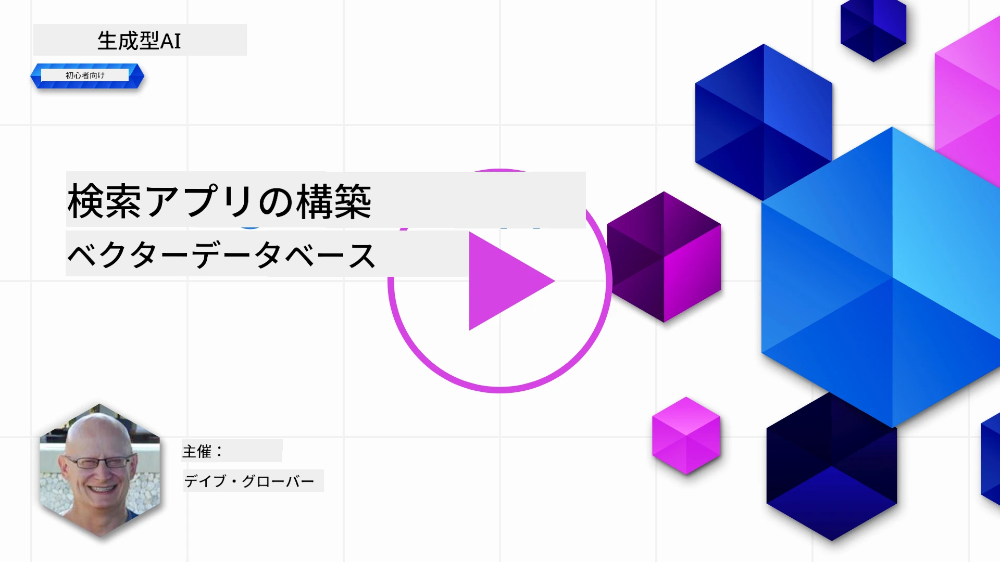
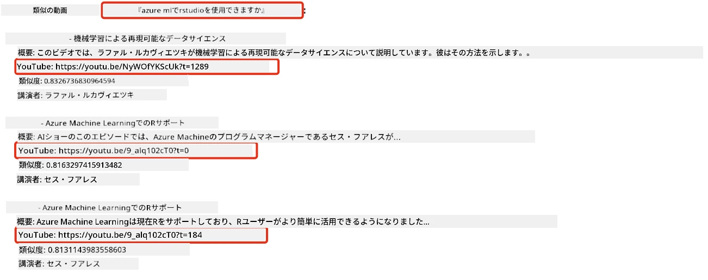
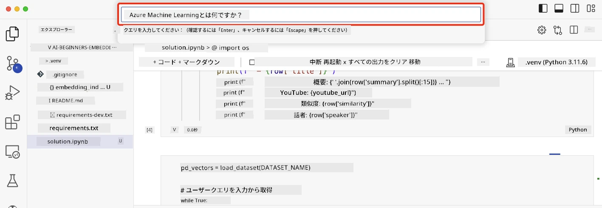

# 検索アプリケーションの構築

[](https://youtu.be/W0-nzXjOjr0?si=GcsqiTTvd7RKbo7V)

> > _上の画像をクリックするとこのレッスンのビデオが表示されます_

LLMはチャットボットやテキスト生成だけではありません。Embeddingを使用して検索アプリケーションを構築することも可能です。Embeddingはデータの数値表現、つまりベクトルとしても知られており、データの意味検索に使用できます。

このレッスンでは、教育系スタートアップの検索アプリケーションを構築します。私たちのスタートアップは非営利団体で、発展途上国の学生に無料で教育を提供しています。多数のAI学習用YouTube動画があります。このスタートアップは、学生が質問を入力してYouTube動画を検索できる検索アプリケーションを構築したいと考えています。

例えば、学生が「Jupyter Notebooksとは？」や「Azure MLとは？」と入力すると、検索アプリケーションが質問に関連したYouTube動画のリストを返し、さらに質問の答えがある動画内の場所へのリンクも返します。

## はじめに

このレッスンでは以下について学びます：

- セマンティック検索とキーワード検索の違い
- Text Embeddingsとは何か
- Text Embeddingsインデックスの作成
- Text Embeddingsインデックスの検索

## 学習目標

このレッスンを終えると、以下ができるようになります：

- セマンティック検索とキーワード検索の違いを説明する
- Text Embeddingsについて説明する
- Embeddingsを使ってデータ検索アプリケーションを作成する

## なぜ検索アプリケーションを作るのか？

検索アプリケーションを作ることで、Embeddingを使ったデータ検索の仕組みを理解できます。また、学生が素早く情報を見つけるための検索アプリケーションの作り方も学べます。

このレッスンには、Microsoftの[AI Show](https://www.youtube.com/playlist?list=PLlrxD0HtieHi0mwteKBOfEeOYf0LJU4O1)YouTubeチャンネルのトランスクリプトのEmbeddingインデックスが含まれています。AI ShowはAIと機械学習を教えるYouTubeチャンネルです。このEmbeddingインデックスには2023年10月までのYouTubeトランスクリプトそれぞれのEmbeddingが含まれています。これを使ってスタートアップの検索アプリケーションを構築します。検索アプリケーションは質問の答えがある動画内の場所へのリンクも返します。学生が必要な情報をすばやく見つけるのに最適な方法です。

例えば「rstudioをAzure MLで使えますか？」という質問に対するセマンティック検索の例です。YouTubeのURLを見ると、質問の答えがある動画内のタイムスタンプ付きURLになっています。



## セマンティック検索とは？

セマンティック検索とは何か疑問に思うかもしれません。セマンティック検索はクエリの単語の意味（セマンティクス）を使い、関連する結果を返す検索技術です。

例を挙げます。車を買おうとして「my dream car」で検索したとします。セマンティック検索はあなたが車を`夢見ている`わけではなく、理想の車を買おうとしていると理解します。意図を理解して関連結果を返します。対してキーワード検索は文字通り夢の車を探すため、無関係な結果をよく返します。

## Text Embeddingsとは？

[Text embeddings](https://en.wikipedia.org/wiki/Word_embedding?WT.mc_id=academic-105485-koreyst)は[自然言語処理](https://en.wikipedia.org/wiki/Natural_language_processing?WT.mc_id=academic-105485-koreyst)で使われるテキスト表現技術です。Text embeddingsはテキストの意味を数値で表現したものです。Embeddingは機械が理解しやすい形でデータを表現します。多くのテキストEmbeddingモデルがありますが、このレッスンではOpenAI Embedding Modelを使った生成に注目します。

例えば、以下はAI Showのエピソードのトランスクリプトの一部だとします：

```text
Today we are going to learn about Azure Machine Learning.
```

このテキストをOpenAI Embedding APIに渡すと、1536個の数字、つまりベクトルが返ってきます。ベクトルの各数字はテキストの異なる側面を表します。簡略のため、ここではベクトルの最初の10個の数字だけを示します。

```python
[-0.006655829958617687, 0.0026128944009542465, 0.008792596869170666, -0.02446001023054123, -0.008540431968867779, 0.022071078419685364, -0.010703742504119873, 0.003311325330287218, -0.011632772162556648, -0.02187200076878071, ...]
```

## Embeddingインデックスはどう作られる？

このレッスンのEmbeddingインデックスは一連のPythonスクリプトで作成しました。スクリプトと説明はこのレッスンの'scripts'フォルダー内の[README](./scripts/README.md?WT.mc_id=academic-105485-koreyst)にあります。レッスン完了にスクリプトを実行する必要はありません。Embeddingインデックスは提供されています。

スクリプトは以下の処理を行います：

1. [AI Show](https://www.youtube.com/playlist?list=PLlrxD0HtieHi0mwteKBOfEeOYf0LJU4O1)プレイリストの各YouTube動画のトランスクリプトをダウンロード。
2. [OpenAI Functions](https://learn.microsoft.com/azure/ai-foundry/openai/how-to/function-calling?WT.mc_id=academic-105485-koreyst)を使い、トランスクリプト冒頭3分から話者名を抽出。各動画の話者名をEmbeddingインデックス`embedding_index_3m.json`に保存。
3. トランスクリプトを<strong>3分ごとのテキストセグメント</strong>に分割。セグメントは次のセグメントの約20単語を重複させ、Embeddingが途切れないように検索コンテキストを改善。
4. 各セグメントをOpenAI Chat APIに渡して60単語に要約。要約もEmbeddingインデックスに保存。
5. 最後にセグメントテキストをOpenAI Embedding APIへ渡す。Embedding APIはセグメントの意味を表す1536数字のベクトルを返す。セグメントとベクトルをEmbeddingインデックスに保存。

### ベクトルデータベース

レッスンの簡易化のため、EmbeddingインデックスはJSONファイル`embedding_index_3m.json`に保存されPandas DataFrameに読み込まれます。しかし、本番環境ではEmbeddingインデックスは[Azure Cognitive Search](https://learn.microsoft.com/training/modules/improve-search-results-vector-search?WT.mc_id=academic-105485-koreyst)、[Redis](https://cookbook.openai.com/examples/vector_databases/redis/readme?WT.mc_id=academic-105485-koreyst)、[Pinecone](https://cookbook.openai.com/examples/vector_databases/pinecone/readme?WT.mc_id=academic-105485-koreyst)、[Weaviate](https://cookbook.openai.com/examples/vector_databases/weaviate/readme?WT.mc_id=academic-105485-koreyst)などのベクトルデータベースに保存されます。

## コサイン類似度の理解

Text Embeddingsについて学んだので、次はEmbeddingを使った検索、特にコサイン類似度を使ってクエリに最も類似したEmbeddingを見つける方法を学びます。

### コサイン類似度とは？

コサイン類似度は二つのベクトル間の類似度を測る指標で、`最近傍検索`とも呼ばれます。コサイン類似度検索を行うには、OpenAI Embedding APIでクエリテキストをベクトル化し、クエリベクトルとEmbeddingインデックス内の各ベクトルのコサイン類似度を計算します。EmbeddingインデックスにはYouTubeトランスクリプトの各テキストセグメントのベクトルがあります。最後にコサイン類似度でソートし、類似度の高いテキストセグメントがクエリに最も類似したものになります。

数学的には、コサイン類似度は多次元空間に投影された二つのベクトル間の角度のコサインを測定します。これは有用で、サイズの違いでユークリッド距離が離れていても角度が小さければコサイン類似度は高いからです。詳しくは[コサイン類似度](https://en.wikipedia.org/wiki/Cosine_similarity?WT.mc_id=academic-105485-koreyst)をご覧ください。

## 最初の検索アプリケーションの構築

次に、Embeddingを使った検索アプリケーションの構築方法を学びます。この検索アプリケーションは学生が質問を入力して動画を検索できます。質問に関連する動画のリストと、答えがある動画内の場所へのリンクを返します。

このソリューションはWindows 11、macOS、Ubuntu 22.04上でPython 3.10以降を使って構築・テストしました。[python.org](https://www.python.org/downloads/?WT.mc_id=academic-105485-koreyst)からPythonをダウンロードできます。

## 課題 - 学生が使える検索アプリケーション構築

レッスン冒頭で紹介したスタートアップを元に、今度は学生が評価に使える検索アプリケーションを作ります。

この課題では、検索アプリケーション作成に使うAzure OpenAIサービスを作成します。以下のAzure OpenAIサービスを作成してください。この課題を行うにはAzureサブスクリプションが必要です。

### Azure Cloud Shellの開始

1. [Azure portal](https://portal.azure.com/?WT.mc_id=academic-105485-koreyst)にサインインする。
2. Azureポータルの右上隅のCloud Shellアイコンを選択する。
3. 環境タイプとして<strong>Bash</strong>を選択する。

#### リソースグループの作成

> この手順ではEast USの「semantic-video-search」という名前のリソースグループを使用します。
> リソースグループの名前は変更可能ですが、リソースの場所を変更する場合は、
> [モデルの利用可能性表](https://aka.ms/oai/models?WT.mc_id=academic-105485-koreyst)を確認してください。

```shell
az group create --name semantic-video-search --location eastus
```

#### Azure OpenAIサービスリソースの作成

Azure Cloud Shellから以下のコマンドを実行し、Azure OpenAIサービスリソースを作成します。

```shell
az cognitiveservices account create --name semantic-video-openai --resource-group semantic-video-search \
    --location eastus --kind OpenAI --sku s0
```

#### このアプリケーションで使用するエンドポイントとキーの取得

Azure Cloud Shellから以下のコマンドを実行し、Azure OpenAIサービスリソースのエンドポイントとキーを取得します。

```shell
az cognitiveservices account show --name semantic-video-openai \
   --resource-group  semantic-video-search | jq -r .properties.endpoint
az cognitiveservices account keys list --name semantic-video-openai \
   --resource-group semantic-video-search | jq -r .key1
```

#### OpenAI Embeddingモデルのデプロイ

Azure Cloud Shellから以下のコマンドを実行し、OpenAI Embeddingモデルをデプロイします。

```shell
az cognitiveservices account deployment create \
    --name semantic-video-openai \
    --resource-group  semantic-video-search \
    --deployment-name text-embedding-ada-002 \
    --model-name text-embedding-ada-002 \
    --model-version "2"  \
    --model-format OpenAI \
    --sku-capacity 100 --sku-name "Standard"
```

## ソリューション

GitHub Codespacesで[ソリューションノートブック](./python/aoai-solution.ipynb?WT.mc_id=academic-105485-koreyst)を開き、Jupyterノートブックの指示に従ってください。

ノートブックを実行するとクエリ入力を求められます。入力ボックスは以下のように表示されます：



## お疲れさまでした！学習を続けましょう

このレッスンを終えたら、[生成AI学習コレクション](https://aka.ms/genai-collection?WT.mc_id=academic-105485-koreyst)で生成AIの知識をさらに深めましょう！

次のレッスン9では[画像生成アプリケーションの構築](../09-building-image-applications/README.md?WT.mc_id=academic-105485-koreyst)について学びます！

---

<!-- CO-OP TRANSLATOR DISCLAIMER START -->
**免責事項**：
本書類は AI 翻訳サービス [Co-op Translator](https://github.com/Azure/co-op-translator) を使用して翻訳されています。正確性を期していますが、自動翻訳には誤りや不正確な部分が含まれる可能性があることをご承知おきください。原文の原語版が正式な情報源とみなされるべきです。重要な情報については、専門の人間による翻訳を推奨します。本翻訳の利用により生じたいかなる誤解や解釈違いについても、当方は責任を負いかねます。
<!-- CO-OP TRANSLATOR DISCLAIMER END -->