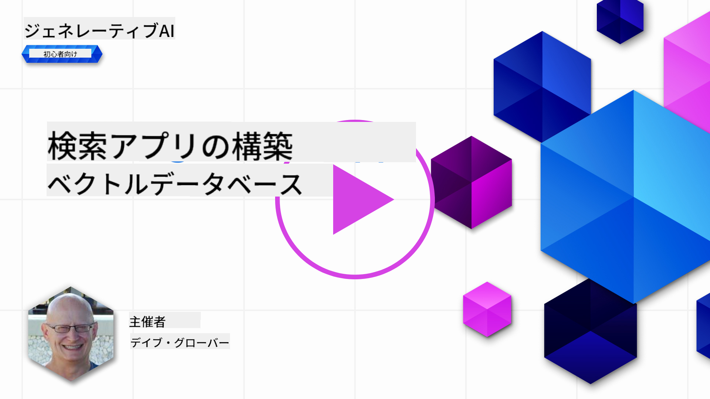
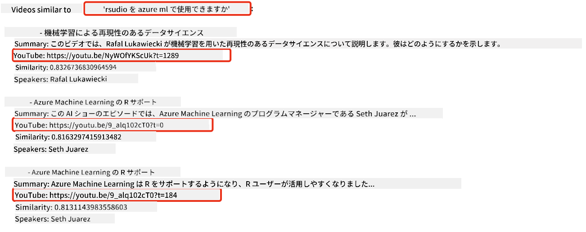
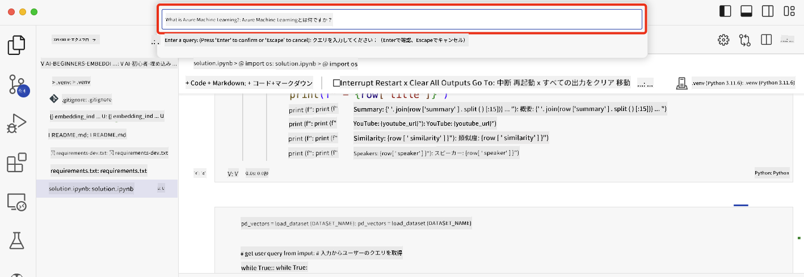

<!--
CO_OP_TRANSLATOR_METADATA:
{
  "original_hash": "d46aad0917a1a342d613e2c13d457da5",
  "translation_date": "2025-06-25T16:18:18+00:00",
  "source_file": "08-building-search-applications/README.md",
  "language_code": "ja"
}
-->
# 検索アプリケーションの構築

[](https://aka.ms/gen-ai-lesson8-gh?WT.mc_id=academic-105485-koreyst)

> > _このレッスンのビデオを見るには、上の画像をクリックしてください_

LLMにはチャットボットやテキスト生成以外にも多くの可能性があります。Embeddingを使用して検索アプリケーションを構築することも可能です。Embeddingはデータの数値表現であり、ベクトルとも呼ばれ、データのセマンティック検索に利用できます。

このレッスンでは、私たちの教育系スタートアップのために検索アプリケーションを構築します。私たちのスタートアップは、発展途上国の学生に無料の教育を提供する非営利団体です。AIについて学ぶために学生が利用できる多くのYouTube動画を所有しています。学生が質問を入力してYouTube動画を検索できる検索アプリケーションを構築したいと考えています。

例えば、学生が「Jupyter Notebookとは何ですか？」や「Azure MLとは何ですか？」と入力すると、検索アプリケーションは質問に関連するYouTube動画のリストを返し、さらに良いことに、質問の答えが動画のどこにあるかへのリンクを返します。

## はじめに

このレッスンでは以下をカバーします：

- セマンティック検索とキーワード検索の違い
- テキストEmbeddingとは何か
- テキストEmbeddingインデックスの作成
- テキストEmbeddingインデックスの検索

## 学習目標

このレッスンを完了すると、以下ができるようになります：

- セマンティック検索とキーワード検索の違いを説明する
- テキストEmbeddingが何であるかを説明する
- Embeddingを使用してデータを検索するアプリケーションを作成する

## なぜ検索アプリケーションを構築するのか？

検索アプリケーションを作成することで、Embeddingを使用してデータを検索する方法を理解することができます。また、学生が情報を迅速に見つけるための検索アプリケーションを構築する方法を学ぶことができます。

このレッスンには、Microsoft [AI Show](https://www.youtube.com/playlist?list=PLlrxD0HtieHi0mwteKBOfEeOYf0LJU4O1) YouTubeチャンネルのトランスクリプトのEmbeddingインデックスが含まれています。AI ShowはAIと機械学習について教えるYouTubeチャンネルです。Embeddingインデックスには2023年10月までの各YouTubeトランスクリプトのEmbeddingが含まれています。このEmbeddingインデックスを使用して、私たちのスタートアップのために検索アプリケーションを構築します。検索アプリケーションは、質問の答えが動画のどこにあるかへのリンクを返します。これは、学生が必要な情報を迅速に見つけるのに役立ちます。

以下は、「Azure MLでRStudioを使用できますか？」という質問に対するセマンティッククエリの例です。YouTubeのURLを確認してください。質問の答えが動画のどこにあるかを示すタイムスタンプが含まれています。



## セマンティック検索とは？

さて、セマンティック検索とは何か疑問に思うかもしれません。セマンティック検索は、クエリ内の単語の意味を利用して関連する結果を返す検索技術です。

セマンティック検索の例を見てみましょう。車を買おうとしているときに「私の夢の車」と検索するかもしれません。セマンティック検索は、あなたが車について`dreaming`しているのではなく、あなたの`ideal`車を買おうとしていることを理解します。セマンティック検索はあなたの意図を理解し、関連する結果を返します。代わりに`keyword search`を使用すると、車に関する夢を文字通り検索し、しばしば関連性のない結果を返します。

## テキストEmbeddingとは？

[テキストEmbedding](https://en.wikipedia.org/wiki/Word_embedding?WT.mc_id=academic-105485-koreyst)は、[自然言語処理](https://en.wikipedia.org/wiki/Natural_language_processing?WT.mc_id=academic-105485-koreyst)で使用されるテキスト表現技術です。テキストEmbeddingはテキストのセマンティックな数値表現です。Embeddingはデータを機械が理解しやすい形で表現するために使用されます。テキストEmbeddingを構築するための多くのモデルがありますが、このレッスンではOpenAI Embedding Modelを使用してEmbeddingを生成することに焦点を当てます。

ここに例があります。以下のテキストがAI Show YouTubeチャンネルのエピソードのトランスクリプトに含まれているとします。

```text
Today we are going to learn about Azure Machine Learning.
```

このテキストをOpenAI Embedding APIに渡すと、1536個の数値からなるEmbedding（ベクトル）が返されます。ベクトルの各数値はテキストの異なる側面を表しています。簡潔にするために、ベクトルの最初の10個の数値を示します。

```python
[-0.006655829958617687, 0.0026128944009542465, 0.008792596869170666, -0.02446001023054123, -0.008540431968867779, 0.022071078419685364, -0.010703742504119873, 0.003311325330287218, -0.011632772162556648, -0.02187200076878071, ...]
```

## Embeddingインデックスはどのように作成されるのか？

このレッスンのEmbeddingインデックスは一連のPythonスクリプトで作成されました。スクリプトと手順は、レッスンの'scripts'フォルダ内の[README](./scripts/README.md?WT.mc_id=academic-105485-koreyst)にあります。このレッスンを完了するためにスクリプトを実行する必要はありません。Embeddingインデックスは提供されています。

スクリプトは以下の操作を行います：

1. [AI Show](https://www.youtube.com/playlist?list=PLlrxD0HtieHi0mwteKBOfEeOYf0LJU4O1)プレイリスト内の各YouTube動画のトランスクリプトがダウンロードされます。
2. [OpenAI Functions](https://learn.microsoft.com/azure/ai-services/openai/how-to/function-calling?WT.mc_id=academic-105485-koreyst)を使用して、YouTubeトランスクリプトの最初の3分からスピーカー名を抽出しようとします。各動画のスピーカー名はEmbeddingインデックスに`embedding_index_3m.json`として保存されます。
3. トランスクリプトテキストは**3分のテキストセグメント**に分割されます。セグメントには次のセグメントから約20語が重複して含まれ、セグメントのEmbeddingが切り取られないようにし、より良い検索コンテキストを提供します。
4. 各テキストセグメントはOpenAI Chat APIに渡され、60語に要約されます。この要約もEmbeddingインデックスに`embedding_index_3m.json`として保存されます。
5. 最後に、セグメントテキストはOpenAI Embedding APIに渡されます。Embedding APIはセグメントのセマンティックな意味を表す1536個の数値のベクトルを返します。セグメントとOpenAI EmbeddingベクトルはEmbeddingインデックスに`embedding_index_3m.json`として保存されます。

### ベクトルデータベース

レッスンの簡潔さのために、Embeddingインデックスは`embedding_index_3m.json`という名前のJSONファイルに保存され、Pandas DataFrameにロードされます。しかし、実際の運用では、Embeddingインデックスは[Azure Cognitive Search](https://learn.microsoft.com/training/modules/improve-search-results-vector-search?WT.mc_id=academic-105485-koreyst)、[Redis](https://cookbook.openai.com/examples/vector_databases/redis/readme?WT.mc_id=academic-105485-koreyst)、[Pinecone](https://cookbook.openai.com/examples/vector_databases/pinecone/readme?WT.mc_id=academic-105485-koreyst)、[Weaviate](https://cookbook.openai.com/examples/vector_databases/weaviate/readme?WT.mc_id=academic-105485-koreyst)などのベクトルデータベースに保存されます。

## コサイン類似度の理解

テキストEmbeddingについて学んだので、次はテキストEmbeddingを使用してデータを検索し、特にコサイン類似度を使用して特定のクエリに最も類似したEmbeddingを見つける方法を学びます。

### コサイン類似度とは？

コサイン類似度は2つのベクトル間の類似度を測定する方法で、`nearest neighbor search`と呼ばれることもあります。コサイン類似度検索を行うには、OpenAI Embedding APIを使用してクエリテキストをベクトル化する必要があります。その後、クエリベクトルとEmbeddingインデックス内の各ベクトルとのコサイン類似度を計算します。Embeddingインデックスには各YouTubeトランスクリプトのテキストセグメントのベクトルがあります。最後に、コサイン類似度で結果をソートし、コサイン類似度が最も高いテキストセグメントがクエリに最も類似しています。

数学的な観点から、コサイン類似度は多次元空間に投影された2つのベクトル間の角度のコサインを測定します。この測定は有益です。なぜなら、サイズのためにユークリッド距離で離れている2つの文書が、依然として小さな角度を持ち、それゆえに高いコサイン類似度を持つことができるからです。コサイン類似度の方程式についての詳細は、[コサイン類似度](https://en.wikipedia.org/wiki/Cosine_similarity?WT.mc_id=academic-105485-koreyst)を参照してください。

## 初めての検索アプリケーションの構築

次に、Embeddingを使用して検索アプリケーションを構築する方法を学びます。検索アプリケーションは、学生が質問を入力して動画を検索できるようにします。検索アプリケーションは質問に関連する動画のリストを返します。また、質問の答えが動画のどこにあるかへのリンクも返します。

このソリューションは、Windows 11、macOS、Ubuntu 22.04でPython 3.10以降を使用して構築およびテストされました。Pythonは[python.org](https://www.python.org/downloads/?WT.mc_id=academic-105485-koreyst)からダウンロードできます。

## 課題 - 学生をサポートするための検索アプリケーションの構築

このレッスンの最初に私たちのスタートアップを紹介しました。今度は学生が評価のために検索アプリケーションを構築できるようにします。

この課題では、検索アプリケーションを構築するために使用するAzure OpenAI Servicesを作成します。以下のAzure OpenAI Servicesを作成します。この課題を完了するにはAzureサブスクリプションが必要です。

### Azure Cloud Shellの起動

1. [Azureポータル](https://portal.azure.com/?WT.mc_id=academic-105485-koreyst)にサインインします。
2. Azureポータルの右上隅にあるCloud Shellアイコンを選択します。
3. 環境タイプとして**Bash**を選択します。

#### リソースグループの作成

> これらの手順では、East USの"semantic-video-search"という名前のリソースグループを使用しています。
> リソースグループの名前を変更することはできますが、リソースの場所を変更する際には、
> [モデルの可用性表](https://aka.ms/oai/models?WT.mc_id=academic-105485-koreyst)を確認してください。

```shell
az group create --name semantic-video-search --location eastus
```

#### Azure OpenAI Serviceリソースの作成

Azure Cloud Shellから、以下のコマンドを実行してAzure OpenAI Serviceリソースを作成します。

```shell
az cognitiveservices account create --name semantic-video-openai --resource-group semantic-video-search \
    --location eastus --kind OpenAI --sku s0
```

#### このアプリケーションで使用するエンドポイントとキーの取得

Azure Cloud Shellから、以下のコマンドを実行してAzure OpenAI Serviceリソースのエンドポイントとキーを取得します。

```shell
az cognitiveservices account show --name semantic-video-openai \
   --resource-group  semantic-video-search | jq -r .properties.endpoint
az cognitiveservices account keys list --name semantic-video-openai \
   --resource-group semantic-video-search | jq -r .key1
```

#### OpenAI Embeddingモデルのデプロイ

Azure Cloud Shellから、以下のコマンドを実行してOpenAI Embeddingモデルをデプロイします。

```shell
az cognitiveservices account deployment create \
    --name semantic-video-openai \
    --resource-group  semantic-video-search \
    --deployment-name text-embedding-ada-002 \
    --model-name text-embedding-ada-002 \
    --model-version "2"  \
    --model-format OpenAI \
    --sku-capacity 100 --sku-name "Standard"
```

## ソリューション

GitHub Codespacesで[ソリューションノートブック](../../../08-building-search-applications/python/aoai-solution.ipynb)を開き、Jupyter Notebookの指示に従ってください。

ノートブックを実行すると、クエリを入力するように求められます。入力ボックスは以下のようになります：



## 素晴らしい仕事です！学習を続けましょう

このレッスンを完了した後は、[生成AI学習コレクション](https://aka.ms/genai-collection?WT.mc_id=academic-105485-koreyst)をチェックして、生成AIの知識をさらに深めましょう！

レッスン9に進み、[画像生成アプリケーションの構築](../09-building-image-applications/README.md?WT.mc_id=academic-105485-koreyst)について学びましょう！

**免責事項**:  
このドキュメントはAI翻訳サービス[Co-op Translator](https://github.com/Azure/co-op-translator)を使用して翻訳されています。正確さを期すために努力していますが、自動翻訳には誤りや不正確さが含まれる場合があります。元の言語でのドキュメントが信頼できる情報源と見なされるべきです。重要な情報については、専門の人間による翻訳をお勧めします。この翻訳の使用に起因する誤解や誤訳について、当社は責任を負いません。